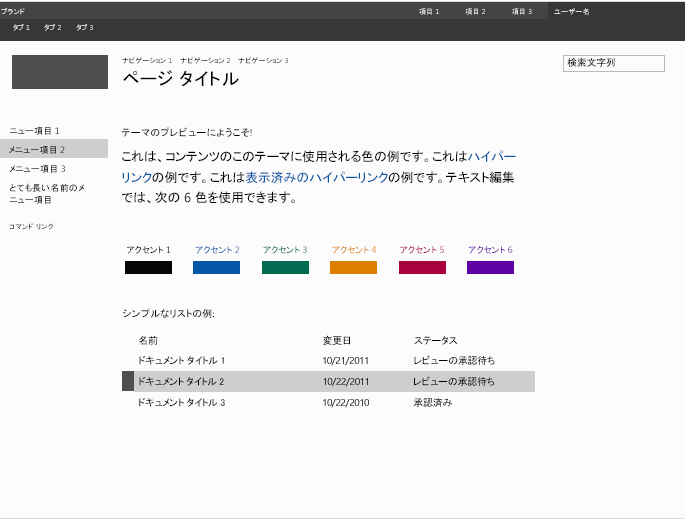

# SharePoint 2013 でのマスター ページ プレビュー ファイルを作成する方法
SharePoint テーマ エクスペリエンスで使用され、選択されたテーマ コンポーネントのプレビューを表示するマスター ページ プレビュー ファイルを作成する方法について説明します。
[ **外観の変更**] ウィザードは、SharePoint テーマ エクスペリエンスへのエントリ ポイントです。デザイン ギャラリーは [ **外観の変更**] ウィザードの最初ページであり、使用可能なデザインのサムネイル ビューを表示します。ユーザーはサイトのデザインを選択してから、次のページに進み、そこでデザインをカスタマイズできます。デザインをサイトに適用する前に、サイトをプレビューすることができます。サムネイルおよびプレビューのイメージを生成するために、マスター ページ プレビュー ファイルが使用されます。対応するプレビュー ファイルがマスター ページにない場合、テーマ設定機能でそのマスター ページを使用することはできません。
  
    
    

詳細については、「 [SharePoint 2013 のテーマの概要](themes-overview-for-sharepoint-2013.md)」を参照してください。
## マスター ページ プレビュー ファイルの使用に関するて知っておくべき中心概念
<a name="Introduction"> </a>

表 1 に、マスター ページ プレビュー ファイルの使用に関する中心概念を理解するのに役に立つ記事を示します。
  
    
    

**表 2 マスター ページ プレビュー ファイルの使用に関する中心概念**


|**記事のタイトル**|**説明**|
|:-----|:-----|
| [SharePoint 2013 のテーマの概要](themes-overview-for-sharepoint-2013.md) <br/> |SharePoint 2013 のテーマ エクスペリエンスについて説明します。  <br/> |
| [発行サイトのテーマを選択する ](http://office.microsoft.com/ja-jp/office365-sharepoint-online-enterprise-help/choose-a-theme-for-your-publishing-site-HA102891580.aspx) <br/> |[ **外観の変更**] ウィザードを使用して SharePoint サイトの外観を変更する方法について説明します。  <br/> |
   

## マスター ページ プレビュー ファイルとは
<a name="section1"> </a>

マスター ページ プレビュー ファイル (.preview files) は特別にフォーマットされたファイルであり、既定のカラー パレット、既定のフォント パターン、トークン化された CSS、およびトークン化された HTML のセクションが含まれます。マスター ページ プレビュー ファイルには、対応するマスター ページと同じ名前 (拡張子は除く) を使用する必要があります。たとえば、article.master という名前のマスター ページがある場合、対応するマスター ページ プレビュー ファイルは article.preview という名前が付けられます。マスター ページとマスター ページ プレビューはマスター ページ ギャラリーに格納されます。
  
    
    
マスター ページ プレビュー ファイルの構造を以下に示します。
  
    
    


```HTML
Default color palette
[SECTION]
Default font scheme
[SECTION]
CSS
[SECTION]
HTML
```

マスター ページ プレビュー ファイルの内容は以下のとおりです。
  
    
    

-  _既定のカラー パレット_ は、既定として使用する、テーマ ギャラリー (http:// _SiteColltionName_/_catalogs/theme/15/) にある .spcolor ファイルです。既定のカラー パレットは、既定の状態のマスター ページで使用される色に対応します。すなわち、[ **外観の変更**] ウィザードでユーザーによってカラー パレットが選択される前の状態です。
    
  
-  _既定のフォント パターン_ は、既定として使用する、テーマ ギャラリー (http:// _SiteCollectionName_/_catalogs/theme/15/) にある .spfont ファイルです。既定のフォント パターンは、既定の状態のマスター ページで使用されるフォントに対応します。すなわち、[ **外観の変更**] ウィザードでユーザーによってフォント パターンが選択される前の状態です。
    
  
-  _CSS_ は、カスケード スタイル シート (CSS) が含まれているセクションです。すべての CSS クラスの先頭に[ID] を付ける必要があります。以下の例は、マスター ページ プレビュー ファイルでの CSS セクションの部分を示しています。
    
  ```
  
[ID] #dgp-pageContainer
{
    background-color: [T_THEME_COLOR_PAGEBACKGROUND];
    color: [T_THEME_COLOR_BODYTEXT];
    width: 100%;
    height:100%;     
    background-image: url('[T_IMAGE]');       
    background-size: cover;
    font-family: [T_BODY_FONT];   
}
  ```

-  _HTML_ は、プレビューの HTML 構造を定義する HTML セクションです。
    
  

> **メモ**
> サイズはすべて、マスター ページ プレビュー ファイルに相対単位で指定してください。たとえば、サイズをパーセントまたは em 測定値として指定できます。em 測定値の詳細については、『W3C CSS Values and Units Module Level 3 Working Draft』の「 [5.1.1. Font-relative lengths: the 'em', 'ex', 'ch', 'rem' units](http://www.w3.org/TR/2012/WD-css3-values-20120308/#font-relative-lengths)」を参照してください。 
  
    
    

トークンはマスター ページ プレビュー ファイルの随所で使用されます。トークンは、生成されたプレビュー内のテキスト、カラー値、またはフォント値で置換される文字列値です。以下のセクションに、使用可能なトークンとトークンの使用方法について説明します。
  
    
    

### その他のトークン

その他のトークンは、プレビューにおいて指定された高さおよび幅の値と置換されます。
  
    
    

**表 2. その他のトークン**


|**トークン名**|**説明**|
|:-----|:-----|
|[T_HEIGHT]  <br/> |プレビューの高さです。  <br/> |
|[T_WIDTH]  <br/> |プレビューの幅です。  <br/> |
|[T_IMAGE]  <br/> |オプションの背景イメージの URL です。  <br/> |
|[T_IMGHEIGHT]  <br/> |イメージの高さです (必要な場合)。  <br/> |
|[T_IMGWIDTH]  <br/> |イメージの幅です (必要な場合)。  <br/> |
   

### カラー トークン

カラー トークンは、プレビュー イメージ内でカラー値に置換されます。表 3 に、カラー トークンの 2 つのフォーマットを説明します。 _ColorSlot_ をカラー スロットの注釈名に置き換えます。カラー トークンは、大文字である必要があります (たとえば、[T_THEME_COLOR_PAGEBACKGROUND])。使用可能なカラー トークンを確認するには、「 [SharePoint 2013 のカラー パレットとフォント](color-palettes-and-fonts-in-sharepoint-2013.md)」の「 [カラー スロットのマッピング](color-palettes-and-fonts-in-sharepoint-2013.md#colorSlots)」セクションを参照してください。
  
    
    

**表 3. カラー トークン**


|**トークン名**|**説明**|
|:-----|:-----|
|[T_THEME_COLOR_ _ColorSlot_]  <br/> |カラー スロットのカラー値が必要な場合は、このフォーマットを使用します。  <br/> |
|[T_THEME_COLOR_ _ColorSlot__AA]  <br/> |カラー スロットの 8 桁の 16 進数値が必要な場合には、このフォーマットを使用します。このフォーマットは、フィルター値で Internet Explorer の透明度および塗りつぶしを有効にする場合に役に立ちます。  <br/> |
   

### フォント トークン

フォント トークンは、プレビュー イメージ内でフォント値に置換されます。
  
    
    

- [T_ _SlotName__FONT]
    
  
 _SlotName_ をフォント スロットの名前に置換します。フォント トークンは大文字である必要があります (たとえば、[T_BODY_FONT])。フォント スロットの一覧と、フォント スロットがページ内のどこで使用されるかを確認するには、「 [SharePoint 2013 のカラー パレットとフォント](color-palettes-and-fonts-in-sharepoint-2013.md)」の「 [フォント スロット](color-palettes-and-fonts-in-sharepoint-2013.md#fontSlot)」を参照してください。
  
    
    

### テキスト コンテンツ トークン

表 4 に示したトークンは、マスター ページ プレビュー ファイルの HTML セクションで使用されます。これらのトークンは、デザイン ギャラリーのプレビュー イメージでサンプル テキストに置換されます。サンプル テキストは、サイトの残りの部分と同じ言語で表示されます。
  
    
    

**表 4. テキスト コンテンツ トークン**


|**トークン名**|**説明**|
|:-----|:-----|
|[BRANDSTRING]  <br/> |ページに表示されるブランド テキストです。事前にインストールされたテーマでは、左上隅の「ブランド」に表示されます。  <br/> |
|[SUITELINK1]  <br/> [SUITELINK2]  <br/> [SUITELINK3]  <br/> |スイート バー内に表示されるスイート リンクです。図 1 の「項目 1」、「項目 2」、「項目 3」を参照してください。  <br/> |
|[WELCOME]  <br/> |ユーザー名のテキストです。図 1 の「ユーザー名」を参照してください。  <br/> |
|[RIBBONTAB1]  <br/> [RIBBONTAB2]  <br/> [RIBBONTAB3]  <br/> |リボン タブの名前です。図 1 の「タブ 1」、「タブ 2」、「タブ 3」を参照してください。  <br/> |
|[SEARCHBOX]  <br/> |検索ボックス内のテキストです。図 1 の「検索テキスト」を参照してください。  <br/> |
|[TN1]  <br/> [TN2]  <br/> [TN3]  <br/> |水平方向のナビゲーション項目です。「ナビゲーション 1」、「ナビゲーション 2」、「ナビゲーション 3」。  <br/> |
|[TITLE]  <br/> |ページ タイトルです。「ページ タイトル」。  <br/> |
|[QL1]  <br/> [QL2]  <br/> [QL3]  <br/> [QL4]  <br/> |垂直方向のナビゲーション項目です。「メニュー項目 1」、「メニュー項目 2」、「メニュー項目 3」。  <br/> |
|[QLADD]  <br/> |垂直方向のナビゲーション項目の下にあるリンクです。図 1 の「コマンド リンク」を参照してください。  <br/> |
|[CA TABLE HEADER]  <br/> |ページ テキストの上にある見出しです。図 1 の「 テーマのプレビューにようこそ!」を参照してください。  <br/> |
|[CA TABLE DESCRIPTION]  <br/> |説明テキストです。図 1 の「これは、コンテンツのこのテーマに使用される色の例です。これはハイパーリンクの例です。…」がそれに該当します。  <br/> |
|[CA ACCENT COLORS]  <br/> |アクセントとブロックの一覧です。  <br/> |
|[CA LIST TITLE]  <br/> |リストの見出しです。図 1 の「リストの例」を参照してください。  <br/> |
|[CA TABLE]  <br/> |サンプル リストです。  <br/> |
|[SITETITLE]  <br/> |サイトのタイトルです。図 1 の「サイトのタイトル」を参照してください。  <br/> |
   

**図 1. サンプル テキストが含まれている事前インストール済みテーマ**

  
    
    

  
    
    

  
    
    

  
    
    

  
    
    

## マスター ページ プレビュー ファイルを作成する
<a name="section2"> </a>

マスター ページ プレビュー ファイルを作成するには、既存のマスター ページ プレビューを開始点として使用します。
  
    
    

### マスター ページ プレビューを作成するには


1. マスター ページ プレビューをコピーします。SharePoint 2013 には、oslo.preview および seattle.preview が含まれています。
    
  
2. マスター ページ プレビューのコピーの名前を、対応するマスター ページと一致するように変更します。たとえば、マスター ページの名前が article.master である場合、マスター ページ プレビューの名前は article.preview に変更します。
    
  
3. HTML エディターを使用して、マスター ページ プレビュー ファイルを編集します。ファイルを更新して、マスター ページのレイアウトおよび外観を反映します。
    
    > **ヒント**
      > マスター ページ プレビュー ファイルでは、サイズ値はパーセントで指定されます。以下の例は、絶対的な測定値 (ピクセル) を相対的な測定値 (パーセント) に変換する方法を示しています。ブラウザーのサイズが 1024x768 であると想定します。マスター ページに高さ 32 ピクセルの要素が存在し、その親要素がページの本体である場合、要素の高さをブラウザーの高さで割り算することによりパーセンテージを算出することができます。相対的な測定値は 4%(32/768) です。 
4. マスター ページ プレビュー ファイルをマスター ページ ギャラリーにアップロードします。
    
  
5. [ **外観の変更**] ウィザードを使用して、サイト コンテンツによるマスター ページ プレビューをテストします。
    
    > **メモ**
      > [構成された外観] リストにアイテムを追加することにより、新しいマスター ページを使用するデザインを作成することもできます。デザインはデザイン ギャラリー ([ **外観の変更**] ウィザードの先頭ページ) で使用できます。詳細については、「 [SharePoint 2013 でカスタム テーマを展開する方法](how-to-deploy-a-custom-theme-in-sharepoint-2013.md)」の「 [ユーザー インターフェイスを使用したテーマの展開](how-to-deploy-a-custom-theme-in-sharepoint-2013.md#section2)」を参照してください。 
6. 必要に応じて、手順 3 ～ 5 を繰り返します。
    
  

## その他の技術情報
<a name="bk_addresources"> </a>


-  [SharePoint 2013 のサイト デザインの開発](develop-the-site-design-in-sharepoint-2013.md)
    
  
-  [SharePoint 2013 でカスタム テーマを展開する方法](how-to-deploy-a-custom-theme-in-sharepoint-2013.md)
    
  
-  [SharePoint 2013 のカラー パレットとフォント](color-palettes-and-fonts-in-sharepoint-2013.md)
    
  
-  [SharePoint チームのブログ: SharePoint テーマでスタイルを際立たせる](http://blogs.office.com/b/sharepoint/archive/2012/10/29/show-off-your-style-with-sharepoint-theming.aspx)
    
  

