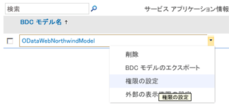
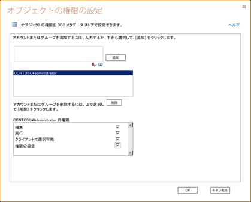
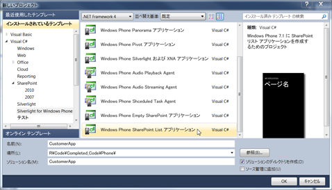

# [方法] 外部データ ソースのデータを含む SharePoint 2013 のモバイル アプリを作成する
Business Connectivity Services を使用して外部リストに接続することで、外部データ ソースのデータが含まれる簡単なモバイル アプリを SharePoint 2013で作成する方法について説明します。
SharePoint 2013では、Business Connectivity Services を使用してデータベース、エンタープライズ アプリケーション、および Web 2.0 サービスの外部データにアクセスできるモバイル アプリケーションを作成できます。モバイル デバイスからの書き戻し機能など、全面的な外部データ操作も提供できます。これを行うには、外部コンテンツ タイプに基づき、外部システムからのデータが含まれる SharePoint の特殊なタイプのリストである外部リストに接続するアプリケーションを作成します。Visual Studio 2010 Express の新しい Windows Phone SharePoint List テンプレートを利用して、外部リストに接続する Windows Phone 用アプリを迅速かつ容易に作成できます。たとえば、営業担当者が使用する Windows Phone に SharePoint の在庫リストの製品カタログを提供する Windows Phone アプリを作成できます。このトピックでは、SharePoint の外部リストに接続することで、Northwind サンプル データベースの外部データを表示する Windows Phone アプリケーションを作成する方法を解説します。この例の外部リストはカスタム OData サービスを使用して Northwind データベースに接続していますが、外部リストを使用して、BCS でサポートされているデータベースや外部システムに直接接続することもできます。Visual Studio の新しい SharePoint List テンプレートを使用して、SharePoint サイト上の外部リストにアクセスできるモバイル アプリを作成できます。この記事では、外部 Business Data Connectivity (BDC) Service モデルのアップロードから開始し、作成したモバイル アプリケーションのテストで終わる一連の手順をステップバイステップで解説します。
  
    
    

> **重要**
> Windows Phone 8 のアプリを開発している場合、Visual Studio 2010 Express の代わりに Visual Studio Express 2012 を使用する必要があります。開発環境を除いて、この記事のすべての情報が Windows Phone 8 および Windows Phone 7 の両方のアプリの作成に適用されます。 > 詳細については、「 [[方法]: SharePoint 用モバイル アプリの開発環境をセットアップする](how-to-set-up-an-environment-for-developing-mobile-apps-for-sharepoint.md)」を参照してください。 
  
    
    

## 外部データを含むモバイル アプリを作成するための前提条件

- SharePoint 2013のインストールと、外部リストを作成する SharePoint サイトおよび Northwind データベースのための BDC モデルをアップロードするための管理者権限
    
  
- Microsoft Visual Studio Express および新しい SharePoint 2013 (「 [Microsoft SharePoint SDK for Windows Phone 7.1 - 日本語](http://www.microsoft.com/ja-jp/download/details.aspx?id=30476)」から入手可能)
    
  
- exampleNorthwind_oData.bdmc 用の BDC モデル (「 [SharePoint 2013: Create a simple external list-based phone app](http://code.msdn.microsoft.com/ja-jp/sharepoint/sharepoint-2013-create-a-88800202)」からダウンロードできます)
    
  
- SharePoint 2013のインストールと、外部リストを作成する SharePoint サイトおよび Northwind データベースのための BDC モデルをアップロードするための管理者権限
    
  

## 手順 1: BDC メタデータ モデルのアップロード

BDC モデルは、Business Connectivity Services の中核を成すものです。これは、 **エンティティ** (外部コンテンツ タイプ) や **メソッド**のようなデータ構造を使用して、外部システムに関する複雑な詳細情報を抽象化した XML ファイルです。SharePoint Designer を使用して外部コンテンツ タイプを作成すると BDC モデルが自動生成されますが、一部のデータソースの種類 (.NET、OData ソースなど) では、手動または Visual Studio を使用して BDC モデルを作成する必要があります。SharePoint サーバーの全体管理を使用して BDC モデルを BDC メタデータ ストアにアップロードすると、そのモデルに定義された外部コンテンツ タイプの種類を使用して SharePoint の外部リスト (基盤となる外部システムのデータを表示するリスト) を作成できます。この手順では、SharePoint サーバーの全体管理を使用して Northwind サンプルの BDC モデルをメタデータ ストアにアップロードします。
  
    
    

1. [サーバーの全体管理] に移動します。
    
  
2. [ **アプリケーション構成の管理**] をクリックして、[ **サービス アプリケーションの管理**] をクリックします。
    
  
3. [サービス アプリケーション] ページで、[ **Business Data Connectivity Service**] を選択します。
    
  
4. BDC サービス アプリケーションのリボンで、[ **インポート**] を選択します。
    
  
5. [BDC モデルのインポート] ページで、[ **Business Data Connectivity Service**] を選択します。
    
  
6. BDC サービス アプリケーションのリボンで、[ **インポート**] を選択します。
    
  
7. [BDC モデルのインポート] ページで、[ **参照**] を選択します。
    
  
8. [ **アップロードするファイルを選択してください**] ダイアログ ボックスで、Northwind_oData.bdcm ファイルを参照して [ **開く**] をクリックします。
    
  
9. ファイルがインポートされたら、[ **OK**] をクリックします。
    
  

## 手順 2: アクセス許可

次は、モデルに記述したメソッドを実行できるユーザーを指定するために、BDC モデルにアクセス許可を設定します。これは必須の手順です。必要なタスクを実行するために必要な最小限の特権を資格情報が与えるように、権限を必要とする各ユーザーまたはグループに特定の権限を与えることをお勧めします。アクセス許可の設定の詳細については、「 [SharePoint 2013 の Business Connectivity Services の概要](http://technet.microsoft.com/ja-jp/library/ee661740.aspx)」を参照してください。このステップでは、Northwind サンプルの BDC モデルに記述されたメソッドを実行するために自分自身に許可を与えます。
  
    
    

1. [サーバーの全体管理] に移動します。
    
  
2. [ **アプリケーション構成の管理**] をクリックして、[ **サービス アプリケーションの管理**] をクリックします。
    
  
3. [サービス アプリケーション] ページで、[ **Business Data Connectivity Service**] を選択します。
    
  
4. リボンの [ **表示**] のドロップダウン リストから [ **BDC モデル**] グループを選択します。
    
  
5. BDC モデルのリストで、Northwind_oData.bdcm を選択し、[ **アクセス権の設定**] をクリックします (図 1. を参照)。
    
   **図 1. BDC モデルのアクセス許可の選択**

  

  

  

  
6. [ **オブジェクトの権限の設定**] ダイアログ ボックスで、[ **参照**] をクリックします。
    
  
7. [ **ユーザーとグループの選択**] ダイアログ ボックスで、アカウントを検索し、[ **OK**] をクリックします。
    
  
8. [ **編集**]、[ **実行**]、[ **クライアントで選択可能**]、[ **アクセス権の設定**] の順にクリックし、アクセス許可を選択します (図 2. を参照)。
    
   **図 2. オブジェクトのアクセス許可の設定**

  

  

  

  
9. [ **OK**] をクリックします。
    
  
10. リボンで [ **表示**] グループのドロップダウン リストから [ **外部コンテンツ タイプ**] を選択します。
    
  
11. 外部コンテンツ タイプのリストで、[ **顧客**] を選択し、[ **アクセス権の設定**] をクリックします。
    
  
12. [ **オブジェクトの権限の設定**] ダイアログ ボックスで、[ **参照**] ボタンをクリックし、アカウントを参照します。
    
  
13. [ **オブジェクトの権限の設定**] ダイアログ ボックスの [ **追加**] をクリックし、[ **編集**]、[ **実行**]、[ **クライアントで選択可能**]、[ **アクセス権の設定**] の順にクリックし、アクセス許可を選択します。
    
  
14. [ **権限を伝達する**] チェック ボックスがオンになっていることを確認します。
    
  
15. [ **OK**] をクリックします。
    
  

## 手順 3: 外部リストの作成

BDC モデルのアップロードとアクセス許可の設定を完了すると、BDC モデルに定義された外部コンテンツ タイプに基づいて、外部リストを作成できます。この手順では、「 [手順 1: BDC メタデータ モデルのアップロード](how-to-create-a-mobile-app-in-sharepoint-2013-that-contains-data-from-an-externa.md#HowToCreateSimpleExternalListBasedPhoneApp_Step1)」でアップロードした Northwind BDC モデルに定義されているカスタマー外部コンテンツ タイプに基づいて外部リストを作成します。
  
    
    

1. 新しいリストを作成する SharePoint サイトに移動します。
    
  
2. サイトのホームページで、[ **詳細**] をクリックします。
    
  
3. [アプリ] ページで、[ **アプリの追加**] をクリックします。
    
  
4. [アプリの追加] ページで [ **外部リスト**] を選択して、[ **追加**] をクリックします。
    
  
5. [ **外部リストの追加**] ダイアログ ボックスの [ **名前**] フィールドに、「Customers」などの名前を入力します。
    
  
6. [ **外部コンテンツ タイプ**] ダイアログ ボックスで、手順 1 でアップロードした外部データ ソースを選択します。
    
  
7. [ **OK**] をクリックします。
    
  
8. [アプリ] ページで、[ **顧客リスト**] をクリックしてリストを表示します。
    
  

## 手順 4: Windows Phone の SharePoint List アプリケーション テンプレートを使用したモバイル アプリの作成

外部リストを作成したら、次は「 [手順 3: 外部リストの作成](how-to-create-a-mobile-app-in-sharepoint-2013-that-contains-data-from-an-externa.md#HowToCreateSimpleExternalListBasedPhoneApp_Step3)」で作成した外部リストに接続する Windows Phone 7 アプリを作成し、Northwind データベースの顧客データを表示することができます。
  
    
    

1. Visual Studio 2010 Express を開きます。
    
  
2. [ **ファイル**] メニューの [ **新しいプロジェクト**] をクリックします。[ **新しいプロジェクト**] ダイアログ ボックスが表示されます。
    
  
3. [ **新しいプロジェクト**] ダイアログ ボックスで、[ **Visual C#**]、[ **Silverlight for Windows Phone**]、[ **Windows Phone の SharePoint List アプリケーション**] の順に選択します。
    
  
4. プロジェクトの名前を指定します。この例では、「 CustomerApp」を使用します (図 3 を参照)。
    
   **図 3. Visual Studio での Windows Phone の SharePoint List アプリケーション テンプレートの選択**

  

  

  

  
5. [ **OK**] をクリックします。
    
  
6. **SharePoint 電話アプリケーション ウィザード** で、外部リストを作成した SharePoint サイトの URL を入力します。
    
  
7. [ **顧客**] リストを選択して、[ **次へ**] をクリックします。
    
  
8. [ **ビューの選択**] 画面で、[ **カスタマー読み取りリスト**] を選択して、[ **次へ**] をクリックします。
    
  
9. [ **操作の選択**] 画面で、[ **表示**] を選択して [ **次へ**] をクリックします。
    
  
10. [ **フィールドの選択**] 画面で、モバイル アプリで使用または表示するフィールドを選択し、[ **次へ**] をクリックします。
    
  
11. [ **フィールドの順序付け**] 画面で、必要に応じてフィールドの順番を変更し、[ **完了**] をクリックします。
    
  
12. 以上で、外部リストに接続するアプリの作成は完了です。
    
  

## アプリの実行とテスト

実行可能なアプリを作成したら、電話のエミュレーターを使用してテストを行います。
  
    
    

1. Visual Studio で、[ **デバッグ**] を選択し、[ **デバッグ開始**] をクリックするか、F5 キーを押します。
    
  
2. 画面の指示に従って、SharePoint サイトへのログイン時と同じユーザー名とパスワードを使用してログインします。その際には、管理者権限があることを確認してください。
    
  
3. 表示された Customers リストをスクロールします (図 4 を参照)。
    
   **図 4. SharePoint の外部リストを表示するモバイル アプリ**

  

  

  

  

> **メモ**
> SharePoint リスト テンプレート ウィザードを使用して、読み取り専用フィールドを持つ外部リスト用のモバイル アプリを作成した場合、ウィザードによって生成されたコードでは、ユーザーによるアイテムの作成や編集が許可されていません。 
  
    
    

## その他の技術情報

  
    
    

-  [SharePoint 2013 にアクセスする Windows Phone アプリの作成](build-windows-phone-apps-that-access-sharepoint-2013.md)
    
  
-  [Visual Studio の Windows Phone SharePoint 2013 アプリケーション テンプレートの概要](overview-of-windows-phone-sharepoint-2013-application-templates-in-visual-studio.md)
    
  
-  [[方法] SharePoint で外部リストを作成する](http://msdn.microsoft.com/ja-jp/library/ee558778.aspx)
    
  
-  [[方法] Windows Phone 用の SharePoint 2013 リスト アプリを作成する](how-to-create-a-windows-phone-sharepoint-2013-list-app.md)
    
  
-  [[方法]: SharePoint 用モバイル アプリの開発環境をセットアップする](how-to-set-up-an-environment-for-developing-mobile-apps-for-sharepoint.md)
    
  
-  [Windows Phone SDK 7.1](http://www.microsoft.com/ja-jp/download/details.aspx?id=27570)
    
  
-  [Microsoft SharePoint SDK for Windows Phone 7.1](http://www.microsoft.com/ja-jp/download/details.aspx?id=30476)
    
  

