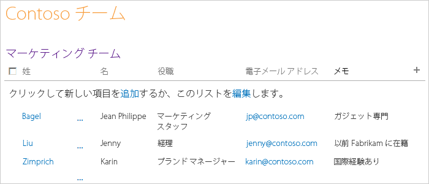
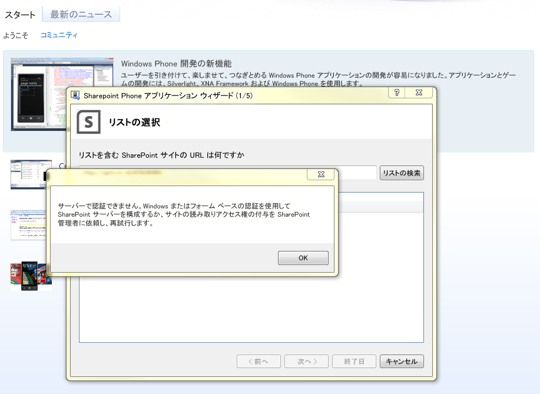
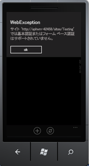
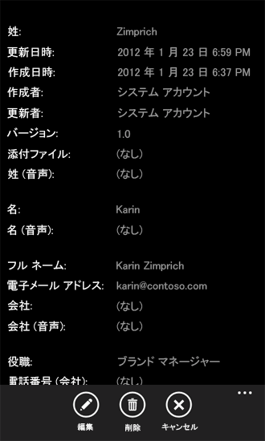

# [方法] Windows Phone 用の SharePoint 2013 リスト アプリを作成する
Windows Phone SharePoint リスト アプリケーション テンプレートに基づいて、Visual Studio で Windows Phone アプリを作成します。
Windows Phone SharePoint SDK をインストールすると、Visual Studio 2010 または Visual Studio 2010 Express for Windows Phone で 2 つの Windows Phone SharePoint アプリケーション テンプレートが使用可能になります (「 [[方法]: SharePoint 用モバイル アプリの開発環境をセットアップする](how-to-set-up-an-environment-for-developing-mobile-apps-for-sharepoint.md)」を参照)。Windows Phone SharePoint リスト アプリケーション テンプレートを使用することにより、ウィザードのステップに従って、SharePoint リストのデータにアクセスおよび操作することができる機能的な Windows Phone アプリを作成できます。
  
    
    

> **重要**
> Windows Phone 8 用のアプリを開発する場合は、Visual Studio 2010 Express でなく、Visual Studio Express 2012 を使用する必要があります。開発環境に関する内容を除けば、この記事の情報はすべて、Windows Phone 8 および Windows Phone 7 の両方のアプリを作成する場合に適用されます。 > 詳細については、「 [[方法]: SharePoint 用モバイル アプリの開発環境をセットアップする](how-to-set-up-an-environment-for-developing-mobile-apps-for-sharepoint.md)」を参照してください。 
  
    
    

このハウツー記事の作業を開始する前にモバイル アプリの作成方法のデモを見る場合は、次のビデオをご覧ください。
  
    
    

**SharePoint 2013 デモによるモバイル アプリの作成**

  
    
    

  
    
    

  
    
    

  
    
    

  
    
    

## Windows Phone SharePoint リスト アプリケーションの作成

Windows Phone SharePoint リスト アプリケーションでは、SharePoint アドイン で使用可能なリストのほとんどにアクセスできます。このサンプル Windows Phone アプリの目的を踏まえ、Contoso, Ltd という名前の架空会社からのサンプル データが含まれている SharePoint リストを使用します。この SharePoint リスト アプリケーションの最初の反復を作成する手順では、図 1 に示すように、Contoso のマーケティング チームのメンバーに関する情報が含まれている SharePoint 連絡先リストを使用します。
  
    
    

**図 1. Contoso マーケティング チームの連絡先リスト**

  
    
    

  
    
    

  
    
    

### Windows Phone SharePoint リスト アプリケーションを作成するには

1. [ **管理者として実行**] を使用して、Visual Studio 2010 を開始します。
    
  
2. [ **ファイル**]、[ **新規作成**]、[ **プロジェクト**] を選択します。 
    
    [ **新しいプロジェクト**] ダイアログ ボックスが表示されます。
    
  
3. [ **新しいプロジェクト**] ダイアログ ボックスで、[ **Visual C#**] を展開し、[ **Silverlight for Window Phone**] ノードを選択します (ターゲット .NET Framework バージョンが 4 に設定されていることを確認してください)。
    
    > **メモ**
      > Windows Phone SharePoint SDK によってインストールされるテンプレートは、C# プロジェクトでのみ使用できます。このテンプレートは、Visual Basic プロジェクトでは使用できません。 
4. [ **テンプレート**] ウィンドウで、 **Windows Phone SharePoint リスト アプリケーション** テンプレートを選択し、テンプレートに「ContosoSPListApp」などの名前を付けます。
    
  
5. **SharePoint Phone アプリケーション ウィザード**の実行中は、図 2 に示すようなエラーが表示されることがあります。このエラーは、 **SharePoint Phone アプリケーション ウィザード**の実行中に開発者が使用するアカウントに十分な権限がない場合に生成されます。
    
   **図 2. SPList ウィザードのエラー メッセージ**

  

  

    このエラーは、開発者が SPList ウィザードを実行するときに使用するアカウントに十分な権限を付与することによって解決できます。十分な権限が与えられてから **SPList ウィザード**を再実行してください。
    
  
6. [ **OK**] ボタンをクリックします。 **SharePoint Phone アプリケーション ウィザード**が表示されます。このウィザードを使用して、SharePoint リストを選択し、そのリストのプロパティを構成して、Windows Phone アプリでの表示方法を指定します。
    
  
7. 使用するネットワーク上のターゲット SharePoint サイト (つまり、SharePoint Server の社内インストール) の URL を指定します。
    
  
8. [ **リストの検索**] を選択します。Visual Studio を実行するときのアカウントに指定されたターゲット サイトへのアクセス権が付与されている場合は、 **SharePoint Phone アプリケーション ウィザード**にそのサイトで使用可能なリストが表示されます。
    
  
9. 連絡先リスト (図 1 のカスタマイズ ビューにサンプル データとともに表示) などの使用可能なリストの 1 つを選択します。
    
  
10. [ **次へ**] を選択します。ウィザードに、選択したリストに関連付けられている使用可能なビューが表示されます。
    
    ウィザードによって表示されるビューは、ユーザーによって作成され (または SharePoint Server によってプロビジョニングされ)、サーバー上の指定のリストに関連付けられたビューです。一部の SharePoint リストには、既定で、ビューが 1 つだけ関連付けられています。既定で、連絡先リストは 1 つの [すべての連絡先] ビューに関連付けられます。お知らせリストは、既定で [すべてのアイテム] ビューに関連付けられます。タスク リストは、[すべてのタスク] ビューと [未完了のタスク] ビューを含む 6 つのビューに関連付けられます。ウィザードのこのステージで選択するビューごとに、 **PivotItem** コントロールが作成され、Windows Phone アプリの UI を定義する XAML の **Pivot** コントロールに追加されます。
    
  
11. Windows Phone アプリに含める各ビューの横のチェック ボックスをオンにします。
    
  
12. [ **次へ**] を選択します。ウィザードに、Windows Phone アプリの選択したリストで実行可能なアクションが表示されます。
    
    選択肢は、[ **新規作成**]、[ **表示**]、[ **編集**]、および [ **削除**] です。アプリケーションでのリスト アイテムを編集または削除できるようにする場合は、ウィザードのこのステージで [ **表示**] 操作を選択する必要があります ([ **編集**] と [ **削除**] 操作のチェック ボックスは、[ **表示**] 操作を選択しない限り無効になっています)。
    
  
13. Windows Phone アプリで選択したリストで使用可能にする各アクションの横のチェック ボックスをオンにします。
    
  
14. [ **次へ**] を選択します。ウィザードには、SharePoint サイトで選択したリストに関連付けられているフィールドが表示されます。
    
    > **メモ**
      > カスタム フィールドは、モバイル デバイスの SharePoint リスト ウィザードから選択できるようにはなりません。ただし、任意のカスタム フィールドにアクセスするためのカスタム コードを記述できます。フィールドは、そのコンテンツ タイプと関連付けることができません。ただし、複数のコンテンツ タイプがリストで有効になっている場合は、開発者が各自の電話アプリで利用できるように、すべてのフィールドが使用可能になります。 
15. Windows Phone アプリに表示されるときにリストに含められるようにする各フィールドの横のチェック ボックスをオンします。
    
    > **メモ**
      > 情報を必要とするものとして SharePoint Server で指定されるリスト フィールドがすでに選択されています。それらのフィールドをウィザードでクリアすることはできません。 
16. [ **次へ**] を選択します。ウィザードに従って操作すると、前の手順で選択したフィールドの順序付けを行うことができます。
    
  
17. 必要に応じてフィールドの順序を指定します。そのためには、個々のフィールドを選択し、上下矢印をクリックしてそのフィールドを上下に移動し、順序を変更します。
    
  
18. [ **完了**] を選択します。Visual Studio がプロジェクトに必要なファイルを作成し、編集する List.xaml ファイルを開きます。
    
  

## SharePoint Phone アプリケーション ウィザードによって生成される Windows Phone アプリの実行

 **SharePoint Phone アプリケーション ウィザード**によって生成されるプロジェクトは、シンプルでも機能的な Windows Phone SharePoint リスト アプリケーションを作成する場合のようにして構築できます。アプリをさらに変更および開発することができますが、現時点では、ユーザーが指定されたリスト アイテムをタップ (または Windows Phone エミュレーターでクリック) すると、アプリには、そのアイテムに関連付けられているすべてのフィールド (アプリに含めるためにウィザードで選択したフィールド) が表示されます。ユーザーは、新規リスト アイテムの追加、リスト アイテムの削除、およびリスト アイテムのフィールド値の編集を行うこともできます。1 つのアプリでの複数ユーザーのログオンは、サポートされていません。ただし、開発者は、別のユーザーが同じモバイル アプリへのログオンを試みた際に現在のユーザーのログオフを実行するコードを記述できます。
  
    
    
ソリューションの配置ターゲットは、既定で Windows Phone エミュレーターに設定されています。プロジェクトは、そのまま Visual Studio で実行できます (F5 キーを押してデバッガーのコンテキストでプロジェクトを開始するか、Ctrl + F5 キーを押してデバッグなしでプロジェクトを開始します)。Windows Phone エミュレーターが起動し、Windows Phone オペレーティング システムが読み込まれ、アプリがエミュレーターに展開されて開始されます。ウィザードで生成されたままのコードで開始した場合は、SharePoint リスト アプリがエミュレーターで実行されるときに、ターゲット サイト上の指定された SharePoint リストに対する資格情報を入力するように求められます。エミュレーターで、リストにアクセスするために十分な権限を持つアカウントの資格情報を入力し、[ **ログオン**] をクリックします。(プロジェクトの List.xaml ファイルで定義されている) Windows Phone アプリのメイン ページがエミュレーターに表示されます。これまでの手順で選択したフィールドとそれらの順序に応じて、指定したリストのアイテムが表示されます。図 1 に示すようなリストのデータに基づき、図 3 のようにアイテムのリストがエミュレーターに表示されます。
  
    
    

**図 3. Windows Phone アプリでの SharePoint リスト アイテム**

  
    
    

  
    
    

  
    
    
Windows Phone アプリの実行中は、図 4 に示すような認証エラーが表示されることがあります。これは、SharePoint モバイル アプリで **基本フォーム認証**を必要とするためです。この認証方式は既定では有効になっていません。
  
    
    

**図 4. Windows Phone アプリの認証エラー**

  
    
    

  
    
    

  
    
    
このエラーは、サーバーの全体管理で [ **基本フォーム認証**] を選択することによって解決できます。 
  
    
    

### 基本フォーム認証を有効にするには

1. [ **サーバーの全体管理**] に移動します。サーバーでの管理者権限があることを確認してくだい。
    
  
2. [ **アプリケーション構成の管理**] の下で [ **Web アプリケーションの管理**] を選択します。
    
  
3. 使用する Web アプリケーション (モバイル アプリからアクセスする SharePoint サイトが置かれているアプリケーション) を選択します。
    
  
4. リボンから [ **認証プロバイダー**] を選択します。
    
  
5. リボンから [ **認証プロバイダー**] を選択します。
    
  
6. [ **認証プロバイダー**] ダイアログ ボックスで、[ **既定**] を選択して認証を編集します。
    
  
7. [ **認証の編集**] モデル ウィンドウの [ **クレーム認証の種類**] で、[ **基本認証**] を選択します。
    
  
図 1 に示すように、連絡先リストのデータを Windows Phone アプリの基本データとして使用した場合は、特定のリスト アイテムをクリックすると、アプリにそのアイテム (プロジェクトの DisplayForm.xaml によって定義) のビューを含むページを表示でき、図 5 に示すように、アプリのそのアイテムで使用可能なフィールドがすべて表示されます (この例では、SharePoint 連絡先リストに関連付けられているすべてのフィールドが SharePoint 電話アプリケーション ウィザードで選択され、それらのフィールドの既定の順序が保持されています)。
  
    
    

**図 5. 連絡先リスト アイテムの DisplayForm ビュー**

  
    
    

  
    
    

  
    
    
アプリのこのページにあるアプリケーション バーには、[ **編集**] ボタンと [ **削除**] ボタンが表示されます。これらの操作は、Microsoft.SharePoint.Phone.Application.dll (Windows Phone SharePoint SDK によってインストールされるライブラリの 1 つ) のメソッドによって実装されています。[ **編集**] ボタンをクリックすると、Windows Phone の **Page** コントロール (つまり、 **Microsoft.Phone.Controls.PhoneApplicationPage** クラスを継承したクラスからインスタンス化されたオブジェクト) が表示されます。アプリでフィールドのいずれかを編集し、そのページにある [ **送信**] ボタンをクリックすると、 **EditItemViewModelBase** クラスの基盤となる **UpdateItem** メソッドが実行され (これにより最終的には、SharePoint Silverlight クライアント オブジェクト モデルで提供される **ListItem** オブジェクトの **Update** メソッドが実行されます)、変更内容が SharePoint リストに保存されます。
  
    
    

## その他の技術情報

-  [SharePoint 2013 にアクセスする Windows Phone アプリの作成](build-windows-phone-apps-that-access-sharepoint-2013.md)
    
  
-  [[方法]: SharePoint 用モバイル アプリの開発環境をセットアップする](how-to-set-up-an-environment-for-developing-mobile-apps-for-sharepoint.md)
    
  
-  [Windows Phone SDK 2.0](http://www.microsoft.com/ja-jp/download/details.aspx?id=35471)
    
  
-  [Microsoft SharePoint SDK for Windows Phone 8](http://www.microsoft.com/ja-jp/download/details.aspx?id=36818)
    
  
-  [Windows Phone SDK 7.1](http://www.microsoft.com/ja-jp/download/details.aspx?id=27570)
    
  
-  [Microsoft SharePoint SDK for Windows Phone 7.1](http://www.microsoft.com/ja-jp/download/details.aspx?id=30476)
    
  

