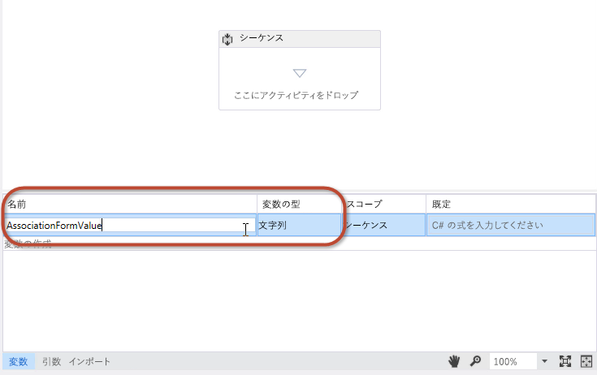
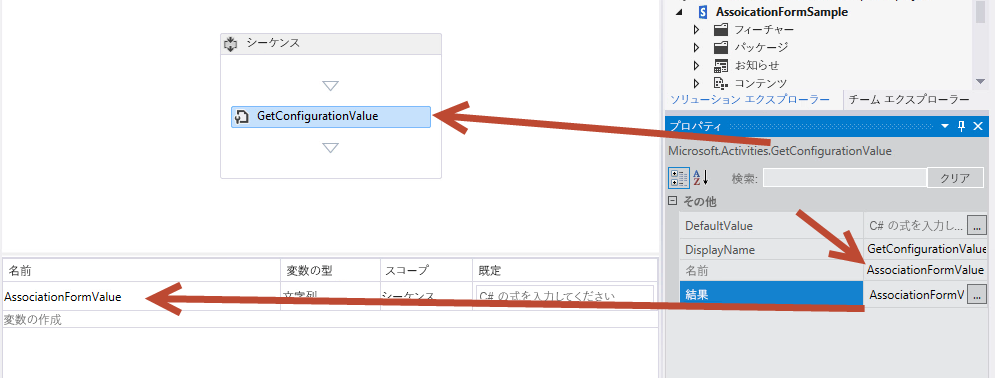
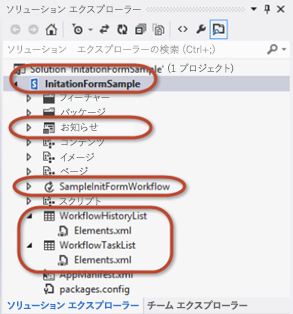
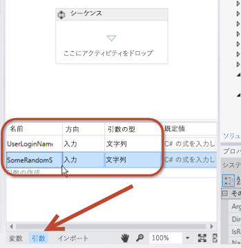
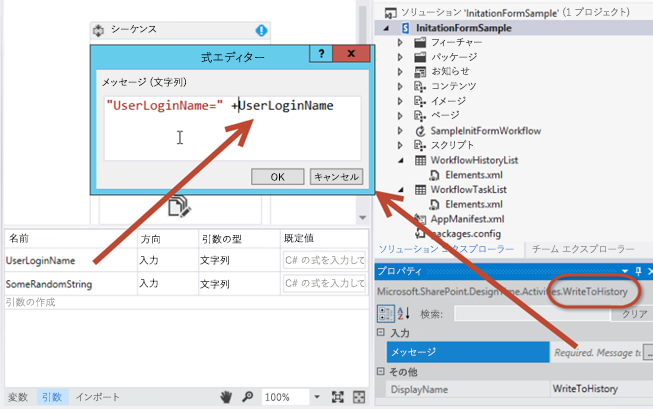
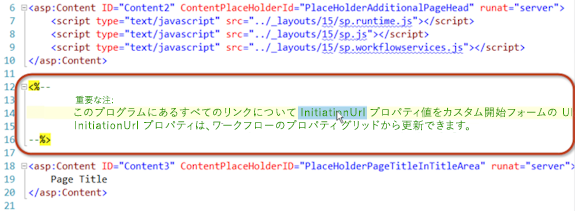
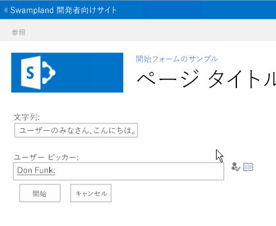
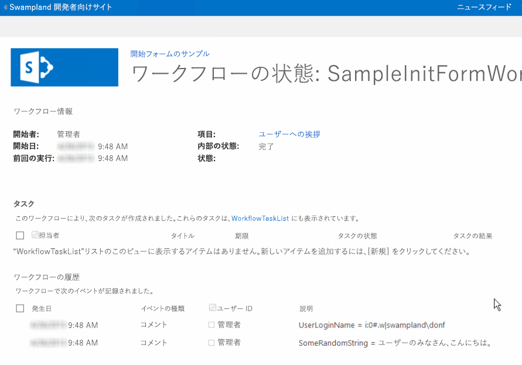

# Visual Studio 2012 を使用して SharePoint Server 2013 カスタム ワークフロー フォームを作成する方法
SharePoint Server 2013 のワークフロー フォームを示します。この記事では、2013 年 3 月のパブリック更新プログラムが適用された SharePoint Server 2013 と Office Developer Tools for Visual Studio 2012 を使用します。この記事の内容はすべて、SharePoint Server 2013 の社内展開と Office 365 の両方に適用されます。
 **執筆者:** [Andrew Connell](http://social.msdn.microsoft.com/profile/andrew%20connell%20%5bmvp%5d/)、 [www.AndrewConnell.com](http://www.andrewconnell.com)
  
    
    

Microsoft SharePoint 2007 のリリース以来、SharePoint プラットフォームでは、ビジネス プロセスを自動化するワークフローの使用がサポートされています。SharePoint ワークフロー プラットフォームは, .NET Framework の一部である Windows Workflow Foundation 上に構築されています。Windows Workflow Foundation にはカスタム ワークフローを作成して自動化ビジネス プロセスを管理するための多くの機能が備わっていますが、SharePoint はエンド ユーザー統合も追加します。この統合の実装には、次の 2 つの部分があります。 
- ユーザーおよびグループに割り当てられる **タスク** 。ワークフローから作成と監視ができます。
    
  
- ワークフローがいずれかの種類のコンテンツ (サイト、リスト、ライブラリなど) に関連付けられたとき、またはワークフローが開始したときに、ユーザーから情報を収集する **フォーム** 。
    
  

## SharePoint 2007 と SharePoint 2010 のワークフロー フォーム
<a name="sec1"> </a>

SharePoint 2007 および SharePoint 2010 のワークフローの実装は、バージョンが進むにつれて安定した改善が行われています。特に SharePoint 2010 で Microsoft はワークフローをサイトと関連付ける機能などの新機能を追加しました。このバージョンでは、以前のバージョンと比較してワークフロー作成ツール (SharePoint Designer 2010 と Visual Studio 2010) も改善されました。一方、SharePoint 2013 では、ワークフロー タスクとワークフロー フォームの実装に大きな変更はありません。
  
    
    
SharePoint Server 2013 より前のバージョンでは、開発者がワークフロー フォームを作成するための 2 つのオプションが表示されていました。SharePoint 2007 では、InfoPath フォームと ASP.NET Web フォーム の両方が同等に推奨されていました。それらには、それぞれ長所と短所がありました。SharePoint 2010 では、開発者に ASP.NET Web フォーム の使用が推奨されました。これは、Visual Studio 2010 の SharePoint 開発者向けツールが関連付けと開始のワークフロー フォームのプロジェクト アイテム テンプレートを使用して作成されたためですが、その実装は SharePoint 2007 の場合ととてもよく似ていました。
  
    
    

## SharePoint 2013 でのワークフロー フォームへの変更
<a name="sec2"> </a>

SharePoint Server 2013 では新しいワークフロー アーキテクチャーとプラットフォームが導入され、、SharePoint に関する考え方へのいくつかの基本的な変更が反映されました。その一番の変更点は、SharePoint Server 2013 のワークフローの管理と実行が SharePoint ランタイム エンジンによって行われなくなったことです。SharePoint Server 2013 では代わりに ワークフロー マネージャー と呼ばれる新しいコンポーネントが使用され、このコンポーネントによって Windows Workflow Foundation ランタイムと Workflow Foundation が要求する必須サービスとがホストされます。大切な点は、ワークフロー マネージャー が SharePoint の外部で実行されることです。ワークフローが公開されるとき、または公開されたワークフローの新しいインスタンスが開始されるときに、SharePoint から ワークフロー マネージャー に通知され、そこでワークフロー エピソードが順番に処理されます。ワークフローは、リスト項目プロパティやユーザー プロパティなどの SharePoint 内の情報にアクセスする必要があるとき、OAuth 認証モデルを使用して認証を行い、SharePoint Server 2013 リリースで導入された REST API を介して通信を行います。
  
    
    
SharePoint プラットフォームでカスタマイズを行うための全体的な方向性も SharePoint Server 2013 リリースで変更されました。とはいえ、この変更は実際には SharePoint 2010 と セキュリティで保護されたソリューション から始まっています。SharePoint Server 2013 で Microsoft は、カスタマイズ作業を SharePoint サーバーから分離してクライアント ブラウザーや他の外部リソースに移行する機能を導入しました。これらの機能には、新しい SharePoint アプリ モデル、アプリに ID を割り当てるためのサポート、OAuth 認証モデルを使用する認証、クライアント側オブジェクト モデル (CSOM) と REST API に対する改善が含まれます。
  
    
    
これはワークフロー フォームにどのように影響するでしょうか。SharePoint 2010 以降、Microsoft は開発者が Visual Studio を使用して作成したワークフロー内にフォームを作成する際に ASP.NET Web フォーム の使用を推奨するようになったことを思い出してください。当然ながら、このアプローチでは、サーバー側のコードがフォームを処理すること、およびフォームとワークフロー エンジンの間の通信を扱うことが必要となります。しかし、SharePoint Server 2013 では、これはソリューション形式の開発 (つまり *.WSP パッケージの展開) でのみ可能です。SharePoint Server 2013 で導入された新しい SharePoint アプリ モデルでは、サーバー側のコードを SharePoint プロセスで実行できません。
  
    
    
この制限を和らげるため、Microsoft は CSOM を拡張して、ワークフロー エンジンと対話するための API を組み込みました。SharePoint Server 2013 ファームを ワークフロー マネージャー ファームに接続するためには、ワークフロー マネージャー クライアント を SharePoint サーバーにインストールする必要があります。このコンポーネントは、SharePoint が ワークフロー マネージャー ファームとの通信に使用するプロキシとして機能します。ワークフロー サービス CSOM API は、事実上新しいワークフロー エンジンとの対話に使用するクライアント側のコンポーネントです。SharePoint Server 2013 ワークフロー サービス CSOM について詳しくは、「 [SharePoint 2013 ワークフロー サービス クライアント側オブジェクト モデルの操作](working-with-the-sharepoint-2013-workflow-services-client-side-object-model.md)」を参照してください。
  
    
    
では、これは SharePoint ワークフロー フォームにどのように役立ちますか。Visual Studio 2012 を使用して SharePoint Server 2013 ワークフローを作成するとき、ASP.NET Web フォーム を使用してワークフロー フォームを作成します。これらのフォームは、SharePoint ソリューションとして、または (ここが重要な部分です) 内に展開できます。これにより、ASP.NET Web コントロールや他の便利な (そしてときには必須の) SharePoint コントロールなど、サーバーに展開済みのすべてのサーバー コントロールにアクセスできるようになります。また、新しい ワークフロー サービス CSOM を使用して、関連付けと開始のフォームから、必要なすべてのタスクを実行できます。それらのタスクには以下が含まれます (これだけとは限りません)。
  
    
    

- ワークフロー タスクと履歴リストを作成する
    
  
- サイト、リスト、またはドキュメント ライブラリに、新しいワークフローの関連付けを作成する
    
  
- 既存のワークフローの関連付けの新しいインスタンスを開始する
    
  
ワークフロー サービス CSOM は非常に堅牢であり、ワークフロー革新に大きな可能性をもたらします。しかもそのすべてを、1 つのブラウザーまたは 1 つのリモート マシンから提供できます。
  
    
    

## SharePoint Sever 2013 で使用できるワークフロー フォーム
<a name="sec3"> </a>

SharePoint Server 2013 のリリースの前には、3 つの種類のカスタム ワークフロー フォームを作成できました。それらは、 **開始** 、 **関連付け** 、および **タスク編集** の各フォームです。これら 3 つの種類のフォームのうち、タスク編集フォームはカスタム フォーム ソリューションとして重要ではなくなっています。タスク編集フォームは、SharePoint 2010 から重要ではなくなりました。それは、Visual Studio 2010 SharePoint 開発ツールにタスク フォーム用のプロジェクト アイテムはなくなり、タスク表示には代わりに標準のリスト表示と編集フォームに依存するようになったからです。
  
    
    
SharePoint Server 2013 では、特定のシナリオ用のカスタム結果ボタンを作成できるようにすることにより、ワークフロー タスクの作業が改善されました。また、SharePoint Server 2013 で導入された新しい クライアント側レンダリング (CSR) を使用して、タスク アイテム内の特定の列の表示と動作をカスタマイズすることもできます。CSR はクライアント内で実行される JavaScript を使用することに注目してください。これらのトピックについては、「 [Visual Studio 2012 を使用した SharePoint 2013 ワークフローにおけるタスクの操作](working-with-tasks-in-sharepoint-2013-workflows-using-visual-studio-2012.md)」の記事で説明されています。さらに詳しくは、「 [クライアント側レンダリングを使用して SharePoint アドインのリスト ビューをカスタマイズする](http://msdn.microsoft.com/library/8d5cabb2-70d0-46a0-bfe0-9e21f8d67d86%28Office.15%29.aspx)」の記事を参照してください。
  
    
    

### ワークフロー開始フォームを理解する

開始フォームは、ワークフロー定義がフォームに関連付けられているワークフローを、ユーザーが手動で起動するときに開きます。ワークフローが起動するとき、ユーザーに開始フォームが表示され、ワークフローに必要な情報の入力が促されます。たとえば、ユーザーは、新しいビジネス経費の承認を開始するワークフローの根拠を入力できます。
  
    
    
この開始フォームに関する重要な点は、ワークフローを手動で開始したときにのみそれらが表示されることです。自動的に開始するよう構成されたワークフローは、開始されるときに開始フォームを起動しません。この条件のために、データがフォームから渡されることを想定しているワークフローにとって、複雑な問題が生じることがあります。そのため、ワークフローが自動的に開始するように構成されていて、ワークフローがユーザー入力を必要とする場合には、開始フォームではなく関連付けフォームを使用する必要があることに注意してください。
  
    
    

### ワークフロー関連付けフォームを理解する

管理者が初めてワークフローを特定のリストやドキュメント ライブラリに追加する、つまり関連付けるときに、関連付けフォームが表示されます。関連付けフォームを使用して、管理者がワークフローのパラメーター、デフォルト値、その他の情報を指定し、それらの情報がリストやライブラリ上のアイテムに適用されるようにします。
  
    
    
このデフォルトの関連付けフォームにより、管理者は、ワークフロー定義の選択、関連付けの表示名の指定、関連付けで選択したワークフローによって作成されるタスクや履歴リスト アイテムのコンテナーとなるリストの指定、およびリストやライブラリのアイテムが作成または更新されるときにワークフローが開始できる条件 (手動または自動など) の指定を行うことができます。
  
    
    
カスタム関連付けフォームを作成することもできます。ワークフロー定義にカスタム関連付けフォームがある場合、デフォルト フォームが完了した後に、SharePoint はユーザーをカスタム フォームにリダイレクトします。カスタム フォームを使用して、呼び出し元がアクセスのために固有の API キーで認証したり API キーを渡したりする必要のある外部 Web サービスを呼び出す場合などに、ワークフローが必要とする可能性のある構成情報を収集します。開発者がこのような種類の情報をワークフローにハードコーディングすることは適切ではありません。ワークフローが SharePoint ストアで販売されたアプリに含まれている場合を考えると、このシナリオがわかります。この場合、各顧客はリモート サービスでの自分のアカウントが必要です。これは、ユーザーがワークフローの関連付けを作成するときに、ユーザーから収集する種類の情報です。
  
    
    
別の一般的なシナリオは、通常はワークフローの開始者が送信する情報を、自動的に開始したワークフローのために収集する必要がある場合です。前述のように、開始フォームは、ワークフローが手動で開始された場合にのみ表示されます。それに対して、ワークフローが自動的に開始するように構成されたとき、そしてワークフローがフォームのいくつかのフィールドにデータを必要としている場合、推奨されるソリューションはカスタム関連付けフォームを使用することです。 
  
    
    
手動でワークフローを開始するときは、開始フォームに既定値が表示されます。自動的に開始すると、ワークフローは開始フォームからデータが渡されていないことを検知して、代わりに関連付けフォームで指定される値を得る手順に戻ることができます。
  
    
    

## チュートリアル: カスタム関連付けフォームを作成して展開する
<a name="sec4"> </a>

このチュートリアルでは、カスタム関連付けフォームを作成する方法、およびワークフローに渡す情報をそのフォームを使用して収集する方法を例示します。開始する前に、SharePoint Server 2013 開発者向けサイトへのアクセス権があることを確認してください。
  
    
    

### カスタム関連付けフォームを作成する


1. Visual Studio 2012 を使用してカスタム ワークフローを作成します。 
    
  
2. Visual Studio で、新しい SharePoint Server 2013 アプリ プロジェクトを作成し、それを SharePoint ホスト型アプリとして構成します。
    
  
3. 新しい **お知らせ** リストをプロジェクトに追加します。このリストはワークフローに関連付けられ、このリストのイベントがワークフローをトリガーします。
    
  
4. [ **ソリューション エクスプローラー**] でプロジェクトを右クリックし、[ **追加**]、[ **新しい項目**] の順に選択して、ワークフロー アイテムをプロジェクトに追加します。[ **新しい項目の追加**] ダイアログ ボックスで、[ **Office/SharePoint**] カテゴリから [ **ワークフロー**] プロジェクト アイテムを選択します。名前として「SampleWorkflow」を入力してから、[ **次へ**] をクリックします。SharePoint カスタマイズ ウィザードからプロンプトが出されたら、新しい項目を [ **リスト ワークフロー**] として設定します。
    
  
5. [ **SharePoint カスタマイズ ウィザード**] の次のページ (図 1 を参照) では、ワークフローの関連付けを自動的に作成できます。ただし、カスタム関連付けフォームを作成するときには、このオプションを **実行しません** 。代わりに、このチェック ボックスをオフにして、 [ **完了**] をクリックします。
    
   **図 1. ワークフローを自動的に関連付けるオプションを選択解除する。**

  


  

  

  
6. 次に、[ **ソリューション エクスプローラー**] でワークフロー アイテムを右クリックしてから [ **追加**]、[ **新しい項目**] の順に選択して、フォームを Visual Studio プロジェクトに追加します。 
    
    この最後の手順は、[ **新しい項目の追加**] ダイアログにコンテキストがワークフロー アイテムであることを知らせるので大切です。これにより、[ **新しい項目の追加**] ダイアログには 2 つのフォーム プロジェクト アイテム テンプレート (開始フォームと関連付けフォーム) がオプションとして表示されます (図 2 を参照)。
    

   **図 2. 関連付けフォーム テンプレートを選択する。**

  

![[新しいアイテムの追加] ダイアログボックス](images/CreateSharePoint2013WorkflowsFig2.png)
  

  

  
7. [ **ワークフロー関連付けフォーム**] アイテムを選択して、フィールド名から「1」を削除します。[追加] をクリックして処理を完了します。
    
  

### 既定の関連付けフォームで HTML と JavaScript を更新する

新しいフォームがプロジェクトに追加された後、Visual Studio は自動的にこのフォームを開きます。この時点で必要なのは、フォームにワークフローとの互換性を持たせるために行う次の 2 つのことだけです。
  
    
    

- ユーザーから収集する必要のあるデータ要素が反映されるように、またフォームの表示を指定するために、HTML フォームを更新します。
    
  
- 更新済みのフォームから値を取得して、プロパティの名前とワークフロー内に作成した引数の名前とを一致させるため、既定の JavaScript を更新します。
    
  

1. フォームを表示してコードを表示します。
    
  
2. 次のコード部分に示されているサーバー コントロールを見つけます。
    
  ```
  
<WorkflowServices:WorkflowAssociationFormContextControl ID="WorkflowAssociationFormContextControl1" runat="server" />
  ```


    このサーバー コントロールは、2 つの重要なタスクを実行します。最初に、関連付けフォームに必要な JavaScript ライブラリを追加します。2 番目に、前のフォームから発行されたフォーム値を取得して、それらを HTML input hidden コントロールとしてページに書き出します。これに先行するページは既定の SharePoint 関連付けフォームで、ここにユーザーがワークフロー定義、関連付けの名前、ワークフロー タスクと履歴リスト、および開始オプションを指定しています。このフォームは、HTTP POST を使用して、ワークフローに追加されたカスタム関連付けフォームに移動しました。これは HTTP POST なので、それらの値はフォームからはアクセスできません。すべてのカスタム ロジックはサーバー側のコードなしで実装する必要があるためです。そこで、SharePoint はこのサーバー コントロールを提供して、それらの値を HTTP 要求パイプラインから取り出し、このページに追加します。
    
  
3. ソース ファイルを下にスクロールして、サンプルの HTML table を見つけ、それを以下のように置き換えます。
    
  ```XML
  <table>
    <tr>
      <td colspan="2">
        String:<br /><textarea id="strInput" rows="1" columns="50"/>
      </td>
    </tr>
    <tr>
        <td><button id="Save" onclick="return runAssocWFTask()">Save</button></td>
        <td><button id="Cancel" onclick="location.href = cancelRedirectUrl; return false;">Cancel</button></td>
    </tr>
</table>

  ```


    この table には、ワークフローの関連付けに情報を渡すために使用する単純な HTML テキスト ボックスを表示します。2 つのボタンがフォームにあることに注目してください。これらのボタンは、ワークフローを保存またはキャンセルするために使用します。[ **保存**] ボタンをクリックすると、ワークフローはソース ファイルで何行か下にある JavaScript 関数の **runAssocWfTask()** を呼び出します。次に、それを変更する必要があります。
    
  

### ワークフロー サービス JSOM を更新して、ワークフローの関連付けを作成する

ソース ファイルでの HTML フォーム セクションの直後に、約 200 行の長さの  _ecmascriptshort_ ブロック コードがあります。このコードは、SharePoint Server 2013 での新しい ワークフロー サービス JavaScript Client Side Object Model (JSOM) API の実装を例示しています。JavaScript コードには以下のような重要な役割があるので、大半の箇所は変更しないでおく必要があります。
  
    
    

- 新しい関連付けワークフローのタスク リストを作成する必要があるかどうかを判別し、必要がある場合は作成します。
    
  
- 新しい関連付けワークフローの履歴リストを作成する必要があるかどうかを判別し、必要がある場合は作成します。
    
  
- 指定された名前、ワークフロー定義、起動オプション、および関連付けリストを使用して、新しい関連付けワークフローを作成します。
    
  
カスタム関連付けフォームを作成するときに注意の必要な重要箇所は、フォームから値を収集して新しい関連付けに渡す部分です。これについては、次の手順で説明します。
  
    
    

1. ワークフロー関連付け JSOM スクリプト ブロックで、JavaScript 関数の **associateWF()** を見つけます。
    
  
2. この関数のスクリプト ブロック内で次の行を見つけます。ここで、 **metadata** という名前の新しい配列を定義しています。
  
    
    
 `var metadata = new Object();`
    
  
3. 次に、SharePoint に渡す、フォーム フィールドを表す名前と値の組のコレクションを追加します。このチュートリアルのカスタム フォームでは以下の JavaScript だけが必要なので、ブロックを更新して **metadata** 変数を以下のように設定します。
    
  ```XML
  
var strInputValue = document.getElementById("strInput").value;
if (strInputValue) {
  metadata['AssociationFormValue'] = strInputValue;
}
  ```

4. これで、カスタム関連付けフォームが完成しました。
    
  

### ワークフローで関連付けフォームの値を使用する

フォームが完成したので、次の手順は関連付けフォームから渡される値を使用するようにワークフローを構成することです。関連付けフォームから値が渡されるときには、構成値として渡されます。これを取得するには、ワークフローの関連付けメタデータから構成値を取り出すための特別なアクティビティを使って、それを後で使用できるように変数に格納します。
  
    
    

1. Visual Studio でワークフローを開き、[ **変数**] タブに移動して、 **AssociationFormValue**という名前の新しい文字列変数を作成します (図 3 を参照)。
    
   **図 3. AssociationFormValue 変数を作成する。**

  


  

  

  
2. ワークフロー デザイナー画面で [ **GetConfigurationValue**] アクティビティをドラッグ アンド ドロップして、[ **Name**] プロパティをフォームで使用されるメタデータ プロパティの名前に設定します (図 4 を参照)。
    
   **図 4.**

  


  

  

  
3. **Result** プロパティを変数の名前に設定します (図 4 を参照)。
    
    このアクティビティは、 **AssociationFormValue** プロパティ値をワークフローのメタデータから取得して、ローカル変数に格納します。変数の内容を確認するには、[ **WriteToHistory**] アクティビティをワークフローに追加して、変数の値を履歴リストに書き出すようにその **Message** プロパティを設定します。
    
  
4. フォームの値をワークフローに関連付けるに必要な手順が完了しました。作業内容を保存し、フォームをテストしてください。
    
  

### カスタム関連付けフォームをテストする


1. ワークフローをテストするには、 **F5** を押すか、Visual Studio の [ **開始**] ボタンをクリックします。このチュートリアルでは、SharePoint Server 2013 の社内ローカル インストールを前提としているので、Visual Studio は ワークフロー マネージャーの Test Service Host ユーティリティを起動してワークフローを開発者サイトに展開します。
    
  
2. [ **お知らせ**] リストにナビゲートして、リボンの [ **リスト**] タブを選択し、[ **ワークフロー設定**]、[ **ワークフロー設定**] ボタンの順にクリックしてから [ **ワークフローの追加**] リンクをクリックします。これで、SharePoint 関連付けフォームが示されます。
    
  
3. 関連付けフォームで、テストするワークフローを選択して、それに名前を指定します。
    
  
4. 新しいタスクと履歴リストの作成を選択し、手動で開始するようにワークフローを設定してから、[ **次へ**] をクリックします。
    
  
5. カスタム関連付けフォームをワークフロー定義に指定したため、図 5 に示したカスタム関連付けフォームが開きます。
    
   **図 5. カスタム ワークフロー関連付けフォーム。**

  


  

  

  
6. フォーム フィールドに値を入力し、[ **保存**] をクリックします。これにより、関連付けが作成されて、ワークフロー関連付けのメタデータにカスタム値が格納されます。
    
  
7. ワークフローが構成設定から値を取り出せることを確認するには、[ **お知らせ**] リストにナビゲートして戻り、新しい項目を作成します。アイテムを作成した後、カスタム ワークフローを手動で開始します。ワークフローを開始した後に、アイテムのワークフロー インスタンスの状態ページに戻り、値が履歴リストに書き込まれたことを確認します (図 6 参照)。
    
   **図 6. ワークフローの状態ページ。**

  

![図 6. 関連付けフォーム: [ステータス] ウィンドウ](images/ngFormsFig6.png)
  

  

  

## チュートリアル: カスタム開始フォームを作成する
<a name="sec4"> </a>

このチュートリアルでは、カスタム関連付けフォームの作成方法、およびワークフローを手動で開始したときにそれを使用してユーザーから情報を収集する方法を実例で示します。
  
    
    

### 新しいワークフロー プロジェクトの作成


1. 最初に、SharePoint Server 2013 開発者向けサイトへのアクセス権があることを確認してから、Visual Studio 2012 を使用してカスタム ワークフローを作成します。
    
  
2. SharePoint ホスト型アプリとして構成される新しい SharePoint プロジェクトを作成します。
    
  
3. 新しい **お知らせ** リストをプロジェクトに追加します。このリストは、ワークフローをトリガーするために使用されるアイテムのコンテナーとして使用します。
    
  
4. 次に、[ **ソリューション エクスプローラー**] のプロジェクト アイコンを右クリックして、[ **追加**]、[ **新しい項目**] の順に選択してから、[ **新しい項目の追加**] ダイアログ ボックスで [ **ワークフロー**] プロジェクト アイテムを選択することにより、ワークフロー アイテムをプロジェクトに追加します。 
    
  
5. 新しいワークフローの名前を「SampleInitFormWorkflow」に指定して、[ **次へ**] をクリックします。
    
  
6. プロンプトが表示されたら、新しいワークフロー アイテムを [ **お知らせ**] リストに関連付けられた [ **リスト ワークフロー**] に設定します。また、ワークフローが手動で開始するように設定します (ワークフローが自動的に開始した場合は、開始フォームが表示されないことに注意してください)。
    
  
7. ここで、プロジェクトが [ **ソリューション エクスプローラー**] に表示されます (図 7 を参照)。 **WorkflowHistoryList** や **WorkflowTaskList** など、いくつかの要素は関連付けの作成時に自動的に追加されたことに注目してください。
    
   **図 7. ソリューション エクスプローラー内のプロジェクトの内容。**

  


  

  

  

### 開始フォームの値を収集するための引数を追加する

ワークフロー開始フォームは、ワークフローの開始に必要な 2 つの情報をユーザーに要求します。それらはランダム文字列と、ユーザー選択コントロールを使用して選択されたユーザーです。これを可能にするには、フォーム送信時に ワークフロー サービス CSOM API がフォームから値を取得する、2 つの引数を構成します。
  
    
    

1. ワークフロー デザイナーで、画面の下部の [ **引数**] タブをクリックして、2 つの引数を作成します (図 8 を参照)。それらの名前を **UserLoginName** および **SomeRandomString** と指定します。
    
   **図 8. 開始フォームの引数を構成する。**

  


  

  

  
2. 両方について、[ **引数の型**] を **String** に設定します。同様に両方について、[ **方向**] を [ **In**] に設定します (図 8 を参照)。
    
    **Direction** プロパティは, .NET クラスのプロパティと同様に考えることができます。方向が **In** に設定された場合、そのプロパティはパブリックの **Set** メソッドとプライベートの **Get** メソッドを持ちます。方向が **Out** に設定された場合、そのプロパティはパブリックの **Get** メソッドとプライベートの **Set** メソッドを持ちます。最後に、 **In/Out** に設定された場合、 **Get** および **Set** メソッドはどちらもパブリックとなります。
    
  
3. これら 2 つの引数の内容を確認するため、一対の [ **WriteToHistory**] アクティビティをワークフローに追加して、それぞれが引数の内容を履歴リストに書き出すようにします。
    
    これらの引数は変数を使用する場合と同じ方法で使用できますが、[ **方向**] を設定するときには、その読み取り/書き込みの機能を制御していることに注意してください。図 9 には、これらのアクティビティの 1 つを構成した後の状態が示されています。
    

   **図 9. 引数をテストするように WriteToHistory アクティビティを構成する**

  


  

  

  

### 開始フォームのプロジェクト アイテムを追加する

フォームから 2 つの入力引数を受け入れるようにワークフローを構成したので、次の手順は、フォームをプロジェクトに追加することです。
  
    
    

1. [ **ソリューション エクスプローラー**] 内のワークフロー アイテムを右クリックして、[ **追加**] を選択してから [ **新しい項目**] を選択します。
    
  
2. [ **ワークフロー開始フォーム**] プロジェクト アイテムを選択して、名前から数字の「1」を削除し、フォームの名前が「InitForm.aspx」となるようにして、[ **追加**] をクリックします。これにより、Visual Studio は、プロジェクト ツリーに既に存在する [ **ページ**] モジュールに新しい ASPX ページを追加します。これにより、フォームがアプリの [ **ページ**] サブフォルダにプロビジョニングされるようになります。Visual Studio もワークフロー アイテムのプロパティを変更しています。
    
  
3. [ **ソリューション エクスプローラー**] 内のワークフロー アイテム [ **SimpleInitFormWorkflow**] を選択し、[ **プロパティ**] グリッドで開始フォームにどのプロパティが設定されているかに注目します。それらの 1 つは、直前に [ **ページ**] モジュールに追加されたフォームのサイト相対パスを実際に示してます。
    
  

### 既定の開始フォームを確認して更新する

新しい開始フォームをプロジェクトに追加すると、Visual Studio 2012 は自動的にこのフォームを開きます。関連付けフォームの場合と同様に、この新しい開始フォームでも次の 2 つのタスクが実行される必要があります。
  
    
    

- HTML フォームを更新して、ユーザーから収集する必要のあるデータ要素を指定すると共に、フォームの表示を指定します。
    
  
- 既定の JavaScript ブロックを更新して、ユーザー入力値をフォームから取得し、プロパティの名前とワークフロー内に作成した引数の名前とを一致させます。
    
  

> **メモ**
> ソース ファイルで、最初の ASP.NET コンテンツ プレースホルダー **PlaceHolderAdditionalPageHead** には、ワークフロー サービス CSOM ライブラリ ( **sp.workflowservices.js** ) とコアの SharePoint Server 2013 CSOM ライブラリ ( **sp.js** と **sp.runtime.js** ) への参照が含まれることに注意してください。コードのこのセクションのすぐ後に、コメントとして書かれた注記を含むサーバー側コメントがあります。図 10 に示されているこの注記は関係がなく、無視する必要があることに注意してください。
  
    
    


**図 10. 無視するコード コメント。**

  
    
    

  
    
    

  
    
    

### HTML フォームを更新する


1. フォームのコード ファイルを下にスクロールして、 `PlaceHolderMain` という名前の ASP.NET コンテンツ プレースホルダーを見つけます。このセクションの最初の部分に、3 つのフォーム フィールドを含む HTML テーブルがあることに注意してください。必要なのは 2 つだけです。
    
  
2. この HTML テーブルを、以下のように置き換えて更新します。
    
  ```
  
<table>
  <tr>
    <td>
      String:<br />
      <input type="text" id="strInput" />
    </td>
  </tr>
  <tr>
    <td>
      User Picker:<br />
      <SharePoint:PeopleEditor AllowEmpty="false" ValidatorEnabled="true" MultiSelect="false" ID="peoplePicker" runat="server" />
    </td>
  </tr>
  <tr>
    <td>
      <input type="button" name="startWorkflowButton" value="Start" onclick="StartWorkflow()" />
      <input type="button" name="cancelButton" value="Cancel" onclick="RedirFromInitForm()" />
      <br />
    </td>
  </tr>
</table>

  ```

これで、table に 2 つの input コントロールが含まれるようになりました。1 番目は、ID が **strInput** の標準的な HTML テキスト ボックスです。2 番目は、ID が **peoplePicker** の SharePoint ユーザー選択コントロールです。この 2 番目のものはサーバー側のコントロールですが、すべての SharePoint Server 2013 コンピューターに展開されているので、このページで使用できます。さらに、開始フォームの上部でこのコントロールが参照されています。
  
    
    
ここで、フォーム上の 2 つのボタン、[ **開始**] (「startWorkflowButton」) と [ **キャンセル**] (「cancelButton」) に注目してください。[開始] ボタンをクリックすると、 **StartWorkflow()**JavaScript 関数が呼び出されます。この関数自体は、フォームの下の方にあるスクリプト ブロック内に存在します。これを次に変更する必要があります。
  
    
    

### ワークフローを開始するように JSOM コード ブロックを更新する


1. 今変更した HTML テーブルの直後にある JavaScript コード ブロックを見つけます。スクリプト ブロック内のコードの大半は変更しないでおきます。
    
    このコードは、SharePoint Server 2013 に実装されている ワークフロー サービス JavaScript Client Side Object Model (JSOM) API で使用可能な強力な機能と柔軟性を例示するものです。コードが実行する手順の概要は以下のとおりです。
    
  
2. 次のコード行を見つけます。 `var wfParams = new Object();`
    
  
3. この行の直後で、既存のコードを独自のコードに置き換えて、少し前に作成した 2 つの HTML フォーム フィールド ( **strInput** および **peoplePicker**) から値を取得します。これを行うには、jQuery ライブラリへの次の参照を HTML マークアップの **PlaceHolderAdditionalPageHead** 要素に追加します。これにより、フォームからの値の取得が容易になります。
    
  ```
  
<script type="text/javascript" src="../Scripts/jquery-1.8.2.min.js"></script>
  ```

4. ここで、JSOM スクリプト ブロックでフォームからパラメーターを収集する部分に戻ります。既存の JavaScript を次のコード置き換えます。
    
  ```
  var wfParams = new Object();
// get people picker value
var html = $("ctl00_PlaceHolderMain_peoplePicker_upLevelDiv");
wfParams['UserLoginName'] = $("#divEntityData", html).attr("key");

// get string input
var strInputValue = $("strInput").value;
wfParams['SomeRandomString'] = strInputValue

  ```

5. 変更を保存します。
    
  
前の手順で変更したコードは、次のような多くの作業を行います。
  
    
    

- URL のクエリ文字列から、以下の 3 つのパラメーターを取得します。
    
  - JavaScript 変数 **[itemId]** に保存されている、新しいワークフロー インスタンスが関連付けられるアイテム ID。
    
  
  - JavaScript 変数 **[subscriptionId]** に保存されている、現在のサイト、リスト、またはドキュメント ライブラリのワークフロー関連付けの ID。
    
  
  - JavaScript **[redirectUrl]** 変数に保存されている、ユーザーが直前に表示していたサイトの URL。ユーザーがフォームに入力してワークフローが開始すると、この URL のサイトが表示されます。
    
  
- JavaScript 変数 **[wfParams]** に保存されている、ワークフローに送信するプロパティの配列を作成します。これらの値はフォームから収集する必要があり、それはカスタム開始フォームを編集するために最小限必要な 2 つの手順の 2 番目のものです。
    
  
- SharePoint CSOM クライアント コンテキストおよび必要なワークフロー サービスへの参照を取得します。
    
  
- スクリプトは、ワークフロー サービスのサブスクリプション サービス (変数 **[subscriptionService]** で参照されている) に接続されると、以下のいずれかのタスクを実行します。
    
  
- 
  - スクリプトが最初の手順でクエリ文字列からアイテム ID を取得した場合、それは関数 **[startWorkflowOnListItem()]** を ワークフロー サービス インスタンス サービスから呼び出して、ワークフローの新しいインスタンスを指定のリスト アイテムで開始します。
    
  
  - ID が見つからなかった場合、それは関数 **[startWorkflow()]** を ワークフロー サービス インスタンス サービスから呼び出して、ワークフローの新しいインスタンスを現在のサイトで開始します。
    
  

### カスタム開始フォームをテストする

F5 を押すことにより、または Visual Studio 2012 の [ **開始**] ボタンをクリックすることにより、ワークフローをテストします。SharePoint Server 2013 の社内ローカル インストールでテストしている場合、Visual Studio 2012 は ワークフロー マネージャーの Test Service Host ユーティリティを開始して、ワークフローを開発者向けサイトに展開します。少し待つと、開発者向けサイトが開きます。 
  
    
    
[ **お知らせ**] リストに移動して新しい項目を作成します。アイテムを作成した後、カスタム ワークフローを開始します。
  
    
    
ワークフロー定義には開始フォームへの参照が含まれているため、最初にそのフォームがユーザーに表示されます。要求された値を入力して、[ **開始**] ボタンをクリックします。これにより、ページの JavaScript がトリガーされ、ワークフロー インスタンスが開始します (図 11 を参照)。
  
    
    

**図 11 ワークフローをトリガーする。**

  
    
    

  
    
    

  
    
    
ワークフローの開始後に、ページはユーザーを元のページにリダイレクトします。ワークフローが開始するまで少し待ってから、アイテムに戻り、ワークフロー インスタンスの状態ページを表示します。履歴リストには、フォームで送信されて、ワークフロー インスタンスが ワークフロー サービス JSOM を使用して作成された後に SharePoint に送られた値が含まれていることに注目してください。
  
    
    

**図 12. ワークフローの完成。**

  
    
    

  
    
    

  
    
    

  
    
    

  
    
    

## まとめ
<a name="sec6"> </a>

SharePoint 2013 では、ワークフローの改善点がいくつか導入されました。この記事では、SharePoint Server 2013 でのワークフロー アーキテクチャーに対する変更から生じた、ワークフローのフォームに関連した変更点について詳しく説明しました。この記事ではまた、Visual Studio 2012 を使用して今日のビジネス処理を自動化するために必要な要件を満たすために使用できる、カスタム関連付けフォームと開始フォームの両方を作成する方法を例示しています。
  
    
    

## その他の技術情報
<a name="sec7"> </a>


-  [ワークフローの関連付けおよび開始フォーム (SharePoint Foundation)](http://msdn.microsoft.com/ja-jp/library/office/ms481192%28v=office.14%29.aspx)
    
  
-  [SharePoint 2013 ワークフロー サービス クライアント側オブジェクト モデルの操作](working-with-the-sharepoint-2013-workflow-services-client-side-object-model.md)
    
  
-  [クライアント側レンダリングを使用して SharePoint アドインのリスト ビューをカスタマイズする](http://msdn.microsoft.com/library/8d5cabb2-70d0-46a0-bfe0-9e21f8d67d86%28Office.15%29.aspx)
    
  

