# 方法: Visual Studio を使用した SharePoint 2013 ワークフローの作成
新しい SharePoint 2013 ワークフロー プラットフォーム内で SharePoint ワークフローを作成する方法の基礎について説明します。
 **提供者:** [Andrew Connell](http://social.msdn.microsoft.com/profile/andrew%20connell%20%5bmvp%5d/),  [AndrewConnell.com](http://www.andrewconnell.com)
  
    
    

  
    
    

> **メモ**
> この記事にはエンドツーエンドのコード サンプルが付属しており、記事を読みながら参照したり、独自の SharePoint ワークフロー プロジェクトを開始するときに利用したりできます。ダウンロード可能なコードは次の場所にあります: リンク。 
  
    
    

  
    
    

  
    
    
Microsoft では、SharePoint 2013 内のワークフローに以前のバージョンとは大きく異なるアプローチを採用しています。SharePoint ワークフローのベースは Windows Workflow Foundation 4 になり、その実行は ワークフロー マネージャー と呼ばれる SharePoint の外部で実行される新しいコンポーネントにより制御されるようになりました。ワークフロー マネージャー は Windows Workflow Foundation ランタイム、および必要なサービスすべてを可用性とスケーラビリティに優れた方法でホスティングするという役割を果たします。またパフォーマンスとスケーラビリティを維持するためにサービス バスが利用されており、展開すれば、社内展開または Office 365 などのクラウド ベースのサービスの展開のいずれを問わず同様に実行されます。その理由は、ワークフローの実行と関連タスクをすべて ワークフロー マネージャー ファームにハンドオフするように構成されるからです。ワークフロー アーキテクチャに重要な変更が加えられたので、カスタム ワークフローの作成に使用していた 2 つの主要なワークフロー作成ツール (Visual Studio と SharePoint Designer) に対していくつかの変更が必要になりました。この記事では、Visual Studio 2012 をワークフロー作成ツールとして使用して、 **sp15allshort** 展開 (社内展開または Office 365 展開) で使用できるようにカスタム ワークフローを作成する方法について説明します。
## Visual Studio 2012 でのワークフローの種類

SharePoint Designer 2013 はステージから成るワークフローのみ作成できますが、Visual Studio はステート マシン ワークフローという別の種類の強力なワークフローをサポートしています。したがって、実際には Visual Studio 2012 (および Visual Studio 2013) ワークフロー開発環境はシーケンシャル、フローチャート、ステート マシンの 3 種類のワークフロー作成をサポートしています。
  
    
    

### シーケンシャル

シーケンシャル ワークフローは、特定の経路に従います。意思決定の分岐やループがあったり、終了点がなかったりする場合もありますが、設計プロセスでは予測できる経路に簡単に従うことができます。実際 Visual Studio 内で **ワークフロー** プロジェクト テンプレートを使用する場合、すべてのワークフローは最初はこの方法になります。
  
    
    
シーケンシャル ワークフローには、1 つの **シーケンス** アクティビティと、その中に任意の数のアクティビティが含まれます。その一部を他の **シーケンス** アクティビティとして使用し、一連の小規模な手順としてグループ化できます。
  
    
    

### フローチャート

フローチャート ワークフローでは、図 1 のように、実行経路は指定された条件に従ってワークフローのさまざまなセクションに遷移できます。通常フローチャートのアクティビティは、関連付けられている FlowDescision および FlowSwitch アクティビティと共に 1 つのシーケンス アクティビティ内に入れられ、従来の **if** ステートメントか共通プログラミング言語の **switch** ステートメントのような働きをします。
  
    
    
SharePoint Designer 2013 ベースのワークフロー内のステージ構造はフローチャートの原理に基づいています。この種のワークフローは、シーケンシャル ワークフローとは異なり、定められた経路に従いません。逆にワークフロー内で発生する内容により、ワークフローが従う経路が決まります。
  
    
    

**図 1 Visual Studio 2012 のフローチャート ワークフロー**

  
    
    

  
    
    
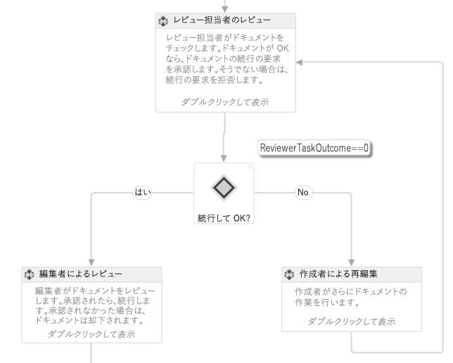
  
    
    

    
> **メモ**
> 図 1 で MSDN のワークフロー サンプルとして示されているワークフローは、「 [SharePoint 2013: カスタム開始フォームを使用した承認ワークフロー](http://code.msdn.microsoft.com/officeapps/SharePoint-2013-Approval-f5ac5eb2)」にあります。 
  
    
    

### ステート マシン

ステート マシン ワークフローは、フローチャート ワークフローと同様に、通常は特定の実行経路に従わず、図 2 のように 2 つ以上の状態で構成されます。 
  
    
    

**図 2 Visual Studio 2012 のステート マシン ワークフロー**

  
    
    

  
    
    
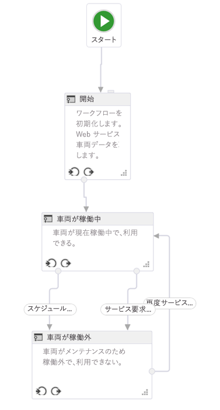
  
    
    

    
> **メモ**
> 図 1 で MSDN のワークフロー サンプルとして示されているワークフローは、「 [SharePoint 2013: アクションとイベントに応じて状態にワークフローをルーティングする](http://code.msdn.microsoft.com/officeapps/SharePoint-2013-Route-25a25d87)」にあります。 
  
    
    

それぞれの状態を、複数のワークフロー アクティビティが含まれる小規模なワークフローと見なしてください。特定のアクティビティを、ワークフローがある状態になったり終わったりするとき開始するよう設定できます。実際にステート マシンの関心の対象となるものを遷移として定義できます。状態ごとに 1 つ以上の遷移を持つことができます。遷移は、ある状態から別の状態に移る方法をワークフロー エンジンに示します。 
  
    
    
ワークフローは、常にステート マシン ワークフロー内のいずれかの状態になろうとします。遷移により、ある状態から別の状態にワークフローが移り始めるタイミングが決まります。現実世界のビジネス プロセスを厳密に反映できるので、他の種類のワークフローよりステート マシン ワークフローの方が好まれる場合が多くあります。しかし、この種のワークフローはあっという間に複雑になりがちです。
  
    
    

## Visual Studio 2012 のワークフロー開発インターフェイス

SharePoint プロジェクトに新しいワークフローを追加する場合、テンプレートは、メイン コンテナーの働きをする 1 つのシーケンス アクティビティを追加します。フローチャート ワークフローかステート マシン ワークフローを作成する場合は、単にこの既定のアクティビティを削除し、StateMachine または Flowchart アクティビティをデザイン画面にドラッグするだけです。
  
    
    
開発者がカスタム ワークフローを構築するには、その前に Visual Studio 2012 のツール ウィンドウとデザイン画面をよく理解しておく必要があります。図 3 のように、要素の多くはごく一般的です。
  
    
    

**図 3. Visual Studio 2012 のワークフロー作成インターフェイス**

  
    
    

  
    
    
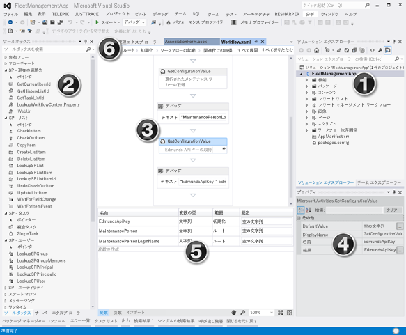
  
    
    
ワークフロー開発インターフェイス、つまりワークフロー デザイナーには、次の主な要素があります。
  
    
    

  
    
    

1. [ **ソリューション エクスプローラー**] は、プロジェクトをファイル ツリーとして表示します。
    
  
2. [ **ワークフロー ツールボックス**] には、ワークフローの構成に使用できるすべてのアクティビティが含まれています。このツールボックスからデザイナー画面にドラッグ アンド ドロップします。
    
  
3. [ **ワークフロー デザイナー画面**] は、ワークフローの要素を構成してリンクする場所です。
    
  
4. [ **プロパティ グリッド**] は、[ **ソリューション エクスプローラー**] 内で選択したアクティビティやアイテムのプロパティを表示します。プロパティの値を設定したり変更したりする場合に使用します。
    
  
5. [ **出力ウィンドウ**] は、変数、引数、インポートといったワークフロー アクティビティ要素に関する情報を表示します。
    
  
6. **[階層リンク] ナビゲーション タブ**を使用すると、開発中のワークフローのさまざまな部分を拡大したり縮小したりできます。
    
  
[ **出力ウィンドウ**] (図 3 の #5) は、現在の適用範囲のワークフロー内の変数をすべて表示できるので重要です。適用範囲は、標準的なプログラミング オブジェクト指向の設計の場合と同じ働きをします。適用範囲がルートである変数は下位のすべての適用範囲 (クラス内のメソッドなど) にアクセスできますが、下位の適用範囲の変数 (クラス内のメソッドなど) はその適用範囲とその子のみアクセスでき、並行している適用範囲や親の適用範囲内にはアクセスできません。 
  
    
    
開始フォームから渡される引数など、値をワークフローに渡すために使用される引数の一覧を表示するには、[ **引数**] タブをクリックします。
  
    
    

## カスタム ワークフローを作成する方法

Visual Studio 2012 以降を使用してカスタム ワークフローを作成するには、SharePoint 2013 開発者向けサイトへのアクセス権があることを確認してください。このチュートリアルの場合、SharePoint 2013 のローカル インストールを使用することをお勧めします。その理由は、ローカルにテストされたワークフローは **WriteLine** アクティビティを使用して Test Service Host コンソール ユーティリティにデバッグ情報を書き込むことができるからです。このユーティリティは、Visual Studio 2012 以降の Professional、Premium、Ultimate エディションの既定のインストールの一部である Office Developer Tools for Visual Studio 2013 に付属しています。
  
    
    

### 新しいアプリ プロジェクトの作成

1. Visual Studio で、新しい SharePoint アドイン プロジェクトを作成して、SharePoint でホストされるアプリになるように構成します。
    
  
2. このプロジェクトで、新しい [ **お知らせ**] リスト インスタンスを追加します。このリストは、ワークフローのテストに使うアイテムのコンテナーとして使用します。
    
  
3. [ **ソリューション エクスプローラー**] でプロジェクト アイコンを右クリックし、[ **追加**]、[ **新しいアイテム**] の順に選択して、ワークフロー アイテムをプロジェクトに追加します。
    
  
4. [ **新しいアイテムの追加**] ダイアログ ボックスで、[ **Office/SharePoint**] カテゴリから [ **ワークフロー**] プロジェクト アイテムを選択し、名前を「My First Workflow」にして、[ **次へ**] をクリックします。
    
  
5. [ **SharePoint カスタマイズ ウィザード**] で名前の入力を求められたら、既定値のままにして、[ **リストのワークフロー**] になるように設定して、[ **次へ**] をクリックします。
    
  
6. ウィザードの次のページで、関連付けを作成するボックスをオンにし、作成したばかりの [ **お知らせ**] リストを選択し、必要なワークフロー履歴とタスク一覧に関する [ **<新規作成>**] を選択してから [ **次へ**] をクリックします。
    
  
7. ウィザードの最後のページで、ワークフローを手動で開始するボックスをオンにし、2 つの自動開始オプションをオフのままにして、[ **終了**] をクリックします。図 4 のように、Visual Studio により自動的に、必要な要素がプロジェクトに追加され、Workflow.xaml ファイルがデザイナーに読み込まれます。
    
   **図 4 ワークフロー アイテムを追加した後の既定のデザイナー画面**

  

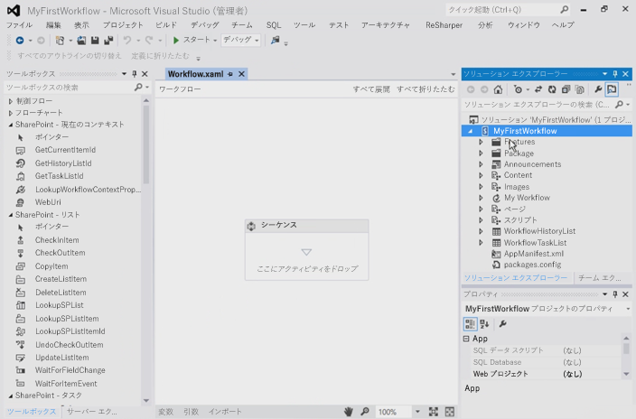
  

  

  

### ワークフローのステップの整理

特定のビジネス プロセスを自動化するために、1 つのステップ、つまり **シーケンス**にグループ化した任意の数のアクティビティをワークフローに含めることができます。しかし、1 つの **シーケンス**にグループ化するアクティビティの数が多すぎると、ワークフローが複雑になりすぎ、従ったりデバッグしたりしにくくなります。これは、一般的なプログラミング言語で、非常に長くて複雑なメソッドを作成するのが賢明でないことに似ています。代わりに、特定のタスクを共通のシーケンスで実行するように、連携して動作するアクティビティをグループ化する必要があります。
  
    
    
このワークフロー サンプルは、ワークフローをセグメント化する方法を示しています。図 5 のように、デザイナー画面で、新しいプロジェクトで既存の既定シーケンス アクティビティに 2 つの新しいシーケンス アクティビティを追加し、名前を「Child Sequence 1」と「Child Sequence 2」に変更します。さらに (図 5 には示されていません)、元のシーケンス アクティビティの名前を「Root」に変更します。
  
    
    

**図 5 既定のルート シーケンスに子シーケンスを追加する**

  
    
    

  
    
    
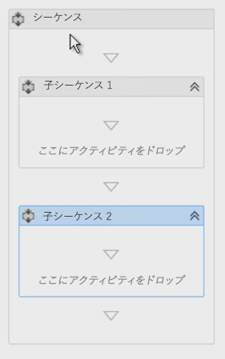
  
    
    

  
    
    

  
    
    

### 注釈を使用してワークフローにコメントを挿入する

C#、VB.NET や C++ などの一般的なプログラミング言語を使用している場合は、該当するコメント指定子を使用してコードにコメントを挿入できます。コードへのコメントは、コード ベースのテストと保守にとって重要です。そこで、Visual Studio の **annotations** という機能により、ワークフローの開発時にコメントを挿入できるようになっています。
  
    
    
特定のワークフロー アクティビティにコメントを挿入するには、アクティビティを選択し、[ **コメント**] を選択して、[ **コメントの追加**] を選択します。アクティビティのタイトル バーの右側にある山形記号を逆にした小さいアイコンは、注釈があることを知らせます。アイコンをマウスでポイントするかクリックすると、メッセージが表示されます (図 6 を参照)。図 6 のように、アクティビティに対する注釈を常に表示されるように固定するオプションがあります。 
  
    
    

**図 6 アクティビティに対する注釈**

  
    
    

  
    
    
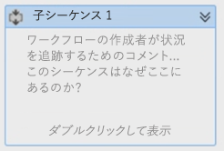
  
    
    

  
    
    

  
    
    

### リスト アイテムから値を取得する

ワークフローを作成する際には、共通のタスクとして、リスト アイテムのプロパティを取得します。そのためには、 **LookupSPListItem** アクティビティを使用します。 このアクティビティは、SharePoint 2013 REST API を使用して Web サービスを呼び出し、リスト アイテム上の情報を検索します。その方法を次の手順で示します。
  
    
    
最初に、 **LookupSPListItem** アクティビティをツールボックスから **Child Sequence 1** アクティビティにドラック アンド ドロップします。
  
    
    
デザイナーにアクティビティを追加した後に、一対のプロパティ **ListId** と **ItemId** を設定する必要があります。任意のリスト内の情報を検索するようにこれらのプロパティを設定できますが、[ **現在のリスト**] と [ **現在のアイテム**] のショートカットを使用して、これらの値を自動的に見つけるよう ワークフロー マネージャー に指示します。
  
    
    
Web サービスを呼び出しているので、このアクティビティからの戻り値のタイプは、 **Result** プロパティを反映して、 **DynamicValue** になります。したがって、Web サービス呼び出しの出力を格納するこのデータ タイプの変数が必要です。実際にはこの方法は非常に簡単で、 **LookupSPListItem** アクティビティの [ **プロパティの取得**] リンクをクリックするとほとんど自動的に実行されます。
  
    
    

- 最初に、タイプ **DynamicValue** の新しい変数が作成されます。
    
  
- 次に、この新しい変数が **LookupSPListItem** アクティビティ上の **Result** プロパティのソースになるように設定されます。
    
  
- 次に、 **GetDynamicValueProperties** アクティビティがワークフローに追加され、この変数から値を取得できるようになります。
    
  
- 最後に、変数が **GetDynamicValueProperties** アクティビティ上の **Source** プロパティにバインドされます。
    
  
もちろん、すべて手動で実行することもできますが、このツールのおかげでプロセスが簡単になります。必要に応じて変数の名前を変更できます。
  
    
    
もちろん、ワークフローを起動したリスト アイテムから値を取得することが目標です。次に、[担当者] 列でこれらのプロパティの値を以前に作成した変数にバインドするか、変数を自動的に作成する [変数の読み込み] リンクを使用します。
  
    
    

1. 図 7 のように、 **GetDynamicValueProperties** アクティビティ上の **Properties** プロパティで、省略記号ボタン [ **…**] をクリックして [ **プロパティ**] ダイアログ ボックスを開きます。
    
   **図 7 [プロパティ] ダイアログ ボックスを使用して値を抽出する**

  

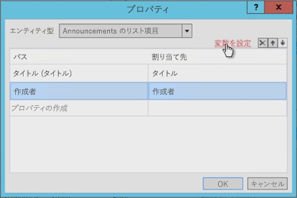
  

  

  
2. 次に、[ **エンティティの種類**] を、アイテムの種類と一致するように変更します。この例では、[ **List Item of Announcements**] リスト アイテムです。
    
  
3. **Title** フィールドと **Created By** フィールドの、2 つの検索するプロパティを選択します。
    
  
4. [ **担当者**] 列で、作成した変数にこれらのプロパティをバインドします。または、[ **変数の読み込み**] リンクを使用すると、変数が自動的に割り当てられます。
    
  
図 7 で、ツールにより変数が作成され、データ タイプも正確に一致していることに注意してください。また、[ **作成者**] フィールドが整数であることにも注意してください。作成者が番号で示されるというのは、ユーザーにとってあまり便利とは言えません。この点については、この後でワークフロー内で対応します。
  
    
    

### ユーザー プロパティの取得

カスタム ワークフローの開発には、ユーザーの検索という別の一般的なタスクもあります。たとえば、現在ワークフローではお知らせアイテムの作成者が認識されていますが、ID で認識されているだけです。この ID は、サイトの [ **ユーザー情報リスト**] に追加されたユーザーの ID で、これらのユーザーのプロファイル情報のキャッシュ コピーです。本当に必要なのは、氏名かログイン名です。
  
    
    
ユーザー情報を取得するには、次のようにします。
  
    
    

1. 最初のシーケンスの名前 ( **Child Sequence 1**) を「Get Item Properties」に変更し、2 つ目シーケンスの名前を「Get Author Properties」に変更します。
    
    > **メモ**
      > ユーザー ID が含まれる変数の適用範囲が、作業対象のシーケンスだけでなくワークフロー全体であることを確認します。次に、図 8 のように変数の適用範囲を変更します。 

   **図 8 変数の適用範囲の変更**

  

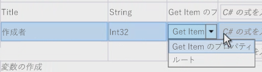
  

  

  
2. 次に、ユーザーの情報を取得し、ワークフロー内で **LookupSpUser** アクティビティをドラッグ アンド ドロップして、名前を「Get Announcement Author」に変更します。このアクティビティは、SharePoint REST API を呼び出し、特定の ID を渡します。ブラウザーを使用して `http://../_api/web/SiteUsers` に移動し、REST サービスの外観を確認してください。返されるプロパティにも注目してください。すぐ後で必要になります。
    
  
3. 各ユーザーには特定の URL があり、ユーザー情報を取得するための ID が含まれていることに注意してください。アクティビティは **GetUserById** サービス オペレーターを呼び出して検索対象のユーザーの ID を渡すことにも注意してください。この ID を渡すには、 **LookupSPUser** アクティビティの **PrincipalId** プロパティを **CreatedBy** 変数になるように指定します。これはお知らせアイテムの作成者を示す整数です。
    
  
4. 図 9 のように、 **LookupSPUser** アクティビティは **LookupSPListItem** アクティビティと同様にタイプ **DynamicValue** の値を返すので、このタイプの変数を作成して応答に関連付けてから、この変数を **LookupSPUser** アクティビティの **Result** プロパティにバインドします。
    
   **図 9 LookupSPUser アクティビティの出力の更新**

  

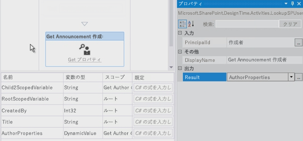
  

  

  
5. 前述のように、 **GetDynamicValueProperties** アクティビティを使用して **AuthorProperties** 値から結果を取得します。しかし、今回 **Entity Type** には設定できるオプションはないことに注意してください。このことは問題ではありません。その理由は、ブラウザーで実際の Web サービス応答 **LookupSPUser** を表示できるからです。表示するには、図 10 のように、検索しているプロパティへのパスを入力して (この例では `d/results/(0)/LoginName`) から、もう 1 つパスを入力して作成者の表示名を取得します。
    
   **図 10. LookupSPUser アクティビティからの値の取得**

  

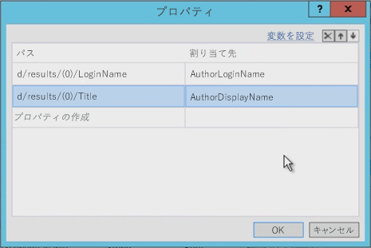
  

  

  

### ワークフローのテスト

最後に、ワークフローをテストします。まず、2 つの **WriteLine** アクティビティを追加します。こうすると、2 つの変数の内容を表示できます。ワークフローをテストすると、図 11 のように Test Service Host コンソール ユーティリティは 2 つの値を書き出します。
  
    
    

**図 11 Test Service Host コンソールを使用したテスト**

  
    
    

  
    
    
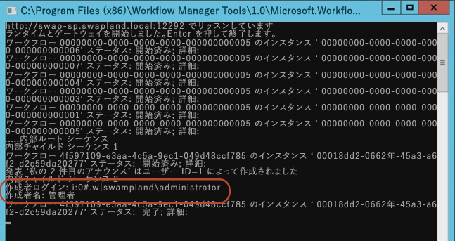
  
    
    

  
    
    

  
    
    

## まとめ

この記事では、最初に、ワークフロー マネージャー ファームに接続しているときに Visual Studio 2012 以降を使 用して作成できる、 SharePoint 2013 に関するさまざまな種類のワークフローについて説明しました。次に、ワークフローを起動するリスト アイテムから値を収集するワークフローを作成する方法と、 **LookupSPUser** アクティビティを使用してユーザーのログイン名や表示名を取得するなどの共通タスクを実行する方法について説明しました。さらに、ワークフローを整理された状態に保ち、注釈を使用してコメントを追加するための推奨されるいくつかの方法を示しました。
  
    
    

## その他の技術情報

-  [SharePoint 2013 のワークフロー](workflows-in-sharepoint-2013.md)
    
  
-  [SharePoint ワークフロー開発のベスト プラクティス](sharepoint-workflow-development-best-practices.md)
    
  
-  [SharePoint 2013 ワークフロー サンプル](sharepoint-2013-workflow-samples.md)
    
  

  
    
    

