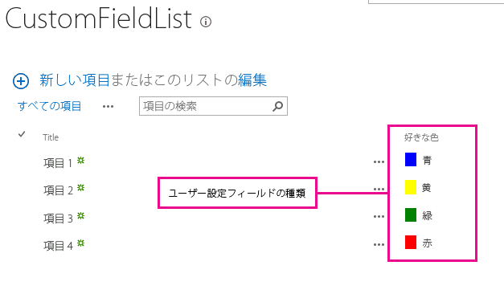
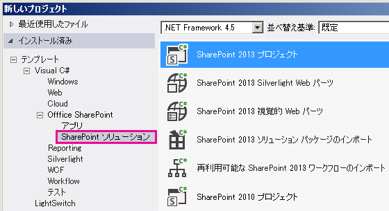
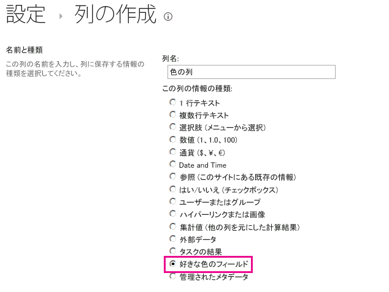

# [方法] クライアント側レンダリングを使用して、フィールド タイプをカスタマイズする
SharePoint 2013 でクライアント側のレンダリング テクノロジを使用してフィールド型をカスタマイズする方法について説明します。
クライアント側のレンダリングでは、SharePoint ページ内にホストされるコントロールのセットの独自の出力を生成できるメカニズムが提供されます。このメカニズムでは、HTML や JavaScript などの周知のテクノロジを使用して、ユーザー設定フィールド型のレンダリング ロジックを定義できます。クライアント側のレンダリングでは、独自の JavaScript リソースを指定し、それらを _layouts フォルダーなど、ファーム ソリューション が使用できるデータ ストレージ オプションにホストできます。
  
    
    


## この記事の手順を行う上での前提条件
<a name="SP15CustomizeafieldtypeusingCSR_Prereq"> </a>

この例の手順を行うには、以下が必要です。
  
    
    

- Microsoft Visual Studio 2012
    
  
- Office Developer Tools for Visual Studio 2012
    
  
- SharePoint 2013 開発環境
    
  
SharePoint 開発環境の設定の詳細については、「 [SharePoint 2013 の一般的な開発環境の設定](set-up-a-general-development-environment-for-sharepoint-2013.md)」を参照してください。
  
    
    

### フィールド型に対するクライアント側のレンダリングを理解するための中心概念

カスタム アクション シナリオに含まれる概念および手順の理解に役立つ記事の一覧を次の表に示します。
  
    
    

**表 1. フィールド型に対するクライアント側のレンダリングの中心概念**


|**記事のタイトル**|**説明**|
|:-----|:-----|
| [SharePoint 2013 でのファーム ソリューションの作成](build-farm-solutions-in-sharepoint-2013.md) <br/> |SharePoint 2013 を使用した、開発、パッケージ化、管理拡張の ファーム ソリューション への展開について説明しています。  <br/> |
| [ユーザー設定フィールド型](http://msdn.microsoft.com/ja-jp/library/ms446361.aspx) <br/> |ユーザー設定フィールド型の作成について説明します。ビジネスの情報を SharePoint 2013 に保存する際、データが SharePoint Foundation で使用可能なフィールド型に適合しない場合があります。また、単にフィールド型をカスタマイズしたい場合もあります。ユーザー設定フィールドには、ユーザー設定のデータ入力規則およびユーザー設定フィールドのレンダリングが含まれます。  <br/> |
   

## コード例: レンダリングの処理をビュー フォームのユーザー設定フィールド型に合わせてカスタマイズする
<a name="SP15CustomizeafieldtypeusingCSR_Codeexample"> </a>

ユーザー設定フィールド型に対するレンダリング処理をカスタマイズするには、次の手順を実行します。
  
    
    

1. ファーム ソリューション プロジェクトを作成します。
    
  
2. ユーザー設定フィールド型に対するクラスを追加します。
    
  
3. ユーザー設定フィールド型に対する XML 定義を追加します。
    
  
4. ユーザー設定フィールド型のレンダリング ロジックに対し JavaScript ファイルを追加します。
    
  
図 1 は、ユーザー設定レンダリング フィールド型のあるビュー フォームを示しています。
  
    
    

**図 1. ビュー フォーム内のユーザー設定クライアント側レンダリング フィールド**

  
    
    

  
    
    

  
    
    

### ファーム ソリューション プロジェクトを作成するには


1. 管理者として Visual Studio 2012 を開きます ([ **スタート** ] メニューの Visual Studio 2012 アイコンを右クリックし、[ **管理者として実行** ] を選択します)。
    
  
2. [ **SharePoint 2013 Project**] テンプレートを使用して、新しいプロジェクトを作成します。
    
    図 2 は、Visual Studio 2012 での、[ **Templates**]、[ **Visual C#**]、[ **Office SharePoint**]、[ **SharePoint Solutions**] の下の [ ** SharePoint 2013 Project**] テンプレートの場所を示しています。
    

   **図 2. SharePoint 2013 プロジェクトの Visual Studio テンプレート**

  


  

  

  
3. デバッグに使用する SharePoint Web サイトの URL を入力します。
    
  
4. [ **ファーム ソリューションとして配置する**] オプションを選択します。
    
  

### ユーザー設定フィールド型に対するクラスを追加するには


1. ファーム ソリューション プロジェクトを右クリックし、新しいクラスを追加します。このクラスファイルに「FavoriteColorFieldType.cs」という名前を付けます。
    
  
2. 次のコードをコピーし、FavoriteColorFieldType.cs ファイル内に貼り付けます。このコードは次のタスクを実行します。
    
  - **SPFieldText** から継承する **FavoriteColorField** クラスを宣言します。
    
  
  - **FavoriteColorField** クラスに対し 2 つのコンストラクターを指定します。
    
  
  - **JSLink** プロパティをオーバーライドします。
    
    > **メモ**
      > JSLink プロパティは、アンケート リストやイベント リストではサポートされません。SharePoint の予定表は、イベント リストです。 

  ```cs
  
using System;
using System.Collections.Generic;
using System.Linq;
using System.Text;
using System.Threading.Tasks;

// Additional references for this sample.
using Microsoft.SharePoint;
using Microsoft.SharePoint.WebControls;

namespace Microsoft.SDK.SharePoint.Samples.WebControls
{
    /// <summary>
    /// The FavoriteColorField custom field type 
    /// inherits from SPFieldText.
    /// Users can input the color in the field 
    /// just like in any other text field.
    /// But the field will provide additional 
    /// rendering logic when displaying 
    /// the field in a view form.
    /// </summary>
    public class FavoriteColorField : SPFieldText
    {
        // The solution deploys the JavaScript 
        // file to the CSRAssets folder 
        // in the WFE's layouts folder.
        private const string JSLinkUrl = 
            "~site/_layouts/15/CSRAssets/CSRFieldType.js";

        // You have to provide constructors for SPFieldText.
        public FavoriteColorField(
            SPFieldCollection fields, 
            string name) :
            base(fields, name)
        {

        }
        public FavoriteColorField(
            SPFieldCollection fields, 
            string typename, 
            string name) :
            base(fields, typename, name)
        {

        }

        /// <summary>
        /// Override the JSLink property to return the 
        /// value of our custom JavaScript file.
        /// </summary>
        public override string JSLink
        {
            get
            {
                return JSLinkUrl;
            }
            set
            {
                base.JSLink = value;
            }
        }
    }
}            

  ```


### ユーザー設定フィールド型に対する XML 定義を追加するには


1. ファーム ソリューション プロジェクトを右クリックし、SharePoint マップ フォルダーを追加します。ダイアログ ボックスで **{SharePointRoot}\\Template\\XML** フォルダーを選択します。
    
  
2. 前の手順で作成した XML フォルダーを右クリックし、新しい XML ファイルを追加します。この XML ファイルに「fldtypes_FavoriteColorFieldType.xml」という名前を付けます。
    
  
3. 次のマークアップをコピーし、XML ファイル内に貼り付けます。このマークアップは次のタスクを実行します。
    
  - フィールド型に型名を提供します。
    
  
  - フィールド型に対し完全なクラス名を指定します。これは前の手順で作成したクラスです。
    
  
  - フィールド型に追加属性を提供します。
    
  

  ```XML
  
<?xml version="1.0" encoding="utf-8" ?>
<FieldTypes>
  <FieldType>
    <Field Name="TypeName">FavoriteColorField</Field>
    <Field Name="TypeDisplayName">Favorite color field</Field>
    <Field Name="TypeShortDescription">Favorite color field</Field>
    <Field Name="FieldTypeClass">Microsoft.SDK.SharePoint.Samples.WebControls.FavoriteColorField, $SharePoint.Project.AssemblyFullName$</Field>
    <Field Name="ParentType">Text</Field>
    <Field Name="Sortable">TRUE</Field>
    <Field Name="Filterable">TRUE</Field>
    <Field Name="UserCreatable">TRUE</Field>
    <Field Name="ShowOnListCreate">TRUE</Field>
    <Field Name="ShowOnSurveyCreate">TRUE</Field>
    <Field Name="ShowOnDocumentLibrary">TRUE</Field>
    <Field Name="ShowOnColumnTemplateCreate">TRUE</Field>
  </FieldType>
</FieldTypes>
  ```


### ユーザー設定フィールド型のレンダリング ロジックに対し JavaScript ファイルを追加するには


1. ファーム ソリューション プロジェクトを右クリックし、SharePoint レイアウトのマップ フォルダーを追加します。最近追加した Layouts フォルダーに新規の CSRAssets フォルダーを追加します。
    
  
2. 前の手順で作成した CSRAssets フォルダーを右クリックし、新しい JavaScript ファイルを追加します。JavaScript ファイルに「CSRFieldType.js」という名前を付けます。
    
  
3. 次のコードをコピーし、JavaScript ファイル内に貼り付けます。このコードは次のタスクを実行します。
    
  - ビュー フォームに表示されたら、フィールド用のテンプレートを作成します。
    
  
  - テンプレートを登録します。
    
  
  - ビューフォームに表示されたら、フィールド型に対するレンダリング ロジックを提供します。
    
  

  ```
  
(function () {
    var favoriteColorContext = {};

    // You can provide templates for:
    // View, DisplayForm, EditForm and NewForm
    favoriteColorContext.Templates = {};
    favoriteColorContext.Templates.Fields = {
        "FavoriteColorField": {
            "View": favoriteColorViewTemplate
        }
    };

    SPClientTemplates.TemplateManager.RegisterTemplateOverrides(
        favoriteColorContext
        );
})();

// The favoriteColorViewTemplate provides the rendering logic
// the custom field type when it is displayed in the view form.
function favoriteColorViewTemplate(ctx) {
    var color = ctx.CurrentItem[ctx.CurrentFieldSchema.Name];
    return "<span style='background-color : " + color +
        "' >&amp;nbsp;&amp;nbsp;&amp;nbsp;&amp;nbsp;</span>&amp;nbsp;" + color;
}
  ```


### ソリューションを構築して実行するには


1. F5 キーを押します。
    
    > **メモ**
      > F5 キーを押すと、Visual Studio がソリューションを構築し、ソリューションを展開し、ソリューションが展開される SharePoint Web サイトを開きます。 
2. ユーザー設定リストを作成し、新しい [好きな色] フィールド列を追加します。
    
  
3. リストに項目を 1 つ追加し、[好きな色] 列に値を入力します。
    
  
4. 図 3 は、新しいユーザー設定フィールド型を持つ [列の作成] ページを示しています。
    
   **図 3. 新規のユーザー設定フィールド型列の作成**

  


  

  

  

****


|**問題**|**解決策**|
|:-----|:-----|
|フィールド型 **FavoriteColorField** が正しくインストールされていません。[リストの設定] ページに移動してこのフィールドを削除してください。 <br/> |管理者特権でのコマンド プロンプトからコマンド **iisreset /noforce** を実行します。 <br/> > **注意**> ソリューションを運用環境に展開する場合、 **iisreset /noforce** を使用して Web サーバーをリセットするのに適切な時間、待機します。          |
   

## 次の手順
<a name="SP15CustomizeafieldtypeusingCSR_Nextsteps"> </a>

この記事では、ユーザー設定フィールド型に対するレンダリング処理をカスタマイズする方法を説明しました。次の手順として、ユーザー設定フィールド型について詳細に学習できます。詳細を学習するには、以下を参照してください。
  
    
    

-  [[方法] ユーザー設定フィールド型を作成する](http://msdn.microsoft.com/ja-jp/library/bb862248.aspx)
    
  
-  [[ウォークスルー] ユーザー設定フィールド型を作成する](http://msdn.microsoft.com/ja-jp/library/bb861799.aspx)
    
  
-  [クライアント側レンダリングを使用して SharePoint アドインのリスト ビューをカスタマイズする](http://msdn.microsoft.com/library/8d5cabb2-70d0-46a0-bfe0-9e21f8d67d86%28Office.15%29.aspx)
    
  

## その他の技術情報
<a name="SP15CustomizeafieldtypeusingCSR_AddResources"> </a>


-  [SharePoint 2013 の一般的な開発環境の設定](set-up-a-general-development-environment-for-sharepoint-2013.md)
    
  
-  [SharePoint サイトの構築](build-sites-for-sharepoint.md)
    
  
-  [SharePoint 2013 の開発者のための新機能](what’s-new-for-developers-in-sharepoint-2013.md)
    
  
-  [SharePoint 2013 機能の追加](add-sharepoint-2013-capabilities.md)
    
  
-  [SharePoint 2013 でのファーム ソリューションの作成](build-farm-solutions-in-sharepoint-2013.md)
    
  
