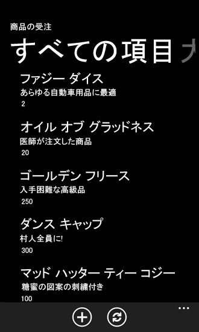
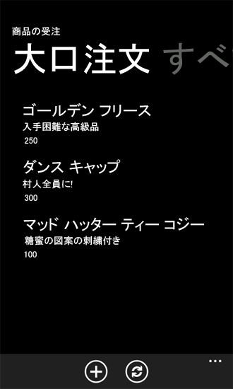

# [方法] リスト アイテムのクエリをカスタマイズして Windows Phone アプリのデータをフィルタする
Windows Phone アプリのビューの基になるデータのクエリをカスタマイズする方法を説明します。
Windows Phone SharePoint リスト アプリケーション テンプレートから作成されたプロジェクトでは、開発者はテンプレートに実装されたデザイン パターンを利用して、Windows Phone アプリのデータ レイヤー部をカスタマイズすることができます。Windows Phone アプリの SharePoint リストのビューは Microsoft SharePoint Server で設定して電話のアプリにそのまま含めることができ、またはそのアプリ用にカスタム ビューを作成することができます。
  
    
    


> **重要**
> Windows Phone 8 用のアプリを開発する場合は、Visual Studio 2010 Express でなく、Visual Studio Express 2012 を使用する必要があります。開発環境に関する内容を除けば、この記事の情報はすべて、Windows Phone 8 および Windows Phone 7 の両方のアプリを作成する場合に適用されます。 > 詳細については、「 [[方法]: SharePoint 用モバイル アプリの開発環境をセットアップする](how-to-set-up-an-environment-for-developing-mobile-apps-for-sharepoint.md)」を参照してください。 
  
    
    


## Windows Phone アプリで使用するためのサーバー上のリスト ビューの設定
<a name="BKMK_ConfiguringLists"> </a>

Windows Phone SharePoint List Application テンプレートを使用して Windows Phone 用の SharePoint リスト アプリケーションを作成するとき、対象となる SharePoint リストに関連付けられた既存のビューをアプリに含めるかどうかを選択できます。電話に表示されるリストのように SharePoint リストで項目にフィルターを設定する 1 つの方法は、サーバー上のリストにフィルター適用ビューを設定し、そのビューを選択して Windows Phone アプリに含めることです。Windows Phone SharePoint リスト アプリケーション テンプレート ウィザードは、選択したビューに対する Collaborative Application Markup Language (CAML) クエリを生成し、クエリにはサーバーのビューに対して設定されたフィルター適用条件が含まれます。たとえば、サーバー上に Tasks リストのテンプレートを基にしたリストがあるとします。たとえば、Description フィールドに "holiday" や "party" などの言葉が含まれているときだけリスト項目を表示するというフィルター適用条件を追加して、会社の休日パーティの計画に関連する項目のみを含んだ "Holiday Party" という名前のビューをリストに作成することができます。Windows Phone アプリでは、CAML マークアップは次の内容に類似したビューを生成します (アプリに含めるために選択したフィールドにより異なります)。
  
    
    

```XML

<View>
    <Query>
        <Where>
            <Or>
                <Contains>
                    <FieldRef Name='Body' />
                    <Value Type='Note'>holiday</Value>
                </Contains>
                <Contains>
                    <FieldRef Name='Body' />
                    <Value Type='Note'>party</Value>
                </Contains>
            </Or>
        </Where>
    </Query>
    <RowLimit>30</RowLimit>
    <ViewFields>
        <FieldRef Name='Title'/>
        <FieldRef Name='Body'/>
        <FieldRef Name='AssignedTo'/>
        <FieldRef Name='Status'/>
        <FieldRef Name='PercentComplete'/>
        <FieldRef Name='StartDate'/>
        <FieldRef Name='DueDate'/>
        <FieldRef Name='Checkmark'/>
    </ViewFields>
</View>
```

プロジェクトを作成するとき、Windows Phone アプリに含めるために選択する Tasks リストのその他の既存ビューと同様に、選択したビューに対応する **PivotItem** コントロールが、アプリの主なユーザー インターフェイス (UI) を構成する **Pivot** コントロールに追加されます。
  
    
    

## Windows Phone アプリのリスト ビュー クエリのカスタマイズ
<a name="BKMK_CustomizingLists"> </a>

様々な理由により、サーバー上のリストに対するデザインのニーズにすべて合致するビューを、正しく適切に設定できないことがあります。Windows Phone SharePoint リスト アプリケーション テンプレートから作成された Microsoft Visual Studio プロジェクトでは、開発者はデータ レイヤーと呼ばれる要素が利用可能で、主にプロジェクトの ListDataProvider.cs ファイルを介して利用できます。既存のビューに定義された CAML を修正することができ、また ListDataProvider.cs file ファイルの新規ビューの CAML クエリを追加することができます。
  
    
    

### ListDataProvider.cs ファイル

Windows Phone SharePoint リスト アプリケーション テンプレートを基にしたプロジェクトでは、ListDataProvider.cs ファイルは、Windows Phone アプリのビューのデータ ソースとしての SharePoint リストへのアクセスや設定を提供するオブジェクトを定義します。List.xaml ファイルでは、アプリのメイン アプリケーションのページが定義され、 **Pivot** コントロール (それ自身に **PivotItem** 子コントロールを含む) が **LoadedPivotItem** イベントに割り当てられたイベント ハンドラーと共に宣言されます。ListDataProvider.cs ファイルの **LoadDataFromServer** メソッドは、 **PivotItem** コントロール (Windows Phone アプリのリスト項目のレンダリング コンテナーとして使用される) が、アプリのメイン アプリケーションのページにロードされると、最終的に呼び出されます。
  
    
    

1. リスト ビューに関連付けられた **PivotItem** が UI にロードされます。
    
  
2. List.xaml.cs では、 **LoadedPivotItem** イベントのハンドラーは、ListViewModel.cs ファイルに実装された **LoadData** メソッドを呼び出し、ロードが完了した **PivotItem** コントロールの名前を渡します (Windows Phone SharePoint リスト アプリケーション テンプレートを基にしたプロジェクトの設計では、 **PivotItem** コントロールの名前は、ListViewModel.cs の **CamlQueryBuilder** クラスに定義された **Dictionary** 型の **ViewXmls** のコントロールに関連付けられたビューに対する CAML クエリ文字列のキーの値と同じものがセットされます)。
    
  
3. ListViewModel.cs の **LoadData** メソッドは、ListDataProvider.cs ファイルに実装された **LoadData** メソッドを呼び出します。
    
  
4. また ListDataProvider.cs の **LoadData** メソッドは、同じファイルに実装された **LoadDataFromServer** メソッドも呼び出します。 **LoadDataFromServer** メソッドは、次の処理を行います。
    
1. ビューに関連付けられた CAML クエリ文字列を取得する。
    
  ```cs
  
CamlQuery query = CamlQueryBuilder.GetCamlQuery(ViewName);
  ```

2. 取得するリストのクライアント オブジェクト モデルを登録する。
    
  ```cs
  ListItemCollection items = Context.Web.Lists.GetByTitle(ListTitle).GetItems(query);
  ```

3. リスト項目とそのリスト項目のフィールドを、(テキスト値として) 返却する必要があることをクライアント オブジェクト モデルに指示する。
    
  ```cs
  Context.Load(items);
Context.Load(items, listItems => listItems.Include(item => item.FieldValuesAsText));
  ```

4. **ExecuteQueryAsync** を呼び出し、SharePoint Server に要求を送信し、データを取得する (非同期)。
    
  

  
    
    

## カスタム リスト ビュー クエリと対応する UI 要素の追加
<a name="BKMK_AddingCustomizations"> </a>

ご自身のプロジェクトでは、独自のカスタム CAML クエリ文字列とリスト ビューを追加するために設計されたデータ レイヤーを利用することができます。
  
    
    
次のコード サンプルでは、対象 SharePoint Server のインストールに Custom List テンプレートから作成された Product Orders というリストがあることを再び前提とし、リストは「 [SharePoint 2013 用 Windows Phone アプリにビジネス ロジックとデータ検証を実装する方法](how-to-implement-business-logic-and-data-validation-in-a-windows-phone-app-for-s.md)」トピックの表 1 で示されたフィールドと型で設定されているとします。Product Orders リストのように、リストをソースとして使用する Windows Phone SharePoint リスト アプリケーション テンプレートを基にしてプロジェクトを作成します (「 [[方法] Windows Phone 用の SharePoint 2013 リスト アプリを作成する](how-to-create-a-windows-phone-sharepoint-2013-list-app.md)」で説明されたとおり)。この例では、注文数が 100 以上の製品注文だけを表示するようにフィルター適用されたカスタム ビューを、Windows Phone アプリ (サーバー上のリストではありません) に追加します。
  
    
    

### カスタム クエリとカスタム ビューを追加するには


1. **ソリューション エクスプローラー** で、ListDataProvider.cs ファイルをダブルクリックし (またはファイルを選択して F7キーを押す)、編集するファイルを開きます。
    
  
2. 静的 **CamlQueryBuilder** クラスの **ViewXmls** **Dictionary** 型の定義を更新して、適切なフィルター適用条件を規定する WHERE 句のある追加の CAML クエリを含めます。
    
  ```cs
  
static Dictionary<string, string> ViewXmls = new Dictionary<string, string>()
{   
    {"View1",   @"<View><Query><OrderBy><FieldRef Name='ID'/>
        </OrderBy></Query><RowLimit>30</RowLimit><ViewFields>{0}</ViewFields></View>"},
    {"View2",   @"<View><Query><OrderBy><FieldRef Name='ID' /></OrderBy>
     <Where><Geq><FieldRef Name='Quantity' />
          <ValueType='Number'>100</Value>
                </Geq></Where>
             </Query><RowLimit>30</RowLimit>
               <ViewFields>{0}</ViewFields></View>"}
};
  ```

3. List.xaml ファイルをダブルクリックし、編集するファイルを開きます。
    
  
4. マークアップを追加し、メインの **Pivot** コントロール内に追加の **PivotItem** 子コントロールを定義します。メインのアプリケーション ページを定義する UI 要素が宣言された **Grid** 要素は、次のようなコードにする必要があります。
    
  ```XML
  
<Grid x:Name="LayoutRoot" Background="Transparent"
 xmlns:x="http://schemas.microsoft.com/winfx/2006/xaml" 
 xmlns:controls="clr-namespace:Microsoft.Phone.Controls;assembly=Microsoft.Phone.Controls">
    <!--Pivot Control-->
    <ProgressBar x:Name="progressBar" Opacity="1" HorizontalAlignment="Center" 
     VerticalAlignment="Top" Height="30" Width="470" IsIndeterminate="{Binding IsBusy}" 
     Visibility="{Binding ShowIfBusy}" />
    <Grid x:Name="ContentPanel" Grid.Row="0" Width="470">
        <controls:Pivot Name="Views" Title="Product Orders" LoadedPivotItem="OnPivotItemLoaded">
            <!--Pivot item-->
            <controls:PivotItem Name="View1" Header="All Items">
                <!--Double line list with text wrapping-->
                <ListBox x:Name="lstBox1" Margin="0,0,-12,0" SelectionChanged="OnSelectionChanged" 
                 ItemsSource="{Binding [View1]}">
                    <ListBox.ItemTemplate>
                        <DataTemplate>
                            <StackPanel Orientation="Vertical" Margin="10">
                                <TextBlock Name="txtTitle" Text="{Binding [Title]}" 
                                 TextWrapping="NoWrap" Style="{StaticResource PhoneTextTitle2Style}" />
                                <TextBlock Name="txtDescription" Text="{Binding [Description]}" 
                                 TextWrapping="NoWrap" Style="{StaticResource PhoneTextNormalStyle}" />
                                <TextBlock Name="txtQuantity" Text="{Binding [Quantity]}" 
                                 TextWrapping="NoWrap" Style="{StaticResource PhoneTextNormalStyle}" />
                            </StackPanel>
                        </DataTemplate>
                    </ListBox.ItemTemplate>
                </ListBox>                    
            </controls:PivotItem>
            
            <!--Added PivotItem control for customized view--><controls:PivotItem Name="View2" Header="Big Orders"><!--Double line list with text wrapping--><ListBox x:Name="lstBox2" Margin="0,0,-12,0" 
                 SelectionChanged="OnSelectionChanged" ItemsSource="{Binding [View2]}"><ListBox.ItemTemplate><DataTemplate><StackPanel Orientation="Vertical" Margin="10"><TextBlock Name="txtTitle" Text="{Binding [Title]}" 
                                 TextWrapping="NoWrap" Style="{StaticResource PhoneTextTitle2Style}" /><TextBlock Name="txtDescription" Text="{Binding [Description]}" 
                                 TextWrapping="NoWrap" Style="{StaticResource PhoneTextNormalStyle}" /><TextBlock Name="txtQuantity" Text="{Binding [Quantity]}" 
                                 TextWrapping="NoWrap" Style="{StaticResource PhoneTextNormalStyle}" /></StackPanel></DataTemplate></ListBox.ItemTemplate></ListBox></controls:PivotItem>

        </controls:Pivot>
    </Grid>
</Grid>
  ```


    > **メモ**
      >  特に **PivotItem** コントロールの **Name** 属性 ("View2") の値は、手順 2 で定義された **Dictionary** 型に追加されたエントリのキーの値と同じ値です。この値は **PivotItem** に表示するデータの取得に適切な CAML クエリが使用されているかを識別するのに使用されます。ここで宣言された **ListBox** (名前は "lstBox2" とし、既定ビューの **ListBox** と区別します) もまた、ビューにバインドされることに注意してください。

    
    
  
プロジェクトを開始するとき (F5 を押す)、アプリの **Pivot** コントロールには 2 つの **PivotItem** コントロールと、それぞれのビューに関連付けられた CAML クエリで取得するデータが含まれます。既定の [すべてのアイテム] ビューは、図 1 (サンプル データで) で表示されているように、すべての注文を表示します。
  
    
    

**図 1. サンプル リストのすべての注文 (リスト項目)**

  
    
    

  
    
    

  
    
    
またカスタム ビューは、前の手順で定義されたように、100 以上の数量が指定された注文のみを含めるフィルターが適用された項目のリストを表示します。図 2 で示します。
  
    
    

**図 2. 大量注文のみ**

  
    
    

  
    
    

  
    
    
ビューの基になる CAML クエリとビューに関連付けられた UI 要素の両方に対し、その他多くのカスタマイズをすることができます。
  
    
    

## その他の技術情報
<a name="SP15Custlistitem_addlresources"> </a>


-  [SharePoint 2013 にアクセスする Windows Phone アプリの作成](build-windows-phone-apps-that-access-sharepoint-2013.md)
    
  
-  [CAML (Collaborative Application Markup Language) の概要](http://msdn.microsoft.com/ja-jp/library/ms426449.aspx)
    
  
-  [[方法]: SharePoint 用モバイル アプリの開発環境をセットアップする](how-to-set-up-an-environment-for-developing-mobile-apps-for-sharepoint.md)
    
  
-  [Windows Phone SDK 8.0](http://www.microsoft.com/ja-jp/download/details.aspx?id=35471)
    
  
-  [Microsoft SharePoint SDK for Windows Phone 8](http://www.microsoft.com/ja-jp/download/details.aspx?id=36818)
    
  
-  [Windows Phone SDK 7.1](http://www.microsoft.com/ja-jp/download/details.aspx?id=27570)
    
  
-  [Microsoft SharePoint SDK for Windows Phone 7.1](http://www.microsoft.com/ja-jp/download/details.aspx?id=30476)
    
  

