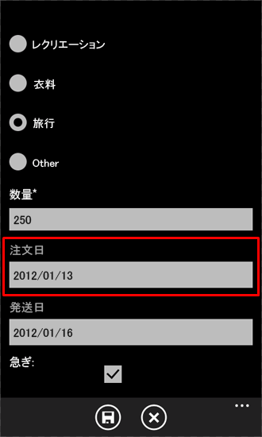
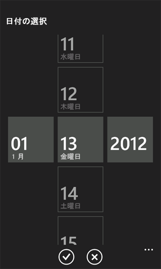

# [方法] Windows Phone 向け SharePoint 2013 リスト アプリのユーザー インターフェイスをカスタマイズする
Windows Phone SharePoint リスト アプリケーション テンプレートによって生成された Windows Phone ユーザー インターフェイスをカスタマイズします。
Windows Phone SharePoint リスト アプリケーション テンプレートから作成された SharePoint リスト アプリケーションは、Silverlight for Windows Phone フレームワークに基づきます。開発者は Windows Phone の Silverlight プラットフォームによって提供されるすべての機能を使用して、Windows Phone 用に設計されている SharePoint リスト アプリケーションのユーザー インターフェイス (UI) をカスタマイズすることができます。
  
    
    


> **重要**
> Windows Phone 8 のアプリを開発する場合は、Visual Studio 2010 Express ではなく Visual Studio Express 2012 を使用する必要があります。開発環境を除き、この記事のすべての情報は Windows Phone 8 と Windows Phone 7 の両方のアプリの作成に適用されます。 > 詳細については、「 [[方法]: SharePoint 用モバイル アプリの開発環境をセットアップする](how-to-set-up-an-environment-for-developing-mobile-apps-for-sharepoint.md)」を参照してください。 
  
    
    


## ユーザー インターフェイスのカスタマイズ用の SharePoint リスト アプリケーションを作成する
<a name="BKMK_CreatingSPListApp"> </a>

以下の手順では、SharePoint Server を実行しているサーバーが Custom List テンプレートから作成された Product Orders リストを保持しているものとします。このリストは、「 [SharePoint 2013 用 Windows Phone アプリにビジネス ロジックとデータ検証を実装する方法](how-to-implement-business-logic-and-data-validation-in-a-windows-phone-app-for-s.md)」で使用される Product Orders リストのサンプルと類似しています。このトピックで使用する Windows Phone アプリのサンプルでは、このアプリが基づく Product Orders リストが変更されていて、追加フィールドが含まれます。このトピックの例で使用する変更された Product Orders リストは、表 1 に示されている列とフィールド型を使用して作成されています。
  
    
    

**表 1. 変更された Product Orders リスト**


|**列**|**型**|**必須**|
|:-----|:-----|:-----|
|Product (すなわち、タイトル)  <br/> |1 行テキスト (Text)  <br/> |はい  <br/> |
|Description  <br/> |1 行テキスト (Text)  <br/> |いいえ  <br/> |
|Product Category  <br/> |選択肢  <br/> |いいえ  <br/> |
|Quantity  <br/> |数値  <br/> |はい  <br/> |
|Order Date  <br/> |日付/時刻 (DateTime)  <br/> |いいえ  <br/> |
|Fulfillment Date  <br/> |日付/時刻 (DateTime)  <br/> |いいえ  <br/> |
|Rush  <br/> |Boolean  <br/> |いいえ  <br/> |
|Contact Number  <br/> |1 行テキスト (Text)  <br/> |いいえ  <br/> |
   
「 [[方法] Windows Phone 用の SharePoint 2013 リスト アプリを作成する](how-to-create-a-windows-phone-sharepoint-2013-list-app.md)」に示されている手順に従って、Windows Phone SharePoint リスト アプリケーション テンプレートを使用して、以下の UI をカスタマイズするための開始点として SharePoint リスト アプリケーションを生成します。アプリケーションのターゲット SharePoint リストとして、表 1 に表されているリストに類似したスキーマを持つリストを指定します。
  
    
    

## TextBox コントロールを DatePicker コントロールに置き換える
<a name="BKMK_ReplacingControls"> </a>

テンプレートによって生成されたプロジェクトに基づいて、 **DateTime** フィールドとして (たとえば、同じ Product Orders リストの **Order Date** フィールドとして) 指定されたリストのフィールドは、既定でアプリケーションの Edit フォーム (EditForm.xaml) および New フォーム (NewForm.xaml) の **TextBox** コントロールにバインドされます。ユーザー インターフェイスに加える最初の改良は、 [Silverlight for Windows Phone Toolkit](http://silverlight.codeplex.com/releases/view/75888) から、こうしたフィールドに関連する **TextBox** コントロールを **DatePicker** コントロールに置き換えることによりフィールドの日付値の入力を推進することです。オープンソース ソフトウェア プロジェクトのホスティング サイトである [CodePlex Web サイト](http://www.codeplex.com/)から Silverlight for Windows Phone Toolkit をインストールできます。
  
    
    

### TextBox コントロールを DatePicker コントロールに置き換えるには


1. Microsoft Visual Studio 2010 では、プロジェクトが開いていない場合、Windows Phone SharePoint リスト アプリケーション テンプレートに基づき、表 1 に表されている Product Orders リストに類似した SharePoint リストを使用して、前のセクションで作成したプロジェクトを開きます。
    
  
2. Visual Studio で [ **プロジェクト**] メニューを開き、[ **参照の追加**] をクリックします。[ **参照の追加**] ダイアログ ボックスが表示されます。
    
  
3. [ **参照**] タブで、Silverlight for Windows Phone Toolkit によってインストールされた Microsoft.Phone.Controls.Toolkit.dll アセンブリに移動します。
    
    > **メモ**
      > Microsoft.Phone.Controls.Toolkit.dll アセンブリは、ツールキットの標準インストールの %PROGRAMFILES%(x86)\\Microsoft SDKs\\Windows Phone\\v7.1\\Toolkit\\< *MonthYear*  >\\Bin にあります。ここで、< *MonthYear*  > は、インストールされたツールキットのバージョンに応じて、"Oct11" のようになります (または、[ **スタート**] ボタンをクリックし、[ **すべてのプログラム**] をポイントし、プログラム メニューの [ **Microsoft Silverlight for Windows Phone Toolkit**] 項目を展開し、[ **バイナリ**] をクリックすることにより、ツールキットによってシステムにインストールされたアセンブリを見つけることができます)。 
4. **ソリューション エクスプローラー**で、 **Views** ノードの下にある EditForm.xaml ファイルを選択します。
    
  
5. SHIFT + F7 を押して (または、ファイルをダブルクリックして)、デザイナーでファイルを開きます。
    
  
6. デザイナーの XAML ウィンドウで、ツールキット アセンブリのコントロールを区別するための名前空間宣言を  `<phone:PhoneApplicationPage>` タグに追加します。
    
  ```
  
<phone:PhoneApplicationPage
    x:Class="ContosoSPListApp.EditForm"
    xmlns="http://schemas.microsoft.com/winfx/2006/xaml/presentation"
    xmlns:x="http://schemas.microsoft.com/winfx/2006/xaml"
    xmlns:phone="clr-namespace:Microsoft.Phone.Controls;assembly=Microsoft.Phone"
    xmlns:toolkit="clr-namespace:Microsoft.Phone.Controls;assembly=Microsoft.Phone.Controls.Toolkit"
    xmlns:shell="clr-namespace:Microsoft.Phone.Shell;assembly=Microsoft.Phone"
    xmlns:d="http://schemas.microsoft.com/expression/blend/2008"
    xmlns:mc="http://schemas.openxmlformats.org/markup-compatibility/2006"
    mc:Ignorable="d" d:DesignWidth="480" d:DesignHeight="696"
    FontFamily="{StaticResource PhoneFontFamilyNormal}"
    FontSize="{StaticResource PhoneFontSizeNormal}"
    Foreground="{StaticResource PhoneForegroundBrush}"
    SupportedOrientations="Portrait" Orientation="Portrait"
    shell:SystemTray.IsVisible="True" x:Name = "EditPage">
  ```


    テンプレートによって生成された既定のマークアップへの唯一の変更点は、"xmlns:toolkit" 名前空間指定の追加です。また、この **Class** 属性の値はプロジェクト名に基づくことに注意してください。"ContosoSPListApp" はこのサンプル プロジェクトの名前です。プロジェクトのこの属性の値は、プロジェクトの名前に応じてこの値とは異なったものになります。
    
  
7. EditForm.xaml ファイルで、 **Order Date** フィールド (フィールドの XML スキーマで "Order_x0020_Date" として指定されます) に関連するコントロールを含むマークアップの **StackPanel** コントロールを見つけます。既定では、テンプレートは、 **DateTime** フィールドに対して 1 つの **TextBox** コントロールと 2 つの **TextBlock** コントロールを生成します。 **StackPanel** コントロールとこのコントロールに含まれるコントロールのマークアップは、以下のマークアップのようになります。
    
  ```
  
<StackPanel Orientation="Vertical" Margin="0,5,0,5">
    <TextBlock TextWrapping="Wrap" HorizontalAlignment="Left" 
             Style="{StaticResource PhoneTextNormalStyle}">Order Date</TextBlock>
    <TextBox Height="Auto" Style="{StaticResource TextValidationTemplate}" 
                FontSize="{StaticResource PhoneFontSizeNormal}" Width="470" 
                HorizontalAlignment="Left" Name="txtOrder_x0020_Date" 
                Text="{Binding [Order_x0020_Date], Mode=TwoWay, ValidatesOnNotifyDataErrors=True,
                NotifyOnValidationError=True}" TextWrapping="Wrap" />
    <TextBlock FontSize="16" TextWrapping="Wrap" HorizontalAlignment="Left" Style="{StaticResource PhoneTextSubtleStyle}" Text="{Binding DateTimeFormat}" />
</StackPanel>
  ```

8. **StackPanel** コントロールとこのコントロールに含まれるコントロールを以下のマークアップに置き換えます。
    
  ```
  
<StackPanel Orientation="Vertical" Margin="0,5,0,5">
    <toolkit:DatePicker Header="Order Date" Value="{Binding [Order_x0020_Date], Mode=TwoWay}">
              </toolkit:DatePicker>
</StackPanel>
  ```

9. 次に、Fulfillment Date フィールド (フィールドのスキーマで "Fulfillment_x0020_Date" として指定されます) に関連するコントロールを含むマークアップで (または EditForm.xaml で)、 **StackPanel** コントロールを見つけます。 **StackPanel** コントロールとこのコントロールに含まれるコントロールのマークアップは、以下のマークアップのようになります。
    
  ```
  
<StackPanel Orientation="Vertical" Margin="0,5,0,5">
    <TextBlock TextWrapping="Wrap" HorizontalAlignment="Left" Style="{StaticResource PhoneTextNormalStyle}">Fulfillment Date</TextBlock>
    <TextBox Height="Auto" Style="{StaticResource TextValidationTemplate}" 
           FontSize="{StaticResource PhoneFontSizeNormal}" Width="470" HorizontalAlignment="Left"
           Name="txtFulfillment_x0020_Date" Text="{Binding [Fulfillment_x0020_Date], 
           Mode=TwoWay, ValidatesOnNotifyDataErrors=True, NotifyOnValidationError=True}" 
           TextWrapping="Wrap" />
    <TextBlock FontSize="16" TextWrapping="Wrap" HorizontalAlignment="Left" 
          Style="{StaticResource PhoneTextSubtleStyle}" Text="{Binding DateTimeFormat}" />
</StackPanel>
  ```

10. **StackPanel** コントロールとこのコントロールに含まれるコントロールを以下のマークアップに置き換えます。
    
  ```
  
<StackPanel Orientation="Vertical" Margin="0,5,0,5">
    <toolkit:DatePicker Header="Fulfillment Date" Value="{Binding [Fulfillment_x0020_Date], Mode=TwoWay}"></toolkit:DatePicker>
</StackPanel>
  ```

11. 最後に、Silverlight for Windows Phone Toolkit からユーザー インターフェイス アイコン イメージをプロジェクトに追加できます。 **ソリューション エクスプローラー**で、プロジェクトを表すノード (たとえば、"ContosoSPListApp" という名前の) を選択します。
    
  
12. Visual Studio の [ **プロジェクト**] メニューで、[ **新しいフォルダー**] をクリックします。プロジェクト ノードの下に新しいフォルダーが追加されます。フォルダーに "Toolkit.Content" という名前を付けます。
    
  
13. **ソリューション エクスプローラー**で、前の手順で作成したフォルダーを選択します。
    
  
14. [ **プロジェクト**] メニューの [ **既存の項目の追加**] をクリックします。[ **File Browser**] ウィンドウが開きます。
    
  
15. Silverlight for Windows Phone Toolkit によってサポート アイコン イメージ (ApplicationBar.Cancel.png および ApplicationBar.Check.png) がインストールされているフォルダーに移動します。
    
    > **メモ**
      > これらのイメージは、ツールキットの標準インストールの %PROGRAMFILES%(x86)\\Microsoft SDKs\\Windows Phone\\v7.1\\Toolkit\\< *MonthYear*  >\\Bin\\Icons にあります。ここで、< *MonthYear*  > は、インストールされたツールキットのバージョンに応じて、"Oct11" のようになります。
16. 両方のイメージを選択し、[ **追加**] をクリックします。イメージ ファイルは、 **Toolkit.Content** フォルダー ノードの下にあるプロジェクトに追加されます。
    
    > **重要**
      > Silverlight for Windows Phone Toolkit のコンポーネントがアイコン イメージを使用できるようにするには、前の手順で指定したプロジェクトの場所に配置する必要があります。 
17. **ソリューション エクスプローラー**で、 **Toolkit.Content** フォルダーの下にある両方のイメージ ファイルを選択します。
    
  
18. [ **プロパティ ウィンドウ**] で、イメージの [ **ビルド アクション** ] プロパティを [コンテンツ] に設定し、[ **出力ディレクトリにコピー** ] プロパティを [新しい場合はコピーする] に設定します。
    
    > **メモ**
      > [ **プロパティ ウィンドウ**] が表示されない場合は、 CTRL + W を押してから、 P を押し、Visual Studio でウィンドウを表示します。 
プロジェクトを開始して ( F5を押すことにより) Windows Phone エミュレーターに展開する場合は、項目の **Edit** フォームに移動できます (メイン リスト ビュー ページの項目をクリックしてから、アプリケーションの **アプリケーション バー**にある [ **編集**] ボタンをクリックすることにより)。図 1 に示すように、フォームの **DateTime** フィールドが **DatePicker** コントロールに関連付けられています。
  
    
    

**図 1. DatePicker コントロールがある Edit フォーム**

  
    
    

  
    
    

  
    
    
 **DatePicker** コントロール (図 1 で **Order Date** フィールドが強調表示されています) は、ラベルとして関連する **TextBlock** を持つ **TextBox** コントロールに非常に類似していまが、図 2 に示されているように、 **DatePicker** コントロールをクリックしたときに (または、Windows Phone デバイスでコントロールをタップしたときに)、このコントロールは、ジェスチャを使用して日付を選択するコントロールを持つ個別のページを表示する点が異なります。
  
    
    

**図 2. 日付選択ページ**

  
    
    

  
    
    

  
    
    
[ **完了**] ボタンをクリックすると、選択した日付が **Edit** フォームの **DatePicker** コントロールに転送されます。上記の手順でコントロールの **Value** プロパティが EditForm.xaml ファイルの適切なフィールドにバインドされているので、このフォームの [ **保存**] ボタンをクリックすると、 **DatePicker** コントロールに関連付けられている **DateTime** フィールドの値がサーバーの SharePoint リストで更新されます。New フォームでも **TextBox** コントロールを **DatePicker** コントロールに置き換えるには、プロジェクトの NewForm.xaml ファイルの手順 4 ～ 10 を繰り返します。
  
    
    

## 選択肢フィールドのカスタム fill-in オプションをサポートするためにコントロールを追加する
<a name="BKMK_AddingControlsForChoiceFields"> </a>

SharePoint リストの選択肢フィールド型で指定されたフィールドを SharePoint Server で構成することにより、ユーザーが、サーバーで定義されたときに選択肢フィールドに割り当てられる宣言選択肢の値の他に、フィールドのカスタム (または "fill-in") 選択肢の値を指定できるようにすることが可能です。Windows Phone SharePoint リスト アプリケーション テンプレートから作成されたプロジェクトでは、"fill-in" オプションを入力する UI サポートを含めるために、選択肢フィールドは既定でレンダリングされません。このセクションの手順で、UI コントロールとコードをアプリケーションに追加し、Product Category フィールドのカスタム選択肢の値の入力をサポートします。
  
    
    
以下の手順では、次の操作を行います。
  
    
    

- データを処理して Product Category 選択肢フィールドに保存する変換ロジックを持つクラス ( **ContosoConverter**) を追加します。
    
  
- プロパティ メンバー ( **OtherCategoryValue**) を、選択肢フィールドの "fill-in" 値を表す文字列へのアクセスを提供する **EditItemViewModel** クラスに追加します。このプロパティ メンバーは、Edit フォームに追加された **TextBox** コントロールのバインディング宣言のソースとして機能します。
    
  
- **RadioButton** コントロールと **TextBox** コントロールを Edit フォームに追加し、ユーザーが Product Category フィールドの "fill-in" 選択肢の値を指定できるようにします。
    
  
- Edit フォームに関連付けられている分離コード ファイル EditForm.xaml.cs を変更し、選択肢フィールドのために編集フィールド値コンバーターの **set** 関数を登録し、Edit フォームに追加されているコントロールのイベント ハンドラーを実装します。
    
  

> **メモ**
> フィールド値コンバーターの詳細については、「 [[方法] Windows Phone アプリ用に SharePoint 2013 フィールド タイプをサポートおよび変換する](how-to-support-and-convert-sharepoint-2013-field-types-for-windows-phone-apps.md)」を参照してください。 
  
    
    


  
    
    

### クラスを追加して選択肢フィールドのデータ変換をサポートするには


1. **ソリューション エクスプローラー**で、プロジェクトを表すノード (たとえば、ContosoSPListApp という名前が付いています) を選択します。
    
  
2. Visual Studio (または、Visual Studio Express for Windows Phone) の [ **プロジェクト**] メニューで [ **クラスの追加**] をクリックします。C# の [ **クラス**] テンプレートが既に選択されている [ **新しい項目の追加**] ダイアログ ボックスが表示されます。
    
  
3. クラス ファイルの名前 (たとえば、ContosoConverter.cs) を指定し、[ **追加**] をクリックします。クラス ファイルがプロジェクトに追加され、編集用に開きます。
    
  
4. ファイルのコンテンツを次のコードに置き換えます。
    
  ```cs
  
using System;
using System.Net;
using System.Windows;
using System.Collections.ObjectModel;
using Microsoft.SharePoint.Phone.Application;
using Microsoft.SharePoint.Client;

namespace SPListAppUICustomization
{
    public class ContosoConverter
    {
        // Edit Field Value Converter SET function for Choice fields.
        public static void SetConvertedChoiceEditFieldValue(string fieldName, object fieldValue, 
                                        ListItem item, ConversionContext context, string customCategory)
        {
            ObservableCollection<ChoiceFieldViewModel> choices = fieldValue as
                                                   ObservableCollection<ChoiceFieldViewModel>;
               bool isCustomValue = true;

            string specifiedChoice = string.Empty;

            if (choices != null)
            {
                foreach (ChoiceFieldViewModel choiceItem in choices)
                {
                    if ((choiceItem.IsChecked == true) || (choiceItem.Name.Equals(customCategory, 
                                                             StringComparison.CurrentCultureIgnoreCase)))
                    {
                        specifiedChoice = choiceItem.Name;
                        isCustomValue = false;
                        break;
                    }
                }

                if (isCustomValue == true)
                {
                    specifiedChoice = customCategory;
                }
            }
            else
            {
                specifiedChoice = customCategory;
            }

            item[fieldName] = specifiedChoice;
        }
    }
}
  ```

5. ファイルを保存します。
    
  
この **SetConvertedChoiceEditFieldValue** 関数は、アプリケーションの選択肢フィールド用に登録されている、編集フィールド値コンバーターの **set** 関数デリゲートの実装に使用されます。この関数は、 **fieldValue** 引数として渡される **ChoiceFieldViewModel** オブジェクトのコレクションを反復処理します。 **ChoiceFieldViewModel** オブジェクトは、Windows Phone SharePoint リスト アプリケーション テンプレートに基づいて、プロジェクトの選択肢フィールドの個々の値を表すために使用されます。各オブジェクトには、指定された選択を表す **Name** プロパティと、指定された選択の値 (定義済みのフィールドで使用できる値) がフィールド用に指定された値かどうかを示す Boolean プロパティ ( **IsChecked**) があります。 **SetConvertedChoiceEditFieldValue** 関数は、コレクションの **ChoiceFieldViewModel** オブジェクトがチェックされたかどうか、またはオブジェクトの **Name** プロパティが Product Category フィールドに指定されたカスタム値に一致するかどうかを決定します。一致する場合は、 **ChoiceFieldViewModel** オブジェクトの **Name** プロパティは、フィールドの値を設定するために使用されます。そうでない場合は、指定されたカスタム値 ( **customCategory** 引数から) がフィールドの値として設定されます。
  
    
    
次に、プロパティ メンバーを、選択肢フィールドの "fill-in" 値 (または、選択肢フィールドの指定値がサーバーのフィールドに定義されている使用可能な選択肢の 1 つである場合は空の文字列) へのアクセスを提供する **EditItemViewModel** クラスに追加します。
  
    
    

### プロパティ メンバーを EditItemViewModel クラスに追加するには


1. **ソリューション エクスプローラー**で、 **ViewModels** フォルダー ノードの下にある EditItemViewModel.cs ファイルを選択します。
    
  
2. F7 を押して (または、ファイルをダブルクリックして)、編集するファイルを開きます。
    
  
3. ファイルの既定の **using** ディレクティブの後に、次のディレクティブを追加します。
    
  ```cs
  
using System.Collections.ObjectModel;
  ```

4. **EditItemViewModel** クラスを実装するコード ブロック (左かっこと右かっこで区切られる) 内で、次のプロパティ メンバー ( **OtherCategoryValue** という名前が付いています) の実装をファイルに追加します。
    
  ```cs
  public string OtherCategoryValue
{
    get
    {
        string specifiedCategory = string.Empty;

        // See if specified Choice field value is one of the available values
        // from the List ViewModel. If it is, return an empty string.
        ObservableCollection<ChoiceFieldViewModel> choicesCollection = this["Product_x0020_Category"] as
                                               ObservableCollection<ChoiceFieldViewModel>;
        if (choicesCollection != null &amp;&amp; choicesCollection.Any(choice => choice.IsChecked))
        {
            return specifiedCategory;
        }

        // If Choice field value is not one of the values from the List ViewModel,
        // get the value from the underlying list item and return value as string.
        specifiedCategory = SharePointListItem.FieldValuesAsText["Product_x0020_Category"];
        return specifiedCategory;
    }
}
  ```

5. ファイルを保存します。
    
  
次に、コントロールを Edit フォームに追加し、これらのコントロールを構成して、Product Category フィールドのカスタム値の入力をサポートします。
  
    
    

### カスタム選択肢フィールドの値を入力する UI コントロールを追加および構成するには


1. **ソリューション エクスプローラー**で、 **Views** フォルダー ノードの下にある EditForm.xaml ファイルを選択します。
    
  
2. SHIFT + F7 を押して (または、ファイルをダブルクリックして)、デザイナーでファイルを開きます。
    
  
3. Product Orders SharePoint リストから **Product Category** フィールドをレンダリングするコントロール ( **TextBlock** コントロールと **ListBox** コントロール) を含む **StackPanel** コントロールを見つけます。次のコードに示されているように、 **RadioButton** コントロールと別の **TextBox** コントロールを **StackPanel** コンテナーに追加して構成します。
    
  ```
  
<StackPanel Orientation="Vertical" Margin="0,5,0,5">
    <TextBlock TextWrapping="Wrap" HorizontalAlignment="Left" Style="{StaticResource PhoneTextNormalStyle}">
                                                                    Product Category</TextBlock>
    <ListBox MaxHeight="400" Width="Auto" x:Name="lstBoxProduct_x0020_Category" 
                                             ItemsSource="{Binding [Product_x0020_Category]}">
        <ListBox.ItemTemplate>
            <DataTemplate>
                <RadioButton FontSize="{StaticResource PhoneFontSizeNormal}" HorizontalAlignment="Left" 
                               GroupName="Product_x0020_Category" Content="{Binding Name}" 
                                  IsChecked="{Binding IsChecked, Mode=TwoWay}" />
            </DataTemplate>
        </ListBox.ItemTemplate>
    </ListBox>
    <!-- The following two controls added to support UI Customization for Choice field. -->
    <RadioButton x:Name="rbOtherCategory" FontSize="{StaticResource PhoneFontSizeNormal}" HorizontalAlignment="Left" GroupName="Product_x0020_Category" Content="Other:" IsChecked ="True" /><TextBox x:Name="txtOtherCategory" Text="{Binding OtherCategoryValue}" FontSize="{StaticResource PhoneFontSizeNormal}" Width="470" HorizontalAlignment="Left" TextWrapping="Wrap" Visibility="Visible" />
</StackPanel>
  ```

4. **ソリューション エクスプローラー**で選択されている EditForm.xaml ファイルで、 F7 を押して、関連した分離コード ファイル EditForm.xaml.cs を編集用に開きます。
    
  
5. ファイルのコンストラクターを変更し、 **Loaded** イベントのハンドラー **EditForm_Loaded** を追加します。変更されたコンストラクターは次のコードのコンストラクターと一致する必要があります。
    
  ```cs
  
public EditForm()
{
    InitializeComponent();

    viewModel = App.MainViewModel.SelectedItemEditViewModelInstance;
    if (!viewModel.IsInitialized)
    {
        viewModel.InitializationCompleted += new
                       EventHandler<InitializationCompletedEventArgs>(OnViewModelInitialization);
        viewModel.Initialize();
    }
    else
    {
        this.DataContext = viewModel;
    }

    // Adding handler for Loaded event.
    this.Loaded += new RoutedEventHandler(EditForm_Loaded);
}
  ```

6. **EditForm** 部分クラスを実装するコード ブロック (左かっこと右かっこで区切られる) 内で、次の **EditForm_Loaded** イベント ハンドラーの実装をファイルに追加します。
    
  ```cs
  
private void EditForm_Loaded(object sender, RoutedEventArgs e)
{
    // Register EditFieldValueConverter SET function on Choice fields.
    Converter.RegisterEditFieldValueConverter(FieldType.Choice, 
                            (string fieldName, object fieldValue, ListItem item, 
                                               ConversionContext context) =>
    {
        string otherCategoryValue = string.Empty;
        if (this.rbOtherCategory.IsChecked == true)
        {                    
            otherCategoryValue = this.txtOtherCategory.Text.Trim();
            if (string.IsNullOrWhiteSpace(OtherCategoryValue))
            {
                otherCategoryValue = "(Unspecified)";
            }
        }

        ContosoConverter.SetConvertedChoiceEditFieldValue(fieldName, 
                                         fieldValue, item, context, otherCategoryValue);
    });

    // Adding RadioButton event handlers here because the
    // txtOtherCategory TextBox will be loaded and available at this point.
    this.rbOtherCategory.Checked += new RoutedEventHandler(rbOtherCategory_Checked);
    this.rbOtherCategory.Unchecked += new RoutedEventHandler(rbOtherCategory_Unchecked);
}
  ```


    このコードでは、 **Converter** クラスの **RegisterEditFieldValueConverter** メソッドの呼び出しに使用するラムダ ステートメントが、 **rbOtherCategory** **RadioButton** コントロール (手順 3 で追加されています) がチェックされるかどうかを決定します。チェックされる場合は、 **txtOtherCategory** **TextBox** コントロールの **Text** プロパティの値が **SetConvertedChoiceEditFieldValue** 関数に渡されます。 **rbOtherCategory** がチェックされない場合は、空の文字列が渡されます。 **rbOtherCategory** がチェックされるが、ユーザーが **txtOtherCategory** テキスト ボックスで何も指定していない場合は、値 "(Unspecified)" が渡されます。
    
  
7. 最後に、 **rbOtherCategory** **RadioButton** の **Checked** および **Unchecked** イベントのハンドラーを追加し、Product Category のカスタム値を提供するために使用される **TextBox** コントロールを表示または非表示にします。 **EditForm** 部分クラスを実装するコード ブロックの範囲内で、これらのハンドラーの次の実装を EditForm.xaml.cs ファイルに含めます。
    
  ```cs
  
private void rbOtherCategory_Checked(object sender, RoutedEventArgs e)
{
    this.txtOtherCategory.Visibility = System.Windows.Visibility.Visible;
    this.txtOtherCategory.Focus();
}

private void rbOtherCategory_Unchecked(object sender, RoutedEventArgs e)
{
    this.txtOtherCategory.Visibility = System.Windows.Visibility.Collapsed;
}
  ```

8. ファイルを保存します。
    
  
プロジェクトをビルドして Windows Phone エミュレーターに展開している場合は ( F5を押して)、Edit フォームで、選択肢フィールドの既定の UI レンダリング ロジックに基づいて、 **RadioButton** コントロールが Product Category フィールドの定義で指定されている各選択肢の値に追加されることが確認できます。さらに、別の **RadioButton** コントロール (UI で "その他:" という名前が付いています) が含まれるので、ユーザーがカスタム選択肢の値を指定することができます。追加の **RadioButton** コントロールがチェックされる場合は、目的の値を入力するための **TextBox** コントロールが表示されます。
  
    
    
カスタム Product Category の値に既に関連付けられていて、アプリケーションで編集された Product Orders リストでは、既にチェックされている **RadioButton** 追加コントロールおよびカスタム値を表示している **TextBox** コントロールによって、Edit フォームがレンダリングされます。
  
    
    

## その他の技術情報
<a name="BKMK_AddingControlsForChoiceFields"> </a>


-  [SharePoint 2013 にアクセスする Windows Phone アプリの作成](build-windows-phone-apps-that-access-sharepoint-2013.md)
    
  
-  [[方法]: SharePoint 用モバイル アプリの開発環境をセットアップする](how-to-set-up-an-environment-for-developing-mobile-apps-for-sharepoint.md)
    
  
-  [Windows Phone SDK 2.0](http://www.microsoft.com/ja-jp/download/details.aspx?id=35471)
    
  
-  [Microsoft SharePoint SDK for Windows Phone 8](http://www.microsoft.com/ja-jp/download/details.aspx?id=36818)
    
  
-  [Windows Phone SDK 7.1](http://www.microsoft.com/ja-jp/download/details.aspx?id=27570)
    
  
-  [Microsoft SharePoint SDK for Windows Phone 7.1](http://www.microsoft.com/ja-jp/download/details.aspx?id=30476)
    
  

