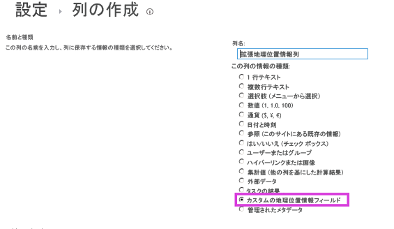

# 方法: クライアント側レンダリングを使用して地理位置情報フィールド型を拡張する
クライアント側レンダリングを使用して、SharePoint 2013の地理位置情報フィールド型をプログラムによってカスタマイズする方法を説明します。
この記事の内容
  
    
    
 [ユーザー設定地理位置情報フィールドの作成の前提条件](#CreatingCustomGeolocation_prereq)
  
    
    
 [ステップ 1: Visual Studio プロジェクトの設定](#CreatingCustomGeolocationStep_1)
  
    
    
 [ステップ 2: ユーザー設定フィールド クラスの作成](#CreatingCustomGeolocationStep_2)
  
    
    
 [ステップ 3: 新しいユーザー設定フィールド用のレンダリングの作成](#CreatingCustomGeolocationStep_3)
  
    
    
 [ステップ 4: フィールド型定義の作成](#CreatingCustomGeolocationStep_4)
  
    
    
 [ステップ 5: ユーザー設定フィールド型の作成およびテスト](#CreatingCustomGeolocationStep_5)
  
    
    
 [その他の技術情報](#SP15Createcustomgeo_addlresources)
  
    
    

SharePoint 2013では、地理位置情報フィールドという新しいフィールド型を導入しています。このフィールドを使用して、SharePoint リストに位置情報の注釈を付けることができます。地理位置情報型の列で、位置情報を緯度と経度の座標として小数の度数で入力するか、または、ブラウザー (W3C Geolocation API を実装している場合) からユーザーの現在の位置座標を取得することができます。地理位置情報フィールドの詳細については、「 [SharePoint 2013 でロケーションとマップ機能を組み込む](integrating-location-and-map-functionality-in-sharepoint-2013.md)」を参照してください。 
地理位置情報フィールド型は、SharePoint 2013のリストまたはドキュメント ライブラリの既定のコンテンツ タイプには提供されていません。地理位置情報フィールド型は SharePoint 2013に含まれていますが、リスト用の列の作成のページには表示されないため、プログラムで追加する必要があります。詳細については、「 [[方法] SharePoint 2013 で地理位置情報列をプログラムでリストに追加する](how-to-add-a-geolocation-column-to-a-list-programmatically-in-sharepoint-2013.md)」を参照してください。 
  
    
    

SharePoint 2013に地理位置情報フィールド型を追加したら、Bing Maps を使用して地図を表示するのに使用できます。組み込みの地理位置情報フィールドは Bing Maps でしか表示できません。ただし、地理位置情報フィールドを親フィールド型として使用してユーザー設定フィールドを作成できます。ユーザー設定レンダリングはクライアント側のレンダリング機構にある **JSLink** プロパティによって実現します。クライアント側のレンダリング機構は SharePoint 2013に導入されています。詳細については、「 [[方法] クライアント側レンダリングを使用して、フィールド タイプをカスタマイズする](how-to-customize-a-field-type-using-client-side-rendering.md)」を参照してください。 
> **メモ**
> JSLink プロパティは、アンケート リストやイベント リストではサポートされません。SharePoint の予定表は、イベント リストです。 
  
    
    

このセクションの手順では、クライアント側レンダリングを使用して、地理位置情報フィールド型から派生するユーザー設定フィールドを作成します。 
## ユーザー設定地理位置情報フィールドの作成の前提条件
<a name="CreatingCustomGeolocation_prereq"> </a>

次のものが必要です。
  
    
    

- SharePoint 2013が実行されているサーバー
    
  
- Microsoft Visual Studio 2012
    
  
- Office Developer Tools for Visual Studio 2012
    
  
- SharePoint 2013 リストへのアクセスと、列を追加する権限
    
  

### 地理位置情報フィールドのカスタマイズ方法を理解するための中心概念


  
    
    

**表 1: 地理位置情報フィールド型の拡張方法の中心概念**


|**記事のタイトル**|**説明**|
|:-----|:-----|
| [SharePoint 2013 でロケーションとマップ機能を組み込む](integrating-location-and-map-functionality-in-sharepoint-2013.md) <br/> |新しい地理位置情報フィールドを使用し、独自の地理位置情報ベースのフィールド型を作成して、SharePoint リストとロケーションベースの Web およびモバイル アプリケーションに位置情報と地図を統合する方法を確認します。  <br/> |
| [[方法] クライアント側レンダリングを使用して、フィールド タイプをカスタマイズする](how-to-customize-a-field-type-using-client-side-rendering.md) <br/> |SharePoint 2013に導入された新しいクライアント側レンダリングの詳細について確認します。  <br/> |
| [[方法] SharePoint 2013 で地理位置情報列をプログラムでリストに追加する](how-to-add-a-geolocation-column-to-a-list-programmatically-in-sharepoint-2013.md) <br/> |地理位置情報列を SharePoint 2013のリストにプログラムで追加する方法を確認します。  <br/> |
   

## ステップ 1: Visual Studio プロジェクトの設定
<a name="CreatingCustomGeolocationStep_1"> </a>


### ユーザー設定フィールド プロジェクトをセットアップするには


1. SharePoint Server 2013がインストールされているコンピューターで Visual Studio 2012 を起動します。
    
  
2. [ **新しいプロジェクト**] ダイアログ ボックスの [ **インストールされたテンプレート**] で、[ **Visual C#**]、[ **Office SharePoint**]、[ **SharePoint ソリューション**] を順に選択します。[ **SharePoint 2013**] プロジェクトの種類を選択します。図 1 は、Visual Studio 2012 の [ **SharePoint 2013 プロジェクト**] テンプレートの場所を示しています。セキュリティで保護されたソリューションではなく [ **ファーム ソリューション**] にします。
    
   **図 1. Visual Studio の SharePoint 2013 プロジェクト テンプレート**

  


  

  

  
3. プロジェクトの名前を指定します。この例では **CustomGeolocationField** を使用します。次に、[ **OK**] をクリックします。
    
  
4. **SharePoint カスタマイズ ウィザード**で、新しいユーザー設定フィールド型を展開する SharePoint サイトの URL を入力します。
    
  
5. **ソリューション エクスプローラー**でプロジェクト名 (この例では [ **CustomGeolocationField**]) のショートカット メニューを開き、[ **追加**]、[ **新しいアイテム**] を順に選択します。
    
  
6. [ **新しいアイテムの追加**] ダイアログ ボックスの [ **コード**] テンプレートで、[ **クラス**] を選択し、クラスの名前 (この例では **CustomGeolocationField.cs**) を指定します。
    
  
7. **ソリューション エクスプローラー**でプロジェクト名のショートカット メニューを開き、[ **追加**]、[ **SharePoint mapped folder**] (SharePoint のマップされたフォルダー) を順に選択します。
    
  
8. [ **Add SharePoint Mapped Folder**] (SharePoint のマップされたフォルダーの追加) ダイアログ ボックスで、ツリー コントロールを使用してフォルダーを [ **TEMPLATE\\LAYOUTS**] に割り当て、[ **OK**] をクリックします。
    
  
9. **ソリューション エクスプローラー**で、プロジェクト名ではなく新しい [ **LAYOUTS**] フォルダーのショートカット メニューを開き、[ **追加**]、[ **新しいアイテム**] を順に選択します。
    
  
10. [ **新しいアイテムの追加**] ダイアログ ボックスで [ **Visual C#**]、[ **Web**] を順に選択し、[ **テンプレート**] の下の [ **Javascript ファイル**] を選択します。
    
  
11. [ **名前**] ボックスでファイルの名前 (この例では CustomGeolocationField) を指定し、[ **追加**] を選択します。
    
  
12. ステップ 8 を繰り返して、別の SharePoint のマップされたフォルダーを作成し、それを [ **TEMPLATE\\XML**] に割り当てます。次に、[ **OK**] を選択します。
    
  
13. **ソリューション エクスプローラー**で、プロジェクト名ではなく新しい [ **XML**] フォルダーのショートカット メニューを開き、[ **追加**]、[ **新しいアイテム**] を順に選択します。
    
  
14. [ **新しいアイテムの追加**] ダイアログ ボックスで [ **Visual C#**]、[ **データ**] を順に選択し、[ **テンプレート**] の下の [ **XML ファイル**] を選択します。
    
  
15. [ **名前**] ボックスでファイルの名前 (この例では fldtypes_CustomGeolocationControl.xml を使用) を指定し、[ **追加**] を選択します。
    
  

## ステップ 2: ユーザー設定フィールド クラスの作成
<a name="CreatingCustomGeolocationStep_2"> </a>

 フィールド クラスは、そのインスタンスによって、ユーザー設定フィールド型に基づいく特定のフィールドを表すことができるクラスのことです。このクラスは、 **SPField** または、そこから派生した SharePoint Foundation のクラスのいずれかを継承する必要があります。地理位置情報フィールド型の拡張またはカスタマイズを実現するには、このクラスが **SPFieldGeolocation** を継承している必要があります。フィールド型の作成方法の詳細については、「 [[ウォークスルー] ユーザー設定フィールド型を作成する](http://msdn.microsoft.com/library/089a1b8a-cafc-4050-b445-16650602fe4f%28Office.15%29.aspx)」を参照してください。 
  
    
    

> **メモ**
> この例では、クラスおよびソリューションに **CustomGeolocationField** という名前が付けられています。Visual Studio プロジェクトの作成時にクラスおよびプロジェクトの名前を指定することができます。
  
    
    


### ユーザー設定フィールド クラスを作成するには


1. CustomGeolocationField.cs ファイルを開き、下のようにして **using** ディレクティブを追加します。
    
  ```cs
  
using System;
using Microsoft.SharePoint;
using Microsoft.SharePoint.WebControls;
  ```

2. 名前空間が **CustomGeolocationField** であることを確認します。
    
  
3. クラスに **CustomGeolocationField** という名前が付けられていることを確認し、その宣言を変更して **SPFieldGeolocation** クラスから継承されるよう指定します。クラスに必要な次のコンストラクターを追加します。
    
  ```cs
  
public class CustomGeolocationField : SPFieldGeolocation
    {
        /// <summary>
        /// Create an instance of CustomGeolocationField object.
        /// </summary>
        /// <param name="fields">Field collection</param>
        /// <param name="fieldName">Name of the field</param>
        /// 
        public CustomGeolocationField(SPFieldCollection fields, string fieldName)
            : base(fields, fieldName)
        {
        }

        /// <summary>
        /// Create an instance of CustomGeolocationField object.
        /// </summary>
        /// <param name="fields">Field collection</param>
        /// <param name="typeName">type name of the field</param>
        /// <param name="displayName">display name of the field</param>

        public CustomGeolocationField(SPFieldCollection fields, string typeName, string displayName)
            : base(fields, typeName, displayName)
        {
        }
  ```

4. **JSLink** メソッドの次のオーバーライドをクラスに追加します。CustomGeolocationControl.js は次のステップで作成する JavaScript ファイルです。独自の JavaScript ファイルを指定することによって、Bing Maps の既定のレンダリングをオーバーライドします。このメソッドをオーバーライドしない場合は、Bing Maps の既定のレンダリングが実行されます。 **JSLink** プロパティは SharePoint 2013に導入されています。 **JSLink** プロパティの詳細については、「 [[方法] クライアント側レンダリングを使用して、フィールド タイプをカスタマイズする](how-to-customize-a-field-type-using-client-side-rendering.md)」を参照してください。
    
  ```cs
  
/// <summary>
        /// Override JSLink property.
        /// </summary>

public override string JSLink
        {
            get
            {
                return "CustomGeolocationControl.js";
            }
            set
            {
                base.JSLink = value;
            }
        }
  ```

5. **GetFieldValue** メソッドは指定された値をフィールド型の値に変換します。 **GetFieldValue** メソッドの詳細については、「 [GetFieldValue(String)](https://msdn.microsoft.com/library/Microsoft.SharePoint.SPField.GetFieldValue.aspx) 」を参照してください。 **GetFieldValue** メソッドの次のオーバーライドを **CustomGeolocationField** クラスに追加します。
    
  ```cs
  
/// <summary>
        /// get the field values
        /// </summary>
        /// <param name="value"></param>
        /// <returns></returns>
        
        public override object GetFieldValue(string value)
        {
            return base.GetFieldValue(value);
        }
  ```

6.  [GetValidatedString](https://msdn.microsoft.com/library/Microsoft.SharePoint.SPField.GetValidatedString.aspx) メソッドの次のオーバーライドを **CustomGeolocationField** クラスに追加します。
    
  ```cs
  
/// <summary>
        /// get validated string
        /// </summary>
        /// <param name="value"></param>
        /// <returns></returns>
        
       public override string GetValidatedString(object value)
        {
            return base.GetValidatedString(value);
        }
  ```


## ステップ 3: 新しいユーザー設定フィールド用のレンダリングの作成
<a name="CreatingCustomGeolocationStep_3"> </a>

次に、このフィールド クラスの **JSLink** メソッドがポイントする JavaScript ファイルを作成する必要があります。このファイルでは、新しいクライアント側レンダリング機構を使用するユーザー設定フィールド型のレンダリングを定義します。詳細については、「 [[方法] クライアント側レンダリングを使用して、フィールド タイプをカスタマイズする](how-to-customize-a-field-type-using-client-side-rendering.md)」を参照してください。
  
    
    
次の例に、SharePoint 2013に導入されたクライアント側レンダリング機構への登録に必要なロジックを示します。
  
    
    


```

function _registerCustomGeolocationFieldTemplate() {
          
            var geolocationFieldContext = {};
            geolocationFieldContext.Templates = {};
            geolocationFieldContext.Templates.Fields = {

                'CustomGeolocationField': {
                    'View': CustomGeolocationFieldTemplate.RenderGeolocationField,
                    'DisplayForm': CustomGeolocationFieldTemplate.SPFieldGeolocation_Display,
                    'EditForm': CustomGeolocationFieldTemplate.SPFieldGeolocation_Edit,
                    'NewForm': CustomGeolocationFieldTemplate.SPFieldGeolocation_Edit
                }
            };
            SPClientTemplates.TemplateManager.RegisterTemplateOverrides(geolocationFieldContext);
        }
```

登録プロセスには 4 つの変数とそれぞれのメソッドが存在します。クライアント側レンダリング機構は **CustomGeolocationControl** のレンダリングのため、これらのメソッドを呼び出します。
  
    
    
次のコード例では、地理位置情報から派生する新しいユーザー設定フィールド用の新しいレンダリングが作成されます。
  
    
    

### JavaScript ファイルを作成するには


1. テキスト ファイルを作成して、x などの名前を指定し、拡張子 .js を付与して、SharePoint のマップされたフォルダー TEMPLATE\\LAYOUTS に保存します。この例では **CustomGeolocationControl.js** という名前を使用します。
    
  
2. 次のコードを .js ファイルにコピーします。
    
  ```
  
(function () {
        if (typeof CustomGeolocationFieldTemplate == "object") {
            return;
        }
        window.CustomGeolocationFieldTemplate = (function () {
            return {
                SPFieldGeolocation_Display: function (rCtx) {
                    if (rCtx == null || rCtx.CurrentFieldValue == null || rCtx.CurrentFieldValue == '')
                        return '';
                    var listItem = rCtx['CurrentItem'];
                    var fldvalue = CustomGeolocationFieldTemplate.ParseGeolocationValue(listItem[rCtx.CurrentFieldSchema.Name]);
                    var _myData = SPClientTemplates.Utility.GetFormContextForCurrentField(rCtx);

                    if (_myData == null || _myData.fieldSchema == null)
                        return '';
                    var _latitude = 0;
                    var _longitude = 0;

                    if (fldvalue != null) {
                        _latitude = fldvalue.latitude;
                        _longitude = fldvalue.longitude;
                    }
                  
                    var result = '<div>';
                    result += '<span>Latitude:</span><span>' + _latitude + '</span><span>Longitude:</span><span>' + _longitude + '</span>';
                    result += '</div>';
                    return result;
                },                
                ParseGeolocationValue: function (fieldValue) {

                    if (fieldValue == null || fieldValue == '')
                        return null;

                    var point = new Object();
                    point.longitude = null;
                    point.latitude = null;
                    point.altitude = null;
                    point.measure = null;

                    var matches = fieldValue.match(/POINT\\s*\\((\\d+(\\.\\d+)?)\\s+(\\d+(\\.\\d+)?)\\s+(\\d+(\\.\\d+)?)\\s+(\\d+(\\.\\d+)?)\\)/i);
                    if (matches != null) {

                        point.longitude = parseFloat(matches[1]);
                        point.latitude = parseFloat(matches[3]);
                        point.altitude = parseFloat(matches[5]);
                        point.measure = parseFloat(matches[7]);
                    }
                    else
                    {
                        matches = fieldValue.match(/POINT\\s*\\((\\d+(\\.\\d+)?)\\s+(\\d+(\\.\\d+)?)\\)/i);
                        if (matches != null) {

                            point.longitude = parseFloat(matches[1]);
                            point.latitude = parseFloat(matches[3]);
                        }
                    }
                    return point;
                },
                SPFieldGeolocation_Edit: function (rCtx) {
                    if (rCtx == null)
                        return '';
                    var _myData = SPClientTemplates.Utility.GetFormContextForCurrentField(rCtx);

                    if (_myData == null || _myData.fieldSchema == null)
                        return '';
                    var _latitude = null;
                    var _longitude = null;
                    var _inputId_Latitude = _myData.fieldName + '_' + _myData.fieldSchema.Id + '_$geolocationField_Latitude';
                    var _inputId_Longitude = _myData.fieldName + '_' + _myData.fieldSchema.Id + '_$geolocationField_Longitude';
                    var _inputId_Div = _myData.fieldName + '_' + _myData.fieldSchema.Id + '_$geolocationField_Div';
                    var _latitudeBox = null;
                    var _longitudeBox = null;

                    var _value = _myData.fieldValue != null ? _myData.fieldValue : '';
                    var listItem = rCtx['CurrentItem'];
                    var fldvalue = CustomGeolocationFieldTemplate.ParseGeolocationValue(listItem[rCtx.CurrentFieldSchema.Name]);

                    if (fldvalue != null) {
                        _latitude = fldvalue.latitude;
                        _longitude = fldvalue.longitude;
                    }

                    var validators = new SPClientForms.ClientValidation.ValidatorSet();

                    if (_myData.fieldSchema.Required)
                        validators.RegisterValidator(new SPClientForms.ClientValidation.RequiredValidator());

                    _myData.registerClientValidator(_myData.fieldName, validators);

                    // Post DOM initialization callback.
                    _myData.registerInitCallback(_myData.fieldName, function () {

                        // Initialize the input control references.
                        _latitudeBox = document.getElementById(_inputId_Latitude);
                        _longitudeBox = document.getElementById(_inputId_Longitude);

                        // Set the initial values.
                        if ((_latitudeBox != null &amp;&amp; _longitudeBox != null) &amp;&amp;
                            (_latitude != null &amp;&amp; _longitude != null)) {
                            _latitudeBox.value = _latitude;
                            _longitudeBox.value = _longitude;
                        }
                    });
                    // On focus call back.
                    _myData.registerFocusCallback(_myData.fieldName, function () {
                        if (_latitudeBox != null)
                            _latitudeBox.focus();
                    });
                    // Validation failure handler.
                    _myData.registerValidationErrorCallback(_myData.fieldName, function (errorResult) {
                        SPFormControl_AppendValidationErrorMessage(_inputId_Div, "invalid Geolocation Field");
                    });

                    // Register a callback just before submit.
                    _myData.registerGetValueCallback(_myData.fieldName, function () {
                        if (_latitudeBox == null &amp;&amp; _longitudeBox == null)
                            return '';
                        else {
                            _latitude = _latitudeBox.value;
                            _longitude = _longitudeBox.value;

                            if (_latitude != null &amp;&amp; _longitude != null)
                                return "Point(" + _longitude + " " + _latitude + ")";
                        }
                    });
                    _myData.updateControlValue(_myData.fieldName, _value);

                    var result = '<div width="100%" id=' + STSHtmlEncode(_inputId_Div) + '>';
                    result += '<div><span>Latitude:</span><input id=' + STSHtmlEncode(_inputId_Latitude) + ' type="text" name="Latitude" /></div>';
                    result += '<div><span>Longitude:</span><input id=' + STSHtmlEncode(_inputId_Longitude) + ' type="text" name="Longitude" /></div>';
                    result += '</div>';
                    return result;

                },
                RenderGeolocationField: function (inCtx, field, listItem, listSchema) {
                    var fldvalue = CustomGeolocationFieldTemplate.ParseGeolocationValue(listItem[field.Name]);
                    var result = '';

                    if (fldvalue != null) {
                        var result = '<div>';
                        result += '<span>Latitude:</span><span>' + fldvalue.latitude + '</span><span>Longitude:</span><span>' + fldvalue.longitude + '</span>';
                        result += '</div>';                            
                    }
                    return result;                    
                }                                       
            };
        })();
        function _registerCustomGeolocationFieldTemplate() {
          
            var geolocationFieldContext = {};
            geolocationFieldContext.Templates = {};
            geolocationFieldContext.Templates.Fields = {

                'CustomGeolocationField': {
                    'View': CustomGeolocationFieldTemplate.RenderGeolocationField,
                    'DisplayForm': CustomGeolocationFieldTemplate.SPFieldGeolocation_Display,
                    'EditForm': CustomGeolocationFieldTemplate.SPFieldGeolocation_Edit,
                    'NewForm': CustomGeolocationFieldTemplate.SPFieldGeolocation_Edit
                }
            };
            SPClientTemplates.TemplateManager.RegisterTemplateOverrides(geolocationFieldContext);
        }
        ExecuteOrDelayUntilScriptLoaded(_registerCustomGeolocationFieldTemplate, 'clienttemplates.js');
    })();
  ```


## ステップ 4: フィールド型定義の作成
<a name="CreatingCustomGeolocationStep_4"> </a>

フィールド型定義は  _fldtypes*.xml_ などの名前の XML ファイルで、%ProgramFiles%\\Common Files\\Microsoft Shared\\web server extensions\\15\\TEMPLATE\\XML に展開されます。フィールド定義ファイルには、SharePoint Foundation がリスト ビューと、表示、編集、新規作成フォームでフィールドを正しくレンダリングするのに必要な情報が含まれます。最も重要な点は、定義にはコンパイルされたフィールド型を含むアセンブリに関する情報が含まれるということです。フィールド型の定義の詳細については、「 [[方法] ユーザー設定フィールド型の定義を作成する](http://msdn.microsoft.com/library/b3315997-671f-4c29-9518-48cc4592f205%28Office.15%29.aspx)」を参照してください。
  
    
    

### フィールド型定義を作成するには


1. Visual Studio でプロジェクトをビルドします。プロジェクトは完成していませんが、アセンブリの GUID と公開キー トークンを生成するために、この時点でビルドする必要があります。 
    
  
2. fldtypes_CustomGeolocationControl.xml ファイルを開き、そのコンテンツを次のマークアップに置き換えます。
    
  ```XML
  
?xml version="1.0" encoding="utf-8" ?>

<FieldTypes>
  <FieldType>
    <Field Name="TypeName">CustomGeolocationField</Field>
    <Field Name="ParentType">Geolocation</Field>
    <Field Name="TypeDisplayName">Custom Geolocation field</Field>
    <Field Name="TypeShortDescription"> Custom Geolocation field </Field>
    <Field Name="UserCreatable">TRUE</Field>
    <Field Name="ShowOnListCreate">TRUE</Field>
    <Field Name="ShowOnSurveyCreate">TRUE</Field>
    <Field Name="ShowOnDocumentLibraryCreate">TRUE</Field>
    <Field Name="ShowOnColumnTemplateCreate">TRUE</Field>
    <Field Name="FieldTypeClass">CustomGeolocationField.CustomGeolocationField,$SharePoint.Project.AssemblyFullName$</Field>
    <Field Name="SQLType">nvarchar</Field>
  </FieldType>
</FieldTypes>

  ```


    このファイルは、SharePoint 2013のユーザー設定フィールド型を定義するものです。要素の目的と意味の詳細については、「 [ユーザー設定フィールド型の定義](http://msdn.microsoft.com/library/b3315997-671f-4c29-9518-48cc4592f205%28Office.15%29.aspx)」、「 [FldTypes.xml](http://msdn.microsoft.com/library/8f8db866-03f8-4001-aae3-4c4102a7aed6%28Office.15%29.aspx)」、「 [FieldTypes 要素 (フィールド型)](http://msdn.microsoft.com/library/ebac779f-c7c5-401b-8503-e514cd96f5a7%28Office.15%29.aspx)」、「 [FieldType 要素 (フィールド型)](http://msdn.microsoft.com/library/9ab89988-3462-422f-9808-40618da7316b%28Office.15%29.aspx)」、「 [Field 要素 (フィールド型)](http://msdn.microsoft.com/library/c168e8bc-8aba-4b72-a9c4-a0ad7a4aff9a%28Office.15%29.aspx)」を参照してください。 **<Field Name="FieldTypeClass">** 要素は、1 行で記述する必要があります。
    
  
3. **<Field Name="FieldTypeClass">** 要素の値は、ユーザー設定フィールド クラスの完全修飾名、コンマ、Visual Studio トークン ( `$SharePoint.Project.AssemblyFullName$`) です。プロジェクトのコンパイル時にこのファイルのコピーが作成され、そのコピー内でトークンが 4 つの部分で構成される完全なアセンブリ名に置き換えられます。そのコピーは Visual Studio 2012 の Visual Studio [ **ビルド**] メニューの [ **ソリューションの展開**] を選択すると展開されます。
    
  

## ステップ 5: ユーザー設定フィールド型の作成およびテスト
<a name="CreatingCustomGeolocationStep_5"> </a>

ユーザー設定フィールドを SharePoint サーバーに展開すると、ソリューションが展開されているサーバー上の任意の SharePoint リストに新しいユーザー設定列を追加できるようになります。
  
    
    

1. F5 キーを選択します。
    
    > **メモ**
      > F5 キーを選択すると、Visual Studio によってソリューションがビルドされて展開され、ソリューションが展開された SharePoint Web サイトが開きます。 
2. カスタム リストを作成し、新しいユーザー設定地理位置情報フィールド列を追加します。
    
  
3. リストにアイテムを 1 つ追加し、ユーザー設定地理位置情報列に経度と緯度の値を入力します。
    
  
4. 図 2 は、新しいユーザー設定フィールド型を含む [列の作成] ページを示しています。
    
   **図 2. 新しいユーザー設定フィールド型の列を作成する**

  


  

  

  

## その他の技術情報
<a name="SP15Createcustomgeo_addlresources"> </a>


-  [SharePoint 2013 でロケーションとマップ機能を組み込む](integrating-location-and-map-functionality-in-sharepoint-2013.md)
    
  
-  [[方法] SharePoint 2013 で地理位置情報列をプログラムでリストに追加する](how-to-add-a-geolocation-column-to-a-list-programmatically-in-sharepoint-2013.md)
    
  
-  [[方法] クライアント側レンダリングを使用して、フィールド タイプをカスタマイズする](how-to-customize-a-field-type-using-client-side-rendering.md)
    
  
-  [SharePoint 2013: Create a Geolocation field that renders maps using Nokia Maps](http://code.msdn.microsoft.com/SharePoint-2013-Create-a-d9a91551)
    
  
-  [[方法] ユーザー設定フィールド型を作成する](http://msdn.microsoft.com/library/aacdc6d1-86c8-4a6b-953d-22ecac209d0f%28Office.15%29.aspx)
    
  
-  [Deploying files using Mapped Folders](http://blogs.msdn.com/b/vssharepointtoolsblog/archive/2010/03/12/deploying-files-using-mapped-folders.aspx)
    
  

