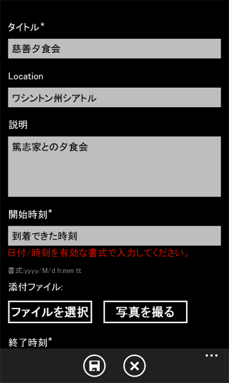
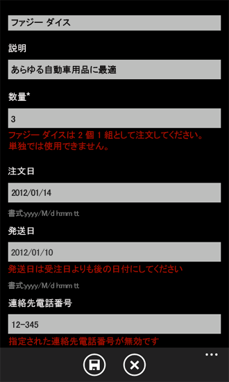

# SharePoint 2013 用 Windows Phone アプリにビジネス ロジックとデータ検証を実装する方法
Windows Phone の SharePoint リスト アプリケーションのテンプレートを使用して作成した Windows Phone アプリケーションへのデータ入力規則の実装
実稼働環境での使用を目的とした Windows Phone アプリケーションでは、たとえば、特定の状況に関連するビジネス ロジックを適用したり、入力された値が適切な形式であるかを確認したり、あるいは、単に SharePoint リストに値を保存する前に間違いを検出したりするために、ユーザーの入力データを検証する必要があります。Windows Phone の SharePoint リスト アプリケーションのテンプレートをベースにして作成したプロジェクトには既定のデータの入力規則ロジックが含まれていますが、それだけでなく、カスタムのデータ入力規則を実装するためのメカニズムも用意されています。
  
    
    


> **重要**
> Windows Phone 8 用のアプリを開発している場合、Visual Studio 2010 Express の代わりに Visual Studio Express 2012 を使用する必要があります。開発環境を除いて、この記事のすべての情報は Windows Phone 8 および Windows Phone 7 の両方のアプリの作成に適用されます。 > 詳細については、「 [[方法]: SharePoint 用モバイル アプリの開発環境をセットアップする](how-to-set-up-an-environment-for-developing-mobile-apps-for-sharepoint.md)」を参照してください。 
  
    
    


## 既定のデータ入力規則
<a name="BKMK_DefaultValidation"> </a>

SharePoint リストのフィールドのデータ型の一部は、簡易なフォーマット設定またはデータ入力規則に既定で関連付けられています。データ型が SharePoint リストのハイパーリンク型または図型に基づくフィールドに無効な URL を入力して保存しようとすると、入力したアドレスが無効であることを示すメッセージが表示されます。日付/時刻型のフィールドの値としてカスタマー名を入力すると、そのフィールドで有効とされる範囲の日付を入力するように求めるメッセージが表示されます。
  
    
    

> **メモ**
> 日付の入力検証は SharePoint の日付形式に関する機能です。電話のロケールの日付形式が必要な場合は、フィールドをカスタマイズし、その内容に応じて検証を追加します。 
  
    
    

また、このような基本の入力規則の一部は、Windows Phone SharePoint リスト アプリケーションのテンプレートから作成した Windows Phone アプリケーションに既定で適用されます。SharePoint リストをベースにした Windows Phone アプリケーションの編集フォームで、日付/時刻型の SharePoint フィールドにバインドされたフィールドに日付以外の値を入力した場合、そのフィールドに関連付けられている **TextBox** コントロールからフォーカスが移動したときに、入力規則エラー メッセージが表示されます (図 1. を参照)。
  
    
    

**図 1. Windows Phone アプリケーションの入力規則エラー キュー**

  
    
    

  
    
    

  
    
    
編集フォーム内の [開始時刻] という名前のテキスト ボックスは、このサンプル アプリケーションがベースにしている SharePoint リスト内の日付/時刻フィールドにバインドされています。テキスト ボックスに無効な日付が入力されると、図 1 のような入力規則エラー キュー (赤い文字で表示) が表示されます (そして、 **TextBox** コントロールの **Text** プロパティに関連付けられている **Binding** オブジェクトの **ValidatesOnNotifyDataErrors** プロパティが、EditForm.xaml ファイルの **TextBox** を定義する XAML 宣言で **True** に設定されているため、テキスト ボックスからフォーカスが失われます)。
  
    
    


```XML

<StackPanel Orientation="Vertical" Margin="0,5,0,5">
   <TextBlock TextWrapping="Wrap" HorizontalAlignment="Left" 
                    Style="{StaticResource PhoneTextNormalStyle}">Start Time*
   </TextBlock>
   <TextBox Height="Auto" Style="{StaticResource TextValidationTemplate}"
    FontSize="{StaticResource PhoneFontSizeNormal}" Width="470" 
        HorizontalAlignment="Left" Name="txtEventDate"
    Text="{Binding [EventDate], Mode=TwoWay, ValidatesOnNotifyDataErrors=True,
                       NotifyOnValidationError=True}"
    TextWrapping="Wrap" />
   <TextBlock FontSize="16" TextWrapping="Wrap" HorizontalAlignment="Left"
    Style="{StaticResource PhoneTextSubtleStyle}" Text="{Binding DateTimeFormat}" />
</StackPanel>
```

( **ValidatesOnNotifyDataErrors** プロパティが **False** に設定されている場合、入力データが無効であることは、[ **保存**] ボタンをクリックするまでユーザーに示されません。入力された日付値のフォーマットの検証は引き続き **EditItemViewModel** クラスの派生元である基本クラスによって実行されるため、ボタンがクリックされた時点で入力規則エラーに関するエラー メッセージが表示されます。)
  
    
    
しかし、フィールドによっては、Windows Phone アプリケーションに無効なデータが入力されても通知を一切行いません。さらに、適切に設計された Visual Studio プロジェクト テンプレートであれば、多様なアプリケーションのスタート地点として使用されるべく、必然的に一般化されています。Windows Phone SharePoint リスト アプリケーションのテンプレートには特定のコンテキストに関連する入力規則を含めることはできませんが、一般化されたテンプレートとしてなら値を保持できます。自分のニーズと、開発した Windows Phone アプリケーションが使用される状況によっては、カスタムのデータ入力規則を実装したい場合もあります。
  
    
    

## カスタムのデータ入力規則の実装
<a name="BKMK_CustomValidation"> </a>

開発した Windows Phone アプリケーションにユーザーが入力したデータを検証するには、さまざまな方法があります。Windows Phone SharePoint リスト アプリケーションのテンプレートを使用して作成したプロジェクトには、Windows Phone アプリケーション内のデータのフォーム (ビュー。例: EditForm.xaml ファイル) と、そのアプリケーションがベースにしている SharePoint リスト内のデータ自体との仲介役として機能するクラスが含まれます。これらのクラスは、 [Model-View-ViewModel 設計パターン](http://blogs.msdn.com/b/johngossman/archive/2005/10/08/478683.aspx) (図 2) の ViewModel コンポーネントの実装と見なすことができます (MVVM ソフトウェア設計パターンに対する Windows Phone SharePoint リスト アプリケーションのテンプレートの適合について詳しくは、「 [Windows Phone SharePoint List Application テンプレートのアーキテクチャ](architecture-of-the-windows-phone-sharepoint-list-application-template.md)」を参照してください)。
  
    
    

> **メモ**
> SharePoint リスト テンプレートには既定の入力規則 (SharePoint タスク リストの達成率、チーム ディスカッション リストの事後チェック、および SP 10 進数フィールド型の入力規則など) は含まれませんが、これらの入力規則を実装することができます。 
  
    
    


**図 2. ViewModel コンポーネントのテンプレート ファイル**

  
    
    

  
    
    

  
    
    
MVVM パターンに基づいて設計されたアプリケーションでは、データの入力規則はしばしば、データ層 (Model コンポーネント) によって処理されます。Windows Phone SharePoint リスト アプリケーションのテンプレートから作成したプロジェクトでは、開発者がデータ入力規則を管理しやすいように、データ入力規則のための拡張可能なメカニズムがレイヤーにプッシュされ、ViewModel コンポーネントに実装されています。したがって、このテンプレートに基づいたプロジェクトでは、ユーザー入力を検証するかあるいは別の方法でデータを管理するカスタム コードに最適な場所は、これらの ViewModel クラス内です。データ入力規則の観点からは、 **EditItemViewModel** クラスおよび **NewItemViewModel** クラス (リスト データの編集と更新によく使用されるフォームに関連付けられているクラス) は、どちらも、この 2 つのクラスの派生元のクラス内の基本の検証メソッドをオーバーライドする検証メソッド ( **Validate**) のオープンな実装を提供します。
  
    
    


```cs

public override void Validate(string fieldName, object value)
   {
      base.Validate(fieldName, value);
   }
```

このメソッドは、個別のフィールドを対象とするカスタム入力規則ロジックを追加したい開発者向けの便利なメカニズムを提供します。一般的なアプローチでは、自分のカスタム入力規則コードに関連付けるフィールドを特定するために、 **Validate** メソッドに渡される **fieldName** 引数の値を確認します。たとえば、このメソッドの実装で **switch** ステートメントを使用することで、開発した Windows アプリケーションの編集フォーム (EditForm.xaml) 内のさまざまなフィールドに固有の入力規則ロジックを提供できます。
  
    
    
次のコード例では、SharePoint Server のインストールに、カスタム リストのテンプレートから作成した製品注文リストが含まれていると仮定しています。このリストは、表 1 に示す列とフィールドのデータ型から成ります。
  
    
    

**表 1. 製品注文リスト**


|**列**|**データ型**|**必須**|
|:-----|:-----|:-----|
|製品 (タイトルなど)  <br/> |1 行のテキスト (テキスト型)  <br/> |はい  <br/> |
|説明  <br/> |1 行のテキスト (テキスト型)  <br/> |いいえ  <br/> |
|数量  <br/> |数値型  <br/> |はい  <br/> |
|発注日  <br/> |日付/時刻 (Datetime)  <br/> |いいえ  <br/> |
|納品日  <br/> |日付/時刻 (Datetime)  <br/> |いいえ  <br/> |
|連絡先電話番号  <br/> |1 行のテキスト (テキスト型)  <br/> |いいえ  <br/> |
   
繰り返しますが、この例の目的は、Contoso, Ltd. という架空の企業で採用されているビジネス ロジックに基づき、指定された製品注文システムで、次のシンプルな入力規則が適用されるようにすることです。
  
    
    

- 注文の納品日は、発注日よりも後の日付である必要があります。
    
  
- Fuzzy Dice という製品を注文する場合、ペアで注文する必要があります。Contoso, Ltd 固有の入力規則に従うと、Fuzzy Die という単数の製品は存在しません。
    
  
- 製品注文リストで、連絡先電話番号フィールドのデータ型は "1 行のテキスト" (テキスト型) であり、任意のテキストを入力できます (既定では 255 文字以内まで)。この例では、一般的な電話番号フォーマットの 1 つである "(555) 555-5555" の形式によるデータの入力を求めるフォーマット入力規則が適用されます。
    
  

### カスタムの入力規則を実装するには


1. 表 1 で指定した列とデータ型を含むカスタム リスト テンプレートをベースにした SharePoint リストが作成済みであることを前提として、Visual Studio の Windows Phone SharePoint リスト アプリケーションのテンプレートを使用して、「 [[方法] Windows Phone 用の SharePoint 2013 リスト アプリを作成する](how-to-create-a-windows-phone-sharepoint-2013-list-app.md)」の手順に従って Windows Phone アプリケーションを作成します。
    
  
2. **ソリューション エクスプローラー**で、プロジェクトの ViewModels フォルダーに移動し、EditItemViewModel.cs ファイルをダブルクリック (またはこのファイルを選択して F7キーを押し)、ファイルを開いて編集できるようにします。
    
  
3. 次の **using** ディレクティブを、ファイルの上部にあるディレクティブのリストに追加します。
    
  ```cs
  
using System.Globalization;
using System.Text.RegularExpressions;
  ```

4. ファイル内の **Validate** メソッドの既定の実装を次のコードで置き換えます。
    
  ```cs
  
public override void Validate(string fieldName, object value)
{
    string fieldValue = value.ToString();
    if (!string.IsNullOrEmpty(fieldValue)) //Allowing for blank fields.
    {
        bool isProperValue = false;

        switch (fieldName)
        {
            case "Quantity":
                // Enforce ordering Fuzzy Dice in pairs only.
                int quantityOrdered;
                isProperValue = Int32.TryParse(fieldValue, out quantityOrdered);
                if (isProperValue)
                {
                    if ((quantityOrdered % 2) != 0) // Odd number of product items ordered.
                    {
                        if ((string)this["Title"] == "Fuzzy Dice")
                        {
                            AddError("Item[Quantity]", "Fuzzy Dice must be ordered in pairs. 
                                                                   No such thing as a Fuzzy Die!");
                        }
                        else
                        {
                            // Restriction on ordering in pairs doesn't apply to other products.
                            RemoveAllErrors("Item[Quantity]");
                        }
                    }
                    else
                    {
                        RemoveAllErrors("Item[Quantity]");
                    }
                }
                break;
            case "Fulfillment_x0020_Date":
                // Determine whether fulfillment date is later than order date.
                DateTime fulfillmentDate;
                isProperValue = DateTime.TryParse(fieldValue, CultureInfo.CurrentCulture, 
                              DateTimeStyles.AssumeLocal, out fulfillmentDate);
                if (isProperValue)
                {
                    DateTime orderDate;
                    isProperValue = DateTime.TryParse((string)this["Order_x0020_Date"], 
                               CultureInfo.CurrentCulture, DateTimeStyles.AssumeLocal, out orderDate);

                    if (fulfillmentDate.CompareTo(orderDate) > 0)
                    {
                        RemoveAllErrors("Item[Fulfillment_x0020_Date]");
                    }
                    else
                    {
                        AddError("Item[Fulfillment_x0020_Date]", 
                                "Fulfillment Date must be later than Order Date.");
                    }
                }
                break;
            case "Contact_x0020_Number":
                // Check that contact number is in an appropriate format.
                Regex rx = new Regex(@"^\\(?([0-9]{3})\\)?[-. ]?([0-9]{3})[-. ]?([0-9]{4})$");
                if (rx.IsMatch(fieldValue))
                {
                    RemoveAllErrors("Item[Contact_x0020_Number]");
                }
                else
                {
                    //Specified Contact Number is not a valid phone number.
                    AddError("Item[Contact_x0020_Number]", "Specified Contact Number is invalid.");
                }
                break;
            default:
                // Not adding custom validation for other fields.
                break;
        }
    }

    //And then proceed with default validation from base class.
    base.Validate(fieldName, value);
}
  ```


    このコード例で指定したフィールド名は、表 1 に指定したサンプルの製品注文リストのプロパティに基づいていることを覚えておいてください。(SharePoint Server のリスト フィールドの XML スキーマでは、指定されたフィールドを定義する **Field** 要素の **Name** 属性で、フィールド名のスペースが "_x0020_" という文字列で置き換えられることに注目します。テンプレートは、サーバー上の XML スキーマで定義されているとおり、 **Field** 要素の **DisplayName**属性ではなく、 **Name** 属性を使用します)。EditForm.xaml で定義された入力規則ロジックの実装対象となるフィールドのフィールド名は、 **TextBox**オブジェクトの **Text** プロパティの **Binding** 宣言を確認するか、ListProvider.cs ファイルの **CamlQueryBuilder** クラスの **ViewFields** 文字列を調べることによって特定できます。
    
  
5. ファイルを保存します。
    
  
このサンプル内のカスタムの入力規則コードは、 **Validate** メソッドに渡された **value** 引数が null でも空の文字列でもない場合にのみ実行されます。表 1 で示したように、納品日フィールドと連絡先電話番号フィールドでは、データの入力が必須ではありません (リストが SharePoint Server 内のこのサンプルの用途に合わせて定義されているため)。したがって、この 2 つのフィールドにはデータを入力しなくてもかまいません。 **value** 引数が null かどうかを簡単にチェックして判定するだけでは不十分です。というのも、渡された値は長さ 0 の文字列 (null 値と同等ではない) である可能性があり、このサンプルでは、空白でもかまわないフィールドに長さ 0 の文字列が入力されている場合には、無効と判定しません。数量フィールドと納品日フィールドの入力規則ロジックには、渡された値が適切な型であるか確認するための追加のチェックが含まれます。ここでの初期のチェック ( **switch** ステートメントの前) が渡された値が null ではないことを確かめるだけなら (長さ 0 の文字列というより厳しい条件に対してチェックを行うのではなく)、これらの検証はまだ実行されませんが、渡された値が長さ 0 の文字列である場合、 **連絡先電話番号** フィールドのデータを検証するロジックは引き続き実行されます。そして、このサンプルでは、ユーザーが編集フォームを開くことでリスト アイテムの編集を開始する場合には特に、連絡先電話番号フィールドに空白 (長さ 0 の文字列) をとることを許容します。
  
    
    
プロジェクトをビルドし、Windows Phone エミュレーターに展開して実行する場合、アプリケーションの編集フォーム内のフィールド リストにビジネス ルールに違反するデータを入力することで、入力規則ロジックをテストできます (図 3 を参照)。
  
    
    

**図 3. カスタムの入力規則エラー キュー**

  
    
    

  
    
    

  
    
    
このサンプルのコードが EditItemViewModel.cs ファイルのみに含まれる場合には、これらの入力規則は、編集フォームにユーザーが入力したデータに対してのみ適用されます。これらの入力規則を、ユーザーが新しいアイテムを追加すると、それらのアイテムを編集するときの両方の場面で適用したい場合には、同じ入力規則ロジックを NewItemViewModel.cs ファイルの **Validate** メソッドに含める必要があります (または、できれば、この入力規則ロジックを含む関数を記述したクラス ファイルを別途作成し、同じ関数を EditItemViewModel.cs ファイルと NewItemViewModel.cs ファイルの両方の **Validate** メソッドから呼び出します)。
  
    
    
このサンプルの入力規則ロジックは、ユーザーが入力したデータが入力規則によって許可されている形式ではないことを示すことによって、特定のビジネス ルールを適用しますが、入力データがこのコードによって妨害されたり、変更されることはありません。SharePoint リストにデータを保存する前に、たとえば電話番号を一貫性のある形式に揃えるためにデータを妨害するには、入力された電話番号用のカスタムのデータ変換を実装できます。リスト アイテム フィールドのカスタム データ変換の詳細については、「 [[方法] Windows Phone アプリ用に SharePoint 2013 フィールド タイプをサポートおよび変換する](how-to-support-and-convert-sharepoint-2013-field-types-for-windows-phone-apps.md)」を参照してください。
  
    
    

## その他の技術情報
<a name="SP15Implementbuslogic_addlresources"> </a>


-  [SharePoint 2013 にアクセスする Windows Phone アプリの作成](build-windows-phone-apps-that-access-sharepoint-2013.md)
    
  
-  [Silverlight データ バインディング](http://msdn.microsoft.com/ja-jp/library/cc278072%28VS.96%29.aspx)
    
  
-  [[方法]: SharePoint 用モバイル アプリの開発環境をセットアップする](how-to-set-up-an-environment-for-developing-mobile-apps-for-sharepoint.md)
    
  
-  [Windows Phone SDK 8.0](http://www.microsoft.com/ja-jp/download/details.aspx?id=35471)
    
  
-  [Microsoft SharePoint SDK for Windows Phone 8](http://www.microsoft.com/ja-jp/download/details.aspx?id=36818)
    
  
-  [Windows Phone SDK 7.1](http://www.microsoft.com/ja-jp/download/details.aspx?id=27570)
    
  
-  [Microsoft SharePoint SDK for Windows Phone 7.1](http://www.microsoft.com/ja-jp/download/details.aspx?id=30476)
    
  

