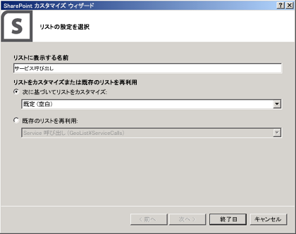
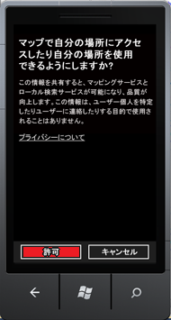

# 方法: Windows Phone アプリおよび SharePoint 2013 リストに地図を統合する
新しい地理位置情報フィールドを使用し、独自の地理位置情報ベースのフィールド型を作成して、SharePoint リストとロケーションベースの Web およびモバイル SharePoint アドインに位置情報と地図を統合する方法を確認します。
SharePoint 2013では、地理位置情報フィールドという新しいフィールド型を導入しています。このフィールドを使用して、SharePoint リストに位置情報の注釈を付けることができます。地理位置情報型の列で、位置情報を緯度と経度の座標として小数の度数で入力するか、または、ブラウザー (W3C Geolocation API を実装している場合) からユーザーの現在の位置座標を取得できます。リストでは、SharePoint 2013が Bing Maps の機能を利用して地図に場所を表示します。また、地理位置情報フィールドとマップ ビューを使用すると、SharePoint データをマッピング エクスペリエンスに統合することによって任意の情報に空間情報を付加し、ユーザーに Web およびモバイル アプリケーションおよびソリューションの新しい利用方法を提示できます。ここでは、マッピング機能を使用する SharePoint 2013の地理位置情報フィールド型を使用する簡単な Windows 7 モバイル アプリケーションの作成について説明し、モバイル向け SharePoint アドインのリスト アイテムに地図を表示できるようにします。
  
    
    


> **重要**
> Windows Phone 8 用アプリを開発している場合、Visual Studio 2010 Express ではなく Visual Studio Express 2012 を使用する必要があります。開発環境を除き、この記事のすべての情報は、Windows Phone 8 と Windows Phone 7 の両方についてアプリの作成に適用されます。 > 詳細については、「 [[方法]: SharePoint 用モバイル アプリの開発環境をセットアップする](how-to-set-up-an-environment-for-developing-mobile-apps-for-sharepoint.md)」を参照してください。 
  
    
    


## 地図ベースの Windows Phone アプリケーション作成の前提条件
<a name="SP15Integratemaps_prereeq"> </a>

次のものがインストールされていることを確認してください。
  
    
    

- SharePoint 2013
    
  
- Visual Studio 2012
    
  
-  [Microsoft SharePoint SDK for Windows Phone 7.1](http://www.microsoft.com/ja-jp/download/details.aspx?id=30476) の新しい SharePoint 電話テンプレートを備えた Visual Studio Express 2010
    
  
- SharePoint 2013 リストへのアクセス権。列の追加に必要な権限が必要です。
    
  
- サーバーに展開された Bing Maps キー。「 [[方法] SharePoint 2013 で、Web およびファーム レベルで Bing Maps キーを設定する](how-to-set-the-bing-maps-key-at-the-web-and-farm-level-in-sharepoint-2013.md)」を参照してください。
    
  

## ステップ 1: 地理位置情報機能を使用して SharePoint フィールドを作成する
<a name="HowToCreateMapBasedPhoneApp_Step1"> </a>

地理位置情報列は、既定では SharePoint リストに提供されていないため、SharePoint リストに列を追加するためのコードを記述する必要があります。ここでは、SharePoint クライアント オブジェクト モデルを使用してプログラムで地理位置情報フィールドをリストに追加する方法を説明します。フィールドをリストに追加できたら、地理位置情報フィールドを機能としてリストに追加できます。
  
    
    

### Visual Studio プロジェクトを作成するには


1. SharePoint 2013が実行されているサーバーに管理者としてログオンします。
    
  
2. [ **Visual Studio**] を起動し、[ **ファイル**]、[ **新しいプロジェクト**] を順に選択します。[ **新しいプロジェクト**] ダイアログ ボックスが表示されます。
    
  
3. [ **新しいプロジェクト**] ダイアログ ボックスで、[ **Visual C#**] を選択し、[ **SharePoint 2013**] を選択して、プロジェクトの種類 [ **SharePoint 2013**] を選択します。 
    
  
4. プロジェクトに名前を付けます。この例では、「 **GeoList**」を使用しています。[ **OK**] をクリックします。
    
  
5. **SharePoint カスタマイズ ウィザード**で、Phone 開発向けにアクセスするものと同じ SharePoint リストを使用するサイト コレクションの URL を入力します。
    
  
6. **ソリューション エクスプローラー**で、 **GeoList** プロジェクトのショートカット メニューを開き、[ **追加**]、[ **新しい項目の追加**] を順に選択します。
    
  
7. [ **新しい項目の追加**] ダイアログ ボックスで、[ **リスト**] を選択します。リストに名前を付けます、この例では「 **ServiceCalls**」を使用します。
    
  
8. [ **Choose List Settings**] (リスト設定の選択) ダイアログ ボックスで、表示名を追加します。この例では「 **Service Calls**」を使用します。[ **Customize the list based on**] (これに基づいてリストをカスタマイズする) の選択では、図 1 に示すように [ **Default (Blank)**] (既定 (空白)) を選択します。
    
    次に、[ **完了**] を選択します。
    

   **図 1. SharePoint リスト ウィザードを使用した SharePoint リストの追加**

  


  

  

  

### SharePoint リストに機能を追加するには


1. **ソリューション エクスプローラー** で、[ **Features**] ノードを展開します。
    
  
2. **Feature1** ノードのショートカット メニューを開き、[ **追加**]、[ **イベント レシーバーの追加**] を順に選択します。
    
  
3. **FeatureActivated** メソッドと **FeatureDeactivating** メソッドを非コメント化し、次のコードを追加します。
    
  ```cs
  
public override void FeatureActivated(SPFeatureReceiverProperties properties)
{
    SPWeb site = properties.Feature.Parent as SPWeb;
    SPList list = site.Lists.TryGetList("Service Calls");
    if (list != null)
    {
        list.Fields.AddFieldAsXml(
            "<Field Type='Geolocation' DisplayName='Location'/>", 
            true, 
            SPAddFieldOptions.Default);
        list.Update();
    }
}
public override void FeatureDeactivating(
                     SPFeatureReceiverProperties properties)
{
    SPWeb site = properties.Feature.Parent as SPWeb;
    SPList list = site.Lists.TryGetList("Service Calls");
    if (list != null)
    {
        list.Delete();
    }
}
  ```

4. F6 キーを選択してソリューションをビルドします。
    
  

## ステップ 2: リストを展開し、ロケーションベースの SharePoint リストにデータを入力する
<a name="HowToCreateMapBasedPhoneApp_Step2"> </a>

このステップでは、Visual Studio から新しく作成したリストを展開し、SharePoint の新しい位置フィールドを使用します。 
  
    
    

### SharePoint リストを展開するには


- **ソリューション エクスプローラー**で、 **GeoList** プロジェクトのショートカット メニューを開き、[ **展開**] を選択します。
    
  

### 地理位置情報フィールドを使用して新しい SharePoint リストにデータを入力するには


1. リストを正常に展開できたら、Phone 開発に使用しているサイトを開きます。
    
  
2. [ **その他**] を選択し、[ **Service Calls**] リストを選択します。
    
  
3. [ **新しいアイテムの追加**] を選択します。
    
  
4. [ **タイトル**] フィールドでタイトルを指定します。この例では「 **New Geolocation Item**」を使用します。
    
  
5. [ **場所**] フィールドで [ **Use Current Location**] (現在の場所を使用する) を選択します。[ **Specify Location** ] (場所を指定する) を選択することもできます。[ **経度**] および [ **緯度**] の値を入力します。
    
  
6. [ **保存**] を選択します。
    
  

## ステップ 3: ロケーションベースのリスト向けの Phone アプリケーションを作成する
<a name="HowToCreateMapBasedPhoneApp_Step3"> </a>

このステップでは、ステップ 1 および 2 で作成した SharePoint リストを使用する Phone アプリケーションを作成します。 
  
    
    

1. クライアント側の Phone 開発環境にログオンします。
    
  
2. 新しい SharePoint テンプレートで Visual Studio 2010 Express を起動します。
    
  
3. メニュー バーで、[ **ファイル**]、[ **新しいプロジェクト**] の順にクリックします。
    
    [ **新しいプロジェクト**] ダイアログ ボックスが表示されます。
    
  
4. [ **新しいプロジェクト**] ダイアログ ボックスで、[ **Visual C#**]、[ **Silverlight for Windows Phone**]、[ **Windows Phone SharePoint List Application**] (Windows Phone SharePoint リスト アプリケーション) を順に選択します。
    
  
5. プロジェクトに名前を付けます。この例では、「GeoApp」を使用します。[ **OK**] をクリックします。
    
  
6. **SharePoint Phone アプリケーション ウィザード**で、「 **ステップ 2: リストを展開し、ロケーションベースの SharePoint リストにデータを入力する** 」でリストを展開した SharePoint サイトの URL を入力し、[ **リストの検索**] を選択します。
    
  
7. [ **Service Calls**] リストを選択し、[ **次へ**] を選択します。
    
  
8. [ **ビューの選択**] ページで、[ **すべてのアイテム**] を選択し、[ **次へ**] を選択します。
    
  
9. [ **操作の選択**] ページで、[ **表示**] を選択し、[ **次へ**] を選択します。
    
  
10. [ **フィールドの選択**] ページで、Phone アプリケーションに表示するフィールドを選択し、[ **次へ**] を選択します。
    
  
11. [ **フィールドの順序付け**] ページで、必要に応じてフィールドを再順序付けし、[ **完了**] を選択します。
    
  

## ステップ 4: アプリケーションをテストおよび検証する
<a name="HowToCreateMapBasedPhoneApp_Step4"> </a>

このステップでは、アプリケーションを実行し、検証します。
  
    
    

1. Visual Studio で [ **デバッグ**]、[ **Start Debugging**] (デバッグの開始) を順に選択します。
    
  
2. メッセージが表示されたら、SharePoint が実行されているサーバーに対して管理者権限を持つ資格情報を使用してログオンします。
    
  
3. この例では、最初のエントリ [ **Brian Cox**] を選択します。
    
  
4. [ **場所**] フィールドの [ **Map It**] (地図) リンクを選択します。
    
  
5. 図 2 に示すように、[ **Allow maps to access and use your location**] (地図で自分の場所へのアクセスおよび使用を許可) プライバシー ポリシー画面で、[ **許可**] を選択します。
    
   **図 2: 現在位置へのアクセスを要求するモバイル アプリケーション**

  


  

    図 3 に示すように、マップ ビューが表示されます。
    

   **図 3: Bing マップで位置を表示するモバイル アプリケーション**

  


  

  

  

> **メモ**
> 地理位置情報フィールドのユーザー エクスペリエンスは、モバイル デバイスとブラウザーで異なる場合があります。[ **Use Specific Location**] (特定の場所を使用) オプションは、ブラウザーにはありますが、モバイル デバイスには提供されていません。モバイル デバイスの場合、使用できるのは [ **自分の場所を使用**] オプションだけです。 
  
    
    


## その他の技術情報
<a name="SP15Integmaps_addlresources"> </a>


-  [SharePoint 2013 にアクセスする Windows Phone アプリの作成](build-windows-phone-apps-that-access-sharepoint-2013.md)
    
  
-  [SharePoint 2013 でロケーションとマップ機能を組み込む](integrating-location-and-map-functionality-in-sharepoint-2013.md)
    
  
-  [方法: クライアント側レンダリングを使用して地理位置情報フィールド型を拡張する](how-to-extend-the-geolocation-field-type-using-client-side-rendering.md)
    
  
-  [[方法] SharePoint 2013 で地理位置情報列をプログラムでリストに追加する](how-to-add-a-geolocation-column-to-a-list-programmatically-in-sharepoint-2013.md)
    
  
-  [[方法]: SharePoint 用モバイル アプリの開発環境をセットアップする](how-to-set-up-an-environment-for-developing-mobile-apps-for-sharepoint.md)
    
  
-  [Windows Phone SDK 7.1](http://www.microsoft.com/ja-jp/download/details.aspx?id=27570)
    
  
-  [Microsoft SharePoint SDK for Windows Phone 7.1](http://www.microsoft.com/ja-jp/download/details.aspx?id=30476)
    
  

