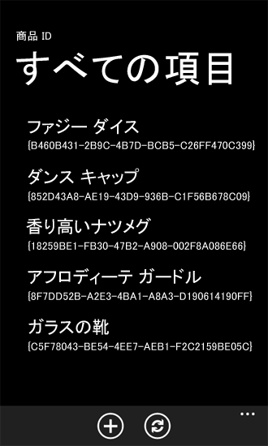

# [方法] Windows Phone アプリ用に SharePoint 2013 フィールド タイプをサポートおよび変換する
データ変換ロジックを実装して、Windows Phone アプリで SharePoint のフィールド型をサポートします。
Windows Phone SharePoint リスト アプリケーション テンプレートを基にしたプロジェクトでは、既定の変換ロジックによって行われる処理や調整により、多くの SharePoint のフィールド型のデータが Windows Phone の Silverlight ユーザー インターフェイスでの表示や操作に適したものになりますが、開発者はカスタムのデータ処理ルーチンを実装することもできます。
  
    
    


> **重要**
> Windows Phone 8 用のアプリを開発する場合は、Visual Studio 2010 Express でなく、Visual Studio Express 2012 を使用する必要があります。開発環境に関する内容を除けば、この記事の情報はすべて、Windows Phone 8 および Windows Phone 7 の両方のアプリを作成する場合に適用されます。 > 詳細については、「 [[方法]: SharePoint 用モバイル アプリの開発環境をセットアップする](how-to-set-up-an-environment-for-developing-mobile-apps-for-sharepoint.md)」を参照してください。 
  
    
    


## Windows Phone アプリの SharePoint のフィールド型
<a name="BKMK_SharePointFieldTypes"> </a>

SharePoint のリストは、データ フィールドによって構成され (列に配置され)、フィールドには特定の型のデータ (つまり、特定の方法で構造化されたデータ) を格納するように指定されます。これらの型を フィールド型と呼びます。(これらの型は列型とも呼ばれます。SharePoint のリストに列を追加するとき、特定のデータ型に関連付けられたフィールドの列を追加しているからです。) これらのフィールドは XML スキーマで定義されます。 **DateTime** データ型 (Microsoft SharePoint Server のユーザー インターフェイスに日付と時間のフィールドとして表示) の "Order Date" と呼ばれるフィールドのスキーマは、次のようになります。
  
    
    

```XML

<Field Type="DateTime" DisplayName="Order Date" Required="FALSE"
 EnforceUniqueValues="FALSE" Indexed="FALSE" Format="DateOnly"
 FriendlyDisplayFormat="Disabled" Name="Order_x0020_Date">
  <Default>[today]</Default>
  <DefaultFormulaValue>2012-01-10T00:00:00Z</DefaultFormulaValue>
</Field>
```

"DateTime" 型で指定されている、このスキーマの **Field** 要素の **Type** 属性の値に注意してください。他の方法で構造化されたデータを格納するように作成されたリストのフィールドでは、"Choice"、"Text"、"Boolean" のような **Type** の値を指定することがあります。
  
    
    
SharePoint のフィールド型を Windows Phone アプリの Silverlight コントロールに直接バインドすることはできません。SharePoint リストで扱うデータは、アプリのコントロールにバインドするために特定の方法 (または Silverlight データ バインディングの標準用語である converted) で準備または処理する必要があります。そしてこの準備と処理は Windows Phone SharePoint リスト アプリケーション テンプレートから作成されたプロジェクトの ViewModel によって処理されます。このテンプレートを基にしたプロジェクトは、設計で既定の変換ロジックが含まれており、いくつかの標準的な SharePoint のフィールド型 (またはこれらの標準型のうちの 1 つを基にして作成されたカスタム フィールド) の Windows Phone アプリでの SharePoint データのバインドと表示をサポートします。既定の変換ロジックでサポートされるフィールド型を表 1 で示します。
  
    
    

**表 1. 既定の変換ロジックを備えたフィールド型**


|**SharePoint フィールド型**|**Silverlight データ型**|
|:-----|:-----|
|Attachments  <br/> |File  <br/> |
|Boolean  <br/> |Boolean  <br/> |
|Calculated (表示のみ)  <br/> |String  <br/> |
|Choice  <br/> |String  <br/> |
|Currency  <br/> |Numeric  <br/> |
|DateTime  <br/> |Date (電話のロケールに従って表示)  <br/> |
|URL  <br/> |Link  <br/> |
|Integer  <br/> |Numeric  <br/> |
|Location  <br/> |GeoCoordinate  <br/> |
|Lookup  <br/> |String  <br/> |
|MultiChoice  <br/> |String  <br/> |
|Note  <br/> |String  <br/> |
|Number  <br/> |Numeric  <br/> |
|OutcomeChoice  <br/> |String  <br/> |
|Picture  <br/> |Link  <br/> |
|Text  <br/> |String  <br/> |
|User  <br/> |String  <br/> |
   
その他の SharePoint のフィールド型、たとえば **Guid** のようなフィールドは Windows Phone アプリで使用できますが、それらのフィールド型には既定の変換ロジックが備わっていないため、開発者は値のバインドと表示をサポートするためにカスタムの変換ロジックを準備する必要があります。(この記事の「 [サポートされないフィールド型に対処するためのカスタムの変換ロジック](#BKMK_ConversionForUnsupportedFields)」を参照してください。)
  
    
    
テンプレートがどのように特定のフィールド型の既定の変換とサポートを提供するかを説明するため、 **Choice** 型で指定された "Product Category" という名前のフィールドの列と、"Recreation" や "Culinary" のようないくつかのオプションが関連付けられた SharePoint のリストを想定します。サーバー上のそのようなフィールドのスキーマは、次のようなマークアップのようになります。
  
    
    


```XML

<Field Type="Choice" DisplayName="Product Category" Required="FALSE"
 EnforceUniqueValues="FALSE" Indexed="FALSE" Format="Dropdown"
 FillInChoice="TRUE" 
 Name="Product_x0020_Category">
  <Default>Recreation</Default>
  <CHOICES>
    <CHOICE>Culinary</CHOICE>
    <CHOICE>Recreation</CHOICE>
    <CHOICE>Sartorial</CHOICE>
    <CHOICE>Travel</CHOICE>
    <CHOICE>Other</CHOICE>
  </CHOICES>
</Field>
```

この **Choice** フィールドは Windows Phone インターフェイスに表示するのに適した形で処理されなければなりません。この場合、フィールドのデータは文字列値のコレクション内に、文字列 (たとえば "Recreation") として表示されます (特に、 **ListItem** オブジェクトの **FieldValuesAsText** プロパティの値の 1 つとして表示されます)。 **Choice** フィールドの変換ロジックはこの文字列を抽出し、電話のユーザー インターフェイスに表示します。文字列はフォームの **TextBlock** コントロールにバインドされて表示されます。値が編集用に表示されている場合、 **Choice** フィールドの既定変換ロジックは、フィールド ("Culinary"、"Recreation"、"Sartorial"など) に利用できるオプションを XML スキーマから抽出します。XML スキーマはフィールドを定義し、オブジェクトが利用可能なオプションのコレクション (特に、 **ObservableCollection(T)** クラスに基づくコレクションの種類) を表現します。オブジェクトはそれ自体に特定のオプションを持ち (例えば "Culinary")、またそのオプションが選択されているかどうかも含まれています。これらの操作はすべてアプリの ViewModel レイヤーで処理されます。View (または Presentation) レイヤーでは (つまり、Windows Phone SharePoint List Application テンプレートにより Edit フォーム用に生成された XAML ファイルでは)、これらのオプションは **ListBox** コントロール内の Silverlight **RadioButton** コントロールとして、既定でレンダリングされます。
  
    
    

## SharePoint のフィールド型のカスタム変換
<a name="BKMK_CustomConversion"> </a>

Windows Phone SharePoint リスト アプリケーション テンプレートを基にした Visual Studio プロジェクトでは、SharePoint と Windows Phone Silverlight ユーザー インターフェイス間のデータの連携と変換を処理するしくみは、柔軟で拡張可能なように設計されています。
  
    
    
どのような設計でアプリケーションを作成するかによって異なりますが、変換ロジックを用意し、既定の変換ロジックでは提供されない SharePoint のフィールド型のバインドと表示をサポートしてください。またはサポートされたフィールドのデータを、既定の実装とは異なる方法で表示してください。
  
    
    
Windows Phone SharePoint リスト アプリケーション テンプレートを基にしたプロジェクトは、静的 **Converter** クラスを実装しており、そのクラスには特定のデータ型のデータ変換操作を処理するメソッドの登録ルーチンが用意されています。プロジェクトには既定で特定のデータ型のデータ変換ルーチンとその登録ルーチンが用意されています。登録メカニズムはデリゲートを使用して、拡張性を可能にします。そのため開発者はデータ変換のロジックを提供する独自の関数を記述して、デリゲートが呼び出されたときに既定の関数を呼び出す代わりに、カスタム関数を呼び出すことができます。データ変換操作のカスタム関数を呼び出すようにするため、 **Converter** クラスの登録メソッドを使用して、使用する関数を登録します。登録メソッドは各 ViewModel により異なります。データを編集用に表示するか、表示のみ (編集なし) を行うかなどに応じたデータ処理を行うための様々な関数が実装、登録される可能性があるからです。
  
    
    

> **ヒント**
> 表示フォームに表示される通貨記号は、たとえ Windows Phone のロケールが異なっていても、SharePoint のロケールから提供されます。開発者は、 **Converter** オブジェクトを使用して、この動作をカスタマイズできます。
  
    
    

Display フォーム (DisplayForm.xaml) にデータ変換関数を登録するには、 **Converter** クラスの **RegisterDisplayFieldValueConverter** メソッドを使用します。Edit フォーム (EditForm.xaml) にデータ変換関数を登録するには **RegisterEditFieldValueConverter** メソッドを使用し、New フォーム (NewForm.xaml) にデータ変換関数を登録するには **RegisterNewFieldValueConverter** メソッドを使用します。
  
    
    
ユーザー インターフェイスに表示されたリストのままデータを処理する変換関数を登録し (つまり、データの **get** 方法を決定する関数)、サーバー上のリストに保存されたユーザー インターフェイスのままデータを処理する関数 (データを **set** 方法を決定する関数) を登録することができます。
  
    
    
 **get** 関数は、 **Converter** クラスの次のデリゲート宣言のシグネチャと一致させる必要があります。
  
    
    


```cs

public delegate object GetConvertedFieldValue(string fieldName,
  ListItem item, ConversionContext context);
```

 **set** 関数は、次のデリゲート宣言のシグネチャに一致させる必要があります。
  
    
    


```cs

public delegate void SetConvertedFieldValue(string fieldName,
  object fieldValue, ListItem item, ConversionContext context);
```

 **RegisterDisplayFieldValueConverter** メソッドは **get** 関数のみを受け入れます。設計では、 **DisplayItemViewModel** クラスは表示だけを行い、編集を行うように意図されていないからです。 **RegisterEditFieldValueConverter** と **RegisterNewFieldValueConverter** メソッドは、 **get** 関数、 **set** 関数、またはその両方の関数を受け入れるようにオーバーロードされます。
  
    
    
「 [SharePoint 2013 用 Windows Phone アプリにビジネス ロジックとデータ検証を実装する方法](how-to-implement-business-logic-and-data-validation-in-a-windows-phone-app-for-s.md)」で、検証ルーチンは Windows Phone アプリのユーザーが入力した形式や電話番号を検証するために開発されたことを説明しました。カスタムのデータ変換を説明するため、次のサンプル コードで、 **get** 関数と **set** 関数を実装して電話番号データを特定の方法で処理し、それらの関数を Edit フォームと New フォームで使用できるように **Converter** クラスを使用して登録します。
  
    
    
次のコード例は、サーバーのカスタム リスト テンプレートを使用して作成した Product Orders リストを元にして、Windows Phone SharePoint リスト アプリケーションを作成したと想定したものです。リストには "Contact Number" という名前のフィールドがあり、このフィールドはリストで **Text** フィールドとして指定されているとします。SharePoint Server 上で **Text** 型として指定されているリストのフィールドの既定の設定では、任意のテキスト文字を入力することができます (最大 255 文字)。テンプレートは SharePoint の **Text** フィールドから受け取るデータの表示と編集の既定変換ロジックを提供します。しかし、 **Text** フィールドは (既定では)、従来電話番号に適用していたように、書式や表示に制限をかけるようには構造化されていません。お使いの Windows Phone アプリでは、基盤のフィールド型 ( **Text**) が特定の書式設定ルールに関連付けられていない場合でも、一貫した形式でユーザーに電話番号を表示し、サーバーに保存されたときは特定の方法で書式設定されるようにしたいこともあります。特定の書式設定ルールを適用するには、サポートされたフィールド型の既定ロジックの代わりに独自のカスタムデータ変換ロジックを実装します。
  
    
    

### カスタムのデータ変換を実装するには


1. SharePoint Server 上に "Contact Number" という名前の **Text** フィールドがあるリストを作成した前提で (「 [SharePoint 2013 用 Windows Phone アプリにビジネス ロジックとデータ検証を実装する方法](how-to-implement-business-logic-and-data-validation-in-a-windows-phone-app-for-s.md)」で使用した Product Orders サンプル リスト同様)、「 [[方法] Windows Phone 用の SharePoint 2013 リスト アプリを作成する](how-to-create-a-windows-phone-sharepoint-2013-list-app.md)」で説明された手順に従い、Visual Studio の Windows Phone SharePoint リスト アプリケーション テンプレートを使用して、Windows Phone アプリを作成します。
    
  
2. **ソリューション エクスプローラー**で、プロジェクトを表すノード (たとえば ContosoSPListApp) を選択します。
    
  
3. Visual Studio (または Visual Studio Express for Windows Phone) の [ **プロジェクト**] メニューで、[ **クラスの追加**] を選択します。[ **新しい項目の追加**] ダイアログ ボックスが表示され、C# の [ **クラス**] テンプレートが既に選択されています。
    
  
4. クラス ファイルの名前を指定し (ContosoConverter.cs など)、[ **追加**] を選択します。クラス ファイルがプロジェクトに追加され、編集用に開きます。
    
  
5. ファイルのコンテンツを次のコードに置き換えます。
    
  ```cs
  
using System;
using Microsoft.SharePoint.Client;  // Added for ListItem.
using Microsoft.SharePoint.Phone.Application; // Added for ConversionContext.
using System.Text.RegularExpressions;

// Specify a namespace appropriate for your particular project.
namespace ContosoSPListApp
{
    public static class ContosoConverter
    {
        static Regex StandardNumberFormat = 
          new Regex(@"^\\(?([0-9]{3})\\)?[-. ]?([0-9]{3})[-. ]?([0-9]{4})$", RegexOptions.Compiled);

        public static object GetConvertedTextFieldValue(string fieldName, 
          ListItem item, ConversionContext context)
        {
            if (item == null) return null;

            if (fieldName == "Contact_x0020_Number")
            {
                string contactNumber = string.Empty;
                try
                {
                    contactNumber = item.FieldValuesAsText[fieldName];
                }
                catch (PropertyOrFieldNotInitializedException)
                {
                    object itemValue = item[fieldName];
                    if (itemValue != null)
                    {
                        contactNumber = itemValue.ToString();
                    }
                }

                // Regularize the formatting of phone number for display in UI.
                if (StandardNumberFormat.IsMatch(contactNumber))
                {
                    // Phone number is in an acceptable format, but formatting it
                    // in a specific way for visual consistency in the UI.
                    string properlyFormattedNumber = 
                      StandardNumberFormat.Replace(contactNumber, "($1) $2-$3");
                    return properlyFormattedNumber;
                }
                else
                {
                    // Return a representation of the data adorned in such a way 
                    // as to designate its invalidity.
                    if (!contactNumber.Contains("Invalid Number"))
                    {
                        return string.Format("Invalid Number: {0}", contactNumber);
                    }
                    else
                    {
                        // Assume data is already adorned with an invalidity designation.
                        return contactNumber;
                    }
                }
            }
            else
            {
                return item[fieldName];
            }
        }

        public static void SetConvertedTextFieldValue(string fieldName, 
                             object fieldValue, ListItem item, ConversionContext context)
        {
            if (fieldValue == null) return;

            if (fieldName == "Contact_x0020_Number")
            {
                // Conventional formats (e.g., 555-555-5555) are acceptable,
                // but formatting phone numbers consistently here for storage in list on Server.
                string contactNumber = (string)fieldValue;

                if (StandardNumberFormat.IsMatch(contactNumber))
                {
                    string properlyFormattedNumber = StandardNumberFormat.Replace
                                                               (contactNumber, "($1) $2-$3");
                    item[fieldName] = properlyFormattedNumber;
                }
                else
                {
                    if (!contactNumber.Contains("Invalid Number"))
                    {
                        item[fieldName] = string.Format("Invalid Number: {0}", contactNumber);
                    }
                    else
                    {
                        // Assume data is already adorned with an invalidity designation.
                        item[fieldName] = contactNumber;
                    }                    
                }
            }
            else
            {
                // Allow values for other Text fields to be passed on to list without modification.
                item[fieldName] = fieldValue;                
            }
        }
    }
}
  ```

6. ファイルを保存します。
    
  
ここでの **GetConvertedTextFieldValue** 関数は、電話番号を格納するフィールド (この例では "Contact Number" という名前) から取得した文字列データが、(北米の) 電話番号の標準的な入力規則に沿った書式かどうかを決定し、規則に沿った書式であれば、表示用の書式 "(XXX) XXX-XXXX" に番号を変換します。データが標準的な電話番号の書式ではない場合、指定子でプレフィックスが付けられます。この関数でリスト内のデータが実際に変更されるわけではありません。一方で **SetConvertedTextFieldValue** 関数は、反対の方向に処理します。関数はフィールドに入力されたデータの値をチェックし、入力されたデータが標準的な電話番号パターンに一致するかどうかを決定します。パターンに一致した場合、入力値は特定の書式に変換され、サーバーのリストに保存されます。入力値が標準的な書式ではない場合、値は指定子のプレフィックスが付けられ、プレフィックスが付けられた値がサーバーに保存されます。
  
    
    
あとは、Edit フォームと New フォームで使用するために **Converter** クラスを使用してこれらのデータ変換関数を登録するだけです。コンバーターは複数の場所に登録できます。以下のプロシージャでは、List フォーム (List.xaml) の **OnNavigatedTo** イベントにコンバーターが登録されています。List フォームが作成されると、アプリで Edit フォームと New フォームがインスタンス化される以前にナビゲートされるため、List フォームのこのイベントに登録されたコンバーターは、すべてのフォームのテキスト フィールドに影響します。
  
    
    

### データ変換関数を登録するには


1. 前の手順で作成したクラスの同じプロジェクトの **ソリューション エクスプローラー**で、[ **ビュー**] ノードの下にある List.xaml ファイルを選択します。
    
  
2. F7 を押して、関連した分離コード ファイル List.xaml.cs を編集用に開きます。
    
  
3. **ListForm** 部分クラスを実装したコード ブロックの先頭、コード ブロックの左かっこの後、 `ListForm()` コンストラクターの前に、次のプライベート変数宣言を追加します。
    
  ```cs
  
private bool _isConversionRegistered;
  ```

4. **ListForm** 部分クラスを実装するコード ブロック (左かっこと右かっこで区切られる) 内で、次の **RegisterTextFieldValueConverters** メソッドをファイルに追加します。
    
  ```cs
  private void RegisterTextFieldValueConverters()
{
    Converter.RegisterEditFieldValueConverter(FieldType.Text, 
                      ContosoConverter.GetConvertedTextFieldValue, 
                        ContosoConverter.SetConvertedTextFieldValue);

    Converter.RegisterNewFieldValueConverter(FieldType.Text, 
                          ContosoConverter.GetConvertedTextFieldValue, 
                          ContosoConverter.SetConvertedTextFieldValue);
}
  ```


    このメソッドは **Converter** クラスの適切な登録メソッドを呼び出します。このコードでは、前の手順で作成された **get** 関数と **set** 関数を持つカスタムクラスが "ContosoConverter" という名前です。違う名前でクラスを指定していた場合は、その名前でここを変更します。
    
  
5. **_isConversionRegistered** フラグの値のチェックと、前の手順で追加した **RegisterTextFieldValueConverters** 関数の呼び出しを追加して、ファイルの **OnNavigatedTo** イベント ハンドラーの実装を修正します。修正されたハンドラーは以下のようになります。
    
  ```cs
  
protected override void OnNavigatedTo(System.Windows.Navigation.NavigationEventArgs e)
{
    base.OnNavigatedTo(e);

    App.MainViewModel.ViewDataLoaded += 
      new EventHandler<ViewDataLoadedEventArgs>(OnViewDataLoaded);
    App.MainViewModel.InitializationCompleted += 
      new EventHandler<InitializationCompletedEventArgs>(OnViewModelInitialization);

    // The OnNavigatedTo event can fire more than once, but the converters only need
    // to be registered once, so checking the conversion flag first.
    if (_isConversionRegistered == false)
    {
        // Register converters.
        RegisterTextFieldValueConverters();
        _isConversionRegistered = true;
    }
}
  ```

6. ファイルを保存します。
    
  
データ変換関数は、Edit フォームと New フォームの **Text** データ型に関連付けられたすべてのフィールドに登録されることに注意してください。前の手順で作成された **ContosoConverter** クラスに実装された **get** 関数と **set** 関数には、特定のフィールド (ここでは "Contact_x0020_Number" という名前) だけのデータを処理する条件チェックが含まれるため、データを他の **Text** フィールドに "パス スルー" することができます。
  
    
    

## サポートされないフィールド型に対処するためのカスタムの変換ロジック
<a name="BKMK_ConversionForUnsupportedFields"> </a>

アプリに **Text** フィールドの変換ロジックを用意しなくても、サポートされていない型のフィールドを表示して編集することができます。既定のロジックが設計に合わないときは、すでに既定の変換ロジックが適用されているフィールドに対して独自の変換ロジックを準備することで、フィールドのデータ書式やデータ構造をかなり高度に制御できます。その他特定のデータ型を持つ **Guid** フィールドのようなフィールドについては、既定では変換ロジックは提供されません。ただし変換ロジックをフィールドに提供するしくみ (前のセクションで説明) を理解すれば、Windows Phone SharePoint リスト アプリケーション テンプレートの既定のロジックでサポートされないアプリのフィールド型をサポートする独自の変換ロジックは、かなり簡単に提供できます。
  
    
    
 **Guid** データ型のフィールドを持つ Product Identifiers という名前の SharePoint のリストを元にした Windows Phone アプリを作成しているとします。以下のコード サンプルでは、リストに ( **Text** 型の) Product (または Title) フィールドと、( **Guid** 型の) Identifier フィールドがあるリストを想定しています。
  
    
    

> **メモ**
> **Guid** フィールドを持つ SharePoint のリストは、プログラムで生成されるか、あるいは **Guid** フィールドを含むリストのテンプレートから作成する必要があります。
  
    
    

テンプレートを使用し、このシンプルなリストを基にして作成された Windows Phone アプリでは、 **Guid** フィールドのデータは、既定では表示されません (データの代わりに、メッセージ "'Guid' フィールド型のコンバーターが登録されていません。" が表示されます)。次の手順では、Windows Phone アプリの **Guid** フィールドをサポートする変換ロジックを準備します。クラスを追加し、GUID を表示したり、追加したリスト項目の新規 GUID を生成するためのフィールド値コンバーターの登録メソッドをそのクラスに含めます。
  
    
    

### サポートされないフィールド型の変換ロジックを提供するには


1. Windows Phone SharePoint リスト アプリケーションから作成され、前述の Product Identifiers リストに基づくプロジェクト (たとえば SPListAppGuidConversion) では、 **ソリューション エクスプローラー**のプロジェクトを表すノードを選択します。
    
  
2. [ **プロジェクト**] メニューの [ **クラスの追加**] を選択します。[ **新しい項目の追加**] ダイアログ ボックスが表示され、C# の [ **クラス**] テンプレートが既に選択されています。
    
  
3. ファイル名に GuidConversion.cs を指定し、[ **追加**] を選択します。クラス ファイルがソリューションに追加され、編集用に開きます。
    
  
4. ファイルのコンテンツを次のコードに置き換えます。
    
  ```cs
  
using System;
using Microsoft.SharePoint.Phone.Application;
using Microsoft.SharePoint.Client;

namespace SPListAppGuidConversion
{
    public class GuidConversion
    {
        /// <summary>
        /// Registers a GET converter to prepare GUID values for display.
        /// </summary>
        static public void RegisterDisplayFieldGuidConverter()
        {
            // Register GET converter to display GUID values.
            Converter.RegisterDisplayFieldValueConverter(FieldType.Guid,
            getConvertedFieldValue: (string fieldName, ListItem item, ConversionContext context) =>
            {
                string guidValue = string.Empty;

                try
                {
                    guidValue = item.FieldValuesAsText[fieldName];
                }
                catch (PropertyOrFieldNotInitializedException)
                {
                    object itemValue = item[fieldName];
                    if (itemValue != null)
                    {
                        guidValue = itemValue.ToString();
                    }
                }

                if (string.IsNullOrWhiteSpace(guidValue))
                {
                    return string.Format("{{{0}}}", Guid.Empty);
                }
                else
                {
                    Guid g = new Guid();

                    if (Guid.TryParse(guidValue, out g))
                    {
                        guidValue = string.Format("{{{0}}}", g.ToString().ToUpper());
                        return guidValue;
                    }
                    else
                    {
                        return "Invalid Identifier (GUID)";
                    }
                }
            });
        }

        /// <summary>
        /// Registers GET and SET converters for GUID value of new (i.e., added) list items.
        /// </summary>
        public static void RegisterNewFieldGuidConverter()
        {
            Converter.RegisterNewFieldValueConverter(FieldType.Guid,
                getConvertedFieldValue: (string fieldName, ListItem item, 
                                 ConversionContext context) => Guid.NewGuid().ToString(),
                setConvertedFieldValue: (string fieldName, object fieldValue, 
                                ListItem item, ConversionContext context) =>
                {
                    if (fieldValue == null)
                    {
                        item[fieldName] = Guid.Empty.ToString();
                    }
                    else
                    {
                        item[fieldName] = fieldValue;
                    }
                });
        }
    }
}
  ```


    このカスタム クラスでは、 **Converter** クラスの **RegisterDisplayFieldValueConverter** と **RegisterNewFieldValueConverter** メソッドを匿名関数 (ラムダ ステートメントで定義) を使用して呼び出し、登録メソッドに必要なデリゲート用の **get** ルーチンと **set** ルーチンを実装します。ここでのオプションの引数ラベル (たとえば "getConvertedFieldValue:") は、どのデリゲートが定義されているかを明確にするためだけに使用されています。
    
    ラムダ式を含むこのアプローチは、このトピックの前の手順 (「 [データ変換関数を登録するには](#BKMK_RegisterFunctions)」セクション) で説明したコンバーターの登録関数に対して、パラメーターとして名前付き関数を渡す代替手段です。
    
  
5. ファイルを保存します。
    
  
6. **ソリューション エクスプローラー**で、App.xaml ファイルを選択します。
    
  
7. F7 を押して、関連した分離コード ファイル App.xaml.cs を編集用に開きます。
    
  
8. **Application_Launching** イベント ハンドラー (Windows Phone SharePoint リスト アプリケーション テンプレートから作成された新規プロジェクトでは、空) の実装を探し、以下のコードに置き換えます。
    
  ```cs
  
private void Application_Launching(object sender, LaunchingEventArgs e)
{
    // Register converters for GUID fields. Converters can be
    // registered just once for the app.
    GuidConversion.RegisterDisplayFieldGuidConverter();
    GuidConversion.RegisterNewFieldGuidConverter();
}
  ```

9. 新規のリスト項目に対して動作する (つまり、リストに項目が追加されたときに GUID 値を生成する) コンバーター ロジックについては、 **NewItemViewModel** の Identifier フィールドが New フォームにバインドされていることを確認する必要があります。これを実現する 1 つの方法として、Identifier フィールドにセットされた **Text** プロパティの **Binding** 宣言で、隠し **TextBlock** コントロールを NewForm.xaml に追加します。次の NewForm.xaml ファイルのマークアップのセクションのように、 **StackPanel** コンテナー コントロールに Title フィールド用の **TextBox** コントロールを含む **TextBlock** コントロールを追加できます。
    
  ```
  
...
    <Grid x:Name="LayoutRoot" Background="Transparent" 
         xmlns:x="http://schemas.microsoft.com/winfx/2006/xaml" 
                 xmlns:controls="clr-namespace:Microsoft.Phone.Controls;
                                      assembly=Microsoft.Phone.Controls">
        <StackPanel>
            <ProgressBar Background="Red" x:Name="progressBar" 
                  Opacity="1" HorizontalAlignment="Center" VerticalAlignment="Top" 
                                    Height="15" Width="470" IsIndeterminate="{Binding IsBusy}"
                                       Visibility="{Binding ShowIfBusy}" />
            <ScrollViewer HorizontalScrollBarVisibility="Auto" Height="700">
                <Grid x:Name="ContentPanel" Width="470">
                    <StackPanel Margin="0,5,0,5">
                        <StackPanel Orientation="Vertical" Margin="0,5,0,5">
                            <TextBlock TextWrapping="Wrap" 
                           HorizontalAlignment="Left" Style="{StaticResource PhoneTextNormalStyle}">
                                        Title*</TextBlock>
                            <TextBox Style="{StaticResource TextValidationTemplate}" 
                              FontSize="{StaticResource PhoneFontSizeNormal}" Width="470" 
                                   HorizontalAlignment="Left" Name="txtTitle" Text="{Binding [Title], 
                                    Mode=TwoWay, ValidatesOnNotifyDataErrors=True, 
                                      NotifyOnValidationError=True}" TextWrapping="Wrap" />
                            <TextBlock Name="txtIdentifier" Text="{Binding [Identifier]}" Visibility="Collapsed"/>
                        </StackPanel>
                    </StackPanel>
                </Grid>
            </ScrollViewer>
        </StackPanel>
    </Grid>
...
  ```


    ファイルを保存します。
    
  
プロジェクトを開始し、Windows Phone エミュレーターにアプリを配置して実行すると、SharePoint リストの対応するフィールドに GUID 値が格納されている場合、Identifier フィールドのデータが List フォーム (List.xaml) に表示されます (図 1 を参照してください)。
  
    
    

**図 1. Guid フィールドの表示**

  
    
    

  
    
    

  
    
    
Windows Phone SharePoint リスト アプリケーション テンプレートに基づくプロジェクトでは、Sliverlight コントロールがフォームに追加されず、テンプレートの既定の変換ロジックではサポートされないフィールド型にバインドできないことがあります。前の手順で使用した Product Identifiers リストの Identifiers フィールドについては、マークアップを DisplayForm.xaml ファイルに追加し、GUID 値を表示するための追加のコントロールを定義します。追加のコントロールは **StackPanel** コントロールの **TextBlock** コントロールや **TextBox**コントロールなどで、ユーザー インターフェイスの **Grid** コントロール内に含まれます。追加した **StackPanel** コントロールのマークアップは、次のように表示されます。
  
    
    


```

<StackPanel HorizontalAlignment="Left" Orientation="Horizontal"
                                             Margin="0,5,0,5">
    <TextBlock TextWrapping="Wrap" Width="150" HorizontalAlignment="Left" 
                      Style="{StaticResource PhoneTextNormalStyle}">Identifier:</TextBlock>
    <TextBlock Width="310" HorizontalAlignment="Left" Name="txtIdentifier" 
                 Text="{Binding [Identifier]}" TextWrapping="Wrap" Style="
                                           {StaticResource PhoneTextSubtleStyle}" />
</StackPanel>
```

Identifier フィールドが、List フォーム上と同じように Display フォーム上に表示されます。
  
    
    

## その他の技術情報
<a name="SP15Supportwinphone_addlresources"> </a>


-  [SharePoint 2013 にアクセスする Windows Phone アプリの作成](build-windows-phone-apps-that-access-sharepoint-2013.md)
    
  
-  [[方法]: SharePoint 用モバイル アプリの開発環境をセットアップする](how-to-set-up-an-environment-for-developing-mobile-apps-for-sharepoint.md)
    
  
-  [Windows Phone SDK 8.0](http://www.microsoft.com/ja-jp/download/details.aspx?id=35471)
    
  
-  [Microsoft SharePoint SDK for Windows Phone 8](http://www.microsoft.com/ja-jp/download/details.aspx?id=36818)
    
  
-  [Windows Phone SDK 7.1](http://www.microsoft.com/ja-jp/download/details.aspx?id=27570)
    
  
-  [Microsoft SharePoint SDK for Windows Phone 7.1](http://www.microsoft.com/ja-jp/download/details.aspx?id=30476)
    
  

