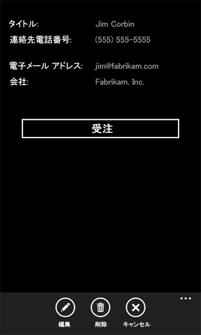
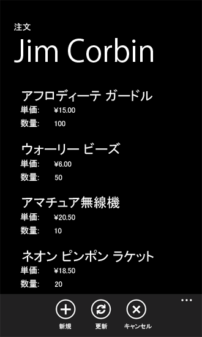

# [方法] Windows Phone アプリで複数の SharePoint 2013 リストを使用する
複数の SharePoint リストのデータを使用する Windows Phone アプリを作成します。
アプリでは、いくつかの方法で複数の SharePoint リストを使用できます。Windows Phone SharePoint リスト アプリケーション テンプレートに基づいて Windows Phone アプリを作成する場合は、ターゲット SharePoint リストを 1 つ指定しますが、出力されるプロジェクトのアーキテクチャーには複数のリストを統合できるだけの十分な拡張性があります。
  
    
    


> **重要**
> Windows Phone 8 用のアプリを開発する場合は、Visual Studio 2010 Express でなく、Visual Studio Express 2012 を使用する必要があります。開発環境に関する内容を除けば、この記事の情報はすべて、Windows Phone 8 および Windows Phone 7 の両方のアプリを作成する場合に適用されます。 > 詳細については、「 [[方法]: SharePoint 用モバイル アプリの開発環境をセットアップする](how-to-set-up-an-environment-for-developing-mobile-apps-for-sharepoint.md)」を参照してください。 
  
    
    


## 同じスキーマに基づく SharePoint リストが関係するソリューションの作成
<a name="BKMK_SameSchemaProject"> </a>

同じスキーマに基づく SharePoint リストが 2 つある場合は、Windows Phone SharePoint リスト アプリケーション テンプレートによって実装されるクラスを利用し、各リストに固有の、それらのクラスのオブジェクトを作成できます。
  
    
    
Contacts リスト テンプレートに基づく SharePoint リストが 2 つあるとします。1 つのリストは、たとえば Marketing Team という名前で、組織のマーケティング チームのメンバーが含まれており。もう 1 つのリスト Engineering Team にはエンジニアリング チームのメンバーが含まれています。Windows Phone SharePoint リスト アプリケーション テンプレートを使用してプロジェクトを作成し、Marketing Team リストをプロジェクトの基となるターゲット リストとして指定すると、プロジェクトの App.xaml.cs ファイルの **App** の実装に、(既定で **DataProvider** という名前の) **ListDataProvider** クラスのインスタンスが作成されます。このオブジェクトは、アプリのデータ ソースとしてのリスト (Marketing Team リスト) を表し、これにより、リスト内の項目にアクセスしたり、その項目を操作したりすることができます。そのアプリの基となるリストについては、 **ListViewModel** クラスのインスタンスも作成されます。このオブジェクトには、 **ListDataProvider** クラスの所定のインスタンスに設定することができる (この場合も **DataProvider** という名前の) プロパティ メンバーがあり、 **ListViewModel** クラス インスタンスのデータ ソースとなります。
  
    
    
App.xaml.cs ファイルで、プロジェクトの **ListDataProvider** クラスの追加インスタンスを作成し、2 つ目のリスト (Engineering Team) のデータ ソースとして使用することができます。このオブジェクトは、以下のコード サンプルでは **SecondaryDataProvider** という名前になっています。
  
    
    


```cs

private static ListDataProvider m_SecondaryDataProvider;

public static ListDataProvider SecondaryDataProvider
{
    get
    {
        if (m_SecondaryDataProvider != null)
            return m_SecondaryDataProvider;

        m_SecondaryDataProvider = new ListDataProvider();
        m_SecondaryDataProvider.ListTitle = "Engineering Team";
        m_SecondaryDataProvider.SiteUrl = new Uri("http://contoso:2012/sites/samplesite/");

        return m_SecondaryDataProvider;
    }
}
```

次に、 **ListViewModel** クラスの別のオブジェクト (たとえば、 **SecondaryViewModel** という名前) をインスタンス化し、次のコードに示すように、 **SecondaryDataProvider** オブジェクトをその **DataProvider** プロパティに割り当てることができます。
  
    
    


```cs

private static ListViewModel m_SecondaryViewModel;

public static ListViewModel SecondaryViewModel
{
    get
    {
        if (m_SecondaryViewModel == null)
            m_SecondaryViewModel = new ListViewModel { DataProvider = App.SecondaryDataProvider };

        return m_SecondaryViewModel;
    }
    set
    {
        m_SecondaryViewModel = value;
    }
}
```

2 つのリストのフィールドとビューを同じにすることが使用目的にかなう場合 (ここでも、2 つのリストに同じ列とフィールドがある場合) は、(ListDataProvider.cs ファイルで) **ListDataProvider** クラスの実装に変更を加える必要はありません。
  
    
    
ただし、プロジェクトの 2 番目のリストからのデータを表示または変更するには、この **SecondaryViewModel** にバインドおよび構成されたビュー フォームをプロジェクトに追加する必要があります。たとえば、"SecondaryViewsW" という名前のプロジェクトにフォルダーを 1 つ追加し、プロジェクトのプライマリ リストのテンプレートによって生成される既定の List.xaml ファイルに似たマークアップと一緒に、SecondaryList.xaml ファイルをそのフォルダーに追加できます。アプリでは、SecondaryList.xaml ファイルの **PhoneApplicationPage** 要素の **x:Class** 属性に識別値を指定することにより、セカンダリ リスト フォームとプライマリ リスト フォームを区別する必要があります。
  
    
    


```

<phone:PhoneApplicationPage
    x:Class="MultipleSPListApp.SecondaryViews.ListForm"
    xmlns="http://schemas.microsoft.com/winfx/2006/xaml/presentation"
    xmlns:x="http://schemas.microsoft.com/winfx/2006/xaml"
    xmlns:phone="clr-namespace:Microsoft.Phone.Controls;assembly=Microsoft.Phone"
    xmlns:shell="clr-namespace:Microsoft.Phone.Shell;assembly=Microsoft.Phone"
    xmlns:d="http://schemas.microsoft.com/expression/blend/2008"
    xmlns:mc="http://schemas.openxmlformats.org/markup-compatibility/2006"
    mc:Ignorable="d" d:DesignWidth="480" d:DesignHeight="696"
    FontFamily="{StaticResource PhoneFontFamilyNormal}"
    FontSize="{StaticResource PhoneFontSizeNormal}"
    Foreground="{StaticResource PhoneForegroundBrush}"
    SupportedOrientations="PortraitOrLandscape" Orientation="Portrait"
    shell:SystemTray.IsVisible="True" x:Name = "ListViewPage">
...
</phone:PhoneApplicationPage>
```

関連付けられた分離コード ファイル SecondaryList.xaml.cs で、"App.MainViewModel" へのすべての参照を "App.SecondaryViewModel" への参照で置き換えます。たとえば、ファイルのコンストラクターを次のようにしてください。
  
    
    


```cs

public ListForm()
    {
        InitializeComponent();
        this.DataContext = App.SecondaryViewModel;
    }
```

また、コード分離ファイルで、"App.DataProvider" へのすべての参照を "App.SecondaryDataProvider" への参照で置き換え、すべてのナビゲーション パスを適切なセカンダリ XAML ページを指すように更新します。プロジェクトに新しいセカンダリ フォーム (たとえば、プロジェクトの Secondary Views フォルダーでの名前が SecondaryNewForm.xaml) も追加する場合、 **OnNewButtonClick** イベントの SecondaryList.xaml.cs ファイルのハンドラーは、次のようなコードになります。
  
    
    


```cs

private void OnNewButtonClick(object sender, EventArgs e)
    {
        // Instantiate a new instance of NewItemViewModel and go to NewForm.
        App.SecondaryViewModel.CreateItemViewModelInstance = new NewItemViewModel { DataProvider = App.SecondaryDataProvider };
        NavigationService.Navigate(new Uri("/SecondaryViews/SecondaryNewForm.xaml", UriKind.Relative));
    }
```

最後に、SecondaryList.xaml ページを表示するため、List.xaml ファイルの **ApplicationBar** にボタンを追加することができます。
  
    
    


```

...
    <phone:PhoneApplicationPage.ApplicationBar>
        <shell:ApplicationBar IsVisible="True" IsMenuEnabled="True">
            <shell:ApplicationBarIconButton x:Name="btnNew" IconUri="/Images/appbar.new.rest.png" Text="New" Click="OnNewButtonClick"/>
            <shell:ApplicationBarIconButton x:Name="btnRefresh" IconUri="/Images/appbar.refresh.rest.png" Text="Refresh" IsEnabled="True" Click="OnRefreshButtonClick"/>
            <!--Add the following button to navigate to the secondary list (Engineering Team).-->
            <shell:ApplicationBarIconButton x:Name="btnSecondaryList" IconUri="/Images/appbar.upload.rest.png" Text="Engineering" IsEnabled="True" Click="OnSecondaryListButtonClick"/>
        </shell:ApplicationBar>
    </phone:PhoneApplicationPage.ApplicationBar>
...
```

関連付けられたコード分離ファイル List.xaml.cs に、Listxaml ファイルで宣言した **OnSecondaryListButtonClick** イベントのハンドラーを追加します。
  
    
    


```cs

private void OnSecondaryListButtonClick(object sender, EventArgs e)
{
    NavigationService.Navigate(new Uri("/SecondaryViews/SecondaryList.xaml", UriKind.Relative));
}
```

これでアプリのユーザーは、Marketing Team リストと Engineering Team リストの間を移動できるようになります。基となるリスト スキーマが同じであるため、テンプレートによって生成される既定の **DataProvider** オブジェクトと **MainViewModel** オブジェクト、および追加された **SecondaryDataProvider** オブジェクトと **SecondaryViewModel** オブジェクトは、ListDataProvider.cs ファイルに変更を加えることなく、すべてのデータ トランザクションを処理します。
  
    
    

## 異なるスキーマに基づく SharePoint リストが関係するソリューションの作成
<a name="BKMK_DifferentSchemasProject"> </a>

前のセクションの方法はある程度まで (つまり、同じスキーマに基づく SharePoint リストの場合) 有効ですが、同じスキーマに基づかないか、同じ列とフィールドを含んでいない複数の SharePoint リストを処理するカスタマイズの場合、開発者は Windows Phone SharePoint リスト アプリケーション テンプレートの **ListDataProvider** クラスを使用できます。
  
    
    
前のセクション同様、マーケティング チームのメンバーを含んだ (Contacts リストテンプレートに基づく) Marketing Team という名前の SharePoint リストがあるとします。また、表 1 に示す列とフィールドを含んだ (Custom リスト テンプレートに基づく) Orders という名前の 2 つ目のリストもあるとします。
  
    
    

**表 1. Orders リストの列とフィールド**


|**列**|**フィールドの種類**|**要/不要**|
|:-----|:-----|:-----|
|製品 (すなわち、タイトル)  <br/> |1 行テキスト (Text)  <br/> |要  <br/> |
|単価  <br/> |通貨  <br/> |要  <br/> |
|数量  <br/> |数値  <br/> |不要 (既定値は 0)  <br/> |
|注文値  <br/> |計算値 (単価 * 数量)  <br/> |不要  <br/> |
|注文日  <br/> |日付/時刻 (Datetime)  <br/> |不要  <br/> |
|注文状況  <br/> |選択肢  <br/> |不要  <br/> |
|顧客  <br/> |1 行テキスト (Text)  <br/> |不要  <br/> |
   
前のセクションの例と同様、別個の **ListDataProvider** オブジェクトと別の **ListViewModel** オブジェクトをインスタンス化して、Orders リストを管理できます。次のコード サンプルでは、インスタンス化された **ListDataProvider** オブジェクトの名前を **OrdersListDataProvider** としています。
  
    
    


```cs

private static ListDataProvider m_OrdersListDataProvider;

public static ListDataProvider OrdersListDataProvider
{
    get
    {
        if (m_OrdersListDataProvider != null)
            return m_OrdersListDataProvider;

        m_OrdersListDataProvider = new ListDataProvider();
        m_OrdersListDataProvider.ListTitle = "Orders";
        m_OrdersListDataProvider.SiteUrl = new Uri("http://contoso:2012/sites/samplesite/"); // Specify a URL here for your server.

        return m_OrdersListDataProvider;
    }
}
```

また、次のコード サンプルでは、Orders リストのインスタンス化された **ListViewModel** オブジェクトの名前を **OrdersListViewModel** としています。
  
    
    


```cs

private static ListViewModel m_OrdersListViewModel;

public static ListViewModel OrdersListViewModel
{
    get
    {
        if (m_OrdersListViewModel == null)
            m_OrdersListViewModel = new ListViewModel { DataProvider = App.OrdersListDataProvider };

        return m_OrdersListViewModel;
    }
    set
    {
        m_OrdersListViewModel = value;
    }
}
```

Orders リストのスキーマは Marketing Team リストのスキーマと異なります。スキーマの違いには、ListDataProvider.cs ファイル、特に **CamlQueryBuilder** クラスにコードを追加することによって対処できます。
  
    
    


```cs

public static class CamlQueryBuilder
{
    static Dictionary<string, string> ViewXmls = new Dictionary<string, string>()
    {   
        {"View1",   @"<View><Query><OrderBy><FieldRef Name='Title' />
                    <FieldRef Name='FirstName'  /></OrderBy></Query><RowLimit>30</RowLimit><ViewFields>{0}</ViewFields></View>"},
      {"View2",   @"<View><Query><OrderBy><FieldRef Name='ID' /></OrderBy></Query><RowLimit>30</RowLimit>
     <ViewFields>{0}</ViewFields></View>"}
    };

    static string View1Fields = @"<FieldRef Name='Title'/><FieldRef Name='FirstName'/>
   <FieldRef Name='JobTitle'/><FieldRef Name='Email'/><FieldRef Name='Comments'/>";
    static string View2Fields = @"<FieldRef Name='Title'/><FieldRef Name='Unit_x0020_Price'/><FieldRef Name='Quantity'/>
            <FieldRef Name='Order_x0020_Value'/><FieldRef Name='Order_x0020_Date'/>
            <FieldRef Name='Status'/><FieldRef Name='Customer'/>";

    public static CamlQuery GetCamlQuery(string viewName)
    {
        string viewXml = ViewXmls[viewName];
        // Add ViewFields to the ViewXml depending on the view.
        switch (viewName)
        {
            case "View2":
                viewXml = string.Format(viewXml, View2Fields);
                break;
            case "View1":
            default:
                viewXml = string.Format(viewXml, View1Fields);
                break;
        }
        return new CamlQuery { ViewXml = viewXml };
    }
}
```

ここでは、キー値が "View2" の 2 番目のエントリが Orders リストの **ViewXmls** **Dictionary** オブジェクトに追加されています (テンプレートのキャッシュ ロジックが正常に適用されるようにするには、 **CamlQueryBuilder** クラスの **ViewXmls** **Dictionary** に追加されるエントリのキー値が (ソリューション内) で一意である必要があります)。文字列変数 ( **View1Fields** および **View2Fields**) は、各ビューのフィールドのリストを保存するために使用します。 **GetCamlQuery** メソッドに渡される **viewName** パラメーターの値に応じて、適切な CAML クエリ XML 文字列が作成されます。
  
    
    
次に、前のセクションと同様に、今度は **OrdersListViewModel** オブジェクトと **OrdersListDataProvider** オブジェクトにバインドされたリストのビュー フォームを作成できます。一例として、OrdersList.xaml という名前の Orders リストに固有のリスト フォームの XAML は、アプリのプライマリ リストのテンプレートによって生成される List.xaml ファイルのマークアップに似ています。異なる点は、リストをレンダリングする **PivotItem** コントロールに (既定の "View1" ではなく) "View2" という名前を付け、リスト項目がレンダリングされる **ListBox** コントロールの **ItemsSource** 属性の **Binding** 宣言を次のマークアップ (ページのルート グリッドのマークアップのみを示しています) に示すように "View2" に設定することです。
  
    
    


```

...
    <Grid x:Name="LayoutRoot" Background="Transparent" xmlns:x="http://schemas.microsoft.com/winfx/2006/xaml" xmlns:controls="clr-namespace:Microsoft.Phone.Controls;assembly=Microsoft.Phone.Controls">
        <!--Pivot Control-->
        <ProgressBar x:Name="progressBar" Opacity="1" HorizontalAlignment="Center" VerticalAlignment="Top" 
               Height="30" Width="470" IsIndeterminate="{Binding IsBusy}" Visibility="{Binding ShowIfBusy}" />
        <Grid x:Name="ContentPanel" Grid.Row="0" Width="470">
            <controls:Pivot Name="Views" Title="Orders" LoadedPivotItem="OnPivotItemLoaded">
                <!--Pivot item-->
                <controls:PivotItem Name="View2" Header="All Orders">
                    <!--Double line list with text wrapping-->
                    <ListBox x:Name="lstBox1" Margin="0,0,-12,0" SelectionChanged="OnSelectionChanged" ItemsSource="{Binding [View2]}">
                        <ListBox.ItemTemplate>
                            <DataTemplate>
                                <StackPanel Orientation="Vertical" Margin="10">
                                    <TextBlock Name="txtTitle" Text="{Binding [Title]}" TextWrapping="NoWrap" 
                                          Style="{StaticResource PhoneTextTitle2Style}" />
                                    <TextBlock Name="txtUnitPrice" Text="{Binding [Unit_x0020_Price]}" 
                                         TextWrapping="NoWrap" Style="{StaticResource PhoneTextNormalStyle}" />
                                    <TextBlock Name="txtQuantity" Text="{Binding [Quantity]}"
                                         TextWrapping="NoWrap" Style="{StaticResource PhoneTextNormalStyle}" />
                                </StackPanel>
                            </DataTemplate>
                        </ListBox.ItemTemplate>
                    </ListBox>
                </controls:PivotItem>
            </controls:Pivot>
        </Grid>
    </Grid>
...
```

適切な XAML マークアップを簡単に作成するには、Windows Phone SharePoint リス アプリケーション テンプレートを使用して Orders リストに基づいた別個のプロジェクトを生成し、その後生成した XAML を、そのプロジェクトから複数のリストによるプロジェクトにコピーします。このとき、 **PivotItem** コントロールの名前 (既定では "View1") を "View2" に変更し、 **ListBox** コントロールの **Binding** 宣言をここに示すように変更するのを忘れないようにします。また、フォームの関連付けられた分離コード ファイルのすべての参照を変更して、適切な **ListViewModel** および **DataProvider** オブジェクト (たとえば、 **OrdersListViewModel** と **OrdersListDataProvider**) を指定する必要もあります。
  
    
    
この方法が有効なのは、関連付けられた分離コード ファイル (この場合の名前は OrdersList.xaml.cs) では、 **ListDataProvider** オブジェクト (ここでは、 **OrdersListDataProvider**) のメソッドを呼び出してリスト データにアクセスするさまざまなイベント ハンドラーが、使用する適切なビューを指定する方法として **PivotItem** コントロールの名前を使用するからです。たとえば、 **OnPivotItemLoaded** イベント ハンドラーは、 **ListViewModel** クラスからインスタンス化された **OrdersListViewModel** オブジェクトの **LoadData** メソッドを呼び出し (このメソッドは、その後 **OrdersListDataProvider** オブジェクトの **LoadData** メソッドを呼び出します)、 **PivotItem** コントロールの名前 (ここでは、"View2") を **ViewName** パラメーターの値としてそのメソッドに渡します。この同じ値は、上の **CamlQueryBuilder** クラスの変更された実装の例に示すように、最終的に ( **viewName** パラメーターの値として) **GetCamlQuery** メソッドに渡されます。
  
    
    

## 異なるスキーマに基づく SharePoint リストが関係するソリューションの代替方法
<a name="BKMK_DifferentSchemasAlternative"> </a>

前のセクションに示す方法の代替方法として、Windows Phone SharePoint リスト アプリケーション テンプレートを使用し、指定された SharePoint リストに基づく Microsoft Visual Studio 2010 ソリューションで Windows Phone アプリ プロジェクトを作成して、他のリストに基づいて構築されたプロジェクトをその同じソリューションに追加することができます。この方法では、テンプレートを利用して各 SharePoint リストに特有のフォームを生成することができます。その後、必要に応じてソリューションをカスタマイズし、ユーザーがリストを対話的に操作する方法を制御できます。このセクションの手順では、その方法を示します。
  
    
    
以下の手順では、(カスタム リスト テンプレートに基づく) Orders という名前の SharePoint リストがあり、前のセクションの表 1 に示されるような列とフィールドの種類があると想定しています。また、表 2 に示す列とフィールドの種類を含んだ Customers という名前の (カスタム リスト テンプレートに基づいた) 別の SharePoint リストがあると想定しています。
  
    
    

**表 2. Customers リストの列とフィールド**


|**列**|**フィールドの種類**|**要/不要**|
|:-----|:-----|:-----|
|顧客名 (すなわち、タイトル)  <br/> |1 行テキスト (Text)  <br/> |要  <br/> |
|連絡先番号  <br/> |1 行テキスト (Text)  <br/> |不要  <br/> |
|電子メール アドレス  <br/> |1 行テキスト (Text)  <br/> |不要  <br/> |
|会社  <br/> |1 行テキスト (Text)  <br/> |不要  <br/> |
   
以下の手順では、これらのリストを両方とも使用する Windows Phone アプリを作成します。アプリのプライマリ リストは Customers リストです。指定した顧客の詳細を表示フォームで表示すると、フォームにボタンが表示されるので、ユーザーはその顧客に関連付けられているすべての注文 (Orders リストから) を表示することができます。
  
    
    

### ソリューションのコンポーネント プロジェクトを作成するには


1. 表 2 に示す列およびフィールドの種類に基づいて定義された SharePoint リストを指定して、Windows Phone SharePoint リスト アプリケーション テンプレートを使用することによって Windows Phone アプリを作成します。このセクションの手順では、プロジェクトのリストの名前を "Customers"、プロジェクトの名前を "CustomersSPListApp" と想定しています (Windows Phone SharePoint リスト アプリケーション テンプレートに基づいたアプリの作成方法の詳細については、「 [[方法] Windows Phone 用の SharePoint 2013 リスト アプリを作成する](how-to-create-a-windows-phone-sharepoint-2013-list-app.md)」を参照してください)。
    
  
2. Visual Studio で、[ **ファイル**]、[ **追加**]、[ **新しいプロジェクト**] を選択します。 
    
    [ **新しいプロジェクトの追加**] ダイアログ ボックスが表示されます。
    
  
3. [ **新しいプロジェクトの追加**] ダイアログ ボックスの [ **Visual C#**] ノードの下で、[ **Silverlight for Windows Phone**] ノードを選択します。
    
  
4. [ **テンプレート**] ウィンドウで、Windows Phone SharePoint リスト アプリケーション テンプレートを選択します。
    
  
5. アプリに OrdersSPListApp などの名前を付けて、[ **OK**] を選択します。
    
  
6. 「 [[方法] Windows Phone 用の SharePoint 2013 リスト アプリを作成する](how-to-create-a-windows-phone-sharepoint-2013-list-app.md)」の説明にある手順に従い、表 1 に示す列およびフィールドの種類に基づいて定義された SharePoint リストをプロジェクトのターゲット リストとして指定して、別の Windows Phone アプリ プロジェクトを作成します。これでソリューションには、"CustomersSPListApp" と "OrdersSPListApp" という名前 (この手順での命名規則に従っている場合) の 2 つのプロジェクトが存在することになります。
    
  
7. [ **ソリューション エクスプローラー**] で、CustomerSPListApp プロジェクト ノードを選択します。
    
  
8. [ **プロジェクト**] メニューで、[ **参照の追加**] を選択します。 
    
    **[参照の追加]** ダイアログ ボックスが表示されます。
    
  
9. [ **プロジェクト**] タブで、ソリューションの OrdersSPListApp プロジェクトを選択して [ **OK**] ボタンを選択します。そのプロジェクトが、CustomersSPListApp プロジェクトの [ **参照**] ノードの下に追加されます。
    
  
次に、ソリューション内の 2 つのプロジェクトを構成します。基本的には、(Orders リストに基づく) OrdersSPListApp プロジェクトが (Customers リストに基づく) CustomerSPListApp プロジェクトの "検索" プロジェクトとして動作するように構成します。
  
    
    

### OrdersSPListApp プロジェクトを構成するには


1. OrdersSPListApp プロジェクトのビュー フォームのナビゲーション パスを、プロジェクト ("OrdersSPListApp") のプライマリ名前空間と "component" 指定が含まれるように変更します。たとえば、OrdersSPListApp プロジェクトの List.xaml.cs ファイルにある OnNewButtonClick イベントのハンドラーに、次のような NavigationService オブジェクトの Navigate メソッドに対する呼び出しがあるとします。
    
     `NavigationService.Navigate(new Uri("/Views/NewForm.xaml", UriKind.Relative));`
    
    この呼び出しを次のように変更します。
    
     `NavigationService.Navigate(new Uri("/OrdersSPListApp;component/Views/NewForm.xaml", UriKind.Relative));`
    
    これらの変更を行うのに最も簡単な方法は、OrdersSPListApp プロジェクトで [ **クイック置換**] コマンドを使用する方法です。
    
1. [ **ソリューション エクスプローラー**] で、OrdersSPListApp プロジェクト ノードを選択します。
    
  
2. Ctrl+H を押して [ **クイック置換**] ダイアログ ボックスを表示します。
    
  
3. [ **検索文字列**] テキスト ボックスで、次のテキストを示されるとおり正確に指定します。
    
    Uri("/Views/
    
  
4. [ **置換後の文字列**] テキスト ボックスで、次のテキストを示されるとおり正確に指定します。
    
    Uri("/OrdersSPListApp;component/Views/
    
  
5. [ **検索先**] ドロップダウン リストで [ **現在のプロジェクト**] ドロップダウン リストが選択されていることを確認します。
    
  
6. [ **すべて置換**] を選択します。
    
  
7. プロジェクトの変更されたすべてのファイルを保存します。
    
  
2. OrdersSPListApp プロジェクトの App.xaml.cs ファイルにメンバー プロパティを追加します。[ **ソリューション エクスプローラー**] の OrdersSPListApp プロジェクト ノードの下で App.xaml ファイルを選択します。
    
  
3. F7 を押して、 関連付けられた分離コード ファイル App.xaml.cs を編集用に開きます。
    
  
4. **App** 部分クラスを実装する (左かっこと右かっこで区切られた) コード ブロックの範囲内に、次のコードを追加します。
    
  ```cs
  
public static string CustomerName { get; set; }
  ```

5. [ **ソリューション エクスプローラー**] の OrdersSPListApp プロジェクト ノードの下で、List.xaml ファイルを選択します。
    
  
6. F7 を押して、 関連付けられた分離コード ファイル List.xaml.cs を編集用に開きます。
    
  
7. ファイルの **OnNavigatedTo** イベント ハンドラーを変更して、手順 4 で宣言した **CustomerName** 変数の値を設定する **NavigationContext** オブジェクトの **QueryString** プロパティを解析します。ユーザーが使用しやすいように、 **PivotItem** コントロールの **Header** プロパティを顧客名と一致するように設定することもできます。変更したハンドラーは次のようになります。
    
  ```cs
  protected override void OnNavigatedTo(System.Windows.Navigation.NavigationEventArgs e)
{
    base.OnNavigatedTo(e);

    if (this.NavigationContext.QueryString.ContainsKey("CustomerName"))
    {
        App.CustomerName = NavigationContext.QueryString["CustomerName"];
    }

    // Also set the value of the Header property for the PivotItem to match the customer name.
    if (!string.IsNullOrWhiteSpace(App.CustomerName))
    {
        this.View1.Header = App.CustomerName;
    }

    App.MainViewModel.ViewDataLoaded += new EventHandler<ViewDataLoadedEventArgs>(OnViewDataLoaded);
    App.MainViewModel.InitializationCompleted += new EventHandler<InitializationCompletedEventArgs>(OnViewModelInitialization);
}
  ```

8. List.xaml.cs ファイルで、 **OnPivotItemLoaded** イベント ハンドラーの **LoadData** メソッドに、呼び出しに含まれる引数として **CustomerName** 変数を追加します。実装される **OnPivotItemLoaded** イベント ハンドラーは、次のようになります。
    
  ```cs
  
private void OnPivotItemLoaded(object sender, PivotItemEventArgs e)
{
    if (!App.MainViewModel.IsInitialized)
    {
        //Initialize ViewModel and Load Data for PivotItem upon initialization.
        App.MainViewModel.Initialize();
    }
    else
    {
        //Load Data for the currently loaded PivotItem.
        App.MainViewModel.LoadData(e.Item.Name, App.CustomerName);
    }
}
  ```


    テンプレートの **ListViewModel** クラスの **LoadData** メソッドは、オプションのパラメーターを受け入れることができるように定義されます。
    
  
9. また、 **OnViewModelInitialization** イベント ハンドラーの **LoadData** メソッドに、呼び出しに含まれる引数として **CustomerName** 変数を追加します。実装される **OnViewModelInitialization** イベント ハンドラーは次のようになります。
    
  ```cs
  
private void OnViewModelInitialization(object sender, InitializationCompletedEventArgs e)
{
    this.Dispatcher.BeginInvoke(() =>
    {
        //If initialization has failed, show error message and return.
        if (e.Error != null)
        {
            MessageBox.Show(e.Error.Message, e.Error.GetType().Name, MessageBoxButton.OK);
            return;
        }
        App.MainViewModel.LoadData(((PivotItem)Views.SelectedItem).Name, App.CustomerName);
        this.DataContext = (sender as ListViewModel);
    });
}
  ```

10. **OnRefreshButtonClick** イベント ハンドラーの **RefreshData** メソッドに、呼び出しに含まれる引数として **CustomerName** 変数を追加します。実装される **OnRefreshButtonClick** イベント ハンドラーは次のようになります。
    
  ```cs
  
private void OnRefreshButtonClick(object sender, EventArgs e)
{
    if (Views.SelectedItem == null)
        return;

    if (!App.MainViewModel.IsInitialized)
    {
        //Initialize ViewModel and Load Data for PivotItem upon completion.
        App.MainViewModel.Initialize();
    }
    else
    {   //Refresh Data for the currently loaded PivotItem.
        App.MainViewModel.RefreshData(((PivotItem)Views.SelectedItem).Name, App.CustomerName);
    }
}
  ```


    **LoadData** メソッドに関しては、 **RefreshData** メソッドもオプション パラメーターを受け入れることができるように定義されます。上の 3 つの手順では、テンプレートによって生成されるイベント ハンドラーに対する唯一の変更は、呼び出しに含まれる引数として **CustomerName** 変数が **LoadData** または **RefreshData** メソッドに追加されることです。
    
  
11. ユーザーがアプリの Orders リストのリスト フォームで [ **新規**] ボタンを選択するとき、新規フォームの Customer フィールドには顧客の名前がすでに含まれています。これは、ユーザーに対して表示される注文のリストが、顧客名に基づいてフィルター処理されたためでです。そのフィルター処理されたリストから追加された新規注文は、リストをフィルター処理したときの顧客名に関連付ける必要があります。 **CustomerName** 変数の値を新しいフォームに渡すには、次のコードに示すように、 **OnNewButtonClick** イベントに変更を加えて新しいフォームへのナビゲーション パスにクエリ文字列としてその値が含まれるようにします。
    
  ```cs
  
private void OnNewButtonClick(object sender, EventArgs e)
{
    //Instantiate a new instance of NewItemViewModel and go to NewForm.
    App.MainViewModel.CreateItemViewModelInstance = new NewItemViewModel { DataProvider = App.DataProvider };
    
    if (!string.IsNullOrWhiteSpace(App.CustomerName))
    {
        NavigationService.Navigate(new Uri("/OrdersSPListApp;component/Views/NewForm.xaml?CustomerName=" + 
                                                                            App.CustomerName, UriKind.Relative));
    }
    else
    {
        NavigationService.Navigate(new Uri("/OrdersSPListApp;component/Views/NewForm.xaml", UriKind.Relative));
    }
}
  ```

12. 新しいフォームの **OnNavigatedTo** イベント ハンドラーで、クエリ文字列に顧客名が含まれているかどうかチェックし、名前が変数になっている場合は、それをフォームの ViewModel の Customer フィールドに割り当てます。[ **ソリューション エクスプローラー**] の OrdersSPListApp プロジェクトの下で、NewForm.xaml ファイルを選択して F7 を押し、関連付けられた分離コード ファイル NewForm.xaml.cs を編集用に開きます。
    
  
13. 次のコードと一致するように、ファイルで **OnNavigatedTo** イベント ハンドラーを変更します。
    
  ```cs
  
protected override void OnNavigatedTo(System.Windows.Navigation.NavigationEventArgs e)
{
    base.OnNavigatedTo(e);

    if (this.NavigationContext.QueryString.ContainsKey("CustomerName"))
    {
        this.viewModel["Customer"] = NavigationContext.QueryString["CustomerName"];
    }

    viewModel.ItemCreated += new EventHandler<ItemCreatedEventArgs>(OnItemCreated);
}
  ```

14. OrdersSPListApp プロジェクトの ListDataProvider.cs ファイルの **CamlQueryBuilder** クラスで、Orders リストから項目を取得するために使用する CAML クエリの Customer フィールドに **WHERE** 節を追加して、( **CustomerName** 変数から) 指定された顧客名に基づいてリストをフィルター処理します。そのクラスの **GetCamlQuery** メソッドに、顧客名を渡すためのパラメーターを追加します。変更された **CamlQueryBuilder** クラスは次のようになります。
    
  ```cs
  
public static class CamlQueryBuilder
{
    static Dictionary<string, string> ViewXmls = new Dictionary<string, string>()
    {   
        {"View1", @"<View><Query>{0}</Query><RowLimit>30</RowLimit><ViewFields>{1}</ViewFields></View>"}
    };

    static string ViewFields = @"<FieldRef Name='Title'/><FieldRef Name='Unit_x0020_Price'/><FieldRef Name='Quantity'/><FieldRef Name='Order_x0020_Value'/><FieldRef Name='Order_x0020_Date'/><FieldRef Name='Status'/><FieldRef Name='Customer'/>";

    public static CamlQuery GetCamlQuery(string viewName, string customerName)
    {
        string queryClause = string.Empty;

        // Create appropriate Query Clause, depending on customerName parameter.
        if (string.IsNullOrWhiteSpace(customerName))
        {
            queryClause = "<OrderBy><FieldRef Name='ID' /></OrderBy>";
        }
        else
        {
            queryClause = string.Format("<Where><Eq><FieldRef Name='Customer' /><Value Type='Text'>{0}</Value></Eq></Where>", customerName);
        }

        // Add Query Clause and ViewFields to ViewXml.
        string viewXml = ViewXmls[viewName];
        viewXml = string.Format(viewXml, queryClause, ViewFields);

        return new CamlQuery { ViewXml = viewXml };
    }
}
  ```

15. **CustomerName** 引数があるかどうかチェックし、その引数を **GetCamlQuery** メソッドに渡すように、ListDataProvider.cs ファイルの **LoadDataFromServer** メソッドを変更します。変更されたメソッドは次のようになります。
    
  ```cs
  
private void LoadDataFromServer(string ViewName, Action<LoadViewCompletedEventArgs>
                                              loadItemCompletedCallback, params object[] filterParameters)
{
    string customerName = string.Empty;
    string cacheKey = ViewName;

    // Parse the optional parameters:
    if (filterParameters.Length > 0)
    {
        customerName = filterParameters[0].ToString();
        cacheKey += "-" + customerName;
    }

    CamlQuery query = CamlQueryBuilder.GetCamlQuery(ViewName, customerName);
    ListItemCollection items = Context.Web.Lists.GetByTitle(ListTitle).GetItems(query);
    Context.Load(items);
    Context.Load(items, listItems => listItems.Include(item => item.FieldValuesAsText));

    Context.ExecuteQueryAsync(
        delegate(object sender, ClientRequestSucceededEventArgs args)
        {
            base.CacheView(cacheKey, items);
            loadItemCompletedCallback(new LoadViewCompletedEventArgs { ViewName = ViewName, Items = base.GetCachedView(cacheKey) });
        },
        delegate(object sender, ClientRequestFailedEventArgs args)
        {
            loadItemCompletedCallback(new LoadViewCompletedEventArgs { Error = args.Exception });
        });
}
  ```

16. 同様に、 **CustomerName** パラメーターを処理するように、ListDataProvider.cs ファイルで **LoadData** メソッドを変更します。
    
  ```cs
  
public override void LoadData(string ViewName, Action<LoadViewCompletedEventArgs>
                                                           loadViewCompletedCallback, params object[] filterParameters)
{
    string customerName = string.Empty;
    string cacheKey = ViewName;

    // Parse the optional parameters:
    if (filterParameters.Length > 0)
    {
        customerName = filterParameters[0].ToString();
        cacheKey += "-" + customerName;
    }

    List<ListItem> CachedItems = GetCachedView(cacheKey);
    if (CachedItems != null)
    {
        loadViewCompletedCallback(new LoadViewCompletedEventArgs { ViewName = ViewName, Items = CachedItems });
        return;
    }

    LoadDataFromServer(ViewName, loadViewCompletedCallback, filterParameters);
}
  ```

17. OrdersSPListApp プロジェクトの List.xaml ファイルの **ApplicationBar** 要素に [ **キャンセル**] ボタンを追加します。[ **ソリューション エクスプローラー**] の OrdersSPListApp ノードの下で、List.xaml ファイルを選択し、デザイナーで編集できるように SHIFT+F7 を押してそのファイルを開きます。
    
  
18. 次のマークアップに示すように、XAML を追加して、 `<phone:PhoneApplicationPage.ApplicationBar>` タグ内で [ **キャンセル**] ボタンを宣言します。
    
  ```
  
<phone:PhoneApplicationPage.ApplicationBar>
    <shell:ApplicationBar IsVisible="True" IsMenuEnabled="True">
        <shell:ApplicationBarIconButton x:Name="btnNew" 
                 IconUri="/Images/appbar.new.rest.png" Text="New" Click="OnNewButtonClick"/>
        <shell:ApplicationBarIconButton x:Name="btnRefresh" IconUri="/Images/appbar.refresh.rest.png" 
                 Text="Refresh" IsEnabled="True" Click="OnRefreshButtonClick"/>
        <shell:ApplicationBarIconButton x:Name="btnCancel" IconUri="/Images/appbar.cancel.rest.png" Text="Cancel" IsEnabled="True" Click="OnCancelButtonClick" />
    </shell:ApplicationBar>
</phone:PhoneApplicationPage.ApplicationBar>
  ```

19. [ **ソリューション エクスプローラー**] で List.xaml ファイルが選択された状態で F7 を押し、関連付けられた分離コード ファイル List.xaml.cs を編集用に開きます。
    
  
20. **ListForm** 部分クラスを実装する (左かっこと右かっこで区切られた) コード ブロック内に、 **OnCancelButtonClick** イベントの次のハンドラーを追加します。
    
  ```cs
  
private void OnCancelButtonClick(object sender, EventArgs e)
{
    NavigationService.Navigate(new Uri("/CustomersSPListApp;component/Views/DisplayForm.xaml", UriKind.Relative));
}
  ```

21. プロジェクトにファイルを保存します。
    
  
残りの操作は、CustomersSPListApp プロジェクトの表示フォームに、指定された顧客に関連付けられている注文を表示するためのボタンを追加することです。
  
    
    

### CustomersSPListApp プロジェクトを構成するには


1. [ **ソリューション エクスプローラー**] の CustomersSPListApp プロジェクトのノードの下で、DisplayForm.xaml ファイルを選択します。
    
  
2. デザイナーで編集するため、 Shift + F7 を押して (またはファイルをダブルクリックして) ファイルを開きます。
    
  
3. 次のマークアップに示すように、リスト項目の最後のフィールドの最後の **StackPanel** コントロール コンテナーの後に、含まれる **StackPanel** コントロール内の **Button** コントロールの XAML 宣言を追加します。
    
  ```
  
...
    <Grid x:Name="LayoutRoot" Background="Transparent" xmlns:x="http://schemas.microsoft.com/winfx/2006/xaml" xmlns:controls="clr-namespace:Microsoft.Phone.Controls;assembly=Microsoft.Phone.Controls">
        <StackPanel>
            <ProgressBar Background="Red" x:Name="progressBar" Opacity="1" HorizontalAlignment="Center" 
              VerticalAlignment="Top" Height="15" Width="470" IsIndeterminate="{Binding IsBusy}" 
               Visibility="{Binding ShowIfBusy}" />
            <ScrollViewer HorizontalScrollBarVisibility="Auto" Height="700">
                <Grid x:Name="ContentPanel" Width="470">
                    <StackPanel Margin="0,5,0,5">
                        <StackPanel HorizontalAlignment="Left" Orientation="Horizontal" Margin="0,5,0,5">
                            <TextBlock TextWrapping="Wrap" Width="150" HorizontalAlignment="Left" 
                                           Style="{StaticResource PhoneTextNormalStyle}">Title :</TextBlock>
                            <TextBlock Width="310" HorizontalAlignment="Left" Name="txtTitle"
                                    Text="{Binding [Title]}" TextWrapping="Wrap" Style="{StaticResource PhoneTextSubtleStyle}" />
                                   </StackPanel>
                        <StackPanel HorizontalAlignment="Left" Orientation="Horizontal" Margin="0,5,0,5">
                            <TextBlock TextWrapping="Wrap" Width="150" HorizontalAlignment="Left" 
                                       Style="{StaticResource PhoneTextNormalStyle}">Contact Number :</TextBlock>
                            <TextBlock Width="310" HorizontalAlignment="Left" Name="txtContact_x0020_Number"
                                       Text="{Binding [Contact_x0020_Number]}" TextWrapping="Wrap" 
                                       Style="{StaticResource PhoneTextSubtleStyle}" />
                        </StackPanel>
                        <StackPanel HorizontalAlignment="Left" Orientation="Horizontal" Margin="0,5,0,5">
                            <TextBlock TextWrapping="Wrap" Width="150" HorizontalAlignment="Left" 
                                     Style="{StaticResource PhoneTextNormalStyle}">E-mail Address :</TextBlock>
                            <TextBlock Width="310" HorizontalAlignment="Left" Name="txtE_x002d_mail_x0020_Address" 
                                 Text="{Binding [E_x002d_mail_x0020_Address]}" TextWrapping="Wrap" 
                                             Style="{StaticResource PhoneTextSubtleStyle}" />
                        </StackPanel>
                        <StackPanel HorizontalAlignment="Left" Orientation="Horizontal" Margin="0,5,0,5">
                            <TextBlock TextWrapping="Wrap" Width="150" HorizontalAlignment="Left" 
                                     Style="{StaticResource PhoneTextNormalStyle}">Company :</TextBlock>
                            <TextBlock Width="310" HorizontalAlignment="Left" Name="txtCompany" 
                                     Text="{Binding [Company]}" TextWrapping="Wrap" Style="{StaticResource PhoneTextSubtleStyle}" />
                        </StackPanel>
                        <StackPanel Margin="0,60,0,5"><Button Content="Get Orders" Height="70" Name="OrdersButton" Width="400" Click="OnButtonOrdersClick" /></StackPanel>
                    </StackPanel>
                </Grid>
            </ScrollViewer>
        </StackPanel>
    </Grid>
...
  ```

4. [ **ソリューション エクスプローラー**] で DisplayForm.xaml ファイルが選択された状態で、 F7 を押し、関連付けられた分離コード ファイル DisplayForm.xaml.cs を編集用に開きます。
    
  
5. **DisplayForm** 部分クラスを実装する (左かっこと右かっこで区切られた) コード ブロック内に、 **OnButtonOrdersClick** イベントの次のハンドラーを追加します。
    
  ```cs
  
private void OnOrdersButtonClick(object sender, RoutedEventArgs e)
{
    this.NavigationService.Navigate(new Uri("/OrdersSPListApp;component/Views/List.xaml?CustomerName=" + 
                                                                 viewModel["Title"], UriKind.Relative));
}
  ```

6. ファイルを保存します。
    
  
ソリューションを構築して Windows Phone エミュレーターに展開すると、Customers リストのリスト フォームが表示されます。指定された顧客の表示フォームを表示する項目をリストで選択すると、その顧客に関連付けられている注文を取得するためのボタンが表示されます (図 1)。
  
    
    

**図 1. 顧客表示フォーム**

  
    
    

  
    
    

  
    
    
この表示フォームの [ **注文の取得**] ボタンを選択すると、その顧客の注文がソリューションの OrdersSPListApp プロジェクトのリスト フォームに表示されます (図 2)。
  
    
    

**図 2. Orders リスト フォーム**

  
    
    

  
    
    

  
    
    
このフォーム (Orders リストのリスト フォーム) から、顧客の注文を追加、編集、または削除できます。[ **キャンセル**] ボタンを選択すると、Customers リストのリスト フォームに戻ります。1 つの Phone アプリで、2 つの SharePoint リストのリスト項目を管理できます。
  
    
    

## その他の技術情報
<a name="SP15Usemultlists_addlresources"> </a>


-  [[方法] Windows Phone 用 SharePoint 2013 アプリでプッシュ型通知を構成および使用する](how-to-configure-and-use-push-notifications-in-sharepoint-2013-apps-for-windows.md)
    
  
-  [[方法]: SharePoint 用モバイル アプリの開発環境をセットアップする](how-to-set-up-an-environment-for-developing-mobile-apps-for-sharepoint.md)
    
  
-  [Windows Phone SDK 8.0](http://www.microsoft.com/ja-jp/download/details.aspx?id=35471)
    
  
-  [Microsoft SharePoint SDK for Windows Phone 8](http://www.microsoft.com/ja-jp/download/details.aspx?id=36818)
    
  
-  [Windows Phone SDK 7.1](http://www.microsoft.com/ja-jp/download/details.aspx?id=27570)
    
  
-  [Microsoft SharePoint SDK for Windows Phone 7.1](http://www.microsoft.com/ja-jp/download/details.aspx?id=30476)
    
  

