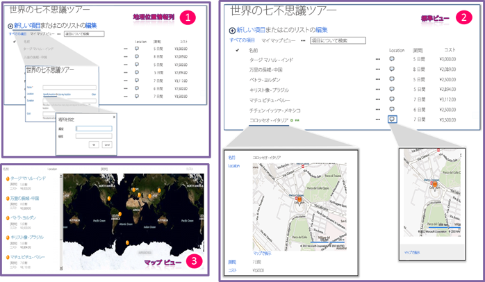

# SharePoint 2013 でロケーションとマップ機能を組み込む
新しいジオロケーション フィールドを使用することにより、およびジオロケーションに基づいて独自のジオロケーションベースのフィールド型を作成することにより、SharePoint リストと、SharePoint のロケーションベース Web およびモバイル アプリで位置情報とマップを統合する方法について説明します。
## SharePoint 2013 の位置およびマップの機能とは

SharePoint 2013 では、ジオロケーションと呼ばれる新しいフィールド型が導入されており、位置情報を使用して SharePoint リストに注釈を付けることができます。列の種類「ジオロケーション」に位置情報を緯度と経度の座標ペアとして 10 進数の度数で入力したり、W3C Geolocation API が実装されている場合は、ブラウザーからユーザーの現在位置の座標を取得したりできます。リストで、SharePoint 2013 は、Bing Maps によって提供されるマップ上に位置を表示します。さらに、マップ ビューと呼ばれる新しいビューでは、リスト アイテムが Bing Maps Ajax コントロール V7 上に画鋲として表示され、左側のウィンドウでは、リスト アイテムがカードとして表示されます。図 1 は、SharePoint 2013 の既定の位置およびマップの機能の概要を示しています。ジオロケーション フィールドとマップ ビューを組み合わせると、SharePoint からのデータをマッピング体験に統合することにより、情報に空間コンテキストを与えたり、ユーザーが Web およびモバイル アプリとソリューションに新しい方法で参加できるようになります。
  
    
    

> **メモ**
> 地理位置情報フィールドの値またはデータをリストに表示するには、SQLSysClrTypes.msi という MSI パッケージをすべての SharePoint フロントエンド Web サーバーにインストールする必要があります。このパッケージは、新しい図形座標、地理、および階層 ID の種類を SQL Server 2008 に実装するコンポーネントをインストールします。既定では、このファイルが SharePoint Online 用にインストールされます。ただし、SharePoint Server 2013の社内設置型の展開用ではありません。この操作を実行するためには、Farm Administrators グループのメンバーである必要があります。SQLSysClrTypes.msi をダウンロードするには、Microsoft ダウンロード センターの「 [Microsoft SQL Server 2008 R2 SP1 Feature Pack](http://www.microsoft.com/ja-jp/download/details.aspx?id=26728)」(SQL Server 2008 用) または「 [Microsoft SQL Server 2012 Feature Pack](http://www.microsoft.com/ja-jp/download/details.aspx?id=29065)」(SQL Server 2012 用) を参照してください。 
  
    
    

**図 1. 既定の位置およびマップの機能の概要**

  
    
    

  
    
    

  
    
    

  
    
    

  
    
    

## 位置およびマップの機能を使用してできること

SharePoint 2013 の位置およびマップの機能は、位置、マップ、および近似検索の機能を Web およびモバイル アプリとソリューションに統合できる特別な機会を開発者に提供します。表 1 に、位置およびマップの機能をアプリとソリューションに統合するのに役立ついくつかの基本的なタスクを示します。
  
    
    

**表 1. 位置およびマップの機能を統合するための基本的なタスク**

|**タスク**|**説明**|
|:-----|:-----|
| [[方法] SharePoint 2013 で、Web およびファーム レベルで Bing Maps キーを設定する](how-to-set-the-bing-maps-key-at-the-web-and-farm-level-in-sharepoint-2013.md)   |SharePoint 2013 は、Bings Maps を使用して、位置マップをレンダリングします。Bing Maps 機能を使用するには、Bing Maps キーを作成し、Web またはファーム レベルでこのキーを設定する必要があります。この記事では、SharePoint 2013 でキーを設定するさまざまな方法、オプションの種類、およびオプションを選択するタイミングについて説明しています。有効な Bing Maps キーを使用してない場合、あるいはリストが含まれる Web またはファーム レベルでキーを設定していない場合、マップ上にエラー メッセージが表示されます。    |
| [[方法] SharePoint 2013 で地理位置情報列をプログラムでリストに追加する](how-to-add-a-geolocation-column-to-a-list-programmatically-in-sharepoint-2013.md)   |既定で、ユーザーは SharePoint リストでジオロケーション列を使用できません。この列を SharePoint リストに追加するには、コードを書く必要があります。このトピックでは、プログラムによってジオロケーション フィールドをリストに追加する方法について説明します。    |
| [方法: クライアント側レンダリングを使用して地理位置情報フィールド型を拡張する](how-to-extend-the-geolocation-field-type-using-client-side-rendering.md)   |ジオロケーション フィールドから派生するカスタム フィールド型を作成することにより、ジオロケーション フィールドの既定のユーザー インターフェイス (UI)、ロジック、および動作に独自のレンダリングを与えることができます。SharePoint 2013 は、フィールドをレンダリングするカスタム .js ファイルをポイントするジオロケーション フィールド クラスに新しい JSLink プロパティを提供して、JavaScript を実行できるようにすることにより、カスタム フィールド型の作成を簡単にします。    > **メモ**> JSLink プロパティは、アンケート リストやイベント リストではサポートされません。SharePoint の予定表は、イベント リストです。           |
   

## その他の技術情報

-  [[方法] SharePoint 2013 で地理位置情報列をプログラムでリストに追加する](how-to-add-a-geolocation-column-to-a-list-programmatically-in-sharepoint-2013.md)
    
  
-  [[方法] SharePoint 2013 で、Web およびファーム レベルで Bing Maps キーを設定する](how-to-set-the-bing-maps-key-at-the-web-and-farm-level-in-sharepoint-2013.md)
    
  
-  [方法: クライアント側レンダリングを使用して地理位置情報フィールド型を拡張する](how-to-extend-the-geolocation-field-type-using-client-side-rendering.md)
    
  
-  [方法: Windows Phone アプリおよび SharePoint 2013 リストに地図を統合する](how-to-integrate-maps-with-windows-phone-apps-and-sharepoint-2013-lists.md)
    
  
-  [モバイル アプリケーションの場所を使用する (SharePoint 2013 プレビュー)](http://technet.microsoft.com/ja-jp/library/fp161355%28office.15%29.aspx)
    
  
