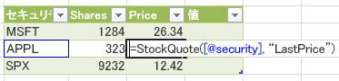

# JavaScript ユーザー定義関数の概要
SharePoint Server 2013 で、JavaScript のユーザー定義関数 (UDF) が Excel Services に新しく追加されました。この記事では、Excel Services での動作などの基本的な情報も含め、JavaScript UDF の概要を説明します。
## UDF とは?
<a name="xlsWhatAreUdfs"> </a>

ユーザー定義関数 (UDF) は、Excel の既定の関数だけで足りない場合に、ユーザーが自分で作成して Excel の使用可能な関数のリストに追加することができます。
  
    
    
Excel Services ではマネージ コードを使用して UDF を作成することができるため、既存の Excel Services UDF を使用した経験があれば、JavaScript UDF もすぐに理解できます。マネージ コードを使用した UDF の作成の詳細については、「 [Excel Services のユーザー定義関数](excel-services-user-defined-functions.md)」を参照してください。
  
    
    

## JavaScript UDF
<a name="xlsJsUDFs"> </a>

JavaScript UDF は、Excel ブックを埋め込んだ Web ページをブラウザー内で操作する UDF です。埋め込まれたブックの中で JavaScript UDF を使用します。ブラウザーでブックを操作している間は、Excel の組み込み関数と同じように、JavaScript UDF を使用することができます。Web ページを閉じると、JavaScript UDF は使用できなくなります。
  
    
    

## JavaScript UDF の動作の仕組み
<a name="xlsJsUDFs"> </a>

JavaScript UDF を使用するには、ブックを埋め込んだ Web ページのコンテンツを修正できるスキルが必要です。Excel Services の正しい JavaScript ソース ファイルを参照した後、ページに JavaScript UDF コードを追加します。また、JavaScript UDF を使用する前に、まず Excel Calculation Services に UDF を登録する必要があります。JavaScript UDF の API が提供するメソッドを使用して、JavaScript UDF の登録および登録解除を行うことができます。
  
    
    
Excel Web Access Web パーツまたはブックが埋め込まれた Web ページを表示する場合、他の Excel ブックのように、ブック内の JavaScript UDF を呼び出すことができます。
  
    
    
たとえば、特定の株式の現在の株価を取得する関数があるとします。次の JavaScript コードを使用して、Excel ブックをホストする Web ページに JavaScript UDF を追加することができます (ただし、Web ページを作成する権限が必要です)。
  
    
    


```

function StockInfo(symbol, measure) {
  var req = new XMLHttpRequest();
  req.open('GET', 'http://www.contoso-stock-quotes.com/quote/' + symbol + '/' + measure, false); 
  req.send(null);
  if (req.status == 200) {
    return req.responseText;
  } else {
    throw new Error(ExcelCalcError.Value);
  }
 
ewa.BrowserUdfs.add("StockQuote",
                       StockInfo,
                       "Gets a stock quote given a security symbol and measure to return."
                       false,
                       false
                       );

```

その後、Excel Online 内のセルから、数式に JavaScript UDF (StockInfo) を呼び出すことができます。
  
    
    

**図 1. Excel Online で呼び出された JavaScript UDF**

  
    
    

  
    
    

  
    
    

  
    
    

  
    
    

## JavaScript UDF の使用方法
<a name="xlsWhereUseJsUdfs"> </a>

JavaScript UDF は、SharePoint Server 2013 の Excel Web Access Web パーツに表示されたブック、またはブックを埋め込んだホスト Web ページのいずれかに作成して使用できます。Excel ブックは Microsoft OneDrive 上に保存する必要があります。主な違いは、Excel Web Access Web パーツに追加された JavaScript UDF は、SharePoint サーバーを必要とする点です。ブックを埋め込んだホスト Web ページに追加された JavaScript UDF は、ブックを OneDrive 上に保存するだけで使用できます。
  
    
    

## 重要なポイント
<a name="xlsWhereUseJsUdfs"> </a>


- JavaScript UDF が機能するのは、それが埋め込まれた Web ページが表示されている間だけです。JavaScript UDF が作成された Web ページがなくなれば、JavaScript UDF も機能しなくなります。
    
  
- JavaScript UDF 内から Excel Services の JavaScript オブジェクトモデルへの呼び出しを行うことはできません。
    
  

## その他の技術情報
<a name="bk_addresources"> </a>


-  [SharePoint 2013 の Excel Services](excel-services-in-sharepoint-2013.md)
    
  
-  [Excel Services の開発者のための新機能](09e96c8b-cb55-4fd1-a797-b50fbf0f9296.md)
    
  
-  [Excel Services ユーザー定義関数](http://msdn.microsoft.com/ja-jp/library/ms493934)
    
  

