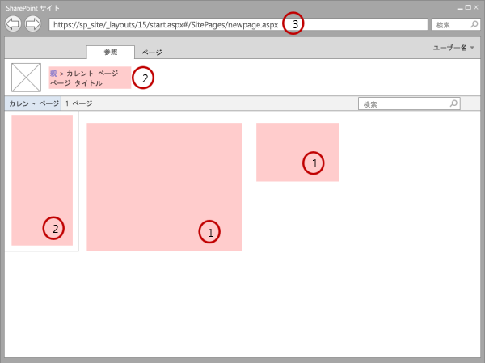
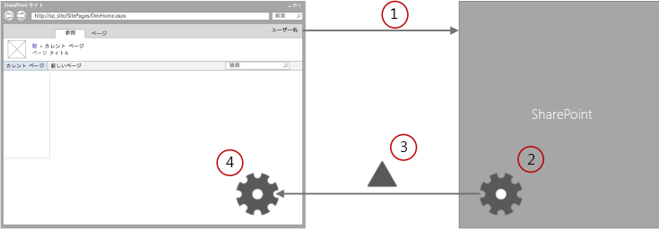

# ダウンロード最小化戦略の概要
SharePoint 2013 の新機能であるダウンロード最小化戦略 (MDS) について説明します。MDS では、ユーザーが新しいページに移動したときに、差異のみを送信することでページのロード時間を短縮します。
ダウンロード最小化戦略 (MDS) は SharePoint 2013 の新しいテクノロジーで、ユーザーが SharePoint サイト内のあるページから別のページに移動したときにブラウザーがダウンロードする必要のあるデータの量を削減します。MDS が有効化されているサイトをユーザーが閲覧すると、クライアントによって現在のページと要求されたページの差異 (差分) のみが処理されます。図 1 には、ページによって変更されるため、更新が必要なセクションを示しています。通常、差分には (1) のコンテンツ領域と、(2) のナビゲーション コントロールなど、その他のコンポーネントが含まれます。
  
    
    


**図 1. MDS で処理されるページ**

  
    
    

  
    
    

  
    
    
MDS が有効化されているサイトを識別するには、URL を確認します。MDS が有効化されているサイトの場合は、図 1 に示すように、URL に (3) の **_layouts/15/start.aspx** ページが含まれ、その後にハッシュ記号 ( **#** ) と要求されたリソースの相対 URL が続きます。たとえば、以下に **newpage.aspx** ページの MDS 用にフォーマットされた URL を示します。 **https://sp_site/_layouts/15/start.aspx#/SitePages/newpage.aspx**これは、以下の MDS 用にフォーマットされていない URL と同等です。 **https://sp_site/SitePages/newpage.aspx**開発者が作成した SharePoint コンポーネントには、MDS とシームレスに対応するためにいくつかの更新が必要な場合があります。 
## MDS の有効化
<a name="SP15MDSOverview_Enable"> </a>

サイトで MDS を有効にするには、サイト管理ページまたは SharePoint クライアント オブジェクト モデルを使用します。
  
    
    
管理ページの機能をアクティブ化して MDS を有効にするには、[ **サイトの設定**] > [ **サイト機能の管理**] を選択し、[ **ダウンロード最小化戦略**] 機能をアクティブ化します。
  
    
    
この機能は  [EnableMinimalDownload](https://msdn.microsoft.com/library/Microsoft.SharePoint.Client.Web.EnableMinimalDownload.aspx) プロパティを編集してアクティブ化するため、クライアント API を使用することもできます。以下のコードは、JavaScript オブジェクト モデル (JSOM) を使用して MDS を有効にする方法を示します。
  
    
    


```

var clientContext;

clientContext = new SP.ClientContext.get_current();
this.oWebsite = clientContext.get_web();

this.oWebsite.set_enableMinimalDownload(true);
this.oWebsite.update();

clientContext.load(this.oWebsite);

clientContext.executeQueryAsync(
    Function.createDelegate(this, successHandler),
    Function.createDelegate(this, errorHandler)
);

function successHandler() {
    alert("MDS is enabled in this site.");
}

function errorHandler() {
    alert("Request failed: " + arguments[1].get_message());
}
```


## MDS を使用するメリット
<a name="SP15MDSOverview_Benefits"> </a>

MDS を使用することで、以下のような複数のメリットを得ることができます。
  
    
    

- **速度:** MDS の主要な目的は速度です。MDS を使用する場合、ブラウザーによってクロム ユーザー インターフェイス (UI) を再処理する必要がありません。また、完全なページのロードと比べて、MDS ではペイロードが削減されます。
    
  
- **スムーズな切り替え:** 変更された領域のみを更新することで、完全なページのロードのようにページ全体が 「フラッシュ」 するのではなく、ユーザーの目を変更された領域に引き付けることができます。ページ全体が更新される場合、ユーザーは全体を解析して新しくなった部分を検出する必要があります。前のページから変更された領域のみを更新するサイトの方が、ユーザーにとって移動が簡単になります。
    
  
- **ブラウザーのナビゲーション コントロール:** 他の AJAX ベースのシステムでは、ブラウザーの [ **前へ**] ボタンと [ **次へ**] ボタンとを混同しています。MDS ではブラウザー ウィンドウの URL が更新されるため、[前へ] ボタンと [次へ] ボタンが想定したとおりに動作します。
    
  
- **下位互換性:** MDS エンジンでは、MDS ナビゲーションを即座に提供するか、不可能な場合はそれを検出します。MDS ナビゲーションが不可能な場合、代わりに完全なページのロードが行われます。このプロセスは **フェイルオーバー** と呼ばれ、すべてのページが、MDS 準拠のコンポーネントを含むかどうかに関係なく、適切にレンダリングされるようにします。また、アンカー タグの **href** 属性では通常の MDS 用にフォーマットされていない URL を使用するため、MDS は検索エンジンとも適切に連動します。クライアントの MDS エンジンでは代わりに **onclick** イベントをキャプチャして、サーバーとの通信に使用します。
    
  

## MDS のアーキテクチャ
<a name="SP15MDSOverview_Architecture"> </a>

MDS の基本的な仕組みはごく単純です。MDS の主要なコンポーネントは 2 つのエンジンで、1 つはサーバー内に、もう 1 つはクライアント内に存在します。この 2 つのエンジンが連動して、ユーザーがサイト内のページ間を移動したときに、変更点を計算し、ブラウザーのページをレンダリングします。図 2 に、ユーザーが MDS が有効化されているサイトを移動するときの MDS フローを示します。
  
    
    

**図 2. ユーザーがサイト内を移動するときの MDS フロー**

  
    
    

  
    
    

  
    
    

  
    
    

1. ブラウザーが SharePoint サイト内の現在のページと新しいページの変更点を要求します。
    
  
2. サーバー内の MDS エンジンが現在のページと新しいページの差分を計算します。
    
  
3. サーバー内の MDS エンジンが差分をクライアント内の MDS エンジンに送信します。
    
  
4. クライアント内の MDS エンジンが現在のページから変更された領域を新しいページのコンテンツに置き換えます。
    
  
結果として表示されるページは、MDS を使用しないでページをダウンロードした場合と全く同じになります。
  
    
    
クライアント内の MDS エンジンには、ダウンロード マネージャーが含まれます。ページ内のすべての要求はダウンロード マネージャー経由でルーティングされます。ページ内のすべてのコントロールは、URL が変更されたタイミングを知るためにダウンロード マネージャーにサブスクライブする必要があります。ダウンロード マネージャーでは、すべての新しいコントロール データに対して 1 つの要求が実行されます。検索エンジンと連動できるように、MDS エンジンでは、MDS 用にフォーマットされた URL を格納するためにアンカー タグの **href** 属性を直接使用するのではなく、 **SPUpdatePage** 関数で **onclick** イベントを処理して、サーバーとの通信に使用します。 **SPUpdatePage** 関数は **_layouts/15/start.js** ファイル内で宣言されています。
  
    
    
サーバー内の MDS エンジンによって、クライアントに情報が返送されます。この情報には、埋め込みスクリプトおよびスタイルを含む HTML、XML または JavaScript Object Notation (JSON) を含めることができます。
  
    
    
MDS では URL が重要な役割を果たします。MDS の URL は、 **https://sp_site/_layouts/15/start.aspx#/SitePages/newpage.aspx** のような形式です。 **Start.aspx** には、ページの変更点をロードするための最小限の共有 UI と指示が含まれます。MDS では、ハッシュ記号 (#) の後続の部分がターゲット ページであると認識します。ターゲット ページはスラッシュ (/) から始まり、その後に SharePoint Web サイトに相対する URL が続きます。ブラウザーで URL を受信すると、ハッシュ記号の左側の部分が変更されていないことが確認され、ローカル ナビゲーション イベントが発生します。クライアント内の MDS エンジンによってローカル ナビゲーション イベントがキャプチャされ、MDS の更新の実行に使用されます。
  
    
    
この記事で前述したように、場合によっては、ページを適切に更新できるかどうかを判断できないことがあります。こういった場合には、MDS エンジンによって **フェイルオーバー** が発行されます。フェイルオーバーでは、余分なラウンド トリップを実行し、新しいページの完全なバージョンにブラウザーをリダイレクトします。以下に、フェイルオーバーが発生する理由として最も一般的な要因を示します。
  
    
    

- 新しいページのマスター ページが異なる。
    
  
- 現在のマスター ページが変更された。
    
  
- MDS エンジンによって、以下のような非準拠の HTML が検出された。
    
  - ASP.NET 2.0 を使用するページ
    
  
  - MDS エンジンに登録されていない CSS またはスクリプト
    
  
  - 無効な HTML
    
  
- ページ内に以下のような非準拠のコントロールが含まれる。
    
  - MDS エンジンのホワイトリストにコントロールが存在しない。
    
  
  - コントロール アセンブリが準拠であるとマークされていない。
    
  
  - コントロール クラスに MDS 属性が存在しない。
    
  
ユーザーがさらに別の新しいページに移動すると、MDS エンジンでフェイルオーバーからの復旧が試行されます。
  
    
    

## 開発者のコントロール
<a name="SP15MDSOverview_DevControls"> </a>

フェイルオーバーのメカニズムがあるおかげで、ユーザーの Web サイトで MDS が有効化されているかどうかに関係なく、コントロールがシームレスに動作します。しかし、SharePoint コントロールおよびコンポーネントを更新して、MDS のメリットを最大限に活かすことをお奨めします。作成したページやコントロールが MDS に準拠している方が、ユーザー エクスペリエンスが向上します。以下のコンポーネントは、いずれも MDS 用に最適化するために適したオプションです。
  
    
    

- マスター ページ
    
  
- ASP.NET ページ
    
  
- コントロールと Web パーツ
    
  

## その他のリソース
<a name="bk_addresources"> </a>


-  [EnableMinimalDownload](https://msdn.microsoft.com/library/Microsoft.SharePoint.Client.Web.EnableMinimalDownload.aspx)
    
  
-  [MDS のための SharePoint コンポーネントの変更](modify-sharepoint-components-for-mds.md)
    
  
-  [SharePoint サイトの構築](build-sites-for-sharepoint.md)
    
  

