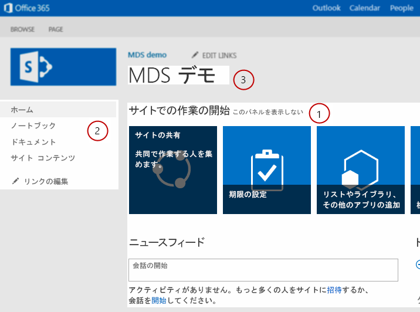

# MDS のための SharePoint コンポーネントの変更
SharePoint プロジェクトのコンポーネントを変更し、SharePoint 2013 でダウンロード最小化戦略 (MDS) を活用する方法を説明します。
ダウンロード最小化戦略 (MDS) は、ブラウザーで適切に表示するために必要なページの一部のみをサーバーから返すことでユーザー エクスペリエンスを向上させます。完全に表示されたページがクライアントに返されないため、サーバーはページの表示に必要な部分を正確に特定できる必要があります。MDS 対応として識別され、MDS エンジンで操作できるようにするためには、SharePoint プロジェクトのコンポーネントを変更する必要があることがあります。MDS について詳しくは、「 [ダウンロード最小化戦略の概要](minimal-download-strategy-overview.md)」をご覧ください。
  
    
    


## SharePoint コンポーネントを変更する理由
<a name="bk_whymodify"> </a>

「 [ダウンロード最小化戦略の概要](minimal-download-strategy-overview.md)」で説明しているように、SharePoint コントロールは MDS をフル活用するように変更しているかどうかに関係なく機能します。しかし、コンポーネントが MDS に対応していない場合、MDS エンジンはフェイルオーバーを実行します。フェイルオーバーでは、新しいページの完全版にブラウザーをリダイレクトするために MDS エンジンが余分なラウンド トリップを必要とするので、時間がかかります。ユーザー エクスペリエンスは、MDS で動作するようにコンポーネントを変更し、ユーザーが SharePoint で新しいページを閲覧するたびにフェイルオーバーが発生しないようにした場合に最適化されます。通常、マスター ページ、ASP.NET ページ、コントロール、Web パーツを変更する必要があります。 
  
    
    

  
    
    

## マスター ページ
<a name="SP15MDSDev_MasterPages"> </a>

マスター ページでは、閲覧者が新しいページに移動するときに更新する必要がある可能性があるコンテンツ領域を MDS が特定できるようにするテンプレートを提供します。マスター ページは更新されたコンテンツを必要とするセクションを特定するため、マスター ページを最適化することはパフォーマンスの最適化を行うときに実行すべき最も重要な手順の 1 つです。SharePoint に付属する Seattle.master マスター ページは最適化されたマスター ページの好例です。図 1 は、(1) メイン コンテンツ領域、(2) 左ナビゲーション バー、(3) ページ タイトルなど、ページごとに変化する Seattle.master マスター ページのコンポーネントの例を示しています。
  
    
    

**図 1. マスター ページ内で更新が必要なコンポーネント**

  
    
    

  
    
    

  
    
    

    
> **メモ**
> Seattle.master マスター ページには、スタイル シートや JavaScript ファイルなど、ページごとに変化するコンポーネントがさらに多数存在します。図 1 で示している例はほんの一部です。 
  
    
    

マスター ページのコンポーネントを最適化するためにはさまざまなパターンがあります。次のコンポーネントに対してパターンを使用できます。
  
    
    

- HTML 領域およびコントロール
    
  
- スタイル シート
    
  
- JavaScript ファイル
    
  
- ページ タイトル
    
  
HTML 領域およびコントロールは、 **SharePoint:AjaxDelta** タグで括られている場合 MDS に対応しています。コンテンツを **SharePoint:AjaxDelta** タグで括ると、囲まれたコントロールおよび HTML を MDS エンジンが更新する必要があることを示していることになります。コントロールまたは HTML セクションがページごとに変化しない場合は、クライアントに送信されるべきではありません。したがって、これらのコントロールは **AjaxDelta** タグの外側に配置する必要があります。図 1 に示す Seattle.master マスター ページでは、(1) メイン コンテンツ領域が次に示すように **AjaxDelta** タグで括られています。
  
    
    


```cs
<SharePoint:AjaxDelta
            id="DeltaPlaceHolderMain"
            BlockElement="true"
            IsMainContent="true"
            runat="server">
    <a id="mainContent" name="mainContent" tabindex="-1"></a>
    <asp:ContentPlaceHolder id="PlaceHolderMain" runat="server" />
</SharePoint:AjaxDelta>
```

 **AjaxDelta** パターンの別の例は、図 1 の (2) 左ナビゲーション バーです。次のコードは、コントロールがその他多数のコントロールおよび HTML と共に **AjaxDelta** タグでどのように括られているかを示しています。
  
    
    


```cs
<SharePoint:AjaxDelta
            id="DeltaPlaceHolderLeftNavBar"
            BlockElement="true"
            CssClass="ms-core-navigation"
            role="navigation"
            runat="server">
    <asp:ContentPlaceHolder id="PlaceHolderLeftNavBar" runat="server">
        <a id="startNavigation" name="startNavigation" tabIndex="-1"></a>
        <asp:ContentPlaceHolder id="PlaceHolderLeftNavBarTop" runat="server" />
        <asp:ContentPlaceHolder id="PlaceHolderQuickLaunchTop" runat="server" />
        <asp:ContentPlaceHolder id="PlaceHolderLeftNavBarDataSource" runat="server" />
        <asp:ContentPlaceHolder id="PlaceHolderCalendarNavigator" runat="server" />
        <asp:ContentPlaceHolder id="PlaceHolderLeftActions" runat="server" />
        <!-- There are more controls and HTML in this placeholder in the Seattle master page -->
    </asp:ContentPlaceHolder>
</SharePoint:AjaxDelta>
```

 **AjaxDelta** タグについて最後に覚えておくべきことは、入れ子にできないということです。マスター ページ構造で必要な最高レベルで **AjaxDelta** タグを指定する必要があります。
  
    
    
図 1 の最後の例は (3) ページ タイトルであり、 **SharePoint:PageTitle** タグを使用する特別なパターンが必要になります。次のコードは、Seattle.master マスター ページで使用される **PageTitle** タグを示しています。
  
    
    


```cs

<SharePoint:PageTitle runat="server">
    <asp:ContentPlaceHolder id="PlaceHolderPageTitle" runat="server">
        <SharePoint:ProjectProperty Property="Title" runat="server" />
    </asp:ContentPlaceHolder>
</SharePoint:PageTitle>
```

また、マスター ページにはスタイルシートと JavaScript ファイルが含まれることもあります。サーバー エンジンは必要に応じて CSS ファイルと JavaScript ファイルの両方を識別する必要があります。必要に応じて CSS ファイル リソースを識別するには、次のパターンを使用します。
  
    
    


```cs

<SharePoint:CssLink runat="server" Version="15"/>
<SharePoint:CssRegistration Name="my_styles.css" runat="server" />
```

 **CssLink** タグはマスター ページごとに 1 つしか使用できませんが、 **CssRegistration** タグは複数使用できるため、複数の CSS ファイルを追加できます。JavaScript ファイルの場合は次のパターンを使用します。
  
    
    


```cs

<SharePoint:ScriptLink language="javascript" name="my_javascript.js" runat="server" />
```

HTML の **style** タグと **script** タグを使用して CSS ファイルと JavaScript ファイルを含める方法は MDS でサポートされません。
  
    
    

## ASP.NET ページ
<a name="SP15MDSDev_ASPNET"> </a>

プロジェクトに ASP.NET ページが含まれる場合は通常、CSS ファイルと JavaScript ファイルを参照する必要があります。HTML の **style** タグと **script** タグは MDS に対応していません。代わりに、前のセクションで説明した **CssRegistration** パターンと **ScriptLink** パターンを使用します。
  
    
    
また、ASP.NET ページではコンテンツをページに書き込むために **Response.Output** メソッドを使用していることがありますが、これは MDS で許可されません。代わりに、次に示す [SPHttpUtility](https://msdn.microsoft.com/library/Microsoft.SharePoint.Utilities.SPHttpUtility.aspx) クラスの MDS に対応したメソッドを使用することができます。
  
    
    

-  [WriteNoEncode()](https://msdn.microsoft.com/library/Microsoft.SharePoint.Utilities.SPHttpUtility.WriteNoEncode.aspx)
    
  
-  [WriteHtmlEncode()](https://msdn.microsoft.com/library/Microsoft.SharePoint.Utilities.SPHttpUtility.WriteHtmlEncode.aspx)
    
  
-  [WriteEcmaScriptStringLiteralEncode()](https://msdn.microsoft.com/library/Microsoft.SharePoint.Utilities.SPHttpUtility.WriteEcmaScriptStringLiteralEncode.aspx)
    
  
-  [WriteHtmlEncodeAllowSimpleTextFormatting()](https://msdn.microsoft.com/library/Microsoft.SharePoint.Utilities.SPHttpUtility.WriteHtmlEncodeAllowSimpleTextFormatting.aspx)
    
  
-  [WriteHtmlUrlAttributeEncode()](https://msdn.microsoft.com/library/Microsoft.SharePoint.Utilities.SPHttpUtility.WriteHtmlUrlAttributeEncode.aspx)
    
  
-  [WriteUrlKeyValueEncode()](https://msdn.microsoft.com/library/Microsoft.SharePoint.Utilities.SPHttpUtility.WriteUrlKeyValueEncode.aspx)
    
  
-  [WriteUrlPathEncode()](https://msdn.microsoft.com/library/Microsoft.SharePoint.Utilities.SPHttpUtility.WriteUrlPathEncode.aspx)
    
  
JavaScript ファイルを参照するだけでなく、ASP.NET ページにインライン JavaScript コードを使用することもできます。スクリプト ブロックを MDS 対応にするには次のパターンを使用します。
  
    
    


```cs
<SharePoint:ScriptBlock runat="server" >
    // Your JavaScript code here.
</SharePoint:ScriptBlock>
```


## コントロールと Web パーツ
<a name="SP15MDSDev_WebParts"> </a>

コントロールと Web パーツを MDS 対応としてマークする必要もあります。次のコードは、使用するパターンを示しています。
  
    
    

```cs

[assembly: Microsoft.SharePoint.WebControls.MdsCompliantAttribute(IsCompliant = true)]
namespace VisualWebPartProject2.VisualWebPart1
{
    // Rest of your control logic
```

また、コントロールと Web パーツは、 [SPPageContentManager](https://msdn.microsoft.com/library/Microsoft.SharePoint.WebControls.SPPageContentManager.aspx) クラスのメソッドを使用してリソースを登録する必要があります。最も一般的なリソースは JavaScript スニペットと隠しファイルであり、それぞれ **RegisterClientScriptBlock** と **RegisterHiddenField** を使用して登録できます。
  
    
    
コントロールと Web パーツでは、XSLT ファイルを使用して表示プロセスを制御することもできます。XSLT ファイルには埋め込みの JavaScript コードまたはファイルがあることがあります。MDS エンジンはこれらのリソースを認識する必要があります。JavaScript リソースは、 **pcm** という名前の XSLT 拡張オブジェクトを使用して登録できます。 **pcm** オブジェクトの使用方法の良い例は、%ProgramFiles%\\Common Files\\Microsoft Shared\\web server extensions\\15\\TEMPLATE\\LAYOUTS\\XSL\\fldtypes.xsl ファイルにあります。次のコードは、 **fldtypes.xsl** ファイルで **pcm** オブジェクトを使用して JavaScript リソースを登録する方法を示しています。
  
    
    


```XML

<xsl:value-of select="pcm:RegisterScriptBlock(concat('block1',$ViewCounter), string($scriptbody1))"/>
<xsl:value-of select="pcm:RegisterScriptLink('/_layouts/15/wssactionmenu.js')"/>
```


## その他のリソース
<a name="bk_addresources"> </a>


-  [ダウンロード最小化戦略の概要](minimal-download-strategy-overview.md)
    
  
-  [SharePoint サイトの構築](build-sites-for-sharepoint.md)
    
  

