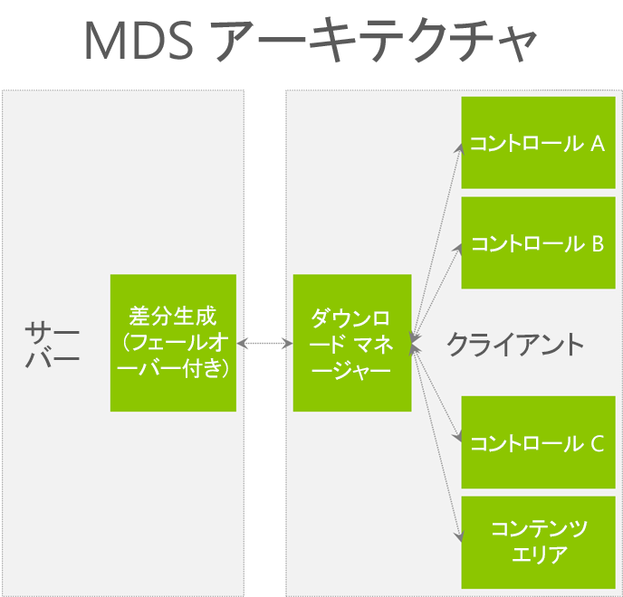
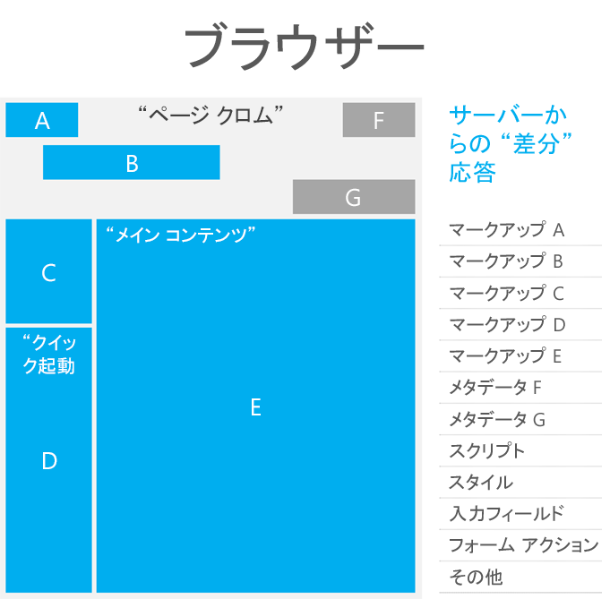
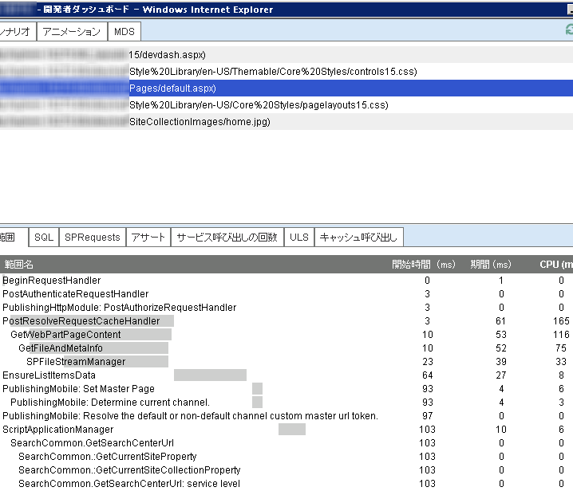

# SharePoint 2013 でのページ パフォーマンスの最適化
SharePoint 2013 のページのパフォーマンスを向上させる機能について学びます。それらの機能を使用して、地理的に分散した環境での経験を拡げることができます。
 * **提供元:*** David Crawford, Microsoft Corporation
  
    
    

この記事には、SharePoint のパフォーマンスの最適化を支援する指示が記載されています。SharePoint 2013には、ワイド エリア ネットワーク (WAN) 経由でのページの読み込みの最適化を支援する機能が含まれています。ページを可能な限り小さく、応答性の良いものとして設計することも、それらのパフォーマンス向上を補助することになります。
## ダウンロード最小化戦略 (MDS)
<a name="MDS"> </a>

ダウンロード最小化戦略 (MDS) は、サーバー上で完全にレンダリングされたページの特定の部分だけをダウンロードする機能に依存しています。特定の部分だけをダウンロードすることは、非常に効率的な読み込みモデルを提供します。完全にレンダリングされたページがクライアントに返されることはありません。応答の一部として含める必要のある要素と必要のない要素とを、サーバーは正確に識別できなければなりません。応答の一部として含める場合と除外する場合がある要素としては、スクリプト、スタイル、およびマークアップがあります。
  
    
    
次の表は、MDS を使用することの幾つかの利点を示しています。
  
    
    

**表 1. MDS を使用するメリット**


|**パフォーマンス**|**ビジュアル**|
|:-----|:-----|
|ページ要求ごとにダウンロードされるデータ量が少なくなります。  <br/> |ページ全体の再ロードに起因するブラウザーのフラッシュを防ぎます。  <br/> |
|ブラウザーは、前回の要求以降に変更されたページの領域だけを更新する必要があります。  <br/> |簡単にアニメーションを識別できます。  <br/> |
|クライアントで必要な処理の量が少なくなります。  <br/> > **メモ**> クライアントのページ ロード時間 1 (PLT1) の半分は、クロムのカスケード スタイル シート (CSS) レンダリングと JavaScript の解析および実行によるものです。           |ページにおける変更は、ユーザーの注意を引きます。  <br/> |
   
AJAX と MDS の両方とも、ページのセクションだけを要求することによりデータ ダウンロードを最小化し、ページの応答性を向上させるテクノロジーです。MDS のアーキテクチャを次の図に示します。
  
    
    

**図 1. MDS のアーキテクチャ**

  
    
    

  
    
    

  
    
    
MDS のフレームワークは、クロムとコンテンツ領域がマスター ページによって定義されるものと想定します。MDS では、ページへの SharePoint ナビゲートは、ページが依存している領域およびリソースに関するコンテンツだけを要求することを意味しています。そのコンテンツがブラウザーにダウンロードされると、スクリプト コードはマークアップまたはリソースを適切にページに適用します。ブラウザーは、サーバーから要求されたページが完全に読み込まれた場合と同様に動作します。
  
    
    

**図 2. ページ クロムおよび SharePoint ページ内の領域**

  
    
    

  
    
    

  
    
    
ユーザーが SharePoint Web サイトを MDS モードでブラウズしているときは、ページ全体のポストバックとページ全体の再ロードが生じることはありません。その代わりに、ユーザーがアクセスしているページの URL は同じままで、フラグメント識別子 ("#" 記号) が、アクセスしているページを含むように変更されます。URL の形式は次のとおりです:  `[Path to site (spweb)] + /_layouts/15/start.aspx# + [path to page] + [query string]`
  
    
    
次の表は、MDS モードで書式設定された URL の例を示します。
  
    
    

**表 2. MDS モードで書式設定された URL**


|**MDS ではない URL**|**MDS の URL**|
|:-----|:-----|
|http://server/SitePages/  <br/> |http://server/_layouts/15/start.aspx#/SitePages/  <br/> |
|http://server/subsite/SitePages/home.aspx  <br/> |http://server/subsite/_layouts/15/start.aspx#/SitePages/home.aspx  <br/> |
|http://server/_layouts/15/viewlsts.aspx?BaseType=0  <br/> |http://server/_layouts/15/start.aspx#/_layouts/viewlsts.aspx?BaseType=0  <br/> |
   
AJAX ナビゲーションに使用されるオブジェクトは **AjaxNavigate** です。デフォルトで使用可能になっている **AjaxNavigate** のインスタンスがあり、その名前は **ajaxNavigate** です。 **ajaxNavigate** インスタンスを使用するには、以下のようにします。
  
    
    


```cs

ajaxNavigate.update(serverRelativeURL, null);
```

ナビゲーション イベントをリッスンするためのコントロールまたは Web パーツを必要とする場合には、 **add_navigate** ハンドラーを使うことができます。ハンドラーが呼び出されると、ナビゲーション オブジェクトへの参照と辞書内の解析済みハッシュ値をコールバック関数が受け取ります。コントロールまたは Web パーツは、関心あるパラメータの値を辞書から取得し、それを現在の値と比較し、どんなアクションをとる必要があるかを決定することができます。よくあるアクションは、AJAX 要求をサーバーに送信して、何らかのデータを取得したり、ビュー内の項目を並べ替えたりすることです。コントロールがナビゲーション イベントのリッスンを完了したときには、 **remove_navigate** ハンドラーを使うことができます。
  
    
    
さらに MDS は、キーと値のペアによる複数のハッシュ記号もサポートします。MDS は URL の後にハッシュ記号を追加します。URL 内のハッシュ記号の形式は次のとおりです: http://server/_layouts/15/start.aspx#/SitePages/page.aspx#key1=value1#key2=value2。次のコード例では、ハッシュ マークを更新する方法を示します。
  
    
    


```
var updateParts;
updateParts = {key1: "value1", key2: "value2", keyn: "valuen"}
ajaxNavigate.update(null, updateParts);

```

Web サイト内のページが定常的にページ全体のダウンロードに戻ってしまうことに気付いた場合には、MDS 機能をオフにすることも検討できるでしょう。また、パフォーマンスを向上させるために別の戦略を使う必要がある場合に、MDS 機能をオフにするかもしれません。
  
    
    
サーバーのレンダリング時に、作動している必要のある重要なリソースが MDS インフラストラクチャーに認識されていることを、ページ内の特定の要素が確認しなければなりません。MDS を使用するように既存のプロジェクトを変換するには、次のファイルとコンポーネントを更新する必要があります。
  
    
    

- マスター ページ
    
  
- ASP.NET ページ
    
  
- エラー用のカスタム マスター ページ
    
  
- JavaScript ファイル
    
  
- コントロールと Web パーツ
    
  

### マスター ページ

マスター ページにおける主な変更点は、 **SharePoint:AjaxDelta** という名前の特殊なコントロールと共にクライアントに送信される HTML マークアップの領域を囲むことです。 **SharePoint:AjaxDelta** コントロールによって囲む必要のある最も一般的なパーツは、マスター ページ クロムおよびコンテンツ プレース ホルダーに埋め込まれたコントロールです。サイト内のすべてのページでコントロールが同じ場合には、それを **SharePoint:AjaxDelta** コントロールでラップしないでください。次のマークアップは、 **SharePoint:AjaxDelta** コントロールで囲まれた、可視のコンテンツ プレースホルダーを示しています。
  
    
    

```HTML

<SharePoint:AjaxDelta id="DeltaPlaceHolderMain" IsMainContent="true" runat="server">
    <asp:ContentPlaceHolder id="PlaceHolderMain" runat="server" />
</SharePoint:AjaxDelta>
```

現在の URL に依存するコンテンツを持つコントロールは、 **SharePoint:AjaxDelta** コントロールでラップする必要があります。次のマークアップは、 **SharePoint:AjaxDelta** コントロールで囲まれたメニューを示しています。
  
    
    


```HTML

<SharePoint:AjaxDelta id="DeltaBreadcrumbDropdown" runat="server">
    <SharePoint:PopoutMenu
        runat="server"
        ID="GlobalBreadCrumbNavPopout"
        IconUrl=IMGCLUSTER_FG_IMG
        IconAlt=LOC_ATTR_WSS(master_breadcrumbIconAlt)
        IconOffsetX=IMGCLUSTER_FG_LEFT(BREADCRUMBBUTTON)
        IconOffsetY=IMGCLUSTER_FG_TOP(BREADCRUMBBUTTON)
        IconWidth=IMGCLUSTER_FG_WIDTH(BREADCRUMBBUTTON)
        IconHeight=IMGCLUSTER_FG_HEIGHT(BREADCRUMBBUTTON)
        AnchorCss="s4-breadcrumb-anchor"
        AnchorOpenCss="s4-breadcrumb-anchor-open"
        MenuCss="s4-breadcrumb-menu">
    </SharePoint:PopoutMenu>
</SharePoint:AjaxDelta>

```


> **メモ**
> **SharePoint:AjaxDelta** コントロールをそれ自体に入れ子にしないでください。必要とされる最も高いレベルに、このコントロールを指定します。
  
    
    

カスケード スタイル シート (CSS) ファイルを含める必要がある場合には、 **SharePoint:CssLink** および **SharePoint:CssRegistration** コントロールを使用する必要があります。これらのコントロールは、MDS モードと MDS ではないモードの両方で動作するように更新されました。次のマークアップは、 **SharePoint:CssLink** および **SharePoint:CssRegistration** コントロールの使用方法を示しています。
  
    
    


```HTML

<SharePoint:CssLink runat="server" Version="15"/>
<SharePoint:CssRegistration Name="my_stylesheet.css" runat="server" />
```


> **注意**
> ページごとに持つことができる **SharePoint:CssLink** コントロールは 1 つだけです。MDS モードでは、1 つのページに複数の **SharePoint:CssLink** コントロールがある場合にはエラーが発生します。HTML スタイル要素を使って CSS ファイルを組み込むことは、MDS モードではサポートされていません。応答が表示されるときに、サーバー ロジックはファイルを必須リソースとして識別することができないからです。
  
    
    

JavaScript ファイルを組み込むには、 **SharePoint:ScriptLink** コントロールを使います。次のマークアップは **SharePoint:ScriptLink** コントロールの使用方法を示しています。
  
    
    


```HTML

<SharePoint:ScriptLink language="javascript" name="my_javascriptfile.js" runat="server" />
```


> **注意**
> HTML スクリプト タグを使って JavaScript ファイルを組み込むことは、MDS モードではサポートされていません。応答が表示されるときに、サーバー ロジックはファイルを必須リソースとして識別することができないからです。 
  
    
    

ページ内の head 要素の中に title 要素を入れるためには、 **SharePoint:PageTitle** コントロールを使った特殊パターンを使用します。次のマークアップは **SharePoint:PageTitle** コントロールの使用方法を示しています。
  
    
    


```HTML
<SharePoint:PageTitle runat="server">
    <asp:ContentPlaceHolder id="PlaceHolderPageTitle" runat="server" />
</SharePoint:PageTitle>

```


> **メモ**
> それぞれのページで、 **SharePoint:PageTitle** コントロールの中の **asp:ContentPlaceHolder** コントロールに置換を提供することにより、タイトルをオーバーライドする必要があります。
  
    
    


### ASP.NET ページ

JavaScript または CSS ファイルを組み込むには、前のセクションで説明されている、同じ **SharePoint:ScriptLink** および **SharePoint:CssLink** コントロールを使います。
  
    
    
前のバージョンの SharePoint では、 **Response.Output** プロパティを使用することにより、いくつかのページがコンテンツを書き込みました。MDS を使用する場合、この方法は許可されなくなりました。 **Response.Output** の呼び出しは、新しい API を使うように変更する必要があります。次の表は、SharePoint のページで一般的に使用される API と、新しい MDS 準拠の API を示しています。
  
    
    

**表 3. 一般的に使用される API と、それぞれの MDS 準拠の代替物**


|**一般的に使用される API**|**MDS に準拠した代替物**|
|:-----|:-----|
| [NoEncode()](https://msdn.microsoft.com/library/Microsoft.SharePoint.Utilities.SPHttpUtility.NoEncode.aspx) <br/> | [WriteNoEncode()](https://msdn.microsoft.com/library/Microsoft.SharePoint.Utilities.SPHttpUtility.WriteNoEncode.aspx) <br/> |
| [HtmlEncode()](https://msdn.microsoft.com/library/Microsoft.SharePoint.Utilities.SPHttpUtility.HtmlEncode.aspx) <br/> | [WriteHtmlEncode()](https://msdn.microsoft.com/library/Microsoft.SharePoint.Utilities.SPHttpUtility.WriteHtmlEncode.aspx) <br/> |
| [EcmaScriptStringLiteralEncode()](https://msdn.microsoft.com/library/Microsoft.SharePoint.Utilities.SPHttpUtility.EcmaScriptStringLiteralEncode.aspx) <br/> | [WriteEcmaScriptStringLiteralEncode()](https://msdn.microsoft.com/library/Microsoft.SharePoint.Utilities.SPHttpUtility.WriteEcmaScriptStringLiteralEncode.aspx) <br/> |
| [HtmlEncodeAllowSimpleTextFormatting()](https://msdn.microsoft.com/library/Microsoft.SharePoint.Utilities.SPHttpUtility.HtmlEncodeAllowSimpleTextFormatting.aspx) <br/> | [WriteHtmlEncodeAllowSimpleTextFormatting()](https://msdn.microsoft.com/library/Microsoft.SharePoint.Utilities.SPHttpUtility.WriteHtmlEncodeAllowSimpleTextFormatting.aspx) <br/> |
| [HtmlUrlAttributeEncode()](https://msdn.microsoft.com/library/Microsoft.SharePoint.Utilities.SPHttpUtility.HtmlUrlAttributeEncode.aspx) <br/> | [WriteHtmlUrlAttributeEncode()](https://msdn.microsoft.com/library/Microsoft.SharePoint.Utilities.SPHttpUtility.WriteHtmlUrlAttributeEncode.aspx) <br/> |
| [UrlKeyValueEncode()](https://msdn.microsoft.com/library/Microsoft.SharePoint.Utilities.SPHttpUtility.UrlKeyValueEncode.aspx) <br/> | [WriteUrlKeyValueEncode()](https://msdn.microsoft.com/library/Microsoft.SharePoint.Utilities.SPHttpUtility.WriteUrlKeyValueEncode.aspx) <br/> |
| [UrlPathEncode()](https://msdn.microsoft.com/library/Microsoft.SharePoint.Utilities.SPHttpUtility.UrlPathEncode.aspx) <br/> | [WriteUrlPathEncode()](https://msdn.microsoft.com/library/Microsoft.SharePoint.Utilities.SPHttpUtility.WriteUrlPathEncode.aspx) <br/> |
   
ページ、コントロール、または Web パーツがその出力を **Response.Output** プロパティに送った場合、MDS がフェールバックすることになります。MDS はフェールバックすると、要求されたページへのフル ナビゲーションを実行します。サーバー コンポーネントのデバッグの際に **DeltaPage ._shipRender** プロパティを使用することにより、問題のあるコントロールを見つけることができます。
  
    
    
HTML インライン スクリプト要素は **SharePoint:ScriptBlock** に置き換えてください。次の表は、HTML インライン スクリプト要素と **SharePoint:ScriptBlock** コントロールを示しています。
  
    
    

**表 4. HTML インライン スクリプト要素と、それぞれの MDS 準拠の代替物**


|**HTML インライン スクリプト要素**|**MDS に準拠した代替物**|
|:-----|:-----|
|
```

<script type="text/javascript">
    // Your JavaScript code goes here.
</script>
```

|
```

<SharePoint:ScriptBlock runat="server">
    // Your JavaScript code goes here.
</SharePoint:ScriptBlock>
```

|
   
 **SharePoint:ScriptBlock** ページのイントロダクションで、ページ内の変数のスコープを変更することができます。ときには、変数の宣言を `<% %>` から `<script runat="server"> <script>` に移行することが必要になることがあります。これについてテストするには、更新を実行した後にブラウザーにページを読み込んでください。
  
    
    

> **メモ**
> MDS インフラストラクチャは VBScript をサポートしていません。それをスクリプトとして ASP.NET に登録できないためです。スクリプトは JavaScript に変換する必要があります。 
  
    
    

ASP.NET ページ内のハイパーリンクは、 **SPUpdatePage** タイプを使用するように更新する必要があります。表 5 は、ASP.NET ページ内のハイパーリンクと、 **SPUpdatePage** タイプを使用することにより更新される同じリンクを示しています。
  
    
    

**表 5. ASP.NET でのハイパーリンクと、それぞれの MDS に準拠した代替物**


|**ASP.NET でのハイパーリンク**|**MDS に準拠した代替物**|
|:-----|:-----|
|
```cs

<a
    id=<%_STSWriteHTML("viewlist" + spList.BaseTemplate.ToString());%>
    href=<%_STSWriteURL(listViewUrl);%>
>

```

|
```cs

<a
    id=<%_STSWriteHTML("viewlist" + spList.BaseTemplate.ToString());%>
    href=<%_STSWriteURL(listViewUrl);%>
    onclick="if (typeof(SPUpdatePage) !== 'undefined') return SPUpdatePage(this.href);"
>
```

|
   

### エラー用のカスタム マスター ページ

エラー用のカスタム マスター ページを使用しているときでも、MDS のモードでエラー メッセージを表示できます。MDS モードでエラー用のカスタム マスター ページを使用するためには、 **id** プロパティが文字列 **"DeltaPlaceHolderMain"** に設定されているエラー マスター ページで **AjaxDelta** を定義する必要があります。また、エラー メッセージの内容を **AjaxDelta** にレンダリングする必要があります。サーバーからブラウザーにエラー ページが返されたときには、ブラウザーはこれを、表示すべきメイン コンテンツと識別し、ユーザーに表示します。
  
    
    
エラー ページのマスター ページと **start.aspx** のマスター ページが明確に一致していなくても、ブラウザーはエラーが発生したことを検出できます。一貫性があり、スムーズなユーザー エクスペリエンスを維持するために、MDS が既存のマスター ページの中で関連エラー メッセージ コンテンツを使用することをブラウザーは許可します。
  
    
    

### JavaScript ファイル

JavaScript ファイルには、関数宣言だけを組み込むべきです。しかし、グローバル変数の初期化が含まれている多くのレガシー スクリプトがあります。グローバル変数は MDS モードで新しいページがレンダリングされるときに再初期化する必要があります。 **ExecuteAndRegisterBeginEndFunctions** を使ってグローバル変数を初期化することができます。次のコード例は **ExecuteAndRegisterBeginEndFunctions** の使用方法を示しています。
  
    
    

```

function ExecuteAndRegisterBeginEndFunctions(tag, beginFunc, endFunc, loadFunc)

```

 **ExecuteAndRegisterBeginEndFunctions** には、以下のパラメーターがあります。
  
    
    

-  _tag_: コールバックを登録するファイルの名前です。これはデバッグのためにのみ使用されます。
    
  
-  _beginFunc_: ページ デルタを要求する前に呼び出される関数です。
    
  
-  _endFunc_: デルタを取得した後、新しいページの HTML および JavaScript が適用される前に呼び出される関数です。
    
  
-  _loadFunc_: 新しいページの HTML および JavaScript が適用された後に呼び出される関数です。
    
  

### コントロールと Web パーツ

MDS を使用するためには、コントロールおよび Web パーツが **SPPageContentManager** オブジェクトを使用してページ リソースを登録する必要があります。 **SPPageContentManager** を使用して最もよく登録されるリソースは、JavaScript スニペット (関数または JSON 変数) と、非表示フィールドです。次の表は、非表示フィールドと JavaScript スニペットを挿入するための一般的なパターンと、 **SPPageContentManager** オブジェクトを使って同じことを行う方法を示しています。
  
    
    

**表 6. コンテンツをレンダリングするための一般的な方法と MDS に準拠した代替策**


|**コンテンツをレンダリングするための一般的な方法**|**MDS に準拠した代替策**|
|:-----|:-----|
|
```cs

output.Write("<input type=\\"hidden\\" name=\\"");
output.Write(SPHttpUtility.NoEncode("HiddenField));
output.Write("\\" value=\\"");
output.Write(DigestValue);
output.Write("\\" />");
```

|
```cs

SPPageContentManager.RegisterHiddenField(this, "HiddenField", DigestValue);
```

|
|
```cs
Page.ClientScript.RegisterClientScriptBlock(typeof(MyType), "MyKey", "var myvar=1", true);

```

|
```cs

SPPageContentManager.RegisterClientScriptBlock(this, typeof(MyType), "MyKey", "var myvar=1");
```

|
   

> **メモ**
> **SPPageContentManager** オブジェクト内の **RegisterHiddenField** および **RegisterClientScriptBlock** 関数は、タイプ **Control** または **Page** のオブジェクトが最初のパラメータにあることを予期します。
  
    
    

MDS エンジンは最初のパラメータを使ってスクリプトをフィルターに掛けます。MDS のデルタ モードでページをレンダリングするときのフィルター処理のルールは次のとおりです。
  
    
    

- 最初の引数のタイプが **Page** である場合、ブラウザーでスクリプトが実行されます。
    
  
- 最初の引数のタイプが **Page** ではなく、 **SharePoint:AsyncDelta** の制御下に入る場合、ブラウザーでスクリプトが実行されます。
    
  
- 最初の引数が Web パーツである場合、ブラウザーでスクリプトが実行されます。
    
  
以前のバージョンの SharePoint では、多くの API が現在のコントロールを引数として提供しませんでした。SharePoint 2013 におけるパブリック オブジェクト モデルは、リソースを登録するための代わりの方法を提供するように設計されていました。現在のコントロールを引数として提供しないメソッドは、下位互換性のために引き続き API に含められています。
  
    
    
 **SPUpdatePage** という新しい関数を使用して 2 つのページ間を移動することができます。コントロールまたは Web パーツが MDS デルタ モードでレンダリングされる場合、 **HyperLink** コントロールが **onclick** ハンドラーを追加し、 **SPUpdatePage** を呼び出す必要があります。
  
    
    
 **SPPageContentManager** オブジェクトを使用してすべてのリソースを追加し、それらを MDS 準拠にする必要があるので、Web パーツによって使用される XSLT を更新しなければなりません。 **SPPageContentManager** オブジェクトの **RegisterScriptLink** および **RegisterScriptBlock** メソッドを使用することにより、JavaScript スニペットを XSLT に追加することができます。
  
    
    

## ページのダウンロードの最適化
<a name="MDS"> </a>

いったんページの構成を理解したら、いろいろなメソッドを使ってそのページのダウンロードの経験を最適化することができます。一般的に目標となるのは、クライアント コンピュータとサーバー コンピュータとの往復の回数を最少にして、ネットワーク上を行き交うデータの量を減らすことです。この記事のガイダイスには、SharePoint 2013 のさまざまな実装に広く適用できる推奨事項が含まれています。
  
    
    
表 7 に示された読み込み時間の例は、1 番目、2 番目、それ以降のページ読み込みの差を例示しています。
  
    
    

**表 7. ページの読み込み時間**

|||
|:-----|:-----|
|最初のページの読み込み  <br/> |3～4 秒  <br/> |
|2 番目のページの読み込み  <br/> |1.5 秒  <br/> |
|以降のページ読み込み  <br/> |1 秒  <br/> |
   

> **メモ**
> 読み込み時間は、特定のシナリオでは異なることがあります。読み込み時間は、ページ サイズ、待ち時間、およびサーバーの負荷を含む (それらに限定されない)、さまざまな要因の影響を受けます。 
  
    
    

ページの最適化の手法を、最初のページ要求とそれ以降のページ要求の 2 つのカテゴリに分ける必要があります。最初のページ要求 (ページ読み込み時間 1 つまり PLT1) の最適化は、最初にページが要求されたときに効果のある種類の最適化であり、後続のページ要求には必ずしも影響を及ぼしません。PLT1 の最適化をいくつか次に示します。
  
    
    

- HTML マークアップの最適化。
    
  
- 統合された画像やファイルを使用します。 たとえば、複数の CSS ファイルを 1 つに結合します。画像はイメージ ストリップまたはクラスターにまとめます。
    
  
- 圧縮 (crunch) 技法を使用します。詳細については、 [JavaScript および CSS ファイルの圧縮 (crunch)](optimize-page-performance-in-sharepoint-2013.md#OptimizingPagePerformance_Crunch) を参照してください。
    
  
- デバッグ版ではなく、製品版の共通 JavaScript ライブラリ (jQuery など) を参照していることを確認してください。
    
  
-  [Microsoft Ajax Content Delivery Network](http://www.asp.net/ajaxlibrary/cdn.ashx) などの、よく知られたコンテンツ配信ネットワーク (CDN) を使用することを考慮してください。ページに必要なファイルが、クライアント ブラウザーによって既にキャッシュに入れられているかもしれません。
    
  
後続のページ要求の最適化は、後続のページ読み込みに関するユーザー経験を改善できる最適化です。かぎとなる点として、機能性の面での損失と、達成される益とのバランスをとる必要があります。その益が、ユーザーがサイトを最初に表示したときに実現するだけであれば、機能性の損失に対して、最適化を行う価値がないかもしれません。
  
    
    

## JavaScript および CSS ファイルの圧縮 (crunch)
<a name="OptimizingPagePerformance_Crunch"> </a>

JavaScript およびスタイルを含むファイルは、空白の除去、スタイルの継承、およびコードの再利用によって、サイズがかなり小さくなる可能性があります。一部のライブラリは標準 (デバッグ) と圧縮 (crunch) バージョンの両方があります。インターネットを検索することにより、ファイル圧縮を自動化するためのさまざまなツールを見つけることができます。
  
    
    
圧縮バージョンが運用サーバーに展開されていることを確認してください。次の例では、いくつかの比較的簡単な書き直しによって CSS ファイルのサイズを小さくする方法が示されています。
  
    
    


```
.article-ByLine  {
  font-family: Tahoma,sans-serif; 
  font-size: 9.5pt; 
  font-style: normal; 
  line-height: normal; 
  font-weight: normal; 
  color: #000000
}
.article-Caption { 
  font-family: Tahoma,sans-serif; 
  font-size: 8pt; 
  font-style: normal; 
  line-height: normal; 
  font-weight: normal; 
  color: #000000
}
.article-Headline { 
  font-family: Tahoma,sans-serif; 
  font-size: 14pt; 
  font-style: normal; 
  line-height: normal; 
  font-weight: bold; 
  color: #000000
}
.article-SubHead  { 
  font-family: Tahoma, sans-serif; 
  font-size: 11pt; 
  font-style: normal; 
  line-height: normal; 
  font-weight: normal; 
  color: #000000
}
.article-Text {
  font-family: Tahoma, sans-serif; 
  font-size: 10pt; 
  font-style: normal; 
  line-height: normal; 
  font-weight: normal; 
  color: #000000
}

```

CSS ファイルを効率的に書き直すことにより、同じスタイルを達成しながらファイルのサイズを小さくする方法を、たいてい見つけることができます。次の例では、親要素からスタイルを継承することによって、以前の CSS のサイズを最適化する方法を示しています。
  
    
    


```

BODY {font:100% Tahoma,sans-serif}
.art-By {font: 79%}
.art-Cap {font: 67%}
.art-Head {font: bold 117%}
.art-Sub {font: 92%}
.art-Txt {font: 83%}
```

最初のバージョンの CSS の長さは 783 文字で、2 番目の長さは 140 文字です。
  
    
    

## エンティティ タグ
<a name="OptimizingPagePerformance_Crunch"> </a>

エンティティ タグ (ETags) により、クライアントが不必要にファイルを再ロードする可能性があります。Etag は、サーバーによって生成される番号を使用してファイルを一意に識別するものです。サーバーのクラスターの場合、各サーバーは、別の番号を作成します。たとえばブラウザーは、そのキャッシュ内に検出したファイルに対して、 **If-Modified** ヘッダー フィールドを持つ **Get** メソッドを送信します。サーバーが 1 つしかなければ、ファイルはおそらく一致し、 **304 Not-Modified** の http 状態が送信されるでしょう。しかし、ユーザーが大きなサーバー ファームにアクセスしている場合には、別のエンティティ タグを持つ別のサーバーにおそらくヒットし、そのサーバーがブラウザーにそのファイルを送信することになります。
  
    
    

## キャッシュの設定
<a name="OptimizingPagePerformance_Crunch"> </a>

Fiddler または同様のツールを使用して、キャッシュが要求を処理しているかどうかを確認してください。キャッシュが要求を処理しない一般的な理由には、次のようなものがあります。
  
    
    

- リソースに有効期限日付の値がない。
    
  
- クエリ文字列が定常的に変更される。
    
  
- **max-age** キャッシュ制御ディレクティブと **last-modified** ヘッダーを合計すると、今日よりも前の日付になる。
    
  
- プロキシ サーバーが **max-age** プロパティをサポートしていない。
    
  
- **cache-control** ヘッダーの値が **no-cache** になっている。値が **private** の場合は、要求を出したユーザーのためだけに、リソースをキャッシュに入れます。
    
  

## 画像の数とサイズ
<a name="OptimizingPagePerformance_Crunch"> </a>

サイト内の画像の数を最小限に抑える必要があります。そのような努力の助けとして、複数のイメージを 1 つのファイルに埋め込んでから、ページで個々のイメージを参照することができます。ファイルのダウンロード サイズが減るだけでなく、ファイルが少なくなる結果として、ネットワーク トラフィックも減ることになります。この技法を使用してページを作成すると、より複雑になりますが、往復回数やファイル サイズが重要となるシチュエーションでは、パフォーマンスを向上させる助けとなる、価値ある方法であることが明らかになります。複数のイメージを含む単一のイメージ ファイルの例を図 3 に示します。
  
    
    

**図 3. 複数のイメージを含む 1 つのイメージ ファイル**

  
    
    

  
    
    

  
    
    
図 4 は、テーブル内の個々の画像として表示されるように、イメージ ファイルがその後変更される様子を示しています。
  
    
    

**図 4. テーブルに表示された複数のイメージ**

  
    
    

  
    
    

  
    
    
スタイル シートのクラスを介して画像の操作がすべて行われました。それぞれのテーブル セル内の **div** および **img** 要素で使用される 2 つのプライマリ クラスがあります。それらのクラスは次のとおりです。
  
    
    


```

BODY {font:100% Tahoma,sans-serif}
.art-By  {font: 79%}
.art-Cap {font: 67%}
.art-Head {font: bold 117%}
.art-Sub  {font: 92%}
.art-Txt {font: 83%}


.cluster { 
   height:50px; 
   position:relative; 
   width:50px; 
} 
.cluster img { 
   position:absolute; 
}
```

それぞれのイメージには、イメージの識別子 (ID) に基づいてそれに関連付けられているクラスがあります。そのスタイルは画像をクリップし、クラスター内の最初の画像からのオフセットを定義します。それらのクラスは次のとおりです。
  
    
    


```

#person {
   border:none; 
   clip:rect(0, 49, 49, 0); 
} 
#keys { 
   clip:rect(0, 99, 49, 50); 
   left:-50px; 
} 
#people { 
   clip: rect(0, 149, 49, 100); 
   left:-100px; 
} 
#lock { 
   clip:rect(0, 199, 49, 150); 
   left:-150px; 
} 
#phone { 
   clip:rect(0,249, 49, 200); 
   left:-200px; 
}
#question {
    clip: rect(0, 299, 49, 250);
    left: -250px;
}
```


## リスト ビュー ページ
<a name="OptimizingPagePerformance_Crunch"> </a>

Microsoft は、リスト ビュー ページのレンダリング時間を定量化し、そのパフォーマンスを向上させるように努めてきました。リスト ビュー ページとは、コンテンツのブラウズを可能にするために、それぞれのリストおよびライブラリによって使用される AllItems.aspx ページです。そのページのレンダリング時間は、ビューの中で可視である列の数により、また列のフォーマットにより、大きく変わる可能性があります。たとえば、オプションを表示して、プレゼンス アイコンを有効にすると、レンダリング時間に大きな影響が及ぶ可能性があります。たたまれたグルーピング オプションは、展開されたグルーピング オプションよりも、レンダリングにかなり時間がかかり、それらのどちらも、グルーピング オプションなしの場合よりも遅くなります。
  
    
    
この種のニュアンスは、特に低速のネットワーク接続を介する場合に、リスト ビュー ページでのビューの構成の仕方を注意深く検討することが重要である理由を示しています。多くのデータが入っているリストを扱うときには、すべてのビュー、特にデフォルト ビューを注意深く設計する必要があります。一般に、次の推奨事項を使用して、リスト ビュー ページのレンダリングにかかる時間を短縮できます。
  
    
    

- 本当に必要な列だけを表示する。
    
  
- 可能な場合は、プレゼンス情報を含む列を除外する。
    
  
- 編集メニューではなくリンクを使用して、アイテムの詳細を表示する。
    
  
次の表は、ビューをレンダリングするのに必要な時間を短縮するカスタマイズについて説明しています。
  
    
    

**表 8. ビューをレンダリングするのに必要な時間を短縮するカスタマイズ。**


|**アイテム**|**説明**|
|:-----|:-----|
|ビューの種類  <br/> |標準ビューではなくデータシート ビューとしてビューを作成します。  <br/> |
|ビュー: アイテムの制限  <br/> |何であれ 1,000 を超えると、レンダリングが遅くなりがちです。低速の接続を介する場合には、一度に表示されるデータの量と、すべてのデータを表示するために必要な往復の回数との間で、適切なバランスを見出すために、実験することが重要です。一度に表示する行数を多くすれば、往復の回数が減りますが、ページ数が多くなります。  <br/> |
|ビュー: フィルター  <br/> |**[Today]** (今日) および **[Me]** (自分) といったキーワードを使って、鮮度や担当によってアイテムをフィルターに掛けます。状態フィールドを使って、アクティブなアイテムだけをデフォルト ビューに表示します。 <br/> |
|ビュー: 列  <br/> |最小限の列を含めるようにします。わずかな数の列でデフォルト ビューを作成し、まず大まかにブラウズし、その後ユーザーがドリル ダウンできるようにします。  <br/> |
   
ビューをレンダリングするのに必要な時間が増加するカスタマイズを次の表で説明します。列を追加するごとに、わずかにレンダリング時間が増加します。1,000 項目のリストに対して、高速のネットワーク接続上で、列ごとに 0.5 秒以内です。表に記されているように、ある列によるレンダリング時間の増加は、他の列による増加よりも大きいです。
  
    
    

**表 9. ビューをレンダリングするのに必要な時間が増加するカスタマイズ**


|**アイテム**|**説明**|
|:-----|:-----|
|グループ化  <br/> |グループ化は HTML と JScript を追加し、大きなリストに対するレンダリング速度が低下します。デフォルトですべてのグループを折りたたむと、ブラウザーのオブジェクト モデルでの追加の操作のために、さらにレンダリング時間が増加します。  <br/> |
|列 - 編集メニュー付きのアイテムにリンクされたタイトル  <br/> |「編集メニュー付きのアイテムにリンク」オプションは最も時間がかかります。類似のオプションである「アイテムへのリンク」は、さほどレンダリング時間を増加させません。  <br/> |
   

## 開発者ダッシュボード
<a name="DeveloperDashboard"> </a>

開発者ダッシュボードが SharePoint 2013 用に再構築され、MDS を含む、より多くの情報を提供するようになりました。実際のページのレンダリングに影響しないよう、別のウィンドウで実行され、ページごとの詳細な要求情報をグラフ ビューで提供します。特定の要求のための Unified Logging System (ULS) ログ エントリ用の専用タブも組み込まれています。その他の詳細情報は、要求分析のために含まれています。開発者ダッシュボードは、トレース情報を提供するために設計された、専用の Windows Communication Foundation (WCF) サービス (diagnosticsdata.svc) を使用します。
  
    
    
開発者ダッシュボードについてさらに学ぶには、以下の資料を参照してください。
  
    
    

-  [SharePoint 2013 の新しくなった開発者ダッシュボードの概要](http://www.microsoft.com/resources/technet/en-us/office/media/video/video.mdl?cid=stc&amp;amp;from=mscomstc&amp;amp;VideoID=505bdd61-1fcc-4125-97fc-b5f0dda72cbc) (ビデオ)。
    
  
-  [新しくなった開発者ダッシュボード](http://download.microsoft.com/download/7/7/3/773CA2C2-579B-408C-808E-A6F561194E20/Ig15_SP_IT_M10V3_devdash.pptx) (PowerPoint スライド デッキ)。
    
  
開発者ダッシュボードを使用可能にするには、次の Windows PowerShell スニペット コードを使用します。
  
    
    


```

$content = ([Microsoft.SharePoint.Administration.SPWebService]::ContentService)
$appsetting =$content.DeveloperDashboardSettings
$appsetting.DisplayLevel = [Microsoft.SharePoint.Administration.SPDeveloperDashboardLevel]::On
$appsetting.Update() 

```

開発者ダッシュボードを図 5 に示します。
  
    
    

**図 5. 開発者ダッシュボード**

  
    
    

  
    
    

  
    
    
これらの要求と、イメージおよびクエリの数がパフォーマンスにどのように影響するかを理解することは重要です。サーバー側でレンダリングされるリスト ビュー (XSL または CAML) については、クライアント側でレンダリングされるリスト ビューの場合と同じサイズの推奨に従う点で類似性があります。ただし、サーバーのリスト ビューのガイダンスは、最適なパフォーマンスが目標である場合、要件の達成に必要なリスト ビューだけを作成するようにというものです。ビューが数千もあると、コンパイル キャッシュ管理のために、大幅なパフォーマンスの低下が生じるからです。メモリおよびプロセッサの速度など、コンピューターの物理的な特性は、全体的な速度に影響する要因となります。要求をどこに指し向け、どのように分散するかという考慮事項もあります。SharePoint が要求をどのように経路指定および分散するかをよりよく理解するために、要求マネージャー ツールを使用することができます。しかし、要求の分散について論じることは、この資料の範囲外です。詳細については、 [SharePoint Server 2013 での要求マネージャーの構成](http://technet.microsoft.com/library/jj712708.aspx)を参照してください。
  
    
    

## まとめ
<a name="bk_conclusion"> </a>

SharePoint 2010 ページのパフォーマンス最適化のためのガイダンスの多くは、SharePoint 2013 に当てはまります。この資料では、SharePoint 2010 用のガイダンスの一部の要素を提供する一方で、特にパフォーマンスに益をもたらす新しい分野に踏み込んでいます。MDS や拡張された開発者ダッシュボードなど、いくつかの目立った変更点や拡張を網羅しました。従来のガイドラインも要約しました。それには、JavaScript とカスケード スタイル シートの圧縮 (crunch)、共通の JavaScript ライブラリに対する CDN の使用 (キャッシュに入れることが可能な場合)、できる限り多くのイメージの結合と圧縮、不必要なデータのビューからの除去あるいは制限、リスト ビューの賢明な構成が含まれています。この資料に記載されている手法と機能は、パフォーマンスの目標をサポートするのに貢献します。
  
    
    

## その他の技術情報
<a name="bk_addresources"> </a>


-  [SharePoint サイトの構築](build-sites-for-sharepoint.md)
    
  
-  [SharePoint 2013 デザイン マネージャーのイメージ表示](sharepoint-2013-design-manager-image-renditions.md)
    
  
-  [SharePoint 2013 のデザイン マネージャーの概要](overview-of-design-manager-in-sharepoint-2013.md)
    
  
-  [SharePoint 2013 ページ モデルの概要](overview-of-the-sharepoint-2013-page-model.md)
    
  
