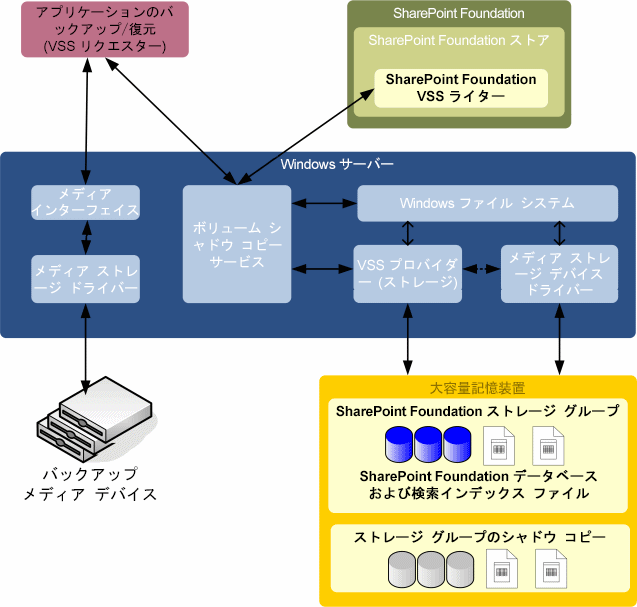

# SharePoint 2013 およびボリューム シャドウ コピー サービスの概要
 **概要:** ボリューム シャドウ コピー サービス (VSS) の Microsoft SharePoint 2013 インターフェイスについて説明します。
バックアップ ベンダーにとって、ボリューム シャドウ コピー サービス (VSS) を使用して、一元化された API を使用することにより、Microsoft サーバー ソリューションのバックアップが簡略化されます。Microsoft SharePoint Foundation には参照型 VSS ライター (以下、「SPF-VSS ライター」と呼ぶ) が含まれます。これは Windows VSS バックアップ フレームワークと統合され、SharePoint Foundation データをバックアップおよび復元するバックアップ アプリケーションが有効になります。これは、ファーム全体の致命的な上書きシナリオをサポートします (検索インデックスを含む)。復元では、データベースをフックし、サイト マッピングと同期します。
  
    
    

## システムのデザイン

次の図では、Microsoft Windows Server (およびボリューム シャドウ コピー サービス)、SharePoint Foundation (および Windows Server ボリューム シャドウ コピー サービスの SPF-VSS ライター)、およびサードパーティ (またはカスタム) のバックアップ/復元アプリケーション (リクエスターおよびプロバイダーを含む) というシステムの主なコンポーネントを示します。
  
    
    

  
    
    

  
    
    
VSS は Windows Server ファイル システムおよび大容量記憶装置ドライバーとサードバーティ (またはカスタム) のプロバイダーを介して通信します。ハードウェア プロバイダーはシャドウ コピーが作成される場所を決定する必要があります。VSS はハードウェア固有のシャドウ コピーを抽象化するため、バックアップ/復元アプリケーションはハードウェアの実装方法に関係なく一定の方法でシャドウ コピーにアクセスできます。 
  
    
    
SharePoint Foundation ストアは SharePoint Foundation のコンポーネントであり、Windows Server ファイル システムを介して SharePoint Foundation ストレージ グループにアクセスします。ファイル システム内では、SharePoint Foundation ストレージ グループごとに設定、コンテンツ、検索データベース、および設定データベースと検索インデックス ファイルに登録されたサードパーティ データベースが含まれます。また、SharePoint Foundation サービス アプリケーション フレームワークに構築された任意のサービスも含まれます。 
  
    
    
VSS をサポートするために、SharePoint Foundation には SPF-VSS ライターが用意されています。SPF-VSS ライターは SharePoint Foundation ストア (リクエスターの代わりに操作) と連携し、バックアップする前にストレージを凍結しマウントを解除してから、バックアップの完了後にストレージ グループの凍結を解除しマウントします。
  
    
    
復元中にバックアップ/復元アプリケーションは、SPF-VSS ライターが SharePoint Foundation ストア (リクエスターの代わりに操作) と連携するよう指示し、ストレージ グループのマウントを解除し、データベース ファイルを置換して、ストレージ グループをマウントします。
  
    
    

    
> **メモ**
> 復元に関する重要な情報については、「 [VSS リクエスターと SharePoint 2013](vss-requestors-and-sharepoint-2013.md)」の「復元」を参照してください。 
  
    
    

リクエスターは、VSS を使用し SharePoint Foundation のデータを適切にバックアップおよび復元するためにデザインされたサードパーティ (またはカスタム) アプリケーションです。リクエスターは VSS と通信して SharePoint Foundation に関する情報を取得し、シャドウ コピーの作成を指示し、バックアップ用のデータにアクセスします。 
  
    
    
またリクエスターは、復元時にも VSS と通信し、復元操作に対応するためにシステムの準備を整え、その後大容量記憶装置にデータを戻します。バックアップ/復元アプリケーションも Windows Server と連携し、バックアップ記憶領域メディア (テープ アーカイブ、記憶域ネットワーク、またはその他のバックアップ メディア) からのデータの読み取り、およびデータの書き込みを行います。 
  
    
    
SharePoint Foundation、VSS、およびバックアップ/復元アプリケーション間でバックアップおよび復元操作を正常に完了させるのに必要な情報は、SPF-VSS ライターのメタデータの一部として転送されます。
  
    
    
次に、バックアップまたは復元操作中のイベントの概要レベルのシーケンスを示します。
  
    
    

  
    
    

1. バックアップ プログラム (またはエージェント) がスケジュールされたジョブを実行します。 
    
  
2. バックアップ/復元アプリケーションの VSS リクエスターは、VSS にコマンドを送信し、選択した SharePoint Foundation ストレージ グループのシャドウ コピーを取得します。 
    
  
3. VSS は SPF-VSS ライターと通信し、スナップショット バックアップの準備をします。SharePoint Foundation はストレージ グループに対する管理アクションを禁止し、ボリュームの依存関係を確認し、データベースおよびトランザクション ログ ファイルに対するすべての書き込み操作を中断し、その間は読み取り専用アクセスを許可します。 
    
  
4. VSS は適切なストレージ プロバイダーと通信し、SharePoint Foundation ストレージ グループを含む記憶域ボリュームのシャドウ コピーを作成します。 
    
  
5. VSS は SharePoint Foundation を解放し、通常操作を再開します。
    
  
6. VSS リクエスターは、バックアップが成功した信号を送信する前に、バックアップ セットの整合性を検証します。SharePoint Foundation はデータベースが最後にバックアップされた日時を記録します。
    
  

## その他の技術情報

-  [SharePoint 2013 VSS ライター](sharepoint-2013-vss-writer.md)
    
  
-  [VSS リクエスターと SharePoint 2013](vss-requestors-and-sharepoint-2013.md)
    
  
-  [SharePoint 2013 で使用する VSS リクエスターを作成する方法](how-to-create-a-vss-requestor-for-use-with-sharepoint-2013.md)
    
  
-  [VSS リクエスターを使用して SharePoint 2013 のバックアップと復元を行う方法](how-to-back-up-and-restore-sharepoint-2013-using-a-vss-requestor.md)
    
  
-  [VSS を使用して SharePoint 2013 で検索サービス アプリケーションをバックアップおよび復元する方法](how-to-back-up-and-restore-a-search-service-application-in-sharepoint-2013-using.md)
    
  
-  [Starting and Configuring the WSS Writer Service](http://msdn.microsoft.com/library/c9243dd6-e61e-4783-9fef-48d0122f1c09.aspx)
    
  
-  [ボリューム シャドウ コピー サービス](http://msdn.microsoft.com/ja-jp/library/windows/desktop/bb968832%28v=vs.85%29.aspx)
    
  
-  [ボリューム シャドウ コピー サービスの技術情報](http://msdn.microsoft.com/ja-jp/library/windows/desktop/aa384648%28v=vs.85%29.aspx)
    
  

