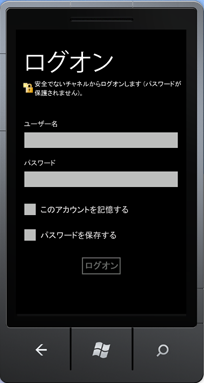

# SharePoint 2013 モバイル クライアント認証オブジェクト モデルの概要
Silverlight の SharePoint 2013 クライアント オブジェクト モデルの認証 API を使った開発の概要について説明します。
## Windows Phone の認証とクライアント コンテキスト
<a name="SP15Mobileclientauth_auth"> </a>

Windows Phone 7.5 で SharePoint ユーザーを認証するプロセスは、クライアント コンピューターの認証プロセスとは少し異なります。Windows Phone 7.5 のクライアント コードでは、Windows Phone 用の Microsoft Silverlight の SharePoint 2013 クライアント オブジェクト モデルに追加された **Authenticator** クラスまたは **ODataAuthenticator** クラスのオブジェクトを最初に作成します。その後このオブジェクトをユーザーの資格情報として使用します。
  
    
    

> **メモ**
> このセクションで説明されている API の詳細については、「 [SharePoint 2013 モバイル オブジェクト モデルの概要](overview-of-the-sharepoint-2013-mobile-object-model.md)」を参照してください。Silverlight の SharePoint クライアント オブジェクト モデルの詳細については、「 [マネージ クライアント オブジェクト モデル](http://msdn.microsoft.com/ja-jp/library/ee537247.aspx)」および「 [Silverlight オブジェクト モデルを使用する](http://msdn.microsoft.com/ja-jp/library/ee538971.aspx)」を参照してください。 
  
    
    


## Silverlight の SharePoint クライアント オブジェクト モデルでのユーザー認証
<a name="SP15Mobileclientauth_user"> </a>

認証されたクライアント コンテキスト オブジェクトの取得に必要な手順を次に示します。
  
    
    

1.  [ClientContext](http://msdn.microsoft.com/ja-jp/library/microsoft.sharepoint.client.clientcontext.aspx) オブジェクト取得します。
    
  
2. 新しい **Authenticator** オブジェクトを作成してプロパティを初期化します。
    
    > **メモ**
      > 1 つの **Authenticator** オブジェクトは 1 つの **ClientContext** オブジェクトでのみ使用できます。 **Authenticator** オブジェクトを、異なる URL を持つ複数の **ClientContext** オブジェクト間で共有することはできません。
3. **Authenticator** クラスは [ICredentials](http://msdn.microsoft.com/ja-jp/library/system.net.icredentials.aspx) インターフェイスを実装しているため、このオブジェクトを **ClientContext** オブジェクトの [Credentials](http://msdn.microsoft.com/ja-jp/library/microsoft.sharepoint.client.clientruntimecontext.credentials.aspx) プロパティに割り当てます。
    
  
その後残りのクライアント オブジェクト モデル コードを追加して **ExecuteQueryAsync** を呼び出すことができます。
  
    
    
次のコードで、これらの手順を示します。
  
    
    


```cs

ClientContext context = new ClientContext(ListUrl);

// Create an instance of Authenticator object.
Authenticator at = new Authenticator();

// Replace <username> and <password> with valid values. 
at.UserName = "<username>";
at.Password = "<password>";
at.AuthenticationMode = ClientAuthenticationMode.FormsAuthentication;

at.CookieCachingEnabled = true;

// Assign the instance of Authenticator object to the ClientContext.Credential property.
// ClientContext is the object that is central to the client object model for making calls to the server running SharePoint 
// for fetching and updating data.
context.Credentials = at;

ListItemCollection items = context.Web.Lists.GetByTitle(ListName).GetItems(CamlQuery.CreateAllItemsQuery());

// Load the query and execute the request to fetch data.
context.Load(items);
context.ExecuteQueryAsync(
    (object obj, ClientRequestSucceededEventArgs args) =>
    {
// Success logic
    },

    (object obj, ClientRequestFailedEventArgs args) =>
    {
// Failure logic
    });


```

必要に応じて、Unified Access Gateway (UAG) サーバーを **Authenticator.UagServerUrl** プロパティで指定できます。
  
    
    
SharePoint URL が基本認証またはフォームベース認証をサポートしている場合、 **ExecuteQueryAsync** 呼び出しでは図 1 に示すようにログオン情報を求める画面がユーザーに表示されます。サポートしていない場合は呼び出しは失敗します。認証エラーを避けるには SharePoint サイトで基本認証またはフォームベース認証の承認を有効にします。
  
    
    

**図 1. SharePoint クライアント認証**

  
    
    

  
    
    

  
    
    
図 1 に示すように、ユーザーはユーザー名とパスワードを入力して [ **ログオン**] を選択します。また、[ **このアカウントを記憶する**] をオンにしてユーザー名を記憶したり、[ **パスワードを保存する**] をオンにしてパスワードを記憶したりできます。ユーザー名とパスワードを記憶した後で、次にアプリケーションを起動したときにはユーザーは資格情報を入力する必要はありません。その後 **ExecuteQueryAsync** がログオン資格情報を使用して SharePoint を実行しているサーバーに Web 要求を行いデータを取得します。
  
    
    

## SharePoint OData オブジェクト モデルでのユーザー認証
<a name="SP15Mobileclientauth_OData"> </a>

認証された OData コンテキスト オブジェクトの取得に必要な手順を次に示します。
  
    
    

1. 新しい **ODataAuthenticator** オブジェクトを作成してプロパティを初期化します。
    
  
2. **AuthenticationCompleted** イベント用のハンドラーを登録します。
    
  
3. **ODataAuthenticator.Authenticate** メソッドを呼び出します。これにより **AuthenticationCompleted** イベントが発生します。
    
  
4. **OnAuthenticationCompleted** ハンドラー内で OData コンテキスト オブジェクトを取得します。
    
  
その後 **OnAuthenticationCompleted** ハンドラー内に残りの OData 呼び出しを追加できます。
  
    
    
次のコードで、これらの手順を示します。
  
    
    


```cs

ODataAuthenticator oat = new ODataAuthenticator();

// Replace <username> and <password> with valid values. 
oat.UserName = "<username>";
oat.Password = "<password>";

oat.AuthenticationMode = ClientAuthenticationMode.FormsAuthentication;


oat.AuthenticationCompleted += 
           new EventHandler<SendingRequestEventArgs>(OnAuthenticationCompleted);

// The Authenticate method will raise the AuthenticationCompleted event.
oat.Authenticate("My_service_URL");  

```

次のセクションで説明するように、コードにはさらに 2 つのイベント ハンドラーを実装する必要があります。
  
    
    

### OnAuthenticationCompleted ハンドラーと OnSendingRequest ハンドラーを実装して ClientContext オブジェクトを取得する

 **OnAuthenticationCompleted** ハンドラーの実装では、最初に認証中のエラーについて確認する必要があります。何かエラーがあった場合は、エラー メッセージをユーザーに表示して終了するなど、エラーを適切に処理します。
  
    
    
エラーがない場合は、ハンドラーで新しい **DataServiceContext** オブジェクトのインスタンスを作成し、 **SendingRequest** イベントのハンドラーを登録する必要があります。ここから先の OData 呼び出しのコードは、コンピューター上の場合と同様に **DataServiceContext** オブジェクトに対してプログラムします。
  
    
    
 **OnAuthenticationCompleted** ハンドラーの実装例を次に示します。
  
    
    


```cs

void OnAuthenticationCompleted(object sender, AuthenticationCompletedEventArgs e)
{
    if (e.Error != null)
    {
        MessageBox.Show(error);
        return;
    }
    ODataAuthenticator oat = sender as ODataAuthenticator;

    // Construct an OData context object.
    contextObj = new DataServiceContext(oat.ResolvedUrl);

    // Register the SendingRequest event handler.
    contextObj.SendingRequest += 
        new EventHandler<SendingRequestEventArgs>(OnSendingRequest);  
    
    // Your data retrieval logic goes here. 
    // For example, if there is a GetData method: 
    // contextObj.GetData();   
}


```

 **OnSendingRequest** ハンドラーで必要な処理は、 **Request** オブジェクトの Cookie コンテナーを、 **ODataAuthenticator** オブジェクトの Cookie コンテナーに設定することだけです。次に例を示します。
  
    
    


```cs

void OnSendingRequest(object sender, SendingRequestEventArgs e)
{ 
    ODataAuthenticator oat = sender as ODataAuthenticator;
    ((HttpWebRequest)e.Request).CookieContainer = oat.CookieContainer;
}

```


## 高度な利用
<a name="SP15Mobileclientauth_advance"> </a>


1. ハードコードされたユーザー名/パスワードで **Authenticator** オブジェクトを作成するオプションを選択できます。アプリのユーザーにはユーザー名とパスワードの入力画面が表示されず、ハードコードされた資格情報がユーザー認証に使用されます。
    
     `public Authenticator(string userName, string password)`
    
     `public Authenticator(string userName, string password, string domain)`
    
    このコンストラクターは、カスタム ログオン ページの作成にも使用できます。分離コード ファイルから資格情報を渡すことによりカスタム ログオン ページを作成できます。
    


  ```cs
  
Authenticator at = new Authenticator();
at.AuthenticationMode = ClientAuthenticationMode.MicrosoftOnline;                          

  ```

2. 認証の種類は適切に設定できます。既定では基本認証が使用されます。
    
  

### SharePoint Online に対する認証

SharePoint Online URL に対して認証するには、 **Authenticator** オブジェクトの **AuthenticationMode** プロパティを **MicrosoftOnline** モードに設定します。その他の手順は社内設置型の SharePoint URL の手順と同じです。
  
    
    

> **メモ**
> SharePoint Online ではユーザー名とパスワードをハードコーディングできません。ユーザーはログオン資格情報の入力を求められます。 
  
    
    


#### フェデレーション認証

 **FederationAuthURI** プロパティは、 **ADFS** 認証スキームのクライアント設定を渡すために使用されます。この設定では、 **ADFS** が複数の認証ハンドラーを使用するように構成されています。 **FederationAuthURI** には、SharePoint Online 認証をフェデレーションで使用する場合に、認証要求に必要な認証の種類を指定します。このパラメーターは、認証ハンドラーが構成されている順序で、定められた優先度を上書きできます。認証ハンドラーの詳細については、「 [認証ハンドラーの概要](http://msdn.microsoft.com/ja-jp/library/ee895365.aspx)」を参照してください。
  
    
    

```cs

 Authenticator auth = new Authenticator("domain\\\\name", "xyz"); 
 auth.FederationPassiveAuthUri = "urn:oasis:names:tc:SAML:2.0:ac:classes:Password"; 
//Replace <SiteUrl> with valid value 
ClientContext ctx = new ClientContext("SiteUrl"); 
               ctx.Credentials = auth; 
               ctx.ExecuteQueryAsync( 
 (object sender, ClientRequestSucceededEventArgs args) => 
   { 
    /* successful callback code */ 
   }, 
 (object sender, ClientRequestFailedEventArgs args) => 
   { 
   /* failure callback code */ 
  });

```

 **ADFS** は、Microsoft SharePoint Online で使用する場合のみ有効なオプションのプロパティです。 **ADFS** 認証は、他の認証スキームと併用すると有効になりません。Microsoft SharePoint Online で、 **ADFS** が設定されていないと、既定のスキーム、すなわちサーバー設定が使用されます。
  
    
    

## Cookie のキャッシュ
<a name="SP15Mobileclientauth_cookie"> </a>

 **Authenticator** クラスには、Cookie または資格情報またはその両方のキャッシュの有効化と管理に使用できるメンバーがあります。 **Authenticator** クラスのこれらのメンバーの詳細と使用方法については、「 [SharePoint 2013 モバイル オブジェクト モデルの概要](overview-of-the-sharepoint-2013-mobile-object-model.md)」を参照してください。
  
    
    

## その他の技術情報
<a name="SP15Mobileclientauth_addlresources"> </a>


-  [SharePoint 2013 にアクセスする Windows Phone アプリの作成](build-windows-phone-apps-that-access-sharepoint-2013.md)
    
  
-  [SharePoint 2013 モバイル オブジェクト モデルの概要](overview-of-the-sharepoint-2013-mobile-object-model.md)
    
  

