# SharePoint 2013 ページ モデルの概要
SharePoint 2013用に再設計された、変更されたページ モデル (マスター ページおよびページ レイアウトを含む) について確認します。
## ページ モデルの概要

SharePoint サイトの設計やブランド設定を行う前に、SharePoint サイトのパーツについてと、SharePoint ページが結合される方法について基本を理解しておく必要があります。この記事では、サイトのブランド設定方法を計画するにあたって考慮すべき要素の概要を視覚的に示します。この記事は、具体的には SharePoint 2013 の発行サイトに適用されます。
  
    
    

## マスター ページ、ページ レイアウト、およびページ

SharePoint は、テンプレートを使用して、サイトに表示されるページを定義およびレンダリングします。SharePoint ページは、主に次の 3 つの要素から構成されています。
  
    
    

- マスター ページは、サイトのすべてのページの共有フレーミング要素 (クロム) を定義します。
    
  
- ページ レイアウトは、特定のクラスのページのレイアウトを定義します。
    
  
- ページは、ページ フィールドにコンテンツを追加する作成者によってページ レイアウトから作成されます。
    
  

**図 1. マスター ページ、ページ レイアウト、およびページ**

  
    
    

  
    
    
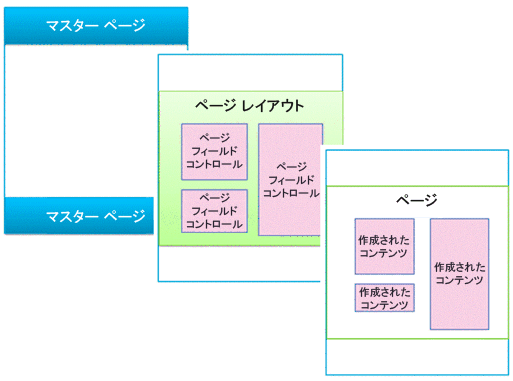
  
    
    

### マスター ページ

マスター ページはサイトのクロム (共有フレーミング要素) を定義します。このような要素には、ヘッダーとフッター、トップ ナビゲーション、ブレッドクラム、検索ボックス、サイト ロゴ、その他のブランド設定要素などがあります。閲覧者がサイト内を移動しても、マスター ページは変化しません。
  
    
    

**図 2. マスター ページ**

  
    
    

  
    
    
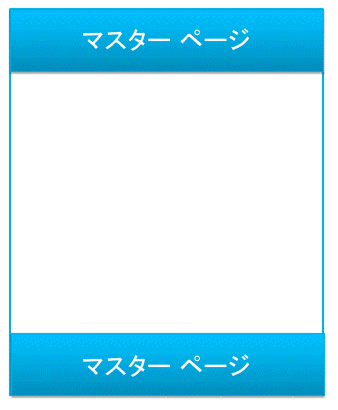
  
    
    
また、マスター ページはコンテンツ プレースホルダーという領域を定義します。コンテンツ プレースホルダーは、ページ レイアウトの一致する領域のコンテンツによって埋められます。一般的に、マスター ページの本文には 1 つのコンテンツ プレースホルダー ( **PlaceHolderMain**。自動的に作成されます) が含まれ、ページ レイアウトのすべてのコンテンツがこの 1 つのコンテンツ プレースホルダーの内部に表示されます ( **PlaceHolderMain**コンテンツ プレースホルダーは図 3 では赤いアウトラインで囲まれています)。
  
    
    

**図 3. アウトラインで囲まれたページ レイアウトを含むマスター ページ**

  
    
    

  
    
    
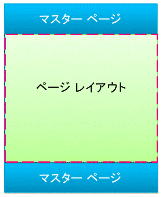
  
    
    
デザイン マネージャーでマスター ページをプレビューすると、次のメッセージが表示されます。この **
** は、メイン コンテンツ プレースホルダーの内部に置かれています。つまり、マスター ページはページのクロムを定義し、ページ レイアウトはメイン コンテンツ プレースホルダーに含まれる本文を定義します。
  
    
    

**図 4. マスター ページのプレビュー メッセージ**

  
    
    

  
    
    
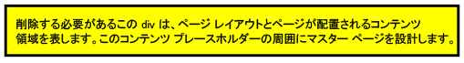
  
    
    

  
    
    

  
    
    

### ページ レイアウト

ページ レイアウトは、記事ページや製品の詳細ページなど、サイト内の特定の種類のページのテンプレートです。その名前が示すとおり、ページ レイアウトとは、ページの本文のレイアウトや構造を定義するものです。
  
    
    

**図 5. ページ レイアウト**

  
    
    

  
    
    
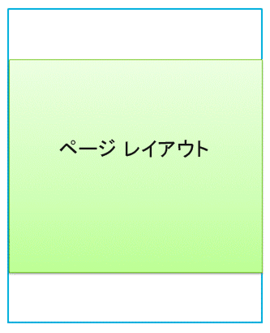
  
    
    
ページ レイアウトは、マスター ページのコンテンツ プレースホルダー (図 6 の赤いアウトラインで囲まれた部分) にマッピングされた領域またはコンテンツ領域を定義します。一般的にページ レイアウトは、マスター ページで自動的に作成される単一のコンテンツ プレースホルダーにマッピングされた単一のコンテンツ領域を定義します。
  
    
    

**図 6. コンテンツ領域とコンテンツ プレースホルダー**

  
    
    

  
    
    
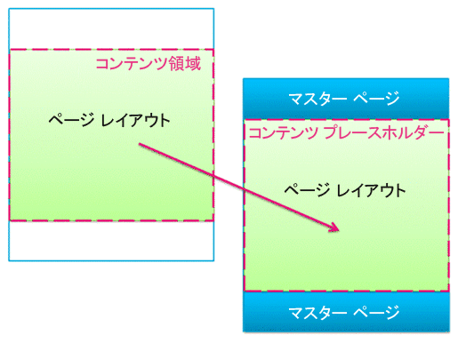
  
    
    

  
    
    

  
    
    

### ページ フィールド コントロール

ページ レイアウトの第一の目的は、ページ フィールドを整列させることです。ページ レイアウトの設計時には、ページ フィールド コントロールという要素の挿入、配置、スタイル定義を行います。これらのコントロールには最終的に、作成者がそのページ レイアウトに基づいてページを作成したときにコンテンツが含まれます。ページ フィールドに加えて、ページ レイアウトにも Web パーツ領域を追加でき、作成者はこの領域のコンテンツに Web パーツを追加できます (マスター ページに Web パーツ領域を含めることはできません)。
  
    
    
ページ フィールド コントロールを使用すると、コンテンツで使用されるスタイルを定義できます。作成者はページにコンテンツを追加できますが、設計者はこれらのコントロールに適用される CSS を通じて、そのコンテンツのレンダリング方式を最終的に制御します。
  
    
    

**図 7. ページ フィールド コントロールを含むページ レイアウト**

  
    
    

  
    
    
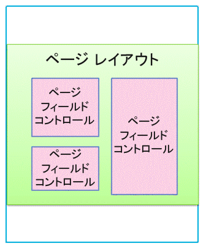
  
    
    
すべてのページ レイアウトは、サイトのページ ライブラリ内のコンテンツ タイプと関連付けられています。コンテンツ タイプは、列およびデータ タイプのスキーマです。どのページ レイアウトでも、そのレイアウトで使用可能なページ フィールドが、そのページ レイアウトのコンテンツ タイプで定義されている列に直接対応しています。
  
    
    

### マスター ページとページ レイアウトの関係

マスター ページとページ レイアウトが組み合わされてコンテンツ ページが作成されます。
  
    
    

**図 8. ページ レイアウトを含むマスター ページ**

  
    
    

  
    
    
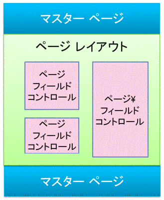
  
    
    
マスター ページはサイト内のすべてのページのクロムを定義するため、多数のページ レイアウト (およびそれらのページ レイアウトから作成された多数のページ) が 1 つのマスター ページに関連付けられている場合がよくあります。
  
    
    

**図 9. 3 つのページ レイアウトに関連付けられた 1 つのマスター ページ**

  
    
    

  
    
    
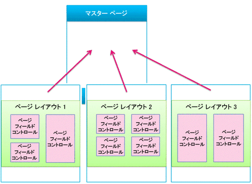
  
    
    
ただし、サイトでは複数のマスター ページが使用される可能性があります。たとえば、既定のマスター ページ以外に、スマート フォンやタブレットなどの特定のデバイスを対象とする 1 つまたは複数のマスター ページを使用できます。この場合、1 つのページ レイアウトを多数のマスター ページで使用できます (デバイス チャネルに関するセクションを参照)。
  
    
    
SharePoint サイトごとに、各チャネルにつき 1 つのマスター ページを使用できます。
  
    
    

### ページ

作成者はページを作成してページ フィールドにコンテンツを追加でき、任意の Web パーツ領域またはリッチ テキスト エディターに Web パーツを追加できます。ページは、コンテンツ作成者がページ フィールド外を変更できないように構成されています。
  
    
    

**図 10. 作成されたコンテンツを含むページ**

  
    
    

  
    
    
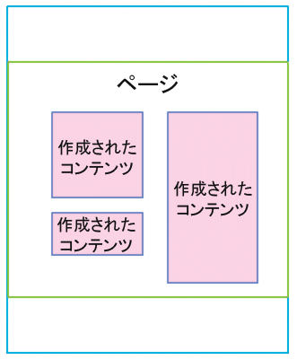
  
    
    
レンダリングされたページは、サイトの閲覧者に表示されるページです。ブラウザーからあるページが要求されると、マスター ページはページ レイアウトと結合されてコンテンツ ページが作成され、そのページのコンテンツはページ ライブラリの該当ページのページ フィールドに結合されます。
  
    
    

**図 11. ブラウザーでレンダリングされたページ**

  
    
    

  
    
    
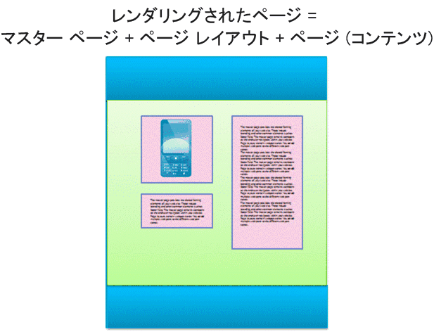
  
    
    

**図 12. マスター ページ、ページ レイアウト、およびページ**

  
    
    

  
    
    
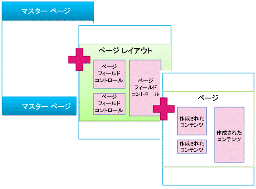
  
    
    

  
    
    

  
    
    

## 検索型 Web パーツおよび表示テンプレート

前のセクションでは、マスター ページ、ページ レイアウト (ページ フィールドを含む)、およびページの観点から SharePoint ページ モデルを説明しました。これらの要素は、作成者が定期的に新しいコンテンツを作成および発行する発行サイトにおいて最も一般的なものです。しかし、サイトでそのコンテンツを公開する段階になると、さらに 2、3 の要素が関係するようになります。外部カタログに接続しているか、特定の検索結果のセットを表示したいだけかにかかわらず、検索型 Web パーツを使用して、目的を達成することができます。
  
    
    
検索型ページの場合は、SharePoint ページに次の主要な要素が含まれます。
  
    
    

- マスター ページ
    
  
- ページ レイアウト:
    
  - 通常のページ レイアウト - この記事で前述したように、特定のコンテンツ タイプ用に作成されます
    
  
  - カテゴリおよびアイテム詳細ページ レイアウト - カタログのクロスサイト発行によって作成されます
    
  
- ページ
    
  
- コンテンツ検索 Web パーツなどの検索型 Web パーツ
    
  
- 表示テンプレート - これらのテンプレートは、管理プロパティの中から検索型 Web パーツの検索結果に表示されるものを制御して、それらの検索結果のスタイル定義および動作を制御します
    
  - コントロール表示テンプレート - 検索結果のレイアウトと、ページング、並べ替え、その他のリンクなど、すべての結果に共通の全要素を制御します
    
  
  - アイテム表示テンプレート - 検索結果ごとに、それぞれの結果の表示方法と繰り返し方法を制御します
    
  

**図 13. Web パーツを含むマスター ページ、ページ レイアウト、およびページ**

  
    
    

  
    
    
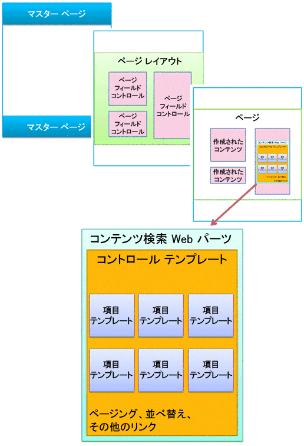
  
    
    

### 検索型 Web パーツ

検索型 Web パーツを使用すると、検索インデックスに格納された情報を動的に表現できます。コンテンツ検索 Web パーツのデータのプレゼンテーションは、マスター ページやページ レイアウトと共にマスター ページ ギャラリーに置かれている表示テンプレートによって制御されます。
  
    
    
SharePoint Server 2013 には、リストやスライドショーのようなすぐに使用できる、コンテンツ検索 Web パーツ用の表示テンプレートがいつくか含まれます。ブラウザーでコンテンツ検索 Web パーツを設定する場合は、使用する表示テンプレートを選択します。
  
    
    

**図 14. コンテンツ検索 Web パーツのツール ウィンドウ**

  
    
    

  
    
    

  
    
    
コンテンツ検索 Web パーツでは、コントロールとアイテムの 2 種類の表示テンプレートを使用します。サイトの設計またはブランド設定の一環として、定義したレイアウト、スタイル、および動作を使用するユーザー設定の表示テンプレートを作成できます。
  
    
    

**図 15. コンテンツ検索 Web パーツの 2 つの表**

  
    
    

  
    
    
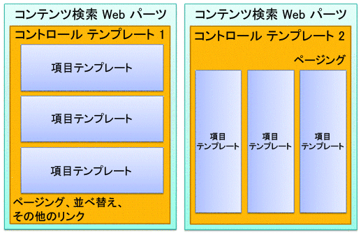
  
    
    

  
    
    

  
    
    

### コントロール表示テンプレート

コントロール テンプレートは、全体の構造と、検索結果を表現する方法 (ページングを含むリスト、スライドショーなど) のレイアウトを制御します。それぞれのコンテンツ検索 Web パーツには 1 つのコントロール テンプレートが含まれます。
  
    
    
また、コントロール テンプレートには、ページング、並べ替え、表示オプション、区切り文字など、すべての検索結果に共通の機能も含まれます。
  
    
    

**図 16. Web パーツおよび Web ページでアウトラインで囲まれているコントロール テンプレート**

  
    
    

  
    
    
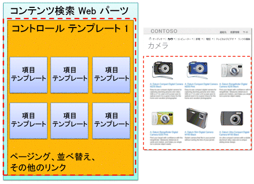
  
    
    

  
    
    

  
    
    

### アイテム表示テンプレート

アイテム テンプレートは、セットのそれぞれの結果の表示方法を制御し、それぞれの結果ごとに繰り返されます。アイテム テンプレートは、イメージ、テキストを含むイメージ、ビデオ、およびその他のコンテンツを表示できます。
  
    
    
また、アイテム表示テンプレートは、管理プロパティおよび値の中からコンテンツ検索 Web パーツによって表示されるものを決定します。この例では、アイテム テンプレートは、小さいサイズのイメージ、ハイパーリンクの製品名、および短い説明文の 3 つの管理プロパティを表示しています。
  
    
    

**図 17. Web パーツおよび Web ページでアウトラインで囲まれているアイテム テンプレート**

  
    
    

  
    
    
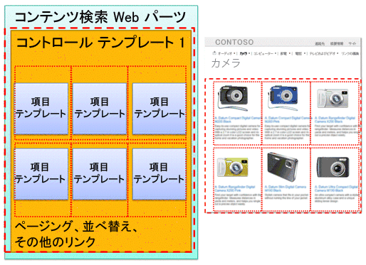
  
    
    

  
    
    

  
    
    

## デバイス チャネルおよびデバイス チャネル パネル

SharePoint 2013では、各種のデバイス向けのさまざまな設計を使用することにより、デバイス チャネルを使って単一の公開サイトを複数の方法でレンダリングできます。単一のサイトを作成して、そのコンテンツを一度に作成します。次に、そのサイトとコンテンツを別のマスター ページとスタイル シートにマッピングし、特定のデバイスやデバイス グループで使えるようにできます。
  
    
    
複数のデバイスを対象として設計する場合は、次の要素を考慮してください。
  
    
    

- デバイス チャネル:
    
  - チャネルごとに異なるマスター ページと CSS を使用することによって、特定のデバイス (Windows Phone など) またはデバイス グループ (すべてのスマート フォン) に対して同一のページ コンテンツを複数の方法で表示できます。
    
  
- ページ レイアウト:
    
  - コンテンツが変化しない場合、すべてのデバイス チャネルに対して同じページ レイアウトを使用できます。ただし、チャネルごとに異なるマスター ページの CSS に基づいて、異なるスタイルを定義できます。
    
  
  - 特定のデバイスに対してのみコンテンツを追加する場合は、デバイス チャネル パネルを使用します。
    
  
- ページ
    
  

### デバイス チャネル:

デバイス チャネルの作成時には、チャネルの対象とするデバイスのユーザー エージェント部分文字列を指定します。こうすることにより、チャネルごとに取得されるデバイス (またはブラウザー) を細かく調整できます。次に、マスター ページをそのチャネルに割り当てます。各マスター ページは、そのデバイス タイプに最適なレイアウトおよびスタイルを備えた独自のスタイル シートにリンクします。
  
    
    

**図 18. マスター ページの異なる 2 つのデバイス チャネル**

  
    
    

  
    
    

  
    
    
CSS だけを使用して、大きな変化を付けることもできます。2 つの異なるチャネル (デスクトップと電話など) のマスター ページが、リンク先のスタイル シート以外は同じ場合、CSS ファイルでは、同一のページ要素に対して異なるスタイルを使用するだけで設定できます。
  
    
    

### マスター ページとページ レイアウトの関係

マスター ページの場合とは異なり、異なるデバイス チャネルに対して異なるページ レイアウトを指定しません。すべてのページ レイアウトは作成されたすべてのチャネルで動作します。したがって、1 つのページ レイアウトを多数のデバイス チャネルおよびマスター ページに適用できます。
  
    
    
これは、デバイス チャネルの主要なメリットの 1 つです。設計 (マスター ページおよび CSS) が変更されても、コンテンツ (ページ レイアウトおよびページ) は変化しません。ただし、デバイス チャネル パネルを使用すると、ページ レイアウトのコンテンツのうち異なるチャネル全体で表示するコンテンツを変更できます (次のセクションを参照)。
  
    
    

**図 19. 2 つのマスター ページで動作する 1 つのページ レイアウト**

  
    
    

  
    
    
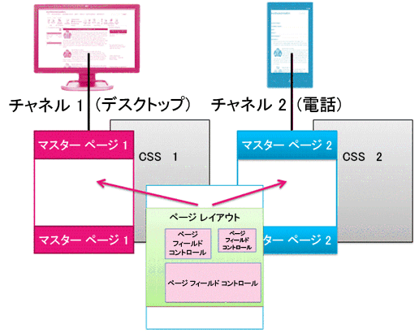
  
    
    

  
    
    

  
    
    

### デバイス チャネル パネル

デバイス チャネル パネルは、マスター ページ、ページ レイアウト、または表示テンプレートに追加できるコントロールで、各チャネルでレンダリングされるコンテンツを制御します。チャネル パネルは、基本的には 1 つまたは複数のチャネルを指定するコンテナーです。ページがレンダリングされるときにそれらのチャネルのうち 1 つ以上がアクティブになっている場合、チャネル パネルのすべてのコンテンツもレンダリングされます。チャネル パネルには CSS ファイルまたは .js ファイルへのリンクなど任意の種類のコンテンツを含めることができます。これは特定のチャネルの特定のコンテンツを含める場合に簡単な方法です。
  
    
    
チャネル パネルの使用に関する最も一般的なシナリオは、特定のチャネルのページ レイアウトの一部を選択的に含めることです。たとえば、長いあいさつ文と短いあいさつ文の別々のテキスト フィールドを含むページ レイアウトを使用するとします。チャネル パネルの内部にページ フィールドを配置することによって、短いあいさつ文は電話に、長いあいさつ文はデスクトップにだけ表示できます。デバイス チャネル パネルのコンテンツは、そのチャネル パネルに含まれないチャネルには表示されません。また、そのデバイス チャネル パネル内部のコンテンツはまったくレンダリングされません。そのため、データがネットワーク上でやり取りされることはありません。
  
    
    

**図 20. チャネル パネルを含むページ レイアウト**

  
    
    

  
    
    
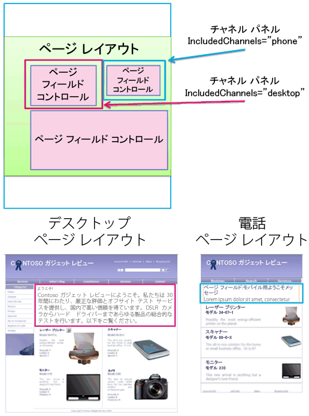
  
    
    
チャネル パネルをマスター ページで使用することもできます。たとえば、2 つの異なるデバイス (または 2 つの異なるブラウザー) への対応が可能なマスター ページをほとんど変更せずに使用している場合、チャネル パネルを使用して、それぞれのデバイスに特定のマスター ページのコンテンツを保持することができます。
  
    
    
または、コンテンツ検索 Web パーツのアイテム表示テンプレートの内部でチャネル パネルを使用して、電話は除外してデスクトップのみのカタログからそのアイテムの追加の管理プロパティを表示することができます。
  
    
    

**図 21. チャネル パネルを含むページ レイアウトおよびアイテム テンプレート**

  
    
    

  
    
    
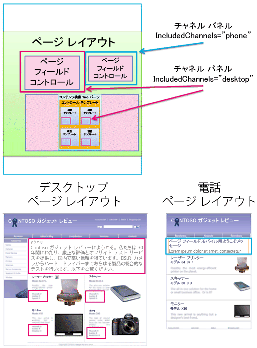
  
    
    

  
    
    

  
    
    

## その他の技術情報

-  [SharePoint 2013 のデザイン マネージャーの概要](overview-of-design-manager-in-sharepoint-2013.md)
    
  
-  [SharePoint サイトの構築](build-sites-for-sharepoint.md)
    
  
-  [SharePoint 2013 デザイン マネージャー表示テンプレート](sharepoint-2013-design-manager-display-templates.md)
    
  
-  [SharePoint 2013 デザイン マネージャーのデバイス チャネル](sharepoint-2013-design-manager-device-channels.md)
    
  

