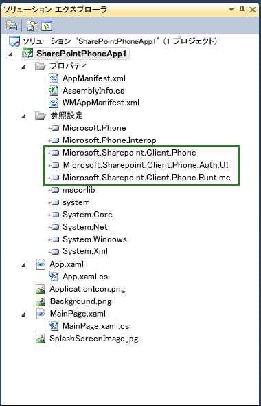
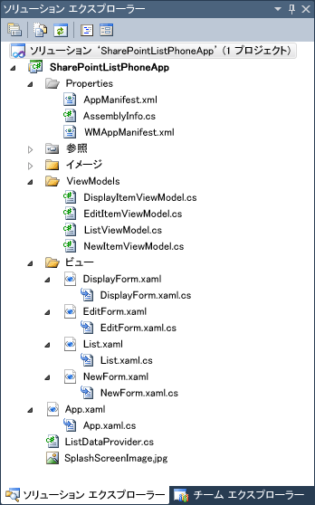

# Visual Studio の Windows Phone SharePoint 2013 アプリケーション テンプレートの概要
モバイル アプリケーション開発向け Windows Phone SharePoint Software Development Kit によってインストールされる Visual Studio テンプレートについて確認します。
## Windows Phone SharePoint Software Development Kit によってインストールされるテンプレート
<a name="BKMK_TemplatesInstalled"> </a>

開発環境を設定し、Windows Phone SharePoint Software Development Kit (SDK) のインストールが完了すると、次の 2 つの Silverlight for Windows Phone テンプレートが追加され、プロジェクトで使用できるようになります。
  
    
    

- Windows Phone Empty SharePoint Application テンプレート
    
  
- Windows Phone SharePoint List Application テンプレート
    
  
現時点では、これらのテンプレートは C# プロジェクトでの使用を意図して設計されており、Visual Basic プロジェクト向けには提供されていません。ただし、テンプレートは Windows Phone 8 用に Visual Studio 2012 と Visual Studio Express 2012、および Windows Phone 7 用に Visual Studio 2010 と Visual Studio 2010 で使用できるよう提供されています。
  
    
    

> **メモ**
> Windows Phone の SharePoint テンプレートは、Expression Blend の [ **新しいプロジェクト**] には表示されません。ただし、Visual Studio のショートカット メニューで [ **Expression Blend で開く**] を選択すると、Expression Blend でプロジェクトを編集できます。 
  
    
    

いずれかのテンプレートに基づいてプロジェクトを作成する場合、ターゲットとなる Windows Phone プラットフォームを選択するオプションはありません。Visual Studio Express 2012 から作成されたプロジェクトの場合、これらのテンプレートを使用すると SharePoint 2013 が Windows Phone 8 アプリケーションをターゲットにします。これらのテンプレートを使用して Visual Studio 2010 Express から作成したプロジェクトは、既定で Windows Phone OS バージョン 7.1 をターゲットにします。つまり、WMAppManifest.xml ファイルの **Deployment** 要素の **AppPlatformVersion** 属性は、値が 7.1 となります。
  
    
    


```XML

<Deployment xmlns="http://schemas.microsoft.com/windowsphone/2009/deployment" AppPlatformVersion="7.1">
```


> **メモ**
> WMAppManifest.xml ファイルの設定の詳細については、「 [Windows Phone のアプリケーション マニフェスト ファイル](http://msdn.microsoft.com/ja-jp/library/ff769509%28VS.92%29.aspx)」を参照してください。 
  
    
    


## Windows Phone Empty SharePoint Application テンプレートに基づいたプロジェクトの開始
<a name="BKMK_EmptySPAppTemplate"> </a>

Windows Phone Empty SharePoint Application テンプレートに基づいて Visual Studio プロジェクトを作成する場合、開始プロジェクトは、基本の Windows Phone Application テンプレート (Windows Phone SDK 7.1 によってインストール) を使用して作成されるプロジェクトとほぼ同じですが、Windows Phone SharePoint SDK によってインストールされる DLL (図 1 に示すとおり、Microsoft.SharePoint.Client.Phone.dll、Microsoft.SharePoint.Client.Phone.Auth.UI、および Microsoft.SharePoint.Client.Phone.Runtime.dll) への参照と、その他いくつかの再構成が加わります。
  
    
    

> **メモ**
> Windows Phone 8 用の同じテンプレートが Visual Studio Express 2012 で使用可能です。 
  
    
    


**図 1: Windows Phone Empty SharePoint Application プロジェクトのファイル**

  
    
    

  
    
    

  
    
    
Windows Phone Empty SharePoint Application テンプレートに基づいて作成したプロジェクトのファイルは、Silverlight Windows Phone アプリケーションの標準ファイルです。MainPage.xaml ファイルには、アプリケーションのユーザー インターフェイス (UI) を構成する XAML 宣言が含まれています。分離コード ファイルの MainPage.xaml.cs はプロジェクト内の他の分離コード ファイルと同じく、部分クラスのメカニズムを使用して MainPage.xaml ファイルに関連付けられます (「 [分離コードと部分クラス](http://msdn.microsoft.com/ja-jp/library/cc221357%28VS.96%29.aspx)」を参照)。MainPage.xaml.cs ファイルには、UI での操作やイベントをサポートするロジックの実装に必要な手順コードが含まれています。App.xaml ファイルは Windows アプリケーション全体を表すファイルです。関連付けられている分離コード ファイルの App.xaml.cs には、アプリケーションのライフサイクル イベントを処理する手順コードが含まれています。
  
    
    

## Windows Phone SharePoint List Application テンプレートに基づいたプロジェクトの開始
<a name="BKMK_SPListAppTemplate"> </a>

Windows Phone SharePoint List Application テンプレートは Windows Phone Empty SharePoint Application テンプレートよりもはるかに高機能なテンプレートです。このテンプレートは、SharePoint 向けモバイル アプリケーション開発でのよくあるシナリオ (Windows Phone から、SharePoint リストに保存されたデータにアクセスし操作するなど) を扱う Windows Phone アプリケーションの作成を支援するために用意されたものです。このテンプレートに基づいて Visual Studio プロジェクトを作成する場合は、ウィザードによって必要な構成手順が案内され、SharePoint リスト データの操作が可能な、機能的な Windows Phone アプリケーションに必要なソリューション ファイルが生成されます。生成されたファイルを使用すると、ほとんど変更を加えることなくアプリケーションを作成し展開することができます。
  
    
    

> **メモ**
> Windows Phone 8 用の同じテンプレートが Visual Studio Express 2012 で使用可能です。 
  
    
    


### Windows Phone SharePoint List Application プロジェクト内のソリューション ファイルについて

図 2 に、Windows Phone SharePoint List Application テンプレートを使用して Visual Studio プロジェクト向けに生成されたファイルを示します (System.Runtime.Serialization.dll、Microsoft.Phone.Controls.dll など (図 2 には非表示) 他のアセンブリへの参照が、Windows Phone Empty SharePoint Application テンプレートによって実装される参照に追加されます。これら追加のアセンブリによって、SharePoint リスト データの管理と、そのデータ表示に対するビジュアル コントロールがサポートされます)。
  
    
    

**図 2: Windows Phone SharePoint List Application プロジェクトのファイル**

  
    
    

  
    
    

  
    
    
表 1 はプロジェクト ファイルの説明です。
  
    
    

**表 1: Windows Phone SharePoint List Application のプロジェクト ファイル**


|**ファイル**|**説明**|
|:-----|:-----|
|App.xaml  <br/> |Windows Phone アプリケーション全体を表します。 **Application_Deactivated** や **Application_Closing** などのアプリケーションのライフサイクル イベントのように、アプリケーションに関連する要素の宣言が含まれます (アプリケーション内の個々のページに関連するものではありません)。 <br/> |
|App.xaml.cs  <br/> |App.xaml に関連付けられている分離コード ファイル (プロジェクト内の他の分離コード ファイルの場合と同じく、部分クラスのメカニズムを使用)。 **Application_Deactivated** や **Application_Closing** などのライフサイクル イベントでの操作の処理に必要な手順コードが含まれます。オフライン (ローカル) のデータ ストレージを管理するには、このファイルにコードを記述します。 <br/> |
|ListDataProvider.cs  <br/> |SharePoint Server 上のデータにアクセスするためのコードが含まれ、アプリケーションの各種のリスト ビューの基礎となるクエリ構文へのアクセスを実現します。  <br/> |
|List.xaml  <br/> |Phone アプリケーションの既定のビュー形式 (SharePoint の [すべてのアイテム] ビュー (または [すべてのタスク]、[すべての連絡先] など) に類似) 用に UI 要素が定義されます。List.xaml ファイルには、開発者が Windows Phone アプリケーションへの実装を選択したリスト ビューを表示するための **PivotItem** コントロールなど、アプリケーションのビジュアル要素のプライマリ コンテナーとなる **Pivot** コントロールが含まれます。 <br/> |
|List.xaml.cs  <br/> |List.xaml に関連付けられている分離コード ファイルです。[ **新規作成**]、[ **更新**] など、フォームのボタン用のメソッドおよびハンドラーの実装に必要なコードが含まれます。  <br/> |
|DisplayForm.xaml  <br/> |アプリケーションの [ **Display Item**] (アイテムの表示) フォーム (ページ) (SharePoint の [ **アイテムの表示**] フォームに類似) 用の UI 要素が定義されます。Windows Phone アプリケーションでは、Silverlight **Pivot** コントロールに含まれる **StackPanel** コントロールを使用して、縦に積み重ねてフィールドが表示されます。 <br/> |
|DisplayForm.xaml.cs  <br/> |DisplayForm.xaml に関連付けられている分離コード ファイルです。[ **編集**]、[ **削除**] など、フォームのボタン用のメソッドおよびハンドラーの実装に必要なコードが含まれます。  <br/> |
|EditForm.xaml  <br/> |Phone アプリケーションの [ **アイテムの編集**] フォーム (SharePoint の [ **アイテムの編集**] フォームに類似) 用の UI 要素が定義されます。[ **Display Item**] (アイテムの表示) フォームと同じく、 **StackPanel** コントロールでフィールドが表示されます。 <br/> |
|EditForm.xaml.cs  <br/> |EditForm.xaml に関連付けられている分離コード ファイルです。[ **送信**]、[ **キャンセル**] など、フォームのボタン用のメソッドおよびハンドラーの実装に必要なコードが含まれます。  <br/> |
|NewForm.xaml  <br/> |Phone アプリケーションの [ **新しいアイテム**] フォーム (SharePoint の [ **新しいアイテム**] フォームに類似) 用の UI 要素が定義されます。 **StackPanel** コントロールでフィールドが表示されます。 <br/> |
|NewForm.xaml.cs  <br/> |NewForm.xaml に関連付けられている分離コード ファイルです。[ **送信**]、[ **キャンセル**] など、フォームのボタン用のメソッドおよびハンドラーの実装に必要なコードが含まれます。  <br/> |
|DisplayItemViewModel.cs  <br/> |DisplayForm.xaml ファイルのデータ ソースとして機能します。  <br/> |
|EditItemViewModel.cs  <br/> |EditForm.xaml ファイルのデータ ソースとして機能します。このファイルには、リスト アイテムの編集時にユーザーにより入力されたデータを検証するコードを記述します。  <br/> |
|ListViewModel.cs  <br/> |List.xaml ファイルのデータ ソースとして機能します。  <br/> |
|NewItemViewModel.cs  <br/> |NewForm.xaml ファイルのデータ ソースとして機能します。このファイルには、新しいリスト アイテムの追加時にユーザーにより入力されたデータを検証するコードを記述します。  <br/> |
   
Windows Phone SharePoint List Application テンプレートを使用した Windows Phone アプリケーションの作成に関連する手順の詳細については、「 [[方法] Windows Phone 用の SharePoint 2013 リスト アプリを作成する](how-to-create-a-windows-phone-sharepoint-2013-list-app.md)」を参照してください。
  
    
    

## その他の技術情報
<a name="SP15winphoneover_addlresources"> </a>


-  [SharePoint 2013 にアクセスする Windows Phone アプリの作成](build-windows-phone-apps-that-access-sharepoint-2013.md)
    
  
-  [[方法]: SharePoint 用モバイル アプリの開発環境をセットアップする](how-to-set-up-an-environment-for-developing-mobile-apps-for-sharepoint.md)
    
  
-  [Windows Phone SDK 8.0](http://www.microsoft.com/ja-jp/download/details.aspx?id=35471)
    
  
-  [Microsoft SharePoint SDK for Windows Phone 8](http://www.microsoft.com/ja-jp/download/details.aspx?id=36818)
    
  
-  [Windows Phone SDK 7.1](http://www.microsoft.com/ja-jp/download/details.aspx?id=27570)
    
  
-  [Microsoft SharePoint SDK for Windows Phone 7.1](http://www.microsoft.com/ja-jp/download/details.aspx?id=30476)
    
  
-  [Windows Phone の開発](http://msdn.microsoft.com/ja-jp/library/ff402535%28VS.92%29.aspx)
    
  

