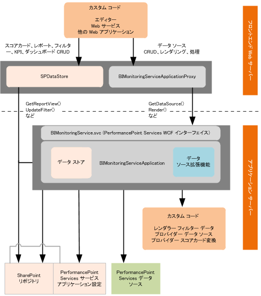

# SharePoint 2013 の PerformancePoint Services
SharePoint Server 2013で PerformancePoint サービス 向けにサポートされている開発シナリオと拡張機能アーキテクチャについて説明します。
PerformancePoint サービス は、SharePoint Server 2013のサービス アプリケーションです。これを使用して、ユーザーは、組織のパフォーマンスに対する先見性を提供するビジネス インテリジェンス (BI) ダッシュボードを作成できます。カスタムのレポート、フィルター、表形式のデータ ソース、スコアカード変換を作成し、本来の PerformancePoint サービス の機能を拡張できます。たとえば、医療業界向けに最適化されたカスタム レポートの表示を作成し、それを再利用可能な垂直的ソリューションに統合できます。
  
    
    

## SharePoint Server 2013におけるカスタムの PerformancePoint サービス レポート、フィルター、表形式のデータ ソース

PerformancePoint サービスのネイティブ オブジェクトである  [ReportView](https://msdn.microsoft.com/library/Microsoft.PerformancePoint.Scorecards.ReportView.aspx) 、 [Filter](https://msdn.microsoft.com/library/Microsoft.PerformancePoint.Scorecards.Filter.aspx) 、および表形式の [DataSource](https://msdn.microsoft.com/library/Microsoft.PerformancePoint.Scorecards.DataSource.aspx) は、そのプロパティにカスタム値を定義することで拡張できます。カスタムのレポート、フィルター、表形式のデータ ソースの拡張機能には、通常はレンダラー (またはプロバイダー)、エディター アプリケーション、拡張メタデータの 3 つのコンポーネントが含まれます
  
    
    

### PerformancePoint サービス の拡張機能向けのレンダラーとプロバイダー

レンダラーとプロバイダーのどちらを使用するかは、拡張するオブジェクトのタイプによって決まります。レポートとフィルターの拡張機能はレンダラーを使用し、フィルターとデータ ソースの拡張機能はプロバイダーを使用します。
  
    
    

- レポート拡張機能には、レポートのビジュアル化のためにレンダラーが必要です。 
    
  
- フィルター拡張機能には、選択コントロールのためにレンダラーが必要です。レンダラーはカスタムのレンダラーと、PerformancePoint サービス のネイティブ レンダラーのどちらでもかまいません。PerformancePoint サービス レンダラーを使用する場合は、レンダラーを拡張機能に登録するだけで済みます。カスタムのレンダラーを使用する場合は、拡張機能にそのレンダラーを含める必要があります。
    
  
- フィルター拡張機能には、基になるデータ ソースに接続するためのデータ プロバイダーが必要です。
    
  
- データ ソース拡張機能には、基になるデータ ソースに接続するためのプロバイダーが必要です。
    
  
レンダラーおよびプロバイダーの作成に関する詳細については、以下のトピックを参照してください。
  
    
    

-  [[方法] SharePoint 2013 の PerformancePoint Services 用のレポート レンダラーを作成する](how-to-create-report-renderers-for-performancepoint-services-in-sharepoint-2013.md)
    
  
-  [[方法] SharePoint 2013 の PerformancePoint Services 用にフィルター データ プロバイダーを作成する](how-to-create-filter-data-providers-for-performancepoint-services-in-sharepoint.md)
    
  
-  [[方法] SharePoint 2013 で PerformancePoint Services 用の表形式のデータ ソース プロバイダーを作成する](how-to-create-tabular-data-source-providers-for-performancepoint-services-in-sha.md)
    
  

### SharePoint Server 2013の PerformancePoint サービス 拡張機能向けのエディター アプリケーション

カスタム エディターを使用することで、ユーザーは、カスタム オブジェクトのプロパティを定義し、リポジトリ内のオブジェクトとやり取りし、カスタム レポートとフィルターのエンドポイントを初期化できるようになります。作成するエディターでは、ユーザーが表示および変更できるようにするプロパティを提供する必要があります。エディターは、PerformancePoint ダッシュボード デザイナー内のオブジェクトから、あるいは PerformancePoint コンテンツ リストまたは PerformancePoint データ接続ライブラリ内のアイテムから開くことができます。ダッシュボード デザイナーの作成環境に統合するには、エディターを URI (Uniform Resource Identifier) から開くことができるようにして、URI を PerformancePoint サービス の web.config ファイルでカスタム オブジェクト用に登録する必要があります。
  
    
    
エディターの作成の詳細については、以下のトピックを参照してください。
  
    
    

-  [[方法] SharePoint 2013 の PerformancePoint Services 用のレポート エディタを作成する](how-to-create-report-editors-for-performancepoint-services-in-sharepoint-2013.md)
    
  
-  [[方法] SharePoint 2013 の PerformancePoint Services 用のフィルター エディタを作成する](how-to-create-filter-editors-for-performancepoint-services-in-sharepoint-2013.md)
    
  
-  [[方法] SharePoint 2013 の PerformancePoint Services 用に表形式のデータ ソース エディタを作成する](how-to-create-tabular-data-source-editors-for-performancepoint-services-in-share.md)
    
  

> **メモ**
> PerformancePoint ダッシュボード デザイナーはカスタム オブジェクトの作成と削除ができるため、作成するエディターでオブジェクトの作成と削除のロジックを提供する必要はありません。 
  
    
    

### SharePoint Server 2013の PerformancePoint サービス 拡張機能向けのメタデータの構成

インストール プロセスの間に、PerformancePoint サービス web.config ファイルで拡張機能のメタデータを指定する必要があります。メタデータには、 **type**、 **subType**、 **RendererClass**、 **EditorURI**、 **Resources** の各属性が含まれます。
  
    
    
カスタム オブジェクトを作成するため、ダッシュボード デザイナーはオブジェクトのメタデータを PerformancePoint サービス の web.config ファイルから取得した後、ダッシュボード デザイナー リポジトリにオブジェクトをコンテンツ タイプとして作成します。カスタム オブジェクトを作成した後、ダッシュボード デザイナー はエディターへのリンクを表示します。
  
    
    
拡張機能のメタデータの詳細については、「 [[方法] PerformancePoint Services の拡張機能を手動で登録する](http://msdn.microsoft.com/library/3aa6d340-4b05-46b3-9648-2b6e18e04e09%28Office.15%29.aspx)」を参照してください。
  
    
    

## SharePoint Server 2013の PerformancePoint サービス スコアカード向けのカスタム変換

変換は、データ ソースをクエリする前、データ ソースをクエリした後、またはスコアカードを Web パーツに表示する前に、スコアカードの外観、内容、または機能を変更します。たとえば、PerformancePoint サービス では、スコアカード ビューをレンダリングする前に変換を使用して、名前付きセットの展開、重ね合わせの計算、集計など、複数の操作を実行します。この変更は実行時に適用され、変更によってスコアカード オブジェクトが変更されることはありません。
  
    
    
スコアカード変換の詳細については、「 [[方法] SharePoint 2013 の PerformancePoint Services 向けにスコアカード変換を作成する](how-to-create-scorecard-transforms-for-performancepoint-services-in-sharepoint-2.md)」を参照してください。
  
    
    

> **メモ**
> 変換によってスコアカードのデータ値が変更される場合、その変更は、スコアカードをデータ ソースとして使用する戦略マップ レポートに直接伝達されます。スコアカードへの変更は、KPI の詳細レポートにも影響する可能性があります。 
  
    
    

## SharePoint Server 2013の PerformancePoint サービス 向けの拡張機能アーキテクチャ

サポートされる拡張機能は、以下の図のように、フロントエンド Web サーバー上またはアプリケーション サーバー上の PerformancePoint サービス アプリケーション インスタンス内で動作します。
  
    
    

**図 1. PerformancePoint Services 拡張機能アーキテクチャ**

  
    
    

  
    
    

  
    
    

### SharePoint Server 2013 フロントエンド Web サーバー上で実行される PerformancePoint サービス の拡張機能

カスタム エディター (およびサポートされるその他のカスタム アプリケーション) は、PerformancePoint サービス アプリケーション インスタンス内のフロントエンド Web サーバー上で実行されます。通常は、エディターは .aspx ページとして展開され、 `%ProgramFiles%\\Common Files\\Microsoft Shared\\web server extensions\\15\\TEMPLATE\\LAYOUTS` のパスにインストールされます。エディターは、コンテンツを作成または処理するために、 [BIMonitoringServiceApplicationProxy](https://msdn.microsoft.com/library/Microsoft.PerformancePoint.Scorecards.BIMonitoringServiceApplicationProxy.aspx) オブジェクトまたは [SPDataStore](https://msdn.microsoft.com/library/Microsoft.PerformancePoint.Scorecards.Store.SPDataStore.aspx) オブジェクトを以下のように呼び出します。
  
    
    

- レポート オブジェクトとフィルター オブジェクトは、すべてのリポジトリ タスクに対して  [SPDataStore](https://msdn.microsoft.com/library/Microsoft.PerformancePoint.Scorecards.Store.SPDataStore.aspx) を使用します。
    
  
- データ ソース オブジェクトは  [BIMonitoringServiceApplicationProxy](https://msdn.microsoft.com/library/Microsoft.PerformancePoint.Scorecards.BIMonitoringServiceApplicationProxy.aspx) を使用して、 **Create** および **Update** タスクを実行し、これらのタスクが PerformancePoint サービス サービス アプリケーションのコンテキスト内で実行されるようにします。 **Read** (get) および **Delete** タスクは、 [BIMonitoringServiceApplicationProxy](https://msdn.microsoft.com/library/Microsoft.PerformancePoint.Scorecards.BIMonitoringServiceApplicationProxy.aspx) または [SPDataStore](https://msdn.microsoft.com/library/Microsoft.PerformancePoint.Scorecards.Store.SPDataStore.aspx) を使用して実行できます。(ただし、アプリケーション サーバー上で実行されるカスタム データ ソース アプリケーションは、 [SPDataStore](https://msdn.microsoft.com/library/Microsoft.PerformancePoint.Scorecards.Store.SPDataStore.aspx) を直接呼び出すことができます。)
    
  

### SharePoint Server 2013 アプリケーション サーバー上で実行される PerformancePoint サービス の拡張機能

カスタムのレンダラー、プロバイダー、スコアカード変換は、アプリケーション サーバー上で実行されます。アプリケーション サーバーは、PerformancePoint サービス インスタンスの中間層のビジネス ロジックを提供します。
  
    
    

## その他の技術情報

-  [PerformancePoint Services の基礎知識](http://msdn.microsoft.com/library/5d2c183b-95f8-4930-b6d0-f3ffe1ee166e%28Office.15%29.aspx)
    
  
-  [SharePoint Server 2010 の PerformancePoint Services のコード例](http://msdn.microsoft.com/library/97f0cbd4-03ef-44f8-9869-699df9d9c97f%28Office.15%29.aspx)
    
  
-  [PerformancePoint Services のトラブルシューティングとよく寄せられる質問 ](http://msdn.microsoft.com/library/a90156e2-0522-46a1-9fc9-b6c8d2fffad7%28Office.15%29.aspx)
    
  

