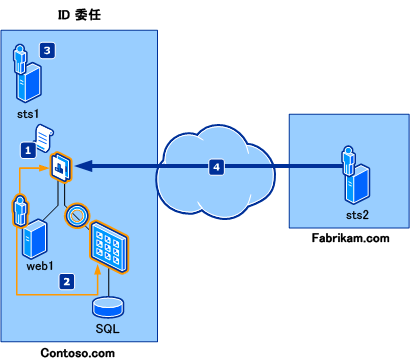
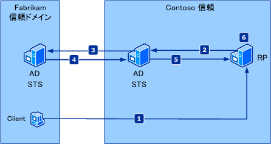
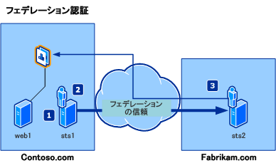

# SharePoint 2013 での委任、フェデレーション、認証のサンプル シナリオ
この記事では、ID 委任および ID フェデレーションのサンプル シナリオを紹介します。
## サンプル シナリオ

この記事のサンプル シナリオに出てくる架空の会社とその会社のビジネス ニーズは次のとおりです。
  
    
    

- **Contoso Hybrid** は国際的な自動車エンジン供給企業で、米国内外の自動車メーカーを対象とした電気および燃料電池ベースのハイブリッド エンジン製造を専門としています。顧客からの部品注文の要求に戦略的に対応するため、Contoso の IT 部門は、ホスト名 Contoso.com を介してインターネットからアクセスできる、安全な部品注文アプリケーションを開発し展開する任務を負っています。このアプリケーションはさまざまな内部ユーザー (Contoso の従業員) および外部ユーザー (メーカーの従業員) が利用するので、複数のレベルでアクセスできる必要があります。また、部品注文アプリケーションの維持管理に伴うコストを最小限に抑えるために、アプリケーションにアクセスする内部および外部ユーザー用の追加アカウント ストアを、アプリケーションで使用および管理しないようにする必要があります。
    
  
- **Fabrikam Motors** は、スウェーデンの小型自動車 (低燃費の小型車を含む) メーカーで、低価格のハイブリッド車で世界に知られています。Fabrikam では毎年着実に売り上げを伸ばしてはいますが、最初の 1 年以内に顧客に販売された車両のハイブリッド エンジンの故障率に大幅な増加が見られます。Fabrikam Motors が高いサービス品質基準を維持するには、ハイブリッド エンジン部品を Contoso Hybrid を介して注文するためのより効率的な手段を実装する必要があります。
    
  
関連する概念を次に示します。
  
    
    

- **ID フェデレーション** 。Contoso Hybrid と Fabrikam Motors 間のフェデレーションの確立について説明します。これにより、Fabrikam のユーザーは、シングル サインオンによって Contoso Hybrid リソースにアクセスできます。
    
  
- **ID 委任** 。ActAs トークンを必要とする Contoso Hybrid Web サービスからリソースにアクセスする機能について説明します。つまり、サービスには、直接の呼び出し元の ID (通常はサービスの ID) と要求を開始した元のユーザーの ID (通常は対話ユーザーの ID) が必要です。
    
  

## ID 委任

このシナリオでは、アクセス制御チェックを実行するために ID 委任チェーンを必要とするバックエンド リソースにアクセスする必要があるアプリケーションについて説明します。単純な ID 委任チェーンは、通常、最初の呼び出し元にある情報と直前の呼び出し元の ID で構成されます。 
  
    
    
With the Windows プラットフォームで現在使用されている Kerberos 委任モデルでは、バックエンド リソースは直前の呼び出し元の ID へのアクセス権だけを持ち、最初の呼び出し元の ID へのアクセス権は持ちません。このモデルは一般に、信頼済みサブシステム モデルと呼ばれます。Windows Identity Foundation (WIF) では、 [Delegate()](https://msdn.microsoft.com/library/Microsoft.IdentityModel.Claims.IClaimsIdentity.Delegate.aspx) により、最初の呼び出し元と委任チェーン内の直前の呼び出し元の ID が維持されます。
  
    
    
図 1 は、標準的な ID 委任シナリオを示しています。このシナリオでは、Fabrikam の従業員が、Contoso.com アプリケーションで公開されているリソースにアクセスします。
**図 1. フェデレーション認証のクレーム**

  
    
    

  
    
    

  
    
    
このシナリオに参加する架空のユーザーは以下のとおりです。
- Frank。Contoso のリソースにアクセスする Fabrikam の従業員。
    
  
- Daniel。アプリケーションに必要な変更を実装する Contoso のアプリケーション開発者。
    
  
- Adam。Contoso の IT 管理者。
    
  
このシナリオに関係する要素は以下のとおりです。
- web1: 最初の呼び出し元の委任 ID を必要とするバックエンド リソースへのリンクを含む Web アプリケーション。このアプリケーションは、ASP.NET で構築されています。
    
  
- Microsoft SQL Server を実行しているコンピューターにアクセスする Web サービス。最初の呼び出し元の委任 ID と、直接の呼び出し元の委任 ID が必要です。このサービスは Windows Communication Foundation (WCF) で構築されています。
    
  
- sts1: フェデレーション プロバイダーの役割を果たし、アプリケーション (web1) で期待されるクレームを作成するセキュリティ トークン サービス (STS)。Fabrikam.com だけでなく、アプリケーションとの信頼も確立しています。
    
  
- sts2: Fabrikam の ID プロバイダーの役割を果たし、Fabrikam 従業員が認証で使用するエンドポイントを提供する STS。Contoso.com のリソースへの Fabrikam 従業員のアクセスが許可されるように Contoso.com との信頼を確立しています。
    
  
"ActAs トークン" という言葉は、STS によって発行され、ユーザーの ID が含まれるトークンに関連します。 [Delegate()](https://msdn.microsoft.com/library/Microsoft.IdentityModel.Claims.IClaimsIdentity.Delegate.aspx) プロパティには、STS の ID が含まれます。図 1 で示されるように、このシナリオのフローは以下のようになります。
  
    
    

1. Contoso アプリケーションは、 [Delegate()](https://msdn.microsoft.com/library/Microsoft.IdentityModel.Claims.IClaimsIdentity.Delegate.aspx) プロパティの Fabrikam の従業員の ID と直接の呼び出し元の ID の両方が含まれる ActAs トークンを取得するように構成されています。Daniel は、アプリケーションに対してこれらの変更を実装します。
    
  
2. Contoso アプリケーションは、ActAs トークンをバックエンド サービスに渡すように構成されています。Daniel は、アプリケーションに対してこれらの変更を実装します。
    
  
3. Contoso Web サービスは、sts1 を呼び出して、ActAs トークンを検証するように構成されています。Adam は、sts1 で委任要求を処理できるようにします。
    
  
4. Fabrikam のユーザーである Frank が Contoso アプリケーションにアクセスします。Frank には、バックエンド リソースへのアクセス権が付与されます。
    
  

## フェデレーション認証

信頼された 2 つのドメイン間に信頼関係がある場合、フェデレーション認証を使用すると、信頼された一方のドメインの セキュリティ トークン サービス (STS) が、もう一方の信頼されたドメインの STS に認証情報を提供できます。この例を図 2 に示します。
  
    
    

**図 2. フェデレーション シナリオのクレーム**

  
    
    

  
    
    

  
    
    

  
    
    

1. 信頼された Fabrikam ドメインのクライアントが、信頼された Contoso ドメインの証明書利用アプリケーションに要求を送信します。
    
  
2. 証明書利用者が、信頼された Contoso ドメインの STS にクライアントをリダイレクトします。この STS には、クライアントに関する情報がありません。
    
  
3. Contoso STS が、信頼された Fabrikam ドメインの STS にクライアントをリダイレクトします。信頼された Contoso ドメインと信頼された Fabrikam ドメインの間には信頼関係があります。
    
  
4. Fabrikam STS は、クライアントの ID を検証し、Contoso STS に対してセキュリティ トークンを発行します。
    
  
5. Contoso STS は、Fabrikam トークンを使用して、証明書利用者に送信する独自のトークンを作成します。
    
  
6. 証明書利用者は、セキュリティ トークンからクライアントのクレームを抽出し、認証に関する判断を下します。
    
  
このシナリオでは、パートナーの従業員が他のパートナーのドメインのリソースにアクセスしようとした場合のサインオンの動作について説明します。サインオンするのは一度だけです。フェデレーション シナリオでは、主に ID プロバイダー、フェデレーション プロバイダー、証明書利用者の 3 つの要素がそれぞれの役割を果たしています。WIF には、この 3 つすべての要素を作成するための API が用意されています。 図 3 は、一般的なフェデレーション シナリオを示しています。このシナリオでは、Fabrikam の従業員が、再ログインせずに、つまりシングル サインオンを使用して、Contoso.com リソースにアクセスする必要があります。
**図 3. ID 委任シナリオのクレーム**

  
    
    

  
    
    

  
    
    
このシナリオに参加する架空のユーザーは以下のとおりです。
- Frank。Contoso のリソースにアクセスする Fabrikam の従業員。
    
  
- Daniel。アプリケーションに必要な変更を実装する Contoso のアプリケーション開発者。
    
  
- Adam。Contoso の IT 管理者。
    
  
このシナリオに関係する要素は以下のとおりです。
- web1: ASP.NET で構築され、関連パーツへのアクセスを制御するパーツ注文 Web アプリケーション。
    
  
- sts1: Contoso.com でフェデレーション プロバイダーの役割を果たし、アプリケーション (web1) で期待されるクレームを作成する STS。Fabrikam.com との信頼を確立し、Fabrikam 従業員へのアクセスを許可するように構成されています。
    
  
- sts2: Fabrikam.com で ID プロバイダーの役割を果たし、Fabrikam 従業員の認証先エンドポイントを提供する STS。Contoso.com リソースへの Fabrikam 従業員のアクセスが許可されるように Contoso.com との信頼を確立します。
    
  
図 3 で示されるように、このシナリオのフローは以下のようになります。
  
    
    

1. Contoso 管理者である Adam は、アプリケーション (証明書利用者) と sts1 間の信頼を構成します。
    
  
2. Contoso 管理者である Adam は、ID プロバイダーとして sts2 との信頼を構成します。
    
  
3. Fabrikam 管理者である Frank は、フェデレーション プロバイダーとして sts1 との信頼を構成し、アプリケーションにアクセスします。
    
  

## その他の技術情報

-  [SharePoint 2013 のクレームベース ID と概念](claims-based-identity-and-concepts-in-sharepoint-2013.md)
    
  
-  [クレームベース ID の用語の定義](claims-based-identity-term-definitions.md)
    
  

