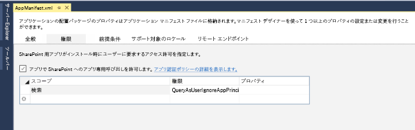
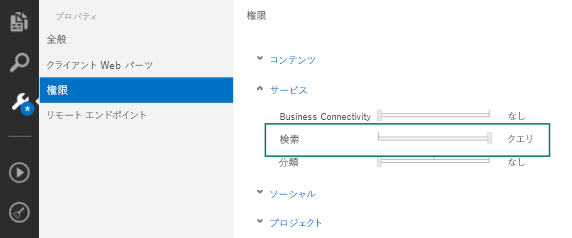

# SharePoint 2013 での検索アドイン
SharePoint アドイン の検索と独自の検索アドインを作成する方法について説明します。作成するアドインは SharePoint アドイン カタログに追加して、オンプレミスの展開と Office 365 の両方で使用できます。検索アドインは、元のソース文書ではなく、検索インデックスに格納されたデータにのみ有効です。
SharePoint アドイン は、SharePoint Web サイトの機能を拡張する自己完結型のソフトウェアです。これらのアドインは、最高の Web コンテンツと SharePoint を統合することで、特定のビジネスやエンドユーザーのニーズを解決します。アドインには、リスト、リモート イベント レシーバ、コンテンツ タイプ、ワークフロー、ワークフロー カスタム アクティビティ、サイト コラム、モジュール、メニュー項目のカスタム アクション、クライアント Web パーツ、検索構成など、さまざまな SharePoint 要素が含まれています。詳細については、「 [SharePoint アドイン](http://msdn.microsoft.com/library/cd1eda9e-8e54-4223-93a9-a6ea0d18df70%28Office.15%29.aspx)」を参照してください。
  
    
    

検索アドインとは、検索機能を使用する SharePoint アドイン アドインです。検索アドインでは、SharePoint 2013 検索 API を使ってコンテンツを検索します。 [アドイン マニフェスト](http://msdn.microsoft.com/library/7cd5850f-cbf3-48d2-bcb7-59b8f4ed0e63%28Office.15%29.aspx)で設定されている権限のタイプに応じて、アドインのコンテンツの内側または外側のいずれかを検索できます。また、1 つの SharePoint インストール環境から別のインストール環境に、検索アドインを使用して検索構成を配布することもできます。
検索アドインのコア設計は、選択した展開方法によって決まります。次のセクションでは、使用可能な選択肢とそのメリットを要約します。詳細については、「 [SharePoint アドインを開発およびホスティングするためのパターンを選択する](http://msdn.microsoft.com/library/05ce5435-0a03-4ddc-976b-c33b08d03457%28Office.15%29.aspx)」を参照してください。
  
    
    


## 検索アドインを展開する
<a name="SP15_Deploy_search_apps"> </a>

検索アドインの展開には、次の 2 つの方法があります。
  
    
    

1. SharePoint ホスト型 - オンプレミスの展開。検索アドインは会社のサーバーの社内ネットワークの内側でホストされます。会社の管理者がこのアドインを管理します。このシナリオでは、ハードウェアとソフトウェアが管理者によってローカルに保守されるため、展開の柔軟性とサポートが実現します。
    
  
2. プロバイダーホスト型 - ホストしている任意の Web サーバー。検索アドインは、顧客の SharePoint サーバーの外部にある任意のプロバイダーによってホストされます。
    
  

## 検索のアドインの開発環境
<a name="SP15_Search_app_dev_environment"> </a>

検索アドインを作成するには、以下の 2 つのいずれかの環境を使用します:
  
    
    

- Microsoft Visual Studio 2012、Microsoft Visual Studio 2013 または Visual Studio 2015
    
  
- Napa Office 365 開発ツール
    
  
Visual Studio 2013 以降では、オンプレミスと Office 365 の両方で検索アドインを公開できます。また、Napa を使用すると、自分のブラウザ内で検索アドインの作成と公開を行うことができます。このようなアドインは後から にエクスポートして、社内ユーザー用に再パッケージングすることができます。2 つの開発環境と開発環境を使った検索アドインの作成方法の詳細については、「 [SharePoint 2013 の一般的な開発環境の設定](set-up-a-general-development-environment-for-sharepoint-2013.md)」と「 [Office 365 開発ツール "Napa" を使用して Office 用アプリおよび SharePoint 用アプリを作成する](http://msdn.microsoft.com/library/82a3645c-0911-4926-9176-236ac8d28bdd%28Office.15%29.aspx)」を参照してください。
  
    
    

## 検索アドイン用の API
<a name="SP15_APIs_search_apps"> </a>

検索アドイン用に SharePoint が提供する検索関連の広い範囲にわたる API を使用できます。次の表にこのような API とそのクラス ライブラリの場所を示します。
  
    
    

**検索アドイン用の SharePoint API**


|**API 名**|**クラス ライブラリ**|
|:-----|:-----|
|.NET クライアント オブジェクト モデル (CSOM)  <br/> |Microsoft.SharePoint.Client.Search.dll  <br/> |
|Silverlight CSOM  <br/> |Microsoft.SharePoint.Client.Search.Silverlight.dll  <br/> |
|ECMAScript (JavaScript, JScript) オブジェクト モデル (JSOM)  <br/> |SP.search.js  <br/> |
|検索 REST API  <br/> |http://server/_api/search/query  <br/> |
   

### コード サンプル

ここではさまざまな API を使用したコード サンプルをいくつか示します。各コード サンプルでは、キーワード "SharePoint" を含むシンプルな 検索 クエリが Search Service アプリケーション (SSA) に送信されます。
  
    
    
 **Client-side Object Model (CSOM)**
  
    
    

  
    
    


```cs

using (ClientContext clientContext = new ClientContext("http://localhost"))
{
    KeywordQuery keywordQuery = new KeywordQuery(clientContext);
    keywordQuery.QueryText = "*";
    SearchExecutor searchExecutor = new SearchExecutor(clientContext);
    ClientResult<ResultTableCollection> results = 
        searchExecutor.ExecuteQuery(keywordQuery);
    clientContext.ExecuteQuery();
}
```

 **JavaScript Object Model (JSOM)**
  
    
    

  
    
    


```

var keywordQuery = new
Microsoft.SharePoint.Client.Search.Query.KeywordQuery(context);
keywordQuery.set_queryText('SharePoint');
var searchExecutor = new Microsoft.SharePoint.Client.Search.Query.SearchExecutor(context);
results = searchExecutor.executeQuery(keywordQuery);
context.executeQueryAsync(onQuerySuccess, onQueryFail);
```

 **REST**
  
    
    

  
    
    
HTTP GET リクエスト
  
    
    


```HTML

http://mylocalhost/_api/search/query?querytext='SharePoint'
```

HTTP POST リクエスト
  
    
    


```HTML
{
'__metadata' : {'type' : 'Microsoft.Office.Server.Search.REST.SearchRequest'},
'Querytext' : 'SharePoint'
}
```


## 検索アドインの権限
<a name="SP15_Search_app_permissions"> </a>

検索アドインは、クエリ リクエストを Search Service アプリケーション (SSA) に送信し、適切に機能するため、さまざまなタイプの権限を要求します。これらの権限は、アドインのマニフェスト ファイルを使って構成できます。マニフェスト ファイルは、各 SharePoint アドインに含まれています。テキスト エディターを使ってアドインのマニフェスト ファイルを直接変更できます。また次図に示すように、Visual Studio や Napa を使って変更することもできます。
  
    
    

**図 1: Visual Studio 2015 での検索アドインの権限の設定**

  
    
    

  
    
    

  
    
    

  
    
    

  
    
    

**図 2: "Napa" Office 365 開発ツールでの検索アドインの権限の設定**

  
    
    

  
    
    

  
    
    
SharePoint アドインは独自の ID を持ち、アドイン プリンシパルと呼ばれるセキュリティ プリンシパルに関連付けられています。ユーザーやグループと同じように、アドイン プリンシパルには一定のアクセス許可と権限があります。アドイン プリンシパルはアドイン Web に対するフル コントロール権限があるため、必要なのは、ホスト Web や、アドイン Web の外部の場所 (サイト コレクションなど) にある SharePoint リソースへのアクセス許可を要求することだけです。他の SharePoint アドイン とは異なり、検索アドインには **QueryAsUserIgnoreAppPrincipal** と呼ばれるユーザーレベルの権限だけが必要となります。この権限があれば、ユーザーの権限に基づいて検索アドインをクエリできます。つまり、ユーザーの ACL に基づいて検索結果が返されます。
  
    
    

### アドインのマニフェスト ファイルに対するアクセス許可の要求

アドインのマニフェスト ファイルは XML 形式であり、直接編集できます。アクセス許可を取得するには、次の例のような要求を作成します。
  
    
    

```XML

<AppPermissionRequests>
  <AppPermissionRequest Scope="http://sharepoint/search" Right="QueryAsUserIgnoreAppPrincipal" />
</AppPermissionRequests>
```


## その他の技術情報
<a name="SP15_Search_app_addresources"> </a>


-  [SharePoint アドイン](http://msdn.microsoft.com/library/cd1eda9e-8e54-4223-93a9-a6ea0d18df70%28Office.15%29.aspx)
    
  
-  [SharePoint アドインを開発およびホスティングするためのパターンを選択する](http://msdn.microsoft.com/library/05ce5435-0a03-4ddc-976b-c33b08d03457%28Office.15%29.aspx)
    
  
-  [SharePoint 2013 でのアドインのアクセス許可](http://msdn.microsoft.com/library/5f7a8440-3c09-4cf8-83ec-c236bfa2d6c4%28Office.15%29.aspx)
    
  
-  [SharePoint 2013 のアドイン承認ポリシーの種類](http://msdn.microsoft.com/library/124879c7-a746-4c10-96a7-da76ad5327f0%28Office.15%29.aspx)
    
  
-  [SharePoint アドインのアーキテクチャおよび開発環境に関する重要な要素](http://msdn.microsoft.com/library/ae96572b-8f06-4fd3-854f-fc312f7f2d88%28Office.15%29.aspx)
    
  
-  [SharePoint アドインのアプリ マニフェスト構造とパッケージを調べる](http://msdn.microsoft.com/library/7cd5850f-cbf3-48d2-bcb7-59b8f4ed0e63%28Office.15%29.aspx)
    
  
-  [SharePoint 用の検索機能をアドインに追加する](http://blogs.msdn.com/b/officeapps/archive/2013/05/30/add-search-capabilities-to-your-apps-for-sharepoint.aspx)
    
  
-  [SharePoint 2013 での検索設定のエクスポートとインポート](exporting-and-importing-search-configuration-settings-in-sharepoint-2013.md)
    
  
-  [SharePoint Server 2013 でカスタマイズされた検索構成設定のエクスポートとインポート (TechNet)](http://technet.microsoft.com/ja-jp/library/jj871675.aspx)
    
  

