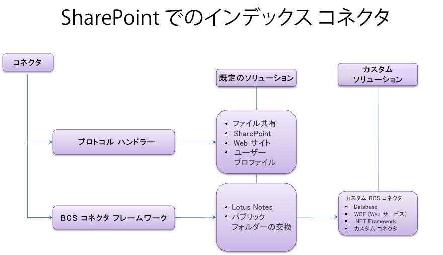
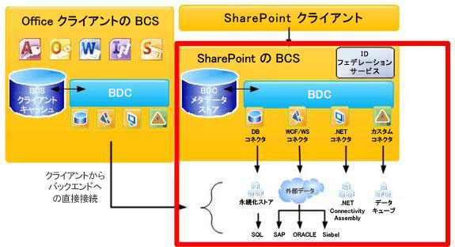
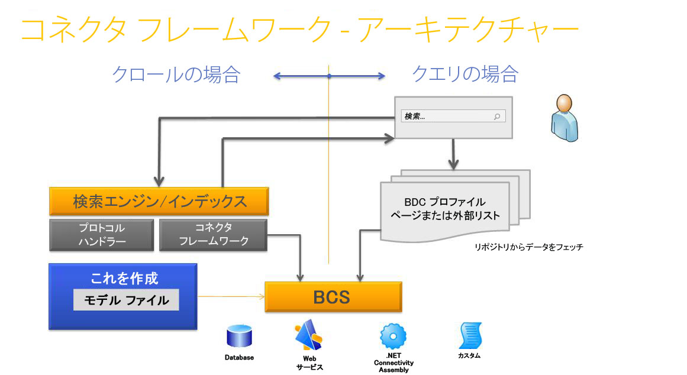

# SharePoint 2013 の検索コネクタ フレームワーク
SharePoint 2013 インデックス コネクタ、コネクタ フレームワーク、外部システムを検索するためのカスタム BCS インデックス コネクタの作成方法について説明します。
## SharePoint 2013 で検索に利用できるコンテンツの作成

SharePoint 2013 の検索 には、クエリを処理して検索結果を返す方法が 2 つあります。それは、フェデレーション検索とコンテンツ クロールです。
  
    
    
 **フェデレーション検索** この方法では、使用している検索サーバーによってクロールされていないコンテンツについて検索結果が返されます。クエリは外部コンテンツ リポジトリに転送され、そこでリポジトリの検索エンジンによって処理されます。その場合、リポジトリの検索エンジンが結果を検索サーバーに返します。検索サーバーは外部リポジトリから取得された結果を書式設定し、検索結果ページに表示します。この方法には、以下の利点があります。
  
    
    

- コンテンツは SharePoint 2013 の検索 によってクロールされないので、コンテンツ インデックスに対して追加機能を要求する必要がありません。
    
  
- リポジトリの既存の検索エンジンを活用できます。たとえば、インターネット検索エンジンをフェデレーションで使用して Web を検索できます。
    
  
- コンテンツ リポジトリの特定のコンテンツ セット用に、そのリポジトリの検索エンジンを最適化できます。これにより、コンテンツ セットの検索パフォーマンスが向上する可能性があります。
    
  
- クロール対象にならないように保護されているリポジトリのうち、検索クエリによってアクセス可能なリポジトリにアクセスできます。
    
  
 **コンテンツ クロール** この方法では、ユーザーのクエリに基づいて Search サービス アプリケーションのコンテンツ インデックスから結果が返されます。コンテンツ インデックスは、Search サービス アプリケーションによってクロールされたコンテンツを格納し、各コンテンツ アイテムのテキスト コンテンツとメタデータを含みます。この方法によって、次のことが可能になります。
  
    
    

- 結果を関連性ごとに並べ替える。
    
  
- コンテンツ インデックスの更新頻度を制御する。
    
  
- クロールされるメタデータを指定する。
    
  
- クロールされるコンテンツに対して単一のバックアップ操作を実行する。
    
  

## SharePoint 2013 におけるインデックス コネクタでのコンテンツのクロール

クローラーはインデックス コネクタを使用し、クロールするコンテンツにアクセスします。インデックス コネクタはコンテンツのソースに接続する方法、クロールの対象、クロールの方法を把握するコンポーネントです。Share Point の以前のバージョンでは、これらはプロトコル ハンドラーとして知られており、アンマネージ C++ コードを実行するカスタム インターフェイスを基にしたコンポーネントです。 
  
    
    
SharePoint 2013 の検索 には SharePoint Server 2010 に導入されて Microsoft Business Connectivity Services (BCS) 上に構築されたコネクタ フレームワークが含まれています。コネクタ フレームワークはインデックス コネクタ開発における、より簡単なアプローチを提供します。コネクタ フレームワークでは、クローラーは BCS を基にしたインデックス コネクタを使用し、外部コンテンツをクロールします。SharePoint 2013 は、プロトコル ハンドラーベースのインデックス コネクタとコンテンツ クロールのための BCS インデックス コネクタの両方を使用します。
  
    
    
図 1 に SharePoint 2013 のインデックス コネクタ機能の概要を示します。
  
    
    

  
    
    

  
    
    

  
    
    

  
    
    

## SharePoint 2013 の検索 の BCS 概要

BCS は、SharePoint から外部システムへの接続を可能にする、ツールとインフラストラクチャを包括したものです。図 2 には BCS アーキテクチャの概要が示されており、検索に関連する部分が強調表示されています。
  
    
    

  
    
    

**図 2. 検索を含んだ BCS のアーキテクチャ**

  
    
    

  
    
    

  
    
    

  
    
    
BCS はメタデータ ストアの外部コンテンツ タイプの定義に基づいて外部データへ接続します。メタデータ ストアには次のような外部コンテンツ タイプの情報が保存されています。
  
    
    

- **接続情報** 外部システムへの接続方法を示します。
    
  
- **エンティティ情報** 外部データの構造を示します。
    
  
- **操作** 外部データへのアクセスに使用するメソッドを示します。データベースと Web サービスの場合、外部システムによりサポートされるメソッドは、データベース コネクタ用の SQL ステートメントと Web サービス用の Web メソッドです。.NET とカスタム BCS インデックス コネクタに関しては、使用するメソッドはコネクタのアセンブリ、つまりインデックス コネクタ用に作成したコンポーネント DLL に実装されたメソッドです。
    
  
この情報は外部コンテンツ タイプの BDC モデル ファイルで指定されます。BDC モデルとそこに含まれるものの詳細については、「 [BDC モデル インフラストラクチャ](http://msdn.microsoft.com/library/2818ebdd-6cda-4d8f-82b2-7fde9fbf2633%28Office.15%29.aspx)」を参照してください。
  
    
    
BCS アーキテクチャと機能についての詳細は、「 [Business Connectivity Services の概要](http://msdn.microsoft.com/library/91dd7b01-ead2-4f87-804b-b59ef2245c87%28Office.15%29.aspx)」および「 [Business Connectivity Services が動作するしくみ](http://msdn.microsoft.com/library/ff3e312b-0fbc-48ed-a752-76c50d286533%28Office.15%29.aspx)」を参照してください。
  
    
    

### コネクタ フレームワークの使用

外部データをクロールするには、外部データへの接続をサポートするコンテンツ ソースの種類のうち 1 つを追加する必要があります。表 1 に、コンテンツ ソースの種類を示します。
  
    
    

**表 1. BCS インデックス コネクタをサポートするコンテンツ ソースの種類**

|**コンテンツ ソースの種類**|**説明**|
|:-----|:-----|
|基幹業務データ    |データベースおよび Web サービスの BCS インデックス コネクタに使用するコンテンツ ソースです。    |
|カスタム リポジトリ    |.NET およびカスタム BCS インデックス コネクタに使用するコンテンツ ソースです。    |
   
コネクタ フレームワークにより、BCS インデックス コネクタを作成し、クロールする外部コンテンツ、またはコンテンツ インデックスに含める外部コンテンツに接続することができます。BCS インデックス コネクタは外部データ ソースと通信するためにクローラーによって使用されます。クロールするとき、クローラーは BCS インデックス コネクタを呼び出し、外部システムからデータを取得してデータをクローラーに返します。また BCS インデックス コネクタは、クロール実行中に BCS と検索間でやりとりするため、検索が理解するアクセス URL と BCS が理解する識別子を解析します。
  
    
    
BCS インデックス コネクタを構成するものは、次のとおりです。
  
    
    

  
    
    
> **BDC モデル ファイル** データの構造および外部システムへの接続情報を提供するファイルです。
    
  

  
    
    
> **コネクタ** 外部システムに接続し、アクセス URL と BCS 識別子を解析するコードを含んだコンポーネントです。
    
  
基幹業務データのコンテンツ ソースの種類に基づく BCS インデックス コネクタについては、Search に組み込みコネクタがあるため、BDC モデル ファイルの作成だけ行います。 
  
    
    
カスタム リポジトリ コンテンツ ソースの種類に基づく BCS インデックス コネクタについては、外部データに接続するために BDC モデル ファイルに加えてカスタム コンポーネントを開発する必要があります。
  
    
    
図 3 に検索コネクタ フレームワークのアーキテクチャの概要を示します。
  
    
    

**図 3. 検索コネクタ フレームワークのアーキテクチャ**

  
    
    

  
    
    

  
    
    

  
    
    

  
    
    

### BCS インデックス コネクタ

SharePoint 2013 では、以下の種類の BCS インデックス コネクタをサポートしています。
  
    
    

- **データベース コネクタ** SharePoint 2013 には定義済みの BCS コネクタが含まれており、データベースへの接続をサポートします。そのため、コネクタ用の BDC モデル ファイルを作成するだけで、コードを記述することなくデータベース BCS インデックス コネクタを作成することができます。
    
  
- **WCF (Web サービス) コネクタ** SharePoint 2013 には定義済みの BCS コネクタが含まれており、Web サービスへの接続をサポートします。そのため、コネクタ用の BDC モデルファイルを作成するだけで、コードを記述することなく Web サービス BCS インデックス コネクタを作成することができます。
    
    > **メモ**
      > Web サービスへのコネクタを作成するためのコードを記述する必要はありませんが、Web サービスには .NET BCS コネクタが提供するのと同じ機能を提供するメソッドを含めて、外部のビジネス データを BCS に渡す必要があります。Web サービスの作成方法については、「 [.NET Connectivity Assemblies と Web サービスを作成する](http://msdn.microsoft.com/library/9a6c6712-868a-4a9c-9645-3aa448ad5092%28Office.15%29.aspx)」を参照してください。コード例については、「 [Sample Orders ASP.NET Web Service サンプル](http://msdn.microsoft.com/library/10e46860-788f-4ed0-a4d8-1e17ada58e83%28Office.15%29.aspx)」と「 [Sample Orders WCF Service サンプル](http://msdn.microsoft.com/library/535277c8-9d5c-41eb-ab23-0ae141d726c5%28Office.15%29.aspx)」を参照してください。 
- **.NET BCS コネクタ** SharePoint 2013 には .NET コネクタ用の定義済み BCS は含まれていないため、BDC モデル ファイルの作成に加え、BCS インデックス コネクタ用の .NET コンポーネントも作成する必要があります。必須のステレオタイプ化操作を実装してデータのクロールをサポートし、アクセス URL と BDC 識別子を解析するメソッドを実装する必要があります。
    
  
- **カスタム BCS コネクタ** SharePoint 2013 にはカスタム .NET コネクタ用の定義済み BCS コネクタは含まれていないため、BDC モデル ファイルの作成に加え, .NET BCS コネクタと同様に BCS インデックス コネクタ用の .NET コンポーネントも作成する必要があります。必須のステレオタイプ化操作を実装してデータのクロールをサポートし、アクセス URL と BDC 識別子を解析するメソッドを実装する必要があります。 **ISystemUtility** インターフェイスも実装する必要があります。
    
  

## BCS インデックス コネクタの作成

BCS インデックス コネクタを開発するときは、データベースや Web サービスのインデックス コネクタ用の BDC モデル ファイルを作成している、あるいは .NET やカスタム インデックス コネクタ用に BDC モデル ファイルの作成や BCS コネクタ コンポーネントのコーディングを行っているなどの状況にかかわらず、次のことを考慮する必要があります。
  
    
    

- **接続性** 外部データ リポジトリへの接続方法、例えばサーバー アドレス、IP アドレス、データベースのインスタンス名です。また外部データ リポジトリへの接続に使用する認証情報も含みます。
    
  
- **リポジトリの構造** データを読み取るため、コネクタはリポジトリがどのように構成されているか (構成は階層型か、列挙型か、あるいはリンクの移動が必要か) を把握する必要があります。
    
  
- **増分クロール** 外部データ リポジトリのパフォーマンス負荷を減らすため、フル クロールに加えて増分クロール機能をコネクタに持たせます。増分クロールを行うために、コネクタは最後のクロール以降に変更されたデータを識別し、そのデータのみクロールする必要があります。これはタイムスタンプベースの増分クロールまたは変更ログベースのクロールによって行うことができます。実装のアプローチはリポジトリが提供する API やコンテンツの目標の鮮度により異なります。
    
  
- **データの保護** 多くのシナリオにおいて、すべてのユーザーがすべてのデータにアクセスできるわけではありません。これが検索でも機能することが重要で、検索 UI を使用して検索するとき、ユーザーは自分がアクセスできる結果のみを参照することができます。これはコネクタが外部システムのセキュリティを読み取る方法を認識し、インデックスへのクロール中にセキュリティ関連情報を持ち帰る必要があることを意味します。例えば、Windows NT アクセス制御リスト (ACL) のクロール時間ストレージを実装することができます。
    
  
表 2 に、SharePoint 2013 用 BCS インデックス コネクタ作成時に適用するステレオタイプ化操作を示します。
  
    
    

**表 2. SharePoint 2013 の検索 がサポートする BCS ステレオタイプ化操作**

|**操作**|**説明**|
|:-----|:-----|
|Finder    |BCS コネクタ作成時に必要な中核となる操作です。この操作は外部コンテンツ ソースのアイテム リストを取得します。「 [Finder の実装](http://msdn.microsoft.com/library/a0cb7cfe-8758-4057-aa85-03071536745e%28Office.15%29.aspx)」を参照してください。    |
|SpecificFinder    |BCS コネクタ作成時に必要な中核となる操作です。この操作は外部コンテンツ ソースから個々のアイテムを取得します。「 [SpecificFinder の実装](http://msdn.microsoft.com/library/9b6effa5-20ce-4ce7-a8dc-0fd601eb0f23%28Office.15%29.aspx)」を参照してください。    |
|ChangedIdEnumerator    |変更ログベースの増分クロールの実装に必要な操作です。「 [ChangedIdEnumerator の実装](http://msdn.microsoft.com/library/19d3c942-f6d7-49e7-853f-4d9b61b10422%28Office.15%29.aspx)」を参照してください。    |
|DeletedIdEnumerator    |変更ログベースの増分クロールの実装に必要な操作です。「 [DeletedIdEnumerator の実装](http://msdn.microsoft.com/library/aa1c521a-0c9b-4dc0-a32f-fb9e54c52bed%28Office.15%29.aspx)」を参照してください。    |
|BinarySecurityDescriptorAccessor    |アイテムレベルのセキュリティに必要な操作です。外部コンテンツ ソースからアイテムのセキュリティ記述子が返されます。「 [BinarySecurityDescriptorAccessor の実装](http://msdn.microsoft.com/library/6cf70490-dd3c-49cd-bb13-ed33e938435d%28Office.15%29.aspx)」を参照してください。    |
|StreamAccessor    |外部コンテンツ ソースからの添付ファイルのクロールの有効化に必要な操作です。添付ファイルをデータ ストリームとして返します。「 [StreamAccessor の実装](http://msdn.microsoft.com/library/e3d8053b-90c0-4207-98e3-91e42db13cf1%28Office.15%29.aspx)」を参照してください。    |
   

  
    
    

### BCS インデックス コネクタ開発のツール サポート

BCS には、SharePoint Designer と Visual Studio で BCS コネクタのツール サポートがあります。
  
    
    

#### BCS コネクタに対する SharePoint Designer のツール サポート

SharePoint Designer は限定的な機能セットを提供します。既存の BCS コネクタ タイプの BDC モデル ファイルを作成するのに使用できます。例えばデータベース、Web サービス, .NET BCS コネクタなどです。また、ある BCS サービス アプリケーションから別の BCS サービス アプリケーションへの BDC モデル ファイルのエクスポートにも使用できます。
  
    
    

#### BCS コネクタに対する Visual Studio のツール サポート

Visual Studio を使用して, .NET BCS コネクタやカスタム BCS コネクタ用のコンポーネントを作成できます。.NET BCS コネクタについては、Visual Studio Business Data Connectivity モデル プロジェクト テンプレートが提供されます。テンプレートには視覚デザイナーやコード管理機能が含まれ, .NET コンポーネントやそれに関連する .NET BCS コネクタの BDC モデル ファイルをより簡単に作成、デバッグ、配置できるようになります。カスタム BCS コネクタ用のプロジェクト テンプレートはありません。
  
    
    

## SharePoint 2013 でのコネクタ フレームワークの強化機能

SharePoint 2013 では、コネクタ フレームワークは、カスタム外部データ リポジトリに保存されたコンテンツのクレーム情報の BCS コネクタによる取得をサポートします。
  
    
    
また、コネクタ フレームワークは、例外キャプチャとログが改良されており、BCS コネクタを使用したコンテンツ ソースのクロール時に見つかるエラーのトラブルシューティングに役立ちます。
  
    
    

## その他の技術情報

-  [SharePoint 2013 の検索用 BDC モデル ファイルを強化する](enhancing-the-bdc-model-file-for-search-in-sharepoint-2013.md)
    
  
-  [SharePoint 2013: MyFileConnector カスタム BCS インデックス コネクタのサンプル](http://code.msdn.microsoft.com/SharePoint-2013-MyFileConne-79d2ea26)
    
  
-  [方法: SharePoint 2013 で関連付けられた外部コンテンツ タイプをクロールする](how-to-crawl-associated-external-content-types-in-sharepoint-2013.md)
    
  
-  [方法: SharePoint 2013 でバイナリ ラージ オブジェクト (BLOB) をクロールする](how-to-crawl-binary-large-objects-blobs-in-sharepoint-2013.md)
    
  
-  [方法: SharePoint 2013 で関連付けられた外部コンテンツ タイプをクロールする](how-to-crawl-associated-external-content-types-in-sharepoint-2013.md)
    
  
-  [方法: SharePoint 2013 でアイテム レベルのセキュリティを構成する](how-to-configure-item-level-security-in-sharepoint-2013.md)
    
  

