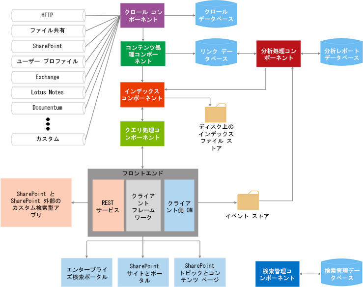

# SharePoint 2013 の検索
SharePoint 2013 の検索 の拡張構成要素と、ユース ケースに合わせた構成要素の使用方法について
SharePoint 2013 の検索 によって、ユーザーは以前よりもすぐに簡単に関連情報を検索できるようになり、検索の管理者は検索のエクスペリエンスを簡単にカスタマイズできます。また、より高度なカスタマイズおよびソリューションのための複数の API が用意されています。
  
    
    

SharePoint 2013 開発の一般的な概念の紹介については、次の記事を参照してください。次に進む前に、これらを確認することをお勧めします。
-  [SharePoint 2013 の一般的な開発環境の設定](set-up-a-general-development-environment-for-sharepoint-2013.md)
    
  
-  [SharePoint 2013 での適切な API セットの選択](choose-the-right-api-set-in-sharepoint-2013.md)
    
  
-  [SharePoint アドインと SharePoint ソリューションの比較](sharepoint-add-ins-compared-with-sharepoint-solutions.md)
    
  
-  [SharePoint アドインまたは SharePoint ソリューションの選択](deciding-between-sharepoint-add-ins-and-sharepoint-solutions.md)
    
  

## 検索アーキテクチャの概要

SharePoint 2013 の検索 には、広い範囲にわたる改良点と新機能が搭載されています。このバージョンでは、単一のエンタープライズ検索プラットフォームとなるように SharePoint 2013 の検索 を再構築しました。検索アーキテクチャは次のエリアから構成されています:
  
    
    

-  [クロールとコンテンツの処理](#bk_crawl)
    
  
-  [インデックス](#bk_index)
    
  
-  [クエリ処理](#bk_query)
    
  
-  [検索管理](#bk_searchadmin)
    
  
-  [分析](#bk_analytics)
    
  
これらのエリアは、検索操作を連携して実行するコンポーネントとデータベースから構成されています。図 1 は検索アーキテクチャのさまざまなエリアと、検索操作を連携して実行するコンポーネントとデータベースの概要を示しています。
  
    
    

**図 1. 検索コンポーネントの相互作用**

  
    
    

  
    
    

  
    
    
詳細については、「 [技術ダイアグラム -- 検索](http://technet.microsoft.com/ja-jp/library/cc263199.aspx#search)」と「 [SharePoint Server 2013 での検索の概要](http://technet.microsoft.com/ja-jp/library/jj219738.aspx)」を参照してください。
  
    
    

### クロールとコンテンツの処理

クロールとコンテンツの処理アーキテクチャは、次の要素から構成されています:
  
    
    
 **クロール コンポーネント**
  
    
    
 コンテンツ ソースをクロールして、クロールされたアイテムからクロールされたプロパティとメタデータを収集し、この情報をコンテンツ処理コンポーネントに送信します。
  
    
    
 **クロール データベース**
  
    
    
最後にクロールを実行した時刻、最後のクロール ID、最後のクロール時の更新タイプなど、クロールされた項目に関する情報が格納されています。
  
    
    
 **コンテンツ処理コンポーネント**
  
    
    
コンテンツ ソースをクロールして、クロールされたアイテムからクロールされたプロパティとメタデータを収集し、この情報をインデックス コンポーネントに送信します。
  
    
    

### インデックス

インデックス コンポーネントは、コンテンツ処理コンポーネントから処理されたアイテムを受信し、その情報を検索インデックスに書き込みます。このコンポーネントは、受信クエリの処理、検索インデックスからの情報の取得、クエリ処理コンポーネントへの結果セットの送信なども実行します。
  
    
    

### クエリ処理

クエリ処理コンポーネントは、検索のクエリと結果の分析と処理を行います。処理されたクエリはインデックス コンポーネントに送信され、クエリの検索結果が返されます。
  
    
    

### 検索管理

検索管理は、検索管理コンポーネントとそれに対応するデータベースから構成されています。
  
    
    
 **検索管理コンポーネント**
  
    
    
検索用のシステム プロセスを実行し、検索コンポーネントの新しいインスタンスの追加と初期化を行います。
  
    
    
 **検索管理データベース**
  
    
    
検索構成データを格納します。
  
    
    

### 分析

分析アーキテクチャは、分析処理コンポーネント、分析レポート データベース、およびリンク データベースから構成されています。
  
    
    
 **分析処理コンポーネント**
  
    
    
検索分析と使用分析を実行します。
  
    
    
 **リンク データベース**
  
    
    
コンテンツ処理コンポーネントと検索クリック情報から抽出された情報を格納します。
  
    
    
 **分析レポート データベース**
  
    
    
使用分析の結果を格納します。
  
    
    
 **イベント ストア**
  
    
    
フロントエンドでキャプチャされた使用イベントを格納します。
  
    
    

## 検索拡張ポイント

SharePoint 2013 の検索 アーキテクチャは、カスタマイズ シナリオをサポートする、複数の拡張ポイントを提供します。このセクションでは、これらのポイントについて説明し、このようなシナリオを開発するための詳細をどこで取得できるかを示します。
  
    
    

### コネクタ フレームワーク

クロール コンポーネントは、データを取得するためにコンテンツ ソースと通信するコネクタまたはプロトコル ハンドラを呼び出すことで、コンテンツをクロールします。SharePoint 2013 の検索 には、新しいコンテンツ ソースをクロールするコネクタのカスタマイズと構築を行うために使用できるコネクタ フレームワークが含まれています。コネクタ フレームワーク アーキテクチャの詳細とその拡張方法については、「 [SharePoint 2013 の検索コネクタ フレームワーク](search-connector-framework-in-sharepoint-2013.md)」を参照してください。
  
    
    

### カスタム コンテンツ処理

コンテンス処理コンポーネント内で、Content Enrichment Web サービス コールアウトを使って、クロールされたアイテムの管理プロパティを検索インデックスに追加する前に変更することができます。この Web サービス コールアウトは、作成した任意の外部コンテンツ エンリッチメント Web サービスに対して、コールアウトを実行します。詳細については、「 [コンテンツ エンリッチメント Web サービス呼び出しによるカスタム コンテンツ処理](custom-content-processing-with-the-content-enrichment-web-service-callout.md)」を参照してください。コンテンツ エンリッチメント Web サービスのステップバイステップの実装については、「 [方法: SharePoint Server でコンテンツ エンリッチメント Web サービス呼び出しを使用する](how-to-use-the-content-enrichment-web-service-callout-for-sharepoint-server.md)」を参照してください。ブログ投稿「  [コンテンツ エンリッチメント Web サービスを使った SharePoint 2013 検索エクスペリエンスのカスタマイズ](http://blogs.msdn.com/b/sharepointdev/archive/2012/11/13/customize-the-sharepoint-2013-search-experience-with-a-content-enrichment-web-service.aspx)」も、わかりやすい資料です。
  
    
    

### クエリ API

SharePoint 2013 の検索 には複数のクエリ API が用意されており、検索結果にさまざまな方法でアクセスできるため、検索結果を多様なカスタム ソリューション タイプで返すことができます。
  
    
    
表 1 では、SharePoint 2013 の検索 のプログラムに使用できる API とその格納場所を示しています。
  
    
    

**表 1. 検索 API**

|**API 名**|**クラス ライブラリまたはスキーマとパス**|
|:-----|:-----|
|.NET クライアント オブジェクト モデル (CSOM)    |Microsoft.SharePoint.Client.Search.dll          %ProgramFiles%\\Common Files\\Microsoft Shared\\web server extensions\\15\\ISAPI    |
|Silverlight CSOM    |Microsoft.SharePoint.Client.Search.Silverlight.dll          %ProgramFiles%\\Common Files\\Microsoft Shared\\web server extensions\\15\\TEMPLATE\\LAYOUTS\\ClientBin    |
|JavaScript CSOM    |SP.search.js          %ProgramFiles%\\Common Files\\Microsoft Shared\\web server extensions\\15\\TEMPLATE\\LAYOUTS    |
|REST (Representational State Transfer) サービス エンドポイント    |http://server/_api/search/query          http://server/_api/search/suggest    |
|サーバー オブジェクト モデル    |Microsoft.Office.Server.Search.dll          %ProgramFiles%\\Common Files\\Microsoft Shared\\web server extensions\\15\\ISAPI    |
   
詳細については、「 [SharePoint 2013 検索クエリ API を使用する](using-the-sharepoint-2013-search-query-apis.md)」を参照してください。
  
    
    

### 分析

ユーザーが最も有益で関連性があると考えるコンテンツを特定し、明確にするため、分析処理コンポーネントはコンテンツ自体とユーザーがそのコンテンツを操作する方法の両方を分析します。このような分析は、必要に応じて、分析ジョブの開始、停止、一時停止、再開などの、分析ライフサイクル タスクを処理するタイマージョブによって実行されます。このようなタイマー ジョブは  [Microsoft.Office.Server.Search.Analytics](https://msdn.microsoft.com/library/Microsoft.Office.Server.Search.Analytics.aspx) 名前空間を使って操作できます。SharePoint Server 2013 の分析の詳細については、「 [SharePoint Server 2013 での分析処理の概要](http://technet.microsoft.com/ja-jp/library/jj219554.aspx)」を参照してください。
  
    
    

### カスタム ランキング モデル

検索結果は、ランク スコアなど、さまざまな方法で並べ替えることができます。ランク スコアはランキング モデルを使用する検索エンジンによって計算されます。SharePoint Server 2013 には既定で、14 のランキング モデルが用意されています。ただし、検索結果の並べ方に満足できない場合、カスタム ランキング モデルを使用することができます。カスタム ランキング モデルの作成処理と調整処理の詳細については、「 [SharePoint 2013 で関連性を向上させるためのランク付けモデルのカスタマイズ](customizing-ranking-models-to-improve-relevance-in-sharepoint-2013.md)」を参照してください。
  
    
    

### カスタム セキュリティ トリミング

SharePoint Server 2013 での検索では、クエリ時に、クエリを送信するユーザーの ID に基づいて、検索結果のトリミングが実行されます。その際、クロール コンポーネントから取得したセキュリティ情報が使われます。ただし、カスタム セキュリティ トリミングを実装する必要が発生することもあります。SharePoint Server 2013 は、このタスクを実行するため、 [ISecurityTrimmerPre](https://msdn.microsoft.com/library/Microsoft.Office.Server.Search.Query.ISecurityTrimmerPre.aspx) と [ISecurityTrimmerPost](https://msdn.microsoft.com/library/Microsoft.Office.Server.Search.Query.ISecurityTrimmerPost.aspx) という 2 つのインターフェイスを提供します。
  
    
    
プリトリマー インターフェイス ( **ISecurityTrimmerPre**) は、クエリ前評価を実行します。プリトリミングでは、セキュリティ情報を追加するように検索クエリを書き換えてから、検索インデックスと照会します。これとは対照的に、ポスト トリマー インターフェイス ( **ISecurityTrimmerPost**) では、クエリ後評価を実行します。ポストトリミングでは、検索結果をユーザーに結果を渡す前に検索結果の余分な部分が取り除かれます。2 つのインターフェイスの詳細については、「 [SharePoint Server 2013 での検索のカスタム セキュリティ トリミング](custom-security-trimming-for-search-in-sharepoint-server-2013.md)」を参照してください。セキュリティ トリマー インターフェイスの実装方法に関するステップバイステップの情報については、「 [方法: SharePoint Server の検索結果でカスタム セキュリティ トリマーを使用する](how-to-use-a-custom-security-trimmer-for-sharepoint-server-search-results.md)」を参照してください。
  
    
    

### コンテンツ検索 Web パーツ

コンテンツ検索 Web パーツは、以前クロールされ、検索インデックスに追加されたダイナミック コンテンツを表示できる Web パーツです。Web パーツの各インスタンスは検索クエリに関連付けられていて、その特定の検索クエリの結果を表示します。コンテンツ検索 Web パーツが含まれているページを参照すると、検索クエリが自動的に発行され、対応する検索結果が検索インデックスから返されます。自動生成された検索クエリによって入力された内容を表示する場合は、コンテンツ検索 Web パーツを使用できます。場合によって、 [Microsoft.Office.Server.Search.WebControls](https://msdn.microsoft.com/library/Microsoft.Office.Server.Search.WebControls.aspx) 名前空間を介して [ContentBySearchWebPart](https://msdn.microsoft.com/library/Microsoft.Office.Server.Search.WebControls.ContentBySearchWebPart.aspx) として公開されているコンテンツ検索 Web パーツを拡張することが望ましい場合があります。Web パーツがカスタム プロパティを認識するように [ContentBySearchWebPart](https://msdn.microsoft.com/library/Microsoft.Office.Server.Search.WebControls.ContentBySearchWebPart.aspx) を拡張する方法については、「 [SharePoint 2013 のユーザー セグメンテーション](user-segmentation-in-sharepoint-2013.md)」を参照してください。
  
    
    

### Navigation と Event Logging REST インターフェイスを使用する検索型モバイル アプリ

SharePoint Server 2013 は、Navigation と Event Logging という、2 つの新しい REST インターフェイスを提供します。このインターフェイスを使って、携帯電話やタブレットなど、モバイル デバイス用の検索型モバイル アプリを作成し、Windows 以外のオペレーティング システムで実行することができます。この機能を使用すると、モバイル チャネルを使用する以外の方法で、モバイル デバイスに製品カタログを表示することができます。このようなアプリの詳細な作成例については「 [[方法] ナビゲーションとイベント記録の REST インターフェイスを備えた検索利用モバイル アプリを作成する](how-to-build-search-driven-mobile-apps-with-the-navigation-and-event-logging-res.md)」を参照してください。
  
    
    

## このセクションの内容

-  [開発者向けの SharePoint 2013 検索の新機能](what-s-new-in-sharepoint-2013-search-for-developers.md)
    
  
-  [SharePoint Search を使用して新しいコンテンツを検索する](searching-new-content-with-sharepoint-search.md)
    
  
-  [SharePoint 2013 で検索を構成する](configure-search-in-sharepoint-2013.md)
    
  
-  [SharePoint 2013 で検索クエリを作成する](building-search-queries-in-sharepoint-2013.md)
    
  
-  [SharePoint 検索 REST API の概要](sharepoint-search-rest-api-overview.md)
    
  
-  [SharePoint 2013 での検索結果のカスタマイズ](customizing-search-results-in-sharepoint-2013.md)
    
  
-  [SharePoint 2013 での検索結果の並べ替え](sorting-search-results-in-sharepoint-2013.md)
    
  
-  [SharePoint 2013 で関連性を向上させるためのランク付けモデルのカスタマイズ](customizing-ranking-models-to-improve-relevance-in-sharepoint-2013.md)
    
  
-  [SharePoint Server 2013 での検索のカスタム セキュリティ トリミング](custom-security-trimming-for-search-in-sharepoint-server-2013.md)
    
  
-  [SharePoint 2013 での検索設定のエクスポートとインポート](exporting-and-importing-search-configuration-settings-in-sharepoint-2013.md)
    
  

## その他の技術情報

-  [SharePoint 2010 から SharePoint 2013 への変更](http://technet.microsoft.com/ja-jp/library/ff607742.aspx)
    
  
-  [技術ダイアグラム -- 検索](http://technet.microsoft.com/ja-jp/library/cc263199.aspx#search)
    
  
-  [SharePoint 2013 機能の追加](add-sharepoint-2013-capabilities.md)
    
  
