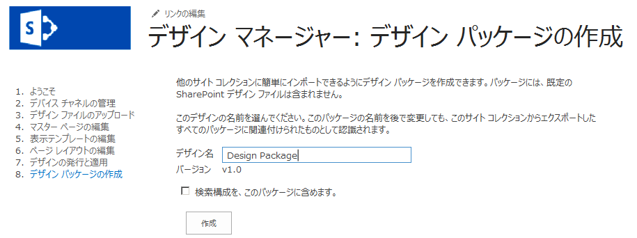

# SharePoint 2013 Design Manager デザイン パッケージ
SharePoint サイト コレクションの視覚デザインをパッケージとして構築およびエクスポートする方法を説明します。
## デザイン パッケージの概要

SharePoint 2013 では、デザイン マネージャーを使用することにより、開発者と設計者が SharePoint サイト コレクションの視覚デザインをパッケージとして構築およびエクスポートできます。このパッケージを顧客や他の指定したグループに簡単に配布して、サイト コレクションにインストールできます。この新機能によって、デザインの転送に関する複雑さが軽減され、顧客はサイトの視覚デザインをより簡単に外部委託できるようになります。たとえば、次のような利用シナリオが考えられます。
  
    
    

- **新規デザイン** - Web デザイン能力が十分ではない企業が、現在の SharePoint サイトをより今風にアレンジするため、ベンダー エージェンシーと契約します。このエージェンシーは、サイトを作成し、企業の SharePoint ファームにインポートできるよう、コンテンツを簡単にパッケージ化できます。
    
  
- **クロスサイト発行** - SharePoint 2013 でクロスサイト発行を使用している企業の IT 部門が、複数のサイト コレクションで視覚デザインを共有する必要があるものとします。IT 部門は社内でサイトを作成し、簡単な方法でデザインをいくつかの SharePoint Web サイトに転送したいと考えます。デバイス マネージャーのデザイン パッケージ機能を使用すると、管理サポートと複雑さを軽減させつつ、エクスポートおよびインポートを行うことができます。
    
  
この記事は、パッケージ作成の概要を説明して、SharePoint 2013 でのデザインのパッケージ化について理解できるようにすると共に、パッケージのエクスポートおよびインポートに関するワークフローについて説明するものです。また、特定の操作に必要なアクセス許可や、デザイン パッケージのアーキテクチャについても説明します。
  
    
    

## デザイン パッケージの作成

[ **サイトの設定**] でデザイン マネージャーを使用して、SharePoint ソリューション パッケージ (.wsp ファイル) というデザイン パッケージを SharePoint サイトに作成します。パッケージの作成手順は、デザイン ファイルのアップロード、マスター ページの作成、ページ レイアウトの編集など、SharePoint サイトのブランド設定および発行のためのその他のデザイン マネージャーの手順の後で実行します。サイトを発行した後は、エクスポートする .wsp ファイルの作成は比較的簡単なプロセスです。
  
    
    
図 1 に、デザイン パッケージの命名および作成に使用できるデザイン マネージャーのオプションを示します。
  
    
    

**図 1. デザイン パッケージのエクスポート**

  
    
    

  
    
    

  
    
    
あるいは、ウェルカム ページでデザイン マネージャーを使用するか、[ **サイトの設定**] で [ **デザイン パッケージのインポート**] を選択することにより、別の SharePoint 2013 サイト コレクションからデザイン パッケージをインポートできます。
  
    
    

    
> **メモ**
> デザイン マネージャーと発行プロセスの詳細については、「 [SharePoint 2013 のデザイン マネージャーの概要](overview-of-design-manager-in-sharepoint-2013.md)」を参照してください。 
  
    
    

デザイン パッケージに検索の構成を含めるためのチェック ボックスがあります。 サイトを設計して条件検索結果を作成する場合、または検索を制御する場合は、このオプションを選択します。 この構成には、クエリ ルール、検索先、結果の型、スキーマおよびランク付けモデルなどのアセットが含まれます。検索構成のインポートを成功させるには、検索構成の要素名が重複しないようにします。たとえば、 **SampleQueryRule** というサイト コレクションにクエリ ルールがあり、既存の **SampleQueryRule** というルールがある別のサイト コレクションにインポートしようとすると、検索構成のインポートは失敗します。この失敗を防ぐには、ソースまたはターゲットのクエリ ルールの名前を変更するか、削除します。また結果のソースとスキーマも一意な名前にする必要があります。デザイン パッケージに検索構成を含めるには、デザイン パッケージをエクスポートする前に、[ **サイト機能の管理**] を開き、サイト レベルで次の機能をアクティブにする必要があります。
  
    
    

- 検索構成データのコンテンツ タイプ
    
  
- 検索構成データのサイト列
    
  
- 検索構成リスト インスタンス機能
    
  
- 検索構成テンプレート機能
    
  
デザインをインポート先で発行する場合は、すべてのデザイン アセットを発行するか、エクスポート元でデザイン関連ライブラリのメジャー バージョン管理機能を無効にする必要があります。デザイン マネージャーは、各アセットの最新バージョンのみをエクスポート元からエクスポートします。たとえば、エクスポート元でマスター ページのバージョンが 1.1 の場合、インポート先には下書きとしてコピーされます。ただし、バージョン 1.0 はコピーされません。また、チェックアウトされているファイルもエクスポートされません。
  
    
    

## デザイン パッケージのエクスポートおよびインポート

エンドツーエンドのパッケージ化ワークフローには、いくつかの方法でアプローチできます。アプローチの大部分は、目的と、使用可能なデザイン リソースによって異なります。ベンダー エージェンシーに外部委託することも、社内リソースがある場合は社内で作業を行うこともできます。表 1 に、デザイン パッケージの設計、エクスポート、およびインポートに関するクライアントとベンダー エージェンシーの間のワークフローとやり取りの例を示します。また、デザイン関連操作とパッケージ化操作に必要なアクセス許可についても説明します。
  
    
    

**表 1. デザイン パッケージのワークフローの例**

|**ステップ**|**アクション**|**説明**|
|:-----|:-----|:-----|
|1    |顧客がベンダー エージェンシーと視覚デザインを作成する契約を結びます。    | ベンダー デザイナーが企業の要件に基づいてサイトを作成します。   > **メモ**>  ベンダー デザイナーがデザイン マネージャーを使用してパッケージを作成およびエクスポートするには、 **Designers** アクセス許可レベルが必要です。より具体的にいうと、視覚デザインの表示、追加、更新、削除、承認、およびカスタマイズを行うことができる **Design** アクセス許可です。          |
|2    |ベンダー デザイナーが視覚デザインをデザイン パッケージにエクスポートします。    | ベンダー デザイナーは、必要なその他のブランド設定および発行手順を完了してから、SharePoint ソリューション パッケージ (.wsp ファイル) をエクスポートします。    デザイン パッケージは、セキュリティで保護されたチャネルを経由して顧客に配信されます。   |
|3    |顧客が指定した SharePoint 2013 サイト コレクションに視覚デザインをインポートします。    | 顧客は、セキュリティで保護されたチャネルを経由してデザイン パッケージを受け取ります。    デザイン マネージャーのウェルカム ページから、または [ **サイトの設定**] で [ **デザイン パッケージのインポート**] を選択することにより、顧客は .wsp ファイルをインポートして、指定したサイト コレクションにデザイン パッケージを適用します。    > **メモ**>  顧客がデザイン マネージャーを使用してデザイン パッケージをインポートするには、 **Designers** アクセス許可レベルが必要です。          |
   

## デザイン パッケージのコンテンツの理解

デザイン マネージャーを使用してデザイン パッケージの .wsp ファイルを作成すると、複数のファイルがデザイン パッケージに含まれます。このプロセスで、複数のリストおよびライブラリからファイルがエクスポートされ、パッケージ全体が形成されます。これらのファイルをサイト コレクションにインポートすると、ファイルの種類に基づいてさまざまな場所に配布されます。表 2 に、アセンブリ プロセスでエクスポートされるファイルの場所と種類を詳しく示します。
  
    
    

**表 2. デザイン パッケージのコンテンツとファイルのエクスポート場所の概要**

|**エクスポート場所**|**エクスポートされるアセット**|
|:-----|:-----|
|ドキュメント ライブラリ    | マスター ページ ギャラリー    テーマ ギャラリー    スタイル ライブラリ    サイト アセット ライブラリ   |
|コンテンツ タイプ、フィールド    | ページ コンテンツ タイプから継承されるコンテンツ タイプ   |
|リスト    | デザイン ギャラリー    構成された外観    デバイス チャネル   |
   

> **メモ**
> SharePoint 2013 では、カスタマイズされたファイルのみがデザイン パッケージに含まれます。パッケージ化プロセスでは、カスタマイズされていない既定のシステム ファイルの大部分がエクスポートされません。 
  
    
    

SharePoint 2013 では、インポートしたデザイン パッケージをアンインストールできません。また、ソリューション ギャラリーを使用してデザイン パッケージの非アクティブ化を実行しないでください。実行すると、ページ レイアウトのコンテンツ タイプが削除され、ユーザーがサブサイトを作成できなくなる可能性があります。この状態から回復するには、次の手順を実行する必要があります。この例では、サイト A は元のサイト コレクション、サイト B は非アクティブ化したデザイン パッケージがあるサイト コレクション (不適切な状態)、サイト C は新しく作成した空のサイト コレクションです。
  
    
    

1. サイト A からデザイン パッケージをエクスポートします
    
  
2. サイト C にデザイン パッケージをインポートします
    
  
3. サイト B からデザイン パッケージをエクスポートします
    
  
4. サイト C にデザイン パッケージをインポートします
    
  
5. サイト C からデザイン パッケージをエクスポートします
    
  
6. サイト B にデザイン パッケージをインポートします
    
  
デザイン パッケージをアンロードすると、作成されたデバイス チャネルとその設定もインポートされます。ただし、マスター ページとデバイス チャネルのマッピングは設定されないので、指定したデバイス チャネルにマスター ページを再度関連付ける必要があります。
  
    
    
デザイン パッケージをインポートする際は、エクスポート元で CSS の URL が設定されていた場合でも、代替 CSS の URL は設定されません。CSS クラスは、マスター ページ ファイル自体ではなく、マスター ページ ギャラリー内の外部ファイルに保存する必要があります。
  
    
    

## その他の技術情報

-  [SharePoint 2013 のサイト デザインの開発](develop-the-site-design-in-sharepoint-2013.md)
    
  
-  [SharePoint 2013 のデザイン マネージャーの概要](overview-of-design-manager-in-sharepoint-2013.md)
    
  
-  [SharePoint 2013 サイト開発の新機能](what-s-new-with-sharepoint-2013-site-development.md)
    
  
