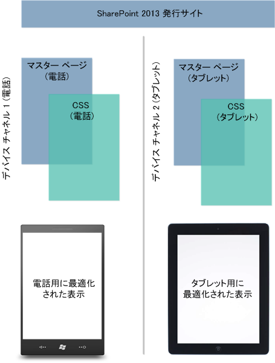
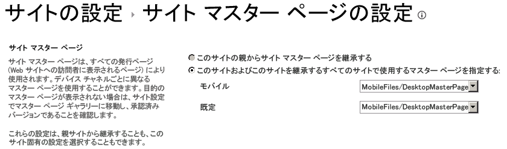

# SharePoint 2013 デザイン マネージャーのデバイス チャネル
SharePoint 2013 サイトでのデバイス チャネル エクスペリエンスについて説明し、計画を作成し、設定します。
## デバイス チャネルの概要
<a name="Int"> </a>

モバイル デバイスでの Web の参照は現在では非常に一般的なので、スマートフォンや、タブレットなどその他のモバイル デバイスで読みやすく、使いやすいように、SharePoint サイトを最適化する必要があります。SharePoint 2013 のデバイス チャネルを使用すると、異なるデバイスを対象とする異なるデザインを使用することにより、1 つの発行サイトを複数の方法でレンダリングできます。この記事は、SharePoint 2013 のデバイス チャネル機能の使用を計画するのに役立ちます。この記事では、機能自体の詳細と、デバイス チャネルの作成に必要な情報について説明します。また、この記事を読めば、実装する必要があるデバイス チャネルや、これらのチャネルの実装方法について理解できます。
  
    
    
デバイス チャネルは、SharePoint 2013 発行サイトでのみ使用可能です。デバイス チャネルを実装する前に、SharePoint サイトのパーツについて、SharePoint ページが結合される方法、およびデザイン マネージャーについて、基本を理解しておく必要があります。マスター ページとページ レイアウトを含む、SharePoint ページ モデルの詳細については、「 [SharePoint 2013 ページ モデルの概要](overview-of-the-sharepoint-2013-page-model.md)」を参照してください。デザイン マネージャーの詳細については、「 [SharePoint 2013 のデザイン マネージャーの概要](overview-of-design-manager-in-sharepoint-2013.md)」を参照してください。
  
    
    

## デバイス チャネルとは
<a name="WhatDev"> </a>

デバイス チャネルは SharePoint 2013 発行インフラストラクチャの一部で、これを使用すると、さまざまなデバイス プール間で同じ URL を維持しつつ、特定のサイト コンテンツをレンダリングしたり、コンテンツにスタイルを設定したり、画像を変更したりもできます。デスクトップ版の SharePoint サイトと比べると、モバイル レンダリングはより狭い幅で書式設定を行い、より幅広いタッチ ターゲットを使用してナビゲーションを向上させ、表示する情報量を減らしてユーザビリティを改善することができます。1 つのサイトを作成して、各種モバイル デバイスのすべてに対して一度だけコンテンツを作成および編集できます。スマートフォンやタブレットなどのモバイル デバイスから SharePoint サイトを参照すると、モバイル ブラウザーによって、ユーザー エージェント文字列を含む HTTP GET 要求がサイトに送信されます。この文字列には、サイトにアクセスしようとしているデバイスの種類に関する情報が含まれます。そのデバイス部分文字列に基づいて、デバイス ブラウザーを特定のマスター ページ ビューにリダイレクトできます。たとえば、Windows Phone と iPad デバイスのコレクションがある場合、デバイス チャネルを使用することによって、SharePoint 発行サイトをプールごとに一意にレンダリングできます。デバイス チャネルにはそれぞれ異なるマスター ページと、ユーザーに対する表示をより最適化するための CSS ファイルを指定できます。図 1 に、電話とタブレット デバイスに対してサイトをそれぞれ一意にレンダリングする、2 つのデバイス チャネルの使用法を示します。
  
    
    
図 1. 異なるデバイス プラットフォーム間でのデバイス チャネルの使用
  
    
    

  
    
    

  
    
    
[ **外観**] セクションの [ **サイトの設定**] メニューから、あるいは同じセクションの [ **デザイン マネージャー**] オプションから、デバイス チャネルを作成および構成できます。デバイス チャネル アイテムを作成する場合、作成プロセスで 5 つの必須およびオプションのフィールドを指定できます。表 1 に、これらのフィールドを一覧表示し、指定する必要がある情報の種類を説明します。
  
    
    

**表 1. デバイス チャネル作成のための必須フィールドとオプション フィールド**


|**フィールド**|**必須か**|**値**|
|:-----|:-----|:-----|
|名前  <br/> |はい  <br/> |デザイン チャネルの名前です。チャネルを識別するわかりやすい名前を指定できます。  <br/> |
|エイリアス  <br/> |はい  <br/> |エイリアス名を使用することにより、コード、デバイス チャネル パネル (この記事で後述します)、プレビュー、およびその他のコンテキストでデバイス チャネルを識別できます。  <br/> > **重要**> 後でチャネルのエイリアスを変更する場合は、マスター ページのマッピング、デバイス チャネル パネル、およびすべてのカスタムのコードまたはマークアップを手動で更新する必要があります。           |
|説明  <br/> |いいえ  <br/> |デバイス チャネルの一般的な説明を指定するフィールド。  <br/> |
|デバイス判定ルール  <br/> |はい  <br/> |「Windows Phone OS」などのユーザー エージェント部分文字列を指定するフィールド。特定のマスター ページへのデバイス リダイレクションは、この値の入力内容に依存します。このフィールドで指定する値の詳細については、この記事の「 [ユーザー エージェント部分文字列とデバイス チャネルのランク付け](#PlanDeviceChannels_UserAgentSubstrings)」セクションを参照してください。  <br/> |
|アクティブ  <br/> |いいえ  <br/> |このチェック ボックスをオンにすると、デバイス チャネルがアクティブになります。ライブ サイトで作業している場合は、デザインを完了するまでチャネルをアクティブにしないでください。テストでは、ブラウザー内でクエリ文字列  `?DeviceChannel=alias` を使用して、特定のチャネル用にサイトをプレビューできます。 <br/> |
   

  
    
    

    
> **メモ**
> デバイス チャネルの作成の詳細と手順については、この記事の「 [デバイス チャネルの作成](sharepoint-2013-design-manager-device-channels.md#create)」セクションを参照してください。 
  
    
    

デバイス チャネルを作成してアクティブ化したら、モバイル版など特定のマスター ページへのデバイス リダイレクションが可能になります。次の手順は、[ **サイト マスター ページの設定**] から、またはデザイン マネージャーで [ **デザインの発行と適用**] オプションを使用して、サイト レベルでモバイル デバイス用に表示するマスター ページを指定することです。
  
    
    

**図 2. モバイル デバイス表示用および既定のデスクトップ表示用のマスター ページの設定**

  
    
    

  
    
    

  
    
    
図 2 に示すように、サイトの通常のデスクトップ表示用には特定のマスター ページを、デバイス リダイレクション用にはモバイル マスター ページを割り当てることができます。モバイル マスター ページと既定のマスター ページのどちらをレンダリングするかは、構成済みのアクティブなデバイス チャネルによって異なります。具体的には、デバイス チャネルの作成プロセスで指定された、デバイス判定ルールの部分文字列によって決まります。
  
    
    

### ユーザー エージェント部分文字列とデバイス チャネルのランク付け
<a name="PlanDeviceChannels_UserAgentSubstrings"> </a>

デバイス チャネルの作成時に、指定したマスター ページへのデバイス リダイレクションを行うためのユーザー エージェント部分文字列を指定するように要求されます。[ **デバイス判定ルール**] フィールドにこの値を入力しない場合、デバイス リダイレクションを行うことはできず、チャネルは作成できません。表 2 に、デバイス チャネルの作成時に使用できる、ユーザー エージェント部分文字列値の例を示します。
  
    
    

**表 2. ユーザー エージェント部分文字列値の例**


|**デバイス**|**ユーザー エージェント部分文字列**|
|:-----|:-----|
|Windows Phone  <br/> | Windows Phone OS 7.5 (Windows Phone 7.5 固有) <br/>  Windows Phone OS (すべての Windows Phone バージョン用の一般的な部分文字列) <br/> |
|iPhone  <br/> |iPhone  <br/> |
|iPad  <br/> |iPad  <br/> |
|Android  <br/> |Android  <br/> |
   
[ **デバイス判定ルール**] フィールドには、判定するデバイスの部分文字列値のみを追加します。
  
    
    

> **重要**
> ユーザー エージェント部分文字列値はデバイス メーカーごとに異なり、前述の Windows Phone の例でわかるように、同じブランドのデバイス セット間でも異なることがあります。特定のプールへのトラフィックのリダイレクションを正常に行うには、ユーザー エージェント部分文字列に一意の識別子を付与する必要があります。異なるデバイス間で部分文字列を分ける方法の詳細については、この記事の「 [デバイス チャネルの使用の計画](sharepoint-2013-design-manager-device-channels.md#plan)」セクションを参照してください。 
  
    
    

作成されたデバイス チャネルは順序付けられてリストに格納されます。SharePoint 2013 ではサイトごとに最大 10 個のデバイス チャネルをサポートできるため、トラフィック ルーティングを適切に行うにはチャネルをランク付けしなければならないことがあります。最も明確なルールを一番上に順序付けて、優先度を最も高くする必要があります。たとえば、組織内に複数の OS バージョンの Windows Phone デバイスがあり、Windows Phone 7.5 デバイス用に一意のマスター ページをレンダリングする必要があるとします。その他すべての Windows Phone デバイスには、別のモバイル マスター ページ ビューを割り当てます。表 3 に、適用可能な 2 つの順序付けスキームと、ルーティングの決定に対する影響を示します。
  
    
    

> **メモ**
> デバイス チャネルの順番を変更する方法の詳細については、この記事の「 [デバイス チャネルの作成](sharepoint-2013-design-manager-device-channels.md#create)」セクションを参照してください。 
  
    
    


**表 3. デバイス チャネルの順序付けの例**


|**順序 1 (デバイス チャネル)**|**順序 2 (デバイス チャネル)**|
|:-----|:-----|
|デバイス チャネル 1 — Windows Phone OS 7.5  <br/> |デバイス チャネル 1 — Windows Phone OS  <br/> |
|デバイス チャネル 2 — Windows Phone OS  <br/> |デバイス チャネル 2 — Windows Phone OS 7.5  <br/> |
|デバイス チャネル 3 — 既定  <br/> |デバイス チャネル 3 — 既定  <br/> |
   
デバイス判定ルールの部分文字列が **Windows Phone OS 7.5** に設定されている順序 1 を選択した場合、Windows Phone 7.5 デバイスを使用してサイトを参照するユーザーにはデバイス チャネル 1 が割り当てられます。それ以外のバージョンの Windows Phone を使用しているユーザーにはデバイス チャネル 2 が割り当てられ、Windows Phone 以外のユーザーにはデバイス チャネル 3 が割り当てられます。しかし、一般的な Windows Phone OS 部分文字列を優先する順序 2 を選択した場合は、すべての Windows Phone のトラフィックにデバイス チャネル 1 が割り当てられます。デバイス チャネル 1 の優先順位付けと汎用性のため、Windows Phone 7.5 デバイスに対してデバイス チャネル 2 は呼び出されません。複数のデバイス チャネルを作成する場合は、順序とランク付けがデバイス プールのトラフィック リダイレクションにどのように影響を与えるかを理解することが重要です。
  
    
    

> **メモ**
> デバイス チャネルの順序付けの詳細と手順については、この記事の「 [デバイス チャネルの順序の変更](sharepoint-2013-design-manager-device-channels.md#reorder)」セクションを参照してください。 
  
    
    


### デバイス チャネル パネル
<a name="PlanDeviceChannels_UserAgentSubstrings"> </a>

デバイス チャネル パネルは、指定したデバイス チャネルのエイリアスに基づいて特定のコンテンツをレンダリングする場合に、マスター ページまたはページ レイアウトで使用できるコンテナーです。たとえば、ある Web パーツまたはコントロールをサイトのデスクトップ ビューにのみ表示させ、モバイル デバイスには表示させたくないものとします。デバイス チャネル パネルを使用すると、この Web パーツをコード内にカプセル化して、指定したデバイス チャネルを通じてのみレンダリングできます。CSS クラスでの  `Display:None` の使用に比べ、デバイス チャネル パネルの主要な利点は、指定されていないチャネルにはデバイス チャネル パネル内のコンテンツがまったくレンダリングされないことです。また、デバイス チャネル パネルを使用すると、大きいコンテンツを除去することにより、デバイス用のページのレンダリング サイズを小さくすることもできます。そのため、帯域幅に制約があるデバイス上でサイトの応答性が向上します。
  
    
    
マスター ページまたはページ レイアウトをプレビューする際に、スニペット ギャラリーからデバイス チャネル パネル スニペットを作成できます。次の HTML の例では、デバイス チャネル パネルの作成方法を示します。このシナリオでは、特定のデバイス チャネルに対してのみレンダリングされるテキストの段落を挿入します。属性 **IncludedChannels** は、構成済みのデバイス チャネルのエイリアスを指定する場所です。エイリアスは、デバイス チャネルの作成プロセスで割り当てられ、コード内で参照できる名前です。
  
    
    

  
    
    


```HTML

<div data-name="DeviceChannelPanel">
 <!--CS: Start device channel panel snippet.-->
<!--SPM:<%@Register Tagprefix="Publishing" Namespace="Microsoft.SharePoint.Publishing.WebControls" Assembly="Microsoft.SharePoint.Publishing, Version=15.0.0.0, Culture=neutral, PublicKeyToken=62TDCXXXXXXXXXX
<!--MS:<Publishing:MobilePanel runat="server" IncludedChannels="DEFAULT">-->
<p>
This paragraph of content shows up only in the default channel, which means that you can use the same page layout for all your different devices. You can put HTML content, page fields, web parts, or CSS/JavaScript links within a device channel panel so that the content loads only on your specified channels.
</p>
<!--ME:</Publishing:MobilePanel>-->
<!--CE: End Device Channel Panel Snippet-->
</div>
```

複数のチャネルにコンテンツを表示する場合は、 `IncludedChannels="alias1, alias2"` のように、複数のエイリアスをコンマで区切って引用符で囲みます。デバイス チャネル パネル コンテナーの詳細については、「 [SharePoint 2013 ページ モデルの概要](overview-of-the-sharepoint-2013-page-model.md)」を参照してください。デザイン マネージャー スニペットの使用の詳細については、「 [SharePoint 2013 デザイン マネージャー スニペット](sharepoint-2013-design-manager-snippets.md)」を参照してください。
  
    
    

## デバイス チャネルの使用の計画
<a name="plan"> </a>

組織にデバイス チャネルを実装する前に、いくつかの質問に答えたり、いくつかの情報を収集したりする必要があります。このセクションは、デバイスとユーザビリティのニーズに関連する質問を行い、この機能へのアプローチに関するガイダンスを提供することで、デバイス チャネルの使用を計画できるようにします。このセクションの質問は、個別にではなく順番に読むことを意図しています。
  
    
    

### デスクトップおよび個人用デバイスでどのようなサイトの操作性を実現しようとしているか

ほとんどの組織と同様に、ユーザーの組織のニーズに基づいた独自のユーザビリティ要件があります。理想的なゴールは、デスクトップかデバイスかにかかわらず、このような操作性をあらゆる種類のフォーム ファクターに最適に変換することです。しかし、幅広く一般化されているにもかかわらず、タッチ操作に対してさまざまな解像度とより狭い画面面積を扱う場合は特に、このプロセスは依然として複雑です。また、所有する電話の中には、他の電話には不要な独自の UI のカスタマイズが必要なものがあることもあります。このようなシナリオでは、Web 開発が困難な場合があります。複数のデバイス ブランドに 1 つのマスター ページを割り当てることができない場合は、さらに困難になります。
  
    
    
最初の作業は、複数デバイスで優れたユーザー エクスペリエンスを得るために実現すべき機能を書き留めることです。ユーザー基盤がデスクトップ、電話、タブレット上の SharePoint 2013 発行サイトで実行したい機能は何でしょうか。考えられる制限や、個別のデバイスについて検討する必要がある事柄など、さまざまな問題が見つかる可能性があります。これらの情報すべてを何らかの形式で記録してください。デバイス チャネル機能で実現する具体的な目標を理解したり、サポートするデバイスや実装する必要があるデバイス チャネル数など、以下に挙げる一連の質問に回答するのにも役立ちます。
  
    
    
また、計画に関するさまざまな問題を解決できる、デバイス チャネル機能のいくつかの主要機能を覚えておくことも重要です。例としては、一意のマスター ページから複数デバイスへマッピングを行うための複数デバイス チャネルのサポートがあります。デバイス チャネル パネルの使用によって、異なるデバイス プール間でさまざまなコンテンツ要素を選択的に表示することもできます。
  
    
    

### デバイス チャネルはいくつ必要か

社内インストール用のサイトに対しては既定を含む最大 10 個のデバイス チャネルを、SharePoint Online の使用時は合計 2 個のデバイス チャネルを構成できます。ユーザーの組織では、1 つのデバイス チャネルを作成し、すべてのデバイスを表す複数のデバイス判定ルールを適用し、特定のマスター ページにリダイレクトするのと同様に簡単に行える可能性があります。理想としては、できる限り少ないデバイス チャネルの数が最適です。しかし、デバイスの違いや独自の HTML/CSS のカスタマイズによって、チャネルを 1 つだけにすることができず、追加のデバイス チャネルが必要な場合があります。
  
    
    
デバイス チャネルの数を決定するには、デバイスを超えたサイトの目的、サポートする予定のデバイス、および前述の質問から必要なカスタマイズのレベルに関して収集した情報を参照する必要があります。この情報を利用して、実装するチャネルの一覧を作成します。1 つのデバイス チャネルに割り当てられたモバイル マスター ページですべての要件に対処できますか。あるいは、タブレットごとに個別のマスター ページを関連付ける必要があるため、複数のチャネルが必要ですか。チャネルに名前を付けたり、コード内で参照できるようにチャネルごとに適したエイリアス名を考えるのにも最適な機会です。後でチャネルのエイリアスを変更する場合は、そのエイリアスに対するすべての参照を更新する必要があります。
  
    
    

### 使用可能なすべてのデバイス部分文字列の一覧はどこにあるか

表 2 に示すように、Windows Phone OS や iPhone など、デバイス リダイレクションに使用できる一般的なメーカーのユーザー エージェント部分文字列がいくつかあります。[ **デバイス判定ルール**] フィールドに必要な部分文字列は、通常は、デバイスがサイトに接続するときに提供される、はるかに長いユーザー エージェント文字列のサブセットです。メーカーまたはソフトウェア プロバイダーの Web サイトで探すか、一般的な Web ベース検索で、デバイス固有の文字列を見つけることをお勧めします。場合によっては、ユーザー エージェント文字列構成内で、バージョン情報付きの特定の部分文字列と類似文字列を分けるのが難しいこともあります。表 4 に、Windows 8 デスクトップ用とタブレット デバイス用の 2 つのユーザー エージェント文字列の例を示します。
  
    
    

> **メモ**
> 以下の文字列は例であり、対象の Windows デバイスの本物の文字列ではありません。これらの文字列は、必要に応じて部分文字列を分けるポイントを説明するためのものです。 
  
    
    


**表 4. ユーザー エージェント文字列の違い**


|**デバイス**|**ユーザー エージェント文字列**|
|:-----|:-----|
|Windows 8 デスクトップ  <br/> |(compatible; MSIE 10.0; Windows NT 6.2; WOW64; Trident/6.0)  <br/> |
|Windows 8 タブレット (例)  <br/> |(compatible; MSIE 10.0; Windows NT 6.2; WOW64; Trident/6.0; touch)  <br/> |
   
これらの文字列の形式は非常に似ています。唯一の違いは、Windows 8 タブレットの例には  `touch` が含まれることです。このシナリオでは、タブレット デバイス用に固有のマスター ページをレンダリングする必要がある場合は、デバイス判定ルールの作成時に部分文字列として `touch` を指定します。このような状況を扱う場合に重要なのは、似た文字列の相違点を見つけることです。 **MSIE 10.0** などの共通の値を使用するデバイス判定ルールでデバイス チャネルを作成しようとすると、デスクトップとタブレットを区別する方法がなくなります。
  
    
    

### デバイス チャネル パネルを使用する必要があるか

必要はありません。デバイス チャネル パネルは、異なるデバイス間でいくつかの UI ベースの要素のレンダリングを許可、調整、または禁止する場合に役立ちます。たとえば、iPhone には表示したいが、Android デバイスには表示したくないテキストまたはコントロールがあるとします。理由としては、そのフォーム ファクターの画面サイズがより小さく、ユーザビリティに影響を受けることが考えられます。条件にかかわらず、デバイス チャネル パネルに作成済みのデバイス チャネルのエイリアスを割り当てて、このレベルでの区別に必要な柔軟性を実現することができます。1 つのマスター ページを組織内のさまざまなデバイス グループに適用しない理由があるかというのはいい質問です。理由がある場合は、固有ののデバイス ニーズを満たす、よりきめ細かな開発を行えるようにする上で、デバイス チャネル パネルは最適な選択肢となる可能性があります。また、デバイス チャネル パネルを使用して、チャネル固有の CSS をページ レイアウトに追加することもできます。
  
    
    

### Cookie を使用してデバイス チャネルを選択できるか

はい、Cookie を使用して、デバイス チャネルの選択を強制または優先することができます。これを行うには、deviceChannel というブラウザー Cookie を作成し、指定したデバイス チャネルのエイリアスを設定する必要があります。また、デバイス チャネルによって、現在のチャネルのエイリアスを格納した **effectiveDeviceChannel** という JavaScript 変数を設定できます。この変数を使用して、現在使用されているチャネルを表示できます。サイトで JavaScript 変数を生成するには、このプロパティを次のルート Web のプロパティ バッグに追加します。
  
    
    

```

key = PublishingInformationControlIncludeEffectiveDeviceChannel, value = true
```

この変数を使用して、ページ上のコンテンツおよび Web パーツの並べ替えに影響を与えることもできます。
  
    
    

## デバイス チャネルの作成
<a name="create"> </a>

新しいデバイス チャネルを作成するには、次の手順を実行します。
  
    
    

### デバイス チャネルを作成するには


1. デザイン マネージャーを起動します (たとえば、[ **設定**] メニューの [ **デザイン マネージャー**] を選択します)。
    
  
2. 番号付きリストで、[ **デバイス チャネルの管理**] を選択します。
    
  
3. [デザイン マネージャー: デバイス チャネルの管理] ページで、[ **チャネルの作成**] を選択します。
    
  
4. [デバイス チャネル - 新しいアイテム] ページで、[ **名前**] テキスト ボックスにデバイス チャネルの名前を入力します。
    
  
5. [ **エイリアス**] テキスト ボックスにデバイス チャネルの別名を入力します。別名は英数字でなければならず、スペースを含めることはできません。別名はコードやその他のコンテキストでデバイス チャネルを参照するために使用します。
    
  
6. [ **説明**] テキスト ボックスに、チャネルが適用されるデバイスやブラウザーの簡単な説明を入力します。
    
  
7. [ **デバイス判定ルール**] テキスト ボックスに、チャネルに対応するユーザー エージェント文字列を入力します。ここで指定したいずれかの文字列が要求のユーザー エージェント文字列に適合した場合、Web ページの要求はこのチャネルを使用します。
    
  
8. チャネルをページのレンダリングに使用する準備ができたら、[ **アクティブ**] チェック ボックスをオンにします。
    
  
9. [ **保存**] を選択します。
    
  

## デバイス チャネルの変更
<a name="modify"> </a>

既存のデバイス チャネルを変更するには、次の手順を実行します。
  
    
    

> **メモ**
> 既定のチャネルは変更できません。 
  
    
    


### デバイス チャネルを変更するには


1. デザイン マネージャーを起動します (たとえば、[ **設定**] メニューの [ **デザイン マネージャー**] を選択します)。
    
  
2. 番号付きリストで、[ **デバイス チャネルの管理**] を選択します。
    
  
3. [デザイン マネージャー: デバイス チャネルの管理] ページで、[ **既存のチャネルの編集または並べ替え**] を選択します。
    
  
4. [ **デバイス チャネル**] の一覧で、変更するデバイス チャネルを選択し、[ **アイテム**] タブで [ **アイテムの編集**] を選択します。
    
  
5. デバイス チャネルの名前を変更するには、[ **名前**] テキスト ボックスに新しい名前を入力します。
    
  
6. デバイス チャネルの別名を変更するには、[ **エイリアス**] テキスト ボックスに新しい別名を入力します。
    
    > **メモ**
      > デバイス チャネルの別名を変更する場合は、別名を使用している他の場所でも別名を手動で変更する必要があります。たとえば、ユーザー設定コードやマークアップ内の別名を手動で変更し、デバイス チャネルとマスター ページの間の対応付けを手動で変更する必要があります。 
7. デバイス チャネルの説明を変更するには、[ **説明**] テキスト ボックスに新しい説明を入力します。
    
  
8. デバイス判定ルールを変更するには、[ **デバイス判定ルール**] テキスト ボックスの文字列を編集します。
    
  
9. デバイス チャネルをアクティブにするには、[ **アクティブ**] チェック ボックスをオンにします。チャネルを非アクティブにするには、[ **アクティブ**] チェック ボックスをオフにします。
    
  
10. [ **保存**] を選択します。
    
  

## デバイス チャネルの削除
<a name="delete"> </a>

既存のデバイス チャネルを削除するには、次の手順を実行します。
  
    
    

> **メモ**
> 既定のチャネルは削除できません。 
  
    
    


### デバイス チャネルを削除するには


1. デザイン マネージャーを起動します (たとえば、[ **設定**] メニューの [ **デザイン マネージャー**] を選択します)。
    
  
2. 番号付きリストで、[ **デバイス チャネルの管理**] を選択します。
    
  
3. [デザイン マネージャー: デバイス チャネルの管理] ページで、[ **既存のチャネルの編集または並べ替え**] を選択します。
    
  
4. [ **デバイス チャネル**] の一覧で、削除するデバイス チャネルを選択します。
    
  
5. [ **アイテム**] タブで、[ **アイテムの削除**] を選択します。
    
  
6. [ **OK**] をクリックします。
    
  

## デバイス チャネルの順序の変更
<a name="reorder"> </a>

デバイス チャネルの順序を変更するには、次の手順を実行します。
  
    
    

### デバイス チャネルをランク付けするには


1. デザイン マネージャーを起動します (たとえば、[ **設定**] メニューの [ **デザイン マネージャー**] を選択します)。
    
  
2. 番号付きリストで、[ **デバイス チャネルの管理**] を選択します。
    
  
3. [デザイン マネージャー: デバイス チャネルの管理] ページで、[ **既存のチャネルの編集または並べ替え**] を選択します。
    
  
4. [ **アイテム**] タブで、[ **チャネルのランク付け**] を選択します。
    
  
5. [デバイス チャネルのランク付け] ページで、順序を変更するチャネルを選択し、[ **上へ移動**] または [ **下へ移動**] を選択します。
    
  
6. チャネルが望みどおりの順序になったら、[ **OK**] を選択します。
    
  

## その他のリソース
<a name="PlanDeviceChannels_addresources"> </a>


-  [SharePoint 2013 のサイト デザインの開発](develop-the-site-design-in-sharepoint-2013.md)
    
  
-  [SharePoint 2013 ページ モデルの概要](overview-of-the-sharepoint-2013-page-model.md)
    
  
-  [SharePoint 2013 のデザイン マネージャーの概要](overview-of-design-manager-in-sharepoint-2013.md)
    
  
