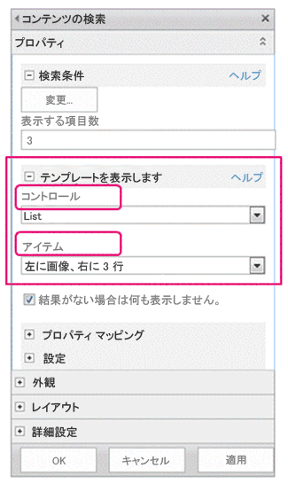
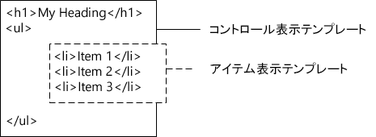

# SharePoint 2013 デザイン マネージャー表示テンプレート
表示テンプレートについて説明します。表示テンプレートが検索 Web パーツとどのように関係しているか、どのようにテンプレートが構成されているか、プロパティのマップ方法および変数と jQuery の使用方法、および SharePoint Server 2013 でカスタムの表示テンプレートを作成する方法を説明します。
## 表示テンプレートの概要
<a name="bk_introduction"> </a>

SharePoint Server 2013 の表示テンプレートは、検索インデックスに作成されたクエリの結果を表示するために検索テクノロジを使用する Web パーツ (この記事では、検索 Web パーツと呼ばれる) で使用されるテンプレートです。表示テンプレートは、どの管理プロパティが検索結果に表示され、それらがどのように Web パーツに表示されるかをコントロールします。各表示テンプレートは、2 つのファイル (HTML エディターで編集できる HTML バージョンの表示テンプレートと、SharePoint が使用する .js ファイル) から成ります。
  
    
    

> **メモ**
> 表示テンプレートを使用できるのは検索 Web パーツのみです。コンテンツ クエリ Web パーツは検索型ではないため、表示テンプレートは使用しません。 
  
    
    

デザイン マネージャーで既存の表示テンプレートを表示することはできますが、マスター ページおよびページ レイアウトを作成する方法で、表示テンプレートをデザイン マネージャーで作成することはありません。代わりに、以下の操作を実行します。
  
    
    

-  [マスター ページ ギャラリーにマップされたネットワーク ドライブを開きます。](how-to-map-a-network-drive-to-the-sharepoint-2013-master-page-gallery.md).
    
  
- **Display Templates** フォルダー内の 4 つのフォルダーの 1 つを開きます。
    
    > **メモ**
      > 選択するフォルダーは、使用する表示テンプレートの種類によって異なります。たとえば、サイトがクロスサイト発行を使用する場合、 **Content Web Parts** フォルダーから表示テンプレートをコピーします。詳細については、「 [SharePoint Server 2013 の表示テンプレート参照](http://technet.microsoft.com/ja-jp/library/jj944947.aspx)」を参照してください。 
- 目的のものに類似している既存の表示テンプレートの HTML ファイルをコピーします。ファイルのコピー先は、 **マスター ページ ギャラリー**内であれば場所は問いません。
    
  
- HTML エディターで、コピーを開いて変更します。
    
  
既存の表示テンプレートを、新しい表示テンプレートの開始点として使用することで、既定の表示テンプレートのコメント内にあるカスタマイズ プロセスに関する有益な情報を活用できます。また、入力フィールドのマッピングなどの基本タスク用のフレームワークがあらかじめ用意されています。さらに、これにより、テンプレートで正しい基本ページ構造が確実に使用されます。
  
    
    
 **マスター ページ ギャラリー** で **Display Templates** フォルダー内の既存の表示テンプレートの HTML ファイルをコピーして、表示テンプレートを作成すると、以下の処理が行われます。
  
    
    

- HTML ファイルのコピー先の場所に、同じ名前を持つ .js ファイルが作成されます。
    
  
- 表示テンプレートが正しく表示されるように、SharePoint Server 2013 で必要なすべてのマークアップが .js ファイルにコピーされます。
    
  
- HTML ファイルと .js ファイルが関連付けられます。これにより、HTML ファイルに対する以降のすべての編集が、HTML ファイルの保存時に .js ファイルに同期されるようになります。
    
  

> **メモ**
> 同期は一方向にのみ行われます。HTML 表示テンプレートに対する変更が、関連付けられた .js ファイルに同期されます。マスター ページおよびページ レイアウトとは異なり、表示テンプレートを操作する際に、ファイル間の関連付けを解除して .js ファイルのみを操作することを選択することはできません。HTML ファイルにすべての HTML および JavaScript を入力する必要があります。 
  
    
    


## 表示テンプレートと検索 Web パーツの関係について
<a name="bk_DTandSWP"> </a>

表示テンプレートには、以下の 2 つの主要な種類があります。
  
    
    

- **コントロール テンプレート**は、結果を表示する方法 (リスト、ページングを含むリスト、スライドショーなど) の全体的な構造を決定します。
    
  
- **アイテム テンプレート**は、セット内の各結果を表示する方法 (イメージ、テキスト、動画などのアイテム) を決定します。
    
  
これらおよびその他の表示テンプレートの詳細については、「 [SharePoint Server 2013 の表示テンプレート参照](http://technet.microsoft.com/ja-jp/library/jj944947.aspx)」を参照してください。
  
    
    
検索 Web パーツ (コンテンツ検索 Web パーツなど) をページに追加した後、Web パーツを構成するには、図 1 に示すように、コントロール表示テンプレートとイテム表示テンプレートの両方を選択します。
  
    
    

**図 1. コンテンツ検索 Web パーツのツール ウィンドウ**

  
    
    

  
    
    

  
    
    
コントロール表示テンプレートは、検索結果を表示する方法の全体的なレイアウトを構成する HTML を提供します。たとえば、コントロール表示テンプレートには、見出しおよびリストの始まりと終わりの HTML が用意されています。コントロール表示テンプレートは、Web パーツに一度だけレンダリングされます。
  
    
    
アイテム表示テンプレートには、結果セット内の各アイテムを表示する方法を決定する HTML があります。たとえば、アイテム表示テンプレートは、画像を含むリストアイテム、およびそのアイテムに関連付けられたさまざまな管理プロパティにマップされる 3 行のテキストに対して、HTML を提供します。アイテム表示テンプレートは、結果セット内の各アイテムに対して 1 回レンダリングされます。したがって、結果セットに 10 個のアイテムが含まれる場合、アイテム表示テンプレートは HTML のそのセクションを 10 回作成します。
  
    
    
図 2 に示すように、コントロール表示テンプレートとアイテム表示テンプレートは、この方法で一緒に使用すると、結合されて、Web パーツにレンダリングされる HTML のひとまとまりのブロックを形成します。
  
    
    

**図 2. コントロール表示テンプレートとアイテム表示テンプレートの結合 HTML 出力**

  
    
    

  
    
    

  
    
    
表示テンプレートの詳細については、「 [SharePoint 2013 ページ モデルの概要](overview-of-the-sharepoint-2013-page-model.md)」の「検索型 Web パーツおよび表示テンプレート」セクションを参照してください。
  
    
    

## 表示テンプレートの構造について
<a name="bk_DTstructure"> </a>

表示テンプレートに使用される HTML ファイルは、完全に形成された HTML ドキュメントですが、完全な HTML Web ページを表すものではありません。SharePoint は、表示テンプレート HTML ファイルの各部分を JavaScript に変換します。このセクションでは、表示テンプレートの 4 つの主なセクションについて説明します。
  
    
    

### タイトル タグ

表示テンプレート ファイルの **<title>** タグ内のテキストは、検索 Web パーツが編集モードのときに、Web パーツ編集ウィンドウの [ **表示テンプレート**] セクションの表示名として使用されます。以下の例は、Item_Picture3Lines.html という名前のアイテム表示テンプレートの場合です。
  
    
    

```HTML

<title>Picture on left, 3 lines on right</title>
```


### ヘッダー プロパティ

 **<title>** タグの直後には、以下のマークアップで囲まれたカスタム要素のセットが配置されます。
  
    
    

```HTML
<!--[if gte mso 9]><xml>
<mso:CustomDocumentProperties>
…
</mso:CustomDocumentProperties>
</xml><![endif]-->

```

これらの要素およびそのプロパティは、表示テンプレートに関する重要な情報を SharePoint 環境に提供します。表 1 は、表示テンプレートで使用されるカスタム プロパティを示しています。
  
    
    

> **メモ**
> すべての表示テンプレートですべてのカスタム プロパティが使用されるとは限りません。また、デザイン マネージャーで表示テンプレート ファイルのプロパティを編集することによって変更できるプロパティもあります。 
  
    
    


**表 1. CustomDocumentProperties エントリのリスト**


|**プロパティ**|**説明**|
|:-----|:-----|
|**TemplateHidden** <br/> |Web パーツで使用可能なテンプレートのリストから表示テンプレートを非表示にするかどうかを示すブール値。この値は、表示テンプレート ファイル プロパティで変更できます。  <br/> |
|**ManagedPropertyMapping** <br/> |検索結果アイテムによって公開されるフィールドを、JavaScript で使用可能なプロパティにマップします。アイテム テンプレートでのみ使用されます。  <br/> |
|**MasterPageDescription** <br/> |表示テンプレートのわかりやすい説明を提供します。これは、SharePoint 編集環境のユーザーに対して表示されます。この値は、表示テンプレート ファイル プロパティで変更できます。  <br/> |
|**ContentTypeId** <br/> |表示テンプレートに関連付けられたコンテンツ タイプの ID。  <br/> |
|**TargetControlType** <br/> |表示テンプレートが使用されるコンテキストを示します。この値は、表示テンプレート ファイル プロパティで変更できます。  <br/> |
|**HtmlDesignAssociated** <br/> |表示テンプレート HTML ファイルに .js ファイルが関連付けられているかどうかを示すブール値。  <br/> |
|**HtmlDesignConversionSucceeded** <br/> |変換プロセスが正常に完了したかどうかを示します。この値は、SharePoint によって自動的にファイルに追加され、カスタムの表示テンプレートでのみ使用されます。  <br/> |
|**HtmlDesignStatusAndPreview** <br/> |HTML ファイルへの URL、および [ **状態**] 列のテキスト ([ **正常に変換されました**] または [ **警告とエラーが発生しています**]) が含まれます。この値は、SharePoint によって自動的にファイルに追加され、カスタムの表示テンプレートでのみ使用されます。  <br/> |
   

### スクリプト ブロック
<a name="bk_scriptblock"> </a>

 **<body>** タグの内部には、以下の **<script>** タグが配置されます。
  
    
    

```HTML

<script>
     $includeLanguageScript(this.url, "~sitecollection/_catalogs/masterpage/Display Templates/Language Files/{Locale}/CustomStrings.js");
</script>
```

既定では、この行はすべての表示テンプレートに含まれます。 **<script>** タグ内には、主な表示テンプレート HTML ファイルの外部の CSS ファイルまたはその他の JavaScript ファイルを参照するコードの行をさらに追加できます。表 2 は、他のリソースを含める方法の例を示しています。
  
    
    

**表 2. <script> タグ内に外部リソースを含める場合の例**


|**含める外部リソース**|**使用するコード**|
|:-----|:-----|
|現在のサイト コレクションに含まれる JavaScript ファイル  <br/> | `$includeScript(this.url, "~sitecollection/_catalogs/masterpage/Display Templates/Content Web Parts/MyScripts.js");` <br/> |
|外部 JavaScript ファイル  <br/> | `$includeScript(this.url, "http://www.contoso.com/ExternalScript.js");` <br/> |
|現在のサイト コレクションに含まれる CSS ファイル  <br/> | `$includeCSS(this.url, "~sitecollection/_catalogs/masterpage/Display Templates/Content Web Parts/MyCSS.css");` <br/> |
|現在の表示テンプレートの相対位置にある CSS ファイル  <br/> | `$includeCSS(this.url,"../../MyStyles/MyCSS.css");` <br/> |
   

> **メモ**
> マスター ページ ギャラリー内のアイテムに対して **コンテンツの承認**が必要な場合、すべてのリソース ファイル (CSS および .js ファイルを含む) をマスター ページおよびページ レイアウトで使用可能にするには、まずそれらを発行する必要があります。詳細については、「 [サイトまたはライブラリのアイテムの承認を必須にする](http://office.microsoft.com/ja-jp/sharepoint-help/require-approval-of-items-in-a-site-list-or-library-HA102853936.aspx?CTT=1)」を参照してください。 
  
    
    


### DIV ブロック
<a name="bk_scriptblock"> </a>

 **<script>** タグの後には、ID を含む **<div>** タグが配置されます。既定では、この **<div>** タグの ID は HTML ファイルの名前と一致します。表示テンプレートで提供するすべての HTML またはコードは、この **<div>** タグ内に配置する必要があります。ただし、タグ自体は、実行時に Web ページ上にレンダリングされるマークアップには含まれません。
  
    
    

> **メモ**
> 実行時にページ上にレンダリングされる HTML のブロックに、CSS スタイルまたは ID を割り当てる場合は、最初の **<div>** タグ内に新しいタグを追加できます。また、コントロール テンプレート内で変数 `_#= ctx.RenderGroups(ctx) =#_` を囲む HTML に、CSS スタイルまたは ID を割り当てることもできます。変数 `_#= ctx.RenderGroups(ctx) =#_` は、アイテム テンプレートによってレンダリングされるクエリ結果を囲む HTML をレンダリングするのに使用されます。
  
    
    

最初の **<div>** タグ内には、 **<!--#_** で始まり **_#-->** で終わるコメント ブロック内のコードが配置されます。これらのブロックの内側では JavaScript コードを使用し、ブロックの外側では HTML を使用します。また、これらのブロックを使用して、条件付きステートメントによって HTML をコントロールすることもできます。そのためには、条件付きステートメントと開き角かっこを含むコメント ブロック、HTML、閉じ角かっこを含むもう 1 つのコメント ブロックの順に配置します。以下の例では、 **linkURL** オブジェクトの値が空でない場合にのみ、ページ上にアンカー タグがレンダリングされます。
  
    
    


```HTML

<!--#_
if(!linkURL.isEmpty)
{
_#-->
     <a class="cbs-pictureImgLink" href="_#= linkURL =#_" title="_#= $htmlEncode(line1.defaultValueRenderer(line1)) =#_" id="_#= pictureLinkId =#_">
<!--#_
}
_#-->

```


## 入力プロパティのマッピングとその値の取得
<a name="bk_mapproperties"> </a>

アイテム表示テンプレートのヘッダー セクションには、 **ManagedPropertyMapping** という名前のカスタムのドキュメント プロパティがあります。このプロパティは、検索で使用される管理プロパティを受け取り、表示テンプレートで使用できる値にそれらのプロパティをマップします。このプロパティは、' _プロパティ表示名_'{ _プロパティ名_}:' _管理プロパティ_' の形式を使用するコンマ区切りの値のリストです。たとえば、 `'Picture URL'{Picture URL}:'PublishingImage;PictureURL;PictureThumbnailURL'` となります。
  
    
    
この形式についてさらに詳しく説明します。
  
    
    

-  _プロパティ表示名_は、表示テンプレートが選択されたときに Web パーツ編集ウィンドウに表示されるプロパティ名です。
    
  
-  _プロパティ名_は、ローカライズされた文字列リソースを使用して管理プロパティの名前を検索する識別子です。この値は、Web パーツ設定メニューの [ **プロパティ マッピング**] セクションにも表示されます。Web パーツの設定を編集する際には、この値を変更することにより、Web パーツに表示されるフィールドにどの管理プロパティを関連付けるかを変更できます。
    
  
-  _管理プロパティ_は、セミコロンで区切られた 1 つ以上の管理プロパティの文字列です。実行時に、リストが左から右へと評価され、現在の検索アイテムの管理プロパティの名前と一致する最初の値が見つかると、その値がこのスロットにマップされます。これにより、複数の種類のアイテムを操作でき、互換プロパティが存在する場合に一貫したレンダリングを使用できる、表示テンプレートを記述することができます。
    
  
プロパティをマップしたら、コード:  `var pictureURL = $getItemValue(ctx, "Picture URL");` を使用して、スクリプト内でその値を取得できます。
  
    
    
 **$getItemValue()** に渡される 2 つ目のパラメーターは、 **ManagedPropertyMapping** 要素で使用される一重引用符内のプロパティ表示名と一致する必要があります。この例では、 **Picture URL** が **$getItemValue()** に渡されるプロパティ名です。
  
    
    
このコードは、値情報オブジェクト ( **valueInfoObj**) を返します。このオブジェクトには、入力値の生の表示と、既定のエンコードが適用された値が含まれます。
  
    
    
JavaScript のセクション内の変数を通常どおりに使用して、変数を操作し、実行時にページ上にレンダリングされる HTML 文字列を作成することができます。ただし、スクリプトで宣言された変数を HTML 内で直接参照するには、形式: _#=  _variableName_ =#_ を使用する必要があります。たとえば、イメージの値として変数 **pictureURL** を使用する場合、HTML: `` を使用します。
  
    
    

## 表示テンプレートでの jQuery の使用
<a name="bk_jQuery"> </a>

表示テンプレートでは jQuery を使用することができます。ただし、以下の 2 つの重要な要因に注意してください。
  
    
    

- 表示テンプレートに jQuery ライブラリを含めるには、この記事で前述した「 [スクリプト ブロック](#bk_scriptblock)」セクションの手順に従います。
    
  
- jQuery 内の ID セレクターを使用する場合、ID の変数を作成するには、コード:  `var containerQueryId = '#' + '_#= containerId =#_';` を使用します。
    
    jQuery 内のセレクターを参照するには、コード:  `$('_#= containerQueryId =#_')` を使用します。
    
  

## 表示テンプレートの作成
<a name="bk_createDT"> </a>

以下の手順を使用して表示テンプレートを作成するには、まず、 **マスター ページ ギャラリー**を示すようにマップされたネットワーク ドライブが必要です。詳細については、「 [[方法]: SharePoint 2013 マスター ページ ギャラリーへのネットワーク ドライブの割り当て](how-to-map-a-network-drive-to-the-sharepoint-2013-master-page-gallery.md)」を参照してください。
  
    
    

### 表示テンプレートを作成するには


1. Windows エクスプローラーを使用して、 **マスター ページ ギャラリー**にマップされたネットワーク ドライブを開きます。
    
  
2. **Display Templates** フォルダーを開いてから、 **Content Web Parts** フォルダーを開きます。
    
  
3. 作成するものに類似している表示テンプレートの HTML ファイルをコピーします。既定の表示テンプレートのリストおよびその説明については、「 [SharePoint Server 2013 の表示テンプレート参照](http://technet.microsoft.com/ja-jp/library/jj944947.aspx)」を参照してください。
    
    この時点で SharePoint Server 2013 は、同じ名前を持つ .js ファイルに HTML ファイルをコピーします。たとえば、コピー元の HTML ファイルの名前が Item_Picture3Line_copy.html である場合、Item_Picture3Lines_copy.js という名前の対応する .js ファイルも作成されます。ファイルの名前を変更すると、対応する .js ファイルの名前も変更されます。
    
  
4. 表示テンプレートをカスタマイズするには、HTML エディターを使用して、マップされたドライブ内の HTML ファイルを開いて編集して、サーバー上に置かれている HTML ファイルを編集します。HTML ファイルを保存するたびに、関連付けられた .js ファイルにすべての変更が同期されます。
    
  
5. 発行サイトに移動します。
    
  
6. ページの右上隅で [ **設定**] を選択し、[ **デザイン マネージャー**] を選択します。
    
  
7. デザイン マネージャーの左側のナビゲーション ウィンドウで、[ **表示テンプレートを編集する**] を選択します。HTML ファイルが表示され、[ **状態**] 列には次の 2 つの状態のどちらかが表示されます。
    
  - **警告とエラーが発生しています**
    
  
  - **正常に変換されました**
    
  

    > **メモ**
      > マスター ページやページ レイアウトとは異なり、プレビュー ページを使用して、表示テンプレートの現在のサーバー側プレビューを表示することはできません。表示テンプレートをプレビューするには、ページにコンテンツ検索 Web パーツを追加してから、コンテンツ検索 Web パーツ編集ウィンドウで表示テンプレートを適用する必要があります。表示テンプレートにエラーがある場合は、コンテンツ検索 Web パーツにエラー メッセージが表示されます。表示テンプレートを正しく表示するには、まずエラーを修正する必要があります。 
8. エラーを修正するには、HTML エディターを使用して、マップされたドライブ上の HTML ファイルを開いて編集することにより、サーバー上に置かれている HTML ファイルを編集します。表示テンプレートを保存してから、表示テンプレートを使用するコンテンツ検索 Web パーツを含むページを再読み込みします。
    
  

## その他の技術情報
<a name="bk_addresources"> </a>


-  [SharePoint 2013 のデザイン マネージャーの概要](overview-of-design-manager-in-sharepoint-2013.md)
    
  
-  [SharePoint 2013 のサイト デザインの開発](develop-the-site-design-in-sharepoint-2013.md)
    
  
-  [方法: SharePoint 2013 で HTML ファイルをマスター ページに変換する](how-to-convert-an-html-file-into-a-master-page-in-sharepoint-2013.md)
    
  
-  [[方法]: SharePoint 2013 でページ レイアウトを作成する方法](how-to-create-a-page-layout-in-sharepoint-2013.md)
    
  
-  [SharePoint 2013 デザイン マネージャーのブランドおよびデザイン機能](sharepoint-2013-design-manager-branding-and-design-capabilities.md)
    
  

