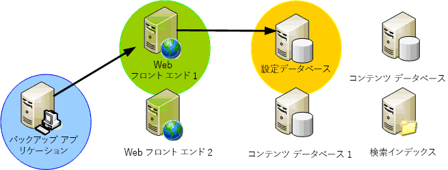
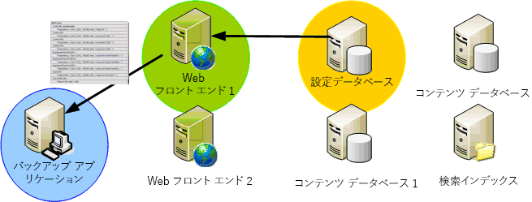
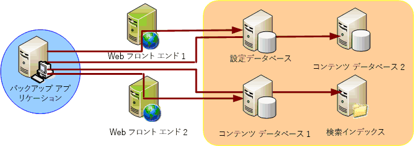

# SharePoint 2013 VSS ライター
 **概要:** Microsoft SharePoint 2013 のボリューム シャドウ コピー サービス (VSS) ライターの特性および機能について説明します。
Windows Server に搭載されている VSS は、組み込みのシャドウ コピー機能を提供するインフラストラクチャです。VSS によって作成されるシャドウ コピーは、ストレージ管理者のテープ バックアップ アーカイブ ソリューションを補強し、簡単かつ効果的に作成および復元できる信頼性の高い任意の時点のコピーを提供することで、ストレージおよびデータ管理をさまざまな面で簡略化できます。Microsoft SharePoint Foundation は VSS を使用し、バックアップおよび復元の操作を簡略化します。 
  
    
    

## システムの特性

SharePoint Foundation VSS ソリューションの機能および特性は、以下のとおりです。
  
    
    

- **単一の VSS 参照ライター。**アプリケーションがバックアップ アプリケーションのためにデータを記述する簡単な方法がありませんでした。さまざまな Windows プラットフォーム アプリケーションを正しくバックアップするために、バックアップ アプリケーションには固有のコードを記述する必要のある多数の API があります。SharePoint Foundation VSS ライター (以降 "SPF-VSS ライター") を使用すると、バックアップ アプリケーションは単一のライターを利用して SharePoint Foundation をバックアップできます。
    
  
- **大きな災害に備えたファーム全体のバックアップと復元。**SPF-VSS ライターを使用すると、バックアップ アプリケーション (リクエスター) は、VSS API にアクセスし、単一ボックス セットアップまたはファーム構成を含む SharePoint Foundation ファーム全体のバックアップおよび復元操作を要求できます (主に  `applicationhost.config` ファイルである IIS 構成ストアは含まれません。この IIS 構成ストアは個別にバックアップおよび復元する必要があります)。
    
  
- **データベースのレベル詳細**。SPF-VSS ライターを使用すると、リクエスターは、バックアップと復元の両方の操作について、全データベース、データベースのセグメント (複数選択)、または単一データベース (単一選択) を選択できます。構成およびサーバーの全体管理のコンテンツ データベースを除くすべてのデータベースを、ライターを使用して選択できます。構成およびサーバーの全体管理のコンテンツ データベースは、ファーム全体の一部としてバックアップおよび復元できます (IIS 構成ストアは含まれません。この IIS 構成ストアは個別にバックアップおよび復元する必要があります)。
    
  
- **データベースのインベントリ。**バックアップを行う前に、SPF-VSS ライターは、ファーム内でバックアップ対象に選択されているデータベースのフラット リストを生成します。このリストは、データベースが物理的に存在する場所でバックアップを実行できるように、リクエスターに返されます。 
    
  
- **ファームのサポート。**ライターは、SharePoint Foundation ファームでのバックアップと回復の同期を、制限された方法でサポートします。ライターは、ファームに関連付けられたサーバー、データベース、およびファイルのリストをリクエスターに提供します。リクエスターは、サーバーごとに個別の接続を確立し、そのサーバーで SPF-VSS ライターを呼び出して、バックアップを生成したり復元操作を実行したりする必要があります。
    
  
- **中断のないコンテンツ バックアップ。**バックアップ中にアプリケーションによってファイルが変更された場合、ファイルが壊れる可能性があります。VSS では、シャドウ コピーにアプリケーションのスナップショットをすばやく作成できるため、アプリケーションを中断することなく元の場所で操作できます。
    
  
- **サードパーティのプラグ可能なデータベース バックアップと復元。**SPF-VSS ライターは、SharePoint Foundation を基にして構築されているサードパーティのソリューションに対して、プラグ可能または拡張可能なバックアップを提供します。ただし、ライターに含まれるのは、構成データベース内で登録されているデータベースだけです。追加ファイルおよび登録されていないデータベースは含まれません。
    
  
- **検索インデックス ファイルのバックアップと復元。**検索インデックス ファイルはファイル システムに格納されているため、それをバックアップするには別のファイル ライターが必要です。これを解決するため、SharePoint Foundation には、検索インデックス ファイルを処理する個別の検索ライターが含まれます。バックアップ アプリケーション ライターの処理を簡略化するため、SharePoint Foundation では、ファーム内の登録済みデータベースをバックアップする際に、検索インデックス ファイルもバックアップまたは復元されるように、ライター間の依存関係が宣言されています。 
    
  
- **完全なロールバック。**SPF-VSS ライターは、構成データベース、コンテンツ データベース、検索データベース、インデックスなど、SharePoint Foundation 展開内のすべてのコンポーネントを処理します。既に説明したように、ライターは検索ライターにも依存しており、検索ライターはバックアップおよび復元のためにすべての検索インデックス ファイルを処理します。復元時には、ライターは、前のファーム バックアップを復元することで、SharePoint Foundation 展開全体をロールバックできます (IIS 構成ストアは含まれません。この IIS 構成ストアは個別にバックアップおよび復元する必要があります)。
    
    > **メモ**
      > 復元に関する重要な情報については、「 [VSS リクエスターと SharePoint 2013](vss-requestors-and-sharepoint-2013.md)」の「復元」を参照してください。 
- **復元後のデータベースの同期。**復元操作が完了した後ですべてのデータベースがファームと同期していることを保証するため、各データベースは、回復の後で自動的にファームとの接続を解除して再接続します。管理者は、復元されたデータベースの同期をとるために余分な手順を実行する必要はありません。
    
  

> **重要**
> SharePoint Foundation ファームで SQL エイリアスを使用して SQL Server に接続する場合、SPF-VSS ライターを使用してバックアップと復元を行うために、ファーム サーバーに SQL クライアント接続コンポーネントをインストールする必要があります。コンポーネントには構成管理用の SQL WMI プロバイダーが含まれ、これは SPF-VSS ライターが適切な SQL Server に対する SQL エイリアスを解決するのに必要です。SQL Management Studio などの管理ツールをインストールする必要はありません。完全な SQL Server 製品をインストールするときに使用するものと同じインストール ソース (データ DVD など) を使用します (スタンドアロンの個別バージョンのクライアント コンポーネントは使用しないでください。このバージョンには SQL WMI プロバイダーは含まれません)。カスタム インストールを選択して、インストールするクライアント コンポーネントのみを選択してください。 
  
    
    

## SPF-VSS ライターが実行する機能

SPF-VSS ライターは次の機能を実行します。
  
    
    

1. SharePoint Foundation コンポーネントを構築します。
    
  - SharePoint Foundation ファーム内の全コンポーネントの完全なリストを作成します。
    
  
  - バックアップ プロセスまたは復元プロセスとは関連付けられるとは限りません。
    
  

  

  

  
2. ファームまたはデータベースをバックアップします。
    
  - VSS を通して SharePoint Foundation (ファーム/データベース) のバックアップを要求します。
    
  

  

  

  
3. ファームまたはデータベースを復元します。
    
  - VSS を通して SharePoint Foundation (ファーム/データベース) の回復を要求します。
    
  
  - サイト テーブルを同期させるために **postRestore()** を実装します。
    
  

  

  

  

## 次の手順

SharePoint 2013 の VSS リクエスターを作成して使用する方法について説明します。
  
    
    

-  [VSS リクエスターと SharePoint 2013](vss-requestors-and-sharepoint-2013.md)
    
  

## その他の技術情報

-  [SharePoint 2013 およびボリューム シャドウ コピー サービスの概要](overview-of-sharepoint-2013-and-the-volume-shadow-copy-service.md)
    
  

