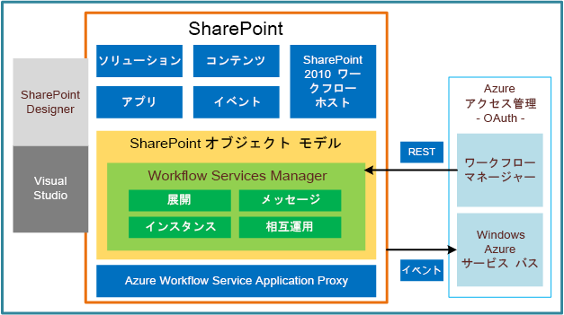

# SharePoint 2013 ワークフローの基盤
プラットフォーム アーキテクチャの概要およびワークフロー相互運用機能ブリッジを含む SharePoint 2013 のワークフロー インフラストラクチャの概要について説明します。
## SharePoint 2013 でのワークフローの概要

SharePoint 2013 のワークフローは、以前のバージョンから大幅に再設計された Windows Workflow Foundation 4 により動作します。Windows Workflow Foundation (WF) は、 [Windows Communication Foundation (WCF)](http://msdn.microsoft.com/ja-jp/library/vstudio/ms735119%28v=vs.90%29.aspx) により提供されるメッセージング機能上に構築されます。
  
    
    
概念的には、ワークフロー モデルはビジネス プロセスの構造をしています。したがって、Windows Workflow Foundation 4 ワークフローは、各々がビジネス プロセスの機能コンポーネントを示すワークフローの "アクティビティ" のコレクションの構造をしています。
  
    
    
SharePoint 2013 のワークフロー プラットフォームは、Windows Workflow Foundation 4 のアクティビティ モデルを使用して SharePoint ベースのビジネス プロセスを表現します。さらに、SharePoint 2013 は、ワークフローを作成する高レベル ステージゲート モデルを導入します。
  
    
    
ワークフロー アクティビティと SharePoint アクションとの間の関係に注意することは重要なことです。ワークフロー アクティビティは、そのメソッドがワークフローの動作を駆動する基となるマネージ オブジェクトのことです。一方、ワークフロー アクションは基となるアクティビティをカプセル化し、SharePoint Designer でユーザー フレンドリーなフォームで示すラッパーです。ワークフロー作成者がワークフロー アクションと対話する一方で、ワークフロー実行エンジンが対応するアクティビティ上で動作します。
  
    
    
アクティビティ クラスの実装であるアクティビティは、XAML を使用して宣言的に実装されます。
  
    
    
ワークフロー アクティビティは、メッセージング API を使用して SharePoint と通信する疎結合された Web サービスを使用して呼び出されます。これらの API は、 [Windows Communication Foundation (WCF)](http://msdn.microsoft.com/ja-jp/library/vstudio/ms735119%28v=vs.90%29.aspx) によって提供されるメッセージング機能上に構築されます。
  
    
    
メッセージング フレームワークは非常に柔軟で、実質的に、必要となるあらゆるメッセージング パターンをサポートします。なお、SharePoint 2013 ファーム上では、Windows Workflow Foundation および WCF はワークフロー マネージャー クライアント 1.0 にホストされます。
  
    
    
ワークフロー マネージャー クライアント 1.0、SharePoint 2013、および SharePoint Designer 2013 はそれぞれ、新しいインフラストラクチャの重要な部分を提供します。
  
    
    

- **ワークフロー マネージャー クライアント 1.0** は、ワークフロー定義の管理機能を提供します。また、ワークフロー インスタンスの実行プロセスをホストします。
    
  
- **SharePoint 2013** は SharePoint ワークフロー用のフレームワークを提供します。これは、SharePoint のドキュメント、リスト、ユーザー、およびタスクを含む SharePoint ベースのビジネス プロセスをモデル化しています。さらに、SharePoint のワークフロー、関連付け、アクティビティ、および他のワークフロー メタデータが、SharePoint 2013 に保存され管理されます。
    
  
- **SharePoint Designer 2013** は、以前のバージョンのように、ワークフロー定義を作成し、それらを発行する主要なビジネス ユーザー ツールです。関連付けられた SharePoint コンポーネントを使用して、または使用せずにワークフロー定義をパッケージ化することもできます。
    
  

## プラットフォーム アーキテクチャ

図 1 は SharePoint 2013 のワークフロー フレームワークの概要を示しています。最初に、この新しいワークフロー インフラストラクチャで新しいワークフロー実行ホストとしてワークフロー マネージャー クライアント 1.0 を導入する方法に注目してください。以前のバージョンでは、ワークフロー実行が SharePoint 自体にホストされましたが、SharePoint 2013 ではこの点が変更されています。ワークフロー マネージャー クライアント 1.0 は SharePoint の外部にあり、Microsoft Azure サービス バス上の共通のプロトコルを使用して OAuth 経由で通信します。それ以外の場合は、SharePoint にコンテンツ アイテム、イベント、アプリなどの必要な機能が含まれています。ただし、下位互換性のために SharePoint 2010 ワークフロー ホスト (つまり、Windows Workflow Foundation 3 エンジン) も実装されます。その詳細については、「 [SharePoint 2013 のワークフロー相互運用機能の使用](use-workflow-interop-for-sharepoint-2013.md)」を参照してください。
  
    
    

**図 1. ワークフロー インフラストラクチャのアーキテクチャの概要**

  
    
    

  
    
    

  
    
    
SharePoint 2013 では、ワークフロー マネージャー クライアント 1.0 は ワークフロー マネージャー クライアント 1.0 サービス アプリケーション プロキシの形態で表されます。このコンポーネントを使用すると、SharePoint は ワークフロー マネージャー クライアント 1.0 サーバーと通信および対話できます。サーバー間の認証は OAuth を使用して提供されます。
  
    
    
ワークフローがリッスンしている **itemCreated**、 **itemUpdated** などの SharePoint イベントは、Microsoft Azure サービス バスを使用してワークフロー マネージャー クライアント 1.0 にルーティングされます。戻る際には、プラットフォームは SharePoint REST (Representational State Transfer) API を使用して SharePoint に呼び戻します。
  
    
    
また、集合的に Workflow Services Manager と呼ばれる SharePoint ワークフロー オブジェクト モデルへの追加もあります。これを使うと、ワークフローとその実行を管理および制御できます。サービス マネージャーの相互作用の主なゾーンは、展開、メッセージング、インスタンス制御、および SharePoint 2010 ワークフローとの相互運用性 (下位互換のため) です。
  
    
    
最後にワークフロー作成コンポーネントがあります。SharePoint Designer は、SharePoint 2010 と SharePoint 2013 のワークフローの両方を作成および展開できるようになりました。Visual Studio 2012 は宣言型のワークフロー作成用のデザイナー画面を提供するだけでなく、ワークフロー マネージャー クライアント 1.0 の機能を完全に統合する SharePoint アドインおよびソリューションを作成できます。
  
    
    

## ワークフローのサブスクリプションと関連付け

SharePoint 2013 ワークフローの最も重要な変更がワークフロー処理を Microsoft Azure のような外部のワークフロー ホストに移動することであるため、SharePoint メッセージおよびイベントは Microsoft Azure のワークフロー インフラストラクチャに接続することが不可欠でした。さらに、Microsoft Azure でインフラストラクチャを顧客データに接続する必要もありました。ワークフローの関連付け (サブスクリプションの WF コンセプトに構築) は、これらの要件に対応する SharePoint インフラストラクチャの一部です。
  
    
    

### Microsoft Azure 発行/購読サービス

ワークフローの関連付けおよびサブスクリプションを議論する前に、pub/sub、または単に PubSub と呼ばれる Microsoft Azure発行/購読サービスについて説明します。PubSub は非同期のメッセージング フレームワークです。メッセージ送信者 (発行者) は、メッセージ受信者 (購読者) にメッセージを直接送信することはありません。代わりに、発行者がメッセージ購読者については知らずにクラスとしてメッセージをレンダリングします。続いて購読者は、発行者に関わらず自身で作成したサブスクリプションに基づいて関心のあるメッセージを識別し、発行されたメッセージを使用します。
  
    
    
このようにメッセージの作成からメッセージの使用を切り離すことによって、スケーラビリティと柔軟性が得られます。また、発行者側でのマルチキャスト メッセージングが可能で、購読者側では不特定多数のメッセージを使用できます。
  
    
    

> **メモ**
> PubSub 機能は Microsoft Azure サービス バスの一部で、WCF および他のサービス エンドポイントに接続オプションを提供します。これらのエンドポイントには、ネットワーク アドレス変換 (NAT) の境界の背後に配置されるか、頻繁に変化し動的に割り当てられる IP アドレスにバインドされるか、またはその両方が可能な REST エンドポイントが含まれます。Azure サービス バスの詳細については、「 [サービス バス](http://msdn.microsoft.com/ja-jp/library/ee732537.aspx)」を参照してください。 
  
    
    

### ワークフローの関連付けと関連付けの範囲

ワークフローの関連付けでは、ワークフロー定義を特定の既定値と共に特定の SharePoint 範囲にバインドします。関連付け自体はサブスクリプション ルールのセットを表します。これらのルールは、適切な (購読した) ワークフロー インスタンスを確実に使用するように受信メッセージを処理する Azure 発行/購読サービスに保存されます。
  
    
    
既定では、メッセージング インフラストラクチャは次の範囲のワークフローに対応します。
  
    
    

-  [SPList](https://msdn.microsoft.com/library/Microsoft.SharePoint.SPList.aspx) (リスト ワークフロー用)
    
  
-  [SPWeb](https://msdn.microsoft.com/library/Microsoft.SharePoint.SPWeb.aspx) (サイト ワークフロー用)
    
  
前のバージョンとは異なり、SharePoint 2013 はコンテンツ タイプ ( [SPContentType](https://msdn.microsoft.com/library/Microsoft.SharePoint.SPContentType.aspx) ) を範囲にしたワークフローはサポートされていません。ただし、メッセージング インフラストラクチャは拡張可能なため、任意の範囲に対応できます。開発者としては、特定の [WorkflowSubscription](https://msdn.microsoft.com/library/Microsoft.SharePoint.WorkflowServices.WorkflowSubscription.aspx) インスタンスにある [EventSourceId](https://msdn.microsoft.com/library/Microsoft.SharePoint.WorkflowServices.WorkflowSubscription.EventSourceId.aspx) プロパティを任意の **guid** に設定できます。その後、その **EventSourceId** 値を使用して、指定された **WorkflowSubscription** の新しいワークフロー インスタンスを生じさせる **PublishEvent(Guid, String, IDictionary<String, Object>)** を呼び出すことができます。
  
    
    

### Microsoft Azure のワークフロー サービス

SharePoint ワークフローの関連付けは、Microsoft Azure 内のワークフロー サービスによって表されます。アプリケーションがワークフローの関連付けおよびそのデータを取得する必要がある場合、指定した範囲で使用可能なワークフロー サービスすべてに対して最初に問い合わせをする必要があります。
  
    
    
同様に、ワークフロー インスタンスはポインターをそれぞれのワークフロー サービスに戻します。これが正しい関連付けが決定される手段となります。
  
    
    

### ワークフローの開始

ワークフローは、手動でまたは自動的に開始できます。
  
    
    
 **手動ワークフロー**
  
    
    
手動ワークフローは、PubSub サービスが **StartWorkflow** メッセージを受信すると開始します。このメッセージには次の宣言型の情報が含まれます。
  
    
    

- 関連付け識別子 ( **WorkflowSubscription** インスタンス)。
    
  
- 発行元のアイテム コンテキストの ID。これは、 **PublishEvent** メソッド呼び出しの _ItemId_ パラメーターおよび **EventSource** プロパティを使用して渡されます。
    
  
- 手動開始用のイベント タイプ ( **WorkflowStart**)。
    
  
- 必要に応じた、サブスクリプションまたは **Init** フォームからの追加のワークフロー開始パラメーター。これは、サブスクリプションでは **CorrelationId** となり、 **Init** フォームでは **WFInstanceId** となります。
    
  
 **自動開始ワークフロー**
  
    
    
自動開始ワークフローは、PubSub サービスへの **Add** メッセージを使用して開始されます。メッセージには次の宣言型の情報が含まれます。
  
    
    

- 発行元のアイテム コンテキストの ID。
    
  
- イベント自体は通常の SharePoint **Add** イベントです。
    
  
- ワークフロー開始パラメーター。
    
  

> **メモ**
> 繰り返し可能なイベント (たとえば、 **OnItemChanged** イベント) でワークフローが自動的に開始する場合、関連付けのワークフローの既存の実行中のインスタンスの実行が終わるまで、指定した関連付け別のワークフローを開始できません。
  
    
    

### ワークフローのサブスクリプション

関連付けを自然に補うものはサブスクリプションで、ワークフローはこれを使って関連付けと対話できます。ワークフローは、サブスクリプションを Azure サービス バス上で **create** メソッドと **delete** メソッドを使用して作成する必要があります。
  
    
    
サブスクリプションを作成してワークフローを開始するメソッドの署名は、パラメーター (省略可能なものと必須なものがある) を指定します。パラメーターのリストはワークフローの作成者が決定するため、ワークフロー定義によって異なる場合があります。サブスクリプション パラメーターのリストは、ワークフロー定義のメタデータとして指定されます。サブスクリプション パラメーターは、サブスクリプションが作成される際に提供されます。初期化パラメーターのリストは、ワークフロー定義の一部として XAML で指定されます。初期化パラメーターは、ワークフローがインスタンス化されるときに提供されます。
  
    
    
サブスクリプションは、特定の SharePoint オブジェクト ( **SPList** インスタンスまたは **SPWeb** インスタンス) にバインドされます。サブスクリプションのオブジェクト型は、サブスクリプションが作成されるときに必須パラメーターの値として渡されます。このオブジェクト型は、サブスクリプションが購読されるオブジェクト上で発生するイベントにのみ応答するようにサブスクリプションの範囲を定義します。
  
    
    

## SharePoint ワークフロー相互運用機能

SharePoint ワークフロー相互運用機能を使用すると、(Windows Workflow Foundation 3 上に構築されている) SharePoint 2010のワークフローをWindows Workflow Foundation 4 に基づいた SharePoint 2013のワークフローから呼び出すことができます。これにより、2010 のワークフローを 2013 のワークフロー内から実行できます。
  
    
    
このことは、再利用のために SharePoint 2010を SharePoint 2013のワークフローと組み合わせて使用する場合に重要です。また、SharePoint 2013ではまだ実装されていない SharePoint 2010のアクティビティや機能の使用が必要になることもあります。
  
    
    
SharePoint ワークフロー相互運用機能の詳細については、「 [SharePoint 2013 のワークフロー相互運用機能の使用](use-workflow-interop-for-sharepoint-2013.md)」を参照してください。
  
    
    

## その他の技術情報

-  [SharePoint 2013 ワークフローの概要](get-started-with-workflows-in-sharepoint-2013.md)
    
  
-  [SharePoint 2013 ワークフローのアクションとアクティビティのリファレンス](workflow-actions-and-activities-reference-for-sharepoint-2013.md)
    
  
-  [Visual Studio を使用した SharePoint 2013 ワークフローの開発](develop-sharepoint-2013-workflows-using-visual-studio.md)
    
  
-  [SharePoint Designer および Visio でのワークフロー開発](workflow-development-in-sharepoint-designer-and-visio.md)
    
  
-  [SharePoint 2013 のワークフロー](workflows-in-sharepoint-2013.md)
    
  
-  [SharePoint 2013 のワークフロー相互運用機能の使用](use-workflow-interop-for-sharepoint-2013.md)
    
  

