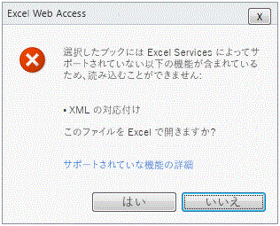

# サポートされる機能とサポートされない機能

  
    
    

Microsoft Excel は機能が豊富です。各リリースで、Excel と Excel Services 間の機能の格差は狭まっており、サポートされていない機能も少なくなっています。しかし、Microsoft SharePoint Server 2010 の Excel Services バージョン 2 で、すべての Excel 機能をサポートすることは不可能です。
どの機能をサポートするかを決定する際、Excel Services の主要なシナリオにおいて必要な機能が優先されます。これにより、Excel Services が信頼性、拡張性、セキュリティに対するお客様の期待に応えるサーバー グレードのサービスであることを確実にします。
  
    
    

> **メモ**
> このトピックでは、Microsoft Office SharePoint Server 2007 でサポートされるものとされないものについて習熟していることが前提となっています。Office SharePoint Server 2007 でサポートされない機能について、詳細は「 [Excel Services でサポートされない機能](http://msdn.microsoft.com/ja-jp/library/ms496823.aspx)」を参照してください。 
  
    
    

## 新しい Excel 機能のサポート

Microsoft Excel 2010 の新機能のほとんどは、Excel Services でも一部機能します。Excel と同じように表示される機能もあれば、表示されて対話もできる機能もあります。
  
    
    
 **表示できる新機能は次のとおりです。**
  
    
    

- スパークライン
    
  
-  [アイコン セット](http://blogs.msdn.com/excel/archive/2009/08/05/icon-set-improvements-in-excel-2010.aspx)および [データ バーの改善点](http://blogs.msdn.com/excel/archive/2009/08/07/data-bar-improvements-in-excel-2010.aspx)
    
  
-  [ピボットテーブルの名前付きセット](http://blogs.msdn.com/excel/archive/2009/10/05/pivottable-named-sets-in-excel-2010.aspx)
    
  
-  [ピボットテーブルの改善点](http://blogs.msdn.com/excel/archive/2009/10/15/a-few-more-pivottable-improvements-in-excel-2010.aspx)
    
  
 **表示および対話が可能な新機能は次のとおりです。**
  
    
    

- スライサー
    
  
- PowerPivot ファイル
    
  
Excel の新しい関数もサポートしています。Excel の長期に渡る機能である埋め込みイメージがサポートされるようになり、Excel Services で表示できるようになりました。
  
    
    

## 以前 Excel ファイルが読み込めなかった機能

Office SharePoint Server 2007 では、VBA マクロ、フォーム コントロールなどのサポートされていない機能を含む Excel ブックは、Excel Services に読み込むことができません。
  
    
    
SharePoint Server 2010 では、ユーザーがこの制限に対応できるように、Excel Services はサポートされていない特定の機能を無視します。言い換えると、Excel Services はファイル全体の読み込みをブロックするのではなく、ファイルを読み込みますが、Excel Services がサポートしない機能は表示されません。
  
    
    
以下の機能は、使われていても　Excel Services がファイルを読み込めなくなりません。
  
    
    

- セルのコメント
    
  
- 外部のブックへの数式参照
    
  
- クエリ テーブル (外部データ範囲としても知られる)
    
  
- Microsoft Visual Basic for Applications (VBA)
    
  
- すべての OfficeArt テクノロジ。例: 図形、ワードアート、SmartArt、組織図、図、署名欄、インク注釈など
    
  
これらの機能は引き続きサポートされないことに注意してください。つまり、クライアントで行うようななんらかの方法で表示したり、実行したり、機能したりはしないということです。リスト内のほとんどの機能は Excel Services で表示できません。たとえば、クライアントで表示した時にはセル A1 の近くに図形があっても、サーバー上では図形は表示されません。数式の参照、クエリ テーブルなどその他の機能では、クライアントで最後に更新された値が表示されます。言い換えると、セルの値は存在しますが、更新することはできません。
  
    
    
最後に、VBA コードはサーバー上で実行できません。Office SharePoint Server 2007 では、Excel Services は *.xlsm ファイルの読み込みをサポートしませんでした。SharePoint Server 2010 では、Excel Services は VBA マクロを無視します。このため、*.xlsm ファイルは Excel Services に読み込めるようになりました。
  
    
    

## 無視された機能があるファイルの表示

Excel Services がファイルを読み込めるが、サポートしていない特定の機能を表示できない場合、表示されているファイルで一部の機能が欠けていることを知るにはどのようにすればよいでしょうか。Excel Services では、ワークシートの上に警告の通知が表示されるため、一部の機能が欠けているファイルを表示していることが分かります。次のスクリーン ショットは、通知を示します。
  
    
    

**ブックの上部に表示されるサポートされない機能の通知**

  
    
    
この通知は、ファイルが Excel クライアントとは異なる表示をしているという最初の表示です。
  
    
    
次の図で、[ **サポートされていない機能についてさらに知る**] をクリックすると、ファイルでサポートされていない機能がどれかについて、詳細が表示されます。
  
    
    

**VBA のサポートされていない機能のエラー メッセージ**

  
    
    

  
    
    

  
    
    
トリミングされた画像は表示されません (つまり、欠けている機能)。
  
    
    

    
> **メモ**
> 無視されたり欠けている非サポート機能を含むブックが通知バー付きで表示モードに読み込まれた場合、ブックのコピーを保存しようとすると、サポートされていない機能は削除されることになります。警告のダイアログ ボックスが表示されて、ユーザーにこのことが警告されます。 
  
    
    

## その他のサポートされていない機能

その他すべてのサポートされていない機能は、Excel Services の Office SharePoint Server 2007 でと同じように動作します。つまり、Excel Services は、これらのサポートされていない機能が 1 つ以上存在することを検出すると、ファイルの読み込みをブロックします。次のスクリーン ショットに示すように、ユーザーはファイルが読み込めないことを通知されます。
  
    
    

> **メモ**
>  [Excel Services でサポートされない機能](http://msdn.microsoft.com/ja-jp/library/ms496823.aspx)トピックには、サポートされない機能の詳細が含まれています。 
  
    
    

> **注意**
> ファイルが Web パーツから読み込まれた場合、サポートされていない機能のリストが付いた情報バーは表示されません。 
  
    
    

**XML マップでサポートされていない機能のエラー メッセージ**

  
    
    

  
    
    

  
    
    
外部リンクの付いたブックとは異なり、外部リンクの付いたグラフの読み込みはブロックされます。
  
    
    

## 関連項目

#### 概念

  
    
    
 [Excel Services の概要](excel-services-overview.md)
  
    
    
 [Excel Services のアーキテクチャ](excel-services-architecture.md)
  
    
    
 [Excel Services ブログ、フォーラム、リソース](excel-services-blogs-forums-and-resources.md)
#### その他の技術情報

  
    
    
 [チュートリアル: Excel Web Services を使用してカスタム アプリケーションを開発する](walkthrough-developing-a-custom-application-using-excel-web-services.md)
