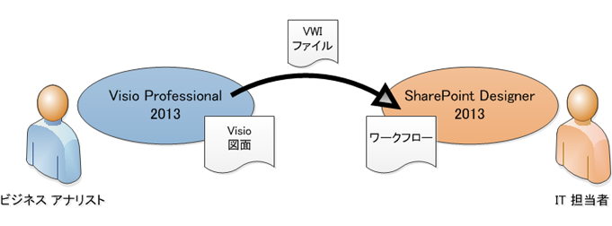
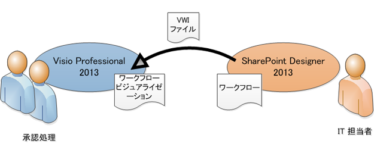
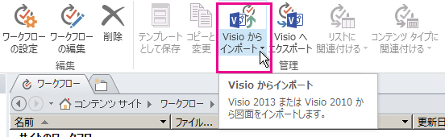
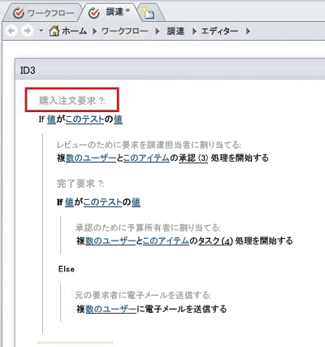

# SharePoint Designer 2013 と Visio Professional 2013 との間でワークフローを転送する (SharePoint 2010 ワークフロー プラットフォーム)
Visio からワークフローをインポートしたり、Visio にワークフローをエクスポートしたりするには、SharePoint Designer を使用します。
## SharePoint Designer 2013 と Visio Professional 2013 との間のワークフローの転送

Visio でのフローチャートの作成に慣れているビジネス アナリストおよびプロセス アナリストは、Visio を使用して、SharePoint ワークフローを設計できます。Visio のワークフローは、ビジネス ロジックを表しています。ビジネス ロジックが完成したら、ワークフローを SharePoint Designer にエクスポートできます。ワークフローを SharePoint Designer にエクスポートした後、IT 担当者はそのワークフローを SharePoint サイトに接続できます。
  
    
    

  
    
    

  
    
    
Microsoft SharePoint Designer 2013 では、Microsoft Visio Professional 2013 で作成したワークフローをインポートしたり、ワークフローを Visio にエクスポートして表示したりできます。 
  
    
    
この記事では、SharePoint Designer 2013 で SharePoint 2010 ワークフロー プラットフォームを使用してワークフローを転送する方法について説明します。
  
    
    
ワークフロー作成時に SharePoint 2010 ワークフロー プラットフォームを選択するには、次の手順に従います。
  
    
    

  
    
    

1. **ナビゲーション** ウィンドウで [ **ワークフロー**] をクリックします。
    
  
2. [ **ワークフロー**] タブの [ **新規作成**] セクションで、[ **リスト ワークフロー**]、[ **再利用可能なワークフロー**]、または [ **サイト ワークフロー**] をクリックします。
    
  
3. [ **ワークフローの作成**] ダイアログ ボックスの [ **プラットフォームの種類**] ボックスで、[ **SharePoint 2010 のワークフロー**] をクリックします。
    
  
SharePoint Designer でワークフローを視覚化するには、2 つの方法があります。
  
    
    

- SharePoint 2013 を実行しているサーバーに Visio Services がインストールされている場合は、進行状況および割り当てを表示するワークフローの状態ページでワークフローを視覚化できます。
    
  
- ワークフローを Visio にエクスポートしてワークフロー図面を作成し、それをフィードバックおよび承認のために使用できます。
    
  

  
    
    

  
    
    

  
    
    

  
    
    

## Visio からワークフローをインポートする

SharePoint ワークフローをインポートするには、次の手順に従います。
  
    
    

1. SharePoint Designer 2013 の [ **ナビゲーション**] ウィンドウで、[ **ワークフロー**] をクリックします。
    
  
2. [ **ワークフロー**] タブの [ **管理**] グループで、[ **Visio からインポート**] をクリックします。
    

  

  

  
3. [ **Visio 図面からのワークフローのインポート**] ダイアログ ボックスで、使用する Visio ワークフロー変換 (*.vwi) ファイルを参照および選択して、[ **次へ**] をクリックします。
    
  
4. ワークフローの名前を入力して、インポート後のワークフローの種類を選択します。次のどちらかを選択できます。
    
  - [ **リスト ワークフロー**] 特定のリストにアタッチされたワークフローです。このオプションを選択した場合、ワークフローをアタッチするリストを選択する必要があります。
    
  
  - [ **再利用可能なワークフロー**] コンテンツ タイプにアタッチされ、ポータブルなワークフローです。SharePoint サイト上のさまざまなリストで使用できます。このオプションを選択した場合、どのコンテンツ タイプでワークフローを実行するかを選択する必要があります。
    
  
5. [ **完了**] をクリックします。
    
  
インポートされたワークフローは、SharePoint Designer の全画面表示ワークフロー エディターに表示されます。Visio の基本図形内のすべてのテキストはアクティビティ ラベル (以下の図の灰色のテキスト) として SharePoint Designer にインポートされ、ワークフローの意図が明確になります。
  
    
    

  
    
    

  
    
    
ワークフローを SharePoint Designer にインポートすると、ワークフローを編集できるようになり、ワークフローを変更して必要な条件、アクション、ステップ、および設定を追加できます。 
  
    
    

## Visio にワークフローをエクスポートする

SharePoint Designer 2013 でワークフローを作成または編集した後、ワークフローを Visio 図面としてエクスポートし、それを Visio Professional 2013 で開くことができます。SharePoint Designer でワークフローを編集した後に再度ワークフローを Visio にエクスポートする機能 ("ラウンドトリップ" とも呼ばれます) によって、ビジネス ユーザーとワークフロー設計者との間のグループ作業が促進されます。このようにワークフロー設計を繰り返すことにより、Visio を使用してビジネス要件を定義し、その後ラウンドトリップを使用して変更についての調整および承認を行うことができます。
  
    
    

> **メモ**
> Visio Professional 2013 において、ステップはサポートされていません。ワークフローが Visio で表示され、SharePoint Designer に再度インポートされた場合、SharePoint Designer で追加されたステップ情報が失われることがあります。 
  
    
    

ワークフローをエクスポートするには、次の手順に従います。
  
    
    

1. SharePoint Designer 2013 の [ **ナビゲーション**] ウィンドウで、[ **ワークフロー**] をクリックします。
    
  
2. [ **ワークフロー**] タブの [ **管理**] グループで、[ **Visio にエクスポート**] をクリックします。
    
  
3. [ **Visio 図面へのワークフローのエクスポート**] ダイアログ ボックスで、ファイルに名前を付け、場所を選択して、[ **保存**] をクリックします。エクスポートされたファイルは .vwi ファイルとして保存され、Visio Professional 2013 で直接開くことができます。
    
  

## その他の技術情報

-  [SharePoint 2013 ワークフローの新機能](what-s-new-in-workflows-for-sharepoint-2013.md)
    
  
-  [SharePoint 2013 ワークフローの概要](get-started-with-workflows-in-sharepoint-2013.md)
    
  
-  [SharePoint Designer および Visio でのワークフロー開発](workflow-development-in-sharepoint-designer-and-visio.md)
    
  

  
    
    

