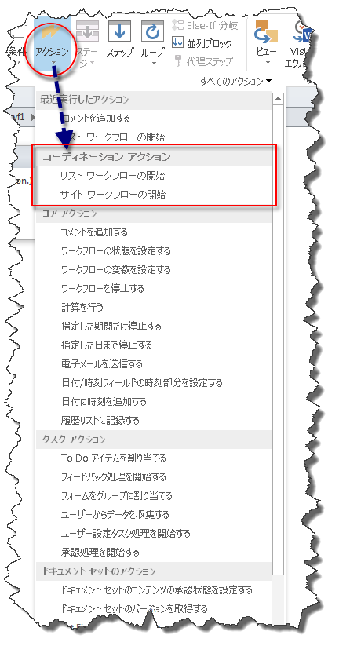
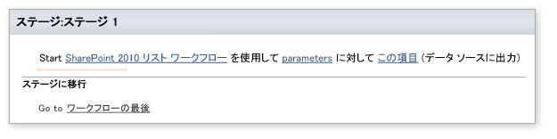
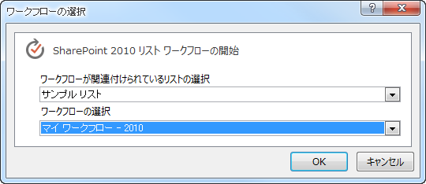

# SharePoint Designer 2013 での連携アクションを理解する
SharePoint 2012 Workflow プラットフォーム上に構築されたワークフロー内から SharePoint 2010 Workflow プラットフォーム上に構築されたワークフローを開始するように設計された SharePoint Designer 2013 の連携アクション。
||
|:-----|
||
   

## SharePoint Designer 2013 の連携アクション

SharePoint Designer 2013 では 2 つの連携アクションが利用可能です。両アクションは SharePoint 2013 Workflow プラットフォームでのみ使用できます。連携アクションは以下のとおりです。
  
    
    

- リスト ワークフローの開始: 特定のリスト用に開発されたワークフローの開始に使用する。
    
  
- サイト ワークフローの開始: サイト用に開発されたワークフローの開始に使用する。
    
  
SharePoint 2013 Workflow プラットフォームを基にワークフローを構築すると、連携アクションは図のように [ **アクション**] のドロップダウン メニューに表示されます。
  
    
    

**図: SharePoint Designer の連携アクション**

  
    
    

  
    
    

  
    
    
両アクションは SharePoint 2013 Workflow プラットフォーム上に構築されたワークフローから SharePoint 2010 Workflow プラットフォーム上に構築されたワークフローを開始するために設計されています。
  
    
    

    
> **重要**
> 連携アクションは SharePoint 2013 Workflow プラットフォーム上に構築されたワークフローから SharePoint 2010 Workflow プラットフォーム上に構築されたワークフローを開始することのみをサポートします。SharePoint 2013 Workflow プラットフォーム上に構築されたワークフローから同じプラットフォーム上に構築したワークフローを開始することはサポートされません。 
  
    
    

## 連携アクションの使用

SharePoint 2013 Workflow プラットフォームで使用されなくなったアクションがいくつかあります。従来のワークフローに対応するために、連携アクションを使用できます。連携アクションは SharePoint 2010 Workflow プラットフォームを使用して構築されたリスト ワークフローまたはサイト ワークフローの開始に使用できます。
  
    
    
連携アクションには、図のように 3 つの編集領域があります。
  
    
    

**図: リスト ワークフローの連携アクションの開始**

  
    
    

  
    
    

  
    
    
3 つの編集領域は次のとおりです。 
  
    
    

- **SharePoint 2010 list workflow**: 開始する 2010 のワークフローを選択します。
    
  
- **parameters**: 2010 workflow に送信するパラメーターです。
    
  
- **this item**: 2010 ワークフロー上で実行する必要があるアイテム。
    
  
編集可能なリンクをクリックし、情報を入力します。たとえば、開始する 2010 ワークフローを選択するため、[ **SharePoint 2010 list workflow**] リンクをクリックします。図のようにダイアログ ボックスが表示され、ワークフローの選択に使用できます。
  
    
    

**図: 2010 プラットフォーム ベースのワークフローの選択**

  
    
    

  
    
    

  
    
    

  
    
    

  
    
    

  
    
    
SharePoint 2013 ワークフロー内から作成された SharePoint 2010 Workflow プラットフォームのワークフロー インスタンスは、図のように [Subworkflows] セクションの [ワークフローの状態] ページに表示されます。
  
    
    

**図: [ワークフローの状態] ページに表示されるサブワークフロー**

  
    
    

  
    
    
![[ワークフローの状態] ページに表示されるサブワークフロー。](images/SPD15-CorrelationActions4.png)
  
    
    

  
    
    

  
    
    

## その他の技術情報

-  [What's new in workflow in SharePoint Server 2013](http://msdn.microsoft.com/library/6ab8a28b-fa2f-4530-8b55-a7f663bf15ea.aspx)
    
  
-  [Getting started with SharePoint Server 2013 workflow](http://msdn.microsoft.com/library/cc73be76-a329-449f-90ab-86822b1c2ee8.aspx)
    
  
-  [SharePoint Designer 2013 の辞書アクションを理解する](understanding-dictionary-actions-in-sharepoint-designer-2013.md)
    
  

  
    
    

