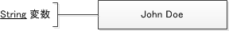
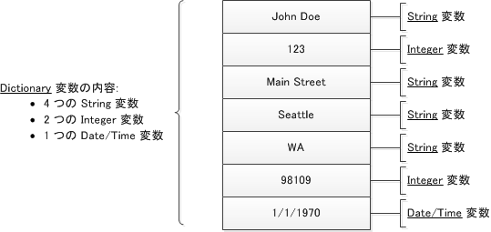
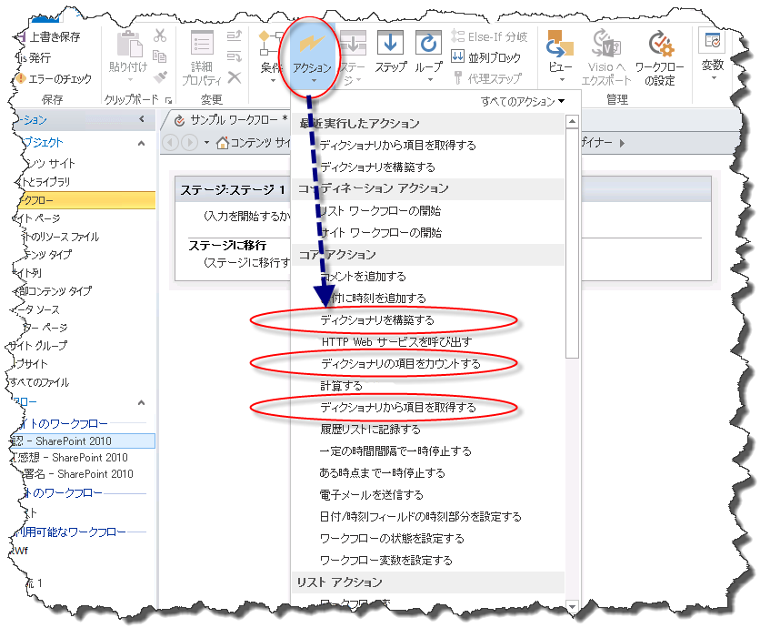
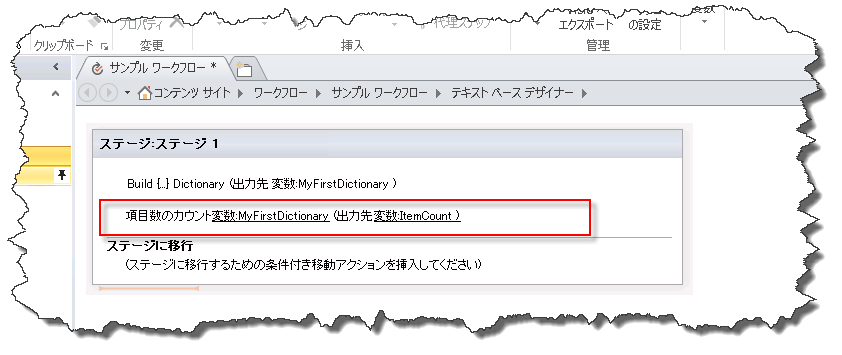
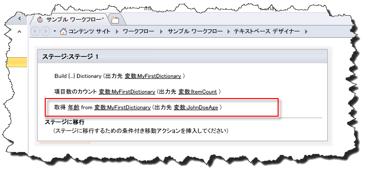

# SharePoint Designer 2013 の辞書アクションを理解する
辞書変数型とは、SharePoint Designer 2013で使用可能な SharePoint 2013 ワークフロー プラットフォームの新しい変数の種類です。 
||
|:-----|
||
   

## 辞書変数型について

ワークフローは期待どおりの結果を出す一連のアクションです。ワークフローの作成時は多くの場合、ワークフローの他の部分で使用できるよう値を変数 (ストレージ コンテナー) に保存します。
  
    
    
変数の作成時は、どのようなデータの種類が変数に格納されるかをワークフロー エンジンに通知しておく必要があります。たとえば、従業員の名前を変数に保存するとします。従業員の名前は文字列なので、 **String** 型の変数を作成します。そうしておくとワークフローで従業員の名前 (John Doe など) を変数に格納することができます。
  
    
    

**図 1: 文字列変数**

  
    
    

  
    
    

  
    
    
SharePoint Designer 2013には **辞書**という名前の新しい変数型が実装されています。 **辞書**変数型は他の変数のコレクションを保持するためのコンテナーです。たとえば、ワークフローで、従業員の住所や誕生日など、名前以外の項目を格納する必要があるとします。 **辞書**変数を使用しない場合は、スタンドアロン変数を複数作成する必要があります。このような場合はワークフローのロジックでの構成や操作が困難になります。 **辞書**変数を使用すると、複数のデータ ポイントを単一の変数に格納できます。
  
    
    
この概念を図示します。
  
    
    

**図 1: 辞書変数**

  
    
    

  
    
    

  
    
    

  
    
    

  
    
    

## 辞書変数型を使用するワークフロー アクション

ワークフローは、ワークフローの処理時に実行される複数のアクションから構成されます。SharePoint Designer 2013には、多種多様なアクションが含まれています。たとえば、電子メール メッセージ送信アクション、リスト アイテム作成アクション、ワークフロー履歴へのメッセージ登録アクションなどです。
  
    
    
次の 3 つのアクションは、 **辞書**変数型用に特別に設計されたアクションです。 
  
    
    

- **辞書を作成する**
    
  
- **辞書内のアイテムをカウントする**
    
  
- **辞書からアイテムを取得する**
    
  
次の図に示すように 辞書 変数型用のワークフロー アクションは [ **アクション**] ドロップダウン リストにあります。
  
    
    

**図: 辞書アクション**

  
    
    

  
    
    

  
    
    

### [辞書を作成] アクションを使用して変数を作成する

[ **辞書を作成**] アクションを使用して **辞書**型の変数を作成することができます。辞書の内容を入力し、変数リストで辞書の名前を指定します。
  
    
    
図に [ **辞書を作成**] ダイアログ ボックスを示します。辞書に 3 つの変数 (文字列、整数、日付/時刻) が追加されていることに注目してください。
  
    
    

**図: [辞書を作成] ダイアログ ボックス**

  
    
    

  
    
    
![[辞書を作成] ダイアログ ボックス](images/SPD15-BuildADictionaryDialog.png)
  
    
    
 **辞書**には、SharePoint 2013 ワークフロー プラットフォームで使用可能な任意の変数の種類を収容することができます。次の一覧に、使用可能な変数の種類を示します。
  
    
    

- **ブール型**: Yes または No の値
    
  
- **日付/時刻型**: 日付および時刻
    
  
- **辞書型**: 変数のコレクション
    
  
- **GUID 型**: グローバル一意識別子 (GUID)
    
  
- **整数型**: 整数 (小数は含みません)
    
  
- **数値型**: 数字 (小数を含みます)
    
  
- **文字列型**: 文字列
    
  

    
> **重要**
> **辞書**変数型は [ **HTTP Web サービスを呼び出す**] アクションの使用時に不可欠です。 
  
    
    

    
> **注意**
> [ **名前**] フィールドを参照フィールドとして使用できるのは、辞書の値を設定しているときだけです。辞書を作成しているときに [ **名前**] フィールドを参照フィールドとして使用することはできません。 
  
    
    

    
> **メモ**
> **辞書**変数には、 **辞書**型変数を収容することができます。 **辞書**に **辞書**変数を格納できる機能には多数の利点があります。たとえば、 **辞書**を作成して従業員に関する情報を格納するとします。 **辞書**の中に従業員ごとに別の **辞書**エントリを作成できます。ワークフローの作成時、各従業員の個々の情報用に新しいスタンドアロン変数を繰り返し作成するのではなく、 **辞書**変数を使用できます。この例が示すように、 **辞書**を使用してワークフロー内の複雑な情報を整理することができます。 
  
    
    

### [辞書内のアイテムをカウントする] アクションを使用して変数をカウントおよび作成する

[ **辞書内のアイテムをカウントする**] アクションを使用して **辞書**に含まれる変数をカウントし、その数を整数型の変数に格納します。そうしておくと、アイテムの数を使用して **辞書**内で繰り返し処理を実行することができます。
  
    
    
図に [ **辞書内のアイテムをカウントする**] ワークフロー アクションを示します。 
  
    
    

**図: [辞書内のアイテムをカウントする]**

  
    
    

  
    
    

  
    
    

  
    
    

  
    
    

### [辞書からアイテムを取得する] アクションを使用して変数を取得する

[ **辞書からアイテムを取得する**] アクションを使用して **辞書**に格納されている変数を取得し、変数内に配置することができます。これは辞書内のスタンドアロン変数に格納されている値が必要な場合に有用です。変数名を入力して値を取得できます。
  
    
    
図に [ **辞書からアイテムを取得する**] ワークフロー アクションを示します。なお、[ **年齢**] は **辞書**内の変数の名前であり、新しい **整数型**変数に出力されています。
  
    
    

**図: [辞書からアイテムを取得する]**

  
    
    

  
    
    

  
    
    

  
    
    

  
    
    

## その他の技術情報

-  [Workflow in SharePoint 2013](http://technet.microsoft.com/ja-jp/sharepoint/jj556245.aspx)
    
  
-  [What's new in workflow in SharePoint Server 2013](http://msdn.microsoft.com/library/6ab8a28b-fa2f-4530-8b55-a7f663bf15ea.aspx)
    
  
-  [Getting started with SharePoint Server 2013 workflow](http://msdn.microsoft.com/library/cc73be76-a329-449f-90ab-86822b1c2ee8.aspx)
    
  

  
    
    

