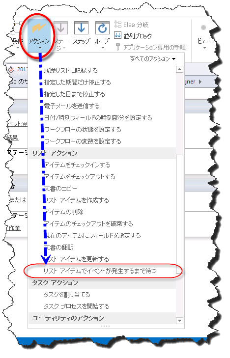
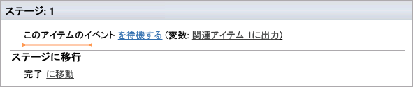
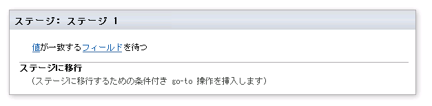

# SharePoint Designer 2013 のイベント アクションについて
SharePoint Designer 2013のイベント アクションの使用方法について説明します。
## SharePoint Designer 2013のイベント アクションの概要

SharePoint ワークフローでは、アイテムが追加または変更されたときに通知されるようにサブスクライブできます。アイテムが追加または変更されると、アイテムはイベントと呼ばれます。ワークフローでは、このようなイベントが発生するまで待機し、発生したときにワークフローを進めることができます。SharePoint Designer 2013 のイベント アクションは、以下のとおりです。
  
    
    

- **現在のアイテムでのフィールドの変更を待つ:** 新しいアイテムが作成されるかアイテムが変更されるまで待機する場合に使用します。
    
  
- **プロジェクト イベントの待機:** プロジェクトがチェックイン、コミット、または提出されるまで待機する場合に使用します。
    
  
- **現在のアイテムでのフィールドの変更を待つ:** 現在のアイテムでフィールドが変更されるまで待機する場合に使用します。
    
  
イベント アクションは、次の図で示すように、SharePoint Designer 2013の [ **アクション**] ドロップダウン メニューにあります。
  
    
    

> **メモ**
> [ **Project Web App アクション**] は、Project Web App サイトで作業する場合のみ使用できます。 
  
    
    

**SharePoint Designer 2013 のイベント アクション**

  
    
    

  
    
    

  
    
    

**SharePoint Designer 2013 の Project Web App イベント アクション**

  
    
    

  
    
    
![[プロジェクト イベントの待機] アクション](images/SPD15-EventingActions4.png)
  
    
    

**SharePoint Designer 2013 の現在のアイテム イベントでのフィールドの変更を待つ**

  
    
    

  
    
    
![[現在のアイテムでのフィールドの変更を待つ] を選択](images/wf15-eventingactions3.png)
  
    
    

  
    
    

  
    
    

## SharePoint 2013のイベント アクションの使用方法

ワークフローはビジネス プロセスの流れを制御します。ビジネス プロセス内では、多くの場合、SharePoint リストのアイテムが追加または更新されるまで待機することが重要になります。イベント アクションを使用すると、イベントが発生するのを待機し、発生したときにワークフロー アクションを実行できます。
  
    
    
イベント アクションは、SharePoint Designer 2013 リボンの [アクション] ドロップダウン メニューにあります。ワークフローにアクションを追加してから、特定の状況に応じてカスタマイズできます。
  
    
    

### 現在のアイテムでのフィールドの変更を待つ

[ **現在のアイテムでのフィールドの変更を待つ**] アクションには、次の図で示すように、編集可能な領域が 2 つあります。
  
    
    

**現在のアイテムでのフィールドの変更を待つ**

  
    
    

  
    
    

  
    
    

  
    
    

  
    
    
編集可能な領域は次の 2 つです。
  
    
    

- **このアイテムのイベント:** 監視するリストとイベント。
    
  
- **出力変数:** イベントの生成元のアイテムの GUID を保存する変数。アイテムには ID と GUID フィールドの両方があります。ID はリストに対して一意であり、GUID はグローバルに一意です。たとえば、リストで最初のアイテムの ID は 1 となり、2 番目のアイテムの ID は 2 となります。GUID はグローバルに一意であり、8 桁の 16 進数で始まり、次にそれぞれが 4 桁の 16 進数のグループが 3 つ続き、12 桁の 16 進数のグループが 1 つが続く、128 ビットの値の形式です。GUID の例は、6B29FC40-CA47-1067-B31D-00DD010662DA です。[ **リスト アイテムでイベントが発生するまで待つ**] アクションは GUID を取得します。
    
  
[ **このアイテムのイベント**] リンクをクリックすると、次の図で示すように、[ **リスト アイテムのイベントを選択します。**] ダイアログ ボックスが開きます。
  
    
    

**[リスト アイテムのイベントを選択します。] ダイアログ ボックス**

  
    
    

  
    
    
![[リスト アイテムのイベントを選択します。] ダイアログ](images/SPD15-EventingActions3.jpg)
  
    
    

  
    
    

  
    
    
[ **イベント**] ドロップダウン リストはイベントの種類に対応しています。リストにアイテムが追加されるまで待機するか、リスト内のアイテムが変更されるまで待機するかを選択できます。[ **リスト**] ドロップダウンは監視するリストに対応します。
  
    
    

### プロジェクト イベントの待機

[ **プロジェクト イベントの待機**] アクションには、次の図で示すように、編集可能な領域が 1 つあります。
  
    
    

**プロジェクト イベントの待機**

  
    
    

  
    
    
![ワークフロー内の [プロジェクト イベントの待機]](images/SPD15-EventingActions5.png)
  
    
    

  
    
    

  
    
    
編集可能な領域は次の領域です。
  
    
    

- **このプロジェクト イベント:** ワークフローが待機するプロジェクト イベント。
    
  
[ **このプロジェクト イベント**] ドロップダウンでは、3 つのプロジェクト イベントから選択できます。プロジェクトがチェックインされるまで待機、コミットされるまで待機、送信されるまで待機のいずれかです。
  
    
    
イベントが発生すると、ワークフローの処理が続行されます。
  
    
    

### 現在のアイテムでのフィールドの変更を待つ

[ **現在のアイテムでのフィールドの変更を待つ**] アクションには、次の図で示すように、編集可能な領域が 2 つあります。
  
    
    

**現在のアイテムでのフィールドの変更を待つ**

  
    
    

  
    
    

  
    
    

  
    
    

  
    
    
編集可能な領域は次の領域です。
  
    
    

- **フィールド:** 変更を監視する必要があるアイテムのフィールド。
    
  
- **値:** ワークフローを続行するためにフィールドを等しくする必要のある値。
    
  
フィールドが変更されると、ワークフローは続行されます。
  
    
    

## その他の技術情報

-  [SharePoint 2013 のワークフロー](http://technet.microsoft.com/ja-jp/sharepoint/jj556245.aspx)
    
  
-  [What's new in workflow in SharePoint Server 2013](http://msdn.microsoft.com/library/6ab8a28b-fa2f-4530-8b55-a7f663bf15ea.aspx)
    
  
-  [Getting started with SharePoint Server 2013 workflow](http://msdn.microsoft.com/library/cc73be76-a329-449f-90ab-86822b1c2ee8.aspx)
    
  
-  [SharePoint Designer および Visio でのワークフロー開発](workflow-development-in-sharepoint-designer-and-visio.md)
    
  
-  [ワークフロー アクション クイック リファレンス (SharePoint 2013 ワークフロー プラットフォーム)](workflow-actions-quick-reference-sharepoint-2013-workflow-platform.md)
    
  

  
    
    

