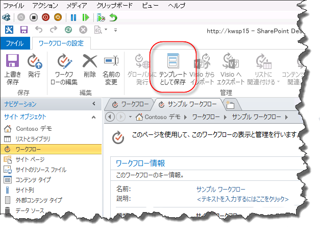
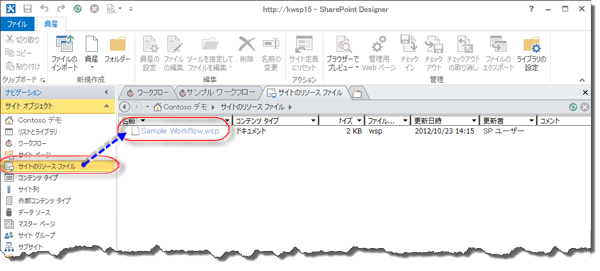
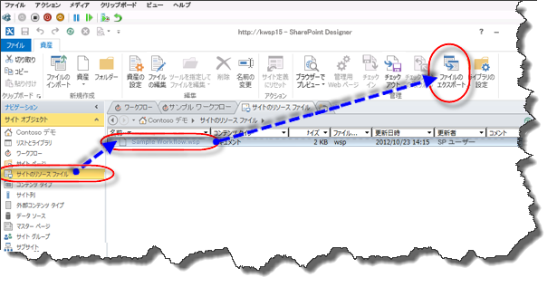
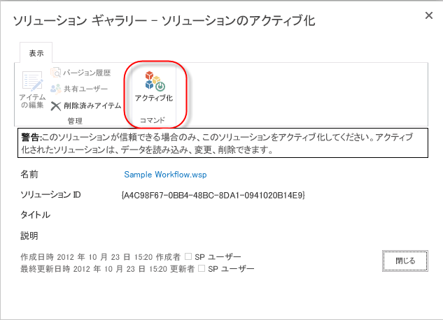
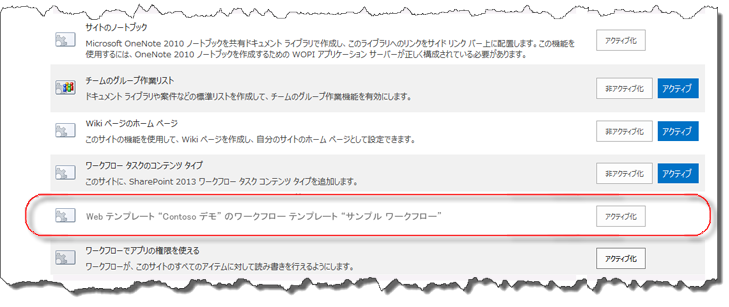

# SharePoint 2013 でワークフローをパッケージ化して展開する方法の概要
SharePoint Server 2013 で SharePoint Designer 2013 を使用してワークフローをパッケージ化して展開する方法を説明します。
## SharePoint Designer 2013 のワークフロー パッケージ化機能の概要

SharePoint Designer 2013 には、ワークフローをテンプレートとして保存する機能があります。テンプレートとしてのワークフローの保存は、ワークフローのパッケージ化とも呼ばれます。テンプレートとして保存したワークフローは、他の SharePoint Server 2013 環境にインポートして使用でき、ワークフローを開発しなおす必要がありません。ただし、テンプレートとして保存できないワークフローの種類があります。次の表では、テンプレートとして保存できるワークフローの種類を示します。 
  
    
    

**プラットフォーム別の、テンプレートとしてワークフローの保存のサポート**

|**ワークフローの種類**|**SharePoint 2010 ワークフロー プラットフォーム**|**SharePoint 2013 ワークフロー プラットフォーム**|
|:-----|:-----|:-----|
|リスト ワークフロー    |×    |○    |
|サイト ワークフロー    |×    |○    |
|再利用可能ワークフロー    |○    |○    |
   

  
    
    

  
    
    

> **メモ**
> SharePoint Server 2013 には、SharePoint 2010 ワークフロー プラットフォームと SharePoint 2013 ワークフロー プラットフォームという 2 種類のワークフロー プラットフォームがあります。どちらのプラットフォームも SharePoint Server 2013 で使用できます。2 種類のワークフローの詳細については、「 [Getting started with SharePoint Server 2013 workflow.](http://msdn.microsoft.com/library/cc73be76-a329-449f-90ab-86822b1c2ee8.aspx)」を参照してください。 
  
    
    

## SharePoint Designer 2013 を使用したワークフローのパッケージ化

ワークフローをパッケージ化するときは、SharePoint Designer 2013 を使用してワークフローをテンプレート ファイルに保存します。ワークフロー パッケージは Web ソリューション パッケージ (WSP) ファイルの形式であり、拡張子は .wsp です。ワークフローのパッケージ化は、次の手順で行います。 
  
    
    

### ワークフローをパッケージ化する

1. SharePoint Designer 2013 で、既存のワークフローを開くか、または新しいワークフローを作成します。
    
  
2. 次の図で示すように、リボンの [ **ワークフロー設定**] タブで、[ **管理**] セクションの [ **テンプレートとして保存**] ボタンをクリックします。
    
   **図: テンプレートとしてワークフローを保存する**

  

  

  

  
3. テンプレートが **サイト リソース** ライブラリに保存されたことを示す情報ダイアログ ボックスが表示されます。
    
  
4. 次の図に示すように、サイト リソース ライブラリをクリックするとワークフロー テンプレートが表示されます。
    
   **図: サイト リソース内のワークフロー テンプレート**

  

  

  

  

  
    
    

> **ヒント**
> ワークフロー テンプレートは、ワークフローが存在するサイト コレクションの **サイト リソース** ライブラリに自動的に保存されます。
  
    
    

## SharePoint 2013 へのワークフロー パッケージの展開

開発に使用したファームまたはサイトとは異なる SharePoint ファームまたはサイトに、ワークフロー パッケージを展開できます。ワークフローを正常に展開するには、次の 2 つのことが満たされている必要があります。
  
    
    

- リスト、ライブラリ、列、コンテンツ タイプなどのワークフローのすべての依存関係が、新しいサイトに既に存在している必要があります。
    
  
- 各依存関係の名前は、元の依存関係の名前と正確に一致している必要があります。
    
  
厳密な依存関係が存在していない場合にワークフローを展開すると、エラーが発生します。
  
    
    
ワークフローを展開するには、事前に元の SharePoint Server 2013 ファームからワークフロー テンプレートをエクスポートする必要があります。ワークフロー テンプレートのエクスポートは、次の手順で行います。
  
    
    

### ワークフロー テンプレートをエクスポートする

1. SharePoint Designer 2013 を開き、テンプレートが存在するサイト リソース ライブラリに移動します。
    
  
2. エクスポートするワークフロー テンプレートをクリックして選択します。
    
  
3. 次の図に示すように、[ **ファイルのエクスポート**] ボタンをクリックして、テンプレート ファイルをローカル コンピューターまたはネットワーク ドライブに保存します。
    
   **図: SharePoint Designer 2013 からワークフロー テンプレートをエクスポートする**

  

  

  

  
ワークフロー パッケージの展開は、次の手順で行います。
  
    
    

### ワークフロー ソリューションを展開する

1. Internet Explorer を開き、ワークフローを展開する SharePoint Server 2013 サイト コレクションに移動します。
    
  
2. [ **サイトの操作**] をクリックし、[ **サイトの設定**] をクリックします。
    
  
3. [ **Web デザイナー ギャラリー**] セクションで、[ **ソリューション**] をクリックします。
    
    > **メモ**
      > [ **ソリューション**] ギャラリーが表示されるためには、サイト コレクションの [ **サイトの設定**] ページを表示している必要があります。サブサイトの [ **サイトの設定**] ページを開いていると、[ **ソリューション**] ギャラリーは表示されません。 
4. 次の図に示すように、[ **ソリューションのアップロード**] ボタンをクリックしてソリューションをアップロードします。
    
   **図: [ソリューションのアップロード] ボタン**

  

![[ソリューションのアップロード] ボタン](images/SPD15-PackagingWorkflow4.png)
  

  

  
5. 次の図に示すように、[ **アクティブ化**] ボタンをクリックして、ソリューションをアクティブ化します。
    
   **図: [ソリューションのアクティブ化] ダイアログとボタン**

  

  

  

  
サイト コレクションに対してアクティブ化したワークフロー ソリューションは、すべてのサブサイトの機能として使用できます。サブサイトのワークフロー機能をアクティブ化するには、次の手順を実行します。
  
    
    

### ワークフロー機能をアクティブ化する

1. ワークフロー機能をアクティブ化するサイトで [ **サイトの設定**] を開きます。
    
  
2. [ **サイトの操作**] グループで、[ **サイト機能の管理**] をクリックします。
    
  
3. 次の図のように、ワークフロー機能の隣の [ **アクティブ化**] をクリックします。
    
  

**図: サイトのワークフロー機能をアクティブ化する**

  
    
    

  
    
    

  
    
    

  
    
    

  
    
    

## その他の技術情報

-  [SharePoint 2013 のワークフロー](http://technet.microsoft.com/ja-jp/sharepoint/jj556245.aspx)
    
  
-  [What's new in workflow in SharePoint Server 2013](http://msdn.microsoft.com/library/6ab8a28b-fa2f-4530-8b55-a7f663bf15ea.aspx)
    
  
-  [Getting started with SharePoint Server 2013 workflow](http://msdn.microsoft.com/library/cc73be76-a329-449f-90ab-86822b1c2ee8.aspx)
    
  
-  [SharePoint Designer および Visio でのワークフロー開発](workflow-development-in-sharepoint-designer-and-visio.md)
    
  
-  [ワークフロー アクション クイック リファレンス (SharePoint 2013 ワークフロー プラットフォーム)](workflow-actions-quick-reference-sharepoint-2013-workflow-platform.md)
    
  
-  [SharePoint Designer チームのブログ記事: ワークフロー パッケージと展開シナリオ](http://blogs.msdn.com/b/sharepointdesigner/archive/2012/08/30/packaging-list-site-and-reusable-workflow-and-how-to-deploy-the-package.aspx)
    
  

