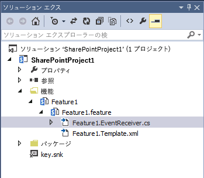

# SharePoint 2010 からのアップグレード時に、機能アップグレードを使用して新しい SharePoint 2013 マスター ページを適用する
SharePoint 2013 サイトを 2010 から 2013 互換モードにアップグレードするとき、 `FeatureUpgrading` イベント中にカスタム マスター ページを再設定する方法を説明します。
SharePoint 2010 のカスタマイズを SharePoint 2013 にアップグレードするとき、作成したカスタム マスター ページへのすべての参照は default.master ページに戻ります。1 つ以上のカスタム マスター ページを含む機能を SharePoint 2010 互換モードで実行しているアップグレードされた SharePoint 2013 サイト コレクションに展開している場合は、2013 互換モードにアップグレードするときに SharePoint 2013 マスター ページをリセットする必要があります。このトピックでは、機能レシーバーを使用して、SharePoint 2010 からアップグレードする際に SharePoint 2013 カスタム マスター ページが確実にリセットされるようにする方法を説明します。 
  
    
    


## カスタム アップグレード コードを使用してマスター ページをリセットする

「 [SharePoint Server 2013 でカスタム機能をアップグレードされたサイト コレクションに展開する](http://technet.microsoft.com/ja-jp/library/dn673579%28v=office.15%29.aspx)」のガイダンスで説明されているように、SharePoint 2010 から SharePoint 2013 にアップグレードするとき、ファーム内のサイト コレクションは既定で SharePoint 2010 互換モードで実行されます。どのような方法でカスタム機能をアップグレードしたかに応じて、1 つか 2 つのソリューション パッケージを使用することで指定の機能が展開されます。
  
    
    

- 「15」の互換レベルのカスタム ロジックのために、または機能が「14」と「15」の両方の互換レベルで問題なく動作するために、「14」と「15」の両方の互換レベルに展開可能な単一のソリューション パッケージ。
    
  
- 同じ機能の別のバージョンが含まれている 2 つのソリューション パッケージ。 このアプローチは、「機能マスキング」と呼ばれます。
    
  
どちらの場合も、作成したすべてのカスタム マスター ページは、アップグレードの際に default.master ページに戻ります。機能に含まれるロジックによってこれらのページをリセットするのでなければ、機能 (または機能の「15」バージョン) を再アクティブ化して、マスター ページをカスタム バージョンにリセットする必要があります。2013 カスタム マスター ページは、 `FeatureUpgrading` イベントに関連付けられた機能レシーバーを使用してリセットできます。
  
    
    

### 機能レシーバーを使用して 2013 カスタム マスター ページをリセットするには


1. Visual Studio でソリューションを開きます。ソリューション エクスプローラーの [ **フィーチャー**] ノードの下で機能を検索し、その機能の feature.xml ファイルを開きます。
    
  
2.  `<UpgradeActions>` セクションを feature.xml ファイルに追加して、アクションが、「14」の互換レベルで現在使用中の機能のバージョンにのみ適用されるようにします。このセクションは、機能がアップグレードされるときに実行するアクションの名前を指定します。以下の例は、機能のバージョン 1.0.0.0 が使用されているときにアップグレードを指定します。例の中で、アクション `UpgradeFeature` が、機能レシーバーを追加した後に定義する **FeatureUpgrading(SPFeatureReceiverProperties, String, IDictionary<String, String>)** メソッドの実装に渡されます。
    
  ```XML
  
<UpgradeActions
    ReceiverAssembly="MyFeatureReceiver, Version=2.0.0.0, Culture=neutral, PublicKeyToken=<token>"
    ReceiverClass="MyFeature.MyFeatureEventReceiver">
  <VersionRange BeginVersion="1.0.0.0" EndVersion="1.0.0.0">
   <CustomUpgradeAction Name="UpgradeFeature"/>
<ApplyElementManifests>
<ElementManifest Location="MasterPages\\UpgradeElements.xml" />
</ApplyElementManifests>
  </VersionRange>
</UpgradeActions>

  ```


    1 つ以上のマスター ページをプロジェクトの **MasterPages** フォルダーに入れて、1 つ以上のマスター ページに関連したメタデータを **UpgradeElements.xml** ファイルに入れます。
    
  
3.  `<Properties>` セクションを feature.xml ファイルに追加します。このセクションには、サイトがアップグレードされるときに設定する 1 つ以上の 2013 カスタム マスター ページを指定する、キーと値のペアが含まれています。以下の例は、機能レシーバーで使用される `My15MasterPage` キーの値を指定します。
    
  ```
  
<Properties>
  <Property Key="My15MasterPage" Value="_catalogs/masterpage/My15MasterPage.master" />
</Properties>

  ```

4. ソリューション エクスプローラーの [ **フィーチャー**] ノードの下で、機能の名前を右クリックしてから、[ **イベント レシーバーの追加**] を選択して機能レシーバーを機能に追加します。
    
    これにより、ソリューション エクスプ ローラーの機能の下にコード ファイルが追加されます。図 1 は、[ **フィーチャー**] フォルダーの機能の下でサンプルの Feature1.EventReceiver.cs ファイルが存在する場所を示しています。
    

   **図 1. 機能内のイベント レシーバーのコード ファイル**

  


  

    このファイルには、コメント付きで空の  `FeatureUpgrading` メソッドが含まれています。このメソッドは次のステップで使用します。
    
  
5. コード ファイルを開いて、FeatureUpgrading メソッドのコメントを削除します。これにより、 **FeatureUpgrading(SPFeatureReceiverProperties, String, IDictionary<String, String>)** メソッドがオーバーライドされます。次の例は、feature.xml ファイルで以前に指定された `My15MasterPage` ファイルのものです。
    
  ```cs
  
public override void FeatureUpgrading(SPFeatureReceiverProperties properties, string upgradeActionName, System.Collections.Generic.IDictionary<string, string> parameters)
        {
 
            try
            {
            if (upgradeActionName != "UpgradeFeature")
                return;
                //Set the master page to a value stored as a property in the feature.xml file
                string masterPage = properties.Definition.Properties[My15MasterPage].Value;
                string baseURL;
                var currentWeb = properties.Feature.Parent as SPWeb;
 
                //Checks to see that the API returns a string that ends in a "/" and if not adds it.
                if (currentWeb.ServerRelativeUrl.Substring(currentWeb.ServerRelativeUrl.Length - 1) == "/")
                {
                    baseURL = currentWeb.ServerRelativeUrl;
                }
                else
                {
                    baseURL = currentWeb.ServerRelativeUrl + "/";
                }
 
                masterPage = baseURL + masterPage;
                currentWeb.CustomMasterUrl = masterPage;
 
                currentWeb.Properties.Update();
                currentWeb.Update();
            }
            }
 
            catch (Exception ex)
            {
             //Handle exception
            }
        }

  ```

アップグレードが終了したら、機能の今後の長期的なメンテナンスについて検討します。完全に信頼できるコードを保持する方法については、「 [SharePoint 2010 でのアプリケーション ライフサイクル管理](http://msdn.microsoft.com/ja-jp/library/office/gg604045%28v=office.14%29.aspx)」を参照してください。この記事は特に SharePoint 2010 に言及していますが、SharePoint 2013 の完全に信頼できるコードにも同様に適用されます。機能のバージョン管理やアップグレードのアクションについて詳しく知らない場合は、この記事の「 [ソリューション ライフサイクル管理モデル](http://msdn.microsoft.com/ja-jp/library/office/gg604045%28v=office.14%29.aspx#sectionSection7)」セクションを参照してください。また、「 [フィーチャー バージョンを使用する際のベスト プラクティス](http://msdn.microsoft.com/ja-jp/library/office/ee535064%28v=office.14%29.aspx)」も参照してください。
  
    
    

## その他の技術情報
<a name="bk_addresources"> </a>


-  [SharePoint Server 2013 でアップグレードされたサイト コレクションにカスタム機能を展開する](http://technet.microsoft.com/ja-jp/library/dn673579%28v=office.15%29.aspx)
    
  
-  [サイトのカスタマイズを SharePoint 2013 用にアップグレードする](upgrade-site-customizations-for-sharepoint-2013.md)
    
  
-  [SharePoint 2013 へのアップグレード](http://technet.microsoft.com/ja-jp/library/cc303420%28v=office.15%29.aspx)
    
  
-  [ブランド表示とサイト プロビジョニングのための SharePoint 2013 および SharePoint Online ソリューション パック](http://www.microsoft.com/en-us/download/details.aspx?id=42030)
    
  
-  [SharePoint 2013 のソリューションをインストールし管理する](http://technet.microsoft.com/ja-jp/library/cc263205%28v=office.15%29.aspx)
    
  

