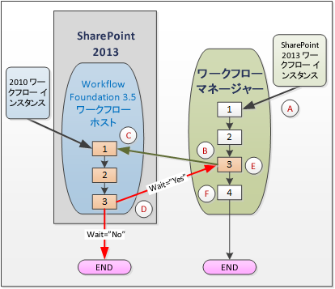
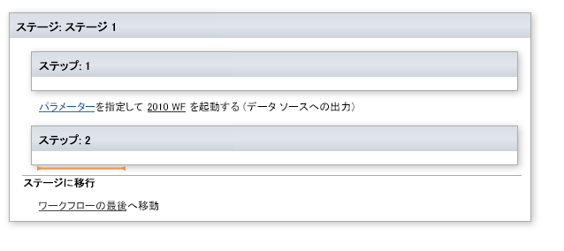
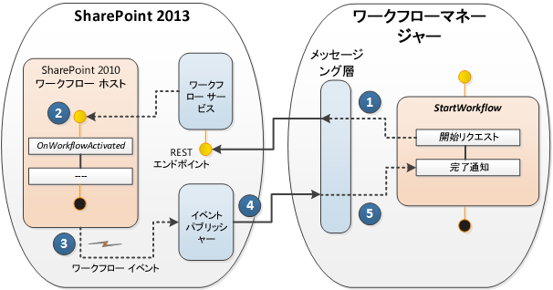

# SharePoint 2013 のワークフロー相互運用機能の使用
Visual Studio 2012 ワークフロー デザイナーにおける SharePoint ワークフローの相互運用機能の使用について説明します。ワークフローの相互運用機能を使用すると、SharePoint 2010 のワークフローを SharePoint 2013 ワークフロー内から呼び出すことができます。既存のワークフローの機能を再利用できるだけでなく、SharePoint 2013 に統合されていないワークフロー アクティビティを呼び出せる重要な機能です。

  
    
    

> **重要**
> SharePoint Designer 2013 における SharePoint のワークフローの相互運用機能の使用については、「 [SharePoint Designer 2013 での連携アクションを理解する](understanding-coordination-actions-in-sharepoint-designer-2013.md)」を参照してください。 
  
    
    

## SharePoint ワークフロー相互運用機能

次のような問題があります。SharePoint 2013 プラットフォームで再利用する従来の SharePoint 2010 のワークフローがあります。または、さらに悪いことに、新しい SharePoint 2013 のワークフローを作成中で、SharePoint 2010 プラットフォームでのみ使用可能なアクティビティを呼び出す必要があり、どうすれば良いか分かりません。実際、解決策は単純です。SharePoint ワークフローの相互運用機能を使用します。
  
    
    
SharePoint ワークフローの相互運用機能を使用すると、SharePoint 2010 のワークフロー (Windows Workflow Foundation 3 で作成) が、Windows Workflow Foundation 4 を基にした SharePoint 2013 ワークフロー エンジンでスムーズに機能します。一方、新しい Windows Workflow Foundation 4 実行エンジンは ワークフロー マネージャー にホストされ、外部サービスとして実行します。SharePoint 2013 には、SharePoint 2010 のワークフローを処理するために使用される従来の SharePoint ワークフローのホストが含まれています。図 1 に示すように、SharePoint ワークフローの相互運用機能は、2 つの実行環境とネゴシエートします。
  
    
    

**図 1. 操作中の SharePoint ワークフローの相互運用機能**

  
    
    

  
    
    

  
    
    
図 1 に示す処理を順を追って説明します。図中の文字は強調する参照点を示しています。
  
    
    

  
    
    
> ( **A** ) SharePoint 2013 ワークフローのインスタンス。Windows Workflow Foundation 4 ベースのワークフロー マネージャーで実行を開始します。ワークフロー マネージャーは SharePoint の内部にあるのではなく、外部サービスとして実行することに注意してください。
    
  

  
    
    
> ( **B** ) SharePoint 2013 ワークフローの、ワークフロー マネージャーの手順番号 3 まで来ました。ここでは SharePoint 2010 ワークフローを呼び出します。これを行うには、Visual Studio 2012 のワークフロー デザイナーで、図 2 に示すように、 **Start 2010 WF** アクティビティを実行します。
    
   **図 2. SharePoint 2010 ワークフローを開始するためのステージ タイル。**

  

  

    
    
    SharePoint オブジェクト モデルの観点から、これは  [WorkflowInteropService](https://msdn.microsoft.com/library/Microsoft.SharePoint.WorkflowServices.WorkflowInteropService.aspx) クラスの [StartWorkflow](https://msdn.microsoft.com/library/Microsoft.SharePoint.WorkflowServices.WorkflowInteropService.StartWorkflow.aspx) メソッドを使用して実現します。
    
  

  
    
    
> ( **C** ) この時点で、SharePoint 2010 のワークフローは、SharePoint 内の Windows Workflow Foundation 3.5 ワークフロー ホストで実行を開始します。ただし、ここで重要な考慮事項があります。シナリオによっては、2010 のワークフローの実行が完了する (さらに場合によってはデータを返す) まで、2013 のワークフローの実行を続行するのを待つ必要があります。他のシナリオでは、これが必要でないことがありますが、いずれのワークフローも並行して独立して実行することができます。
    
    この動作を制御するため、Windows Workflow Foundation 3.5 のワークフローのホストにあるワークフローの実行を制御する  [WorkflowInterop](https://msdn.microsoft.com/library/Microsoft.SharePoint.WorkflowServices.Activities.WorkflowInterop.aspx) クラスには、 [Wait](https://msdn.microsoft.com/library/Microsoft.SharePoint.WorkflowServices.Activities.WorkflowInterop.Wait.aspx) プロパティが用意されています。Boolean プロパティを (デザイナーのダイアログ ボックスで) " **Yes**" に設定するか、 **Wait** プロパティで " **true**" に設定すると、2010 の実行が完了して " **completed**" メッセージが返されるまで 2013 のワークフローが一時停止します。
    
    
    

   **図 3. [ワークフローのプロパティ] ダイアログ ボックスの開始。**

  

![[ワークフローの開始] アクティビティのプロパティを設定](images/wfInterop_.png)
  

  

  

  
    
    
> ( **D** ) **Wait** プロパティで **true** または **false** を選択する (あるいは [プロパティ] ダイアログ ボックスで [ **はい**] または [ **いいえ**] を選択する) 実用的な効果について示しています。 **Wait** が **true** の場合、2010 ワークフローは [WorkflowCompleted](https://msdn.microsoft.com/library/Microsoft.SharePoint.WorkflowServices.WorkflowInteropEventReceiver.WorkflowCompleted.aspx) イベントを渡します (さらに、必要に応じて、データを [DynamicValue](http://msdn.microsoft.com/library/2af7983b-8357-4e0f-9ba9-dfdeed05a8a7.aspx) プロパティとして返します)。動的な値の詳細については、「 [Understanding Dynamic Value](http://msdn.microsoft.com/library/c5702628-9625-4d19-95c5-13923e91fea1.aspx)」を参照してください。
    
    もちろん、 **Wait** が **false** に設定されている場合、2010 ワークフローは実行し、通常どおりに終了します。
    
  

  
    
    
> ( **E** ) この手順は、2010 ワークフローの呼び出しで **Wait=true** が指定されている場合にのみ該当します。この場合、2013 ワークフローは、 **WorkflowCompleted** イベントを受信すると、中断された時点で 2013 ワークフローの実行を再開します。
    
  

  
    
    
> ( **F** ) 2013 ワークフローは実行を完了し、通常どおりに終了します。 **Wait=false** の場合、2013 ワークフローの実行と終了は、2010 ワークフローとは独立して行われます。
    
  

## ワークフロー相互運用機能の設計

SharePoint ワークフロー相互運用機能は、WF 3 と WF 4 のワークフロー アクティビティ間で 1 対 1 のインスタンスのマッピングをサポートするメッセージング フレームワークです。WF 3 および WF 4 は、 [WorkflowInteropService](https://msdn.microsoft.com/library/Microsoft.SharePoint.WorkflowServices.WorkflowInteropService.aspx) における一連の WF 4 アクティビティによってラップされたメッセージのやり取りを通して相互運用します。
  
    
    
ワークフローの相互運用機能をサポートするには、SharePoint Designer のワークフロー デザイン領域から [ **2010 WF の開始**] という新しいワークフロー アクティビティにアクセスできるようになります。このアクティビティは、 [StartWorkflow](https://msdn.microsoft.com/library/Microsoft.SharePoint.WorkflowServices.WorkflowInteropService.StartWorkflow.aspx) メソッドのラッパーです。このアクティビティを使用すると、リスト ワークフローまたはサイト ワークフローのいずれかを開始できます。
  
    
    
実際、このアクティビティは、ワークフロー マネージャーと SharePoint 2013 内で実行する SharePoint 2010 ワークフロー ホストの間で発生する一連のメッセージです。図 4 に示すように、この 2 つはメッセージング層によって仲介されます。シーケンスは、SharePoint 2013 ワークフロー マネージャーで **StartWorkflow** メソッドを呼び出すことで開始します。"start" メッセージは、SharePoint 内のワークフロー サービスに移動し、ここから SharePoint 2010 ワークフロー ホスト内のワークフローが開始されます。2010 ワークフローが完了すると、"completed" メッセージがイベント パブリッシャーを経由して 2013 ワークフロー マネージャーに送信されるイベントが発生します。
  
    
    

**図 4. SharePoint ワークフローの相互運用機能のメッセージング プロトコル**

  
    
    

  
    
    

  
    
    

  
    
    

  
    
    

## その他の技術情報

-  [SharePoint 2013 ワークフローの概要](get-started-with-workflows-in-sharepoint-2013.md)
    
  
-  [SharePoint 2013 ワークフローの基盤](sharepoint-2013-workflow-fundamentals.md)
    
  
-  [SharePoint Designer 2013 での連携アクションを理解する](understanding-coordination-actions-in-sharepoint-designer-2013.md)
    
  
-  [WorkflowInteropService](https://msdn.microsoft.com/library/Microsoft.SharePoint.WorkflowServices.WorkflowInteropService.aspx)
    
  
-  [WorkflowInteropEventReceiver](https://msdn.microsoft.com/library/Microsoft.SharePoint.WorkflowServices.WorkflowInteropEventReceiver.aspx)
    
  

  
    
    

