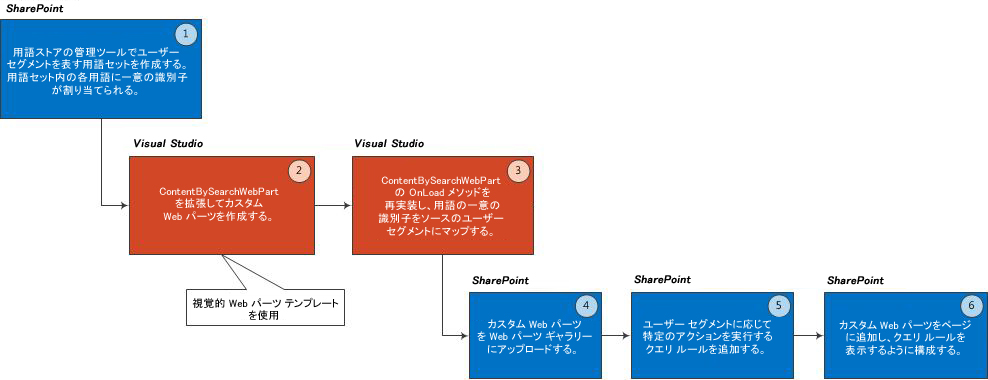

# SharePoint 2013 のユーザー セグメンテーション
用語セット、コンテンツ検索 Web パーツ、クエリ ルールを組み合わせて SharePoint Server 2013 で使用し、ロケール、興味、性別、紹介リンクなどに基づいて定義したユーザー セグメントに合わせてカスタマイズしたコンテンツを表示します。
SharePoint Server 2013 には、性別、住所、興味、紹介リンクなどエンドユーザーの特定の属性に応じて SharePoint 2013 サイトに表示するコンテンツをカスタマイズするための構成要素があります。このようなユーザー属性のグループ化をユーザー セグメントと呼びます。 
  
    
    

SharePoint 2013 では、このユーザー セグメンテーション機能が次のような多くのシナリオで役に立つことがあります。
- エンドユーザーの性別に応じて異なるバナーをページに表示する 
    
  
- エンドユーザーのロケールに応じて異なる割引サービスを表示する 
    
  
- エンドユーザーの紹介リンク (エンドユーザーがこのページにアクセスする元となった Web サイト) によって異なる記事をページに表示する 
    
  
SharePoint にユーザー セグメンテーションを実装するには、ユーザー セグメントごとに用語セットを作成する、コンテンツ検索 Web パーツを拡張してユーザー セグメントを認識できるようにする、クエリ ルールを使用してユーザー セグメントごとに特定のアクションを実行する、という 3 つの操作を行います。
## 前提条件
<a name="SP15_Prerequisites"> </a>

SharePoint へのユーザー セグメンテーションの実装を始める前に、開発環境に次のものがインストールされていることを確認してください。
  
    
    

- SharePoint Server 2013
    
  
- Visual Studio 2012
    
  
この記事では、読者が SharePoint で Web パーツを開発した経験があることを前提にしています。Web パーツの開発の詳細については、「 [構成要素: Web パーツ](http://msdn.microsoft.com/ja-jp/library/ee535520%28v=office.14%29.aspx)」を参照してください。 
  
    
    

## ユーザー セグメンテーション機能の SharePoint サイトへの追加の概要
<a name="SP15_Overview_User_Segmentation"> </a>

図 1 に、ユーザー セグメンテーション機能を SharePoint サイトに追加する基本手順を示します。
  
    
    

**図 1. ユーザー セグメンテーション機能を SharePoint サイトに追加する手順**

  
    
    

  
    
    

  
    
    

  
    
    

  
    
    

## 用語セットを作成する
<a name="SP15_Create_a_term_set"> </a>

用語とは、SharePoint 2013 内のアイテムと関連付けることができる語句です。用語セットとは、関連付けられた用語のコレクションです。詳細については、「 [SharePoint Server 2013 の管理されたメタデータの概要](http://technet.microsoft.com/ja-jp/library/ee424402.aspx)」を参照してください。用語セットは SharePoint 用語ストアの管理ツールを使用して、またはプログラムによって作成できます。 
  
    
    

> **メモ**
>  用語ストアの管理ツールを使用して用語セットを作成する方法の詳細については、次のトピックを参照してください。>  [新しい用語セットを設定する](http://office.microsoft.com/ja-jp/sharepoint-help/set-up-a-new-term-set-ha102922634.aspx)>  [用語セットの用語を作成および管理する](http://office.microsoft.com/ja-jp/sharepoint-online-enterprise-help/HA102771989.aspx?CTT=1)
  
    
    

 [Microsoft.SharePoint.Taxonomy](https://msdn.microsoft.com/library/Microsoft.SharePoint.Taxonomy.aspx) で公開されるタイプを使用して、プログラムによって用語セットを作成できます。次のコード例は、 **TermSet** オブジェクトを作成し、 **NavigationTermSet** を取得する方法を示しています。次に、 **TermSet** 内に **Term** オブジェクトを作成します。最後に、 **TermStore** に対するこれらの変更をコミットし、ナビゲーションに使用できるように **TermSet** をロードします。
  
    
    
用語セットに追加した用語ごとに一意の識別子が付与されます。この識別子は、 [ContentBySearchWebPart](https://msdn.microsoft.com/library/Microsoft.Office.Server.Search.WebControls.ContentBySearchWebPart.aspx) がユーザー セグメントを認識するためのキーです。
  
    
    


```cs

static void CreateNavigationTermSet(string siteUrl)
{
    using (SPSite site = new SPSite(siteUrl))
    {
        using (SPWeb web = site.OpenWeb())
        {
            TaxonomySession taxonomySession = new TaxonomySession(site);
            taxonomySession.UpdateCache();
            TermStore termStore = taxonomySession.DefaultSiteCollectionTermStore;

            // Create a TermSet object in a default site collection term group.
            Group siteCollectionGroup = termStore.GetSiteCollectionGroup(site, createIfMissing: true);
            TermSet termSet = siteCollectionGroup.CreateTermSet("Navigation Demo", Guid.NewGuid(), lcid: 1033);

            // Obtain navigation term set.
            NavigationTermSet navigationTermSet = NavigationTermSet.GetAsResolvedByWeb(termSet, web, "GlobalNavigationTaxonomyProvider");

            // Create a term that points to a SharePoint page set at the term set level of hierarchy.
            NavigationTerm term1 = navigationTermSet.CreateTerm("Term 1", NavigationLinkType.FriendlyUrl, Guid.NewGuid());

            // Create a term that points to an already existing URL outside of SharePoint.
            NavigationTerm term2 = navigationTermSet.CreateTerm("Term 2", NavigationLinkType.SimpleLink, Guid.NewGuid());
            term2.SimpleLinkUrl = "http://www.bing.com/";

            // Create a term that points to an existing SharePoint page.
            NavigationTerm term3 = navigationTermSet.CreateTerm("Term 3", NavigationLinkType.FriendlyUrl, Guid.NewGuid());

            // Save all changes to the term store.
            termStore.CommitAll();
        }
    }
}
```


## ユーザー セグメンテーション用のカスタム Web パーツを作成する
<a name="SP15_Create_a_custom_web_part_user_segmentation"> </a>

Visual Studio 2012 で、SharePoint Server 2013 カテゴリの視覚的 Web パーツ テンプレートを使用して、カスタム Web パーツを作成します。カスタム Web パーツは、 [ContentBySearchWebPart](https://msdn.microsoft.com/library/Microsoft.Office.Server.Search.WebControls.ContentBySearchWebPart.aspx) オブジェクトから継承する必要があります。
  
    
    

> **メモ**
> この記事では、読者が SharePoint で Web パーツを開発した経験があることを前提にしています。Web パーツの開発の詳細については、「 [構成要素: Web パーツ](http://msdn.microsoft.com/ja-jp/library/ee535520%28v=office.14%29.aspx)」を参照してください。 
  
    
    


## カスタム Web パーツにユーザー セグメンテーション ロジックを設定する
<a name="SP15_Configure_custom_web_part_user_segmentation_logic"> </a>

カスタム Web パーツでは、 [OnLoad()](https://msdn.microsoft.com/library/Microsoft.Office.Server.Search.WebControls.ContentBySearchWebPart.OnLoad.aspx) メソッドまたは [OnInit()](https://msdn.microsoft.com/library/Microsoft.Office.Server.Search.WebControls.ContentBySearchWebPart.OnInit.aspx) メソッドを再実装して、カスタム ロジックを実行できます。これらのメソッドはどちらも [ContentBySearchWebPart](https://msdn.microsoft.com/library/Microsoft.Office.Server.Search.WebConrols.ContentBySearchWebPart.aspx) オブジェクトのプロパティを設定またはカスタマイズするのに役立ちます。
  
    
    

### 例 1: Male および Female ユーザー セグメントを SharePoint Server 2013 サイトに追加する

 **Male** および **Female** ユーザー セグメントを追加するには、次のコードに示すように、 [OnLoad()](https://msdn.microsoft.com/library/Microsoft.Office.Server.Search.WebControls.ContentBySearchWebPart.OnLoad.aspx) メソッドを再実装します。
  
    
    

```cs

protected override void OnLoad(EventArgs e)
{
    if (this.AppManager != null)
    {
        if (this.AppManager.QueryGroups.ContainsKey(this.QueryGroupName) &amp;&amp; this.AppManager.QueryGroups[this.QueryGroupName].DataProvider != null)
        {
            this.AppManager.QueryGroups[this.QueryGroupName].DataProvider.BeforeSerializeToClient += new
                BeforeSerializeToClientEventHandler(AddMycustomProperties);
        }
    }
    base.OnLoad(e);
}
```

対応する **AddMycustomProperties** メソッドは、次のコードのようになります。
  
    
    


```cs

private void AddMycustomProperties(object sender, BeforeSerializeToClientEventArgs e)
{
    DataProviderScriptWebPart dp = sender as DataProviderScriptWebPart;
    string gender = (string)Page.Session["DataProvider.Gender"];
    // Depends on what your DataProvider is: Facebook, LinkedIn, etc.

    if (dp != null &amp;&amp; gender != null)
    {   try
        {
            // Set property to male or female GUID.
            if (gender.CompareTo("female") == 0)
            {
                dp.Properties["TermSetName"] = new String[] { "TermUniqueIdentifier" };
                // E.g. 47ba9139-a4c5-4ff0-8f9a-2864be32da92
            }
            else if(gender.CompareTo("male") == 0)
            {
                dp.Properties["UserSegmentTerms"] = new String[] { "TermUniqueIdentifier" };
                // E.g. f5bf2195-2170-4b11-a018-a688a285e579
            }
        }
        catch (ArgumentException exp)
        {
             // Do something with the exception.
        }
   }
}
```


### 例 2: エンドユーザーが使用している Web ブラウザーの種類に基づいてユーザー セグメントを作成する

エンドユーザーが使用している Web ブラウザーの種類に基づいてユーザー セグメントを作成し、SharePoint Server 2013 サイトを表示するには、次のコードに示すように、 **OnLoad** メソッドを再実装します。
  
    
    

```cs

protected override void OnLoad(EventArgs e)
{
    if (this.AppManager != null)
    {
        if (this.AppManager.QueryGroups.ContainsKey(this.QueryGroupName) &amp;&amp; this.AppManager.QueryGroups[this.QueryGroupName].DataProvider != null)
        {
             this.AppManager.QueryGroups[this.QueryGroupName].DataProvider.BeforeSerializeToClient += new 
                 BeforeSerializeToClientEventHandler(AddMycustomProperties);
        }
    }
    base.OnLoad(e);
}
```

 **AddMycustomProperties** メソッドのコードは、次の例のようになります。
  
    
    


```cs

private void AddMycustomProperties(object sender, BeforeSerializeToClientEventArgs e)
{
    DataProviderScriptWebPart dataProvider = sender as DataProviderScriptWebPart;
    SPSite site = SPContext.Current.Site;
  
    TaxonomySession session = new TaxonomySession(site);
    TermStore defaultSiteCollectionStore = session.DefaultSiteCollectionTermStore;
    List<string> userSegmentTerms = new List<string>();

    var userAgentparts = Page.Request.UserAgent.Split(new char[] { ';', '(', ')' });

    foreach (var part in userAgentparts)
    {
        var entry = part.Trim();
        var terms = termStore.GetTermsWithCustomProperty("UserAgent", entry, false);

            if (terms.Count > 0)
            {
                userSegmentTerms.Add(terms[0].Id.ToString());
            }
    }
    dataProvider.Properties["UserSegmentTerms"] = userSegmentTerms.ToArray();
}
```


## カスタム Web パーツを SharePoint Web パーツ ギャラリーにアップロードする
<a name="SP15_Upload_custom_web_part"> </a>

カスタム Web パーツをページで使用するには、Web パーツを **SharePoint Web Part Gallery**にアップロードする必要があります。
  
    
    
 **SharePoint Web Part Gallery**で [ **サイトの設定**] を選択し、[ **Web デザイナー ギャラリー**] で [ **Web パーツ**] を選択します。[ **ファイル**] タブで、[ **ドキュメントのアップロード**] を選択します。
  
    
    

## ユーザー セグメントに応じて特定のアクションを実行するためのクエリ ルールを追加する
<a name="SP15_Add_query_rules_to_carry_out_actions"> </a>

クエリ ルールは、ユーザーが検索しようとする対象にインテリジェントに対応することによって、検索結果の関連性を向上させるようにクエリを変換します。クエリ ルールでは、条件と関連付けられたアクションを指定します。クエリがクエリ ルールの条件を満たすと、検索結果の絞り込みや結果の表示順の変更など、検索結果の関連性を向上させるためにルールで指定されたアクションが実行されます。
  
    
    
ユーザー セグメンテーションを実装する際に、クエリ ルールを使用して、定義したユーザー セグメント用の条件とアクションを定義します。エンドユーザーが特定のユーザー セグメントに含まれる場合、クエリ ルールがアクティブになり、 [ContentBySearchWebPart](https://msdn.microsoft.com/library/Microsoft.Office.Server.Search.WebConrols.ContentBySearchWebPart.aspx) によって、そのユーザー セグメント用にカスタマイズされたコンテンツが表示されます。
  
    
    

### 特定のユーザー セグメントに対してアクティブになるクエリ ルールを作成するには


1. [ **サイトの設定**] にある発行サイト コレクションで [ **サイト コレクションの管理**] を選択し、[ **検索クエリ ルール**] を選択します。 
    
  
2. 検索先を選択し、[ **新しいクエリ ルール**] を選択します。
    
  
3. [ **ルール名**] フィールドにルール名を入力します。[ **コンテキスト**] をクリックして展開します。
    
  
4. [ **クエリはこれらのユーザー セグメントごとに実行されます**] セクションで [ **これらのユーザー セグメントのいずれか**] を選択し、[ **ユーザー セグメントの追加**] をクリックします。
    
  
5. [ **タイトル**] フィールドに、このユーザー セグメントのクエリ ルールの名前を入力します。[ **ユーザー セグメントの用語の追加**] を選択します。
    
  
6. [ **用語ストアからインポートする**] ダイアログ ボックスで、[ **Managed Metadata Service**] を展開します。[ **サイト コレクション**] で、「 [用語セットを作成する](#SP15_Create_a_term_set)」で定義済みのユーザー セグメンテーション用語を含む用語セットを探します。このクエリ ルールを適用するユーザー セグメントを選択します。[ **保存**] をクリックします。
    
  
7. [ **ユーザー セグメントの追加**] ダイアログ ボックスで、ユーザー セグメントの名前を入力します。 
    
    これでクエリ ルールがユーザー セグメントにマッピングされ、結果的にユーザー セグメントの用語にマッピングされます。
    
  
8. [ **クエリの条件**] で [ **条件の削除**] を選択します。 
    
    これによって、 [ContentBySearchWebPart](https://msdn.microsoft.com/library/Microsoft.Office.Server.Search.WebConrols.ContentBySearchWebPart.aspx) に設定されたクエリがクエリの条件の役割を果たすように指定されます。
    
  
9. クエリ ルールによって実行される、対応するアクションを設定します。[ **アクション**] セクションで、クエリ ルールの結果として実行される、対応するアクションを選択します。[ **昇格した結果の追加**] または [ **結果のブロックを追加**] を選択できます。
    
  
10. クエリ ルールを保存します。
    
  
11. 実行するアクションに応じて、その他のユーザー セグメントに対して手順 1. ～ 10. を繰り返します。
    
  

## カスタム Web パーツを SharePoint ページに追加してクエリ ルールを表示するように設定する
<a name="SP15_Add_custom_web_part_to_SharePoint"> </a>

カスタム Web パーツを SharePoint ページに追加する必要があります。
  
    
    

### カスタム Web パーツを追加するには


1. カテゴリ ページに移動し、[ **ページの編集**] を選択して、[ **ページ テンプレートの編集**] を選択します。
    
  
2. ページの上部セクションで [ **Web パーツの追加**] を選択します。Web パーツの右上隅にあるドロップダウン メニューからカスタム Web パーツを選択します。 
    
  
3. [ **Web パーツの編集**] をクリックします。
    
  
4. [ **設定**] セクションを展開し、[ **結果テーブル**] フィールドで [ **SpecialTermResults**] を選択します。 
    
  
5. 設定を保存します。
    
  

## その他の技術情報
<a name="bk_addresources"> </a>


-  [SharePoint サイトの構築](build-sites-for-sharepoint.md)
    
  
-  [SharePoint 2013 でユーザー セグメンテーションを設定して製品カタログの適応性を向上させる](http://blogs.msdn.com/b/adaptive_experiences_in_sharepoint_2013/archive/2012/11/14/set-up-user-segmentation-to-drive-adaptive-experiences-in-a-product-catalog-in-sharepoint-2013.aspx)
    
  

  
    
    

