# Visio での検証に関する問題 (SharePoint 2010 ワークフロー プラットフォーム)
Visio Professional 2013 から SharePoint Designer 2013 に SharePoint ワークフローをエクスポートするときの検証に関する問題の解決について説明します。 
この記事では、SharePoint Designer 2013 で SharePoint 2010 ワークフロー プラットフォームを使用するときに発生する可能性のある検証の問題について説明します。
  
    
    

## 概要

SharePoint ワークフローを Microsoft Visio Professional 2013 から Microsoft SharePoint Designer 2013 にエクスポートするときは、最初に図を検証する必要があります。ワークフロー図が有効でない場合は、[ **問題**] ウィンドウが表示され、ワークフローをエクスポートするには先に修正する必要のある問題の一覧が示されます。
  
    
    
この記事では、Visio Professional 2013 で発生する可能性のあるワークフローの検証に関する各問題について、説明、例、提案されるアクションを示します。検証の間に問題の通知が表示された場合は、以下の一覧で問題名を探し、例を使用して問題がある部分を明らかにした後、提案されるアクションに従って解決してください。
  
    
    

## ユーザー設定のアクションはワークフロー図に追加できません

メッセージ:
  
    
    
ユーザー設定のアクションはワークフロー図に追加できません。ユーザー設定のアクションは、SharePoint Designer からワークフローをインポートするときのみ生成可能です。
  
    
    
例:
  
    
    

  
    
    
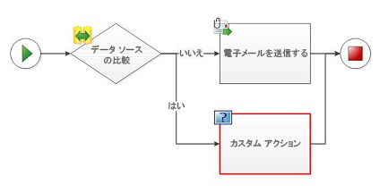
  
    
    
提案されているアクション:
  
    
    
アクションをワークフローに追加する場合、それに対するマスター図形がステンシル内に存在しない場合、独自の図形を作成したり、異なるステンシルからインポートしたりできません。代わりに、既存の図形を使用し、図形の [ **コメントの追加**] 機能を使用して目的の動作を指定してください。
  
    
    

## ユーザー設定の条件はワークフロー図に追加できません

メッセージ:
  
    
    
ユーザー設定の条件はワークフロー図に追加できません。ユーザー設定の条件は、SharePoint Designer からワークフローをインポートするときのみ生成可能です。
  
    
    
例:
  
    
    

  
    
    
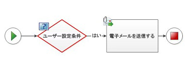
  
    
    
提案されているアクション:
  
    
    
条件をワークフローに追加する場合、それに対するマスター図形がステンシル内に存在しない場合、独自の図形を作成したり、異なるステンシルからインポートしたりできません。代わりに、既存の図形を使用し、図形の [ **コメントの追加**] 機能を使用して目的の動作を指定してください。
  
    
    

## 複合条件をワークフロー図に手動で追加することはできません

メッセージ:
  
    
    
複合条件をワークフロー図に手動で追加することはできません。複合条件は、SharePoint Designer からワークフローをインポートするときのみ生成可能です。
  
    
    
例:
  
    
    

  
    
    
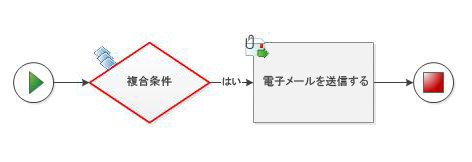
  
    
    
提案されているアクション:
  
    
    
条件をワークフローに追加する場合、それに対するマスター図形がステンシル内に存在しない場合、独自の図形を作成したり、異なるステンシルからインポートしたりできません。代わりに、既存の図形を使用し、図形の [ **コメントの追加**] 機能を使用して目的の動作を指定してください。
  
    
    

## ワークフロー図形間に重複する接続があります

メッセージ:
  
    
    
ワークフロー図形間に重複する接続があります。
  
    
    
例:
  
    
    

  
    
    
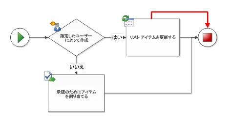
  
    
    
提案されているアクション:
  
    
    
選択して削除することにより、冗長なコネクタを削除します。
  
    
    

## 親図形に折り返し戻ることはできません

メッセージ:
  
    
    
親図形に折り返し戻ることはできません。
  
    
    
例:
  
    
    

  
    
    
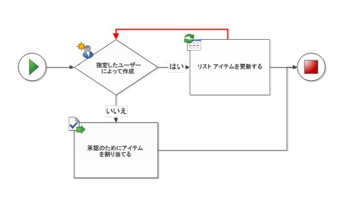
  
    
    
提案されているアクション:
  
    
    
Visio Professional 2013 および SharePoint Designer 2013 はどちらも、ループのあるワークフローをサポートしません。ワークフローにループがないかどうかチェックし、ループしている接続を削除してください。ループしているステップのセットを含む SharePoint ワークフローを作成する場合は、Visual Studio でワークフローを作成する必要があります。
  
    
    

## 並列であると同時に順次でもあるアクティビティは使用できません

メッセージ:
  
    
    
並列であると同時に順次でもあるアクティビティは使用できません。
  
    
    
例:
  
    
    

  
    
    
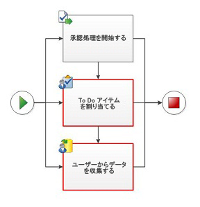
  
    
    
提案されているアクション:
  
    
    
アクティビティは並列であるか連続することができますが、同時に両方の状態になることはできません。並列アクティビティの場合は、連続するコネクタを削除してください。連続アクティビティの場合は、並列コネクタを削除してください。並列であり連続してもいるアクティビティは識別が困難なことがあります。以下の例は、並列および連続配置のその他の一般的な例を示すと共に、代わりとなる配置を提供しています。
  
    
    
例:
  
    
    

  
    
    

  
    
    
提案されているアクション:
  
    
    
コネクタが複数のパスから同じアクティビティを指すことを避けるため、アクティビティの複製を試行してください。
  
    
    

  
    
    
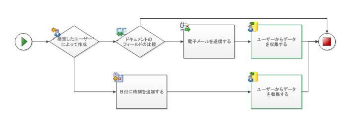
  
    
    
例:
  
    
    

  
    
    
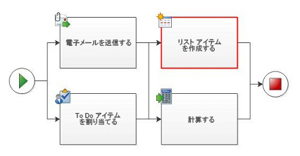
  
    
    
提案されているアクション:
  
    
    
順次ステップで並列ブロックを処理する場合は (通常、SharePoint Designer を使用して作成されたワークフローに出現します)、2 つの並列ブロックの間に "コメントの追加" 図形を使用して、ステップが明確に分離されるようにしてみてください。
  
    
    

  
    
    
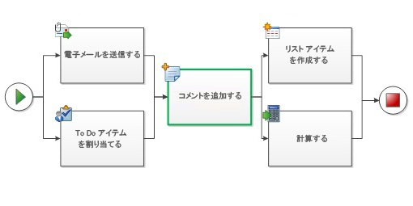
  
    
    

  
    
    

  
    
    

## 条件図形に、"はい" または "いいえ" のラベルの接続がありません

メッセージ:
  
    
    
条件図形に、"はい" または "いいえ" のラベルの接続がありません。
  
    
    
例:
  
    
    

  
    
    
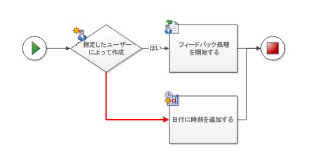
  
    
    
提案されているアクション:
  
    
    
コネクタを右クリックし、"はい" または "いいえ" のラベルを割り当てます。
  
    
    

## 条件図形には、"はい" または "いいえ" のラベルを持つ出力接続を 1 つ以上設定する必要があります。

メッセージ:
  
    
    
条件図形には、" はい" または " いいえ" のラベルを持つ出力接続を少なくとも 1 つ設定する必要があります。
  
    
    
例:
  
    
    

  
    
    
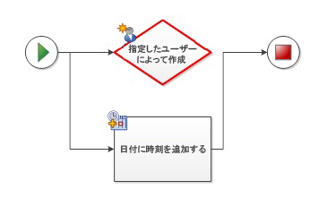
  
    
    
提案されているアクション:
  
    
    
条件図形に別のワークフロー図形に連結された出力コネクタが 1 つ以上あることを確認してください。
  
    
    

## コネクタが SharePoint ワークフロー コネクタではありません

メッセージ:
  
    
    
コネクタが SharePoint ワークフロー コネクタではありません。コネクタ ツールまたはオートコネクト使用して、正しいコネクタが使用されるようにしてください。
  
    
    
例:
  
    
    

  
    
    
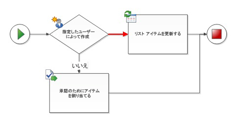
  
    
    
提案されているアクション:
  
    
    
他のダイアグラムのコネクタは、必ずしも SharePoint ワークフローで使用するために設計されていないので、再利用することは避けてください。選択されたコネクタを削除した後、コネクタ ツールまたはオートコネクトを使用して新規コネクタで置き換えます。
  
    
    

## コネクタは 2 つのワークフロー図形に接続する必要があります

メッセージ:
  
    
    
コネクタは 2 つのワークフロー図形に接続する必要があります。
  
    
    
例:
  
    
    

  
    
    
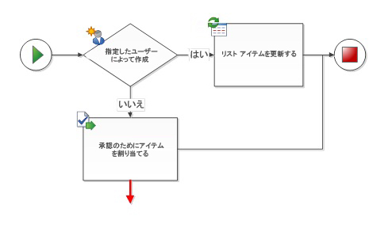
  
    
    
提案されているアクション:
  
    
    
デッドエンドのコネクタを削除するか、2 番目の図形に接続します。
  
    
    

## 図面に設定できるワークフローと開始図形はそれぞれ 1 つだけです

メッセージ:
  
    
    
図面に設定できるワークフローと開始図形はそれぞれ 1 つだけです。
  
    
    
例:
  
    
    

  
    
    
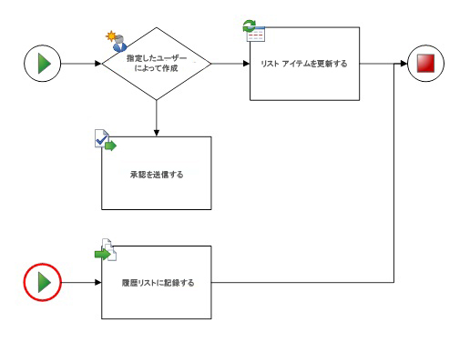
  
    
    
提案されているアクション:
  
    
    
すべてのパスは同じ **開始**図形から始まっている必要があります。余分な **開始**図形を削除した後、パスが 1 つの場所から始まるようにコネクタを配置してください。
  
    
    

## 図形が SharePoint ワークフロー図形ではありません。ワークフローで接続できるのは、SharePoint ワークフロー図形だけです

メッセージ:
  
    
    
図形が SharePoint ワークフロー図形ではありません。ワークフローで接続できるのは、SharePoint ワークフロー図形だけです。
  
    
    
例:
  
    
    

  
    
    
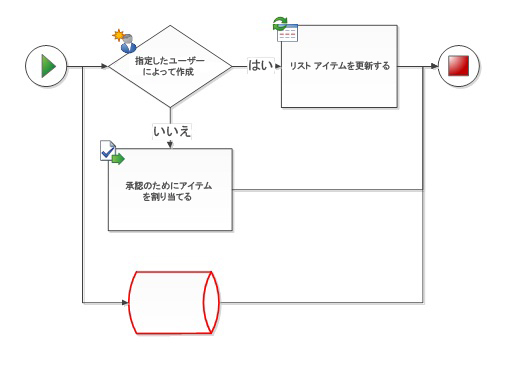
  
    
    
提案されているアクション:
  
    
    
Microsoft SharePoint ワークフロー テンプレートでは、SharePoint ワークフローのステンシルにあるワークフロー図形だけを使用できます。他のフローチャート図形は認識されず、ワークフローを SharePoint Designer 2013 にエクスポートできません。
  
    
    

## 開始図形に入力接続を設定することはできません

メッセージ:
  
    
    
開始図形に入力接続を設定することはできません。
  
    
    
例:
  
    
    

  
    
    
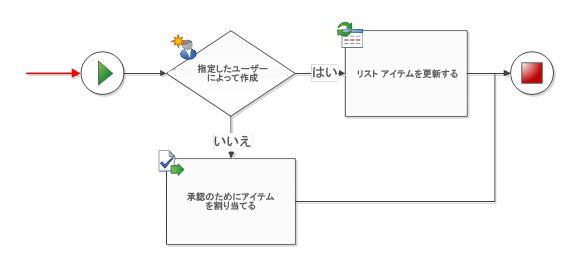
  
    
    
提案されているアクション:
  
    
    
 **開始**図形への入力コネクタを削除します。
  
    
    

## 終了図形に、出力接続を設定することはできません

メッセージ:
  
    
    
終了図形に、出力接続を設定することはできません。
  
    
    
例:
  
    
    

  
    
    
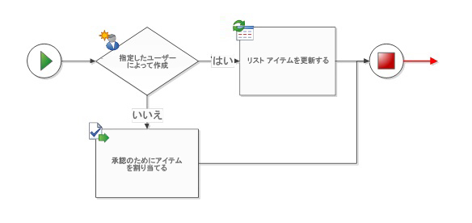
  
    
    
提案されているアクション:
  
    
    
 **終了**図形からの出力コネクタを削除します。
  
    
    

## ワークフローには開始図形が必要です

メッセージ:
  
    
    
ワークフローには開始図形が必要です。
  
    
    
例:
  
    
    

  
    
    
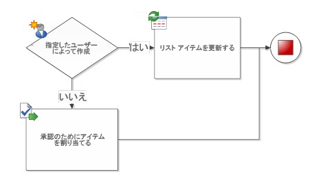
  
    
    
提案されているアクション:
  
    
    
 **開始**図形をワークフローの先頭に追加した後、最初のアクティビティに接続します。
  
    
    

## ワークフロー図形が終結図形に接続されていません

メッセージ:
  
    
    
ワークフロー図形が終結図形に接続されていません。
  
    
    
例:
  
    
    

  
    
    
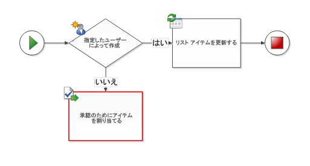
  
    
    
提案されているアクション:
  
    
    
ワークフローに **終了**図形がない場合は、終了図形を追加し、ワークフローの終わりに接続します。ワークフロー図形に別のワークフロー図形への接続が欠けている場合は (例を参照)、図形を削除するか、別のワークフロー図形に接続します。
  
    
    

## ワークフロー図形がワークフローに接続されていません

メッセージ:
  
    
    
ワークフロー図形がワークフローに接続されていません。
  
    
    
例:
  
    
    

  
    
    
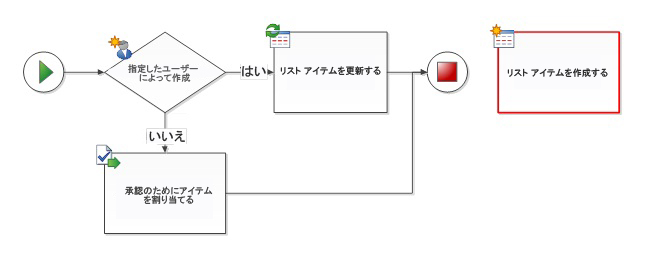
  
    
    
提案されているアクション:
  
    
    
そのワークフロー図形が必要な場合は、コネクタを追加してその図形をワークフロー パスに接続します。そうでない場合は、その図形を削除します。
  
    
    

## ワークフローのネストのレベルの上限は 10 です

メッセージ:
  
    
    
ワークフローのネストのレベルの上限は 10 です。
  
    
    
提案されているアクション:
  
    
    
Visio Professional 2013 は、最大で 10 レベルのネストされたワークフロー アクティビティを認識できます。アクティビティを削除するかワークフロー パスを複数の分岐に分割することにより、複雑さが下がるようにワークフローを再配置してください。
  
    
    

## その他の技術情報

-  [SharePoint 2013 ワークフローの新機能](what-s-new-in-workflows-for-sharepoint-2013.md)
    
  
-  [SharePoint 2013 ワークフローの概要](get-started-with-workflows-in-sharepoint-2013.md)
    
  
-  [SharePoint Designer および Visio でのワークフロー開発](workflow-development-in-sharepoint-designer-and-visio.md)
    
  

  
    
    

