# SharePoint Designer 2013 での Visio の図形: クイック リファレンス ガイド (SharePoint 2010 ワークフロー プラットフォーム)
Microsoft Visio Professional 2013 でワークフローを作成し、それを Microsoft SharePoint Designer 2013 にエクスポートできます。このガイドでは、ワークフローの作成に使用できる Visio の図形について説明します。このリファレンス記事は、SharePoint Designer 2013 で作業するけれども、SharePoint 2010 ワークフロー プラットフォームを引き続き使用する場合にのみ使用してください。SharePoint 2010 ワークフロー プラットフォーム用の図形は、[ **アクション - SharePoint 2010 ワークフロー**]、[ **条件 - SharePoint 2010 ワークフロー**]、[ **終端装置 - SharePoint 2010 ワークフロー**] の 3 つのステンシルにあります。
## ワークフローのアクション

ワークフローのアクションは、ワークフローが実行する固有の操作です。すべてのワークフローは、少なくとも 1 つのアクションを含む必要があります。
  
    
    
この一覧のアクションは、ワークフロー内での適用範囲に基づいて分類されています。たとえば、リスト アイテムの動作に影響を与えるアクションは「 **リスト アクション**」にグループ化されており、ドキュメント セットに関連のあるアクションは「 **ドキュメント セットのアクション**」にグループ化されています。アクションのカテゴリは次のとおりです。
  
    
    

-  [コア アクション](visio-shapes-in-sharepoint-designer-2013-a-quick-reference-guide-sharepoint-2010.md#section1a) ワークフローで最もよく使用されるアクションです。
    
  
-  [ドキュメント セットのアクション](visio-shapes-in-sharepoint-designer-2013-a-quick-reference-guide-sharepoint-2010.md#section1e) 一般に、これらのアクションはドキュメント ライブラリまたはドキュメント コンテンツ タイプと関連付けられたワークフローで使用されます。
    
  
-  [リスト アクション](visio-shapes-in-sharepoint-designer-2013-a-quick-reference-guide-sharepoint-2010.md#section1b) これらのアクションは、リスト アイテムに対する操作を実行します。
    
  
-  [相互関係アクション](visio-shapes-in-sharepoint-designer-2013-a-quick-reference-guide-sharepoint-2010.md#section1d) このカテゴリの唯一のアクションは、ユーザーの上司を検索し、その情報を変数に格納します。
    
  
-  [タスク アクション](visio-shapes-in-sharepoint-designer-2013-a-quick-reference-guide-sharepoint-2010.md#section1c) これらのアクションは、承認、フィードバック、およびフォームの操作と関連付けられます。
    
  

> **重要**
> Visio で SharePoint ワークフローに挿入できるほとんどのアクションの図形では、ワークフローを SharePoint Designer にインポートするときに追加の構成が必要です。Visio では、各アクションの図形のコメント機能を使用して、アクションの設定または構成を指定してください。 
  
    
    

### コア アクション

これらは最もよく使用されるアクションであり、任意の種類のワークフローまたはステップで使用できます。
  
    
    

****

|**Visio アクション図形**|**SharePoint Designer の対応するアクション**|**アクションの説明**|
|:-----|:-----|:-----|
|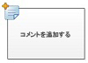|この Visio アクションは SharePoint Designer 2013 の [ **コメントを追加する**] アクションと同じであり、次のように表示されます。       > **メモ**> ワークフローを Visio にエクスポートしても、コメントは表示されたままになります。           |**コメントを追加する**   参照用に、参考になるコメントをワークフロー デザイナー内に残すには、このアクションを使用します。共同編集を行う自分以外のユーザーがワークフローに参加している場合、特に便利です。たとえば、現在のワークフローの変数にわかりやすい名前がない場合は、このアクションを使用して、ワークフロー内での変数の機能を示すコメントを追加します。    |
|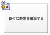|この Visio アクションは SharePoint Designer 2013 の [ **日付に時刻を追加する**] アクションと同じであり、次のように表示されます。   |**日付に時刻を追加する**   日付に特定の時間 (分、時、日、月、または年の単位で指定します) を追加し、出力値を変数に格納するには、このアクションを使用します。日付には、現在の日付、特定の日付、またはルックアップを指定できます。    |
|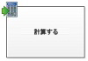|この Visio アクションは SharePoint Designer 2013 の [ **計算を行う**] アクションと同じであり、次のように表示されます。   |**計算を行う**   計算 (2 つの値の加算、減算、乗算、除算など) を実行し、出力値を変数に格納するには、このアクションを使用します。    |
|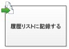|この Visio アクションは SharePoint Designer 2013 の [ **履歴リストに記録する**] アクションと同じであり、次のように表示されます。   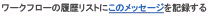|**履歴リストに記録する**   ワークフローに関するメッセージを履歴リストに記録するには、このアクションを使用します。ワークフロー イベントの要約や、ワークフローに関する任意の重要な事柄などをメッセージにできます。ワークフローの履歴リストは、ワークフローでの問題をトラブルシューティングするときに役に立ちます。    |
|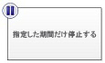|この Visio アクションは SharePoint Designer 2013 の [ **指定した期間だけ停止する**] アクションと同じであり、次のように表示されます。   |**指定した期間だけ停止する**   特定の期間 (日、時間、分) だけワークフローを停止するには、このアクションを使用します。    > **メモ**> 遅延時間はタイマー ジョブ間隔によって設定され、既定値は 5 分です。           |
|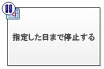|この Visio アクションは SharePoint Designer 2013 の [ **指定した日まで停止する**] アクションと同じであり、次のように表示されます。   |**指定した日まで停止する**   特定の日付までワークフローを停止するには、このアクションを使用します。現在の日付、特定の日付、またはルックアップを追加できます。    |
|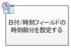|この Visio アクションは SharePoint Designer 2013 の [ **日付/時刻フィールドの時刻部分を設定する**] アクションと同じであり、次のように表示されます。   |**日付/時刻フィールドの時刻部分を設定する**   タイムスタンプを作成し、変数に出力値を格納するには、このアクションを使用します。時刻を時間と分で設定し、現在の日付、指定した日付、またはルックアップに追加できます。    |
|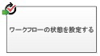| この Visio アクションは SharePoint Designer 2013 の [ **ワークフローの状態を設定する**] アクションと同じであり、次のように表示されます。    状態の値を作成した後は、その名前を変更したり削除したりできません。ただし、その状態の値を必ず使用する必要はありません。    カスタム状態は現在のワークフローに対してのみ適用され、別のワークフローでは使用できません。    アクションを偽装ステップの中で使用する場合、ワークフローは、そのアクションで定義するカスタムのステータス値を使用できません。   |**ワークフローの状態を設定する**   ワークフローの状態を設定するには、このアクションを使用します。既定のオプションは、[ **取り消し済み**]、[ **承認済み**]、[ **却下済み**] です。    アクションのドロップダウンで、新しい状態の値を入力できます。状態の値を入力すると、ドロップダウン リストに自動的に追加されます。    カスタム値も使用されているワークフローで **ワークフローの状態を設定する**アクションが最後のステップである場合、ワークフローが停止または完了すると、リストの [ **状態**] 列でカスタム値を確認できます。    |
|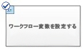|この Visio アクションは SharePoint Designer 2013 の [ **ワークフローの変数を設定する**] アクションと同じであり、次のように表示されます。   |**ワークフローの変数を設定する**   ワークフロー変数に値を設定するには、このアクションを使用します。また、変数への値の割り当てをワークフローによって行う場合にも、このアクションを使用します。    |
|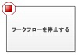|この Visio アクションは SharePoint Designer 2013 の [ **ワークフローを停止する**] アクションと同じであり、次のように表示されます。   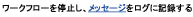|**ワークフローを停止する**   ワークフローの現在のインスタンスを停止し、メッセージを [ **ワークフロー履歴**] リストに記録するには、このアクションを使用します。このアクションで指定したメッセージは、ワークフローが完了すると、[ワークフロー履歴] の [ **説明**] 列に表示されます。    |
   

### リスト アクション

以下のアクションは、リスト アイテムに対して使用されます。
  
    
    

****

|**Visio アクション図形**|**SharePoint Designer の対応するアクション**|**アクションの説明**|
|:-----|:-----|:-----|
|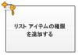|この Visio アクションは SharePoint Designer 2013 の [ **リスト アイテムの権限を追加する**] アクションと同じであり、次のように表示されます。       > **メモ**> このアクションは偽装ステップでのみ利用できます。           |**リスト アイテムの権限を追加する**   このアクションは、アイテムに対する特定の権限レベルを特定のユーザーに付与します。    |
|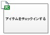|この Visio アクションは SharePoint Designer 2013 の [ **アイテムをチェックインする**] アクションと同じであり、次のように表示されます。   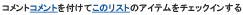|**アイテムをチェックインする**   このアクションは、チェックアウト中のアイテムをチェックインします。    > **メモ**> チェックインできるのはドキュメント ライブラリのアイテムだけです。           |
|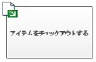|この Visio アクションは SharePoint Designer 2013 の [ **アイテムをチェックアウトする**] アクションと同じであり、次のように表示されます。   |**アイテムをチェックアウトする**   アイテムをチェックアウトするには、このアクションを使用します。ワークフローは、ドキュメントをチェックアウトする前に、アイテムがチェックインされているかどうかを確認します。    > **メモ**> チェックアウトできるのは、自分のサイト内のライブラリにあるアイテムのみです。           |
|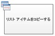|この Visio アクションは SharePoint Designer 2013 の [ **リスト アイテムをコピーする**] アクションと同じであり、次のように表示されます。   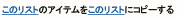|**リスト アイテムをコピーする**   リスト アイテムを別のリストにコピーするには、このアクションを使用します。リスト アイテムにドキュメントが含まれる場合、ワークフローはドキュメントもコピー先リストにコピーします。    > **重要**> コピー元とコピー先のリストの両方に類似した列が少なくとも 1 つ存在する必要があります。           |
|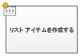|この Visio アクションは SharePoint Designer 2013 の [ **リスト アイテムを作成する**] アクションと同じであり、次のように表示されます。   |**リスト アイテムを作成する**   指定したリストに新しいリスト アイテムを作成するには、このアクションを使用します。新しいアイテム内のフィールドと値を指定できます。    作成する新しいアイテムに指定した情報を持たせる場合はいつでも、このアクションを使用できます。    > **メモ**> 出力変数は、リスト内に作成されたアイテムの ID です。           |
|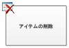|この Visio アクションは SharePoint Designer 2013 の [ **アイテムを削除する**] アクションと同じであり、次のように表示されます。   |**アイテムを削除する**   アイテムを削除するには、このアクションを使用します。    |
|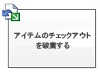|この Visio アクションは SharePoint Designer 2013 の [ **アイテムのチェックアウトを破棄する**] アクションと同じであり、次のように表示されます。   |**アイテムのチェックアウトを破棄する**   アイテムがチェックアウトされていて、アイテムが変更されている場合、変更を破棄してアイテムをチェックインするには、このアクションを使用します。    |
|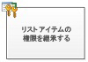|この Visio アクションは SharePoint Designer 2013 の [ **リスト アイテムの親のアクセス許可の継承**] アクションと同じであり、次のように表示されます。       > **メモ**> このアクションは偽装ステップでのみ利用できます。           |**リスト アイテムの権限を継承する**   アイテムに固有の権限がある場合、このアクションを使用すると、アイテムにリストから親の権限を継承させることができます。    |
|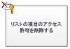|この Visio アクションは SharePoint Designer 2013 の [ **リスト アイテムの権限を削除する**] アクションと同じであり、次のように表示されます。   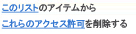    > **メモ**> このアクションは偽装ステップでのみ利用できます。           |**リスト アイテムの権限を削除する**   このアクションは、アイテムから特定のユーザーに対する権限を削除します。    |
|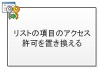|この Visio アクションは SharePoint Designer 2013 の [ **リスト アイテムの権限を置換する**] アクションと同じであり、次のように表示されます。       > **メモ**> このアクションは偽装ステップでのみ利用できます。           |**リスト アイテムの権限を置換する**   アイテムの現在の権限を、アクションで指定した新しい権限に置き換えます。    |
|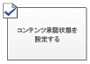|この Visio アクションは SharePoint Designer 2013 の [ **コンテンツの承認状態を設定する**] アクションと同じであり、次のように表示されます。       > **メモ**> このアクションを使用するには、リスト内でコンテンツ承認を有効にする必要があります。           
|**コンテンツの承認状態を設定する**   リストでコンテンツの承認を有効にしている場合、このアクションを使用して、コンテンツ承認状態フィールドを承認済み、却下済み、保留中などの値に設定します。アクションではカスタム状態を入力できます。    > **メモ**> **コンテンツの承認状態を設定する**アクションは、ワークフローが処理している現在のアイテムに対して適用されるので、サイト ワークフローではこのアクションを使用できません。           |
||この Visio アクションは SharePoint Designer 2013 の [ **現在のアイテムにフィールドを設定する**] アクションと同じであり、次のように表示されます。   |**現在のアイテムにフィールドを設定する**   現在のアイテム内のフィールドに値を設定するには、このアクションを使用します。    > **メモ**> フィールドの値が変更されるまでワークフローを停止する場合は、代わりに **現在のアイテムでのフィールドの変更を待つ**アクションを使用します。           **現在のアイテムにフィールドを設定する**アクションはサイト ワークフローでは使用できません。    |
|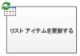|この Visio アクションは SharePoint Designer 2013 の [ **リスト アイテムを更新する**] アクションと同じであり、次のように表示されます。   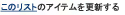|**リスト アイテムを更新する**   リスト アイテムを更新するには、このアクションを使用します。フィールドを指定し、それらのフィールドに新しい値を設定できます。    |
|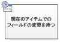|この Visio アクションは SharePoint Designer 2013 の [ **現在のアイテムでのフィールドの変更を待つ**] アクションと同じであり、次のように表示されます。   |**現在のアイテムでのフィールドの変更を待つ**   このアクションは、現在のアイテムのフィールドが新しい値に変わるまで、ワークフローを停止します。    > **メモ**> ワークフローでフィールドの値を変更する場合は、フィールドが変化するまでワークフローを待たせるのではなく、 **現在のアイテムにフィールドを設定する**アクションを使用します。           |
   

### タスク アクション

このカテゴリのアクションは、タスク アイテムに関係があります。これらのアクションは、SharePoint Server 2013 を実行する SharePoint サイトに対してのみ適用されます。
  
    
    

****

|**Visio アクション図形**|**SharePoint Designer の対応するアクション**|**アクションの説明**|
|:-----|:-----|:-----|
|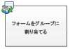|この Visio アクションは SharePoint Designer 2013 の [ **フォームをグループに割り当てる**] アクションと同じであり、次のように表示されます。   |**フォームをグループに割り当てる**   カスタマイズされたフィールドでカスタム タスク フォームを作成できるようにするには、このアクションを使用します。    このアクションを使用すると、1 人以上の参加者またはグループにタスクを割り当て、タスクを実行するように要求できます。参加者は、カスタム タスク フォームのフィールドで応答し、タスクが完了したらフォームの [ **タスクの完了**] をクリックします。    |
|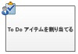|この Visio アクションは SharePoint Designer 2013 の [ **To Do アイテムを割り当てる**] アクションと同じであり、次のように表示されます。   |**To Do アイテムを割り当てる**   各参加者にタスクを割り当て、参加者に対して、タスクを実行し、完了したらタスク フォームの [ **タスクの完了**] ボタンをクリックするように要求するには、このアクションを使用します。    |
|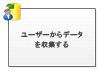|この Visio アクションは SharePoint Designer 2013 の [ **ユーザーからデータを収集する**] アクションと同じであり、次のように表示されます。   |**ユーザーからデータを収集する**   参加者にタスクを割り当て、参加者に対して、必要な情報をカスタム タスク フォームで提供した後、タスク フォームの [ **タスクの完了**] ボタンをクリックするように要求するには、このアクションを使用します。    このアクションには出力句があります。つまり、ワークフローは、アクションによって返された情報を対応する変数に格納します。アクションから返る完了したタスク アイテムのリスト アイテム ID は、正しい変数に格納されます。    |
|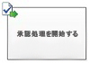|この Visio アクションは SharePoint Designer 2013 の [ **承認処理を開始する**] アクションと同じであり、次のように表示されます。   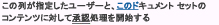|**承認処理を開始する**   承認のためにドキュメントをルーティングするには、このアクションを使用します。承認者は、ドキュメントの承認または却下、承認タスクの再割り当て、または変更の要求を行うことができます。    アクションの中でタスクを内部参加者にも外部参加者にも割り当てることができます。外部参加者とは、サイト コレクションのユーザーではない、組織の社員、または組織の外部の人です。    |
|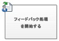|この Visio アクションは SharePoint Designer 2013 の [ **フィードバック処理を開始する**] アクションと同じであり、次のように表示されます。   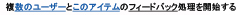|**フィードバック処理を開始する**   フィードバックのタスク アイテムを特定の順序 (順次または並列) で複数のユーザーに割り当てるには、このアクションを使用します。既定値は並列です。ユーザーまたはタスク参加者は、タスクを他のユーザーに再割り当てすることもできます。ユーザーは、完了したら、[ **フィードバックの送信**] ボタンをクリックしてタスクの完了を通知できます。    アクションの中でタスクを内部参加者にも外部参加者にも割り当てることができます。外部参加者とは、サイト コレクションのユーザーではない、組織の社員、または組織の外部の人です。    |
|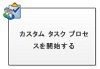|この Visio アクションは SharePoint Designer 2013 の [ **ユーザー設定タスク処理を開始する**] アクションと同じであり、次のように表示されます。   |**ユーザー設定タスク処理を開始する**   **ユーザー設定タスク処理を開始する**アクションは、他の承認アクションがニーズに合わない場合に使用できる承認処理テンプレートです。    |
   

### 相互関係アクション

このカテゴリの唯一のアクションは、ユーザーの上司を検索し、その情報を変数に格納します。このアクションは、SharePoint Server 2013 を実行する SharePoint サイトにのみ適用されます。
  
    
    

****

|**Visio アクション図形**|**SharePoint Designer の対応するアクション**|**アクションの説明**|
|:-----|:-----|:-----|
|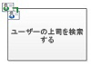|この Visio アクションは SharePoint Designer 2013 の [ **ユーザーの上司を検索する**] アクションと同じであり、次のように表示されます。   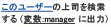|**ユーザーの上司を検索する**   ユーザーの上司を検索するには、このアクションを使用します。出力値は変数に格納されます。    > **メモ**> このアクションが正しく動作するには、User Profile Service が SharePoint で実行している必要があります。           |
   

### ドキュメント セットのアクション

一部のワークフロー アクションは、ワークフローが共有ドキュメントなどのドキュメント ライブラリ、またはドキュメント コンテンツ タイプに関連付けられている場合にのみ、使用できます。
  
    
    

****

|**Visio アクション図形**|**SharePoint Designer の対応するアクション**|**アクションの説明**|
|:-----|:-----|:-----|
|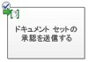|この Visio アクションは SharePoint Designer 2013 の [ **ドキュメント セット承認処理を開始する**] アクションと同じであり、次のように表示されます。   |**ドキュメント セットの承認を送る**   ドキュメント セットの承認処理を開始するには、このアクションを使用します。    |
|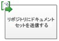|この Visio アクションは SharePoint Designer 2013 の [ **ドキュメント セットをリポジトリに送る**] アクションと同じであり、次のように表示されます。   |**ドキュメント セットをリポジトリに送る**   ドキュメント セットをドキュメント リポジトリに移動またはコピーするには、このアクションを使用します。ドキュメント リポジトリは、ユーザーが定義するルールに基づいて特定の宛先にレコードをルーティングする、SharePoint サイト内のライブラリ、またはドキュメント センターのようなサイト自体です。    |
|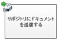|この Visio アクションは SharePoint Designer 2013 の [ **リポジトリにドキュメントを送信**] アクションと同じであり、次のように表示されます。   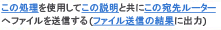|**リポジトリにドキュメントを送信**   ドキュメントをドキュメント リポジトリに移動またはコピーするには、このアクションを使用します。ドキュメント リポジトリは、ユーザーが定義するルールに基づいて特定の宛先にレコードをルーティングする、SharePoint サイト内のライブラリ、またはドキュメント センターのようなサイト自体です。    |
||この Visio アクションは SharePoint Designer 2013 の [ **ドキュメント セットのコンテンツの承認状態を設定する**] アクションと同じであり、次のように表示されます。   |**ドキュメント セットのコンテンツの承認状態を設定する**   このアクションを使用して、ドキュメント セットのコンテンツ承認の状態を [ **承認済み**]、[ **却下済み**]、[ **承認待ち**] に設定します。    |
   

## ワークフローの条件

ワークフローの条件は、ワークフロー内での分岐点です。ワークフローの条件は入力と指定された値を比較します。一致した場合、ワークフローはある分岐に従います。一致しない場合は、別の分岐に従います。
  
    
    

> **重要**
> Visio で SharePoint ワークフローに挿入できるほとんどの条件図形では、ワークフローを SharePoint Designer にインポートするときに追加の構成が必要です。Visio では、各条件の図形のコメント機能を使用して、条件の判断基準を指定してください。 
  
    
    

### 一般的な条件

このセクションでは、ワークフローが関連付けられているリストまたはコンテンツ タイプに関係なく、リストおよび再利用可能なリスト ワークフローに対して SharePoint Designer 2013 で使用できる条件について説明します。
  
    
    

****

|**Visio 条件図形**|**対応する SharePoint Designer の条件**|**条件の説明**|
|:-----|:-----|:-----|
||この Visio 条件は、SharePoint Designer 2013 の [ **ある値と値が等しいかどうか**] 条件と同じであり、次のように表示されます。   |**データ ソースの比較**   この条件は、2 つの値を比較します。等値であること、または等値でないことを条件に比較することができます。    |
||この Visio 条件は、SharePoint Designer 2013 の [ **現在のアイテム フィールドと値が等しいかどうか**] 条件と同じであり、次のように表示されます。   |**ドキュメントのフィールドの比較**   この条件は、フィールドを指定した値に対して調べます。等値であること、または等値でないことを条件に比較することができます。    |
||この Visio 条件は SharePoint Designer 2013 の [ **指定したユーザーによって作成された**] 条件と同じであり、次のように表示されます。   |**指定したユーザーによって作成**   この条件は、アイテムが特定のユーザーによって作成されたかどうかを調べます。ユーザーは、電子メール アドレスとして指定することも (olivier@contoso.com など)、SharePoint、Exchange、または Active Directory ユーザーから選択することもできます。    > **メモ**> ユーザー名および電子メール アドレスは、大文字と小文字が区別されます。大文字と小文字が正しく使い分けられるように、ユーザー名または電子メール アドレスを選択することをお勧めします。ユーザー名または電子メール アドレスを入力する場合は、大文字と小文字の使い分けがアカウントと一致する必要があります。たとえば、ユーザー アカウントが Contoso\\Molly の場合、contoso\\molly によって作成されたかどうかは true と評価されません。           |
||この Visio 条件は SharePoint Designer 2013 の [ **指定した期間内に作成された**] 条件と同じであり、次のように表示されます。   |**指定した期間内に作成**   この条件は、アイテムが指定した期間内に作成されたかどうかを調べます。現在の日付、特定の日付、またはルックアップを使用できます。    |
||この Visio 条件は SharePoint Designer 2013 の [ **指定したユーザーによって変更された**] 条件と同じであり、次のように表示されます。   |**指定したユーザーによって変更**   アイテムが指定したユーザーによって変更されたかどうかを調べるには、この条件を使用します。ユーザーは、電子メール アドレスとして指定することも (olivier@contoso.com など)、SharePoint、Exchange、または Active Directory ユーザーから選択することもできます。    > **メモ**> ユーザー名および電子メール アドレスは、大文字と小文字が区別されます。大文字と小文字が正しく使い分けられるように、ユーザー名または電子メール アドレスを選択することをお勧めします。ユーザー名または電子メール アドレスを入力する場合は、大文字と小文字の使い分けがアカウントと一致する必要があります。たとえば、ユーザー アカウントが Contoso\\Molly の場合、contoso\\molly によって変更されたかどうかは true と評価されません。           |
||この Visio 条件は SharePoint Designer 2013 の [ **指定した期間内に変更された**] 条件と同じであり、次のように表示されます。   |**指定した期間内に変更**   この条件は、アイテムが指定した期間内に変更されたかどうかを調べます。現在の日付、特定の日付、またはルックアップを使用できます。    |
||この Visio 条件は、SharePoint Designer 2013 の [ **タイトル フィールドにキーワードを含む**] 条件と同じであり、次のように表示されます。   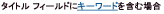|**タイトル フィールドにキーワードを含む**   この条件は、アイテムの [ **タイトル**] フィールドに特定の言葉が含まれるかどうかを調べます。文字列ビルダーでキーワードを指定することも (静的な値、動的な文字列、両方の組み合わせを指定できます)、フィールドまたは変数に対するルックアップを挿入することもできます。    > **メモ**> [ **タイトル フィールドにキーワードを含む**] 条件で、複数のキーワードを検索することはできません。ただし、**||**(or) や **&amp;&amp;** (and) などの論理演算子は使用できます。          |
   

### ドキュメント セットの条件

一部のワークフロー条件は、ワークフローが共有ドキュメントなどのドキュメント ライブラリまたはドキュメント コンテンツ タイプに関連付けられている場合にのみ使用できます。
  
    
    

|**Visio 条件図形**|**対応する SharePoint Designer の条件**|**条件の説明**|
|:-----|:-----|:-----|
|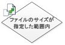|この Visio 条件は SharePoint Designer 2013 の [ **ファイル サイズが指定した範囲内 (キロバイト)**] 条件と同じであり、次のように表示されます。   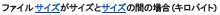|**ファイルのサイズが指定した範囲内**   この条件は、ドキュメントのファイル サイズが指定したサイズ (キロバイト単位) の範囲内かどうかを調べます。指定したサイズは評価に含められません。条件の 1 番目と 2 番目のサイズには、値を入力することも、ルックアップを使用することもできます。    |
||この Visio 条件は SharePoint Designer 2013 の [ **指定したファイルの種類**] 条件と同じであり、次のように表示されます。   |**指定したファイルの種類**   この条件は、現在のアイテムのファイルの種類が指定した種類 (docx など) かどうかを調べます。ファイルの種類を文字列として入力するか、ルックアップを使用できます。    |
   

### リストの条件

  
    
    

****

|**Visio 条件図形**|**対応する SharePoint Designer の条件**|**条件の説明**|
|:-----|:-----|:-----|
||この Visio 条件は、SharePoint Designer 2013 の [ **リスト アイテムのアクセス許可レベルを確認**] 条件と同じであり、次のように表示されます。   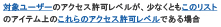|**厳密なユーザー権限のチェック**   この条件は、指定したユーザーが最低限必要なアクセス許可レベルを持っていることを調べます。    |
||この Visio 条件は、SharePoint Designer 2013 の [ **リスト アイテムのアクセス許可の確認**] 条件と同じであり、次のように表示されます。   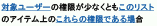|**ユーザー権限のチェック**   この条件は、指定したユーザーが最低限必要なアクセス許可を持っているかどうかを調べます。    |
   

## ワークフローのターミネータ

Visio では、各ワークフローは開始ターミネータ (
  
    
    

  
    
    
) で開始し、停止ターミネータ (
  
    
    

  
    
    
) で終了する必要があります。特定のワークフローで使用できる各ターミネータの種類は 1 つだけです。Visio で SharePoint ワークフローを作成する場合、ワークフローが検証に合格し、エクスポートできるためには、ターミネータが必要です。ワークフローのターミネータは、SharePoint Designer では使用されません。
  
    
    

## その他の技術情報

-  [SharePoint 2013 ワークフローの新機能](what-s-new-in-workflows-for-sharepoint-2013.md)
    
  
-  [SharePoint 2013 ワークフローの概要](get-started-with-workflows-in-sharepoint-2013.md)
    
  
-  [SharePoint Designer および Visio でのワークフロー開発](workflow-development-in-sharepoint-designer-and-visio.md)
    
  

  
    
    
