# SharePoint 2013 の開発者のための新機能
新しいクラウド アドイン モデル、開発ツール、プラットフォーム拡張機能、モバイル アドインなど、SharePoint 2013の新機能について説明します。
## クラウド アドイン モデル

SharePoint 2013 では、クラウド アドイン モデルが導入されており、これによって、アドインを作成できるようになっています。SharePoint アドインは、SharePoint Web サイトの機能を拡張する自己完結型の機能部品です。アドインは、リスト、ワークフロー、サイト ページなどの SharePoint コンポーネントを含めることができますが、リモート Web アプリケーションやリモート データを SharePoint で表示することもできます。アドインは、そのアドインがインストールされているデバイス上やプラットフォーム上の他のソフトウェアにほとんど依存しないか、まったく依存しません (ただし、そのプラットフォームに組み込まれているものは除きます)。このような特性があるため、アドインを単純にインストールしたり、きれいにアンインストールしたりできます。アドインには、SharePoint サーバー上で実行されるカスタム コードはありません。すべてのカスタム ロジックは、クラウドに「アップ」されたり、クライアント コンピューターに「ダウン」されたりします。SharePoint 2013 では、Office ストアやアドイン カタログのようなコンポーネントが含まれる SharePoint アドインのための革新的な配信モデルも導入されています。
  
    
    
 [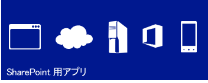
  
    
    
](http://msdn.microsoft.com/library/cd1eda9e-8e54-4223-93a9-a6ea0d18df70%28Office.15%29.aspx) [
  
    
    
](http://msdn.microsoft.com/library/d15a74a7-3c10-485a-9885-7ef11aaa0d90%28Office.15%29.aspx) [
  
    
    
](http://msdn.microsoft.com/library/d15a74a7-3c10-485a-9885-7ef11aaa0d90%28Office.15%29.aspx)
  
    
    

## Web 標準を使用するおなじみのプログラミング モデル

SharePoint 2013は、Microsoft 以外のプラットフォーム スタックを扱っている Web 開発者も含めて、Web 開発者による SharePoint ソリューションの作成を容易にします。これを可能にしているのは、SharePoint 2013が HTML、CSS、JavaScript などの一般的な Web 標準を基礎にしているという点です。さらに、実装は Open Data Protocol (OData) や OAuth のような確立されたプロトコルに依存しています。
  
    
    
 [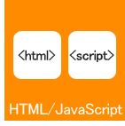
  
    
    
](http://msdn.microsoft.com/library/cd1eda9e-8e54-4223-93a9-a6ea0d18df70%28Office.15%29.aspx) [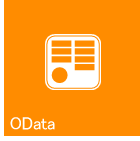
  
    
    
](using-odata-sources-with-business-connectivity-services-in-sharepoint-2013.md) [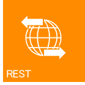
  
    
    
](get-to-know-the-sharepoint-2013-rest-service.md) [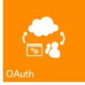
  
    
    
](http://msdn.microsoft.com/library/bde5647a-fff1-4b51-b67b-2139de79ce4a%28Office.15%29.aspx)
  
    
    

## 開発ツール

現在のリリースは、アドイン開発用に新たに開発された Web ベース ツールの Napa Office 365 開発ツールのリリースを提供することに加え、Visual Studio や SharePoint Designer のような既存の開発ツールの最適化における長足の進歩を反映しています。Visual Studio の新しい統合プロジェクト システムを使用すると、SharePoint アドイン、Office アドイン、Office アドインが含まれる SharePoint アドイン、または SharePoint によってホストされる Office アドインを開発できます。Visual Studio 2012には、以前のバージョンで提供されていた SharePoint プロジェクト テンプレートに加え、SharePoint 2013 用アドイン という名前の新しいアドイン プロジェクト テンプレートが Add-ins フォルダーに含まれています。プロパティ ウィンドウとプロパティ ページには、SharePoint アドイン プロジェクトをサポートする新しいプロパティがいくつか追加されています。その他の改善点としては、OData と OAuth のサポートを含む、クラウド アドイン モデルに対する開発のフル サポート、および ワークフロー マネージャー クライアント 1.0 に対する開発のフル サポートがあります。
  
    
    
 [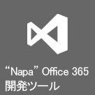
  
    
    
](http://msdn.microsoft.com/library/82a3645c-0911-4926-9176-236ac8d28bdd%28Office.15%29.aspx) [
  
    
    
](http://msdn.microsoft.com/library/e00dc63f-b4a4-4c08-b058-729fcb09af41%28Office.15%29.aspx) [
  
    
    
](workflow-development-in-sharepoint-designer-and-visio.md)
  
    
    

## コア プラットフォーム拡張機能

SharePoint 2013 は、新しいクラウド ベースのアーキテクチャとアプリ ドリブン開発フレームワークをサポートするために、さらに大規模に改善され拡張されています。最も低レベルの SharePoint API から、接続、ソーシャル メディアの統合まで、SharePoint 2013は充実したアプリケーション開発環境をサポートするように設計されていて実行されます。Web サービスの Representational State Transfer (REST) エンドポイントの使用に加え、サーバー開発とクライアント開発の両方について広範囲にわたる新しい API があります。クライアント側レンダリングに加え、リモート イベント レシーバーがサポートされています。 
  
    
    
 [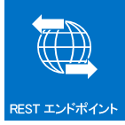
  
    
    
](e1ff2979-1c16-4cb0-a57e-9168dfe20a7c.md) [
  
    
    
](choose-the-right-api-set-in-sharepoint-2013.md) [
  
    
    
](how-to-customize-a-field-type-using-client-side-rendering.md) [
  
    
    
](http://msdn.microsoft.com/library/c050d056-8548-4496-a053-016779d723d9%28Office.15%29.aspx)
  
    
    

## モビリティ

SharePoint 2013では、Windows Phone 7 アプリケーションと、社内の SharePoint サービスおよび SharePoint アプリケーション、またはクラウドで実行されるリモートの SharePoint サービスおよび SharePoint アプリケーション (SharePoint Online を使用するものなど) を結合することにより、機能を従来のデスクトップやラップトップを超えて真にポータブルでアクセスしやすい環境に拡大する強力なアプリケーションを作成できます。SharePoint 2013の新しいモビリティ機能は、SharePoint、Windows Phone 7、Visual Studio、Microsoft Silverlight などの Microsoft の既存のツールとテクノロジを基礎にして構築されています。Visual Studio の新しい SharePoint 電話アプリケーション ウィザード テンプレートを使用すると、Windows Phone 用の SharePoint 駆動モバイル アプリケーションを作成できます。これにより、リスト ベースのシンプルなモバイル アプリケーションを作成できます。SharePoint Server からの "プッシュ" 通知、地理位置情報フィールド型など、SharePoint 2013 で導入された新しい機能をモバイル アプリケーションに統合できます。
  
    
    
 [
  
    
    
](overview-of-windows-phone-sharepoint-2013-application-templates-in-visual-studio.md) [
  
    
    
](how-to-configure-and-use-push-notifications-in-sharepoint-2013-apps-for-windows.md) [
  
    
    
](integrating-location-and-map-functionality-in-sharepoint-2013.md)
  
    
    

## ソーシャル機能とコラボレーション機能

新規および改善されたソーシャル機能とコラボレーション機能は、ユーザーによるコミュニケーションおよび密な連絡と関与を容易にします。改善された個人用サイトのソーシャル フィードは、ユーザーが関心のある人たちやコンテンツについての最新情報を得るのに役立ちます。新しいコミュニティ サイト機能は、ユーザーが簡単に情報を見つけたり共有したり、同じような関心を持つ人たちを見つけたりすることのできる充実したコミュニティ環境を提供します。
  
    
    
 [
  
    
    
](work-with-social-feeds-in-sharepoint-2013.md) [
  
    
    
](what-s-new-for-developers-in-social-and-collaboration-features-in-sharepoint-201.md#bkmk_Collab) [
  
    
    
](follow-people-in-sharepoint-2013.md) [
  
    
    
](follow-content-in-sharepoint-2013.md)
  
    
    

## 検索

SharePoint 2013の検索機能には、いくつかの拡張機能、コンテンツ エンリッチメント Web サービスによるカスタム コンテンツ処理、および検索結果の種類を表示するための新しいフレームワークが含まれています。さらに、キーワード クエリ言語 (KQL) に対して重要な機能拡張も行われています。
  
    
    
 [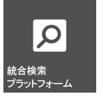
  
    
    
](custom-content-processing-with-the-content-enrichment-web-service-callout.md) [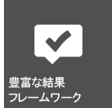
  
    
    
](what-s-new-in-sharepoint-2013-search-for-developers.md) [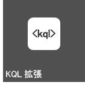
  
    
    
](building-search-queries-in-sharepoint-2013.md)
  
    
    

## ワークフロー

ワークフロー マネージャー クライアント 1.0 は、再設計されたワークフロー インフラストラクチャで、Windows Workflow Foundation 4 を基礎にしており、SharePoint 2013でのワークフロー作成に新しいパワーと柔軟性をもたらします。完全に宣言的な作成環境により、インフォメーション ワーカーは SharePoint Designer 2013を使用して強力なワークフローを作成できます。また、新しい一群の Visual Studio 2012 ワークフロー プロジェクト テンプレートにより、開発者はカスタム動作 (ユーザー設定アクション) などの高度な機能にアクセスできます。おそらく最も重要な点は、ワークフロー マネージャー クライアント 1.0が SharePoint アドイン用のモデルと完全に統合されていることでしょう。さらに、ワークフローは SharePoint ではなくクラウドで実行されるので、ワークフロー ベースの SharePoint アドインの設計が非常に柔軟になります。
  
    
    
 [
  
    
    
](what-s-new-in-workflows-for-sharepoint-2013.md) [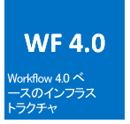
  
    
    
](sharepoint-2013-workflow-fundamentals.md) [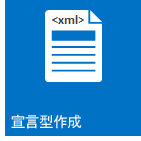
  
    
    
](workflow-development-in-sharepoint-designer-and-visio.md) [
  
    
    
](develop-sharepoint-2013-workflows-using-visual-studio.md)
  
    
    

## エンタープライズ コンテンツ管理

SharePoint 2013では、新たに拡張された .NET サーバー マネージ API セットに加え, .NET クライアント、Silverlight、Windows Phone、および JavaScript の API を使用して、エンタープライズ コンテンツ管理 (ECM) のエクスペリエンスと動作をカスタマイズできます。
  
    
    
 [
  
    
    
](what-s-new-with-sharepoint-2013-site-development.md) [
  
    
    
](managed-navigation-in-sharepoint-2013.md) [
  
    
    
](cross-site-publishing-in-sharepoint-2013.md) [
  
    
    
](ediscovery-in-sharepoint-2013.md)
  
    
    

## Business Connectivity Services

Business Connectivity Services (BCS) により、SharePoint は WCF サービスや OData エンドポイントを通じて公開されるデータ ドリブン アプリケーションに加え、外部データ システム (SAP、ERP、CRM など) からのデータにアクセスできます。SharePoint 2013の BCS には、OData 接続、外部イベント、アドインの外部データ、フィルター処理と並べ替え、REST のサポートなど、多くの点で改善と拡張がなされています。
  
    
    
 [
  
    
    
](using-odata-sources-with-business-connectivity-services-in-sharepoint-2013.md) [
  
    
    
](add-in-scoped-external-content-types-in-sharepoint-2013.md) [
  
    
    
](external-events-and-alerts-in-sharepoint-2013.md)
  
    
    

## アプリケーション サービス

SharePoint Server 2013には、SharePoint サイト内のデータを処理するためのサービスがいくつか含まれています。SharePoint に新たに追加されたのは、多国語サポートとしてサイト、ドキュメント、およびストリームを翻訳する機械翻訳サービスです。SharePoint Server 2013には、Access Services と新しいデータ アクセス モデルも含まれています。ファイルとストリームを他の形式に変換するため、SharePoint Server 2013には Word Automation Services と PowerPoint Automation Services (SharePoint の新機能) があります。SharePoint は、PerformancePoint サービス、Visio Services など、ビジネス インテリジェンスの使用を可能にするデータ分析ツールと、Excel Services の強力な新機能も提供します。
  
    
    
 [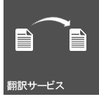
  
    
    
](machine-translation-services-in-sharepoint-2013.md) [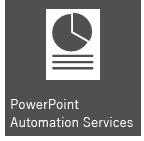
  
    
    
](powerpoint-automation-services-in-sharepoint-2013.md) [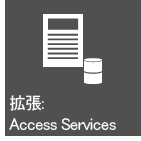
  
    
    
](what-s-new-in-access.md) [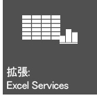
  
    
    
](09e96c8b-cb55-4fd1-a797-b50fbf0f9296.md)
  
    
    

## その他の技術情報

-  [SharePoint 2013 開発の概要](sharepoint-2013-development-overview.md)
    
  
-  [SharePoint アドインの開発](http://msdn.microsoft.com/library/71ddde4b-fac4-4d8c-aa2e-524f9c2c4c99%28Office.15%29.aspx)
    
  
-  [SharePoint アドインと SharePoint ソリューションの比較](sharepoint-add-ins-compared-with-sharepoint-solutions.md)
    
  
-  [SharePoint 2013 での適切な API セットの選択](choose-the-right-api-set-in-sharepoint-2013.md)
    
  
-  [SharePoint 2013 におけるアクセシビリティ](accessibility-in-sharepoint-2013.md)
    
  

