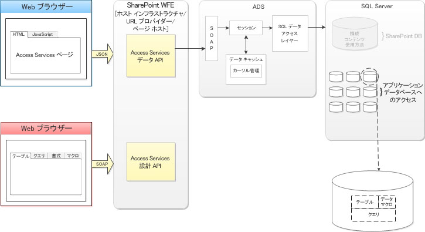

# Access の新機能
Access 2013 の機能によって社内およびクラウドにおいて共同作業用の Web ベース アプリケーションを簡単に作成、展開、および管理する方法について説明します。
## 概要

Access 2013 の特徴の 1 つは、Windows 開発での以前のバージョンの Access と同じほど、Web 開発を簡素化するという目的にかなうように設計された新しいアプリケーション モデルです。Access 2013 により、対象分野の専門家は、業務の遂行に使用可能なアプリケーションを迅速に作成することができます。Microsoft SharePoint 2013 を使用してアプリのフロント エンドとデータ保存領域としての Microsoft SQL Server 2012 をホストすることにより、Access 2013 は Access アプリケーションの管理性と拡張性を著しく向上させます。Office 365 および SQL Azure との互換性により、Access アプリケーションの到達範囲は大幅に拡張されます。
  
    
    

## アーキテクチャー

社内環境では、Access 2013 アプリが SharePoint 2013 によってホストされるのに対し、データは SQL Server 2012 に格納されます。SharePoint 2013 は、Access 2013 アプリの認証、承認、およびセキュリティ機能を提供します。バックエンド テーブル、ビュー、マクロ、およびクエリは、SQL Server 2012 データベースに格納されます。
  
    
    
Access 2013 には、Office 365 サービスと SQL Azure サービスを介して Access アプリをクラウドに展開する機能が用意されています。
  
    
    
図 1 に、Access 2013 のアーキテクチャーの概要を示します。
  
    
    

**図 1. Access 2013 のアーキテクチャ**

  
    
    

  
    
    

  
    
    
新しい Access アプリケーションが作成されると、SharePoint Server 2013 の Access Services は、アプリに含まれているデータ、ビュー、クエリ、およびマクロを格納する新しい アプリケーション データベース を作成します。Access Services 2013 System データベースは、別個の SQL Server 2012 サーバーに新しい アプリケーション データベース が作成されるように構成できます。
  
    
    
SQL Server 2012 を使用してデータを格納することにより、これまで Access アプリケーションでは得られなかった管理性や拡張性を得ることができます。Access アプリケーションをより強力な環境で登録して再実装する必要がある日々は過去のものとなりました。
  
    
    
Access 2013 アプリは、作成される瞬間にオンラインです。アプリは、他のユーザーと共有するか、社内専用カタログに展開するか、Office ストア に展開するかを決めることができます。
  
    
    

## Access アプリの開発

SharePoint Server 2013 アプリケーション サービスの多くとは異なり、Access Services 2013 は、Visual Studio での Access アプリの開発で使用可能な API を公開しません。Access 2013 は、Access 2013 アプリの開発に使用する環境です。
  
    
    
Access 2013 アプリの開発方法の詳細については、「 [Access 2013 で Web アプリの作成とカスタマイズを行う方法](http://msdn.microsoft.com/library/628745f4-82e9-4838-9726-6f3e506a654f%28Office.15%29.aspx)」を参照してください。
  
    
    

## その他の技術情報

-  [Access 2013 の開発者向け新機能](http://msdn.microsoft.com/library/df778f51-d65e-4c30-b618-65003ceb39b3%28Office.15%29.aspx)
    
  
-  [Access 2013 カスタム Web アプリ リファレンス](http://msdn.microsoft.com/library/8d696fa4-a6f2-4fb1-8662-a313bf0b5989%28Office.15%29.aspx)
    
  

