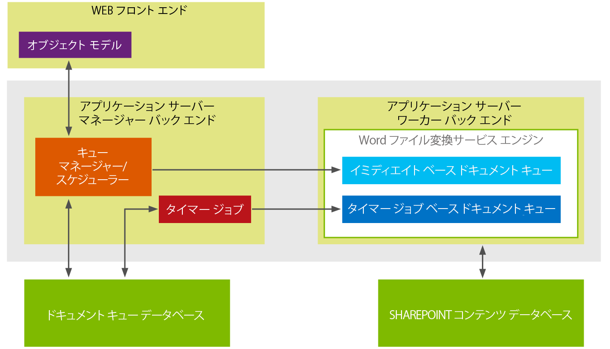

# 開発者向け Word Automation Services の新機能
ここでは Word Automation Services の開発者向けの新機能および強化機能の概要について説明します。Microsoft SharePoint 2013 での Word Automation Services の主要な新機能は、"オンデマンド" ファイル変換要求のサポートです。Word Automation Services の最も大きな強化機能は、変換ジョブの入出力にストリームの使用が追加サポートされたことです。
## オンデマンド ファイル変換の作成

Microsoft SharePoint 2013 の Word Automation Services では、オンデマンド ファイル変換要求を作成して直ちにファイル変換処理ができるようになりました。SharePoint 2010 では、ファイル変換ジョブのコードを作成した後で ConversionJob.Start メソッドを使用して変換を開始する必要がありました。この場合変換ジョブは、変換ジョブの開始頻度である Word Automation Services の間隔の設定に基づいて開始されます。指定間隔の後で SharePoint タイマー ジョブによって変換ジョブが開始されます。タイマー ジョブに基づいた方法では、変換ジョブが開始されるまで最短で 1 分かかります。
  
    
    
Microsoft SharePoint 2013 の Word Automation Services では、要求が送信後すぐに処理されて変換が直ちに開始されるファイル変換要求を作成するオプションが追加されました。SharePoint タイマー ジョブには依存しません。
  
    
    
オンデマンド ファイル変換要求と SharePoint タイマー ジョブに基づいた変換ジョブの違いについての 1 つの考え方は、オンデマンド ファイル変換要求は同期的に処理され、SharePoint タイマー ジョブに基づいた変換ジョブは非同期に処理されると理解することです。Word Automation Services アーキテクチャは、新しいオンデマンド ファイル変換要求と既存の SharePoint タイマー ジョブに基づいたファイル変換の両方をサポートするように再設計されました。
  
    
    

**図 1. Word Automation Services 2013 アーキテクチャ**

  
    
    

  
    
    

  
    
    
図 1 では、Word Automation Services アーキテクチャが変換用に 2 つの異なるキューを保持していることが示されています。1 つのキューはオンデマンド (即時) ファイル変換要求用で、もう 1 つのキューは SharePoint タイマー ジョブに基づいた変換ジョブ用です。オンデマンド要求は、変換が直ちに処理される即時ベースのドキュメント キューに置かれます。
  
    
    
一方で SharePoint タイマー ジョブに基づいた変換ジョブは、タイマー ジョブベースのドキュメント キューに置かれます。この要求に対する変換ジョブは Word Automation Services で設定された間隔で開始されます。即時ベースのドキュメント キュー内の変換要求は、常にタイマー ジョブベースのドキュメント キューの変換要求よりも優先されます。
  
    
    

### 重要な点

- オンデマンド ファイル変換要求は追加機能であり、既存の SharePoint タイマー ジョブに基づいた変換ジョブを置き換えるものではありません。つまり、SharePoint 2010 でコンパイルされて実行されていたソリューションは、SharePoint 2013 でもコンパイルと実行を続けることができます。
    
  
- オンデマンド ファイル変換要求は、一度に 1 つのファイルに対してのみ作成できます。
    
  
- Word Automation Services では、オンデマンド ファイル変換ジョブは SharePoint タイマー ジョブに基づいた変換ジョブよりも常に優先されます。Word Automation Services が既に SharePoint タイマー ジョブに基づいたファイル変換ジョブを処理中の場合、Word Automation Services はこのジョブを中断してオンデマンド ファイル変換ジョブの処理に切り替え、完了させます。その後 SharePoint タイマー ジョブに基づいたファイル変換ジョブの処理に戻ります。
    
  

## ストリームでのファイル変換の実行

Microsoft SharePoint 2013 での Word Automation Services のもう 1 つの新機能は、変換ストリームのサポートです。SharePoint 2010 では、SharePoint ライブラリに保存されたファイルの変換しかできませんでしたが、SharePoint の外に保存されているファイルの変換もストリームを使用してできるようになりました。
  
    
    

### 重要な点

- オンデマンド ファイル変換ジョブの作成時にのみストリームを入力として使用できます。
    
  
- この点から、変換できるのは一度に 1 つのストリームのみです。
    
  
オンデマンド ファイル変換要求の新機能と変換ストリームのサポートにより Word Automation Services は大きく拡張され、より多くのドキュメント変換シナリオが可能になりました。
  
    
    

### その他の技術情報

-  [SharePoint Server 2010 の Word Automation Services](http://msdn.microsoft.com/ja-jp/library/ee558278.aspx)
    
  
-  [Word Automation Services クラス ライブラリ](http://msdn.microsoft.com/ja-jp/library/ee559408.aspx)
    
  

