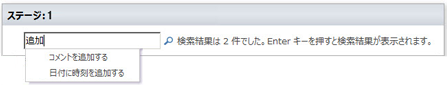

# ワークフロー アクション クイック リファレンス (SharePoint 2010 ワークフロー プラットフォーム)
Microsoft SharePoint Designer 2013 の SharePoint 2010 ワークフロー プラットフォームで利用できるワークフロー アクションについて説明します。この記事は、SharePoint Designer 2013 を使用しており、引き続き SharePoint 2010 ワークフロー プラットフォームを使用する場合にのみ利用してください。代わりに SharePoint 2013 ワークフロー プラットフォームを使用する場合は、「 [ワークフロー アクション クイック リファレンス (SharePoint 2013 ワークフロー プラットフォーム)](workflow-actions-quick-reference-sharepoint-2013-workflow-platform.md)」、および (「その他の技術情報」に掲載されている) 新しいプラットフォームで利用できる新機能についてのその他の記事を参照してください。2010 ワークフロー プラットフォームを使用してワークフローの作成を開始するには、[ **ワークフローの作成**] ダイアログ ボックスの [ **プラットフォームの種類**] で [ **SharePoint 2010 ワークフロー**] を選択します。
## ワークフロー アクションへのアクセス方法

利用可能なワークフロー アクションのメニューにアクセスするには、2 つの方法があります。
  
    
    
ワークフロー ステップ内で編集を行う際に、次のどちらかの操作を行います。
  
    
    

- [ **ワークフロー**] タブの [ **挿入**] グループで、[ **アクション**] をクリックします。
    
  
- ワークフロー ステップ内をダブルクリックします。表示された検索ボックスで、必要なアクションの名前の一部として含まれるテキスト (「追加」など) を入力して、Enter キーを押します。入力したテキストを含むアクションおよび条件が、テキスト ボックスの下に表示されます。
    

  

  

  
ワークフロー作成時に使用できるアクションは、現在のコンテキストに応じて異なります。たとえば、[ **承認処理を開始する**] および [ **フィードバック処理を開始する**] の各アクションは、Microsoft SharePoint Foundation 2013 に基づくサイトでは利用できません。リスト アクションには、代理ステップ内でのみ利用できるものや、ワークフローがドキュメント ライブラリまたはドキュメントのコンテンツ タイプに関連付けられている場合にのみ利用できるものがあります。[ **コンテンツの承認状態を設定する**] や [ **現在のアイテムにフィールドを設定する**] などの現在のアイテムに対して機能するリスト アクションは、サイト ワークフローでは利用できません。
  
    
    
アクションは、ワークフロー内の適用領域に基づいていくつかのカテゴリに整理されています。たとえば、アイテムの動作に影響を与えるアクションは、[ **リスト アクション**] に、ドキュメント セットに関するアクションは [ **ドキュメント セットのアクション**] に、ユーザー設定のワークフロー アクションは [ **ユーザー設定のアクション**] に表示されます。アクションのカテゴリは、次のとおりです。
  
    
    

- コア アクション
    
  
- ドキュメント セットのアクション (ワークフローがドキュメント ライブラリまたはドキュメントのコンテンツ タイプに関連付けられている場合にのみ表示されます)
    
  
- リスト アクション
    
  
- 相互関係アクション (SharePoint サイトで SharePoint Server 2013 を実行している場合にのみ表示されます)
    
  
- タスク アクション (SharePoint サイトで SharePoint Server 2013 を実行している場合にのみ表示されます)
    
  
- タスク動作の処理 ([ **承認処理を開始する**] や [ **フィードバック処理を開始する**] などの事前に作成されたワークフロー アクションでタスクをカスタマイズする場合にのみ表示されます)
    
  
- ユーティリティのアクション
    
  
- ユーザー設定のアクション
    
  

## 一般的なアクション

一般的なアクションは、すべてのワークフロー コンテキストの [アクション] 一覧に表示されるアクションです。
  
    
    

****

|**アクション**|**説明**|
|:-----|:-----|
|**コア アクション**   |このカテゴリのアクションは、ワークフローで最も一般的に使用されるアクションです。    |
|コメントを追加する    | このアクションは、最初はワークフロー ステップで [ **コメント: コメント テキスト**] として表示されています。このアクションを使用して、ワークフロー デザイナーに参照用の情報を含むコメントを設定します。このアクションは、他のユーザーとワークフローを共同編集している場合に特に役立ちます。たとえば、現在のワークフロー内の変数名がわかりづらい場合は、このアクションを使用してコメントを追加し、ワークフローにおける変数の機能を入力できます。     以下にワークフロー ステップ内でのアクションの例を示します。    コメント: この変数は、ワークフローの開始者の部署を表しています。   > **メモ**>  Microsoft Visio 2013 でワークフローを編集するユーザーもコメントを表示できます。          |
|日付に時刻を追加する    | このアクションは、最初はワークフロー ステップで [ **日付 に 0 分 を追加する (変数: 日付 に出力)**] として表示されています。このアクションを使用して、指定した分、時間、日、月、または年の数値を日付の値に追加して、出力値を変数に保存します。時刻を追加する日付の値には、現在の日付、指定した日付、または参照の結果を使用できます。     以下にワークフロー ステップ内でのアクションの例を示します。   現在のアイテム:更新日時 に7日を追加する (変数: 変更から 1 週間後 に出力)   |
|計算を行う    | このアクションは、最初はワークフロー ステップで [ **値 + 値 を計算する (変数: 計算 に出力)**] として表示されています。このアクションを使用して、2 つの値を使用した計算を実行し、出力値を変数に保存します。可能な計算には、加算、減算、乗算、および除算があります。     以下にワークフロー ステップ内でのアクションの例を示します。   36 /9 を計算する (変数: ウィジェット数 に出力)    [fx :: コース数*, 参加者数] + 1 を計算する (変数: 新しい参加者数 に出力)   |
|履歴リストに記録する    | このアクションは、最初はワークフロー ステップで [ **ワークフローの履歴リストに このメッセージ を記録する**] として表示されています。このアクションを使用して、ワークフローの履歴リストにワークフローのアクションや進行状況についてのメッセージを記録します。メッセージには、ワークフロー イベントの概要や、その他現在のワークフロー実行について記録しておきたい任意の事項を記録できます。このようなメッセージを記録しておくと、ワークフローの問題のトラブルシューティングに役立つ場合があります。たとえば、[ **リスト A にコピー**] や [ **レビュー担当者に電子メール送信**] などのイベントを記録するメッセージを記録できます。ワークフローが正常に完了した後、[ **ワークフローの履歴**] 一覧に移動して、[ **説明**] 列に表示されるメッセージを確認できます。     以下にワークフロー ステップ内でのアクションの例を示します。    ワークフローの履歴リストに 変数 "変更から 1 週間後" を設定 を記録する   > **メモ**>  ワークフローを停止し、履歴リストにメッセージを記録するアクションが必要な場合は、代わりに [ **ワークフローを停止する**] アクションを使用します。           |
|指定した期間だけ停止する    |このアクションは、最初はワークフロー ステップで [ **0 日 0 時間 5 分の間停止する**] として表示されています。このアクションを使用して、指定した日、時間、および分の間ワークフローを停止します。    > **メモ**> 最初に表示される遅延時間にはタイマー ジョブの間隔が反映されており、既定値は 5 分です。           |
|指定した日まで停止する    | このアクションは、最初はワークフロー ステップで [ **この時刻 まで停止する**] として表示されています。このアクションを使用して、特定の日付までワークフローを停止します。現在の日付、指定した日付、または参照の結果を使用できます。     以下にワークフロー ステップ内でのアクションの例を示します。   2010/1/1 12:00:00 AM まで停止する   変数: 変更から 1 週間後 まで停止する   |
|電子メールを送信する    | このアクションは、最初はワークフロー ステップで [ **電子メールを送信する: 対象ユーザー**] として表示されています。このアクションを使用して、ユーザーまたはグループに電子メール メッセージを送信します。このアクションは一般的に、ワークフロー参加者に確認メッセージを送信する場合に使用されます。サイト コレクション内のユーザーまたはグループ、あるいは組織内の任意のユーザーが電子メール受信者となることができます。件名で、参照や文字列などの動的な値を指定できるようになりました。    > **重要**>  送信電子メールは、SharePoint サーバーの全体管理で構成する必要があります。           以下にワークフロー ステップ内でのアクションの例を示します。    電子メールを送信する:変数: 承認者   |
|日付/時刻フィールドの時刻部分を設定する    | このアクションは、最初はワークフロー ステップで [ **日付 に対して時刻を 00:00 として設定する (日付1 に出力)**] として表示されています。このアクションを使用してタイムスタンプを作成し、出力値を変数に保存します。時刻は、時間と分で設定でき、現在の日付、指定した日付、または参照の結果に追加できます。たとえば、受注一覧に追加された任意の新規の顧客の受注に対してタイムスタンプを追加するとします。この場合、同じタイムスタンプを持つすべての新規アイテムに対して任意の操作 (受注の倉庫への転送など) をワークフローで実行できるように、注文を実際に受け付けた現在時刻をタイムスタンプとして使用する代わりに特定の時刻を追加できます。また別の例として、特定の日の午前 9 時にプレゼンテーションが予定されていて、電子メールでリマインダーを受信する必要があるとします。この場合、このアクションを使用して日付に時刻を追加し、プレゼンテーションの前日までワークフローを停止して、その後ワークフローからリマインダーを送信できます。     以下にワークフロー ステップ内でのアクションの例を示します。   現在のアイテム:変更日時 に対して時刻を00:00 として設定する (午前 0 時に設定された "変更日時" 時刻変数 に出力)   |
|ワークフローの状態を設定する    | このアクションは、最初はワークフロー ステップで [ **ワークフローの状態を 取り消し済み に設定する**] として表示されています。このアクションを使用して、ワークフローの状態を設定します。既定のオプションは、[取り消し済み]、[承認済み]、および [却下済み] です。     アクションのドロップダウン リストで新しい状態の値を入力した場合、新しい状態は後で使用できるように自動的にドロップダウン リストに追加されます。たとえば、[ **経費明細書承認済み**] など、[ **完了**] や [ **取り消し済み**] よりもわかりやすく意味のあるユーザー設定の状態を追加できます。    > **メモ**>  ユーザー設定の状態の値は、作成後に名前を変更したり、削除したりできません。ただし、そのまま使用しないでおくことができます。>  ユーザー設定の状態は、現在のワークフローにのみ適用でき、別のワークフローでは使用できません。>  アクションが代理ステップ内で使用されている場合は、アクションで定義したユーザー設定の状態の値をワークフローで使用できません。           [ **ワークフローの状態を設定する**] アクションが、ワークフロー内の最後のステップであり、ユーザー設定の値を使用している場合、ワークフローが停止または完了したときに、一覧の [ **状態**] 列にユーザー設定の値が表示されます。     以下にワークフロー ステップ内でのアクションの例を示します。    ワークフローの状態を仕様の状態: 設計レビュー準備完了 に設定する   |
|ワークフローの変数を設定する    | このアクションは、最初はワークフロー ステップで [ **ワークフローの変数 を 値 に設定する**] として表示されています。このアクションを使用して、ワークフローに対して、値のデータをワークフロー変数に割り当てるように指示します。     以下にワークフロー ステップ内でのアクションの例を示します。   変数: 経費明細書合計 を現在のアイテム:合計 に設定する   |
|**リスト アクション**   |このカテゴリのアクションは、リスト アイテムに対して操作を実行します。    > **メモ**> このカテゴリの一部のアクションは、一部のワークフロー コンテキストで表示されますが、すべてのワークフロー コンテキストでは表示されません。たとえば、ワークフローで代理ステップ内部をクリックしたときにのみ表示されるリスト アクションや、ワークフローがドキュメント ライブラリまたはドキュメントのコンテンツ タイプにアタッチされているときにのみ表示されるリスト アクションがあります。詳細については、この記事の「 [代理ステップ内でのみ利用できるアクション](workflow-actions-quick-reference-sharepoint-2010-workflow-platform.md#section7a)」および「 [ワークフローがドキュメント ライブラリまたはドキュメントのコンテンツ タイプに関連付けられている場合に利用できるアクション](workflow-actions-quick-reference-sharepoint-2010-workflow-platform.md#section6)」を参照してください。           |
|アイテムをチェックインする    | このアクションは、最初はワークフロー ステップで [ **コメント コメント を付けて このリスト のアイテムをチェックインする**] として表示されています。このアクションを使用して、現在チェックアウトされているアイテムをチェックインします。     以下にワークフロー ステップ内でのアクションの例を示します。    コメント経費明細書承認済み を付けて経費明細書 のアイテムをチェックインする   > **メモ**>  チェックインできるのはドキュメント ライブラリのアイテムだけです。          |
|アイテムをチェックアウトする    | このアクションは、最初はワークフロー ステップで [ **このリスト のアイテムをチェックアウトする**] として表示されています。このアクションを使用して、現在チェックインされているアイテムをチェックアウトします。     以下にワークフロー ステップ内でのアクションの例を示します。   現在のアイテム のアイテムをチェックアウトする   > **メモ**>  チェックアウトできるのは、自分のサイト内のライブラリにあるアイテムのみです。>  アイテムをチェックアウトする前に、ワークフローでは、まず、アイテムが現在チェックインされているかどうかが確認されます。          |
|リスト アイテムをコピーする    | このアクションは、最初はワークフロー ステップで [ **このリスト のアイテムを このリスト にコピーする**] として表示されています。このアクションを使用して、リスト アイテムを別のリストにコピーします (リスト アイテムにドキュメントがある場合、ワークフローによってそのドキュメントもコピー先のリストにコピーされます)。     以下にワークフロー ステップ内でのアクションの例を示します。   現在のアイテム のアイテムをアーカイブ要求 にコピーする   > **重要**>  コピー元のリストとコピー先のリストの両方で、少なくとも 1 つの類似の列が存在している必要があります。          |
|リスト アイテムを作成する    | このアクションは、最初はワークフロー ステップで [ **このリスト にアイテムを作成する (変数: 作成 に出力)**] として表示されています。このアクションを使用して、指定したリストに新しいリスト アイテムを作成します。新しいアイテムのフィールドおよび値を指定できます。     このアクションは、指定した情報を含む新規アイテムを作成する場合にいつでも使用できます。たとえば、重要な会社関連のドキュメント (契約書など) が承認された場合のお知らせの作成や、ドキュメントのアーカイブなどを作成できます。   > **メモ**>  出力変数は、リストに作成された新しいアイテムの ID です。           以下にワークフロー ステップ内でのアクションの例を示します。   受注 にアイテムを作成する (変数: 新規受注 ID に出力)   |
|アイテムを削除する    | このアクションは、最初はワークフロー ステップで [ **このリスト のアイテムを削除する**] として表示されています。このアクションを使用して、リストからアイテムを削除します。     以下にワークフロー ステップ内でのアクションの例を示します。   ドキュメント のアイテムを削除する   |
|アイテムのチェックアウトを破棄する    | このアクションは、最初はワークフロー ステップで [ **このリスト のアイテムのチェックアウトを破棄する**] として表示されています。このアクションを使用して、最後にチェックアウトされたとき以降に行われた変更内容は保持せずに、アイテムを再度チェックインします。     以下にワークフロー ステップ内でのアクションの例を示します。   ドキュメント のアイテムのチェックアウトを破棄する   |
|コンテンツの承認状態を設定する    | このアクションは、最初はワークフロー ステップで [ **コメント を付けてコンテンツの承認状態を 状態 に設定する**] として表示されています。このアクションを使用して、コンテンツの承認状態フィールドの値を [ **承認済み**]、[ **却下済み**]、[ **承認待ち**] などの値に設定します (アクションにユーザー設定の状態を入力することもできます)。     以下にワークフロー ステップ内でのアクションの例を示します。   良いでしょう を付けてコンテンツの承認状態を承認済み に設定する   > **メモ**>  このアクションを機能させるには、リスト内でコンテンツ承認を有効にする必要があります。           このアクションは、ワークフローが現在処理中のアイテムに対して機能するため、サイト ワークフローでは利用できません。   |
|現在のアイテムにフィールドを設定する    | このアクションは、最初はワークフロー ステップで [ **フィールド を 値 に設定する**] として表示されています。このアクションを使用して、現在のアイテムのフィールドに値を設定します。     以下にワークフロー ステップ内でのアクションの例を示します。   コンテンツ タイプの ID を仕様 に設定する   > **メモ**>  フィールドの値が変更されるまでワークフローを停止する場合は、代わりに [ **現在のアイテムでのフィールドの変更を待つ**] アクションを使用します。 >  [ **現在のアイテムにフィールドを設定する**] アクションは、サイト ワークフロー使用時には利用できません。           |
|リスト アイテムを更新する    | このアクションは、最初はワークフロー ステップで [ **このリスト のアイテムを更新する**] として表示されています。このアクションを使用して、リスト アイテムを更新します。フィールド、およびフィールドの新しい値を指定できます。     以下にワークフロー ステップ内でのアクションの例を示します。   ドキュメント のアイテムを更新する   |
|現在のアイテムでのフィールドの変更を待つ    | このアクションは、最初はワークフロー ステップで [ **フィールド が 値 に等しくなるまで待機します**] として表示されています。このアクションを使用して、現在のアイテムの指定したフィールドが指定した値に変更されるまでワークフローを停止します。     以下にワークフロー ステップ内でのアクションの例を示します。   承認の状態 が1;#Rejectedに等しくなるまで待機します   > **メモ**>  フィールドが変更されるのを待機するのではなく、ワークフローでフィールドの値を変更する場合は、代わりに [ **現在のアイテムにフィールドを設定する**] アクションを使用します。           |
|**タスク アクション**   |このカテゴリのアクションは、タスク アイテムに関連しています。    |
|フォームをグループに割り当てる    | このアクションは、最初はワークフロー ステップで [ **ユーザー設定のフォーム を 対象ユーザー に割り当てる**] として表示されています。このアクションを使用して、ユーザー設定のタスク フォームを作成し、そのフォームを 1 人以上の参加者またはグループに割り当てます。参加者は、フォームのフィールドに回答を入力し、完了したらフォームの [ **タスクの完了**] をクリックします。     以下にワークフロー ステップ内でのアクションの例を示します。   資産報告書 をマーケティング に割り当てる   > **メモ**>  タスク データを特定する戻り値はありません。          |
|To Do アイテムを割り当てる    | このアクションは、最初はワークフロー ステップで [ **To Do アイテム を 対象ユーザー に割り当てる**] として表示されています。このアクションを使用して、To Do タスクを 1 人以上の参加者またはグループに割り当てて、それらのタスクを実行するよう促します。参加者は、タスクの実行が完了したら、タスク フォームの [ **タスクの完了**] ボタンをクリックします。     以下にワークフロー ステップ内でのアクションの例を示します。   経費明細書の提出 をマーケティング に割り当てる   |
|ユーザーからデータを収集する    | このアクションは、最初はワークフロー ステップで [ **このユーザー から データ を収集する (変数: 収集 に出力)**] として表示されています。このアクションを使用して、参加者にタスクを割り当て、ユーザー設定のタスク フォームに必要な情報を入力してタスク フォームの [ **タスクの完了**] ボタンをクリックするように促します。     このアクションには、出力句があります。つまり、ワークフローはアクションから返された情報を対応する変数に格納します。アクションからの完了タスク アイテムのリストアイテム ID は、 **収集** 変数に格納されます。    以下にワークフロー ステップ内でのアクションの例を示します。   マーケティング から経費明細書を収集する (変数: マーケティングの経費明細書 に出力)   |
|**ユーティリティのアクション**   |このカテゴリのほとんどのアクションは、文字列から情報を抽出する場合に使用できます。    文字列の一部を取り出して、ワークフロー内の複数の異なるシナリオで使用できます。たとえば、会社で、日付_部署 (20090714_営業.docx など) のような特定の名前の形式を使用してすべての受信ドキュメントを分類し、ファイルの名前の日付に基づいてレビュー担当者にタスクを割り当てるワークフローを実行するとします。この場合、ユーティリティのアクションを使用してドキュメント名の最初の 8 文字 (20090714) を取得し、それを参照型変換を使用して日付に変換して、その期限を持つタスクを割り当てることができます。    参照型変換の詳細については、「関連項目」を参照してください。    |
|文字列の末尾からサブ文字列を抽出する    | このアクションは、最初はワークフロー ステップで [ **文字列 の末尾から 0 文字分をコピーする (変数: サブ文字列 に出力)**] として表示されています。このアクションを使用して、文字列の末尾から指定した文字数をコピーし、出力値を変数に格納します。ワークフローで文字列からコピーする文字数を指定します。     以下にワークフロー ステップ内でのアクションの例を示します。   現在のアイテム:名前 の末尾から15 文字分をコピーする (変数:Copy15CharFromEndOfName に出力)   |
|文字列のインデックスからサブ文字列を抽出する    | このアクションは、最初はワークフロー ステップで [ **文字列 から 0 文字目以降をコピーする (変数: サブ文字列 に出力)**] として表示されています。このアクションを使用して、文字列内の指定した文字以降のすべての文字をコピーし、出力を変数に格納します。     以下にワークフロー ステップ内でのアクションの例を示します。   現在のアイテム:名前 から4 文字目以降をコピーする (変数:CopyStringFromChar4 に出力)   |
|文字列の先頭からサブ文字列を抽出する    | このアクションは、最初はワークフロー ステップで [ **文字列 の先頭から 0 文字分をコピーする (変数: サブ文字列 に出力)**] として表示されています。このアクションを使用して、文字列の先頭から指定した文字数をコピーし、出力を変数に格納します。ワークフローで文字列からコピーする文字数を指定します。     以下にワークフロー ステップ内でのアクションの例を示します。   現在のアイテム:名前 の先頭から15 文字分をコピーする (変数:Copy15CharFromStartOfName に出力)   |
|文字数を基にインデックスから文字列のサブ文字列を抽出する    | このアクションは、最初はワークフロー ステップで [ **文字列 から 0 文字目以降 0 文字分をコピーする (変数: サブ文字列 に出力)**] として表示されています。このアクションを使用して、文字列の特定の文字以降の指定した文字数をコピーし、出力を変数に格納します。ワークフローで文字列からコピーする文字数を指定します。     以下にワークフロー ステップ内でのアクションの例を示します。   現在のアイテム:名前 から4 文字目以降15 文字分をコピーする (変数:CopyfromChar4for15CharOfName に出力)   |
|日付間の間隔を求める    | このアクションは、最初はワークフロー ステップで [ **日付 と 日付 の間の 分 を求める (変数: 時刻 に出力)**] として表示されています。このアクションを使用して、2 つの日付の間の時間間隔を分、時間、または日の単位で計算し、出力を変数に格納します。     以下にワークフロー ステップ内でのアクションの例を示します。   現在のアイテム:変更日時 と今日 の間の分 を求める (変数: 最終変更日時 (分) に出力)   |
   

## SharePoint サイトで SharePoint Server 2013 を実行している場合に利用できるアクション

[ **承認処理を開始する**]、[ **レコードの宣言**]、[ **ユーザーの上司の検索**] などのアクションは、SharePoint サイトで SharePoint Server 2013 を実行している場合にのみ利用できます。
  
    
    

****

|**アクション**|**説明**|
|:-----|:-----|
|**ドキュメント セットのアクション**   |このカテゴリのアクションは、ドキュメント セットに関連しています。ドキュメント セットは、ドキュメントを格納するフォルダーです。ワークフロー内では、ドキュメント セットは 1 つのアイテムとして処理されます。    > **メモ**> ライブラリ内のドキュメント セットを使用できるようにするには、SharePoint サイトの [ライブラリの設定] ページでドキュメント セットのコンテンツ タイプを追加する必要があります。           |
|ドキュメント セット承認処理を開始する    | このアクションは、最初はワークフロー ステップで [ **この列 が指定したユーザーと、このドキュメント セットのコンテンツに対して 承認 処理を開始する**] として表示されています。このアクションを使用して、ドキュメント セットおよびそこに含まれているすべてのドキュメントに対して承認アクションを開始します。     このアクションを使用する場合、ドキュメント セットおよびそこに含まれているすべてのドキュメントの両方の状態が ([承認済み] や [却下済み] に) 変更されます。    他方で、ドキュメント セットに対して [ **承認処理を開始する**] アクションを使用した場合は、ドキュメント セット自体の状態のみが変更されて、ドキュメント セットに含まれている個別のドキュメントの状態は変更されません。     以下にワークフロー ステップ内でのアクションの例を示します。   変数: 部品表承認者 が指定したユーザーと、このドキュメント セットのコンテンツに対して部品表承認 処理を開始する   |
|ドキュメント セットのバージョンを取得する    | このアクションは、最初はワークフロー ステップで [ **種類 バージョンのコンテンツを含んでいるドキュメント セットのバージョンを、次のコメントと共に取得します: コメント**] として表示されています。このアクションを使用して、アクションで指定したメジャー バージョンまたはマイナー バージョンのドキュメントを含むドキュメント セットのバージョンをロックします。     以下にワークフロー ステップ内でのアクションの例を示します。   最新メジャー バージョンのコンテンツを含んでいるドキュメント セットのバージョンを、次のコメントと共に取得します:部品表の最新メジャー バージョン   |
|ドキュメント セットをリポジトリに送る    | このアクションは、最初はワークフロー ステップで [ **この処理 を使用してドキュメント セットを この説明 と共に この移動先のコンテンツ オーガナイザー に送信する (変数: ファイル送信の結果 への出力)**] として表示されています。このアクションを使用して、ドキュメント セットをドキュメント リポジトリに移動またはコピーします。ドキュメント リポジトリとは、SharePoint サイト内のライブラリ、またはサイト全体 (ドキュメント センターなど) のことであり、定義したルールを使用して特定の宛先にレコードを転送します。     以下にワークフロー ステップ内でのアクションの例を示します。   コピー を使用してドキュメント セットを最終版の部品表をリポジトリにコピー と共にドキュメント リポジトリ:GUID に送信する (変数: ドキュメント セットをリポジトリにコピー への出力)   > **メモ**>  ルールを定義してドキュメントを転送する前に、SharePoint サイトで [ **コンテンツ オーガナイザー**] サイト機能を有効にする必要があります。詳細については、「関連項目」のレコードを転送するためのコンテンツ オーガナイザーの構成についてのトピックを参照してください。           |
|ドキュメント セットのコンテンツの承認状態を設定する    | このアクションは、最初はワークフロー ステップで [ **コメント と共に、ドキュメント セットの承認の状態を 状態 に設定する**] として表示されています。このアクションを使用して、ドキュメント セットのコンテンツ承認の状態を [ **承認済み**]、[ **却下済み**]、[ **承認待ち**] に設定します。     以下にワークフロー ステップ内でのアクションの例を示します。    部品表承認済み と共に、ドキュメント セットの承認の状態を承認済み に設定する   > **メモ**>  このアクションを使用する前に、リスト内でコンテンツ承認を有効にする必要があります。          |
|**タスク アクション**   |このカテゴリのアクションは、承認のシナリオで使用されます。このカテゴリには、[ **承認処理を開始する**] および [ **フィードバック処理を開始する**] の 2 つの事前に作成されたワークフロー アクションがあります。事前に作成されたアクションにはワークフロー ロジックがすでに定義されており、サブワークフローのようなものだといえます。必要な作業は、適切な情報を指定することだけです。    これらのアクションは、SharePoint Server 2013 に含まれているグローバルに再利用可能なワークフロー [ **承認 - SharePoint 2013**] および [ **フィードバックの収集 - SharePoint 2013**] で使用されます。これらのワークフローおよびこれらのアクションを使用する場合については、この記事の「 [承認アクションおよびフィードバック アクションを使用する必要がある場合](workflow-actions-quick-reference-sharepoint-2010-workflow-platform.md#section5)」を参照してください。    [ **ユーザー設定タスク処理を開始する**] (このアクションにもロジックが組み込まれています) も使用できますが、(前記の 2 つのアクションとは異なり) ワークフローの各段階で実行する処理が事前に作成されているわけではありません。    [ **タスク動作の処理**] というカテゴリのアクションは、[ **承認用アイテムを割り当てる**] や [ **フィードバック用アイテムを割り当てる**] などの承認アクションの動作をカスタマイズする場合にのみ [アクション] 一覧に表示されます。[ **タスク動作の処理**] の詳細については、この記事の「 [タスク アクション内で利用できるアクション](workflow-actions-quick-reference-sharepoint-2010-workflow-platform.md#section4)」を参照してください。    |
|承認処理を開始する    | このアクションは、最初はワークフロー ステップで [ **対象ユーザー と 現在のアイテム の 承認 処理を開始する**] として表示されています。このアクションを使用して、ドキュメントを承認のために転送します。承認者は、ドキュメントの承認または却下、承認タスクの再割り当て、あるいはドキュメントに対する変更の要求を行うことができます。     [ **承認処理を開始する**] アクションは、事前に作成されたワークフローのように動作し、アクションにロジックがすでに定義されています。このアクションには、タスクの動作、タスク処理の動作、履歴ログへの記録、電子メール通知、および完了条件を定義する個別のフェーズが組み込まれています。アクションにはこのような事前に作成されたロジックが用意されていますが、レビュー担当者、承認タスクを一度に 1 つずつ割り当てるか (既定の順次割り当て) またはすべて一度に割り当てるか (並行割り当て)、期限またはタスク完了までに許容される期間など、指定する必要がある情報もあります。     タスクは、内部および外部の両方の参加者に割り当てることができます。外部の参加者とは、サイト コレクションのユーザーではない社内の従業員、または社外の任意の人物を指します。    以下にワークフロー ステップ内でのアクションの例を示します。   変数: 承認者 と現在のアイテム の仕様承認 処理を開始する   |
|フィードバック処理を開始する    | このアクションは、最初はワークフロー ステップで [ **対象ユーザー と 現在のアイテム の フィードバック 処理を開始する**] として表示されています。このアクションを使用して、ドキュメントをフィードバックのために転送します。レビュー担当者は、フィードバックの送信、またはフィードバック タスクの再割り当てを行うことができます。     [ **フィードバック処理を開始する**] アクションは、事前に作成されたワークフローのように動作し、アクションにロジックがすでに定義されています。このアクションには、タスクの動作、タスク処理の動作、履歴ログへの記録、電子メール通知、および完了条件を定義する個別のフェーズが組み込まれています。承認アクションにはこのような事前に作成されたロジックが用意されていますが、レビュー担当者、承認タスクを一度に 1 つずつ割り当てるか (既定の順次割り当て) またはすべて一度に割り当てるか (並行割り当て)、期限またはタスク完了までに許容される期間など、指定する必要がある情報もあります。     タスクは、内部および外部の両方の参加者に割り当てることができます。外部の参加者とは、サイト コレクションのユーザーではない社内の従業員、または社外の任意の人物を指します。    以下にワークフロー ステップ内でのアクションの例を示します。   変数: レビュー担当者 と現在のアイテム の仕様フィードバック 処理を開始する   |
|ユーザー設定タスク処理を開始する    | このアクションは、最初はワークフロー ステップで [ **対象ユーザー と 現在のアイテム の タスク 処理を開始する**] として表示されています。上記 2 つのどちらの承認アクションもニーズに合わない場合に [ **ユーザー設定タスク処理を開始する**] アクション (承認処理テンプレート) を使用します。また、[ **ユーザー設定タスク処理を開始する**] では、内部にロジックを作成することもできます。ただし、他の 2 つの承認アクションとは異なり、ワークフローのそれぞれのフェーズで必要な各アクションは事前に作成されていません。タスク動作や完了条件に、独自のアクションおよび条件を指定できます。     以下にワークフロー ステップ内でのアクションの例を示します。   変数: 承認者 と現在のアイテム のビデオ レッスン承認 処理を開始する   |
|**リスト アクション**   |このカテゴリのアクションは、リスト アイテムに対して操作を実行します。    |
|レコードの宣言    |このアクションは、ワークフロー ステップで [ **アイテムをレコードとして宣言します。**] として表示されます。このアクションを使用して、ドキュメントをレコードとして識別し、SharePoint サイトの [ **レコード宣言の設定**] ページで定義したレコードの制限の設定を適用します。    このアクションに関しては、設定する変数はありません。    サイト コレクションのトップレベル サイトでレコード宣言の設定を定義できます。レコード宣言の設定によって、レコードを編集したり削除したりできるかどうかなどのレコードの処理方法、レコードに適用するメタデータ、レコード保持ポリシーが管理されます。レコード宣言の設定では、アイテムがレコードとして宣言された後に適用する必要がある制限、レコードを宣言できるユーザー ロール、レコード宣言をすべてのサイト ユーザーが利用できるかどうかを指定します。    |
|レコード宣言の解除    |このアクションは、ワークフロー ステップで [ **アイテムのレコード宣言を解除します。**] として表示されます。このアクションを使用して、レコードに適用されているすべてのレコード宣言の設定を元に戻します。    このアクションに関しては、設定する変数はありません。    サイト コレクションのトップレベル サイトでレコード宣言の設定を定義できます。レコード宣言の設定によって、レコードを編集したり削除したりできるかどうかなどのレコードの処理方法、レコードに適用するメタデータ、レコード保持ポリシーが管理されます。レコード宣言の設定では、アイテムがレコードとして宣言された後に適用する必要がある制限、レコードを宣言できるユーザー ロール、レコード宣言をすべてのサイト ユーザーが利用できるかどうかを指定します。    |
|**相互関係アクション**   |このカテゴリのアクションを使用すると、ユーザーの上司を検索し、その出力値を変数に格納できます。    |
|ユーザーの上司を検索する    | このアクションは、最初はワークフロー ステップで [ **このユーザー の上司の検索 (変数: 上司 へ出力)**] として表示されています。このアクションを使用して、ユーザーの上司を検索し、その出力値を変数に格納します。     以下にワークフロー ステップ内でのアクションの例を示します。   ワークフロー コンテキスト:開始者 の上司の検索 (変数: 上司 へ出力)   |
   

## タスク アクション内で利用できるアクション

[ **承認処理を開始する**] や [ **フィードバック処理を開始する**] などのアクションをワークフローで使用して、リスト アイテムを承認またはフィードバックのために割り当てることができます。これらのアクションは事前に作成されています (つまり、ワークフロー ロジックの大部分はアクションにすでに定義されています) が、アクションに必要な追加情報を指定します (タスクを割り当てる承認者やレビュー担当者を特定するなどして情報を指定します)。
  
    
    

> **メモ**
> これらのアクションが完全にはニーズに合わない場合は、ブラウザー、SharePoint Designer 2013、および Visual Studio を含む SharePoint 互換開発環境でこれらのアクションをカスタマイズできます。同じツールを使用して、[ **ユーザー設定タスク処理を開始する**] アクションをカスタマイズすることもできます。このアクションはテンプレートであり、各自の組織に適した新しいタスク処理を定義できます。 
  
    
    

[ **承認処理を開始する**] や [ **フィードバック処理を開始する**] などのアクション内でタスク動作をカスタマイズする場合、[ **タスク動作の処理**] という新しいカテゴリのアクションを利用できます。
  
    
    

> **メモ**
> このカテゴリのどのアクションを利用できるかは、ワークフロー内の現在の作業場所に応じて異なります。 
  
    
    

****

|**アクション**|**説明**|
|:-----|:-----|
|タスク処理の終了|このアクションは、最初はワークフロー ステップで [ **タスク処理の終了**] として表示されています。このアクションを使用して、タスク処理を終了します。メイン ワークフローでは、引き続き次のアクションが実行されます。|
|コンテンツの承認状態を設定 (作成者として)|このアクションは、最初はワークフロー ステップで [ **タスク処理が実行されているアイテムのコンテンツ承認を「状態」(ワークフローの作成者として実行) に設定します**] として表示されています。ワークフローを開始したユーザーのアクセス許可ではなく、ワークフロー作成者のアクセス許可を使用して、リスト アイテムの承認状態を [ **承認済み**]、[ **却下済み**]、または [ **承認待ち**] に設定できます。このアクションは、承認ワークフローを開始したユーザーが、ドキュメントを承認するのに必要なアクセス許可を持っていない可能性がある場合に一般的に使用されます。アクションで指定されるリスト アイテムは、アクションが現在実行されているアイテムです。ワークフロー全体が実行されているアイテムと必ずしも同じであるとはかぎりません。> **メモ**> このアクションを機能させるには、リスト内でコンテンツ承認を有効にする必要があります。           |
|タスク処理アイテムの変更を待機|このアクションは、ワークフロー ステップで [ **タスク処理が実行中のアイテムが変更されるのを待っています**] として表示されます。このアクションを使用して、承認処理を実行しているアイテム内の値が変更されるまで、タスク処理を停止します。|
|タスク処理アイテムの削除を待機|このアクションは、ワークフロー ステップで [ **タスク処理が実行中のアイテムが削除されるのを待っています**] として表示されます。このアクションを使用して、承認処理を実行しているアイテムの値が削除されるまで、タスク処理を停止します。|
||次のアクションは、[ **承認処理を開始する**] アクションをカスタマイズするときに、[ **1 つのタスクの動作を変更します**] をクリックし、[ **タスクが割り当てられる前**] ステップ内をクリックした場合にのみ表示されます。|
|タスク フィールドの値の設定|このアクションは、最初はワークフロー ステップで [ **タスク フィールドに 値 を設定します**] として表示されています。このアクションを使用して、現在のタスク アイテムの特定のフィールドを特定の値に設定します。このアクションは、まだ作成されていないタスクに対して使用できます。|
||次のアクションは、[ **承認処理を開始する**] アクションをカスタマイズするときに、[ **1 つのタスクの動作を変更します**] をクリックし、[ **タスクの保留時**] または [ **タスクの期限切れ時</ui>] ステップ内をクリックした場合にのみ表示されます。**|
|タスクの取り消し|このアクションは、ワークフロー ステップで [ **このタスクの取り消し**] として表示されます。このアクションを使用して、結果を得ることなくタスクを完了します。|
|タスクの追加|このアクションは、ワークフロー ステップで [ **新しいタスクを追加して このユーザー に割り当てる**] として表示されます。このアクションを使用して、承認アクションの現在のステージの最後に、指定したユーザーに対して新しいタスクを割り当てます。現在のステージが Molly;Diane;Oliver の場合にタスクを Diane に追加すると、ステージは Molly;Diane;Oliver;Diane に変更されます。|
|タスクの委任|このアクションは、最初はワークフロー ステップで [ **このユーザー にこのタスクを委任**] として表示されています。このアクションを使用して、現在のユーザーに対するタスクの割り当てを取り消して、同じタスクを別のユーザーに割り当てます。新たにグループに割り当てる場合は、グループ全体に対する 1 つのタスクの割り当てのみが行われます。各グループ メンバーに 1 つのタスクが割り当てられるわけではありません。各グループ メンバーに 1 つのタスクを割り当てる場合は、代わりに [ **タスクの転送**] アクションを使用します。|
|タスクのエスカレート|このアクションは、最初はワークフロー ステップで [ **このタスクを現在の割り当て先の上司へエスカレートする**] として表示されています。このアクションを使用して、タスクが現在割り当てられているユーザーの上司にタスクを割り当てます。このアクションに関しては、設定する変数はありません。|
|タスクの転送|このアクションは、最初はワークフロー ステップで [ **このタスクを このユーザー に転送**] として表示されています。このアクションを使用して、現在のユーザーに対するタスクの割り当てを取り消して、同じタスクを別のユーザーに割り当てます。新たにグループに割り当てる場合は、グループの各メンバーに 1 つのタスクが割り当てられます。グループ全体として 1 つのタスクが割り当てられるわけではありません。グループ全体に 1 つのタスクを割り当てる場合は、代わりに [ **タスクの委任**] アクションを使用します。|
|タスクの挿入|このアクションは、最初はワークフロー ステップで [ **このユーザー に割り当てられたタスクの挿入**] として表示されています。承認処理でこのアクションを使用して、現在のステージの次に、指定したユーザーが唯一の参加者となる新しいステージを挿入します。|
|タスクの再割り当て|このアクションは、最初はワークフロー ステップで [ **このタスクを このユーザー に再割り当てする**] として表示されています。このアクションを使用して、タスクを別のユーザーに再割り当てします。|
|変更の依頼|このアクションは、最初はワークフロー ステップで [ **このユーザー の変更の要求**] として表示されています。このアクションを使用して、別のユーザーに変更を要求し、要求した変更が完了したら、新しいタスクを現在のユーザーに割り当てます。|
|タスクの電子メールの送信|このアクションは、最初はワークフロー ステップで [ **電子メールを送信する: 対象ユーザー**] として表示されています。このアクションを使用して、指定したユーザーに送信される電子メールのタスク通知に [ **タスクの編集**] ボタンを組み込みます。|
   

## 承認アクションおよびフィードバック アクションを使用する必要がある場合

Microsoft Office SharePoint Designer 2007 では、承認シナリオでタスク アクションを使用しました。SharePoint Server 2013 では、[ **承認 - SharePoint 2013**] や [ **フィードバックの収集 - SharePoint 2013**] などの事前に作成された再利用可能なワークフローも使用できるため、タスク アクション [ **承認処理を開始する**] および [ **フィードバック処理を開始する**] との違いを把握しておく必要があります。タスク アクションおよび事前に作成されたワークフローは両方ともフィードバックおよび承認の収集シナリオで使用できますが、事前に作成されたワークフローはより高度で完全なソリューションである点が異なります。
  
    
    
事前に作成された再利用可能なワークフローがニーズに合わない場合は、SharePoint Designer 2013 を使用してカスタマイズします。事前に作成されたワークフローをカスタマイズしてニーズに合わせるよりも、新しいワークフローを作成した方が簡単な場合は、新しいワークフローで [ **承認処理を開始する**] および [ **フィードバック処理を開始する**] アクションを利用できます。これらのアクションが備える構造は必要とするが、事前に構成された機能のすべては必要としない場合は、[ **ユーザー設定タスク処理を開始する**] アクションを使用できます。
  
    
    
厳密には承認処理またはフィードバック処理ではないシナリオでも、さまざまなタスク アクションを使用できます。たとえば、タスク アクションを使用して従業員に電子メール メッセージを送信し、タイムシートへの入力を完了するように通知できます。
  
    
    
次の表は、3 つのタスク アクションと事前に作成された再利用可能なワークフローとの比較を示しています。
  
    
    

****

|**機能**|**タスク アクション**|**事前に作成された再利用可能なワークフロー**|
|:-----|:-----|:-----|
|処理に関与するユーザー数    |タスク アクションごとに 1 人のユーザーまたは 1 つのグループ。    |事前に作成されたワークフローでは、複数の割り当てステージで複数のユーザーおよびグループを指定できます。各割り当てステージでは、タスクの順次割り当てまたは並行割り当てのどちらを行うか、およびタスクを割り当てるユーザー、グループ、その他の参加者の 2 つを指定できます。    |
|事前に読み込まれたワークフロー ロジック    |3 つのタスク アクションにはロジックは組み込まれていません。承認またはフィードバックのメカニズムを構築するには、他のアクションや条件を使用する必要があります。    |事前に作成されたワークフローには、承認またはフィードバック収集を最初から最後まで実行するためのすべてのロジックがすでに組み込まれています。既定のロジックを使用することも、ニーズに合わせてロジックをカスタマイズすることもできます。    |
|タスクの割り当て順序    |3 つのタスク アクションでは、個別のユーザー、およびグループの各メンバーに対して、タスクを並行にのみ割り当てることができます。つまり、タスク アクションによって割り当てられるすべてのタスクは、単一の配信ステージで同時に割り当てられます。    |事前に作成されたワークフローでは、タスクは単一の配信ステージまたは複数のステージで割り当てることができます。各ステージでは、タスクを順次または並行のどちらかで割り当てることができます。    |
|タスク情報に対するデータのバインド    |3 つのタスク アクションには、そのまま使用できる参照は備えられていません。    [ **ユーザーからデータを収集する**] は、出力句を持つアクションです。ワークフローの実行時に生成されたデータは、出力句の変数に格納されます。承認またはフィードバック シナリオを独自に作成する場合は、ワークフロー内のいくつかの異なるアクションでこの変数を指定する必要があります。    |事前に作成されたワークフローではデータ ソースが利用されており (現在のアイテム、事前に定義されたワークフロー変数およびパラメーター、現在のワークフローのコンテキスト、タスクの結果など)、ニーズに合わせて簡単にワークフローをカスタマイズできます。    たとえば、現在のタスクが割り当てられているユーザーに電子メールを送信する場合は、[ **電子メールを送信する**] アクションを使用し、[ **現在のタスク: 担当者**] に電子メールが送信されるようにアクションを構成します。    |
|タスク参加者用の特別な機能    |3 つのタスク アクションでは、タスク参加者用の特別な機能 (タスクの再割り当てや変更の要求オプションなど) は提供されません。    |事前に作成されたワークフローの承認アクションでは、タスク参加者は、1 クリックするだけで、タスクを別のユーザーに再割り当てしたり、タスク処理所有者に変更を要求したりできます。    |
|タスクの完了    |3 つのタスク アクションでは、タスクの完了を示すために利用できる唯一のボタンには常に [ **タスクの完了**] というラベルが設定されています。    |事前に作成されたワークフローでは、[ **承認**] や [ **却下**] などのもっとわかりやすい名前を持つボタンを追加して、タスク完了フォームでタスクの結果を示すことができます。    |
   

## ワークフローがドキュメント ライブラリまたはドキュメントのコンテンツ タイプに関連付けられている場合に利用できるアクション

一部のワークフロー アクション ( **共有ドキュメント** など) は、ワークフローがドキュメント ライブラリ、あるいは [ **ドキュメント**] コンテンツ タイプまたはそのコンテンツ タイプの子に関連付けられている場合にのみ利用できます。
  
    
    

****

|**アクション**|**説明**|
|:-----|:-----|
|**コア アクション**   ||
|リポジトリにドキュメントを送信    | このアクションは、最初はワークフロー ステップで [ **このアクション を使用して この説明 と共に この宛先ルーター へファイルを送信する (変数: ファイルの結果を送信する に出力)**] として表示されています。このアクションを使用して、リスト アイテムに関連付けられているドキュメントをドキュメント リポジトリに移動またはコピーします。ドキュメント リポジトリとは、SharePoint サイト内のライブラリ、またはサイト全体 (ドキュメント センターなど) のことであり、定義したルールを使用して特定の宛先にレコードを転送します。     以下にワークフロー ステップ内でのアクションの例を示します。   移動 を使用してファイルのアーカイブ準備完了 と共に保存先:ドキュメント ID 値 へファイルを送信する (変数: ファイルをアーカイブに送信 に出力)   |
|**ドキュメント セットのアクション**   |このカテゴリのアクションは、ドキュメント セットに関連しています。ドキュメント セットは、ドキュメントを格納するフォルダーです。ワークフロー内では、ドキュメント セットおよびそこに含まれているすべてのドキュメントは 1 つのアイテムとして処理されます。    > **メモ**>  ライブラリ内のドキュメント セットを使用できるようにするには、SharePoint サイトの [ライブラリの設定] ページでドキュメント セットのコンテンツ タイプを追加する必要があります。>  ドキュメント セットは SharePoint Server 2013 の機能です。          詳細については、この記事の「 [SharePoint サイトで SharePoint Server 2013 を実行している場合に利用できるアクション](workflow-actions-quick-reference-sharepoint-2010-workflow-platform.md#section3)」を参照してください。    |
|**リスト アクション**   |このカテゴリのアクションは、リスト アイテムに対して操作を実行します。    |
|下書きの削除    |このアクションは、ワークフロー ステップで [ **アイテムのすべての下書き (マイナー バージョン) を削除します。**] として表示されます。このアクションを使用して、現在のアイテムのすべての既存の下書きまたはマイナー バージョンを削除します。このアクションに関しては、設定する変数はありません。    > **メモ**> このアクションが機能するには、SharePoint リストでマイナー バージョンによるバージョン管理を有効にする必要があります。           |
|以前のバージョンの削除    |このアクションは、ワークフロー ステップで [ **アイテムのすべての以前のバージョンを削除します。**] として表示されます。このアクションを使用して、現在のアイテムのすべての以前の既存バージョンを削除します。このアクションに関しては、設定する変数はありません。    > **メモ**> このアクションが機能するには、SharePoint リストでバージョン管理を有効にする必要があります。           |
   

## 代理ステップ内でのみ利用できるアクション

一部のリスト アクションは、代理ステップ内でのみ利用できます。代理ステップでは、ワークフローに対して、ワークフロー開始者ではなくワークフロー作成者を代理してアクションを実行するように指示が行われます。代理ステップは、承認や発行などのシナリオで、承認のためにコンテンツを送信するユーザーが、コンテンツを承認するユーザーと同じアクセス許可を持っていない可能性がある場合に役立ちます。代理ステップは、(たとえばユーザーにアクセス許可を自動的に割り当てるワークフローで) サイト管理者のタスクを自動化する場合にも役立ちます。
  
    
    

> **メモ**
>  "ワークフロー作成者" は、ワークフローを最後に発行したユーザーです。>  代理ステップは、いかなるステップの内部にもネストできません。
  
    
    

|**アクション**|**説明**|
|:-----|:-----|
|リスト アイテムの権限を追加する    | このアクションは、最初はワークフロー ステップで [ **リスト のアイテムに これらのアクセス許可 を追加する**] として表示されています。このアクションを使用して、指定した 1 人以上のユーザーに、指定したアイテムに対する指定したアクセス許可レベルを付与します。     以下にワークフロー ステップ内でのアクションの例を示します。   イメージ のアイテムに投稿, 読み取り を追加する   |
|リスト アイテムの親のアクセス許可の継承    | このアクションは、最初はワークフロー ステップで [ **このリスト のアイテムで親のアクセス許可を継承する**] として表示されています。このアクションを使用して、独自のアクセス許可を持っているリスト アイテムにおいて、そのリストから親のアクセス許可を強制的に継承します。     以下にワークフロー ステップ内でのアクションの例を示します。   イメージ のアイテムで親のアクセス許可を継承する   |
|リスト アイテムの権限を削除する    | このアクションは、最初はワークフロー ステップで [ **リスト のアイテムから これらのアクセス許可 を削除する**] として表示されています。このアクションを使用して、指定した 1 人以上のユーザーから、指定したアイテムに対する指定したアクセス許可レベルを削除します。     以下にワークフロー ステップ内でのアクションの例を示します。   イメージ のアイテムから投稿 を削除する   |
|リスト アイテムの権限を置換する    | このアクションは、最初はワークフロー ステップで [ **リスト のアイテムの これらのアクセス許可 を置き換える**] として表示されています。このアクションを使用して、指定した 1 人以上のユーザーに対して、指定したアイテムの現在のアクセス許可レベルを、指定した新しいアクセス許可レベルで置き換えます。     以下にワークフロー ステップ内でのアクションの例を示します。   イメージ のアイテムの読み取り を置き換える   |
   

## サイト ワークフロー内のアクション

サイト ワークフローはサイトレベルで動作し、より詳細なレベルのオブジェクト (個別のアイテムやコンテンツ タイプなど) にはアタッチされていません。サイト ワークフロー内で作業する場合、[ **コンテンツの承認状態を設定する**] や [ **現在のアイテムにフィールドを設定する**] などの現在のアイテムに対して動作するアクションは利用できません。これらのアクションの詳細については、この記事の「 [一般的なアクション](workflow-actions-quick-reference-sharepoint-2010-workflow-platform.md#section2)」を参照してください。
  
    
    

## その他の技術情報

-  [ワークフロー アクション クイック リファレンス (SharePoint 2013 ワークフロー プラットフォーム)](workflow-actions-quick-reference-sharepoint-2013-workflow-platform.md)
    
  
-  [SharePoint 2013 ワークフローの新機能](what-s-new-in-workflows-for-sharepoint-2013.md)
    
  
-  [SharePoint 2013 ワークフローの概要](get-started-with-workflows-in-sharepoint-2013.md)
    
  
-  [SharePoint Designer および Visio でのワークフロー開発](workflow-development-in-sharepoint-designer-and-visio.md)
    
  

  
    
    
