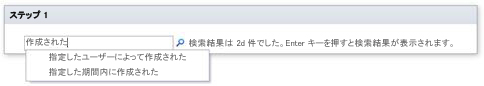
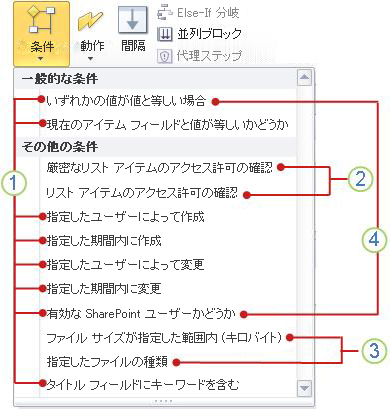
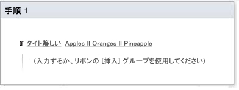

# ワークフロー条件のクイック リファレンス (SharePoint 2010 ワークフロー プラットフォーム)
Microsoft SharePoint Designer 2013 の Sharepoint 2010 ワークフロー プラットフォームで使用可能なワークフロー条件について説明します。SharePoint Designer 2013 を使用しているが、SharePoint 2010 ワークフロー プラットフォームを引き続き使用する場合にのみ、この記事を参考にしてください。SharePoint 2013 ワークフロー プラットフォームを使用する場合は、「 [SharePoint 2013 ワークフローのアクションとアクティビティのリファレンス](workflow-actions-and-activities-reference-for-sharepoint-2013.md)」、および「その他の技術情報」セクションに示されている、新しいプラットフォームで使用可能な新機能について説明したその他の記事を参照してください。2010 ワークフロー プラットフォームを使用してワークフローの作成を開始するには、[ **ワークフローの作成**] ダイアログ ボックスの [ **プラットフォームの種類**] で [ **SharePoint 2010 ワークフロー**] を選択します。
## ワークフロー条件のアクセス方法

使用可能なワークフロー条件のメニューにアクセスする方法は 2 種類あります。
  
    
    
ワークフロー ステップ内で編集を行う際に、次のどちらかの操作を行います。
  
    
    

- [ **ワークフロー**] タブの [ **挿入**] グループで [ **条件**] をクリックして、ワークフロー アクションの一覧を開きます。
    
  
- ワークフロー ステップ内をダブルクリックします。表示される検索ボックスに、条件名として表示するテキスト (「created」など) を入力し、Enter キーを押します。入力したテキストを含むアクションと条件がテキスト ボックスの後ろに表示されます。
    
  

  
    
    

  
    
    
ワークフローを作成または変更する際に使用できる条件は、作業中の正確なコンテキストによって異なります。詳細については、次の説明を参照してください。
  
    
    

  
    
    

  
    
    
 **1** SharePoint Designer 2013 の一般的な条件。
  
    
    
 **2** [ **厳密なリスト アイテムのアクセス許可の確認**] と [ **リスト アイテムのアクセス許可の確認**] は、代理ステップ内でのみ使用可能です。
  
    
    
 **3** [ **ファイル サイズが指定した範囲内 (キロバイト)**] と [ **指定したファイルの種類**] は、ドキュメント コンテンツ タイプ、その子、またはライブラリに関連付けられているワークフローでのみ使用可能です。
  
    
    
 **4** [ **ある値と値が等しいかどうか**] と [ **有効な SharePoint ユーザーかどうか**] は、サイト ワークフローを作成する場合にのみ使用できる条件です。
  
    
    

## 一般的な条件

このセクションでは、ワークフローが関連付けられているリストの種類またはコンテンツ タイプにかかわらず、リストおよび再利用可能リストのワークフローに対して SharePoint Designer 2013 で使用できる条件について説明します。
  
    
    

### ある値と値が等しいかどうか

この条件は、最初はワークフロー ステップで [ **ある値と値が等しいかどうか**] としてワークフロー ステップに表示されています。1 つの値と別の値を比較する場合は、この条件を使用します。それぞれの値には、静的テキスト、動的文字列、あるいは変数、コンテキスト情報、または SharePoint フィールドに対する検索を指定できます。
  
    
    
条件では、[ **が次の値を含む**] や [ **が次の値より大きい**] などの幅広い演算子から選択できます。そのためには、条件の最初の [ **値**] を設定して、[ **が次の値と等しい**] をクリックする必要があります。使用可能な演算子は、条件の最初の [ **値**] の設定内容によって異なります。たとえば、検索ダイアログを使用して条件の最初の [ **値**] を [ **作成日時**] などの日付/時刻データ型に設定した場合、使用可能なオプションに [ **が次の値を含む**] 演算子は含まれません。
  
    
    
[ **が次の値と等しい**] 演算子と [ **が次の値を含む**] 演算子には、次の 2 つのバリエーションがあります。
  
    
    

- [ **が次の値と等しい**] 演算子と [ **が次の値を含む**] 演算子は、どちらも大文字と小文字を区別します。
    
  
- [ **が次の値に等しい (大文字と小文字を区別しない)**] 演算子と [ **が次の値を含む (大文字と小文字を区別しない)**] 演算子は、大文字と小文字を区別しません。
    
  
条件の 2 番目の [ **値**] に対して選択するオプションは、最初の [ **値**] の設定内容によってもある程度異なります。たとえば、最初の [ **値**] を [ **作成日時**] に設定し、[ **最後の 10 文字**] などの文字列変数を使用して 2 番目の [ **値**] を検索するとします。[ **作成日時**] との比較で予測可能な結果が返されるように、この文字列は [ **日付/時刻型として**] 返してもらいたいでしょう。
  
    
    

> **メモ**
> 条件で**||**(OR) や **&amp;&amp;** (AND) の論理演算子を使用できます。
  
    
    

ワークフロー ステップでの条件の例を以下に示します。
  
    
    

- 変数: 変更日時から 1 週間が今日より大きいかどうか
    
  
- 変数: 仕様名が SharePoint Designer または SPDを含む (大文字と小文字を区別しない) かどうか
    
  
[ **ある値と値が等しいかどうか**] 条件は、サイト ワークフローで作業している場合に使用できる 2 つの条件のうちの 1 つで、もう 1 つの条件は [ **有効な SharePoint ユーザーかどうか**] です。サイト ワークフローの詳細については、この記事の「 [サイト ワークフロー内で使用可能な条件](workflow-conditions-quick-reference-sharepoint-2010-workflow-platform.md#section5)」セクションを参照してください。
  
    
    

### 現在のアイテム フィールドと値が等しいかどうか

この条件は、最初はワークフロー ステップに [ **条件: フィールド が 値 に等しい**] として表示されています。現在のアイテム (リストまたは再利用可能リストのワークフローが現在実行されているアイテム) 内のフィールドの値を別の値と比較するには、この条件を使用します。値には、静的テキスト、動的文字列、あるいは変数、コンテキスト情報、またはその他の SharePoint フィールドに対する検索を指定できます。
  
    
    
[ **フィールド**] をクリックすると、オプションの一覧が表示されます。[ **フィールド**] に使用できるオプションは、ワークフローが関連付けられているコンテンツ タイプ、リスト、ライブラリ、またはサイトによって異なります。たとえば、既定のライブラリに関連付けられているワークフローには、[ **タイトル**]、[ **作成日時**]、[ **作成者**] などのフィールド オプションがあります。
  
    
    
[ **が次の値を含む**] や [ **が次の値より大きい**] などの幅広い演算子から選択できます。演算子を選択する前に、まず [ **フィールド**] の値を選択し、[ **が次の値と等しい**] をクリックする必要があります。使用可能な演算子は、[ **フィールド**] の設定内容によって異なります。たとえば、検索ダイアログを使用して [ **フィールド**] を [ **作成日時**] などの日付/時刻データ型に設定した場合、[ **が次の値を含む**] 演算子はオプションとして一覧表示されません。
  
    
    
[ **が次の値と等しい**] 演算子と [ **が次の値を含む**] 演算子には、2 つのバリエーションがあります。[ **が次の値と等しい**] 演算子と [ **が次の値を含む**] 演算子は大文字と小文字を区別しますが、[ **が次の値に等しい (大文字と小文字を区別しない)**] 演算子と [ **が次の値を含む (大文字と小文字を区別しない)**] 演算子は大文字と小文字を区別しません。たとえば、[ **フィールド**] を [ **タイトル**] に設定して [ **が次の値を含む**] 演算子を使用する場合や、条件の [ **値**] が「Document」の場合、条件はタイトルに大文字の D の「Document」が含まれる場合にのみ真になり、大文字の D ではない「document」のみが含まれる場合は真になりません。[ **が次の値を含む (大文字と小文字を区別しない)**] 演算子を使用すると、条件は「Document」、「document」、またはその両方が含まれるタイトルに対して真になります。 
  
    
    
[ **値**] に対して選択するオプションは、[ **フィールド**] の設定内容によってもある程度異なります。たとえば、[ **フィールド**] を [ **作成日時**] に設定し、[ **最後の 10 文字**] などの文字列変数を使用して [ **値**] を検索するとします。[ **作成日時**] との比較で予測可能な結果が返されるように、この文字列は [ **日付時刻型として**] 返してもらいたいでしょう。
  
    
    

> **メモ**
> 条件で**||**(OR) や **&amp;&amp;** (AND) の論理演算子を使用できます。
  
    
    

ワークフロー ステップでの条件の例を以下に示します (最初の例では [ **が次の値より小さい**] が "より早い" と解釈されることに注意してください)。
  
    
    

- 現在のアイテム: 変更日時が 1/1/2010 12:00:00 AMより小さいかどうか
    
  
- 現在のアイテム: パスが Marketing または Public Relationsを含む (大文字と小文字を区別しない) かどうか
    
  

### 指定したユーザーによって作成された

この条件は、最初はワークフロー ステップで [ **条件: 指定したユーザー によって作成された**] として表示されています。指定したユーザーによってアイテムが作成されたかどうかを調べるには、この条件を使用します。ユーザーは、ユーザー名または電子メール アドレス (Olivier@contoso.com など) を手動で入力するか、SharePoint、Exchange、または Active Directory に既に一覧表示されているユーザーから選択して、指定できます。
  
    
    

> **メモ**
> ユーザー名と電子メール アドレスはどちらも大文字と小文字を区別するので、大文字と小文字を正しく区別できるよう、後者の方法を使用することをお勧めします。ユーザー名または電子メール アドレスを手動で入力する必要がある場合は、大文字と小文字が正確に一致するように注意してください。たとえば、ユーザー アカウントが Contoso\\Molly として登録されている場合、[ **contoso\\molly によって作成されたかどうか**] という条件は真と評価されません。 
  
    
    

以下にワークフロー ステップ内での条件の例を示します。
  
    
    

- Molly Clark によって作成されたかどうか
    
  

### 指定した期間内に作成された

この条件は、最初はワークフロー ステップに [ **条件: 日付 から 日付 の間に作成された**] として表示されています。指定した 2 つの日付の間にアイテムが作成されたかどうかを調べるには、この条件を使用します。現在の日付、指定した日付、または検索結果を使用できます。
  
    
    
以下にワークフロー ステップ内での条件の例を示します。
  
    
    

- 2009 年 1 月 1 日から 2010 年 1 月 1 日 午前 12 時 00 分 00 秒の間に作成されたかどうか
    
  

### 指定したユーザーによって変更された

この条件は、最初はワークフロー ステップに [ **条件: 指定したユーザー によって変更された**] としてに表示されています。指定したユーザーによってアイテムが変更されたかどうかを調べるには、この条件を使用します。ユーザーは、olivier@contoso.com のように電子メール アドレスで指定するか、SharePoint、Exchange、または Active Directory のユーザーから選択できます。
  
    
    

> **メモ**
> ユーザー名と電子メール アドレスは大文字と小文字を区別します。大文字と小文字を正しく区別できるよう、ユーザー名または電子メール アドレスを選択することをお勧めします。ユーザー名または電子メール アドレスを入力する場合は、アカウントの大文字/小文字と一致させる必要があります。たとえば、ユーザー アカウントが Contoso\\Molly の場合、[ **contoso\\molly によって変更されたかどうか**] は真と評価されません。 
  
    
    

以下にワークフロー ステップ内での条件の例を示します。
  
    
    

- Molly Clark によって変更されたかどうか
    
  

### 指定した期間内に変更された

この条件は、最初はワークフロー ステップに [ **条件: 日付 から 日付 の間に変更された**] として表示されています。指定した 2 つの日付の間にアイテムが変更されたかどうかを調べるには、この条件を使用します。それぞれの日付の値には、現在の日付、指定した日付、または検索結果を使用できます。
  
    
    
以下にワークフロー ステップ内での条件の例を示します。
  
    
    

- 2009 年 1 月 1 日から 2009 年 1 月 1 日 午前 12 時 00 分 00 秒の間に変更されたかどうか
    
  

### 有効な SharePoint ユーザーかどうか

この条件は、最初はワークフロー ステップに [ **有効な SharePoint ユーザーかどうか**] として表示されています。指定したユーザーが SharePoint サイトのメンバーかどうかを調べるには、この条件を使用します。
  
    
    
SharePoint Designer 2013 では、企業ドメイン外のユーザー (外部参加者) を含めることができます。たとえば、ワークフローでタスクを外部参加者に割り当てたとします。その場合、このアクションを使用して、タスクが完了するまでサイト ユーザーを外部参加者によってフォローアップできます。
  
    
    
以下にワークフロー ステップ内での条件の例を示します。
  
    
    

- Molly Clark が有効な SharePoint ユーザーかどうか
    
  
[ **有効な SharePoint ユーザーかどうか**] 条件は、サイト ワークフローで作業している場合に使用できる 2 つの条件のうちの 1 つで、もう 1 つの条件は [ **ある値と値が等しいかどうか**] です。サイト ワークフローの詳細については、この記事の「 [サイト ワークフロー内で使用可能な条件](workflow-conditions-quick-reference-sharepoint-2010-workflow-platform.md#section5)」セクションを参照してください。
  
    
    

### タイトル フィールドにキーワードを含む

この条件は、最初はワークフロー ステップに [ **条件: タイトル フィールドに キーワード を含む**] として表示されています。指定したテキストがアイテムの [ **タイトル**] フィールドに含まれるかどうかを調べるには、この条件を使用します。文字列ビルダーで (静的値、動的文字列、またはその 2 つの組み合わせとして) テキストを指定するか、フィールドまたは変数に対する検索を挿入することができます。
  
    
    

> **メモ**
> [ **タイトル フィールドにキーワードを含むかどうか**] 条件を使用する場合、複数のキーワード テキストは検索できません。複数の代替キーワード テキストを検索するには、**||**( OR) や **&amp;&amp;** (AND) などの論理演算子を、[ **ある値と値が等しいかどうか**] および [ **現在のアイテム フィールドと値が等しいかどうか**] という 2 つの条件のどちらかで使用します ([ **タイトル**] フィールドのみを検索する場合は、後者の条件を使用します)。たとえば、次の図を参照してください。 > 
  
    
    

  
    
    

  
    
    

  
    
    

  
    
    

## 代理ステップ内でのみ使用可能な条件

既定では、ワークフローを手動で開始すると、ワークフローを開始したユーザーのアクセス許可が使用されます。しかし、ワークフローを開始したユーザーに、そのワークフローが実行する必要がある 1 つまたは複数の操作に適した権限がない場合はどうでしょうか。たとえば、ワークフローを開始したユーザーが、アーカイブのためのアクセス許可を含まない、読み取りアクセス許可レベルのみを持っているライブラリに、ワークフローがドキュメントをアーカイブする必要がある場合はどうなるでしょうか。 
  
    
    
そのような場合は、ワークフロー内で 1 つまたは複数の代理ステップを使用できます。代理ステップでは、そのワークフロー テンプレートを直前に保存したユーザー (通常はテンプレートの作成者) のアクセス許可が使用されます。通常、このユーザーは、ワークフローのすべての操作に必要なアクセス許可 (この場合はドキュメントを適切なライブラリにアーカイブするためのアクセス許可) を持っています。 
  
    
    

> **メモ**
>  どちらの条件でも、条件が真と評価されるには、指定したユーザーおよびグループのすべてが比較に合格する必要があります。>  どちらの条件でも、指定したアクセス許可が指定した個人ユーザーに明示的に割り当てられているか、指定したアクセス許可を指定した個人ユーザーが (たとえば、アクセス許可が割り当てられているグループのメンバーとして) 暗黙的に保持しているかは関係ありません。一方、グループを指定した場合、アクセス許可は明示的に割り当てられている必要があり、親グループから継承されません。
  
    
    

### リスト アイテムのアクセス許可の確認

この条件は、最初は代理ステップに [ **条件: これらのユーザー が このリスト のアイテムに対して持つアクセス許可は、少なくとも これらのアクセス許可**] として表示されています。 
  
    
    
指定したリストまたはライブラリに対して、指定した各ユーザーおよびグループが保持する個々のアクセス許可に、指定した 1 つまたは複数のセキュリティ レベルに含まれる個々のアクセス許可がすべて含まれるかどうかを調べるには、この条件を使用します。
  
    
    
 **例**
  
    
    

- あるユーザーまたはグループは、あるリストに対して読み取りアクセス許可レベルのみを持っていますが、条件では承認レベルが指定されています。読み取りレベルには、承認レベルに含まれるアクセス許可がすべて含まれるわけではないので、この場合、条件は偽と評価されます。
    
  
- 別のユーザーまたはグループは、同じリストに対してフル コントロールアクセス許可レベルを持っています。フル コントロール レベルには、承認レベルに含まれるすべてのアクセス許可 (およびその他のアクセス許可) が含まれるため、今回は、条件が真と評価されます。
    
  
以下にワークフロー ステップ内での条件の例を示します。
  
    
    

- Contoso Members のアクセス許可が現在のアイテム内のアイテムに対する読み取りアクセス許可以上かどうか
    
  

### リスト アイテムのアクセス許可レベルを確認

この条件は、最初は代理ステップに [ **条件: これらのユーザー が このリスト のアイテムに対して持つアクセス許可レベルは、少なくとも これらのアクセス許可レベル**] として表示されています。 
  
    
    
指定したリストまたはライブラリに対して、指定した各ユーザーおよびグループに指定した 1 つまたは複数のアクセス許可レベルが明示的に割り当てられているかどうかを調べるには、この条件を使用します。(たとえば、アクセス許可が割り当てられているグループのメンバーによって) 暗黙的にのみ保持されているアクセス許可や、指定したユーザーまたはグループが保持している個々のアクセス許可は、この条件では考慮されません。
  
    
    
 **例**
  
    
    

- あるユーザーは、あるリストに対してフル コントロール アクセス許可レベルのみが明示的に割り当てられていますが、条件では読み取りレベルのみが指定されています。このユーザーは、読み取りレベルに含まれる個々のアクセス許可をすべて保持していますが、読み取りレベルは明示的に割り当てられていないので、条件は偽と評価されます。
    
  
- 別のユーザーは、別のリストに対してデザイン アクセス許可レベルのみが明示的に割り当てられていますが、条件ではデザイン レベルと階層の管理レベルの両方が指定されています。このユーザーには、必要な 2 つのレベルのうち 1 つしか割り当てられていないので、条件は偽と評価されます。
    
  
- 3 番目のリストに対して、あるユーザーは Members グループのメンバーであり、そのグループからアクセス許可を継承しています。ただし、そのユーザーに対して明示的に割り当てられているアクセス許可レベルはありません。この条件には、投稿レベルの明示的な割り当てが必要です。このユーザーは、投稿レベルのアクセス許可を暗黙的にのみ保持しているので、やはり条件は偽と評価されます。
    
  
以下にワークフロー ステップ内での条件の例を示します。
  
    
    

- Contoso Members のアクセス許可レベルが現在のアイテム内のアイテムに対する読み取りアクセス許可以上かどうか
    
  

## ワークフローがライブラリまたはドキュメント コンテンツ タイプに関連付けられている場合にのみ使用可能な条件

[ **ファイル サイズが指定した範囲内 (キロバイト)**] 条件と [ **指定したファイルの種類**] 条件は、ワークフローがライブラリまたはドキュメント コンテンツ タイプに関連付けられている場合にのみ使用できます。
  
    
    

### ファイル サイズが指定した範囲内 (キロバイト)

この条件は、最初はワークフロー ステップに [ **条件: ファイルのサイズが サイズ KB から サイズ KB の間**] として表示されています。ドキュメントのファイル サイズが指定した 2 つのサイズ (キロバイト単位) の間に含まれるかどうかを調べるには、この条件を使用します。条件の評価で、指定したサイズは含まれません。各 [ **サイズ**] には、数値を入力するか、検索を使用できます。
  
    
    
以下にワークフロー ステップ内での条件の例を示します。
  
    
    

- ファイル サイズが 1023 から1048577 (キロバイト) の間かどうか
    
  

> **メモ**
> 指定した上限および下限は、定義される範囲内に含まれません。この例では、1023 KB のファイルは 1023 ～ 1048577 の間に含まれないため、偽と評価されます。 
  
    
    

### 指定したファイルの種類

この条件は、最初はワークフロー ステップに [ **条件: ファイルの種類が 指定した種類**] として表示されています。現在のアイテムのファイルの種類が指定した種類 (docx など) かどうかを調べるには、この条件を使用します。ファイルの種類は、文字列として入力するか、検索を使用できます。
  
    
    
以下にワークフロー ステップ内での条件の例を示します。
  
    
    

- ファイルの種類が docx かどうか
    
  

## サイト ワークフロー内で使用可能な条件

サイト ワークフローはサイト レベルで動作するもので、リスト アイテムに関連付けられていません。サイト ワークフローで作業する場合は、次の条件のみを使用できます (SharePoint Designer 2013 のその他の条件はすべてリスト アイテムに対して動作するため、サイト ワークフローでは機能しません)。
  
    
    

- [ **ある値と値が等しいかどうか**]
    
  
- [ **有効な SharePoint ユーザーかどうか**]
    
  
サイト ワークフロー内の代理ステップから:
  
    
    

- [ **リスト アイテムのアクセス許可の確認**]
    
  
- [ **リスト アイテムのアクセス許可レベルを確認**]
    
  
- [ **有効な SharePoint ユーザーかどうか**]
    
  
条件の詳細については、この記事の「 [一般的な条件](workflow-conditions-quick-reference-sharepoint-2010-workflow-platform.md#section2)」セクションを参照してください。
  
    
    

## その他の技術情報

-  [SharePoint 2013 ワークフローの新機能](what-s-new-in-workflows-for-sharepoint-2013.md)
    
  
-  [SharePoint 2013 ワークフローの概要](get-started-with-workflows-in-sharepoint-2013.md)
    
  
-  [SharePoint Designer および Visio でのワークフロー開発](workflow-development-in-sharepoint-designer-and-visio.md)
    
  

  
    
    

