# Visual Studio 2012 を使用した SharePoint 2013 ワークフローにおけるタスクの操作
ワークフロー タスク フレームワークに対して SharePoint 2013 で行われた新規追加および変更について説明します。これは、新しいワークフロー マネージャーが基になっています。 
 **提供元:** [Andrew Connell](http://social.msdn.microsoft.com/profile/andrew%20connell%20%5bmvp%5d/),  [AndrewConnell.com](http://www.andrewconnell.com)
  
    
    


  
    
    

> **メモ**
> この記事にはエンドツーエンドのコード サンプルが付属しており、記事を読みながら参照したり、独自の SharePoint ワークフロー プロジェクトを開始するときに利用したりできます。ダウンロード可能なコードは [こちら](http://assets.andrewconnell.com/media/Default/Downloads/SP2013Wf-CustomTasks.zip)にあります。 
  
    
    


  
    
    
SharePoint の Windows Workflow Foundation に対する最大のメリットの 1 つは、新規追加および改良されたタスク管理フレームワークの実装のホスティング環境として新しいワークフロー マネージャーが組み込まれていることです。
## SharePoint 2007 および SharePoint 2010 でのワークフロー タスクの確認

SharePoint 2007 と SharePoint 2010 でのワークフロー タスクの実装方法は似ていました。リスト、コンテンツ タイプ、またはサイト (SharePoint 2010 の場合) でワークフロー関連付けを作成するときは、ワークフロー タスクが作成される場所として特定のリストを指定しました。このリストは、標準の SharePoint **Task** コンテンツ タイプ (ID = 0x0108) を使用する標準の SharePoint **Task** リスト (ID = 107) でした。その後、ユーザーはリストのアイテムにアクセスし、タスクを表示、編集、完了できました。ワークフローがそのように構成されている場合、ワークフロー インスタンスはリスト内のタスク アイテムの更新を監視しました。
  
    
    
ただし、SharePoint でのタスク フォームの既定のレンダリングは、カスタム ワークフローであっても、あらかじめ決められていました。最大限の柔軟性を得るには、タスクをサポートするカスタム フォーム ソリューションを作成するときに、ASP.NET [Web フォーム](http://www.asp.net/web-forms)または  [InfoPath フォーム](http://msdn.microsoft.com/ja-jp/library/ms540731%28v=office.14%29.aspx)を使用する必要がありました。
  
    
    

## SharePoint 2013 でのタスクに関する新機能

SharePoint 2013 では、SharePoint アーキテクチャが変更されたために、タスクを作成、管理、処理する方法が変更されています。
  
    
    
最大の変更点は、ワークフローが SharePoint の内部で管理および処理されなくなったことです。SharePoint 2013 では、これらの機能は、外部で実行されるワークフロー マネージャーと呼ばれる新しいコンポーネントを利用して行われます。ワークフロー マネージャーは、Windows Workflow Foundation ランタイムおよび Windows Workflow Foundation で必要なサービスをホストします。ワークフローが公開されると、または公開されているワークフローの新しいインスタンスが開始されると、SharePoint はワークフロー マネージャーにそれを通知し、ワークフロー マネージャーはワークフロー エピソードを処理します。ワークフローは、リスト アイテムのプロパティやユーザーのプロパティなどの SharePoint 内の情報へのアクセスが必要になると、OAuth を使用して認証を行い、REST API を使用して Web サービス呼び出しで SharePoint に応答します。
  
    
    
SharePoint プラットフォームのカスタマイズの全体的な傾向も SharePoint 2013 で変わりましたが、この変更は SharePoint 2010 でのセキュリティで保護されたソリューションの実装で始まったものです。SharePoint 2013 において行われた変更により、カスタマイズは SharePoint Server からクライアントのブラウザーまたは外部のリソースに移動されました。このような変更としては、新しい SharePoint アプリ モデル、アプリ ID の割り当てのサポート、OAuth を使用した認証、クライアント側オブジェクト モデル (CSOM) の強化、REST API などがあります。
  
    
    

## SharePoint 2013 でのワークフロー タスクのアーキテクチャに関する変更

SharePoint 2013 でのアーキテクチャの変更は、ワークフロー タスクにどのような影響があるでしょうか。ワークフロー タスクに関しては、カスタム タスク フォームを使用する場合を除けば、大きな影響はありません。これまでは、InfoPath または ASP.NET の Web フォームを使用してタスク フォームを作成しました。一方、SharePoint 2013 では、既定のリスト アイテム レンダリング フォームをワークフロー タスクに使用します。 
  
    
    
タスク フィールドの表示または動作をカスタマイズすることが必要になる場合があります。その場合は、サイト列を含むカスタム タスク コンテンツ タイプを作成します。このようにすると、サイト列は SharePoint 2013 の新しいクライアント側レンダリング フレームワークを使用できます。その場合、ブラウザーでのフィールドの表示および動作方法を定義する JavaScript ファイルを作成する必要があります。 
  
    
    
クライアント側レンダリングの使用方法の詳細については、「 [[方法] クライアント側のレンダリングを使用して SharePoint アプリのリスト ビューをカスタマイズする](http://msdn.microsoft.com/ja-jp/library/jj220045.aspx)」を参照してください。
  
    
    
個々のタスク アイテムはコンテンツ タイプが基になっています。重要なのは、SharePoint 2013 ではコンテンツ タイプにいくつかの変更点があることです。SharePoint 2007 および SharePoint 2010 では、ワークフロー タスクは **Task** コンテンツ タイプ (ID = 0x0108) で作成されました。これは、タスク リストで非ワークフロー タスクを手動で作成する場合に使用するものと同じコンテンツ タイプです。SharePoint 2013 では、新しいコンテンツ タイプ **Workflow Task (SharePoint 2013)** (ID = 0x0108003365C4474CAE8C42BCE396314E88E51F) の導入によってこれが変更されています。この新しいコンテンツ タイプは、Task コンテンツ タイプを継承し、タスクがワークフローのみに使用されることを示します。
  
    
    
この新しい **Workflow Task** コンテンツ タイプと従来の **Task** コンテンツ タイプの違いは、2 つの新しい列があることです。
  
    
    

- **WorkflowInstanceId**: タスクを作成したワークフロー インスタンス識別子への参照が格納されます。この参照は、ワークフロー インスタンスの状態ページなどで使用されます。状態ページは、このフィールドを使用することにより、関連付けられているワークフロー タスク リストで、 **WorkflowInstanceId** 列に指定された ID が含まれるすべてのリスト アイテムをクエリできます。
    
  
- **TaskOutcome**: タスク フォームのプレゼンテーションで、ユーザーが異なる完了条件オプションを選択できるようにするために使用される選択フィールドです。タスク編集フォームでは、フォーム下部の [ **保存**] および [ **キャンセル**] ボタンの隣に、指定されたワークフロー タスクの結果がボタンとして表示されます。SharePoint 2013 のワークフローは、図 1 で示されている 2 つのオプション [ **Approved**] および [ **Rejected**] には限定されません。
    
   **図 1. ワークフロー タスクの結果**

  

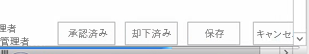
  

  

  
当然ですが、コンテンツ タイプはワークフロー タスクの一部です。コンテンツ タイプは、タスク リスト アイテムの構造を示しているだけです。タスク リスト テンプレートも同じように重要であり、やはり SharePoint 2013 で変更されています。
  
    
    
SharePoint 2013 より前のワークフロー タスク リストでは、標準タスク リスト (ID = 107) と同じリスト テンプレートが使用されていました。これは標準の SharePoint タスク リストであり、ワークフロー以外のタスクも格納できました。SharePoint 2013 では方法が異なり、新しいタイプのリストが導入されています。階層タスク リストと呼ばれるこのリストでは、図 2 のように、タスクのスケジュールを示すタイムライン ビューがページの上部に表示されます。タスクの依存関係もわかることに注目してください。
  
    
    

**図 2. 階層タスク リスト**

  
    
    

  
    
    
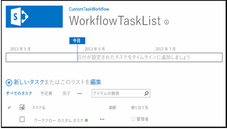
  
    
    

  
    
    

  
    
    

## SharePoint 2013 でのワークフロー タスク オプションの作成

SharePoint Designer 2013 および Visual Studio 2012 のどちらでも、ワークフロー作成者は 2 つの方法でワークフロー タスクを作成できます。1 番目の方法では、1 つのタスクを作成して 1 人のユーザーまたは 1 つのグループに割り当てます。2 番目の方法では、1 つのタスクを作成してそれを複数のユーザーに割り当てます。Visual Studio 2012 を使用してカスタム ワークフローに 1 つのタスクを作成するときは、 **SingleTask** アクティビティを使用します。このアクティビティを使用することにより、[ **プロパティ**] ツール ウィンドウまたはウィザードでプロパティを変更できます (図 3 を参照)。
  
    
    

**図 3. 単一タスク ウィザード**

  
    
    

  
    
    
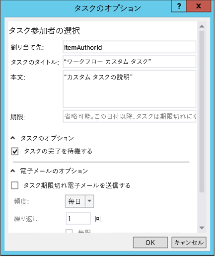
  
    
    
SharePoint では、複数のタスクを順次または並列のどちらで実行するか、およびタスク完了の条件を指定できます。SharePoint は、すべてのタスクが完了するのを待つ必要があるでしょうか、またはある割合のタスクが特定の結果で完了するのを待てばよいでしょうか。Visual Studio 2012 で複数のタスクを作成するには、 **CompositeTask** アクティビティを使用します。このアクティビティのウィザードとプロパティは、 **SingleTask** アクティビティと似ています (図 4 を参照)。
  
    
    

**図 4. コンポジット タスク ウィザード**

  
    
    

  
    
    
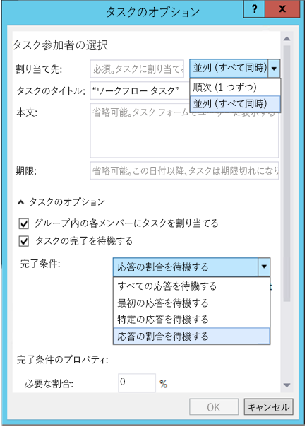
  
    
    

  
    
    

  
    
    

## カスタム ワークフローのタスクを作成して割り当てる方法

次のチュートリアルでは、カスタム ワークフローのタスクを作成して割り当てる方法を示します。始める前に、SharePoint 2013 開発者向けサイトにアクセスできることを確認してください。
  
    
    

### 1. 新しい SharePoint 2013 アプリ プロジェクトを作成する


1. 新しい SharePoint 2013 アプリ プロジェクトを作成し、プロジェクトを SharePoint ホスト型アドインとして構成します。
    
  
2. 新しい **Announcement** リスト インスタンスをプロジェクトに追加します。これは、ワークフローのテストで使用されるアイテムのコンテナーとして使用されます。
    
  
3. [ **ソリューション エクスプローラー**] のプロジェクト アイコンを右クリックし、[ **追加**]、[ **新しいアイテム**] の順に選択して、ワークフロー アイテムをプロジェクトに追加します。
    
  
4. [ **新しいアイテムの追加**] ダイアログ ボックスで、[ **Office/SharePoint**] カテゴリから [ **ワークフロー**] プロジェクト アイテムを選択し、名前を "CustomTaskWorkflow" に設定して、[ **次へ**] をクリックします。
    
  

### 2. 新しいお知らせアイテムについての情報を収集する

ワークフローのタスクを作成し、ワークフローを開始するお知らせリスト アイテムを作成したユーザーに割り当てます。リスト アイテム自体がワークフローに情報を提供します。 **LookupSPListItemProperties** アクティビティを使用します。このアクティビティは、SharePoint で呼び出した REST Web サービスからの動的な値を返します。この値を **AnnouncementItemProperties** という名前の新しい変数に格納し、データ型を **DynamicValue** に変更します。
  
    
    

1. リスト アイテムを作成したユーザーの ID を格納するために、 **AnnouncementItemAuthorId** 変数を作成します (図 5 を参照)。
    
   **図 5. LookupSPListItemProperties アクティビティ**

  

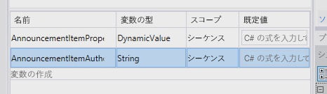
  

  

  
2. **LookupSPListItem** アクティビティをワークフロー デザイン サーフェイスにドロップし、 **ListID** プロパティを _(current list)_ に設定します。
    
  
3. **ItemId** を _(current item)_ に設定します。
    
  
4. **Result** の出力を、前に作成した **AnnouncementItemProperties** 変数に設定します。
    
  
5. 変数からアイテムの作成者を取得するには、 **LookupSPListItem** アクティビティで [ **プロパティの取得**] リンクをクリックし、 **GetDynamicValueProperties** アクティビティをデザイン サーフェイスに追加します。その **Source** プロパティを、 **LookupSPListItem** アクティビティの出力に設定します。
    
  
6. [ **Properties**] プロパティの [ **…**] ボタンをクリックし、[ **プロパティ**] ダイアログ ボックスを表示します。
    
  
7. [ **プロパティ**] ダイアログ ボックスで、[ **エンティティ型**] を [ **お知らせのリスト アイテム**] に変更します (図 6 を参照)。
    
  
8. [ **作成者**] パスを変数 **AnnouncementItemAuthorId** に割り当てます (図 6 を参照)。
    
   **図 6. [プロパティ] ダイアログ**

  

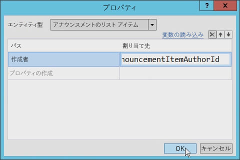
  

  

  

### 3. タスクを作成して割り当てる

ここでは、タスクを作成し、お知らせアイテムの作成者に割り当てることができます。
  
    
    

1. ツールボックスで、 **SingleTask** アクティビティをワークフロー デザイン サーフェイスに追加します。
    
  
2. アクティビティで [ **構成**] リンクをクリックし、[ **タスクのオプション**] ダイアログ ボックスを開きます。
    
  
3. [ **担当者**] プロパティを、作成者 ID の格納に使用されている変数に設定します。
    
  
4. 図 7 に示すように、タスクのタイトルと本体を変更します。
    
   **図 7. [タスクのオプション] ダイアログ**

  

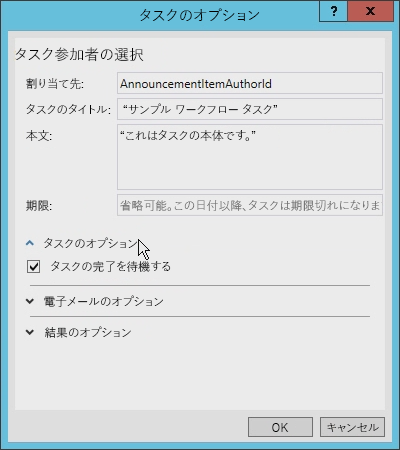
  

  

  
[ **タスクのオプション**] ダイアログ ボックスには、設定できるオプションが他にもいくつかあります。たとえば、ボックスをオンにするだけで、タスクが完了するのを待つようにワークフローを設定できます (図 7 を参照)。以前のバージョンの SharePoint のワークフローでこれを行うには、難しい回避策が必要でした。
  
    
    
図 8 で設定できる電子メール オプションを確認してください。タスクが期限切れのときには常に電子メール メッセージが送信されるようにして、お知らせの送信頻度を指定できます。 
  
    
    

**図 8. 電子メール オプションの設定**

  
    
    

  
    
    
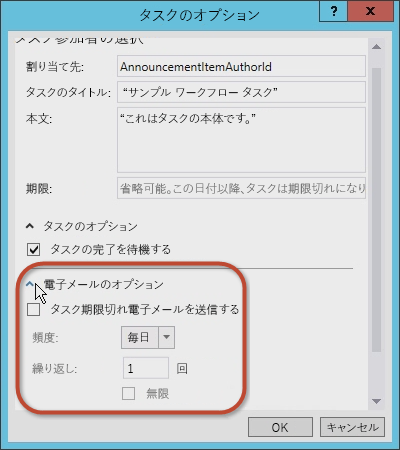
  
    
    
タスクの結果オプションを設定することもできます。ワークフロー タスクのコンテンツ タイプ、[ **結果フィールド**]、[ **既定の結果**] を選択できます (図 9 を参照)。
  
    
    

**図 9. 結果オプションの設定**

  
    
    

  
    
    
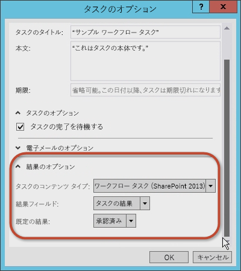
  
    
    

  
    
    

  
    
    

### 4. タスクのプロパティを確認して修正する

[ **タスクのオプション**] ダイアログ ボックスで値を確定した後は、 **SingleTask** アクティビティを選択し、[ **プロパティ**] プロパティ グリッドを調べます (図 10 を参照)。
  
    
    

**図 10. プロパティ ツール ウィンドウ**

  
    
    

  
    
    
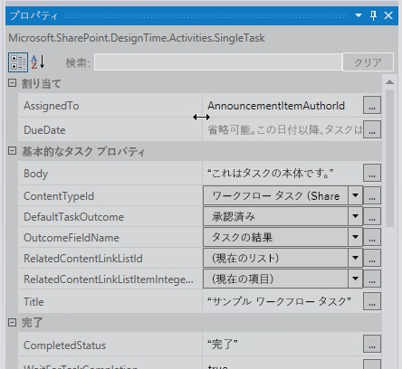
  
    
    
[ **プロパティ**] プロパティ グリッドを使用すると、タスクが完了してから先に進むかどうかを指定でき、タスクで生成される電子メール メッセージ (初期割り当て電子メール メッセージ、期限切れ電子メール メッセージ、タスク キャンセル電子メール メッセージなど) を構成できます。
  
    
    
 **Outcome** プロパティによって **outcome_0** という名前の変数がタスクに自動的に作成されていることに注意してください。この変数の内容を表示するには、デザイン サーフェイスに **WriteToHistory** アクティビティを追加し、結果を書き出すようにメッセージを更新します (図 11 を参照)。
  
    
    

**図 11. 結果プロパティの値**

  
    
    

  
    
    
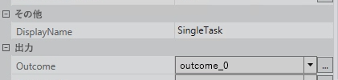
  
    
    

  
    
    

  
    
    

### 5. ワークフローをテストする

ワークフローをテストするには次のようにします。
  
    
    

1. **F5** キーを押してビルドして実行するか、または Visual Studio 2012 の [ **開始**] ボタンをクリックします。SharePoint 2013 の社内インストールでテストを行っている場合は、Visual Studio 2012 によって ワークフロー マネージャー Test Service Host ユーティリティが開始され、開発者向けサイトにワークフローが展開されます。しばらくすると、開発者向けサイトが開きます。
    
  
2. [ **お知らせ**] リストに移動してリスト アイテムを作成した後、カスタム ワークフローを手動で開始します。
    
  
3. ワークフロー インスタンス状態ページに戻り、ワークフローによって作成されたタスクを探します。タスクをクリックしてフォームを表示します。ワークフローで定義された [ **タスク名**] フィールドと [ **担当者**] フィールドに注目してください (図 12 を参照)。
    
   **図 12. タスク フォーム**

  

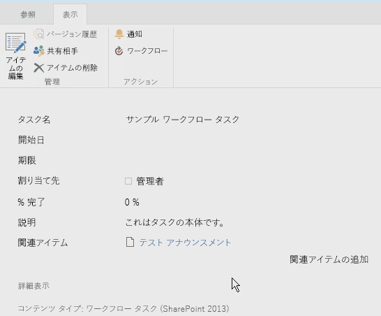
  

  

  
4. 最後に、タスクに戻り、フォームを編集し、[ **承認**] または [ **却下**] をクリックしてタスクを完了します。タスクの結果が、ワークフロー インスタンスの [ **ワークフローの履歴**] リストに表示されます (図 13 を参照)。
    
   **図 13. [ワークフローの履歴] リスト**

  

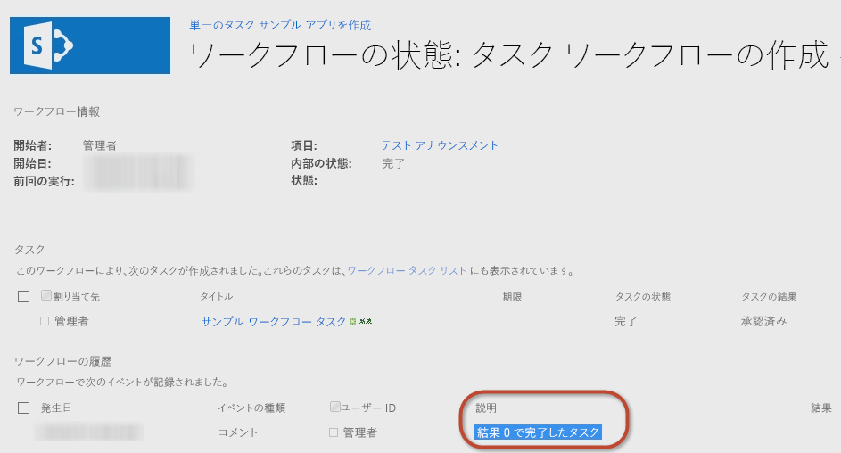
  

  

  

## カスタム結果でカスタム タスクの種類を作成する方法

前のチュートリアルでは、簡単なタスクを作成してプロパティを構成する方法を示しました。しかし、既定のオプションではノーズを満たさないことがあります。たとえば、ユーザーにドキュメントのレビューを求めるタスクがあるものとします。下書きドキュメントをレビューした後、ユーザーは下書きドキュメントを作成者に差し戻して修正を求めるか、ドキュメントを編集者に送る必要があります。残念ながら、既定のオプション ([ **承認**] および [ **却下**]) ではレビューのニーズは満たされません。[作成者に戻す] や [編集者に送る] といったさらに適切なオプションが必要です。
  
    
    
SharePoint Designer 2013 または Visual Studio 2012 を使用してワークフローを作成するときは、カスタム タスク出力を含むカスタム ワークフロー タスクを作成できます。そのためには、カスタム タスクを特別なコンテンツ タイプとして作成し、目的の結果が定義されているカスタム サイト列を追加します。カスタム列は **OutcomeChoice** というフィールド型から継承できます。これは選択フィールドです。
  
    
    
ただし、この方法には、カスタム タスクの派生元のコンテンツ タイプは **Workflow Task (SharePoint 2013)** であり、その既定の **TaskOutcome** サイト列には [ **承認**] および [ **却下**] オプションが含まれるという問題があります。この既定の設定の問題は、 **TaskOutcome** 列をカスタム タスクのコンテンツ タイプから削除することで回避でき、ワークフロー タスク リストでそれが存在しないことを確認できます。そうしないと、複数のオプションが表示されます。たとえば、"赤い薬" と "青い薬" という 2 つのオプションがあるカスタム結果について考えます。既定の結果を削除しない場合、ユーザーがタスクを完了すると、図 14 のように、適用されない結果も含めて使用できるすべての結果オプションが表示されます。
  
    
    

**図 14. 結果オプション**

  
    
    

  
    
    
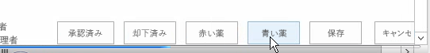
  
    
    
最善の方法は、作成するタスクの種類ごとに異なるワークフロー タスク リストを作成することです。 
  
    
    

### SharePoint 2013 アプリ プロジェクトを作成する

Visual Studio 2012 を使用してカスタム ワークフロー タスクを作成するチュートリアルを始めるには、最初に、SharePoint 2013 開発者向けサイトにアクセスできることを確認します。 
  
    
    

1. Visual Studio 2012 で、新しい SharePoint 2013 アプリ プロジェクトを作成し、SharePoint ホスト型アドインとして構成します。
    
  
2. 新しい **Announcement** リスト インスタンスをプロジェクトに追加します。これを、ワークフローのテストで使用されるアイテムのコンテナーとして使用します。
    
  
3. 次に、[ **ソリューション エクスプローラー**] のプロジェクト アイコンを右クリックし、[ **追加**]、[ **新しいアイテム**] の順に選択して、ワークフロー アイテムをプロジェクトに追加します。
    
  
4. [ **新しいアイテムの追加**] ダイアログ ボックスで、[ **Office/SharePoint**] カテゴリから [ **ワークフロー**] プロジェクト アイテムを選択し、名前を "CustomTaskWorkflow" に設定して、[ **次へ**] をクリックします。
    
  

### カスタム結果列を作成する

 **Announcements** リストを作成した後、カスタム タスクを含むカスタム コンテンツ タイプおよびカスタム結果フィールドのサイト列を作成します。
  
    
    

1. プロジェクトを右クリックし、[ **追加**]、[ **新しいアイテム**] の順に選択します。
    
  
2. [ **サイト列**] プロジェクト アイテム テンプレートを選択し、このフィールドの名前を "CustomOutcomeColumn" に設定します。サイト列のテンプレートではいくつか変更を行う必要があります。
    
  
3. 列のフィールド型を **OutcomeChoice** に設定します。結果列の場合はこのフィールド型にする必要があります。
    
  
4. [ **必須**] 列を削除します。
    
  
5. 次に、 **OutcomeChoice** フィールド型は選択フィールド型が基になっているので、選択肢をいくつか追加します。
    
  
新しいカスタム サイト列のマークアップは次のようになります。
  
    
    


```XML

<?xml version="1.0" encoding="utf-8"?>
<Elements xmlns="http://schemas.microsoft.com/sharepoint/">  
  <Field
       ID="{7b7edd9e-f5d1-4558-a2c8-e733dcfb0a5e}"
       Name="CustomSiteColumn"
       DisplayName="Better State"
       Type="Choice"
       Required="FALSE"
       Group="Custom Site Columns">
       <CHOICES>
         <CHOICE>Florida</CHOICE>
         <CHOICE>Georgia</CHOICE>
       </CHOICES>
       <Default>Florida</Default>
  </Field>
</Elements>
```


### カスタム タスクのコンテンツ タイプを作成する

サイト列を作成した後、カスタム タスク用の特別なコンテンツ タイプを作成します。
  
    
    

1. 新しいコンテンツ タイプ プロジェクト アイテムを **CustomTaskContentType** という名前でプロジェクトに追加します。
    
  
2. 基になるコンテンツ タイプの選択を求められたら、 **Workflow Task (SharePoint 2013)** コンテンツ タイプを選択します。
    
  
3. 次に、使用可能な列のリストにカスタム結果列を追加し、既定の結果列を削除します。コンテンツ タイプのマークアップは次の例のようになります。
    
  ```XML
  
<?xml version="1.0" encoding="utf-8"?>
<Elements xmlns="http://schemas.microsoft.com/sharepoint/">
  <!-- Parent ContentType: Workflow Task (SharePoint 2013) (0x0108003365C4474CAE8C42BCE396314E88E51F) -->
  <ContentType 
      ID="0x0108003365C4474CAE8C42BCE396314E88E51F00D368DFB2B31A447BB184BA1334E5119E" 
      Name="CustomContentType" 
      Group="Custom Content Types" 
      Description="My Content Type" 
      Inherits="TRUE" Version="0">
      <FieldRefs>
         <FieldRef 
            ID="{7b7edd9e-f5d1-4558-a2c8-e733dcfb0a5e}" 
            DisplayName="Better State" 
            Required="FALSE" 
            Name="CustomSiteColumn" />
            <RemoveFieldRef 
               ID="{55B29417-1042-47F0-9DFF-CE8156667F96}" 
               Name="TaskOutcome" />
      </FieldRefs>
  </ContentType>
</Elements>
  ```


### ワークフローを作成する

次に、ワークフローを作成し、カスタム サイト列とコンテンツ タイプをテストできるようにします。 
  
    
    

1. プロジェクトにワークフローを追加し、リスト ワークフローとして構成します。
    
  
2. 前に作成した [ **お知らせ**] リストを使用して、このワークフローとの関連付けを作成します。
    
  
3. **DynamicValue** 型の新しい変数を作成し、名前を "ItemProperties" にします。この変数を使用して、ワークフローのプロパティを開始するアイテムを格納します。
    
  
4. **Int32** 変数を作成し、名前を "ItemAuthorId" に設定します (図 15 を参照)。
    
   **図 15. ワークフロー変数の作成**

  

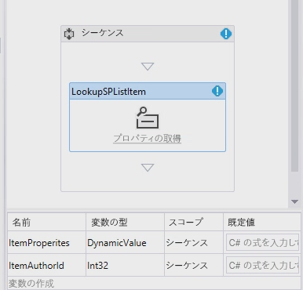
  

  

  

### リスト アイテムのプロパティを収集する

次に、リスト アイテムのプロパティを収集します。
  
    
    

1. **LookupSPListItem** アクティビティをデザイン サーフェイスにドロップし、 **ListID** プロパティを _(current list)_ に、 **ItemId** プロパティを _(current item)_ に設定します。
    
  
2. **Result** の出力を、前に作成した **ItemProperties** **DynamicValue** 変数に設定します。
    
  
3. 変数からアイテムの作成者を取得するには、 **LookupSPListItem** アクティビティで [ **プロパティの取得**] リンクをクリックし、 **GetDynamicValueProperties** アクティビティをデザイン サーフェイスに追加します。
    
  
4. アイテムの **Source** プロパティを、 **LookupSPListItem** アクティビティの出力に自動的に設定します。
    
  
5. **Properties** プロパティの [ **…**] ボタンをクリックし、[ **プロパティ**] ダイアログ ボックスを表示します。
    
  
6. **Entity Type** を **List Item of Announcements** に変更してダイアログ ボックスにコンテキストを提供し、 **Created By** パスを変数 **ItemAuthorId** に割り当てます (図 16 を参照)。
    
   **図 16. [プロパティ] ダイアログ**

  

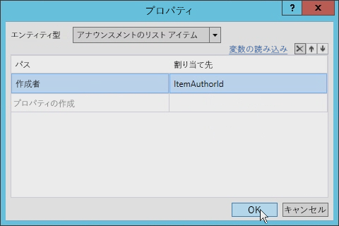
  

  

  

### 単一のタスクを作成する

次に、タスクを 1 つ作成します。 
  
    
    

1. **SingleTask** アクティビティをデザイン サーフェイスに追加します。
    
  
2. アクティビティで [ **構成**] リンクをクリックし、[ **タスクのオプション**] ダイアログ ボックスを開きます。
    
  
3. [ **本文**] フィールドに何らかの文字列を設定し (何でもかまいません)、[ **担当者**] プロパティを作成者 ID の格納に使用する変数に設定します (この場合は **ItemAuthorId**)。
    
  
4. タスクのタイトルを図 17 のように変更します。
    
   **図 17. タスク タイトルの設定**

  


  

  

  
5. 最後に、[ **結果オプション**] を、新しいカスタム コンテンツ タイプおよびカスタム結果列を使用するように設定します。
    
    **Workflow Task (SharePoint 2013)** コンテンツ タイプから派生されるすべてのコンテンツ タイプを調べて、使用できるものが決定されます (図 18 を参照)。
    

   **図 18. 結果オプションの設定**

  

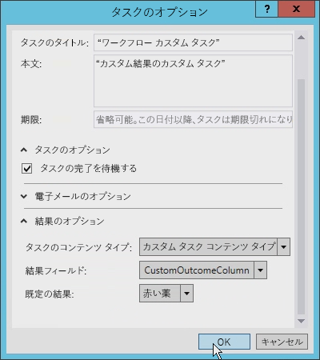
  

  

  

### AssignedTo フィールドを更新する

先に進む前に、 **SingleTask** アクティビティの **AssignedTo** フィールドを更新する必要があります。このフィールドは、整数ではなく文字列です。このように変更するには、 **ToString()** を式の最後に追加します。
  
    
    
また、 **Outcome** プロパティで **outcome_0** という名前の変数が自動的に作成されていることに注意してください。この変数の内容を表示するには、デザイン サーフェイスに **WriteToHistory** アクティビティを追加し、結果を書き出すようにメッセージを更新します。
  
    
    

### ワークフロー タスク リストを更新する

最後に、ワークフロー タスク リストを構成します。既定では、アプリによって作成されるタスク リストはコンテンツ タイプ **Workflow Task (SharePoint 2013)** だけを受け付けます。このワークフローでは、カスタム結果にカスタム コンテンツ タイプを使用します。ワークフロー タスク リストの `Elements.xml` ファイルを開き、 **<ContentTypeBinding>** 要素の **ContentTypeId** 属性を、プロジェクトのコンテンツ タイプと一致するように変更します。コードの例を次に示します。
  
    
    

```XML

<?xml version="1.0" encoding="utf-8" ?>
<Elements xmlns="http://schemas.microsoft.com/sharepoint/">
  <ListInstance 
      FeatureId="{f9ce21f8-f437-4f7e-8bc6-946378c850f0}"
      TemplateType="171"
      Title="WorkflowTaskList"
      Description="This list instance is used for workflow Task items."
      Url="Lists/WorkflowTaskList"
      RootWebOnly="FALSE" />
  <!-- CustomContentType -->
  <ContentTypeBinding 
      ListUrl="Lists/WorkflowTaskList"
      RootWebOnly="FALSE"
      ContentTypeId="0x0108003365C4474CAE8C42BCE396314E88E51F00D368DFB2B31A447BB184BA1334E5119E"/>
</Elements>
```


### カスタム タスク結果を含むカスタム コンテンツ タスクをテストする

それではワークフローをテストします。 
  
    
    

1. Visual Studio 2012 で、 **F5** キーを押すか、[ **開始**] ボタンをクリックします。SharePoint 2013 の社内ローカル インストールでテストしている場合は、Visual Studio 2012 によって ワークフロー マネージャー Test Service Host ユーティリティが開始され、開発者向けサイトにワークフローが展開されます。しばらくすると、開発者向けサイトが開きます。
    
  
2. [ **お知らせ**] リストに移動して新しいアイテムを作成します。アイテムを作成した後、カスタム ワークフローを手動で開始します。
    
  
3. 次に、ワークフロー インスタンスの状態ページに戻り、ワークフローによって作成されたタスクを探します。
    
  
4. タスクをクリックし、リボンの [ **編集**] ボタンを使用して編集モードに切り替えます。フォームの下部に 4 つのボタンがあります。最初の 2 つのボタンはカスタム結果ボタンであり、クリックすると、タスクが完了としてマークされます。次の 2 つのボタンは既定の [ **保存**] ボタンと [ **キャンセル**] ボタンで、タスクを完了しないでリスト アイテムの更新だけを行います (図 19 を参照)。
    
   **図 19: カスタム結果ボタン**

  


  

  

  

## まとめ

ワークフローは SharePoint 2007 プラットフォームで導入され、そのアーキテクチャ、実装、プロセスは SharePoint 2010 ではほとんど変更されませんでした。SharePoint ワークフローのタスクについても同様です。SharePoint 2013 では、ワークフローのアーキテクチャと実装に関して多くの変更が行われています。
  
    
    
この記事では、SharePoint 2013 でのワークフロー ストーリーに対する変更によってもたらされたワークフロー タスクに関する変更について説明しました。Visual Studio 2012 を使用して SharePoint 2013 のタスクを利用する簡単なワークフローを作成する方法を示しました。これらの種類のタスクは多くの開発者に適していますが、カスタム タスクとカスタム結果が必要な場合もあります。そのようなときは、説明したように Visual Studio 2012 を使用します。
  
    
    

## その他の技術情報
<a name="bk_addresources"> </a>


-  [SharePoint 2013 のワークフロー](http://msdn.microsoft.com/ja-jp/library/jj163986.aspx)
    
  
-  [SharePoint 2013 アプリの承認と認証](http://msdn.microsoft.com/ja-jp/library/office/fp142384.aspx)
    
  
-  [[方法] クライアント側のレンダリングを使用して SharePoint アプリのリスト ビューをカスタマイズする](http://msdn.microsoft.com/ja-jp/library/jj220045.aspx)
    
  

