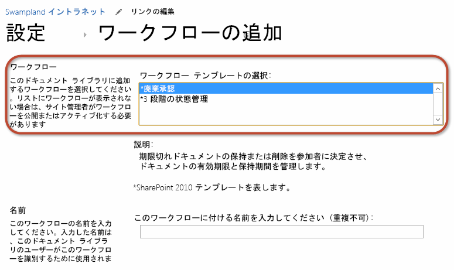
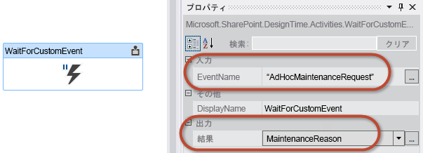

# SharePoint 2013 ワークフロー サービス クライアント側オブジェクト モデルの操作
SharePoint 2013 クライアント側オブジェクト モデル (CSOM) API を使用して ワークフロー マネージャー 1.0 のワークフロー定義とワークフロー インスタンスを作成および制御する方法を説明します。 
 **提供元:** [Andrew Connell](http://social.msdn.microsoft.com/profile/andrew%20connell%20%5bmvp%5d/)、 [AndrewConnell.com](http://www.andrewconnell.com)
  
    
    


## SharePoint 2013 ワークフロー サービス クライアント側オブジェクト モデルの操作

SharePoint 2007 と SharePoint 2010 でのワークフローの実装は、バージョンが変わってもほとんど同じです。Microsoft は、ワークフローをサイトに関連付ける機能などの新機能をいくつか SharePoint 2010 に追加し、ワークフロー オーサリング ツールの SharePoint Designer 2010 と Visual Studio 2010 を旧バージョンから改善しました。しかしながら、ワークフロー タスクの実装、ワークフロー フォーム、ワークフロー サーバー側 API にはほとんど変更がありません。 
  
    
    
SharePoint 2010 では、カスタマイズをセキュリティで保護されたソリューションに簡単に移動できる機能が取り入れられました。これらの機能は、分離プロセスで実行され、どちらのタイプの SharePoint 展開でも (社内でもクラウドでも) 使いやすいものでした。社内の場合は、会社のサーバーに SharePoint をインストールし、会社が管理していました。また、クラウドとは、すなわち Office 365 のことです。 
  
    
    
SharePoint 2013 では、さらに多くの機能が追加されました。これらの更新はクラウド展開志向となっています。具体的には、新しい SharePoint アプリ モデルが導入されました。これは、セキュリティで保護されたソリューションとは異なり、サーバー側コードが SharePoint プロセスで実行されるのを明示的にブロックするという点でセキュリティで保護されたソリューションより進んだ機能となります。また、クライアント側オブジェクト モデル (CSOM) などの既存テクノロジが SharePoint に構築され、 [OAuth](http://msdn.microsoft.com/library/office/fp142382.aspx) によるアプリ ID のサポートなどの新機能が導入されています。
  
    
    
そして、SharePoint Server 2013 の導入により、マイクロソフトは、製品の方向性の抜本的転換を反映したまったく新しいワークフロー アーキテクチャおよびプラットフォームを導入することになりました。 
  
    
    
新しいアーキテクチャにおける最も大きな変更点は、SharePoint Server 2013 でのワークフローの実行が SharePoint で行われなくなったという点です。SharePoint Server 2013 では代わりに、まったく新しい実行エンジン、ワークフロー マネージャー 1.0 が使用されます。ワークフロー マネージャーは、Windows Workflow Foundation ランタイムと、Windows Workflow Foundation で要求されるすべての必須サービスをホストします。ワークフローが公開される、または公開されたワークフローの新しいインスタンスが開始されると、SharePoint はワークフロー マネージャーに通知します。ここでワークフロー エピソードが順番に処理されます。ワークフローは、リスト アイテム プロパティやユーザー プロパティなどの SharePoint 内の情報にアクセスする際、OAuth サポートを使用して認証を行い、新しい REST API や改善された REST API を介して通信を行います。
  
    
    
MSDN の記事「How to: Create Custom SharePoint Server 2013 Workflow Forms with Visual Studio 2012」で説明したように、ワークフロー アーキテクチャにおけるこのような変更は、カスタム ワークフロー フォームなどの特定の領域に多大な影響を与えました。この記事では、新しいスタイルのカスタム ワークフロー フォームを作成する方法をサポートするために SharePoint 2013 に追加された改善点の 1 つ、CSOM の強化とワークフロー サービス CSOM API の追加について説明しています。
  
    
    

## SharePoint 2013 のワークフロー サービス CSOM API の概要

SharePoint 2007 と SharePoint 2010 では、ワークフロー API はサーバー側オブジェクト モデルにのみ現れていました。SharePoint 2013 には、この同じワークフロー API が依然として存在しています。これは、下位互換性を維持する目的で SharePoint 2013 に SharePoint の古いワークフロー実行エンジンが含まれているためです。 
  
    
    
しかしながら、ワークフロー マネージャーを使用する SharePoint 2013 で導入された推奨される新しいワークフロー アーキテクチャには、最新のサーバー側 API が含まれています。SharePoint 2013 では、新しいワークフロー アーキテクチャの堅牢な API が含まれるように CSOM が拡張されました。CSOM へのこの追加は、新しい SharePoint 2013 およびワークフロー マネージャー 1.0 のワークフロー アーキテクチャにのみ適用され、引き続き SharePoint でホストされている以前のバージョンには適用されない点に注意してください。
  
    
    
ワークフロー サービス CSOM API は、他の CSOM と同様に .NET Silverlight マネージ API と JavaScript API (JavaScript オブジェクト モデル (JSOM) と呼ばれます) の両方に実装されます。JSOM は、開発者がカスタム ワークフロー フォームを作成する場合に使用しなければならないものです。これは、カスタム ワークフロー フォームが、サーバー側コードを含めてはいけない ASP.NET Web フォームとなるためです。したがって、ワークフロー サービス JSOM API は、ワークフロー関連付けを作成する場合はカスタム関連付けフォームで使用され、新しいワークフロー インスタンスを開始する場合は開始フォームで使用されます。
  
    
    
しかし、可能性はこれにとどまりません。ワークフロー サービス CSOM および JSOM は非常に堅牢であり、開発者は SharePoint 2013 のワークフローについてはほぼ何でもできます。ワークフロー関連付けとワークフロー インスタンスの作成に加えて、新しいワークフロー定義をプログラムで展開したり、CSOM や JSOM から実行中のワークフロー インスタンスと通信したりすることもできます。詳細については、この記事の後半で説明します。
  
    
    
この記事では、SharePoint Sever 2013 との関連でワークフロー フォームのトピックに焦点を当てています。この記事は、2013 年 3 月のパブリック更新プログラムが適用された SharePoint Server 2013 と Office Developer Tools for Visual Studio 2013 に基づいています。この記事の内容はすべて、SharePoint Server 2013 の社内展開と Office 365 の両方に適用できます。
  
    
    

## ワークフロー サービス CSOM および JSOM API コンポーネント

この記事では、ワークフロー サービス CSOM API に焦点を当てます。また、その延長線上で JSOM API についても言及します。サーバー側ワークフロー サービス API についてはここでは触れません。ワークフロー サービス CSOM は、さまざまなタスクを実行するのに使用される各種サービスで構成されます。以下のセクションではこれらのサービスについて説明します。 
  
    
    

> **メモ**
> CSOM には存在せず、代わりにサーバー側 API と共に存在するその他のサービスが 1 つあります。それはメッセージング サービスです。このサービスは、メッセージ キューとメッセージ転送の管理に使用されます。 
  
    
    

ワークフロー サービス CSOM および JSOM API を操作するには、開発者が、必要な参照をプロジェクト (CSOM の場合) とページ (JSOM の場合) に追加する必要があります。どちらの実装も要件は同じです。
  
    
    

- 次のコア SharePoint 2013 CSOM および JSOM ライブラリを参照します。
    
  - Microsoft.SharePoint.Client.dll
    
  
  - Microsoft.SharePoint.Client.Runtime.dll
    
  
  - Microsoft.SharePoint.Client.WorkflowServices.dll
    
  

- 次のワークフロー サービス CSOM および JSOM ライブラリを参照します。
    
  - SP.js
    
  
  - SP.Runtime.js
    
  
  - SP.WorkflowServices.js
    
  

### ワークフロー サービス マネージャー

ワークフロー サービス CSOM API に含まれるすべてのサービスへの入り口となるのがワークフロー サービス マネージャーです。このオブジェクトは、以下のセクションで説明する他のすべてのサービスへのインスタンスを取得するために開発者が使用するものです。他の CSOM API 実装と同様に、 [WorkflowServicesManager](https://msdn.microsoft.com/library/Microsoft.SharePoint.WorkflowServices.WorkflowServicesManager.aspx) もコア SharePoint 2013 CSOM に依存しています。したがって、以下の CSOM と JSOM のコード例に示すように、接続する SharePoint サイトに有効なクライアント コンテキストと参照を渡す必要があります。
  
    
    

#### CSOM: WorkflowServicesManager インスタンスの作成


```

var clientContext = new ClientContext(siteCollectionUrl);
var workflowServicesManager = new WorkflowServicesManager(clientContext, clientContext.Web); 

```


#### JSOM: WorkflowServicesManager インスタンスの作成


```

var clientContext = SP.ClientContext.get_current();
var workflowServicesManager = SP.WorkflowServices.WorkflowServicesManager.newObject(context, context.get_web()); 

```


### 展開サービス

Visual Studio 2012 で、ソリューション パッケージ (*.wsp) を使用して、または SharePoint アプリ (*.app) としてカスタム ワークフローを作成する場合は、ワークフロー定義を作成します。定義とは、ワークフロー プロセスやその内部に定義されているすべてのビジネス ルールおよび属性 (カスタム関連付けや開始フォームの場所など) のことです。これらの定義は、単独では、サイト、リスト、ドキュメント ライブラリとの関連付けに関連する状況以外では実行できないためあまり使いません。公開されてサイトで使用可能になったワークフロー定義は、新しいワークフロー関連付けを作成するページに移動すれば見ることができます (以下の図を参照)。
  
    
    

**図 1. ワークフローの関連付けを追加します**

  
    
    

  
    
    

  
    
    
公開されたワークフロー定義のコレクションは、展開サービスからアクセスできます。このサービスでは、現在サイトで保存および公開されているすべての定義のリストを取得できます。また、保存されている定義と新しい定義の両方を公開したり、既存の定義を削除したりすることもできます。SharePoint Designer 2013 で作成されたワークフローで使用できるワークフロー アクションを決定することも可能です。
  
    
    
 **WorkflowDeploymentService** オブジェクトは **WorkflowServicesManager** クラスから使用できます (以下のコード例を参照)。
  
    
    

#### CSOM: WorkflowDeploymentService インスタンスの取得


```

var clientContext = new ClientContext(siteCollectionUrl);
var workflowServicesManager = new WorkflowServicesManager(clientContext, clientContext.Web);
var workflowDeploymentService = workflowServicesManager.GetWorkflowDeploymentService(); 

```


#### JSOM: WorkflowDeploymentService インスタンスの取得


```

var clientContext = SP.ClientContext.get_current();
var workflowServicesManager = SP.WorkflowServices.WorkflowServicesManager.newObject(context, context.get_web()); 
var workflowDeploymentService = workflowServicesManager.getWorkflowDeploymentService();

```


### 購読サービス

前のセクションで説明したように、ワークフローを作成したら、そのワークフローを定義として SharePoint に公開します。この定義を使用するには、ユーザーが、特定の SharePoint サイト、リスト、またはドキュメント ライブラリに追加メタデータと共に定義をリンクさせる関連付けを作成する必要があります。このプロセスは、基本的に SharePoint 2010 と同じように動作しますが、SharePoint 2013 での実装はまったく異なります。ワークフロー マネージャー 1.0 は、Microsoft Azure のサービス バス 1.0 のインスタンスを利用します。
  
    
    
サービス バスは、公開/購読サービス (PubSub とも呼ばれます) をサポートしているため役に立ちます。これは、サービス バスに格納されているトピックへの公開元によるメッセージ送信を支援する非同期のメッセージング フレームワークです。不特定多数の購読者が、特定の条件を満たすトピックにメッセージが公開されたら通知を受け取るように要求できます。
  
    
    
SharePoint 2013 と ワークフロー マネージャー 1.0 は、PubSub モデルを使用して関連付けを作成します。ワークフローの関連付けは、トピックの購読として作成されます。たとえば、ワークフロー定義の関連付けをリストに作成し、そのリストにアイテムが追加されたら自動的に開始するように設定できます。リストにアイテムが追加されると、SharePoint が、サービス バスのトピックにメッセージを送信するワークフロー マネージャー 1.0 にイベントを公開します。そして、メッセージが評価され、登録されている購読にイベントが通知されます。購読されている関連付けが見つかったら、ワークフローが開始されます。このプロセスの動作の詳細については、MSDN の記事「 [SharePoint 2013 ワークフローの基盤](sharepoint-2013-workflow-fundamentals.md)」をご覧ください。 
  
    
    
これで、ワークフロー関連付けが、現在なぜ API 内の (つまり密かに) 購読と呼ばれているか明確になったはずです。ワークフロー サービス CSOM の購読サービスでは、既存の関連付けおよび購読の探索、関連付けおよび購読の作成/削除、イベント通知要求を行うことができます。
  
    
    
 [WorkflowSubscriptionService](https://msdn.microsoft.com/library/Microsoft.SharePoint.WorkflowServices.WorkflowSubscriptionService.aspx) オブジェクトは **WorkflowServicesManager** クラスから使用します (以下のコード例を参照)。
  
    
    

#### CSOM: WorkflowSubscriptionService インスタンスの取得


```

var clientContext = new ClientContext(siteCollectionUrl);
var workflowServicesManager = new WorkflowServicesManager(clientContext, clientContext.Web);
var workflowSubscriptionService = workflowServicesManager.GetWorkflowSubscriptionService();

```


#### JSOM: WorkflowSubscriptionService インスタンスの取得


```

var clientContext = SP.ClientContext.get_current();
var workflowServicesManager = SP.WorkflowServices.WorkflowServicesManager.newObject(context, context.get_web()); 
var workflowSubscriptionService = workflowServicesManager.getWorkflowSubscriptionService();

```


### インスタンス サービス

最後に取り上げるのはインスタンス サービスです。このサービスでは、ワークフロー インスタンス (開始、中断、再開、終了、キャンセルなどのワークフロー インスタンス) を使用してさまざまなタスクを実行できます。また、デバッグ情報を収集したり、現在実行中のワークフローと既に完了したワークフローをすべて列挙したりすることもできます。最後に、このサービスを使用して、現在実行中のワークフローにイベントを公開できます。詳細については後述します。
  
    
    
 [WorkflowInstanceService](https://msdn.microsoft.com/library/Microsoft.SharePoint.WorkflowServices.WorkflowInstanceService.aspx) オブジェクトは **WorkflowServicesManager** クラスから使用できます (以下のコード例を参照)。
  
    
    

#### CSOM: WorkflowInstanceService インスタンスの取得


```

var clientContext = new ClientContext(siteCollectionUrl);
var workflowServicesManager = new WorkflowServicesManager(clientContext, clientContext.Web);
var workflowInstanceService = workflowServicesManager.GetWorkflowInstanceService();

```


#### JSOM: WorkflowInstanceService インスタンスの取得


```

var clientContext = SP.ClientContext.get_current();
var workflowServicesManager = SP.WorkflowServices.WorkflowServicesManager.newObject(context, context.get_web()); 
var workflowInstanceService = workflowServicesManager.getWorkflowInstanceService();

```


### 相互運用サービス

SharePoint の旧バージョン (具体的には SharePoint 2007 と SharePoint 2010) では、Windows Workflow Foundation ランタイムがホストされていました。前述したように、SharePoint 2013 ではこの方法から脱却し、SharePoint の外部でワークフロー ランタイムをホストするワークフロー マネージャー 1.0 への依存を採用しています。したがって、ワークフローは SharePoint の内部で実行も管理もされなくなりました。ワークフローの管理と実行は、代わりにワークフロー マネージャー 1.0 が担うことになります。
  
    
    
ただし、下位互換性を保つため、Windows Workflow Foundation ランタイム エンジンを維持することで、SharePoint の内部で SharePoint 2013 以前のスタイルのワークフローをホストするレガシ モデルにも対応しています。したがって、SharePoint 2010 で作成されたワークフローはすべて、SharePoint 2013 環境でも期待どおりに実行されます。また、 **InvokeSharePointWorkflow** という新しいアクティビティも含まれています。これを、SharePoint 2013 ワークフローで使用すると、SharePoint 2013 に含まれている SharePoint 2010 ワークフロー ホストで既存のワークフローを開始することができます。これにより、旧バージョンから移行した既存のワークフロー投資を利用できるようになります。
  
    
    

> **メモ**
> **InvokeSharePointWorkflow** アクティビティは、CSOM メソッド、 [StartWorkflow](https://msdn.microsoft.com/library/Microsoft.SharePoint.Client.WorkflowServices.InteropService.StartWorkflow.aspx) のラッパーです。
  
    
    

SharePoint 2013 ワークフロー サービス CSOM にも、開発者がレガシ ワークフローを相互運用できる特別なサービスが含まれています。 [InteropService](https://msdn.microsoft.com/library/Microsoft.SharePoint.Client.WorkflowServices.InteropService.aspx) では、ワークフローの開始/停止や、実行中のワークフローに関するイベント通知の有効化/無効化が可能です。
  
    
    
 [WorkflowDeploymentService](https://msdn.microsoft.com/library/Microsoft.SharePoint.Client.WorkflowServices.WorkflowDeploymentService.aspx) オブジェクトは **WorkflowServicesManager** クラスから使用できます (以下の CSOM と JSOM のコード例を参照)。
  
    
    

#### CSOM: InteropService インスタンスの取得


```

var clientContext = new ClientContext(siteCollectionUrl);
var workflowServicesManager = new WorkflowServicesManager(clientContext, clientContext.Web);
var workflowInteropService = workflowServicesManager.GetWorkflowInteropService();

```


#### JSOM: InteropService インスタンスの取得


```

var clientContext = SP.ClientContext.get_current();
var workflowServicesManager = SP.WorkflowServices.WorkflowServicesManager.newObject(context, context.get_web()); 
var workflowInteropService = serviceManager.getWorkflowInteropService();

```


## 例: ワークフロー サービス CSOM のシナリオ

以下のセクションでは、ワークフロー サービス CSOM のさまざまなサービスを使用して、カスタム ソリューションで一般的なタスクを実行する方法について説明します。 
  
    
    

### インストールされているワークフローをすべて取得する

ワークフロー サービス CSOM のその他のサービスではたいてい、以前公開されたワークフロー定義への参照を取得する必要があります。一般に、ワークフロー定義は ID (GUID) で参照されます。 
  
    
    
公開されたすべてのワークフロー定義のリストを取得するには、まず、 [GetWorkflowDeploymentService](https://msdn.microsoft.com/library/Microsoft.SharePoint.Client.WorkflowServices.WorkflowServicesManager.GetWorkflowDeploymentService.aspx) メソッドを使用して展開サービスのインスタンスを取得します。次に、 [EnumerateDefinitions(Boolean)](https://msdn.microsoft.com/library/Microsoft.SharePoint.Client.WorkflowServices.WorkflowDeploymentService.EnumerateDefinitions.aspx) メソッドを使用してすべてのワークフロー定義のコレクションを取得します。以下にコード例を示します。
  
    
    


```

// connect to the workflow services via a CSOM client context
var clientContext = new ClientContext(siteCollectionUrl);
var workflowServicesManager = new WorkflowServicesManager(clientContext, clientContext.Web);

// connect to the deployment service 
var workflowDeploymentService = workflowServicesManager.GetWorkflowDeploymentService();

// get all installed workflows
var publishedWorkflowDefinitions = workflowDeploymentService.EnumerateDefinitions(true);
clientContext.Load(publishedWorkflowDefinitions);
clientContext.ExecuteQuery();

// display list of all installed workflows
foreach (var workflowDefinition in publishedWorkflowDefinitions) {
  Console.WriteLine("{0} - {1}", workflowDefinition.Id.ToString(), workflowDefinition.DisplayName);
}

```


### 関連付けと購読をすべて取得する

新しいワークフロー インスタンスを開始するには、まず、既存のワークフロー関連付けへの参照を取得する必要があります。以下の例では、前のコード例に基づいて、サイト内の特定のワークフロー定義に関するすべてのワークフロー関連付けのリストを取得する方法を示します。 
  
    
    
上記の例を使用してワークフロー定義を取得したら、 [GetWorkflowSubscriptionService](https://msdn.microsoft.com/library/Microsoft.SharePoint.Client.WorkflowServices.WorkflowServicesManager.GetWorkflowSubscriptionService.aspx) メソッドを使用して購読サービスのインスタンスを作成します。次に、 [EnumerateSubscriptionsByDefinition](https://msdn.microsoft.com/library/Microsoft.SharePoint.Client.WorkflowServices.WorkflowSubscriptionService.EnumerateSubscriptionsByDefinition.aspx) メソッド (ワークフロー定義の ID を渡します) を使用して、指定したワークフローに対して存在するすべての関連付けのリストを取得します。ワークフロー関連付けの取得に使用できるメソッドは、以下を含めていくつかあります。
  
    
    

-  [EnumerateSubscriptions](https://msdn.microsoft.com/library/Microsoft.SharePoint.Client.WorkflowServices.WorkflowSubscriptionService.EnumerateSubscriptions.aspx)
    
  
-  [EnumerateSubscriptionsByDefinition](https://msdn.microsoft.com/library/Microsoft.SharePoint.Client.WorkflowServices.WorkflowSubscriptionService.EnumerateSubscriptionsByDefinition.aspx)
    
  
-  [EnumerateSubscriptionsByEventSource](https://msdn.microsoft.com/library/Microsoft.SharePoint.Client.WorkflowServices.WorkflowSubscriptionService.EnumerateSubscriptionsByEventSource.aspx)
    
  
-  [EnumerateSubscriptionsByList](https://msdn.microsoft.com/library/Microsoft.SharePoint.Client.WorkflowServices.WorkflowSubscriptionService.EnumerateSubscriptionsByList.aspx)
    
  
以下のコード例に、関連付けと購読を取得する方法を示します。
  
    
    


```

// connect to the workflow services via a CSOM client context
var clientContext = new ClientContext(siteCollectionUrl);
var workflowServicesManager = new WorkflowServicesManager(clientContext, clientContext.Web);

// connect to the deployment service
var workflowDeploymentService = workflowServicesManager.GetWorkflowDeploymentService();

// get all installed workflows
var publishedWorkflowDefinitions = workflowDeploymentService.EnumerateDefinitions(true);
clientContext.Load(publishedWorkflowDefinitions);
clientContext.ExecuteQuery();

// find the first workflow definition
var firstWorkflowDefinition = publishedWorkflowDefinitions.First();

// connect to the subscription service
var workflowSubscriptionService = workflowServicesManager.GetWorkflowSubscriptionService();

// get all workflow associations
var workflowAssociations = workflowSubscriptionService.EnumerateSubscriptionsByDefinition(firstWorkflowDefinition.Id);
clientContext.Load(workflowAssociations);
clientContext.ExecuteQuery();

foreach (var association in workflowAssociations) {
  Console.WriteLine("{0} - {1}",
    association.Id, association.Name);
}

```


### ワークフロー関連付けを作成する

新しいワークフロー関連付けの作成 (購読とも呼ばれます) では、実際に関連付けを SharePoint に公開する前にさらなる作業が必要になります。これは、各購読に付加情報 (通常は関連付けページで収集されます) を含める必要があるためです。このメタデータには以下が含まれます。
  
    
    

- 関連付けが基づくワークフロー定義の ID。
    
  
- ワークフロー関連付けが作成される SharePoint サイト、リスト、またはドキュメント ライブラリの ID。
    
  
- 関連付けの表示名。 
    
  
- スタートアップ オプション (リスト アイテムが追加または更新されたときの開始方法が手動か自動か)。
    
  
- その関連付けに関するすべての履歴リスト メッセージを格納するリストの ID。
    
  
- その関連付けに関するすべてのタスクを格納するリストの ID。
    
  
- 必要に応じて、ワークフローに送信する必要がある名前/値のペアのコレクション。これは、通常カスタム関連付けフォームから渡されるフィールドです。
    
  

### カスタム ワークフロー関連付けを作成する


1. カスタム関連付けを作成するには、まず、 [GetWorkflowSubscriptionService](https://msdn.microsoft.com/library/Microsoft.SharePoint.Client.WorkflowServices.WorkflowServicesManager.GetWorkflowSubscriptionService.aspx) メソッドを使用して購読サービスへの参照を取得します。
    
  ```
  
// connect to the deployment service
var workflowDeploymentService = workflowServicesManager.GetWorkflowDeploymentService();

// get all installed workflows
var publishedWorkflowDefinitions = workflowDeploymentService.EnumerateDefinitions(true);
clientContext.Load(publishedWorkflowDefinitions);
clientContext.ExecuteQuery();

// find the first workflow definition
var firstWorkflowDefinition = publishedWorkflowDefinitions.First();

// connect to the subscription service
var workflowSubscriptionService = workflowServicesManager.GetWorkflowSubscriptionService();

  ```

2.  [WorkflowSubscription](https://msdn.microsoft.com/library/Microsoft.SharePoint.Client.WorkflowServices.WorkflowSubscription.aspx) クラスの新しいオブジェクト インスタンスを作成します。
    
  
3. 以下のコード例に示すように、 **WorkflowSubscription** オブジェクトに必要なプロパティを設定します。この例では、コード コメントで各プロパティ設定について説明しています。読みやすくなるように、CSOM ワークフロー サービスに関係のないプロパティは省略されています。省略されているプロパティは以下のとおりです。
    
1. **listId**。関連付けが作成されるリストの ID。
    
  
2. **historyListId**。その関連付けに関するすべての履歴リスト メッセージを格納するリストの ID。
    
  
3. **taskListId**。その関連付けに関するすべてのタスクを格納するリストの ID。
    
  
4. 作成されたら、以下のコード例に示すように、 [PublishSubscriptionForList](https://msdn.microsoft.com/library/Microsoft.SharePoint.Client.WorkflowServices.WorkflowSubscriptionService.PublishSubscriptionForList.aspx) メソッドを使用して SharePoint に購読を公開する必要があります。
    
  ```
  
// create a new association / subscription
WorkflowSubscription newSubscription = new WorkflowSubscription(clientContext) {
  DefinitionId = firstWorkflowDefinition.Id,
  Enabled = true,
  Name = "New Workflow Association"
};


var startupOptions = new List<string>();
// automatic start
startupOptions.Add("ItemAdded");
startupOptions.Add("ItemUpdated");
// manual start
startupOptions.Add("WorkflowStart");

// set the workflow start settings
newSubscription.EventTypes = startupOptions;


// set the associated task and history lists
newSubscription.SetProperty("HistoryListId", workflowHistoryListId.ToString());
newSubscription.SetProperty("TaskListId", workflowTaskListId.ToString());

// OPTIONAL: add any association form values
newSubscription.SetProperty("Prop1","Value1");
newSubscription.SetProperty("Prop2","Value2");

// create the association
workflowSubscriptionService.PublishSubscriptionForList(newSubscription, listId);
clientContext.ExecuteQuery();

  ```


### すべてのワークフロー インスタンスを取得する

ワークフロー サービスのインスタンス サービスを使用して、SharePoint サイト、リスト、またはドキュメント ライブラリで実行中のワークフロー インスタンスをすべて表示することもできます。返されるインスタンス オブジェクトには、最終更新日時、現在の状態、前回実行時に発生したエラーなど、インスタンスに関する情報が含まれています。また、カスタム開始フォームからワークフローに送信された名前/値のペアのコレクションも含まれます。
  
    
    
これを行うには、まず、 [GetWorkflowInstanceService](https://msdn.microsoft.com/library/Microsoft.SharePoint.Client.WorkflowServices.WorkflowServicesManager.GetWorkflowInstanceService.aspx) メソッドを使用してインスタンス サービスへの参照を取得します。 [WorkflowInstanceService](https://msdn.microsoft.com/library/Microsoft.SharePoint.Client.WorkflowServices.WorkflowInstanceService.aspx) には、実行中のワークフロー インスタンスのコレクションを取得するためのさまざまなメソッドが用意されています。
  
    
    

-  [Enumerate](https://msdn.microsoft.com/library/Microsoft.SharePoint.Client.WorkflowServices.WorkflowInstanceService.Enumerate.aspx) 。ワークフロー関連付け (すなわち購読) をパラメーターとして受け取ります。指定した関連付けに基づいて作成されたすべてのインスタンスを取得する場合に使用できます。
    
  
-  [EnumerateInstancesForSite](https://msdn.microsoft.com/library/Microsoft.SharePoint.Client.WorkflowServices.WorkflowInstanceService.EnumerateInstancesForSite.aspx) 。元の **WorkflowServiceManager** オブジェクトの作成時に設定された SharePoint サイトで開始されたすべてのワークフロー インスタンスのリストを取得します。
    
  
-  [EnumerateInstancesForListItem](https://msdn.microsoft.com/library/Microsoft.SharePoint.Client.WorkflowServices.WorkflowInstanceService.EnumerateInstancesForListItem.aspx) 。リスト ID とアイテム ID を受け取ります。このメソッドでは、特定のリスト アイテムで作成されたすべてのワークフロー インスタンスを取得できます。
    
  
これらの各メソッドには、代替の ***WithOffset()** メソッド (たとえば [EnumerateWithOffset](https://msdn.microsoft.com/library/Microsoft.SharePoint.Client.WorkflowServices.WorkflowInstanceService.EnumerateWithOffset.aspx) ) もあります。コレクション全体を操作すると煩雑になる場合は、この代替メソッドを使用してワークフロー インスタンスのサブセットを取得できます。ワークフロー インスタンスの数を数えるには、 [CountInstances](https://msdn.microsoft.com/library/Microsoft.SharePoint.Client.WorkflowServices.WorkflowInstanceService.CountInstances.aspx) メソッドまたは [CountInstancesWithStatus](https://msdn.microsoft.com/library/Microsoft.SharePoint.Client.WorkflowServices.WorkflowInstanceService.CountInstancesWithStatus.aspx) メソッドを使用します。
  
    
    
以下のコード例に、ワークフロー インスタンスを取得する方法を示します。
  
    
    


```

// connect to the instance service
var workflowInstanceService = workflowServicesManager.GetWorkflowInstanceService();

// get all instances
var workflowInstances = workflowInstanceService.EnumerateInstancesForListItem(listId, listItemId);
foreach (var instance in workflowInstances)
{
  Console.WriteLine("{0} - {1} - {2}",
                    instance.Id.ToString(),
                    instance.LastUpdated,
                    instance.Status.ToString());
}
```


### ワークフロー インスタンスを開始する

ワークフロー関連付けの新しいインスタンスを開始するには、前の例に示した数多くのステップを繰り返す必要があります。リストのアイテムまたはドキュメント ライブラリでワークフローを開始するには、まず、ワークフロー関連付けへの参照、およびリストのアイテムの ID を取得します。ワークフローが開始されたら、情報の名前/値のペアのコレクションをワークフローに送信できます。これができるのは、ワークフローを開始するユーザーからデータを収集するのに使用されるカスタム開始フォームが存在する場合です。ワークフローが開始されたらコレクションを渡します (空のコレクションの場合も同様です)。渡さなかった場合は、ワークフローの開始が失敗し、エラーが返されます。
  
    
    
前の例に基づいて、 [GetWorkflowInstanceService](https://msdn.microsoft.com/library/Microsoft.SharePoint.Client.WorkflowServices.WorkflowServicesManager.GetWorkflowInstanceService.aspx) メソッドを使用してワークフロー インスタンス サービスのインスタンスを取得します。次に、以下の 2 つのメソッドのいずれかを呼び出してワークフローを開始します。一方のメソッドはサイトでワークフローを開始し、もう一方のメソッドはリスト アイテムでワークフローを開始します。
  
    
    

-  [StartWorkflow](https://msdn.microsoft.com/library/Microsoft.SharePoint.Client.WorkflowServices.WorkflowInstanceService.StartWorkflow.aspx) 。元の [WorkflowServicesManager](https://msdn.microsoft.com/library/Microsoft.SharePoint.Client.WorkflowServices.WorkflowServicesManager.aspx) オブジェクトの作成時に設定された SharePoint サイトでワークフローを開始します。このメソッドを使用する場合は、ワークフロー関連付け、および開始フォームにある追加のスタートアップ プロパティを渡す必要があります。
    
  
-  [StartWorkflowOnListItem](https://msdn.microsoft.com/library/Microsoft.SharePoint.Client.WorkflowServices.WorkflowInstanceService.StartWorkflowOnListItem.aspx) 。特定のリスト アイテムでワークフローを開始します。このメソッドを使用するには、 **StartWorkflow** メソッドで必要なパラメーター値に加えて、目的のリスト アイテムの ID を渡す必要があります。
    
  
以下のコード例に、ワークフロー インスタンスを開始する方法を示します。
  
    
    


```

// connect to the deployment service
var workflowDeploymentService = workflowServicesManager.GetWorkflowDeploymentService();

// get all installed workflows
var publishedWorkflowDefinitions = workflowDeploymentService.EnumerateDefinitions(true);
clientContext.Load(publishedWorkflowDefinitions);
clientContext.ExecuteQuery();

// find the first workflow definition
var firstWorkflowDefinition = publishedWorkflowDefinitions.First();

// connect to the subscription service
var workflowSubscriptionService = workflowServicesManager.GetWorkflowSubscriptionService();

// get all workflow associations
var workflowAssociations = workflowSubscriptionService.EnumerateSubscriptionsByDefinition(firstWorkflowDefinition.Id);
clientContext.Load(workflowAssociations);
clientContext.ExecuteQuery();

// find the first association
var firstWorkflowAssociation = workflowAssociations.First();

// connect to the instance service
var workflowInstanceService = workflowServicesManager.GetWorkflowInstanceService();

// start the workflow
var startParameters = new Dictionary<string, object>();
workflowInstanceService.StartWorkflowOnListItem(firstWorkflowAssociation, listItemId, startParameters);
clientContext.ExecuteQuery();

```


### 実行中のワークフローにメッセージとイベントを公開する

SharePoint 2013 に追加されたもう一つの強力な機能は、実行中のワークフロー インスタンスにカスタム イベントを公開する機能です。実行中のワークフローには、 **WaitForCustomEvent** アクティビティを含めることができます。このアクティビティは、ワークフローに公開される特定のイベントをリッスンします。また、イベントには、メッセージの一部として文字列を含めることもできます。このアクティビティでは、この文字列を変数として格納できます。
  
    
    
ワークフロー サービス CSOM を使用するクライアントからイベントを公開するには、まず、イベントの公開先となる具体的なワークフロー インスタンスへの参照を取得します。次に、インスタンス サービスを使用し、 [PublishCustomEvent](https://msdn.microsoft.com/library/Microsoft.SharePoint.Client.WorkflowServices.WorkflowInstanceService.PublishCustomEvent.aspx) メソッドでイベントを公開します。このメソッドを使用する場合は、以下のコード例に示すように、目的のインスタンス、イベント名、オプションのペイロードを渡す必要があります。
  
    
    


```

// connect to the instance service
var workflowInstanceService = workflowServicesManager.GetWorkflowInstanceService();

// get all instances
var workflowInstances = workflowInstanceService.EnumerateInstancesForListItem(listId, listItemId);

var targetInstance = workflowInstances.First();

// publish custom event
instanceService.PublishCustomEvent(targetInstance, "AdHocMaintenanceRequest", "Flat Tire");
clientContext.ExecuteQuery();
```

ワークフローでメッセージを受け取るには、 **WaitForCustomEvent** アクティビティを追加します。そして、[ **プロパティ**] ウィンドウを使用して、アクティビティがリッスンしているイベントの名前に **EventName** プロパティを設定します (上記の例では "AdHocMaintenanceRequest" という文字列になります)。さらに、図 2 に示すように、イベントのペイロードが格納される変数に **Result** プロパティを設定します。
  
    
    

**図 2. EventName の入力と結果の出力**

  
    
    

  
    
    

  
    
    
このカスタム イベント公開の手法については、MSDN のコード サンプル「SharePoint 2013: Route Workflows to States Depending on Actions and Events」で説明されています。
  
    
    

## まとめ

Microsoft は、SharePoint 2007 プラットフォームにワークフローを導入しました。SharePoint 2010 では、このワークフロー プラットフォームにほとんど変更はありませんでした。これは、SharePoint ワークフローの独自のフォームについても同じでした。これに対し、SharePoint 2013 では、ワークフロー プラットフォームとワークフロー アーキテクチャが大幅に変更されました。
  
    
    
SharePoint 2013 のワークフローの主な改善点の 1 つは、完全なワークフロー サービス API が含まれるように CSOM が拡張されたことです。これにより開発者は、ワークフロー定義、関連付け、購読を相互運用させたり、ワークフローのインスタンスを作成して操作することができます。
  
    
    

## その他のリソース
<a name="bk_addresources"> </a>


-  [SharePoint 2013 のワークフロー](http://msdn.microsoft.com/ja-jp/library/jj163986.aspx)
    
  
-  [Workflow Manager 1.0 とは](http://msdn.microsoft.com/ja-jp/library/windowsazure/jj193471%28v=azure.10%29.aspx)
    
  

